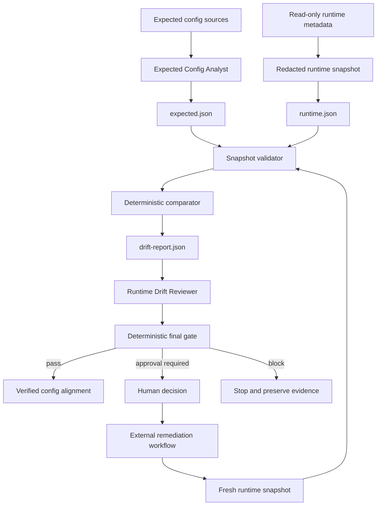

# Runtime Config Drift Gate

A reusable, tool-neutral AI engineering package for detecting configuration drift between repository/deployment intent and live runtime metadata without exposing raw secrets.

## Problem
AI coding and operations agents frequently assume that the configuration declared in source control is the configuration actually running. Real systems can drift because of manual portal edits, stale environment variables, secret rotations, deployment overrides, chart/value precedence, platform settings, emergency incident changes, or partial rollouts. Build/test success does not prove runtime configuration matches intent.

This package creates a fail-closed evidence gate that compares an expected configuration baseline with a redacted runtime snapshot and produces a deterministic decision before release, rollout continuation, configuration remediation, or incident closure.

## Purpose
- Separate declared configuration from observed runtime state.
- Normalize comparable values deterministically.
- Preserve secret confidentiality by using presence/fingerprint evidence instead of plaintext.
- Detect missing, unexpected, mistyped, changed, or differently sourced configuration.
- Require independent review for high-severity drift.
- Stop before dangerous remediation actions and require explicit human approval.
- Distinguish drift detection, remediation execution, and post-remediation verification.

## When to use
- Before production/staging release or rollout continuation.
- After changing configuration sources, deployment manifests, environment variables, or secret metadata.
- During production incident investigation where environment/configuration drift is suspected.
- Before closing a configuration-related incident.
- During migrations between configuration providers or deployment platforms.
- When AI agents rely on configuration facts to plan implementation or debugging.

## When not to use
- As a secrets manager.
- As an automatic runtime configuration writer.
- As a replacement for application-level health checks.
- When the expected source of truth is intentionally undefined.
- For arbitrary file-diffing unrelated to effective runtime configuration.

## Architecture



## Component responsibilities
- `skills/expected-config-baseline.md`: procedure for discovering source precedence, classifying keys, redacting secrets, and building the expected snapshot.
- `skills/runtime-drift-review.md`: procedure for reviewing runtime drift and applying the final gate.
- `rules/runtime-config-governance.md`: enforceable safety, evidence, approval, and verification rules.
- `subagents/expected-config-analyst.md`: owns expected-source discovery and baseline construction.
- `subagents/runtime-drift-reviewer.md`: independently evaluates redacted runtime evidence and gate results.
- `workflows/runtime-config-drift-workflow.md`: end-to-end bounded workflow.
- `hooks/runtime-config-hooks.md`: pre-release, post-change, and incident-closure hook contracts.
- `config/drift-policy.json`: redaction patterns, normalization rules, severities, and gate thresholds.
- `schemas/config-snapshot.schema.json`: portable snapshot contract.
- `scripts/build-config-snapshot.py`: creates a redacted snapshot from a JSON key/value source plus optional metadata.
- `scripts/validate-config-snapshot.py`: validates semantics and prevents obvious secret leakage.
- `scripts/compare-config-snapshots.py`: compares expected vs runtime entries and emits drift findings.
- `scripts/evaluate-drift-gate.py`: computes `pass`, `human-approval-required`, or `block`.
- `templates/config-snapshot.example.json`: copyable snapshot shape.
- `examples/staging-drift-example.json`: example drift scenario without secret disclosure.
- `tests/smoke-test.py`: end-to-end deterministic smoke test.

## Actual package tree

```text
runtime-config-drift-gate/
├── README.md
├── config/
│   └── drift-policy.json
├── examples/
│   └── staging-drift-example.json
├── hooks/
│   └── runtime-config-hooks.md
├── rules/
│   └── runtime-config-governance.md
├── schemas/
│   └── config-snapshot.schema.json
├── scripts/
│   ├── build-config-snapshot.py
│   ├── compare-config-snapshots.py
│   ├── evaluate-drift-gate.py
│   └── validate-config-snapshot.py
├── skills/
│   ├── expected-config-baseline.md
│   └── runtime-drift-review.md
├── subagents/
│   ├── expected-config-analyst.md
│   └── runtime-drift-reviewer.md
├── templates/
│   └── config-snapshot.example.json
├── tests/
│   └── smoke-test.py
└── workflows/
    └── runtime-config-drift-workflow.md
```

## Installation
Copy this directory into a repository. Python 3.9+ is sufficient for the deterministic scripts; they use only the standard library.

No cloud SDK, secrets manager SDK, or deployment provider is required by the core package. Provider-specific collection should produce the neutral snapshot contract instead of being embedded into the core workflow.

## Configuration
Edit `config/drift-policy.json` to match repository conventions:
- `freshness_minutes`: maximum acceptable runtime evidence age for your integration workflow.
- `secret_name_patterns`: key-name patterns that must be classified as `secret`.
- `normalization`: deterministic comparison behavior.
- `severity`: base severity by drift kind.
- `critical_key_patterns`: keys whose drift should be elevated.
- `blocking_severities`: findings that block without a valid exception.
- `approval_severities`: findings requiring explicit human approval before remediation/acceptance.
- `require_independent_review_for`: severities requiring reviewer independence.

Do not weaken secret classification solely to make a snapshot validate.

## Snapshot contract
Each snapshot identifies:
- `application`
- `environment`
- `snapshot_kind`: `expected` or `runtime`
- `producer`
- `generated_at`
- `sources`
- normalized `entries`

Each entry includes key, classification, required flag, presence, source, and value type. Non-secret entries may include `value`. Secret entries must not include `value`; they may include an externally generated safe `fingerprint`.

A fingerprint is evidence of equality/inequality, not permission to reveal the original secret.

## Permissions
The detector needs only:
- repository read access;
- read-only access to deployment/configuration metadata;
- read-only access to runtime configuration metadata sufficient to produce a redacted snapshot.

The package does not require production write permissions. If a remediation needs production config changes, secret rotation, infrastructure edits, or security changes, stop and obtain explicit human approval in the external remediation workflow.

## Usage

### 1. Build an expected snapshot from a neutral JSON export

```bash
python scripts/build-config-snapshot.py \
  --input expected-values.json \
  --metadata expected-metadata.json \
  --policy config/drift-policy.json \
  --application payments-api \
  --environment staging \
  --kind expected \
  --producer expected-config-analyst \
  --source deploy/staging \
  --output expected.json
```

`expected-metadata.json` can classify keys as `secret`, mark required keys, override source metadata, and supply safe fingerprints.

### 2. Build or adapt a runtime snapshot
Use a read-only platform adapter or export to create `runtime-values.json`, then run the builder with `--kind runtime`. Never export plaintext secrets merely to satisfy comparison.

### 3. Validate both snapshots

```bash
python scripts/validate-config-snapshot.py --snapshot expected.json --policy config/drift-policy.json
python scripts/validate-config-snapshot.py --snapshot runtime.json --policy config/drift-policy.json
```

### 4. Compare

```bash
python scripts/compare-config-snapshots.py \
  --expected expected.json \
  --runtime runtime.json \
  --policy config/drift-policy.json \
  --output drift-report.json
```

### 5. Review and gate
Create a small review file, for example:

```json
{
  "reviewer": "runtime-drift-reviewer",
  "status": "verified",
  "exceptions": []
}
```

Then run:

```bash
python scripts/evaluate-drift-gate.py \
  --report drift-report.json \
  --policy config/drift-policy.json \
  --review review.json \
  --output gate-result.json
```

Exit codes:
- `0`: pass
- `1`: blocked
- `2`: invalid input/tool error
- `3`: human approval required

## Drift categories
The comparator can emit:
- `missing-runtime`
- `unexpected-runtime`
- `type-mismatch`
- `value-mismatch`
- `fingerprint-mismatch`
- `source-mismatch`
- `presence-mismatch`

The policy converts these into severity levels. Required-key absence and secret mismatches are elevated by default.

## Exceptions
Exceptions belong in the review artifact, not in the expected snapshot. An exception should be narrow and include at least:
- key;
- drift kind;
- environment;
- approval status;
- approver evidence in your surrounding workflow;
- expiry timestamp.

The core gate accepts only policy-approved statuses and still requires matching environment/kind/expiry fields. Do not auto-renew exceptions.

## Workflow
1. Identify application/environment scope.
2. Discover expected configuration sources and precedence.
3. Build and validate expected snapshot.
4. Collect a read-only runtime snapshot.
5. Validate both snapshots.
6. Compare deterministically.
7. Independently review high-severity drift.
8. Run the final gate.
9. Stop on `block` or `human-approval-required`.
10. If a human approves remediation, perform it outside this package.
11. Collect a fresh runtime snapshot.
12. Repeat comparison and gate.

## Approval boundaries
Explicit human approval is required before:
- production configuration changes;
- secret rotation or secret-store writes;
- infrastructure modifications;
- weakening authentication/security controls;
- accepting critical drift as an exception;
- copying configuration across environments;
- any irreversible or destructive remediation.

Detection and verification remain read-only.

## Failure handling
- Transient runtime metadata/API read failure: retry once and preserve the first error.
- Deterministic script transient execution failure: retry once.
- Validation failure: stop; do not retry blindly.
- Secret leakage detected: discard unsafe artifact, avoid echoing the value, and stop.
- Permission failure: stop; never silently increase privileges.
- Source precedence ambiguity: stop and request human resolution.
- Real drift: preserve evidence and route through review/approval rather than retrying.

There are no infinite loops.

## Verification
Success is evidence-based:
- both snapshots validate;
- secrets are absent from plaintext snapshot fields;
- application/environment scopes match;
- drift report was generated deterministically;
- high-severity drift received independent review;
- required approvals/exceptions are valid;
- final gate returns `pass`;
- after remediation, a newly collected runtime snapshot passes the gate.

`configuration changed` is not equivalent to `configuration verified`.

## Smoke test
From the package root:

```bash
python tests/smoke-test.py
```

The test proves a clean configuration passes and a changed secret fingerprint is escalated to `human-approval-required`.

## Definition of Done
- Target scope and source precedence are documented.
- Expected snapshot exists and validates.
- Runtime snapshot exists, is redacted, and validates.
- No raw secret value appears in package artifacts.
- Drift report exists.
- Blocking drift is resolved or handled by an explicit valid approval/exception path.
- Independent review is complete where required.
- Final deterministic gate passes.
- If remediation was executed, a fresh post-change snapshot verifies the result.
- Remaining risks are documented and no blocking failure remains.

## Customization
Keep the core snapshot/compare/gate contracts tool-neutral. Add provider adapters outside the core package for Azure App Configuration, Kubernetes, Helm, Docker, Terraform, AWS, GCP, CI/CD systems, secret managers, or custom platforms. Adapters should emit redacted snapshots and must not teach the core comparator how to retrieve secrets.
