# Safe Database Migration Evidence Gate

## Problem
Database migrations can be syntactically valid and still be operationally unsafe. A migration may lock a hot table, drop or truncate data, rewrite a large column, add a non-null constraint without backfill, create an index with blocking behavior, or require an application rollout order that is not obvious from the SQL alone. AI coding agents make this worse when they generate a migration, see that tests pass, and treat that as proof that production execution is safe.

This kit turns schema/data changes into an evidence-based migration gate. It requires explicit impact classification, deterministic SQL inspection, dry-run/staging evidence, rollout and recovery planning, human approval for risky operations, and post-apply verification. It separates “migration generated” from “migration verified safe to apply.”

## Purpose
Use this package to review and prepare database migrations before merge or deployment. It is designed for SQL Server, PostgreSQL, EF Core migrations, hand-written SQL, migration frameworks, and mixed application/database rollout plans. The core workflow is tool-neutral; database-specific behavior is configured in policy and documented as assumptions rather than hidden magic.

## When to use
Use when a change includes any of the following:

- schema creation or alteration;
- table/column/index/constraint changes;
- data backfills or repair scripts;
- EF Core migrations;
- compatibility changes between old and new application versions;
- online/offline index operations;
- large-table updates;
- production data transformations;
- migration rollback or forward-fix planning.

## When not to use
Do not use this package as a replacement for a DBA or production change process on high-risk systems. It does not execute production migrations automatically. It also does not prove runtime performance without representative environment evidence.

## Architecture

```mermaid
flowchart LR
    Trigger[Migration proposed] --> Analyst[Migration Analyst]
    Analyst --> Manifest[Migration manifest]
    Manifest --> Static[Deterministic SQL inspection]
    Static --> DryRun[Dry-run / staging evidence]
    DryRun --> Reviewer[Migration Reviewer]
    Reviewer --> Gate{Gate status}
    Gate -->|revise| Analyst
    Gate -->|approval required| Human[Human approval]
    Human --> Verify[Pre-apply verification]
    Gate -->|safe non-prod| Verify
    Verify --> Apply[External deployment process]
    Apply --> Post[Post-apply verification]
```


### Component responsibilities

- `skills/migration-impact-assessment.md`: semantic blast-radius and compatibility analysis.
- `skills/migration-verification-planning.md`: evidence, rollout, rollback/forward-fix, and verification planning.
- `rules/database-migration-safety.md`: enforceable MUST/MUST NOT/SHOULD rules.
- `subagents/migration-analyst.md`: prepares migration evidence and manifest.
- `subagents/migration-reviewer.md`: independently challenges safety claims and gate readiness.
- `workflows/safe-database-migration.md`: end-to-end lifecycle with bounded retries and approvals.
- `hooks/migration-hooks.md`: deterministic lifecycle checks.
- `scripts/inspect-migration.py`: static scan of SQL/migration text for risky patterns.
- `scripts/validate-migration-manifest.py`: validates the evidence manifest and gate state.
- `config/migration-policy.json`: portable risk and approval policy.
- `schemas/migration-manifest.schema.json`: structured stage-handoff contract.
- `templates/migration-manifest.example.json`: realistic filled example.
- `templates/migration-review-report.md`: review output format.
- `examples/expand-contract-rollout.md`: practical zero/low-downtime rollout pattern.

## Package structure
```text
safe-database-migration-evidence-gate/
├── README.md
├── skills/
│   ├── migration-impact-assessment.md
│   └── migration-verification-planning.md
├── rules/
│   └── database-migration-safety.md
├── subagents/
│   ├── migration-analyst.md
│   └── migration-reviewer.md
├── workflows/
│   └── safe-database-migration.md
├── hooks/
│   └── migration-hooks.md
├── scripts/
│   ├── inspect-migration.py
│   └── validate-migration-manifest.py
├── config/
│   └── migration-policy.json
├── schemas/
│   └── migration-manifest.schema.json
├── templates/
│   ├── migration-manifest.example.json
│   └── migration-review-report.md
└── examples/
    └── expand-contract-rollout.md
```

## Installation
Copy this folder into the target repository, for example under `.ai-kit/safe-database-migration-evidence-gate/`. Python 3.10+ is required for the deterministic scripts; no third-party Python packages are required.

Keep project migration files in their native location. The kit only reads migration text and evidence manifests; it does not modify or execute migrations.

## Configuration
Edit `config/migration-policy.json` for your environment. Important fields:

- `destructive_patterns`: operations requiring explicit approval or prohibition;
- `approval_required_risks`: risk classes that cannot auto-pass;
- `max_revision_attempts`: bounded analyst/reviewer loop;
- `require_dry_run_for_risk_levels`: when staging/dry-run evidence is mandatory;
- `require_recovery_plan_for_risk_levels`: when rollback or forward-fix is mandatory;
- `allow_destructive_production_apply`: safe default is `false`;
- `large_table_row_threshold`: project-specific threshold for additional review;
- `supported_databases`: declared engines the local policy understands.

No database credentials are required by this package.

## Usage
### 1. Inspect migration text
```bash
python scripts/inspect-migration.py \
  --migration path/to/migration.sql \
  --policy config/migration-policy.json \
  --output artifacts/migration-inspection.json
```

For EF Core, generate the SQL using your existing repository command first, then inspect the generated SQL rather than relying only on C# migration code.

### 2. Fill the migration manifest
Copy `templates/migration-manifest.example.json` and replace the example values with evidence from the current migration.

### 3. Validate gate readiness
```bash
python scripts/validate-migration-manifest.py \
  --manifest artifacts/migration-manifest.json \
  --policy config/migration-policy.json
```

Exit codes:

- `0`: manifest satisfies deterministic policy;
- `2`: policy or evidence failure;
- `3`: malformed input/configuration or operational error.

A zero exit code does not itself authorize production execution. Human approval boundaries still apply.

## Workflow
1. Identify migration source, target database, environment, affected objects, and application versions involved.
2. Migration Analyst assesses compatibility, data-loss risk, lock/rewrite risk, rollout order, and existing production usage.
3. Generate SQL where the framework supports it; run `inspect-migration.py`.
4. Collect dry-run/staging evidence where required: execution duration, rows affected, lock behavior if measurable, generated plan/DDL, verification queries, and application compatibility checks.
5. Build the migration manifest with explicit facts, hypotheses, risks, evidence, recovery strategy, and approval needs.
6. Run manifest validation.
7. Migration Reviewer independently returns `pass`, `revise`, or `blocked`.
8. Revision loop is limited by policy (default two attempts). Repeated unresolved risk stops the workflow.
9. Any production schema/data mutation requires explicit human approval. Destructive production operations are blocked by default.
10. External deployment tooling applies the approved migration.
11. Post-apply verification compares schema/data/application evidence against expected outcomes.
12. Only then may status become `verified`.

## Approval boundaries
Explicit human approval is required before:

- applying any schema/data migration to production;
- dropping/truncating tables or columns;
- irreversible data transformation;
- rebuilding or altering large/hot objects with material lock risk;
- disabling constraints/security/audit protections;
- using a migration requiring downtime;
- changing database permissions or credentials;
- changing the public application contract as part of migration rollout.

The agent must stop at the approval checkpoint. It must not work around missing permissions, weaken safeguards, or silently switch to a more privileged database identity.

## Failure handling
- **Static inspection failure:** fix malformed input/config and retry once; do not treat tool failure as a safe result.
- **Validation failure:** analyst may revise evidence/plan up to `max_revision_attempts`; repeated same-class failure stops.
- **Dry-run failure:** preserve SQL, logs, error, timing, environment details; retry only once for a clearly transient environment issue.
- **Permission failure:** stop and report; never increase privilege automatically.
- **Reviewer disagreement:** at most two revisions. Persisting unresolved destructive/compatibility risk becomes `blocked`.
- **Post-apply verification failure:** do not report success. Execute only the pre-approved recovery/forward-fix process through the external change process.

## Verification
The package distinguishes four states:

- `prepared`: migration artifacts exist;
- `reviewed`: deterministic checks and independent review completed;
- `approved`: required human approval recorded;
- `verified`: post-apply evidence confirms expected state.

Verification may include:

- expected schema objects/columns/indexes/constraints exist;
- no unexpected objects disappeared;
- compatibility checks pass for old/new application versions during rolling deployment;
- data backfill row counts reconcile;
- null/duplicate/orphan checks meet acceptance criteria;
- representative application tests pass;
- migration duration/lock behavior stays within accepted operational bounds;
- recovery plan remains executable until the risk window closes.

## Definition of Done
The workflow is complete only when:

1. migration manifest exists and validates;
2. static inspection evidence exists;
3. required dry-run/staging evidence exists;
4. reviewer status is `pass`;
5. all required approvals are recorded;
6. production execution, if in scope, was performed by the authorized deployment process;
7. post-apply verification passed;
8. unresolved risks are either absent or explicitly accepted by an authorized human;
9. final status is `verified`, not merely `prepared` or `approved`.

## Customization
Adjust risk classifications and thresholds in `config/migration-policy.json`. Add project-specific verification commands to the workflow without embedding credentials. For database-specific online migration capabilities, document the exact supported engine/version and keep the general safety workflow unchanged.