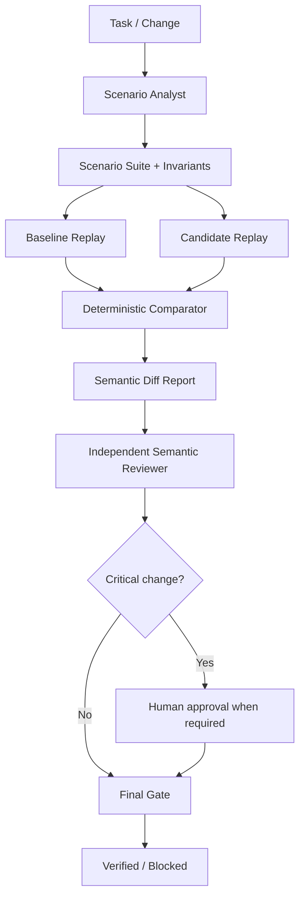

# Semantic Regression Oracle

A reusable AI-engineering gate for detecting business-behavior regressions that ordinary test suites can miss.

## Problem
A refactor, optimization, dependency change, serializer update, prompt/model change, or implementation rewrite can keep builds and tests green while changing what the system means: totals round differently, authorization decisions drift, ordering changes, historical compatibility breaks, or status transitions no longer obey domain invariants.

## Purpose
This package adds an evidence-backed semantic oracle around those changes. It captures observable scenarios and invariants, replays baseline and candidate behavior, performs deterministic comparison, then requires independent semantic review before the change is considered verified.

## When to use
Use for behavior-sensitive refactors, critical business logic, pricing/billing, authorization, public behavior, migration rewrites, rule engines, serializers, AI-generated transformations, or changes where implementation-focused tests are insufficient.

## When not to use
Do not use as a replacement for unit/integration/E2E tests, load testing, security testing, API compatibility tooling, or production monitoring. It complements them by validating behavior semantics.

## Architecture


## Component responsibilities
- `skills/semantic-scenario-design.md` — procedure for building evidence-backed golden scenarios and invariants.
- `skills/semantic-regression-review.md` — procedure for reviewing candidate-vs-baseline semantic differences.
- `rules/semantic-regression-safety.md` — enforceable safety and evidence rules.
- `subagents/scenario-analyst.md` — owns scenario discovery and baseline evidence.
- `subagents/semantic-reviewer.md` — independently verifies semantic compatibility.
- `workflows/semantic-regression-workflow.md` — end-to-end workflow, retries, approvals, failure paths, DoD.
- `hooks/semantic-regression-hooks.md` — lifecycle commands for validation, comparison, and final gate.
- `config/semantic-policy.json` — critical categories and gate behavior.
- `schemas/scenario-suite.schema.json` — machine-readable suite contract.
- `scripts/validate-scenario-suite.py` — stdlib-only semantic suite validator.
- `scripts/compare-semantic-results.py` — stdlib-only baseline/candidate comparator.
- `scripts/evaluate-semantic-gate.py` — reviewer/approval-aware final gate.
- `templates/scenario-suite.json` — reusable suite starter.
- `examples/semantic-regression-example.json` — concrete regression example.
- `tests/smoke-test.py` — self-test for validator, comparator, and final gate.

## Package tree
```text
semantic-regression-oracle/
├── README.md
├── skills/
│   ├── semantic-scenario-design.md
│   └── semantic-regression-review.md
├── rules/
│   └── semantic-regression-safety.md
├── subagents/
│   ├── scenario-analyst.md
│   └── semantic-reviewer.md
├── workflows/
│   └── semantic-regression-workflow.md
├── hooks/
│   └── semantic-regression-hooks.md
├── config/
│   └── semantic-policy.json
├── schemas/
│   └── scenario-suite.schema.json
├── scripts/
│   ├── validate-scenario-suite.py
│   ├── compare-semantic-results.py
│   └── evaluate-semantic-gate.py
├── templates/
│   └── scenario-suite.json
├── examples/
│   └── semantic-regression-example.json
└── tests/
    └── smoke-test.py
```

## Installation
Copy this directory into your repository. Python 3.9+ is sufficient; the executable scripts use only the standard library.

## Configuration
Edit `config/semantic-policy.json` to define:
- critical semantic categories;
- whether independent review is mandatory;
- whether critical allowed changes require human approval;
- maximum transient execution retries;
- fail-closed behavior for missing scenarios, suite mismatches, and invariant violations.

Do not store secrets in the policy or scenario files.

## Result contract
A baseline/candidate result file is intentionally simple:

```json
{
  "suite": "order-total-behavior@1.0.0",
  "results": {
    "order-total-rounding": {
      "total": 10.25,
      "currency": "USD"
    }
  }
}
```

The test harness that produces those results is project-specific. The semantic oracle remains tool-neutral.

## Comparison modes
- `exact` — values must be structurally equal.
- `numeric` — values must be numeric and within the scenario's absolute tolerance.
- `unordered` — arrays are compared as order-independent canonical values.
- `invariant` — equality is treated as a semantic invariant; drift is blocking by default.

Volatile fields should be excluded from assertions or explicitly listed as ignored scenario metadata. Never silently normalize unknown differences away.

## Usage
Validate a suite:

```bash
python scripts/validate-scenario-suite.py semantic-suite.json
```

Compare baseline and candidate:

```bash
python scripts/compare-semantic-results.py \
  --suite semantic-suite.json \
  --baseline baseline-results.json \
  --candidate candidate-results.json \
  --out semantic-report.json
```

After independent review, evaluate the gate:

```bash
python scripts/evaluate-semantic-gate.py \
  --report semantic-report.json \
  --review semantic-review.json \
  --policy config/semantic-policy.json
```

Run the package self-test:

```bash
python tests/smoke-test.py
```

## Example invocation for an AI coding agent
1. Read `rules/semantic-regression-safety.md`.
2. Use `skills/semantic-scenario-design.md` to derive scenarios from requirements/tests/history.
3. Have the Scenario Analyst produce the validated suite and baseline result.
4. Execute the candidate against the same suite.
5. Run the deterministic comparator.
6. Hand only the report plus evidence to the Semantic Reviewer; do not let the implementer be the sole verifier for critical changes.
7. Run the final gate.
8. Stop if the result is `blocked` or `human-approval-required`.

## Approval boundaries
Explicit human approval is required before accepting critical semantic changes such as:
- authorization/security behavior;
- billing or financial calculations;
- destructive-action semantics;
- breaking public behavior/contracts;
- any policy-designated critical invariant.

The package never grants authority to deploy, change production data, weaken security, or modify a baseline simply to obtain a passing result.

## Failure handling
- Transient execution/tool failure: retry once maximum and preserve the first failure evidence.
- Invalid suite/result identity: correct inputs; do not blindly retry.
- Missing baseline: block.
- Suite mismatch: block.
- Critical invariant violation: block.
- Ambiguous business intent: require human decision.
- Repeated environment failure: stop as `blocked-environment`.

There are no infinite autonomous loops.

## Verification
A run is verified only when:
- the scenario suite validates;
- baseline and candidate are tied to the same suite identity;
- all required scenarios produced comparable results;
- deterministic comparison completed;
- every changed critical scenario has a review decision;
- the reviewer is independent when policy requires it;
- critical allowed changes carry explicit evidence and required human approval;
- the final gate returns `verified`.

`Task executed` and `Task verified successfully` are deliberately separate states.

## Definition of Done
- Relevant semantic behavior and invariants were identified.
- Critical scenarios have evidence.
- Baseline provenance is preserved.
- Candidate replay uses the same suite.
- Comparator output exists.
- Independent review is complete.
- Required approvals exist.
- No blocking semantic difference remains.
- `python tests/smoke-test.py` passes.
- Final gate returns `verified`.

## Customization
Adapters may generate result JSON from ASP.NET Core tests, Playwright flows, CLI programs, SQL snapshots, event streams, prompts/models, or other systems. Keep those adapters project-specific; keep this package's core contracts and gate behavior tool-neutral.

For complex objects, extend `compare-semantic-results.py` with additional explicit comparison modes rather than introducing hidden normalization. Every ignored or tolerated difference should remain reviewable and policy-driven.