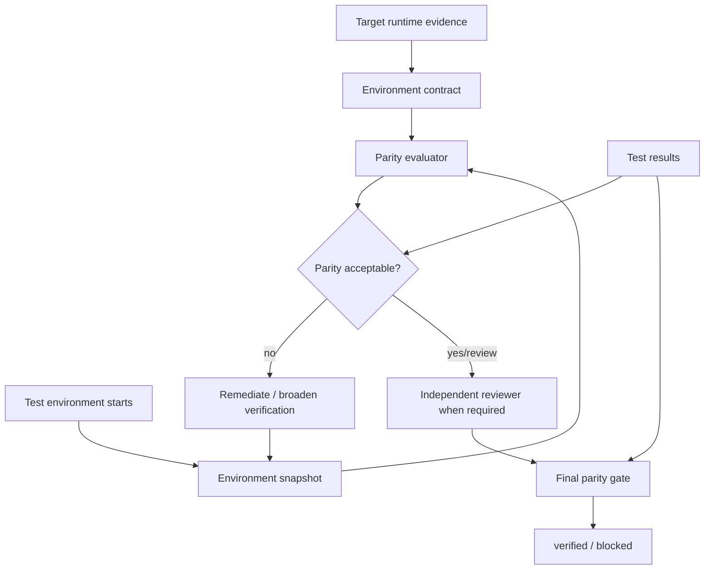

# Test Environment Parity Gate

A reusable, tool-neutral AI engineering package that prevents agents from treating green tests as production-grade evidence when the test environment differs materially from the target runtime.

## Problem
Tests can pass against a different database engine, broker, cache, browser, operating system, runtime version, provider emulator, or feature capability than production. AI coding agents often see only `tests passed` and silently promote that result into `verified`. This is unsafe when environment semantics affect correctness.

## Purpose
This kit makes environment parity explicit and deterministic. It defines a target contract, captures the actual test environment, computes parity gaps, forces remediation or broader verification, requires independent review for production/critical gaps, and exposes a fail-closed final gate.

## When to use
Use before release-relevant integration, E2E, performance or provider-dependent tests; after runtime/dependency/provider upgrades; after environment-only bugs; or whenever an AI agent uses test results to justify production confidence.

## When not to use
Pure unit tests that intentionally isolate all environment semantics do not need full parity evaluation by themselves. This package does not replace unit/integration/E2E tests, deployment controls, provider-native compatibility guarantees, or human approval.

## Architecture


## Package tree
```text
test-environment-parity-gate/
├── README.md
├── config/
│   └── parity-policy.json
├── examples/
│   ├── parity-review.example.json
│   └── test-environment.snapshot.json
├── hooks/
│   └── test-environment-parity-hooks.md
├── rules/
│   └── test-environment-parity-governance.md
├── schemas/
│   └── environment-contract.schema.json
├── scripts/
│   ├── capture-environment.py
│   ├── evaluate-parity-gate.py
│   └── evaluate-parity.py
├── skills/
│   ├── define-environment-contract.md
│   └── remediate-parity-gaps.md
├── subagents/
│   ├── environment-profiler.md
│   └── parity-reviewer.md
├── templates/
│   └── environment-contract.example.json
├── tests/
│   └── smoke-test.py
└── workflows/
    └── test-environment-parity-workflow.md
```

## Component responsibilities
- `skills/define-environment-contract.md`: derive behavior-relevant target expectations from authoritative evidence.
- `skills/remediate-parity-gaps.md`: resolve or compensate for mismatches without weakening the target.
- `rules/test-environment-parity-governance.md`: enforceable safety/evidence rules.
- `subagents/environment-profiler.md`: collects contracts/snapshots; cannot self-approve critical gaps.
- `subagents/parity-reviewer.md`: independent production/high-risk reviewer.
- `workflows/test-environment-parity-workflow.md`: bounded end-to-end execution.
- `hooks/test-environment-parity-hooks.md`: lifecycle checks.
- `scripts/capture-environment.py`: value-free local environment capture.
- `scripts/evaluate-parity.py`: deterministic provider/version/capability comparison.
- `scripts/evaluate-parity-gate.py`: binds parity, tests and independent review.
- `config/parity-policy.json`: thresholds, dimensions, retries and approval boundaries.
- `schemas/environment-contract.schema.json`: contract shape for external validators/editors.
- `tests/smoke-test.py`: behavioral verification.

## Dependencies
- Python 3.9+
- Python standard library only for deterministic scripts
- Repository/test tooling already needed by the project
- Optional read-only provider/runtime metadata for project-specific enrichment

## Installation
Copy the package directory into a repository. Create an `environment-contract.json` from `templates/environment-contract.example.json` and customize `config/parity-policy.json` for your stack.

The generic `capture-environment.py` safely captures host/runtime/tool metadata. Projects should enrich its JSON output with known database/cache/broker/browser/provider facts from the actual test harness, without secret values.

## Configuration
`config/parity-policy.json` defines default/production scores, critical dimensions, weights, independent-review triggers, retry budget and dangerous actions requiring approval.

Do not lower thresholds or remove critical dimensions merely to make a failing gate green. Policy changes that reduce production assurance should be reviewed like other security/release-control changes.

## Usage
### 1. Define the target contract
```bash
cp templates/environment-contract.example.json environment-contract.json
```
Populate only behavior-relevant facts supported by runtime/deployment evidence.

### 2. Capture the actual test environment
```bash
python scripts/capture-environment.py \
  --output artifacts/environment-snapshot.json \
  --name ci-integration \
  --source ci-job-123
```
Enrich project-specific dimensions from your test harness if the generic probe cannot detect them.

### 3. Run required tests
Run the repository's normal required unit/integration/E2E checks and retain an evidence reference. A test process exit code is execution evidence, not parity evidence.

### 4. Evaluate parity
```bash
python scripts/evaluate-parity.py \
  --contract environment-contract.json \
  --snapshot artifacts/environment-snapshot.json \
  --policy config/parity-policy.json \
  --output artifacts/parity-evaluation.json
```
Statuses:
- `verified`: no material gaps and score meets policy.
- `review-required`: non-critical gaps exist; independent review is required before final verification.
- `blocked`: critical required dimension is missing/mismatched or score is below threshold.

### 5. Remediate or broaden verification
Follow `skills/remediate-parity-gaps.md`. Examples: run PostgreSQL instead of SQLite, use a real browser/provider stage, verify broker acknowledgement/dead-letter behavior, or add staging validation for semantics an emulator cannot reproduce.

### 6. Independent review and final gate
Create a review based on `examples/parity-review.example.json`, bound to the evaluator fingerprints, then run:
```bash
python scripts/evaluate-parity-gate.py \
  --evaluation artifacts/parity-evaluation.json \
  --review artifacts/parity-review.json \
  --implementation-owner implementation-agent \
  --tests-status passed \
  --output artifacts/parity-gate.json
```
Only `verified` may be used as environment-parity completion evidence.

### 7. Verify the package
```bash
python tests/smoke-test.py
```
The smoke test proves: non-critical residual gaps require review; an approved current review can satisfy the gate; a missing critical database dimension blocks; a stale review fingerprint blocks.

## Environment contract model
Each dimension records:
- whether it is required;
- provider/engine identity;
- version expectation (the evaluator compares major versions by default);
- behavior-relevant capabilities.

Typical dimensions: runtime, OS, database, cache, message broker, browser, external provider and feature flags. Add project-specific dimensions only when they change behavior.

## Agent workflow semantics
The gate intentionally separates three claims:
1. **Task executed:** tests ran.
2. **Tests passed:** assertions were green in a known environment.
3. **Verified for target confidence:** tests passed and the environment was sufficiently representative, with required review.

An agent must not collapse these claims.

## Approval boundaries
This package may recommend changing test infrastructure, but it does not authorize dangerous mutations. Explicit human approval is required before production deployment, destructive SQL, database schema/data deletion, force push/history rewrite, infrastructure changes, secret changes, production configuration changes, breaking API changes, security weakening, irreversible migrations or large dependency upgrades.

## Failure and recovery
- Transient tool/environment startup/read failure: preserve evidence and retry at most once.
- Semantic/provider mismatch: no blind retry; remediate or broaden verification.
- Failed tests: fix/test/retest under the normal project workflow; do not call parity verified.
- Unknown required target fact: block production-target assurance.
- Snapshot changed after review: old review is stale; re-evaluate/review.
- Permission failure: stop; never silently increase permissions.
- Remediation loop: maximum two parity remediation cycles before escalation/block.

## Verification
Success requires all of the following:
- target contract exists and is evidence-based;
- snapshot represents the environment that produced the test result;
- required tests passed;
- critical required dimensions have no unresolved gaps;
- parity score meets policy;
- any residual review-required gaps have current independent approval;
- reviewer differs from implementation owner where required;
- review fingerprints match current contract/snapshot;
- final gate returns `verified`.

## Definition of Done
The workflow is complete when the current target contract and test snapshot exist, required tests pass, deterministic parity evaluation is acceptable, critical gaps are resolved, independent review is current when required, no approval boundary has been bypassed, and `scripts/evaluate-parity-gate.py` returns `verified`.

## Security and privacy
Do not record connection strings, access tokens, passwords, private keys, secret environment-variable values or sensitive payloads. Presence/name/version/capability metadata is sufficient for parity. Use least-privilege read-only metadata access.

## Portability
The core procedures and Python scripts are tool-neutral and can be called by OpenAI Codex, Claude Code, Cursor, ChatGPT, GitHub Copilot, OpenCode, custom agents or CI pipelines. Tool-specific adapters should only translate environment evidence into the contract/snapshot; they must not redefine the gate semantics.

## Customization
Adapt dimensions and weights to actual risk. A frontend project may weight browser/device differences highly; a .NET backend may emphasize .NET runtime, SQL Server/PostgreSQL, Redis, RabbitMQ and container/OS behavior; a provider integration may require real-provider staging evidence. Keep the core invariants: explicit target, current snapshot, deterministic gap evaluation, bounded remediation, independent review for high risk, and evidence-based final verification.
