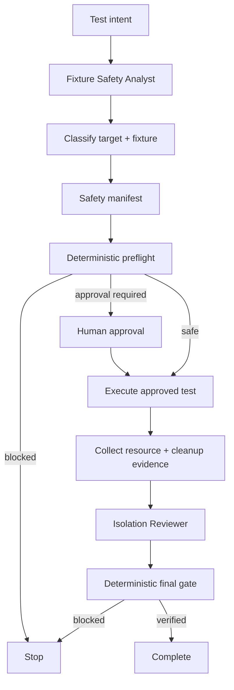

# Test Fixture Data Safety Guard

## Problem
AI agents and automated tests can accidentally target shared or production-like systems, reuse real customer data, send real notifications, or run cleanup logic with a scope wider than the test itself. A green test result does not prove that test data was safe or isolated.

## Purpose
Provide a reusable preflight and post-run safety gate for integration, API, Playwright, E2E, migration, and other stateful tests. The kit classifies environment and fixture provenance, requires isolation/reset evidence, blocks unsafe targets by default, and independently verifies cleanup after execution.

## When to use
- Integration/API/E2E/Playwright tests that mutate persistent state
- Test suites that run against shared QA/staging environments
- Fixture builders, seed scripts, reset scripts, or migration tests
- Tests that call queues, storage, email/SMS, payment, or external APIs
- Agent-driven test generation where target selection may be inferred from repository configuration

## When not to use
Pure unit tests with no persistent state, external side effects, or environment-dependent fixtures generally do not need this gate.

## Architecture


## Component responsibilities
- `skills/fixture-safety-assessment.md` — pre-execution environment/fixture/isolation assessment.
- `skills/isolation-verification.md` — post-run containment and cleanup verification procedure.
- `rules/test-data-safety.md` — enforceable MUST/MUST NOT/SHOULD rules.
- `subagents/fixture-safety-analyst.md` — owns preflight evidence, not execution.
- `subagents/isolation-reviewer.md` — independently verifies post-run isolation.
- `workflows/test-fixture-safety-workflow.md` — complete bounded workflow.
- `hooks/hooks.md` — pre-test, post-run, cleanup, and CI hooks.
- `config/test-data-safety-policy.json` — environment/provenance classifications, approval conditions, retry limits.
- `schemas/safety-manifest.schema.json` — structured manifest contract.
- `scripts/validate-safety-manifest.py` — deterministic fail-closed preflight validator.
- `scripts/evaluate-isolation-gate.py` — deterministic post-run verification gate.
- `templates/safety-manifest.example.json` — reusable manifest starter.
- `examples/isolation-review.example.json` — reviewer output example.
- `tests/smoke-test.py` — checks safe, blocked-fixture, and leakage paths.

## Actual package tree
```text
test-fixture-data-safety-guard/
├── README.md
├── skills/
│   ├── fixture-safety-assessment.md
│   └── isolation-verification.md
├── rules/
│   └── test-data-safety.md
├── subagents/
│   ├── fixture-safety-analyst.md
│   └── isolation-reviewer.md
├── workflows/
│   └── test-fixture-safety-workflow.md
├── hooks/
│   └── hooks.md
├── scripts/
│   ├── validate-safety-manifest.py
│   └── evaluate-isolation-gate.py
├── config/
│   └── test-data-safety-policy.json
├── schemas/
│   └── safety-manifest.schema.json
├── templates/
│   └── safety-manifest.example.json
├── examples/
│   └── isolation-review.example.json
└── tests/
    └── smoke-test.py
```

## Installation
Copy this folder into the repository. Python 3.9+ is sufficient for the deterministic scripts; they use only the standard library.

Recommended working files in the consuming repository:
```text
.ai/test-data-safety.json
.ai/test-isolation-review.json
```

## Configuration
Edit `config/test-data-safety-policy.json` to match repository-specific terminology while preserving fail-closed behavior. Typical safe defaults are ephemeral/dedicated-test targets with synthetic/generated fixtures.

Do not move production or unknown targets into `safe_environments` merely to unblock CI. Production-like exceptions should remain visible approval decisions.

## Dependencies
- Python 3.9+
- Repository/environment metadata sufficient to identify the real target
- A project-specific way to capture created resource IDs and cleanup evidence

The core workflow is tool-neutral. Playwright, xUnit, NUnit, pytest, Postman/Newman, Cypress, API clients, Docker, Testcontainers, or CI systems can invoke the same gates.

## Permissions
Preflight requires read-only access to repository/config/environment metadata. Test execution should use the least-privileged test credential possible. The verifier should not receive broader mutation permissions merely to inspect isolation.

## Usage
1. Copy the manifest template:
```bash
cp templates/safety-manifest.example.json .ai/test-data-safety.json
```
2. Replace target, fixture, mutations, isolation, cleanup, side effects, and approval evidence with real values.
3. Run preflight:
```bash
python scripts/validate-safety-manifest.py \
  --manifest .ai/test-data-safety.json \
  --policy config/test-data-safety-policy.json
```
4. Execute the declared test only when the decision permits it.
5. Record post-run evidence and create the independent review record.
6. Run final verification:
```bash
python scripts/evaluate-isolation-gate.py \
  --manifest .ai/test-data-safety.json \
  --review .ai/test-isolation-review.json \
  --policy config/test-data-safety-policy.json
```

## Example invocation for an agent
> Assess the planned Playwright test using `skills/fixture-safety-assessment.md`. Do not launch the test until `validate-safety-manifest.py` returns `safe` or explicit required approval is recorded. After execution, hand the evidence to the Isolation Reviewer and require `evaluate-isolation-gate.py` to return `verified` before claiming completion.

## Workflow
The detailed workflow is in `workflows/test-fixture-safety-workflow.md`. The essential state progression is:

```text
unknown
  ↓
assessed
  ↓
safe | human-approval-required | blocked
  ↓
executed
  ↓
cleanup-attempted
  ↓
reviewed
  ↓
verified | blocked
```

`executed` is never equivalent to `verified`.

## Approval boundaries
Explicit human approval is required before operations such as:
- production or production-like mutation
- destructive database reset/bulk delete/queue purge
- real email/SMS/payment/external production API side effects
- use of sensitive production-derived data even when sanitized handling is proposed
- secret or permission changes
- cleanup broader than the declared run isolation boundary

The default policy blocks production and raw production-derived fixture usage rather than treating approval as an automatic override.

## Failure handling
- Transient metadata/tool read failure: retry at most once.
- Test infrastructure transient failure: at most one rerun; use a new run ID unless the prior run is proven cleaned.
- Cleanup transient failure: retry the exact scoped cleanup once.
- Validation failure, isolation mismatch, unknown provenance, or business-rule failure: do not retry blindly.
- Permission failure: do not silently increase privileges.
- Cross-boundary mutation: stop, preserve resource IDs/evidence, and escalate.

No workflow stage retries indefinitely.

## Verification
A run is verified only when:
- preflight safety decision was valid before mutation
- target and fixture match the approved manifest
- isolation boundary is evidenced
- all created resources are accounted for
- cleanup/reset is scoped to the run and verified
- adjacent non-test data is unchanged
- unexpected external side effects are absent
- independent reviewer evidence is complete
- final deterministic gate returns `verified`

Run the package self-test:
```bash
python tests/smoke-test.py
```

## Definition of Done
- Environment classification is explicit and evidence-backed.
- Fixture provenance is explicit and permitted by policy.
- Run ID and isolation boundary exist.
- Mutations and side effects are enumerated.
- Cleanup strategy is scoped to the test run.
- Required approval was obtained before execution.
- Test execution evidence was captured.
- Cleanup and adjacent-data isolation were independently reviewed.
- Final gate returned `verified`.
- No unresolved production/sensitive-data/leakage risk remains.

## Customization
Adapt policy classifications, side-effect categories, fixture provenance labels, and evidence collection to the repository. Keep the core invariants: unknown is unsafe, production data is not test data, cleanup must be scoped, approval precedes dangerous actions, and independent evidence is required before declaring isolation verified.