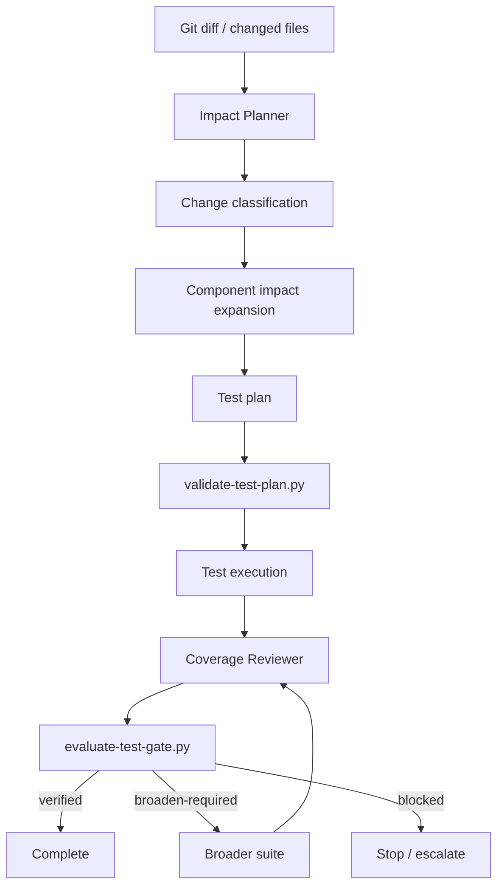

# Test Selection Impact Planner

A reusable AI engineering kit for selecting the smallest defensible test set for a change without turning selective testing into a coverage shortcut.

## Problem
AI coding agents often choose tests ad hoc: run the nearest unit test, infer coverage from filenames, or stop after a green targeted suite. This misses transitive impact, public contracts, shared infrastructure, migrations, security boundaries, dependency changes, and test-discovery failures.

This package creates an evidence-backed change-impact plan, forces broader fallback when confidence is insufficient, and separates planning from independent coverage verification.

## Purpose
Use structured agent behavior plus deterministic gates to answer:
- What changed?
- Which components can be affected?
- Which tests directly cover those components?
- Which broader suites are mandatory because of risk?
- When is targeted execution no longer defensible?
- Did the planned tests actually execute?
- Is the resulting evidence sufficient to claim verification?

## When to use
Use for feature work, bug fixes, refactors, dependency changes, CI optimization, agent-generated patches, pull requests, and pre-release verification.

## When not to use
Do not use this package to bypass repository-required CI, production safety gates, migration approvals, security review, or public-contract compatibility controls. For tiny documentation-only changes, full impact planning may be unnecessary if repository policy explicitly permits it.

## Architecture



## Package tree

```text
test-selection-impact-planner/
├── README.md
├── config/
│   └── test-selection-policy.json
├── examples/
│   ├── coverage-review.json
│   └── test-execution.json
├── hooks/
│   └── hooks.md
├── rules/
│   └── test-selection-governance.md
├── schemas/
│   ├── test-execution.schema.json
│   └── test-plan.schema.json
├── scripts/
│   ├── collect-changes.py
│   ├── evaluate-test-gate.py
│   └── validate-test-plan.py
├── skills/
│   ├── build-impact-map.md
│   └── review-test-coverage.md
├── subagents/
│   ├── coverage-reviewer.md
│   └── impact-planner.md
├── templates/
│   └── test-plan.example.json
├── tests/
│   └── smoke-test.py
└── workflows/
    └── impact-driven-test-selection.md
```

## Component responsibilities

### Impact Planner
Builds the change inventory, classifies risk, expands component impact, selects tests, and declares confidence/unresolved impact. It does not modify code or self-certify high-risk coverage.

### Coverage Reviewer
Independently checks whether the selected and executed tests are sufficient for the actual change. It can return `verified`, `broaden-required`, or `blocked`.

### Deterministic scripts
- `collect-changes.py` resolves the base ref, collects changed paths, and produces a stable SHA-256 fingerprint.
- `validate-test-plan.py` enforces required fields, mandatory suite triggers, confidence thresholds, and fallback rules.
- `evaluate-test-gate.py` checks plan/diff binding, selected test execution, test discovery, mandatory suites, reviewer status, unresolved impact, and reviewer independence.

## Installation
Copy this directory into a repository. Python 3.9+ and Git are sufficient for the deterministic core. No third-party Python packages are required.

Recommended local artifact directory:

```bash
mkdir -p artifacts
```

## Configuration
Edit `config/test-selection-policy.json` to match repository conventions.

Key settings:
- `minimum_confidence_for_targeted`
- `minimum_confidence_for_module`
- `high_risk_requires_independent_review`
- `unknown_impact_fallback`
- `path_classes`
- `mandatory_suites`
- `fallback_order`

Add explicit repository-specific mappings through the plan-building process rather than weakening fallback rules.

## Permissions
The core package requires read access to the repository and permission to execute local test commands. It does not require production credentials. Tests that need production access, real side effects, destructive SQL, infrastructure mutation, security weakening, or irreversible migration must stop for explicit human approval and use the appropriate safety workflow.

## Usage

### 1. Capture changes

```bash
python scripts/collect-changes.py \
  --base main \
  --output artifacts/changes.json
```

### 2. Build the plan
Use `skills/build-impact-map.md` and `subagents/impact-planner.md`. Start from `templates/test-plan.example.json` and bind `change_fingerprint` to `artifacts/changes.json`.

### 3. Validate the plan

```bash
python scripts/validate-test-plan.py \
  --plan artifacts/test-plan.json \
  --policy config/test-selection-policy.json
```

Do not execute a plan that fails validation.

### 4. Execute selected tests
Run every command in `selected_tests`, plus any repository-required CI checks. Record results using the shape in `schemas/test-execution.schema.json`. A successful process exit code is insufficient if zero tests were discovered or executed.

### 5. Independent review
Use `skills/review-test-coverage.md` and `subagents/coverage-reviewer.md`. For high-risk changes, the reviewer should differ from the plan author/implementation owner.

### 6. Final gate

```bash
python scripts/evaluate-test-gate.py \
  --plan artifacts/test-plan.json \
  --execution artifacts/test-execution.json \
  --review artifacts/coverage-review.json \
  --policy config/test-selection-policy.json
```

Exit codes:
- `0` → `verified`
- `10` → `broaden-required`
- `20` → `blocked`

Only one broaden-and-review cycle is allowed by the workflow. Repeated inability to establish adequate coverage stops the workflow and escalates.

## Example invocation for an AI coding agent

```text
Use the test-selection-impact-planner package.
Base ref: main.
Capture the current change fingerprint, classify every changed path, build an impact map with evidence, select targeted plus mandatory suites, validate the plan, execute the tests, then hand the evidence to an independent Coverage Reviewer. Do not claim completion unless evaluate-test-gate.py returns verified.
```

## Risk and fallback behavior
Targeted testing is allowed only when confidence meets policy and no unresolved impact remains. Shared infrastructure, dependency/build files, migrations, security-sensitive code, public contracts, and test configuration trigger broader mandatory suites.

Unknown impact is fail-safe: the default policy requires full fallback rather than assuming no impact.

## Failure handling
- Base ref cannot resolve → block.
- Changed-file inventory incomplete → block.
- Plan fingerprint differs from execution/review → rebuild plan.
- Low confidence → broaden test scope.
- Mandatory suite missing → block.
- Tests not discovered/executed → block.
- Test assertion or business-rule failure → block; do not auto-retry.
- Transient infrastructure/tool failure → preserve evidence and retry at most once.
- Reviewer requests broader coverage → one broader cycle, then block/escalate if still insufficient.

## Approval boundaries
This package authorizes test selection only. It never grants permission for production deployment, destructive database work, real external side effects, infrastructure changes, secret changes, breaking contracts, security weakening, or irreversible migrations. Those actions require explicit human approval even when the test gate is `verified`.

## Verification model
The package distinguishes:

**Task executed:** selected commands were invoked.

**Task verified successfully:** the current diff is bound to a valid plan, all required tests were discovered and executed, mandatory suites passed, unresolved impact is cleared, reviewer requirements are satisfied, and the deterministic gate returns `verified`.

## Definition of Done
- Current diff fingerprint captured.
- Every changed path classified.
- Impacted components have evidence and confidence.
- Mandatory risk triggers applied.
- Test plan validates.
- Selected and mandatory tests executed successfully.
- Required tests were actually discovered.
- No blocking unresolved impact remains.
- Independent review is verified when required.
- Final gate returns `verified`.
- No dangerous action was performed without human approval.

## Smoke test

```bash
python tests/smoke-test.py
```

The smoke test validates a representative plan and proves three branches: `verified`, `broaden-required`, and `blocked` when a required test is reported as not executed.

## Customization
Extend `path_classes` and `mandatory_suites` for repository-specific risks. Keep the core safety property intact: uncertainty must broaden coverage, not reduce it. For large monorepos, add explicit component-to-test mappings in your planning input while keeping the deterministic final gate unchanged.