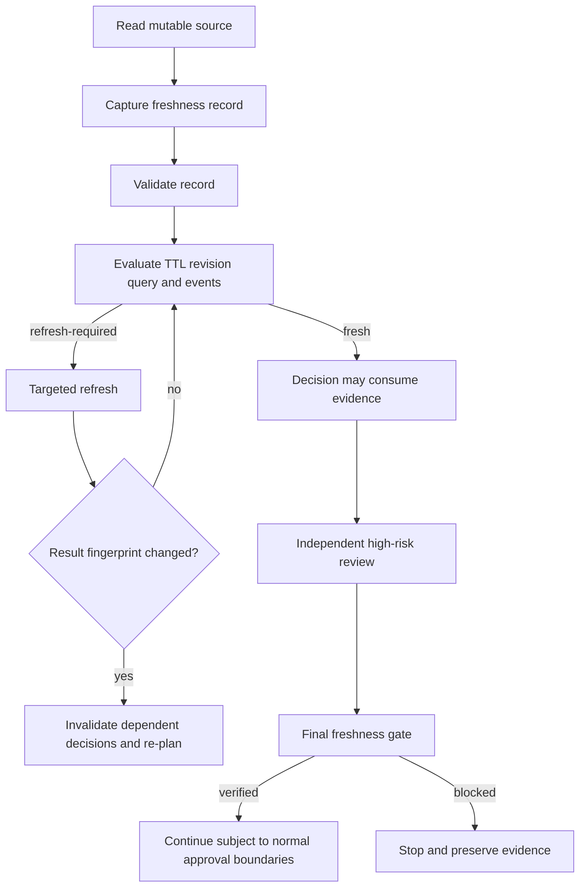

# Tool Result Freshness Gate

A reusable AI-engineering guardrail for preventing agents from making decisions with tool results that were correct when observed but became stale before planning, execution, retry/resume, approval, or final verification.

## Problem
Long-running and multi-step AI workflows often read mutable state early: repository HEAD, deployment status, logs, database rows, runtime configuration, approvals, CI results, incident state, issue metadata or external APIs. The workflow then keeps reasoning from that snapshot even after the underlying state changes. A successful earlier tool call is evidence of the past, not proof of the current state.

This package binds each decision-relevant mutable result to source identity, query/result fingerprints, observation time, source revision and invalidation conditions. Before reuse, deterministic scripts decide whether the evidence is still fresh, must be refreshed, or blocks progress.

## Purpose
- Prevent stale tool/API/log/query evidence from silently driving current decisions.
- Refresh only affected evidence instead of reloading unrelated context.
- Preserve old observations and changed-result history.
- Force re-planning when refreshed evidence changes.
- Separate `executed` from `verified`.
- Require independent freshness review for high-risk decisions.

## When to use
Use for coding agents, incident agents, deployment/release workflows, CI diagnosis, database investigation, configuration inspection, external API integrations, long-running agents, resumable tasks and multi-agent workflows where source state can change during execution.

## When not to use
Do not add freshness records to immutable local constants or artifacts whose immutability is already cryptographically bound and task-scoped. This package is not a cache implementation and does not replace transaction isolation, database locking, provider concurrency controls or approval systems.

## Architecture


## Component responsibilities
- `skills/capture-tool-result-freshness.md` — creates source/query/result/time bindings immediately after a mutable read.
- `skills/revalidate-stale-evidence.md` — refreshes only invalidated evidence and propagates changed results to dependent decisions.
- `rules/tool-result-freshness-governance.md` — enforceable MUST/MUST NOT/SHOULD rules.
- `subagents/freshness-curator.md` — owns record capture and refresh, but not independent high-risk verification.
- `subagents/freshness-reviewer.md` — independently reviews freshness/invalidation evidence.
- `workflows/tool-result-freshness-workflow.md` — end-to-end bounded workflow.
- `hooks/tool-result-freshness-hooks.md` — lifecycle integration points.
- `config/freshness-policy.json` — TTLs, high-risk decisions, invalidation defaults and retry policy.
- `schemas/freshness-record.schema.json` — structured record contract.
- `scripts/validate-freshness-record.py` — validates required fields, hashes, timestamps and sensitive-key hygiene.
- `scripts/evaluate-freshness.py` — evaluates TTL, source revision, invalidation events and query drift.
- `scripts/evaluate-freshness-gate.py` — verifies all required results plus independent review and approval presence.
- `templates/freshness-record.example.json` — copy-ready record example.
- `examples/current-state.example.json` — current source revision/query binding example.
- `examples/invalidation-events.example.json` — normalized invalidation-event input.
- `examples/freshness-review.example.json` — independent reviewer evidence example.
- `tests/smoke-test.py` — stdlib-only behavioral smoke test.

## Package tree
```text
tool-result-freshness-gate/
├── README.md
├── config/
│   └── freshness-policy.json
├── examples/
│   ├── current-state.example.json
│   ├── freshness-review.example.json
│   └── invalidation-events.example.json
├── hooks/
│   └── tool-result-freshness-hooks.md
├── rules/
│   └── tool-result-freshness-governance.md
├── schemas/
│   └── freshness-record.schema.json
├── scripts/
│   ├── evaluate-freshness-gate.py
│   ├── evaluate-freshness.py
│   └── validate-freshness-record.py
├── skills/
│   ├── capture-tool-result-freshness.md
│   └── revalidate-stale-evidence.md
├── subagents/
│   ├── freshness-curator.md
│   └── freshness-reviewer.md
├── templates/
│   └── freshness-record.example.json
├── tests/
│   └── smoke-test.py
└── workflows/
    └── tool-result-freshness-workflow.md
```

## Installation
Copy this directory into the repository or agent instruction workspace. Python 3.9+ is sufficient; runtime scripts use only the Python standard library.

No package installation, network client or vendor SDK is required by the deterministic layer.

## Configuration
Edit `config/freshness-policy.json` to match project volatility and risk:
- Lower `high` TTL for rapidly changing operational state.
- Add domain-specific high-risk decisions.
- Add invalidation events emitted by the repository, deployment, database, configuration or external systems.
- Keep `max_transient_refresh_retries` bounded; default is `1`.

Prefer revision/etag/commit/resource-version checks over TTL-only freshness whenever a provider exposes them.

## Permissions
Freshness collection should use least-privilege read access. This package does not grant mutation authority.

Explicit human approval remains required before production deployment, destructive SQL, database schema/data deletion, force push/history rewrite, infrastructure changes, secret changes, production configuration changes, breaking API contracts, weakened security controls, irreversible migrations and large dependency upgrades.

Freshness evidence never substitutes for those approvals.

## Usage
### 1. Validate a record
```bash
python scripts/validate-freshness-record.py evidence/result.json
```

### 2. Evaluate current freshness
```bash
python scripts/evaluate-freshness.py \
  --record evidence/result.json \
  --state evidence/current-state.json \
  --events evidence/invalidation-events.json \
  --policy config/freshness-policy.json
```

Possible evaluator status:
- `fresh` — current evidence may be consumed for the bound decision.
- `refresh-required` — evidence is stale or its binding no longer matches; refresh before reuse.
- `blocked` — malformed/missing evidence prevents safe determination.

### 3. Final gate
Aggregate evaluator outputs as a JSON array and supply independent review evidence:
```bash
python scripts/evaluate-freshness-gate.py \
  --evaluations evidence/evaluations.json \
  --review evidence/freshness-review.json \
  --policy config/freshness-policy.json
```

Only `verified` means freshness requirements are satisfied. The task itself may still require tests, build checks, contract/security verification and human approval.

### 4. Run package smoke test
```bash
python tests/smoke-test.py
```

The smoke test covers fresh evidence, TTL expiry, source revision drift, event invalidation and independent-review enforcement.

## Example invocation for an AI agent
1. Read deployment status and capture a freshness record.
2. Bind the result to deployment revision and the exact decision query.
3. Before deciding whether a later rollout step is safe, evaluate freshness.
4. If another deployment completed after the observation, mark the old status stale and refresh it.
5. If the refreshed result changed, return the affected rollout conclusion to planning.
6. For production decisions, require a separate Freshness Reviewer and normal human approval.
7. Claim `verified` only after the final freshness gate and the task-specific verification gates pass.

## Invalidation model
A result becomes stale when any configured condition applies, including:
- TTL exceeded for its volatility class.
- Source revision differs from the recorded revision.
- A matching invalidation event happened after `observed_at`.
- Current query/input fingerprint differs from the recorded query.
- Required source state is unavailable.

An existing path/resource ID is not proof that its contents or state are unchanged.

## Recovery
- Transient read/tool failure: preserve first failure and retry at most once by default.
- Source changed: do not retry until a desired value appears; refresh once and propagate the changed fact.
- Permission failure: stop without escalating privileges.
- Source unavailable: block high-risk dependent action.
- Repeated mutation during refresh: stop and escalate instead of looping.
- Changed fingerprint: invalidate dependent hypotheses/decisions and re-plan.

## Approval boundaries
The freshness workflow may discover that an approval is itself stale, updated or revoked. It must not create or extend approvals. Dangerous actions stop until the separate approval authority confirms a current, correctly scoped approval.

## Verification
Evidence-based success requires:
- Freshness records are structurally valid.
- Source/query/result bindings are explicit.
- Current state and invalidation events were checked.
- All required evaluator results are `fresh`.
- High-risk review is independent.
- Reviewer evidence covers every required result.
- Required human approval is present when declared necessary.
- Final gate returns `verified`.

## Definition of Done
- All decision-relevant mutable tool results in scope are recorded.
- No stale or unknown high-risk evidence remains in active use.
- Superseded evidence is preserved.
- Changed refreshed results have been propagated to dependent decisions.
- Retry budget has not been exceeded.
- Independent review exists for high-risk decisions.
- Final freshness gate is `verified`.
- Separate task-specific verification and dangerous-action approvals remain satisfied.

## Portability
Core instructions and scripts are tool-neutral. Adapters for Codex, Claude Code, Cursor, ChatGPT, GitHub Copilot, OpenCode or other agents should only translate lifecycle events/tool metadata into this package's files; they should not weaken freshness rules.

## Customization
Repositories can extend source kinds, event names, volatility TTLs and high-risk decision names while retaining these invariants: bind evidence to exact source/query/time, invalidate deterministically, preserve old evidence, refresh narrowly, stop on unknown high-risk freshness, and never equate execution with verification.
