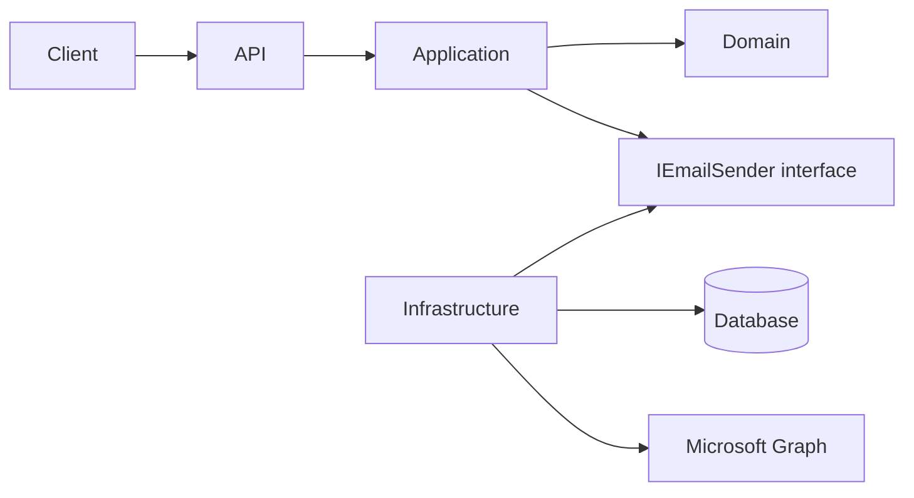
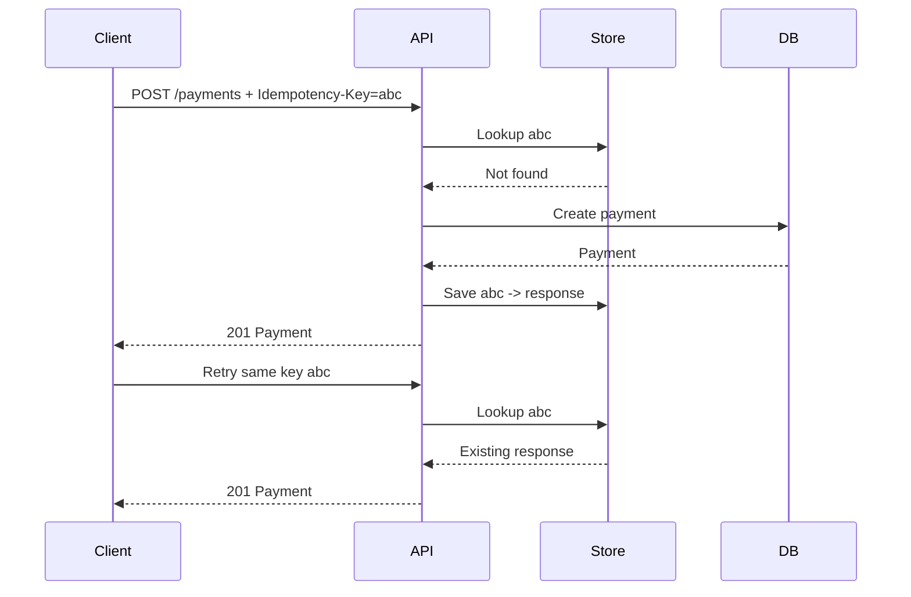
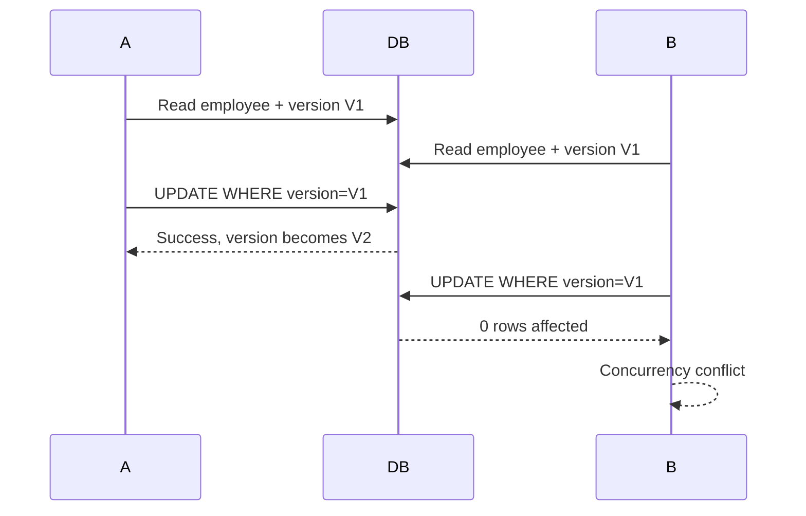
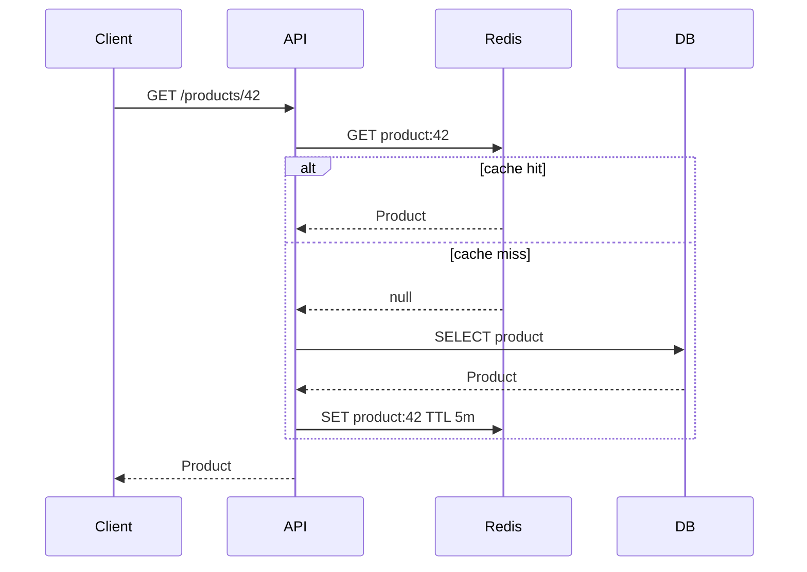
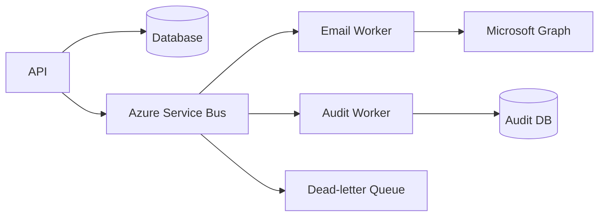
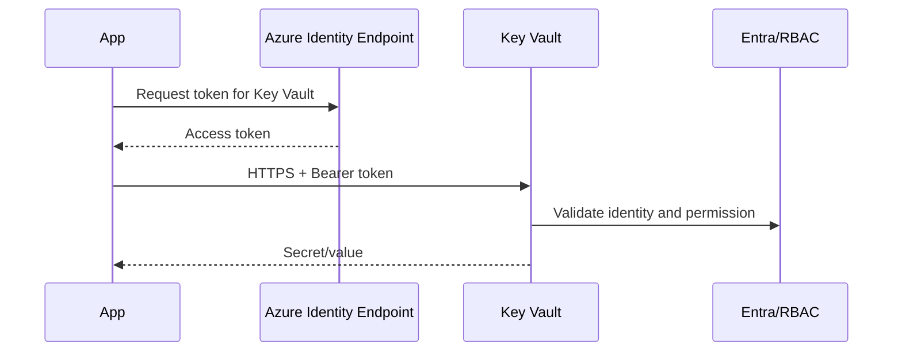
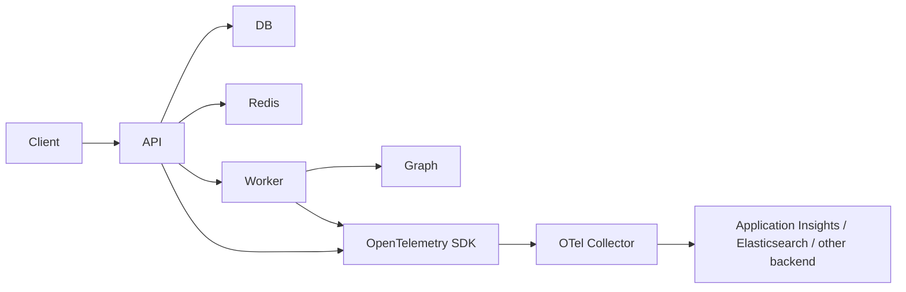
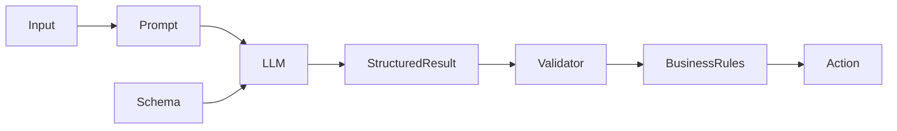
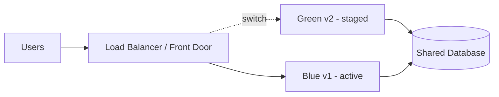

# Daily Knowledge Sharing — 2026-08-17

## Today’s Topics

1. Clean Architecture — boundary, dependency direction và nơi đặt business logic
2. Idempotency trong REST API — tránh xử lý lặp khi client retry
3. Database Indexing — thiết kế index theo workload thay vì “thấy chậm thì thêm index”
4. Optimistic Concurrency với EF Core — ngăn lost update
5. Redis Cache-Aside — hiệu năng, invalidation và failure mode
6. Azure Service Bus — reliable messaging và xử lý duplicate
7. Managed Identity — service-to-service authentication không dùng secret
8. OpenTelemetry — nối logs, metrics và traces để điều tra production
9. Structured Output khi tích hợp LLM — biến output AI thành dữ liệu có contract
10. Blue-Green Deployment — release an toàn và rollback nhanh

---

# 1. Clean Architecture — boundary và dependency direction

### 1. What is it?

Clean Architecture là cách tổ chức hệ thống sao cho **business rules không phụ thuộc framework, database, UI hay third-party service**. Giá trị cốt lõi không nằm ở số lượng project/folder, mà ở **dependency direction**.

Domain/Application định nghĩa điều hệ thống cần làm. Infrastructure cung cấp implementation cho database, email, Azure, file system, external API. API/UI chỉ là adapter để nhận input và trả output.

Một cách nhìn thực tế:

```text
API / UI
   │
   ▼
Application
   │
   ▼
Domain
   ▲
   │
Infrastructure implements abstractions defined inward
```

Domain không nên biết `DbContext`, `HttpClient`, Azure SDK hay ASP.NET Core.

### 2. Why does it exist?

Nếu business logic bị đặt trực tiếp trong Controller, Repository hoặc EF Core entity configuration, hệ thống sẽ nhanh chóng gặp các vấn đề:

* logic nghiệp vụ khó test nếu không chạy database hoặc web server;
* đổi PostgreSQL sang SQL Server hoặc thay provider third-party làm lan thay đổi vào business code;
* Controller phình lớn, vừa validate request, query DB, gọi API ngoài, vừa quyết định business rule;
* business rule bị duplicate ở API, background job và integration handler.

Naive solution thường là “chỉ cần chia folder `Controllers`, `Services`, `Repositories`”. Nhưng nếu `Service` vẫn phụ thuộc trực tiếp vào mọi implementation thì boundary thực tế vẫn chưa tồn tại.

### 3. How does it work?



Luồng dependency hợp lý:

1. API nhận HTTP request.
2. API chuyển request thành command/query.
3. Application orchestration use case.
4. Domain thực thi business rule.
5. Application gọi abstraction như `IEmployeeRepository`, `IEmailSender`.
6. Infrastructure implement abstraction bằng EF Core, Graph, Azure SDK...

Điểm quan trọng: **runtime call có thể đi ra Infrastructure, nhưng compile-time dependency vẫn hướng vào core**.

### 4. Practical example

```csharp
public sealed record DeactivateEmployeeCommand(Guid EmployeeId);

public interface IEmployeeRepository
{
    Task<Employee?> GetByIdAsync(Guid id, CancellationToken ct);
    Task SaveChangesAsync(CancellationToken ct);
}

public sealed class DeactivateEmployeeHandler
{
    private readonly IEmployeeRepository _employees;

    public DeactivateEmployeeHandler(IEmployeeRepository employees)
    {
        _employees = employees;
    }

    public async Task Handle(DeactivateEmployeeCommand command, CancellationToken ct)
    {
        var employee = await _employees.GetByIdAsync(command.EmployeeId, ct)
            ?? throw new InvalidOperationException("Employee not found");

        employee.Deactivate();
        await _employees.SaveChangesAsync(ct);
    }
}
```

`Employee.Deactivate()` chứa rule nghiệp vụ. Handler orchestration. EF Core implementation nằm Infrastructure.

### 5. Real production scenario

Trong hệ thống employee management, cùng use case “deactivate employee” có thể được gọi từ:

* admin portal;
* scheduled offboarding job;
* HR integration;
* bulk import.

Nếu business rule nằm trong Controller, ba luồng còn lại dễ bỏ qua rule. Khi rule nằm ở Domain/Application, tất cả entry point reuse cùng behavior.

### 6. Common mistakes

* Tạo 5–7 project chỉ để “trông giống Clean Architecture”.
* Domain reference EF Core attributes hoặc `IConfiguration`.
* Repository trả `IQueryable` ra Application khiến persistence concern leak vào core.
* Mọi class đều có interface dù không có boundary thực sự.
* Handler chỉ làm CRUD, còn business rule vẫn ở Controller.
* Ép mọi app nhỏ dùng architecture quá nặng.

### 7. Trade-offs

**Advantages**

* Business logic testable và ít phụ thuộc framework.
* Thay implementation external dễ hơn.
* Boundary rõ giúp code review và ownership tốt hơn.

**Costs / Risks**

* Nhiều abstraction, mapping và ceremony hơn.
* Team chưa hiểu boundary dễ tạo architecture “rỗng”.
* App CRUD đơn giản có thể bị overengineering.

### 8. Junior → Middle → Senior understanding

**Junior**

Hiểu layer nào chịu trách nhiệm gì và tránh đặt business rule trong Controller.

**Middle**

Biết thiết kế use case, dependency injection, repository abstraction hợp lý và test Application/Domain độc lập.

**Senior / Technical Lead**

Phải quyết định boundary theo business capability, biết khi nào cần Clean Architecture và khi nào vertical slice/modular monolith đơn giản hơn. Quan trọng nhất là kiểm soát coupling chứ không bảo vệ một folder structure cứng nhắc.

### 9. Key takeaway

* Clean Architecture là dependency rule, không phải template folder.
* Business rule nên sống ở nơi ít phụ thuộc technology nhất.
* Abstraction chỉ có giá trị khi nó bảo vệ một boundary thực sự.

---

# 2. Idempotency trong REST API

### 1. What is it?

Một operation là idempotent khi gửi cùng một logical request nhiều lần nhưng hệ thống vẫn tạo ra **một kết quả business duy nhất**.

HTTP `GET`, `PUT`, `DELETE` thường được thiết kế idempotent về semantics. `POST` thì không tự động idempotent, vì một retry có thể tạo duplicate payment, order hoặc background job.

### 2. Why does it exist?

Distributed systems luôn có failure không rõ trạng thái:

* client timeout nhưng server đã commit transaction;
* load balancer drop response;
* mobile network mất kết nối;
* SDK tự retry;
* message broker redeliver message.

Nếu client không biết request đã thành công hay chưa, hành vi an toàn thường là retry. Không có idempotency, retry có thể gây double charge hoặc duplicate records.

### 3. How does it work?



Một implementation tốt thường lưu:

* idempotency key;
* request fingerprint/hash;
* status processing/completed/failed;
* response payload hoặc resource ID;
* expiration time.

Nếu cùng key nhưng request body khác, nên reject vì client đang reuse key sai.

### 4. Practical example

```csharp
public async Task<IResult> CreatePayment(
    CreatePaymentRequest request,
    string idempotencyKey,
    CancellationToken ct)
{
    var existing = await db.IdempotencyRecords
        .SingleOrDefaultAsync(x => x.Key == idempotencyKey, ct);

    if (existing is not null)
        return Results.Json(existing.ResponseJson, statusCode: existing.StatusCode);

    await using var tx = await db.Database.BeginTransactionAsync(ct);

    var payment = new Payment(request.OrderId, request.Amount);
    db.Payments.Add(payment);

    var response = new { payment.Id, Status = "Created" };
    db.IdempotencyRecords.Add(IdempotencyRecord.Completed(
        idempotencyKey,
        JsonSerializer.Serialize(response),
        201));

    await db.SaveChangesAsync(ct);
    await tx.CommitAsync(ct);

    return Results.Created($"/payments/{payment.Id}", response);
}
```

Production version cần unique index trên idempotency key để chống race condition.

### 5. Real production scenario

Payment API nhận `POST /payments`. Request xử lý thành công nhưng response timeout. Frontend retry sau 5 giây.

Không idempotency: 2 payment records.

Có idempotency: lần hai trả lại resource đầu tiên. Đây là ví dụ điển hình nơi **network retry phải được thiết kế cùng data consistency**.

### 6. Common mistakes

* Chỉ kiểm tra “record đã tồn tại chưa” mà không có unique constraint.
* Idempotency key không scoped theo user/tenant/operation.
* Reuse cùng key cho payload khác nhau.
* Lưu key sau khi business transaction commit nên crash giữa hai bước tạo duplicate.
* Giữ key mãi mãi gây storage growth.
* Cho rằng broker “exactly once” nên consumer không cần deduplication.

### 7. Trade-offs

**Advantages**

* Retry an toàn hơn.
* Giảm duplicate side effects.
* Client behavior đơn giản hơn trong network failure.

**Costs / Risks**

* Cần storage và cleanup policy.
* Concurrency control phức tạp hơn.
* Một số operation không dễ replay response hoặc giữ response lâu.

### 8. Junior → Middle → Senior understanding

**Junior**

Hiểu retry có thể chạy cùng operation nhiều lần và `POST` không tự nhiên an toàn.

**Middle**

Biết dùng idempotency key, unique constraint, transaction và request fingerprint.

**Senior / Technical Lead**

Phải xác định idempotency boundary end-to-end: API, DB transaction, event publishing, payment provider và message consumer. Nếu chỉ API idempotent nhưng downstream side effect không idempotent thì hệ thống vẫn có thể duplicate.

### 9. Key takeaway

* Idempotency là chiến lược chống duplicate side effect, không chỉ là HTTP rule.
* Unique constraint thường là lớp phòng thủ quan trọng.
* Thiết kế retry và idempotency phải đi cùng nhau.

---

# 3. Database Indexing — thiết kế theo workload

### 1. What is it?

Index là cấu trúc dữ liệu phụ giúp database tìm row nhanh hơn mà không phải scan toàn bộ table. Với B-tree index phổ biến, database có thể seek vào vùng dữ liệu phù hợp thay vì đọc hàng triệu rows.

Nhưng index không miễn phí: mỗi `INSERT`, `UPDATE`, `DELETE` có thể phải duy trì thêm index pages.

### 2. Why does it exist?

Giả sử bảng `TimesheetEntry` có 10 triệu rows và API thường query:

```sql
SELECT Id, EmployeeId, WorkDate, Hours
FROM TimesheetEntry
WHERE EmployeeId = @EmployeeId
  AND WorkDate >= @From
  AND WorkDate < @To;
```

Không có index phù hợp, engine có thể scan table hoặc clustered index lớn. Khi workload tăng, I/O và latency tăng mạnh.

Naive approach là thêm index cho từng column. Điều này dễ tạo index bloat nhưng vẫn không phù hợp query pattern.

### 3. How does it work?

Với query trên, composite index hợp lý có thể là:

```sql
CREATE INDEX IX_TimesheetEntry_EmployeeId_WorkDate
ON TimesheetEntry(EmployeeId, WorkDate)
INCLUDE (Hours);
```

Logic:

```text
Predicate equality: EmployeeId
        ↓
Range predicate: WorkDate
        ↓
Covering column: Hours
```

Order của key columns quan trọng vì index được tổ chức theo prefix.

### 4. Practical example

Query chậm:

```sql
SELECT *
FROM Orders
WHERE CustomerId = 42
  AND CreatedAt >= '2026-08-01';
```

Index cải thiện:

```sql
CREATE INDEX IX_Orders_CustomerId_CreatedAt
ON Orders(CustomerId, CreatedAt)
INCLUDE (Status, TotalAmount);
```

Không nên mặc định `SELECT *`; nếu query chỉ cần vài cột, projection nhỏ hơn giảm I/O và giúp covering index thực tế hơn.

### 5. Real production scenario

Dashboard timesheet load 12 tháng lịch sử cho một employee. Latency từ 150 ms tăng lên 4 giây khi table đạt vài triệu rows.

Investigation đúng:

1. đo query duration;
2. xem actual execution plan;
3. kiểm tra scan/seek;
4. xem rows estimated vs actual;
5. xem logical reads;
6. thiết kế index theo predicate + sorting + projection;
7. đo lại.

Không nên bắt đầu bằng “thêm Redis” khi bottleneck là missing index.

### 6. Common mistakes

* Index mọi column.
* Không chú ý order trong composite index.
* Dùng function lên indexed column khiến predicate không sargable.
* Giữ quá nhiều overlapping indexes.
* Không xem write workload.
* Tin hoàn toàn vào missing-index recommendation mà không kiểm chứng.
* Không update statistics hoặc không nhìn cardinality estimate.

Ví dụ không tốt:

```sql
WHERE CAST(CreatedAt AS DATE) = @Date
```

Tốt hơn:

```sql
WHERE CreatedAt >= @Date
  AND CreatedAt < DATEADD(day, 1, @Date)
```

### 7. Trade-offs

**Advantages**

* Giảm I/O và latency đáng kể cho read path.
* Có thể hỗ trợ sort/filter/join hiệu quả.

**Costs / Risks**

* Tốn disk/memory.
* Write chậm hơn.
* Maintenance và fragmentation có thể tăng.
* Index tốt cho query A có thể không tốt cho query B.

### 8. Junior → Middle → Senior understanding

**Junior**

Hiểu index giúp read nhanh nhưng không miễn phí.

**Middle**

Biết đọc execution plan cơ bản, phân biệt seek/scan, composite index và covering index.

**Senior / Technical Lead**

Phải tối ưu theo workload tổng thể, không theo một query isolated. Cần cân bằng OLTP writes, analytical reads, storage, statistics và query variability.

### 9. Key takeaway

* Index theo query pattern, không theo danh sách column.
* Đo execution plan và logical reads trước/sau thay đổi.
* Mỗi index là trade-off giữa read performance và write/maintenance cost.

---

# 4. Optimistic Concurrency với EF Core

### 1. What is it?

Optimistic Concurrency giả định conflict hiếm. Thay vì lock row lâu, hệ thống cho nhiều user đọc cùng dữ liệu và phát hiện conflict khi update.

Trong SQL Server, `rowversion` là lựa chọn rất thực tế với EF Core.

### 2. Why does it exist?

Lost update xảy ra như sau:

```text
User A đọc Balance = 100
User B đọc Balance = 100
User A update -> 120
User B update -> 90
Kết quả cuối: 90
Update của A bị mất
```

Nếu business không chấp nhận overwrite im lặng, cần concurrency control.

### 3. How does it work?

EF Core có thể generate update dạng:

```sql
UPDATE Employee
SET Title = @p0
WHERE Id = @id
  AND RowVersion = @originalRowVersion;
```

Nếu row đã thay đổi, `RowVersion` mới khác original value nên affected rows = 0. EF Core ném `DbUpdateConcurrencyException`.



### 4. Practical example

```csharp
public class Employee
{
    public Guid Id { get; set; }
    public string Title { get; set; } = string.Empty;

    [Timestamp]
    public byte[] RowVersion { get; set; } = Array.Empty<byte>();
}
```

Handling:

```csharp
try
{
    await db.SaveChangesAsync(ct);
}
catch (DbUpdateConcurrencyException)
{
    return Results.Conflict(new
    {
        message = "The employee was modified by another user. Reload and retry."
    });
}
```

### 5. Real production scenario

Hai HR admins cùng mở employee profile. Một người đổi department, người khác đổi title dựa trên snapshot cũ.

Tùy requirement, hệ thống có thể:

* reject toàn bộ update;
* reload và yêu cầu user merge;
* merge theo field nếu conflict không overlap;
* retry tự động nếu operation deterministic và an toàn.

Concurrency policy là business decision, không chỉ là EF exception handling.

### 6. Common mistakes

* Catch exception rồi retry vô hạn bằng dữ liệu cũ.
* Dùng last-write-wins mà không biết business có chấp nhận không.
* Gửi entity từ client nhưng bỏ `RowVersion`.
* Dùng timestamp thời gian do app tự tạo thay cho concurrency token nhưng clock precision không đủ.
* Cho rằng database transaction tự động ngăn lost update trong mọi isolation level.

### 7. Trade-offs

**Advantages**

* Không giữ lock lâu.
* Tốt cho web app nơi conflict tương đối hiếm.
* Scale tốt hơn pessimistic locking cho nhiều use case.

**Costs / Risks**

* Conflict handling phức tạp.
* User có thể phải reload/re-enter data.
* Không phù hợp khi conflict rất thường xuyên và phải serialize access.

### 8. Junior → Middle → Senior understanding

**Junior**

Hiểu hai người cùng edit có thể overwrite nhau.

**Middle**

Biết cấu hình concurrency token và xử lý `DbUpdateConcurrencyException`.

**Senior / Technical Lead**

Phải chọn conflict policy theo domain: reject, merge, retry, queue hay serialize. Cũng cần phân biệt concurrency control trong database với distributed concurrency giữa nhiều service.

### 9. Key takeaway

* Optimistic concurrency phát hiện conflict thay vì ngăn conflict từ đầu.
* `rowversion` + EF Core là pattern thực tế cho SQL Server.
* Cách resolve conflict là business rule.

---

# 5. Redis Cache-Aside — performance và failure modes

### 1. What is it?

Cache-Aside là pattern trong đó application tự quản lý cache:

1. đọc Redis;
2. cache hit → trả dữ liệu;
3. cache miss → đọc database;
4. ghi dữ liệu vào Redis;
5. trả response.

Redis không thay database; nó là lớp tăng tốc nằm trước source of truth.

### 2. Why does it exist?

Một số query đọc lặp lại rất nhiều nhưng data thay đổi ít, ví dụ:

* office configuration;
* product details;
* permission metadata;
* lookup/reference data.

Đọc DB cho mọi request gây I/O không cần thiết và làm database trở thành bottleneck.

### 3. How does it work?



Khi update data, application thường:

```text
Update DB
   ↓
Invalidate cache key
```

Thứ tự và failure handling của hai bước này rất quan trọng.

### 4. Practical example

```csharp
public async Task<ProductDto?> GetProductAsync(int id, CancellationToken ct)
{
    var key = $"product:{id}";
    var cached = await cache.GetStringAsync(key, ct);

    if (cached is not null)
        return JsonSerializer.Deserialize<ProductDto>(cached);

    var product = await db.Products
        .AsNoTracking()
        .Where(x => x.Id == id)
        .Select(x => new ProductDto(x.Id, x.Name, x.Price))
        .SingleOrDefaultAsync(ct);

    if (product is null) return null;

    await cache.SetStringAsync(
        key,
        JsonSerializer.Serialize(product),
        new DistributedCacheEntryOptions
        {
            AbsoluteExpirationRelativeToNow = TimeSpan.FromMinutes(5)
        },
        ct);

    return product;
}
```

### 5. Real production scenario

SaaS có 20 instances API. In-memory cache riêng từng instance khiến user có thể nhận data khác nhau tùy request hit node nào. Redis distributed cache giúp các instance dùng chung cache state.

Nhưng khi Redis down, API không nên nhất thiết down theo. Với non-critical cache, fallback về DB có thể hợp lý — kèm rate protection để tránh cache outage biến thành database outage.

### 6. Common mistakes

* Cache data nhạy cảm mà key không include tenant/user scope.
* Không TTL.
* TTL của hàng nghìn key cùng hết hạn một lúc gây cache stampede.
* Serialize object quá lớn.
* Cache null quá lâu.
* Xóa cache trước khi DB commit rồi transaction rollback.
* Coi Redis là source of truth cho dữ liệu cần durability mà không thiết kế persistence.

### 7. Trade-offs

**Advantages**

* Giảm database load.
* Latency thấp.
* Scale reads tốt.

**Costs / Risks**

* Data stale.
* Invalidation khó.
* Thêm network hop và operational dependency.
* Cache outage có thể gây thundering herd vào DB.

### 8. Junior → Middle → Senior understanding

**Junior**

Hiểu hit, miss, TTL và source of truth.

**Middle**

Biết implement cache-aside, invalidation, key naming và fallback.

**Senior / Technical Lead**

Phải thiết kế freshness SLA, stampede protection, jitter TTL, observability, tenant isolation, degraded mode và capacity của Redis/DB khi cache miss hàng loạt.

### 9. Key takeaway

* Caching là consistency trade-off, không chỉ là performance trick.
* Invalidation và failure mode quan trọng hơn `GET/SET`.
* Luôn hỏi: nếu Redis down thì hệ thống sẽ làm gì?

---

# 6. Azure Service Bus — reliable messaging

### 1. What is it?

Azure Service Bus là managed message broker dành cho enterprise messaging. Nó cung cấp queue/topic, durable message, lock-based receive, dead-letter queue, duplicate detection và các feature phục vụ reliable asynchronous workflows.

### 2. Why does it exist?

Synchronous chain như:

```text
API -> Email service -> Graph -> Audit service -> Notification service
```

khiến latency và availability bị phụ thuộc vào tất cả downstream systems.

Nếu Graph timeout, request business chính cũng có thể fail dù việc gửi email có thể xử lý sau.

### 3. How does it work?



Với Peek-Lock mode:

1. consumer nhận message và lock tạm thời;
2. xử lý thành công → complete;
3. lỗi transient → abandon/retry;
4. lỗi lặp lại vượt max delivery → dead-letter.

Delivery thường mang semantics **at-least-once**, nên consumer cần idempotent.

### 4. Practical example

```csharp
var processor = client.CreateProcessor("employee-offboarding");

processor.ProcessMessageAsync += async args =>
{
    var evt = args.Message.Body.ToObjectFromJson<EmployeeOffboarded>();

    if (await processedStore.ExistsAsync(evt.EventId))
    {
        await args.CompleteMessageAsync(args.Message);
        return;
    }

    await exchangeService.ConvertMailboxToSharedAsync(evt.Email);
    await processedStore.MarkProcessedAsync(evt.EventId);
    await args.CompleteMessageAsync(args.Message);
};
```

### 5. Real production scenario

Khi employee bị deactivate:

```text
Employee DB transaction
        ↓
EmployeeOffboarded event
        ↓
Service Bus
   ├─ Exchange worker
   ├─ License cleanup worker
   └─ Audit worker
```

Nếu Exchange Online tạm lỗi, core employee state vẫn có thể commit; worker retry độc lập.

### 6. Common mistakes

* Consumer không idempotent.
* Retry mọi exception, kể cả validation/business poison message.
* Không monitor DLQ.
* Message chứa payload quá lớn.
* Lock duration không phù hợp với processing time.
* Không propagate correlation ID.
* Publish event sau DB commit nhưng không có outbox → crash giữa commit và publish làm mất event.

### 7. Trade-offs

**Advantages**

* Decoupling và resilience tốt.
* Buffer traffic spikes.
* Retry/DLQ rõ ràng.

**Costs / Risks**

* Eventual consistency.
* Debug flow khó hơn synchronous call.
* Cần idempotency, monitoring, replay strategy.
* Có thêm cloud cost và operational complexity.

### 8. Junior → Middle → Senior understanding

**Junior**

Hiểu producer, queue, consumer và retry.

**Middle**

Biết Peek-Lock, complete/abandon, DLQ, duplicate handling và worker lifecycle.

**Senior / Technical Lead**

Phải thiết kế delivery semantics, outbox/inbox, ordering, partitioning, poison-message policy, replay, observability và consistency boundary giữa database với broker.

### 9. Key takeaway

* Broker tách availability của producer khỏi consumer.
* At-least-once delivery nghĩa là duplicate là tình huống bình thường phải thiết kế.
* DLQ chỉ hữu ích nếu có monitoring và recovery process.

---

# 7. Managed Identity — authentication không dùng secret

### 1. What is it?

Managed Identity cho Azure resource một identity trong Microsoft Entra ID mà không cần developer tự quản lý password/client secret.

Ứng dụng chạy trên App Service, Function, VM hoặc Container Apps có thể lấy token để gọi Azure SQL, Key Vault, Storage hoặc service hỗ trợ Entra authentication.

### 2. Why does it exist?

Client secret gây nhiều rủi ro:

* leak qua config/log/source code;
* phải rotate;
* hết hạn gây outage;
* nhiều môi trường dẫn đến secret sprawl.

Managed Identity chuyển credential lifecycle cho Azure quản lý.

### 3. How does it work?



Hai loại thường gặp:

* **System-assigned**: lifecycle gắn với resource.
* **User-assigned**: identity độc lập, có thể gán cho nhiều resources.

### 4. Practical example

```csharp
using Azure.Identity;
using Azure.Security.KeyVault.Secrets;

var credential = new DefaultAzureCredential();
var client = new SecretClient(
    new Uri("https://my-vault.vault.azure.net/"),
    credential);

KeyVaultSecret secret = await client.GetSecretAsync("GraphConfig");
```

Local development, `DefaultAzureCredential` có thể dùng developer login; trên Azure nó có thể dùng Managed Identity.

### 5. Real production scenario

ASP.NET Core App Service cần đọc Azure Key Vault và truy cập Blob Storage.

Thay vì:

```text
App Settings -> CLIENT_SECRET -> Entra -> Token
```

có thể dùng:

```text
App Service Managed Identity
        ↓ RBAC
Key Vault / Storage
```

Không còn secret cần rotate trong application config.

### 6. Common mistakes

* Enable Managed Identity nhưng quên gán RBAC role.
* Gán role quá rộng như Owner/Contributor khi chỉ cần Data Reader.
* Nhầm management-plane role với data-plane role.
* Cho rằng Managed Identity tự vượt firewall/private endpoint.
* Không biết identity nào đang được chọn khi có nhiều user-assigned identities.
* Production code fallback sang secret âm thầm khiến team tưởng đang dùng Managed Identity.

### 7. Trade-offs

**Advantages**

* Giảm secret management.
* Rotation do platform quản lý.
* Tích hợp tốt với Azure RBAC.

**Costs / Risks**

* Chủ yếu hữu ích trong Azure ecosystem.
* Permission/debug có thể khó với team chưa quen Entra/RBAC.
* Networking vẫn phải cấu hình riêng.

### 8. Junior → Middle → Senior understanding

**Junior**

Hiểu authentication của service không nhất thiết phải dùng password/secret.

**Middle**

Biết bật identity, cấu hình RBAC và dùng `DefaultAzureCredential`.

**Senior / Technical Lead**

Phải thiết kế least privilege, separation giữa environments, user-assigned vs system-assigned identity, auditability, private networking và fallback policy.

### 9. Key takeaway

* Managed Identity loại bỏ nhiều secret nhưng không loại bỏ authorization design.
* RBAC và networking vẫn là hai lớp riêng biệt.
* Ưu tiên least privilege, không cấp quyền rộng chỉ để “cho chạy”.

---

# 8. OpenTelemetry — logs, metrics và traces

### 1. What is it?

OpenTelemetry là tập chuẩn và SDK để instrument application theo ba tín hiệu observability chính:

* **Logs** — chuyện gì đã xảy ra;
* **Metrics** — hệ thống đang khỏe hay không;
* **Traces** — một request đi qua những service nào và mất thời gian ở đâu.

Nó giúp giảm coupling giữa application code và một vendor monitoring cụ thể.

### 2. Why does it exist?

Một production incident thường không thể giải bằng log text rời rạc.

Ví dụ API latency tăng từ 300 ms lên 5 s. Log cho biết request thành công nhưng không chỉ ra:

* DB mất 4 s?
* Redis timeout?
* Graph API chậm?
* thread pool starvation?

Distributed trace cho phép nhìn toàn bộ request path.

### 3. How does it work?



Một trace gồm nhiều span. Trace ID được propagate qua HTTP headers/message metadata để nối các service.

### 4. Practical example

```csharp
builder.Services.AddOpenTelemetry()
    .WithTracing(tracing => tracing
        .AddAspNetCoreInstrumentation()
        .AddHttpClientInstrumentation()
        .AddEntityFrameworkCoreInstrumentation())
    .WithMetrics(metrics => metrics
        .AddAspNetCoreInstrumentation()
        .AddHttpClientInstrumentation());
```

Custom activity:

```csharp
using var activity = ActivitySource.StartActivity("ProcessEmployeeOffboarding");
activity?.SetTag("employee.id", employee.Id);
activity?.SetTag("mail.action", action);
```

Không nên tag PII hoặc secret tùy tiện.

### 5. Real production scenario

Incident: employee offboarding API thỉnh thoảng mất 25 giây.

Trace cho thấy:

```text
HTTP POST /employees/offboard        25.2s
 ├─ SQL UPDATE                         80ms
 ├─ Service Bus publish               40ms
 └─ Graph API call                  24.8s
```

Ngay lập tức thấy Graph call đang nằm trong synchronous path — một architecture smell nếu operation đó có thể xử lý async.

### 6. Common mistakes

* Log mọi thứ nhưng không có correlation/trace ID.
* High-cardinality metric labels như `userId`, gây cost explosion.
* Trace sampling quá thấp khiến incident hiếm biến mất.
* Trace sampling 100% ở traffic rất lớn gây cost cao.
* Instrumentation nhưng không có alert/SLO.
* Log secret, token, PII.

### 7. Trade-offs

**Advantages**

* Vendor-neutral instrumentation.
* Debug distributed system hiệu quả.
* Nối technical symptom với request path.

**Costs / Risks**

* Telemetry volume và cost.
* Sampling cần tuning.
* Instrument sai có thể tạo noise hoặc leak data.

### 8. Junior → Middle → Senior understanding

**Junior**

Biết khác nhau giữa log, metric và trace.

**Middle**

Biết instrument ASP.NET Core, HttpClient, EF Core và propagate context.

**Senior / Technical Lead**

Phải thiết kế telemetry taxonomy, sampling, retention, SLI/SLO, privacy, incident workflow và cost governance.

### 9. Key takeaway

* Logs nói “what”, metrics nói “how much/how often”, traces nói “where”.
* Observability tốt phải hỗ trợ điều tra incident, không phải chỉ thu thập dữ liệu.
* Cardinality, sampling và data privacy là production concerns thật sự.

---

# 9. Structured Output trong LLM Integration

### 1. What is it?

Structured Output là cách yêu cầu model trả dữ liệu theo schema xác định, ví dụ object JSON có các field bắt buộc, thay vì free-form text rồi application tự parse bằng regex.

Nó đặc biệt quan trọng khi AI output đi vào workflow deterministic như database write, API call hoặc automation.

### 2. Why does it exist?

Prompt kiểu:

```text
Return category, confidence and explanation as JSON.
```

không đảm bảo model luôn trả JSON hợp lệ. Model có thể thêm markdown fence, đổi field name hoặc trả string thay vì number.

Nếu downstream code phụ thuộc format, free-form output trở thành reliability risk.

### 3. How does it work?



Điểm quan trọng là tách:

* AI quyết định phần fuzzy như classification/summarization;
* deterministic code validate business invariants và quyết định side effects.

### 4. Practical example

Schema C#:

```csharp
public sealed record TicketClassification(
    string Category,
    double Confidence,
    string Reason);
```

Sau khi nhận structured result:

```csharp
if (result.Confidence < 0.80)
{
    return ReviewDecision.RequiresHumanReview(result);
}

if (!AllowedCategories.Contains(result.Category))
{
    throw new InvalidOperationException("Unexpected category");
}

return ReviewDecision.AutoRoute(result.Category);
```

Không nên để model tự quyết định “confidence > 0.8 thì gửi email” bằng natural language. Threshold và action phải nằm trong code.

### 5. Real production scenario

AI đọc support ticket và route tới Billing, Account, Technical hoặc Security.

Safe architecture:

```text
Ticket
  ↓
LLM classification
  ↓ structured schema
Validation
  ↓
Deterministic routing rules
  ├─ confidence high -> route
  └─ confidence low  -> human review
```

Nếu model trả category không hợp lệ, hệ thống reject hoặc fallback thay vì silently gửi sai queue.

### 6. Common mistakes

* Dùng regex parse free-form output.
* Tin rằng schema-valid nghĩa là factually correct.
* Không validate enum/range/business constraints sau model output.
* Cho model trực tiếp gọi high-risk action mà không có policy layer.
* Retry vô hạn khi model output invalid.
* Ghi prompt hoặc document chứa sensitive data vào log mà không redaction.

### 7. Trade-offs

**Advantages**

* Integration ổn định hơn.
* Dễ test và version contract.
* Giảm parsing ambiguity.

**Costs / Risks**

* Schema càng chặt có thể hạn chế biểu đạt.
* Model vẫn có thể tạo giá trị “đúng schema nhưng sai nghĩa”.
* Cần validation, evaluation và fallback.

### 8. Junior → Middle → Senior understanding

**Junior**

Hiểu AI output cần được validate giống input từ external system.

**Middle**

Biết define schema, deserialize, validate và fallback.

**Senior / Technical Lead**

Phải xác định trust boundary: model được phép quyết định gì, deterministic code kiểm soát gì, khi nào cần human approval, audit, evaluation và failure recovery.

### 9. Key takeaway

* Structured Output giải quyết format reliability, không giải quyết truthfulness.
* AI nên nằm sau validation và trước deterministic action policy.
* Treat model output as untrusted external input.

---

# 10. Blue-Green Deployment — release và rollback

### 1. What is it?

Blue-Green Deployment duy trì hai environment gần như giống nhau:

* **Blue** — version hiện đang phục vụ production traffic;
* **Green** — version mới được deploy và kiểm tra.

Khi Green đạt yêu cầu, traffic được switch từ Blue sang Green. Nếu có sự cố, switch ngược lại nhanh hơn rollback bằng cách redeploy binary cũ.

### 2. Why does it exist?

In-place deployment có risk:

* deployment nửa chừng;
* instance chạy mixed version;
* downtime khi restart;
* rollback chậm;
* bug chỉ xuất hiện sau khi production traffic vào.

Blue-Green giảm blast radius ở bước deploy artifact, nhưng không tự giải quyết mọi risk của database migration.

### 3. How does it work?



Flow:

1. deploy v2 vào Green;
2. run health check/smoke test;
3. đảm bảo schema backward compatible;
4. switch traffic;
5. monitor errors/latency/business metrics;
6. nếu lỗi, route traffic về Blue.

### 4. Practical example

ASP.NET Core release có migration thêm column:

```sql
ALTER TABLE Employee
ADD PreferredName nvarchar(100) NULL;
```

Đây là backward-compatible hơn việc rename/drop column ngay lập tức.

Release strategy tốt thường theo **expand → migrate → contract**:

```text
Release A: add new schema, old app vẫn chạy được
Release B: app dùng schema mới
Release C: cleanup schema cũ sau khi an toàn
```

### 5. Real production scenario

SaaS deploy version mới lúc 14:00. Green vượt smoke test và nhận 100% traffic. Sau 3 phút, metric payment failure tăng từ 0.2% lên 8%.

Nếu schema vẫn backward compatible, router có thể đưa traffic về Blue ngay. Nếu migration đã drop column mà Blue cần, “rollback application” không còn thực sự an toàn.

### 6. Common mistakes

* Nghĩ Blue-Green = zero risk.
* Chia hai app environments nhưng dùng destructive DB migration ngay lập tức.
* Không warm cache/JIT trước switch.
* Health check chỉ kiểm tra process alive, không kiểm tra dependency quan trọng.
* Session state lưu local memory làm user mất session khi switch.
* Không monitor business KPI sau release.

### 7. Trade-offs

**Advantages**

* Rollback traffic nhanh.
* Giảm deployment downtime.
* Có môi trường staging gần production để smoke test.

**Costs / Risks**

* Tốn thêm infrastructure tạm thời hoặc thường trực.
* Database compatibility phức tạp.
* Background jobs cần tránh chạy duplicate ở cả Blue và Green.
* Stateful workload khó hơn stateless web app.

### 8. Junior → Middle → Senior understanding

**Junior**

Hiểu hai environment và traffic switch.

**Middle**

Biết health checks, deployment slots, warm-up và rollback procedure.

**Senior / Technical Lead**

Phải thiết kế backward-compatible database migration, state management, queue consumers, feature flags, monitoring, rollback criteria và blast radius. Release strategy là system design concern, không chỉ CI/CD config.

### 9. Key takeaway

* Blue-Green giúp rollback application nhanh, nhưng database có thể phá khả năng rollback.
* Expand-contract migration là kỹ thuật quan trọng đi kèm.
* Release chỉ hoàn tất sau khi production telemetry chứng minh version mới khỏe.
