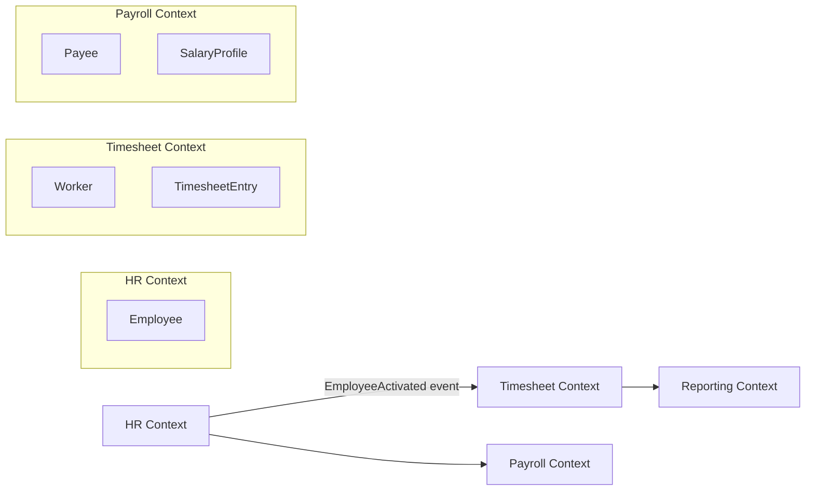
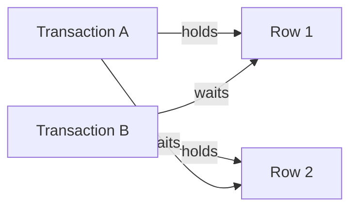
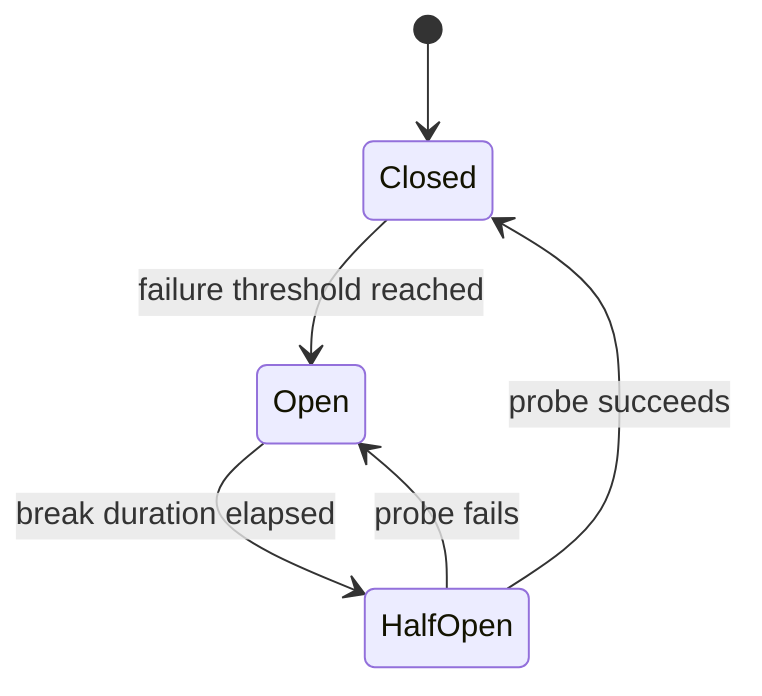
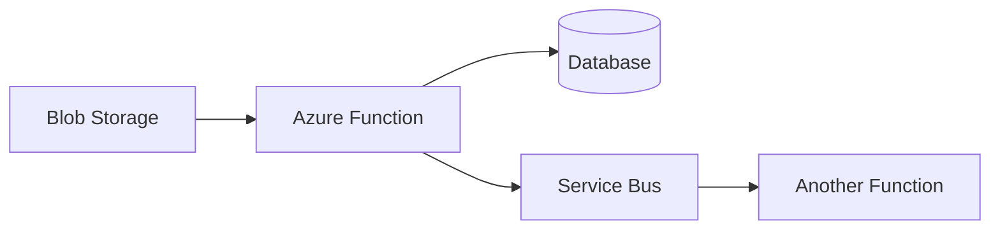
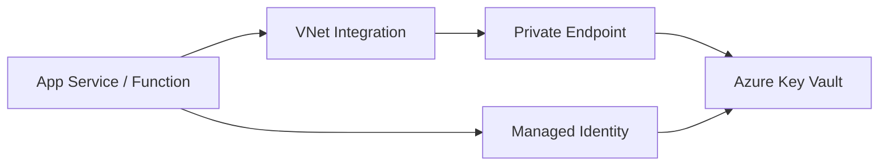
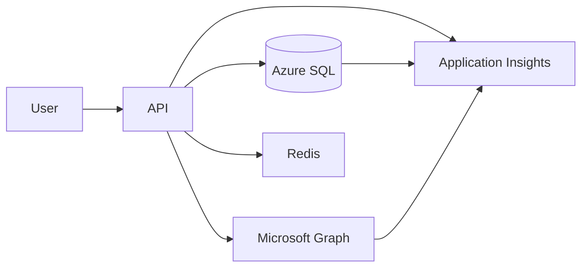
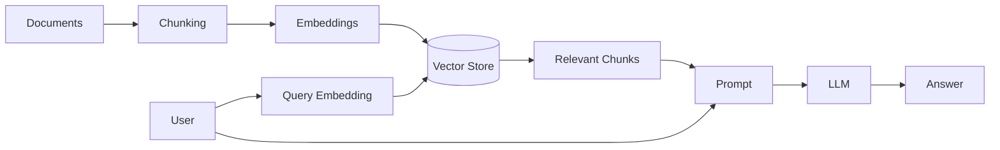
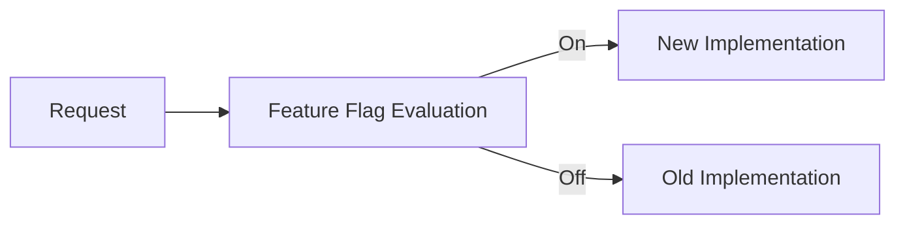
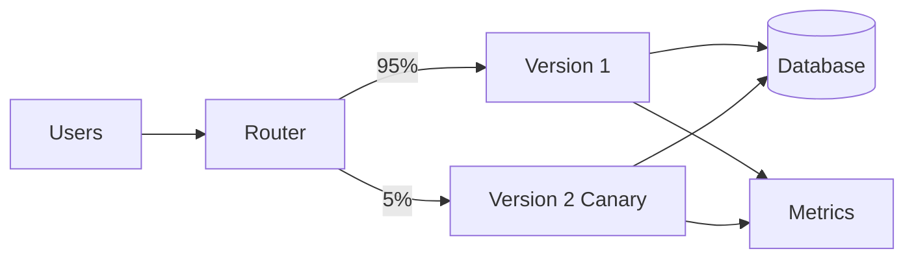

# Daily Knowledge Sharing — 2026-08-17

## Today’s Topics

1. Domain-Driven Design (DDD) — Bounded Context và Ubiquitous Language
2. API Versioning — giữ backward compatibility trong production
3. Isolation Levels & Deadlocks — consistency, locking và cách xử lý thực tế
4. Circuit Breaker — chặn cascade failure khi downstream lỗi
5. Azure Functions — khi nào dùng thay vì App Service hoặc Background Worker
6. Azure Key Vault + Private Endpoint — quản lý secret an toàn trong production
7. Application Insights — điều tra latency và failure theo request dependency
8. RAG — kết hợp LLM với dữ liệu nội bộ mà không nhồi toàn bộ context
9. Feature Flags — tách deployment khỏi release
10. Canary Deployment — giảm blast radius khi phát hành version mới

---

# 1. Domain-Driven Design (DDD) — Bounded Context và Ubiquitous Language

### 1. What is it?

Domain-Driven Design là cách thiết kế phần mềm xoay quanh **business domain** thay vì xoay quanh database table hoặc framework. Hai khái niệm quan trọng nhất để áp dụng thực tế là **Ubiquitous Language** và **Bounded Context**.

Ubiquitous Language nghĩa là developer, BA, PO và domain expert dùng cùng một bộ từ vựng. Nếu business gọi là `Leave Request`, code cũng nên phản ánh đúng khái niệm đó thay vì dùng tên mơ hồ như `FormEntity` hoặc `RequestModel`.

Bounded Context là ranh giới mà bên trong đó một model có ý nghĩa nhất quán. Cùng một từ như `Employee` có thể mang nghĩa khác nhau trong HR, Payroll và Timesheet.

### 2. Why does it exist?

Khi hệ thống lớn dần, một model dùng cho mọi nơi thường trở thành “god model”. Ví dụ `Employee` chứa hàng chục field phục vụ HR, payroll, attendance, identity, benefits và reporting.

Kết quả:

* thay đổi payroll làm ảnh hưởng timesheet;
* cùng một field có nghĩa khác nhau ở từng module;
* rule bị nhét vào service khổng lồ;
* team tranh luận do cùng dùng một từ nhưng hiểu khác nhau.

DDD giải quyết bằng cách chia domain theo ngữ nghĩa business thực tế, không chỉ chia theo technical layer.

### 3. How does it work?



Điểm quan trọng: các context có thể dùng **model riêng** thay vì dùng chung một entity toàn hệ thống.

### 4. Practical example

Trong Timesheet context:

```csharp
public sealed class Timesheet
{
    private readonly List<TimesheetEntry> _entries = new();

    public Guid EmployeeId { get; }
    public DateOnly WeekStart { get; }
    public IReadOnlyCollection<TimesheetEntry> Entries => _entries;

    public void AddEntry(DateOnly workDate, decimal hours)
    {
        if (hours <= 0 || hours > 24)
            throw new DomainException("Hours must be between 0 and 24.");

        _entries.Add(new TimesheetEntry(workDate, hours));
    }
}
```

Domain object phản ánh rule thực tế thay vì chỉ là DTO chứa getter/setter.

### 5. Real production scenario

Trong employee platform:

* HR quyết định trạng thái Active/Inactive;
* Timesheet chỉ cần biết employee có được phép submit giờ không;
* Payroll quan tâm salary profile;
* Microsoft 365 integration quan tâm email/license/account state.

Nếu tất cả dùng chung `Employee` aggregate và cùng database transaction, coupling sẽ rất cao. Tách bounded context giúp mỗi module thay đổi độc lập hơn.

### 6. Common mistakes

* Nghĩ DDD = tạo folder `Domain`, `Application`, `Infrastructure`.
* Dùng entity chung cho mọi context.
* Tạo Value Object/Aggregate cho mọi thứ dù domain đơn giản.
* Không nói chuyện với domain expert nhưng vẫn tự đặt thuật ngữ business.
* Dùng event chỉ để “trông giống DDD”.
* Aggregate quá lớn, load cả object graph cho mọi operation.

### 7. Trade-offs

**Advantages**

* Model gần business hơn.
* Boundary rõ, giảm coupling.
* Dễ ownership theo team/module.

**Costs / Risks**

* Tốn effort discovery và modeling.
* Mapping giữa context tăng.
* Có thể dẫn đến eventual consistency.
* Overengineering nếu domain chỉ là CRUD đơn giản.

### 8. Junior → Middle → Senior understanding

**Junior**

Hiểu entity business không chỉ là row database; tên trong code nên phản ánh business language.

**Middle**

Biết nhận diện aggregate, value object, boundary và tránh shared model quá mức.

**Senior / Technical Lead**

Phải xác định bounded context dựa trên business capability, ownership, consistency boundary và change rate. Quan trọng hơn pattern là tìm đúng boundary để hệ thống có thể tiến hóa.

### 9. Key takeaway

* DDD bắt đầu từ business language, không phải folder structure.
* Cùng một khái niệm có thể có model khác nhau ở từng bounded context.
* Chỉ áp dụng tactical pattern khi domain complexity thực sự cần.

---

# 2. API Versioning — giữ backward compatibility trong production

### 1. What is it?

API Versioning là chiến lược để thay đổi contract API mà không phá client cũ đang chạy production.

Version có thể thể hiện qua:

* URL: `/api/v1/employees`
* header
* query string
* media type

Trong thực tế, URL versioning dễ hiểu và dễ vận hành nhất cho public/internal APIs có nhiều client độc lập.

### 2. Why does it exist?

Nếu API đổi field hoặc semantics đột ngột, client cũ có thể fail ngay lập tức.

Ví dụ v1 trả:

```json
{
  "id": 12,
  "name": "Ha"
}
```

Sau đó backend đổi `name` thành `fullName`. Mobile app chưa update sẽ nhận null hoặc parse lỗi.

Backward compatibility tồn tại vì deployment của backend và client không phải lúc nào đồng thời.

### 3. How does it work?

```mermaid
flowchart LR
    ClientOld --> V1[/api/v1/employees]
    ClientNew --> V2[/api/v2/employees]
    V1 --> App[Application Layer]
    V2 --> App
    App --> Domain
```

Nên version ở boundary contract, không duplicate toàn bộ business logic.

### 4. Practical example

ASP.NET Core có thể route rõ ràng:

```csharp
app.MapGet("/api/v1/employees/{id:int}", async (int id, EmployeeService service) =>
{
    var employee = await service.GetAsync(id);
    return Results.Ok(new
    {
        employee.Id,
        Name = employee.FullName
    });
});

app.MapGet("/api/v2/employees/{id:int}", async (int id, EmployeeService service) =>
{
    var employee = await service.GetAsync(id);
    return Results.Ok(new
    {
        employee.Id,
        employee.FirstName,
        employee.LastName,
        employee.FullName
    });
});
```

Hai version dùng chung Application/Domain nhưng khác representation.

### 5. Real production scenario

Mobile app release chậm hơn backend 2–3 tuần. API v2 cần thay data structure cho performance và UX mới.

Chiến lược tốt:

1. giữ v1 hoạt động;
2. thêm v2;
3. monitor usage của v1;
4. thông báo deprecation;
5. chỉ remove v1 khi client cũ gần như biến mất.

### 6. Common mistakes

* Version cho mọi thay đổi nhỏ.
* Dùng version để che giấu breaking change không cần thiết.
* Copy-paste toàn bộ Controller/Service cho v2.
* Không có deprecation policy.
* Không monitor client nào còn gọi v1.
* Thay semantics của v1 nhưng vẫn giữ URL v1.

### 7. Trade-offs

**Advantages**

* Client cũ tiếp tục hoạt động.
* Cho phép migration dần.

**Costs / Risks**

* Nhiều contract cần maintain.
* Test matrix tăng.
* Technical debt nếu version cũ tồn tại quá lâu.

### 8. Junior → Middle → Senior understanding

**Junior**

Hiểu breaking change có thể làm client cũ fail.

**Middle**

Biết tách DTO versioned khỏi business logic và maintain compatibility.

**Senior / Technical Lead**

Phải định nghĩa compatibility policy, deprecation timeline, telemetry theo client/version và governance để tránh version explosion.

### 9. Key takeaway

* Không version vì code thay đổi; version khi contract cần breaking change.
* Business logic nên reuse, representation mới được version.
* Deprecation phải có telemetry và deadline rõ.

---

# 3. Isolation Levels & Deadlocks — consistency và locking

### 1. What is it?

Isolation Level quyết định transaction nhìn thấy thay đổi của transaction khác như thế nào. Nó ảnh hưởng trực tiếp đến concurrency, locking và consistency.

Các mức phổ biến gồm:

* Read Uncommitted
* Read Committed
* Repeatable Read
* Serializable
* Snapshot

Không có isolation level “tốt nhất”; mỗi mức đổi performance lấy consistency.

### 2. Why does it exist?

Nếu nhiều transaction chạy đồng thời, có thể xảy ra:

* dirty read;
* non-repeatable read;
* phantom read;
* lost update;
* deadlock.

Database phải chọn mức isolation phù hợp để kiểm soát các hiện tượng này.

### 3. How does it work?

Deadlock điển hình:

```text
Transaction A locks Row 1
Transaction B locks Row 2
A waits Row 2
B waits Row 1
=> cycle => database kills one transaction
```



### 4. Practical example

Không tốt:

```csharp
await using var tx = await db.Database.BeginTransactionAsync(ct);

var employee = await db.Employees.SingleAsync(x => x.Id == employeeId, ct);

await externalGraphApi.DisableUserAsync(employee.Email, ct);

employee.IsActive = false;
await db.SaveChangesAsync(ct);
await tx.CommitAsync(ct);
```

Transaction giữ lock trong lúc chờ external API — rất dễ kéo dài contention.

Tốt hơn:

```csharp
await using var tx = await db.Database.BeginTransactionAsync(ct);

var employee = await db.Employees.SingleAsync(x => x.Id == employeeId, ct);
employee.IsActive = false;
await db.SaveChangesAsync(ct);
await tx.CommitAsync(ct);

await queue.PublishAsync(new EmployeeDeactivated(employee.Id), ct);
```

### 5. Real production scenario

Hai background jobs update cùng batch records nhưng theo thứ tự khác nhau.

Job A: Employee 1 → Employee 2

Job B: Employee 2 → Employee 1

Nếu lock ordering khác nhau, deadlock probability tăng. Một mitigation rất thực tế là luôn truy cập resource theo cùng thứ tự.

### 6. Common mistakes

* Mở transaction quá rộng.
* Gọi HTTP/API bên ngoài khi transaction DB còn mở.
* Retry deadlock nhưng không giới hạn backoff.
* Dùng Serializable cho toàn hệ thống “để chắc chắn”.
* Không đọc deadlock graph.
* Nhầm blocking với deadlock.

### 7. Trade-offs

**Advantages của isolation cao**

* Consistency mạnh hơn.

**Costs / Risks**

* Nhiều lock hơn.
* Throughput thấp hơn.
* Blocking/deadlock tăng.

Snapshot giảm reader/writer blocking nhưng tăng version-store overhead và vẫn cần hiểu write conflicts.

### 8. Junior → Middle → Senior understanding

**Junior**

Hiểu transaction bảo vệ một unit of work và transaction concurrent có thể tranh chấp resource.

**Middle**

Biết phân biệt blocking/deadlock, giữ transaction ngắn và xử lý transient retry.

**Senior / Technical Lead**

Phải chọn isolation theo business invariant, workload, consistency model và database capability. Cần biết khi nào optimistic concurrency tốt hơn lock-based approach.

### 9. Key takeaway

* Transaction càng dài, contention càng lớn.
* Deadlock là cycle; blocking chỉ là chờ.
* Consistency và concurrency luôn có trade-off.

---

# 4. Circuit Breaker — chặn cascade failure

### 1. What is it?

Circuit Breaker là resilience pattern ngừng gọi downstream đang lỗi liên tục trong một khoảng thời gian, thay vì tiếp tục gửi request chắc chắn thất bại.

Nó thường có ba trạng thái:

* Closed — gọi bình thường;
* Open — chặn request;
* Half-Open — thử một số request để kiểm tra recovery.

### 2. Why does it exist?

Nếu downstream API timeout 10 giây và upstream có hàng trăm request/giây, việc tiếp tục gọi sẽ:

* chiếm thread/socket;
* tăng queue;
* làm timeout lan ngược;
* gây cascade failure.

Retry không kiểm soát thậm chí làm tình hình tệ hơn.

### 3. How does it work?



### 4. Practical example

Với resilience pipeline trong .NET, tư duy cấu hình nên là:

```csharp
builder.Services.AddHttpClient<GraphClient>()
    .AddStandardResilienceHandler(options =>
    {
        options.CircuitBreaker.FailureRatio = 0.5;
        options.CircuitBreaker.MinimumThroughput = 20;
        options.CircuitBreaker.BreakDuration = TimeSpan.FromSeconds(30);
    });
```

Không nên copy threshold máy móc; phải dựa vào traffic và SLA.

### 5. Real production scenario

Microsoft Graph gặp degraded performance. Employee portal vẫn cần phục vụ các chức năng không liên quan email.

Circuit Breaker giúp Graph integration fail-fast trong 30 giây thay vì kéo mọi request chờ timeout dài.

Có thể trả degraded response hoặc queue công việc để xử lý sau.

### 6. Common mistakes

* Retry 5 lần rồi mới circuit-break cho mọi request.
* Circuit Breaker dùng chung cho endpoint có failure profile khác nhau.
* Break duration quá dài.
* Không có fallback/degraded behavior.
* Không expose circuit state qua metrics/logging.
* Tính HTTP 4xx business errors là transient failure.

### 7. Trade-offs

**Advantages**

* Fail fast.
* Bảo vệ upstream resource.
* Giảm cascade failure.

**Costs / Risks**

* Có thể reject request dù downstream vừa hồi phục.
* Tuning threshold sai gây false open hoặc không open kịp.
* Cần telemetry để hiểu behavior.

### 8. Junior → Middle → Senior understanding

**Junior**

Hiểu retry không phải lúc nào cũng tốt.

**Middle**

Biết kết hợp timeout, retry và circuit breaker hợp lý.

**Senior / Technical Lead**

Phải thiết kế failure budget, dependency classification, fallback strategy và bulkhead/isolation khi cần. Circuit Breaker là một phần của resilience architecture chứ không phải decorator thần kỳ.

### 9. Key takeaway

* Timeout trước, retry có chọn lọc, circuit breaker để bảo vệ hệ thống.
* Không retry lỗi không-transient.
* Theo dõi circuit state như production metric.

---

# 5. Azure Functions — khi nào nên dùng

### 1. What is it?

Azure Functions là serverless compute phù hợp cho event-driven workloads và các tác vụ ngắn, độc lập, có thể scale theo trigger.

Trigger phổ biến:

* HTTP;
* Timer;
* Service Bus;
* Event Grid;
* Blob.

### 2. Why does it exist?

Không phải workload nào cũng cần một web app chạy 24/7.

Ví dụ:

* xử lý file khi upload;
* chạy job mỗi giờ;
* consume message queue;
* webhook nhỏ.

Functions giúp giảm operational overhead và có thể scale theo event volume.

### 3. How does it work?



Platform quản lý host, trigger binding và scale-out.

### 4. Practical example

Timer-trigger style:

```csharp
public class CleanupExpiredTokens
{
    [Function("CleanupExpiredTokens")]
    public async Task Run(
        [TimerTrigger("0 0 * * * *")] TimerInfo timer,
        CancellationToken ct)
    {
        await _service.CleanupAsync(ct);
    }
}
```

Business logic vẫn nên nằm service riêng để test được, không nhét toàn bộ vào function method.

### 5. Real production scenario

File CSV được upload vào Blob Storage.

Flow:

```text
Blob uploaded
  ↓
Azure Function triggered
  ↓
Validate file
  ↓
Publish rows/batches to Service Bus
  ↓
Workers process asynchronously
```

Pattern này phù hợp hơn việc API giữ request 5 phút để parse toàn bộ file.

### 6. Common mistakes

* Dùng Function cho long-running job mà không hiểu execution limit/scale behavior.
* Dùng local disk như persistent storage.
* Assume chỉ có một instance.
* Viết code không idempotent cho queue trigger.
* Không kiểm soát concurrency khi downstream DB yếu.
* Dùng Function cho monolithic web app chỉ vì “serverless”.

### 7. Trade-offs

**Advantages**

* Event-driven rất tự nhiên.
* Auto-scale.
* Ít quản lý server.

**Costs / Risks**

* Cold start tùy hosting model.
* Debug distributed workload phức tạp hơn.
* Scale-out có thể gây pressure downstream.
* Long-running/stateful workload có thể hợp với Worker/Container Apps hơn.

### 8. Junior → Middle → Senior understanding

**Junior**

Hiểu Function được kích hoạt bởi event/trigger.

**Middle**

Biết binding, retry, idempotency, dependency injection và monitoring.

**Senior / Technical Lead**

Phải chọn giữa Function, App Service, Container Apps, Worker Service và Logic Apps dựa trên execution model, scaling, cost, latency, networking và operational complexity.

### 9. Key takeaway

* Azure Functions phù hợp nhất cho event-driven workload.
* Scale-out Function có thể làm downstream overload.
* Serverless không có nghĩa là không cần architecture.

---

# 6. Azure Key Vault + Private Endpoint

### 1. What is it?

Azure Key Vault lưu secret, key và certificate tập trung. Private Endpoint cho phép truy cập Key Vault qua private IP trong VNet thay vì đi qua public endpoint.

Hai khái niệm giải quyết hai lớp khác nhau:

* Key Vault: secret management/access control;
* Private Endpoint: network isolation.

### 2. Why does it exist?

Secret đặt trong `appsettings.json`, pipeline variables hoặc environment variables lâu dài dễ bị leak và khó rotate.

Ngay cả khi secret nằm Key Vault, nếu endpoint vẫn public thì attack surface network vẫn rộng hơn cần thiết.

### 3. How does it work?



Có hai lớp kiểm tra:

1. network path có đến được Key Vault không?
2. identity có quyền đọc secret không?

### 4. Practical example

```csharp
var credential = new DefaultAzureCredential();
var secretClient = new SecretClient(
    new Uri("https://company-prod-kv.vault.azure.net/"),
    credential);

var apiKey = await secretClient.GetSecretAsync("ThirdPartyApiKey");
```

Production nên kết hợp Managed Identity + RBAC thay vì client secret để truy cập Key Vault.

### 5. Real production scenario

App Service production cần đọc certificate và API key.

Thiết kế:

```text
App Service
  ↓ VNet Integration
Private DNS
  ↓
Private Endpoint
  ↓
Key Vault
```

Public network access của Key Vault có thể disable nếu toàn bộ consumers đã có private path.

### 6. Common mistakes

* Configure Private Endpoint nhưng quên Private DNS.
* App Service chưa VNet integrate.
* Gán RBAC đúng nhưng network block rồi nghĩ là permission issue.
* Cho app cache secret vô hạn dù secret có rotation.
* Log secret khi debug.
* Một Key Vault dùng chung tất cả environments mà không có governance.

### 7. Trade-offs

**Advantages**

* Secret tập trung và audit được.
* Network isolation mạnh hơn.
* Rotation dễ quản lý hơn.

**Costs / Risks**

* DNS/VNet config phức tạp.
* Cross-region/network dependency cần tính availability.
* Key Vault call cho mọi request có thể tăng latency nếu không cache hợp lý.

### 8. Junior → Middle → Senior understanding

**Junior**

Hiểu secret không nên hard-code trong source code.

**Middle**

Biết dùng Key Vault, Managed Identity, RBAC và Private DNS cơ bản.

**Senior / Technical Lead**

Phải thiết kế secret lifecycle, rotation, network topology, failover, environment isolation và operational recovery khi DNS/RBAC/network gặp lỗi.

### 9. Key takeaway

* Key Vault giải quyết credential management; Private Endpoint giải quyết network exposure.
* Authentication, authorization và networking là ba concern riêng biệt.
* Managed Identity + Key Vault + least privilege là baseline tốt cho Azure workload.

---

# 7. Application Insights — điều tra latency và dependency failure

### 1. What is it?

Application Insights là observability service trong Azure Monitor giúp thu thập request, dependency, exception, trace và performance telemetry cho application.

Điểm mạnh thực tế là liên kết một incoming request với các dependency như SQL, HTTP và external service.

### 2. Why does it exist?

Khi user nói “API chậm”, log text đơn thuần thường không đủ trả lời:

* endpoint nào chậm?
* bao nhiêu phần trăm request bị ảnh hưởng?
* dependency nào chiếm thời gian?
* chỉ một region hay toàn hệ thống?

### 3. How does it work?



Telemetry correlation cho phép truy từ request sang dependency và exception liên quan.

### 4. Practical example

Ví dụ KQL để tìm request chậm:

```kusto
requests
| where timestamp > ago(1h)
| where duration > 2s
| project timestamp, name, duration, resultCode, operation_Id
| order by duration desc
```

Sau đó dùng `operation_Id` để nối dependency:

```kusto
dependencies
| where operation_Id == "<operation-id>"
| project name, target, duration, success
```

### 5. Real production scenario

API `/employees/{id}` có p95 tăng từ 400 ms lên 3.5 s.

Investigation:

1. query request latency;
2. drill vào traces chậm;
3. thấy SQL vẫn 80 ms;
4. Graph dependency 2.9 s;
5. kiểm tra failure/timeout rate;
6. quyết định cache, async processing hoặc timeout policy.

### 6. Common mistakes

* Chỉ xem average latency thay vì percentile.
* Không set correlation cho custom background job.
* Telemetry sampling làm mất rare failure nhưng team không biết.
* Log PII/token.
* Alert quá nhiều dẫn đến alert fatigue.
* Không phân biệt app latency với dependency latency.

### 7. Trade-offs

**Advantages**

* Tích hợp mạnh với Azure.
* Query bằng KQL linh hoạt.
* Correlation request-dependency rất hữu ích.

**Costs / Risks**

* Telemetry volume ảnh hưởng cost.
* Sampling/retention cần quản lý.
* Vendor coupling cao hơn nếu instrumentation phụ thuộc trực tiếp SDK-specific concepts.

### 8. Junior → Middle → Senior understanding

**Junior**

Biết tìm exception và request failure cơ bản.

**Middle**

Biết query KQL, đọc dependency duration, correlate request và background operation.

**Senior / Technical Lead**

Phải thiết kế SLI/SLO, alert threshold, sampling, retention, telemetry governance và incident workflow để dữ liệu observability dẫn đến quyết định thực tế.

### 9. Key takeaway

* Đừng chỉ nhìn average; production nên quan tâm p95/p99.
* Request chậm thường cần drill xuống dependency.
* Telemetry chỉ có giá trị nếu nó giúp trả lời câu hỏi vận hành cụ thể.

---

# 8. RAG — Retrieval-Augmented Generation

### 1. What is it?

RAG là pattern kết hợp LLM với retrieval system. Thay vì yêu cầu model “nhớ” tài liệu nội bộ, application tìm các đoạn liên quan rồi đưa chúng vào context cho model tạo câu trả lời.

### 2. Why does it exist?

LLM có giới hạn:

* không biết dữ liệu private của công ty;
* knowledge có thể cũ;
* context window hữu hạn;
* hallucination nếu thiếu evidence.

RAG giúp model trả lời dựa trên dữ liệu được truy xuất tại thời điểm request.

### 3. How does it work?



### 4. Practical example

Pseudo-flow trong .NET:

```csharp
var embedding = await embeddingClient.CreateAsync(question, ct);
var chunks = await vectorStore.SearchAsync(embedding, topK: 5, ct);

var context = string.Join("\n\n", chunks.Select(x => x.Text));

var result = await llm.GenerateAsync(new
{
    Question = question,
    Context = context
}, ct);
```

Production cần metadata filtering theo tenant, permission, document type và freshness.

### 5. Real production scenario

Internal assistant trả lời câu hỏi về HR policy.

Flow:

```text
User question
  ↓
Permission-aware retrieval
  ↓
Top relevant policy chunks
  ↓
LLM answer + citations
```

Nếu user không có quyền xem payroll policy, retrieval layer phải chặn từ trước. Không được trông chờ model tự bảo vệ permission.

### 6. Common mistakes

* Chunk quá lớn hoặc quá nhỏ.
* Chỉ dùng vector similarity, bỏ metadata filter.
* Không đánh giá retrieval quality riêng với generation quality.
* Đưa quá nhiều chunks vào prompt gây noise.
* Không cite nguồn.
* Cho phép cross-tenant retrieval.
* Nghĩ RAG tự động loại hallucination hoàn toàn.

### 7. Trade-offs

**Advantages**

* Dữ liệu cập nhật hơn model memory.
* Có thể dùng private knowledge.
* Dễ trace evidence hơn fine-tuning.

**Costs / Risks**

* Retrieval quality quyết định phần lớn chất lượng.
* Thêm vector store, indexing pipeline và observability.
* Permission/filtering phức tạp.

### 8. Junior → Middle → Senior understanding

**Junior**

Hiểu RAG = search relevant data trước rồi mới hỏi model.

**Middle**

Biết chunking, embedding, top-k search, metadata filter và citations.

**Senior / Technical Lead**

Phải thiết kế security boundary, evaluation dataset, freshness, re-index strategy, hybrid search, reranking, cost/latency budget và fallback khi retrieval kém.

### 9. Key takeaway

* RAG không phải “vector database + prompt” đơn giản; retrieval quality là core problem.
* Permission phải enforced trước khi context vào LLM.
* Đánh giá retrieval và generation riêng biệt.

---

# 9. Feature Flags — tách deployment khỏi release

### 1. What is it?

Feature Flag cho phép code đã deploy nhưng feature chưa được bật cho toàn bộ user.

Deployment = đưa code lên production.

Release = cho user sử dụng behavior mới.

Hai việc không nhất thiết phải xảy ra cùng lúc.

### 2. Why does it exist?

Big-bang release có risk lớn. Nếu code mới chỉ được bật cho 5% user hoặc internal testers, team có thể phát hiện issue trước khi ảnh hưởng toàn bộ production.

Feature Flag cũng giúp rollback logic nhanh bằng config thay vì redeploy.

### 3. How does it work?



Flag có thể evaluate theo:

* environment;
* tenant;
* user;
* percentage rollout;
* region.

### 4. Practical example

```csharp
if (await featureManager.IsEnabledAsync("NewTimesheetBilling"))
{
    return await newBillingService.CalculateAsync(request, ct);
}

return await legacyBillingService.CalculateAsync(request, ct);
```

Nếu flag theo user/tenant, evaluation context phải deterministic.

### 5. Real production scenario

Timesheet billing logic mới được release:

1. deploy code chứa cả old/new path;
2. enable cho QA tenant;
3. enable 10% production tenants;
4. monitor error rate và business metrics;
5. rollout 100%;
6. xóa flag và old code sau khi ổn định.

### 6. Common mistakes

* Không xóa flag cũ.
* Flag nested nhiều lớp tạo combinatorial complexity.
* Dùng flag như permission system.
* Không test cả on/off path.
* Flag config thay đổi nhưng không audit.
* Database migration không backward compatible với old path.

### 7. Trade-offs

**Advantages**

* Rollout linh hoạt.
* Kill switch nhanh.
* Giảm blast radius.

**Costs / Risks**

* Code complexity tăng.
* Test matrix lớn.
* Flag debt nếu không cleanup.

### 8. Junior → Middle → Senior understanding

**Junior**

Hiểu feature có thể tồn tại trong code nhưng chưa bật cho user.

**Middle**

Biết implement flag evaluation, fallback và test hai path.

**Senior / Technical Lead**

Phải quản lý lifecycle, ownership, expiry, audit, dependency giữa flags và database compatibility. Feature flags cần governance như một phần architecture.

### 9. Key takeaway

* Deployment và release nên có thể tách rời.
* Feature flag phải có ngày cleanup.
* Kill switch chỉ hữu ích nếu old path còn tương thích.

---

# 10. Canary Deployment — giảm blast radius

### 1. What is it?

Canary Deployment đưa version mới đến một phần nhỏ traffic trước, sau đó tăng dần nếu telemetry tốt.

Ví dụ:

```text
v1: 95% traffic
v2: 5% traffic
```

Nếu v2 ổn, rollout 25% → 50% → 100%.

### 2. Why does it exist?

Staging không thể tái hiện hoàn toàn production:

* traffic pattern khác;
* data khác;
* scale khác;
* integration behavior khác.

Canary dùng production traffic thật nhưng giới hạn blast radius.

### 3. How does it work?



Rollout chỉ nên tiến khi canary metrics đạt threshold.

### 4. Practical example

Một release policy có thể dùng:

```text
Stage 1: 5% traffic, observe 15 minutes
Stage 2: 25%, observe
Stage 3: 50%, observe
Stage 4: 100%
```

Metrics cần theo dõi:

* HTTP 5xx;
* p95 latency;
* CPU/memory;
* dependency failures;
* business metric như checkout success rate.

### 5. Real production scenario

API version mới tối ưu query. Unit/integration test đều pass nhưng production data distribution làm một query plan mới chậm ở tenant lớn.

Canary 5% traffic có thể phát hiện p95 tăng trước khi toàn bộ user bị ảnh hưởng.

### 6. Common mistakes

* Chỉ monitor server health, không monitor business KPI.
* Canary sample quá nhỏ không phát hiện lỗi hiếm.
* User request không sticky trong workflow cần consistency.
* Shared database migration phá v1.
* Auto-rollout dù telemetry chưa đủ thời gian quan sát.
* Không có automated rollback threshold.

### 7. Trade-offs

**Advantages**

* Giảm blast radius.
* Validation với traffic thật.
* Rollback nhanh hơn full rollout.

**Costs / Risks**

* Routing/deployment pipeline phức tạp hơn.
* Hai version cùng chạy gây compatibility concern.
* Cần observability đủ tốt để quyết định rollout.

### 8. Junior → Middle → Senior understanding

**Junior**

Hiểu release mới không cần phục vụ 100% user ngay lập tức.

**Middle**

Biết setup traffic split, health metrics và rollback.

**Senior / Technical Lead**

Phải xác định rollout stages, success criteria, data compatibility, sticky routing, queue consumer versioning, feature flag interaction và automated rollback.

### 9. Key takeaway

* Canary giảm blast radius nhưng đòi hỏi telemetry đáng tin cậy.
* Database compatibility vẫn là điểm khó nhất khi chạy nhiều version cùng lúc.
* Release decision nên dựa trên error, latency và business KPI chứ không chỉ “deployment succeeded”.
