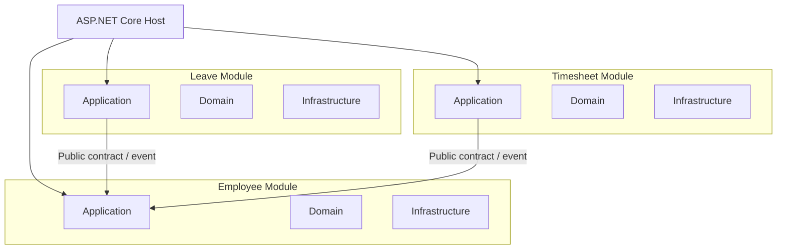
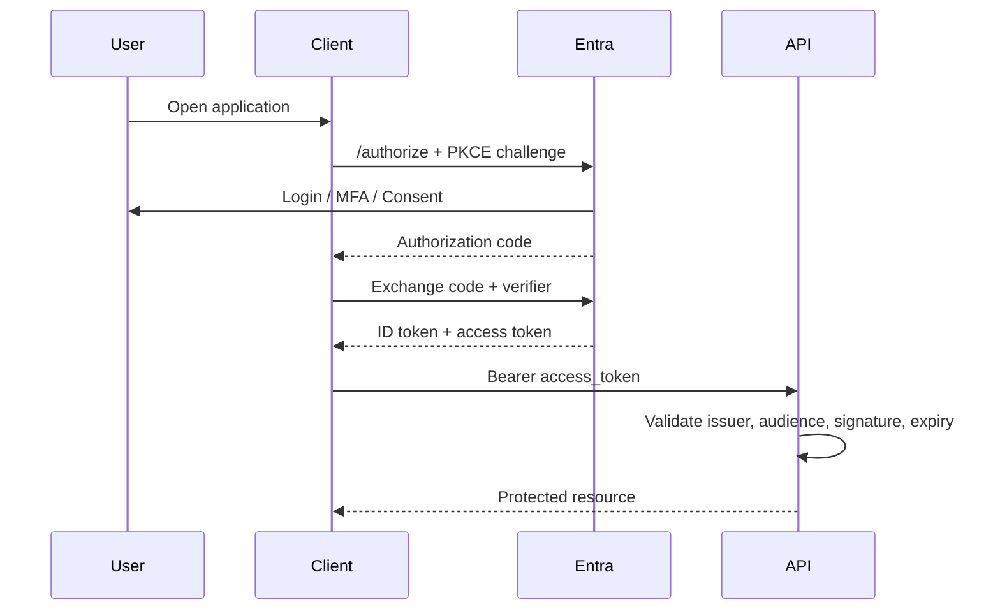
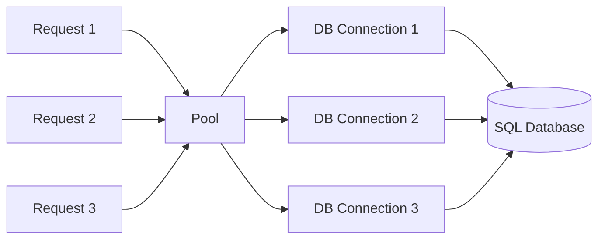
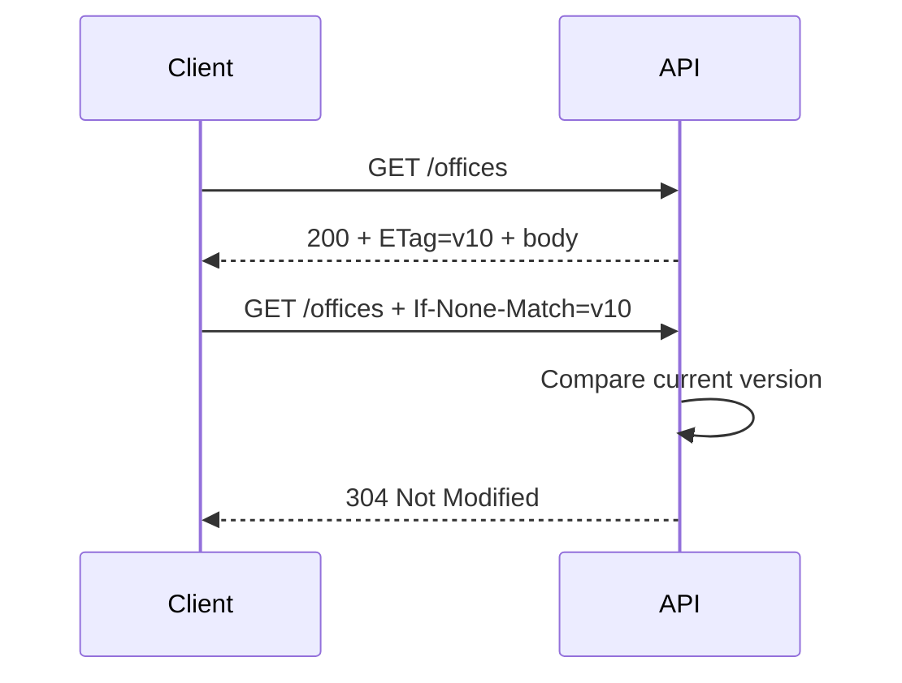
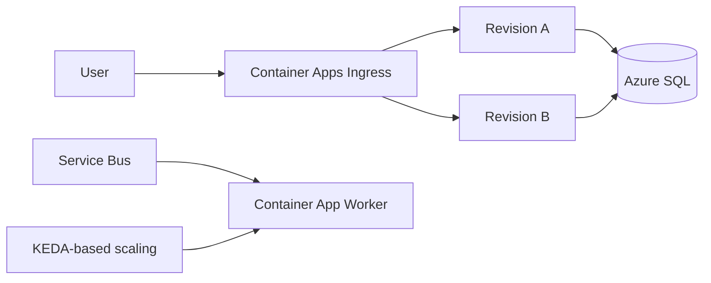
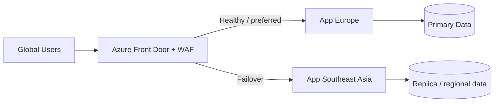
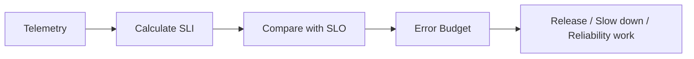
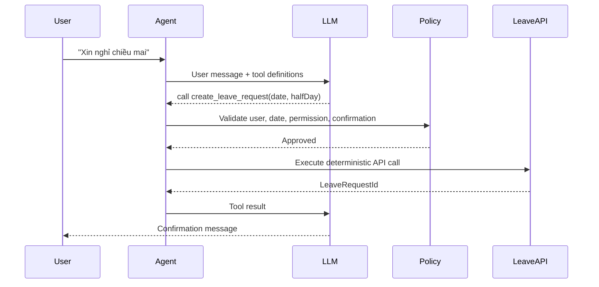
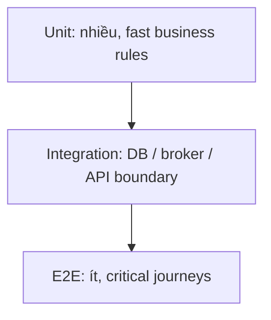

# Daily Knowledge Sharing — 2026-08-17

## Today’s Topics

1. Modular Monolith — giữ boundary rõ mà chưa cần Microservices
2. OAuth 2.0 + OpenID Connect — phân biệt authorization, authentication và token flow
3. EF Core N+1 Query — nhận diện query explosion và chọn loading strategy đúng
4. Database Connection Pooling — vì sao mở connection “rẻ” nhưng pool exhaustion vẫn làm hệ thống chết
5. HTTP Caching với ETag — giảm bandwidth và tránh trả dữ liệu không cần thiết
6. Azure Container Apps — chạy containerized workload với autoscaling và event-driven scale
7. Azure Front Door — global entry point, routing, TLS, WAF và failover
8. SLI, SLO, SLA — biến “hệ thống phải ổn định” thành mục tiêu đo được
9. Tool Calling trong AI Agents — để AI quyết định intent nhưng deterministic code kiểm soát side effect
10. Testing Strategy — xây test pyramid theo risk thay vì chạy theo coverage

---

# 1. Modular Monolith — boundary rõ mà chưa cần Microservices

### 1. What is it?

Modular Monolith là một ứng dụng được deploy như **một đơn vị**, nhưng bên trong được chia thành các module có boundary rõ theo business capability.

Ví dụ hệ thống employee platform có thể có:

* Employee Management
* Timesheet
* Leave
* Payroll Integration
* Notification

Điểm khác biệt với “monolith truyền thống” không nằm ở số project. Modular Monolith cố gắng đảm bảo mỗi module có:

* domain model riêng;
* application use cases riêng;
* persistence boundary hợp lý;
* public contract rõ ràng;
* hạn chế truy cập trực tiếp vào internals của module khác.

Có thể coi nó là cách áp dụng tư duy service boundary mà **chưa trả operational cost của distributed system**.

### 2. Why does it exist?

Nhiều team nhảy từ một monolith khó bảo trì sang Microservices quá sớm vì nghĩ rằng “chia service sẽ tự động giải quyết coupling”.

Nhưng nếu business boundary chưa rõ, Microservices chỉ biến:

```text
method call coupling
```

thành:

```text
HTTP/message coupling + network failure + distributed tracing + deployment complexity
```

Modular Monolith tồn tại để giải quyết hai vấn đề đồng thời:

1. giảm coupling trong codebase;
2. giữ deployment, transaction và local debugging đơn giản.

Nếu không có module boundary, một thay đổi Leave có thể gọi thẳng repository của Employee, Timesheet và Payroll. Sau vài năm, mọi phần đều phụ thuộc lẫn nhau.

### 3. How does it work?



Một nguyên tắc quan trọng:

```text
Leave module
    ❌ không đọc trực tiếp EmployeeDbContext internals
    ✅ gọi public contract hoặc consume integration event
```

Database có thể vẫn là một SQL Server instance, nhưng module nên tránh join tùy tiện qua bảng private của nhau nếu muốn giữ khả năng tách sau này.

### 4. Practical example

Contract giữa modules:

```csharp
public interface IEmployeeDirectory
{
    Task<EmployeeSummary?> GetEmployeeAsync(
        Guid employeeId,
        CancellationToken cancellationToken);
}

public sealed record EmployeeSummary(
    Guid Id,
    string Email,
    bool IsActive);
```

Leave module dùng contract:

```csharp
public sealed class SubmitLeaveHandler
{
    private readonly IEmployeeDirectory _employees;
    private readonly LeaveDbContext _db;

    public SubmitLeaveHandler(
        IEmployeeDirectory employees,
        LeaveDbContext db)
    {
        _employees = employees;
        _db = db;
    }

    public async Task Handle(SubmitLeaveCommand command, CancellationToken ct)
    {
        var employee = await _employees.GetEmployeeAsync(command.EmployeeId, ct)
            ?? throw new InvalidOperationException("Employee not found");

        if (!employee.IsActive)
            throw new InvalidOperationException("Inactive employee cannot submit leave");

        _db.LeaveRequests.Add(
            LeaveRequest.Create(command.EmployeeId, command.From, command.To));

        await _db.SaveChangesAsync(ct);
    }
}
```

Leave module không cần biết bảng Employee có 50 columns hay cấu trúc AD/M365 thế nào.

### 5. Real production scenario

Một HR platform ban đầu có 20 developers. Tách thành 15 Microservices sẽ tạo thêm:

* 15 deployment pipelines;
* service discovery;
* retries/timeouts;
* distributed tracing;
* schema/version compatibility;
* message reliability;
* nhiều database và migration pipelines.

Nếu load chưa yêu cầu independent scaling và team chưa có platform engineering maturity, Modular Monolith thường giúp tiến nhanh hơn.

Khi Timesheet sau này cần scale riêng, boundary đã tốt thì module đó có thể được extract thành service với ít coupling hơn.

### 6. Common mistakes

* Gọi là “modular” nhưng mọi module dùng chung một `CommonService` khổng lồ.
* Module A reference trực tiếp entity/repository private của module B.
* Tạo event cho mọi method call, làm monolith trở thành distributed-system simulation.
* Một shared database nhưng không có ownership convention.
* Shared kernel quá lớn, cuối cùng trở thành nơi chứa mọi thứ.
* Tách module theo technical concern như `Controllers`, `Repositories`, `Services` thay vì business capability.

### 7. Trade-offs

**Advantages**

* Deployment và local development đơn giản.
* Transaction local vẫn dễ xử lý.
* Boundary rõ giúp maintainability tốt hơn classic monolith.
* Có đường tiến hóa tự nhiên sang services nếu cần.

**Costs / Risks**

* Không independently deploy từng module.
* Một process crash có thể ảnh hưởng toàn hệ thống.
* Team phải có discipline để không phá boundary.
* Shared runtime nghĩa là một module có thể dùng quá nhiều CPU/memory của module khác.

### 8. Junior → Middle → Senior understanding

**Junior**

Hiểu module là business boundary, không chỉ folder.

**Middle**

Biết thiết kế public contract, dependency direction và hạn chế cross-module persistence access.

**Senior / Technical Lead**

Phải quyết định khi nào module nên ở cùng process và khi nào cần extract. Cần xem xét team ownership, scalability, transaction boundary, deployment cadence, failure isolation và operational maturity.

### 9. Key takeaway

* Modular Monolith thường là bước mặc định tốt trước Microservices.
* Boundary tốt quan trọng hơn số lượng deployment units.
* Thiết kế để có thể tách, nhưng chỉ tách khi có lý do thực tế.

---

# 2. OAuth 2.0 + OpenID Connect — authorization khác authentication

### 1. What is it?

OAuth 2.0 là framework về **authorization delegation**: một client được phép truy cập resource thay mặt user hoặc chính application.

OpenID Connect (OIDC) xây trên OAuth 2.0 để bổ sung **authentication** — xác định user là ai.

Nói ngắn gọn:

```text
OAuth 2.0: App được phép làm gì?
OIDC: User là ai?
```

Access token thường dùng để gọi API. ID token dùng cho client biết thông tin authentication của user.

### 2. Why does it exist?

Naive solution là app nhận username/password của user rồi dùng credential đó gọi service khác. Cách này nguy hiểm vì:

* app phải giữ password;
* khó giới hạn permission;
* không có consent/scopes rõ;
* revoke access khó;
* service-to-service authentication bị trộn với user authentication.

OAuth/OIDC tạo ra token-based trust model, nơi Identity Provider như Microsoft Entra ID chịu trách nhiệm authentication và token issuance.

### 3. How does it work?

Authorization Code Flow với PKCE:



API không nên dùng ID token làm access token.

Một access token thường chứa claims liên quan tới:

* issuer (`iss`);
* audience (`aud`);
* expiry (`exp`);
* scopes hoặc roles;
* subject/object identifier.

### 4. Practical example

ASP.NET Core API:

```csharp
builder.Services
    .AddAuthentication(JwtBearerDefaults.AuthenticationScheme)
    .AddMicrosoftIdentityWebApi(builder.Configuration.GetSection("AzureAd"));

builder.Services.AddAuthorization(options =>
{
    options.AddPolicy("Timesheet.Read", policy =>
        policy.RequireClaim("scp", "Timesheet.Read"));
});
```

Endpoint:

```csharp
[Authorize(Policy = "Timesheet.Read")]
[HttpGet("timesheets/{employeeId:guid}")]
public async Task<IActionResult> GetTimesheet(Guid employeeId)
{
    // Authorization ở đây vẫn có thể cần kiểm tra
    // employeeId có thuộc phạm vi user được xem hay không.
    return Ok(await service.GetAsync(employeeId));
}
```

Token hợp lệ không có nghĩa user được phép truy cập mọi resource ID.

### 5. Real production scenario

Employee portal dùng delegated user access để gọi backend API.

Backend lại cần gọi Microsoft Graph. Có vài lựa chọn khác nhau:

* On-Behalf-Of flow khi Graph action phải phản ánh user identity/permission;
* application permission khi backend là daemon được organization cho phép;
* Managed Identity cho Azure resources nội bộ nếu service hỗ trợ.

Sai lầm kiến trúc là dùng một flow cho tất cả use case.

### 6. Common mistakes

* Dùng ID token gọi API.
* Chỉ decode JWT mà không validate signature/issuer/audience.
* Authorization chỉ dựa vào UI hide/show button.
* Tin `role=Admin` nhưng không kiểm tra tenant/resource ownership.
* Access token lifetime quá dài.
* Lưu refresh token không an toàn.
* SPA dùng client secret — secret trong browser không còn là secret.
* Nhầm delegated permission và application permission.

### 7. Trade-offs

**Advantages**

* Centralized identity management.
* MFA, Conditional Access, consent và token lifecycle tốt hơn password sharing.
* Fine-grained scopes/roles.

**Costs / Risks**

* Flow phức tạp.
* Debug token/claims thường khó cho team mới.
* Sai configuration audience/tenant/scopes dễ gây security bug.

### 8. Junior → Middle → Senior understanding

**Junior**

Phân biệt authentication và authorization; biết access token khác ID token.

**Middle**

Biết cấu hình JWT validation, scopes, roles, policies và common OAuth flows.

**Senior / Technical Lead**

Phải chọn identity flow đúng theo trust boundary: user-delegated, daemon, service-to-service, multi-tenant. Cần đánh giá token storage, consent model, least privilege và blast radius của application permissions.

### 9. Key takeaway

* OAuth 2.0 không tự động là authentication; OIDC bổ sung identity layer.
* Token hợp lệ vẫn cần resource-level authorization.
* Flow và permission model phải phản ánh đúng ai đang hành động thay mặt ai.

---

# 3. EF Core N+1 Query — query explosion âm thầm

### 1. What is it?

N+1 Query xảy ra khi application thực hiện:

* 1 query để lấy danh sách parent;
* sau đó N query bổ sung để lấy dữ liệu liên quan cho từng parent.

Ví dụ load 100 employees rồi mỗi employee lại query office riêng sẽ tạo 101 database round trips.

### 2. Why does it exist?

N+1 thường xuất hiện do abstraction khiến developer không nhìn thấy SQL thực tế, đặc biệt với:

* lazy loading;
* gọi repository trong loop;
* mapping code phát sinh query;
* navigation property access không được kiểm soát.

Code nhìn rất “sạch” nhưng production latency tăng theo số records.

### 3. How does it work?

Pattern xấu:

```text
SELECT Employees                 -- 1 query
  ↓ 100 rows
for each employee:
    SELECT Office WHERE Id = ?   -- 100 queries
```

Tổng:

```text
1 + N network round trips
```

Vấn đề không chỉ là SQL execution time. Mỗi round trip có:

* network latency;
* connection usage;
* query parsing/execution overhead;
* serialization/materialization.

### 4. Practical example

Không tốt:

```csharp
var employees = await db.Employees.ToListAsync(ct);

foreach (var employee in employees)
{
    employee.Office = await db.Offices
        .SingleAsync(x => x.Id == employee.OfficeId, ct);
}
```

Projection tốt hơn:

```csharp
var employees = await db.Employees
    .AsNoTracking()
    .Select(e => new EmployeeDto
    {
        Id = e.Id,
        Name = e.Name,
        OfficeName = e.Office.Name
    })
    .ToListAsync(ct);
```

EF Core có thể translate thành join phù hợp.

Nếu cần aggregate child collection, đôi khi `Include`, projection hoặc split query là lựa chọn khác nhau cần đo.

### 5. Real production scenario

API `/employees` chạy nhanh ở QA với 10 records nhưng production có 2,500 employees.

QA:

```text
11 queries
~80 ms
```

Production:

```text
2,501 queries
~12 seconds
```

Issue không nằm ở “database yếu” mà ở query shape.

Một cách điều tra tốt:

1. bật EF Core command logging có kiểm soát;
2. xem số SQL commands/request;
3. trace database dependencies trong Application Insights/OpenTelemetry;
4. kiểm tra generated SQL bằng `ToQueryString()`;
5. tối ưu projection/query shape.

### 6. Common mistakes

* Dùng `Include` mọi navigation để “chắc chắn không N+1”, rồi tạo cartesian explosion.
* Query từng item trong `foreach`.
* Repository abstraction che mất khả năng projection.
* Chỉ benchmark database duration mà không đếm round trips.
* Trả EF entity graph trực tiếp ra API.
* Lazy loading được enable toàn hệ thống mà team không nhận biết.

### 7. Trade-offs

**Advantages của eager/projection approach**

* Ít round trips.
* Query behavior predictable hơn.
* Projection giảm dữ liệu materialize.

**Costs / Risks**

* Một query join quá lớn có thể duplicate rows nhiều.
* `Include` nhiều collection có thể tạo cartesian explosion.
* Split query giảm explosion nhưng lại tăng round trips.

Không có rule “1 query luôn tốt hơn 3 queries”; cần đo tổng cost.

### 8. Junior → Middle → Senior understanding

**Junior**

Biết loop có query DB bên trong thường là red flag.

**Middle**

Biết dùng projection, `Include`, `AsSplitQuery`, `AsNoTracking` và đọc SQL generated.

**Senior / Technical Lead**

Phải đánh giá query shape, cardinality, network latency, materialization cost, tracking overhead và database indexes. Cần thiết kế repository/query abstraction không làm mất visibility về performance.

### 9. Key takeaway

* Đếm số round trips, không chỉ nhìn thời gian từng query.
* Projection thường là default tốt cho read API.
* Tránh N+1 nhưng cũng tránh over-fetching và cartesian explosion.

---

# 4. Database Connection Pooling — pool exhaustion nguy hiểm hơn bạn nghĩ

### 1. What is it?

Connection Pooling là cơ chế tái sử dụng database connections thay vì tạo TCP/TLS/login session mới cho mỗi query.

Trong .NET, khi gọi:

```csharp
await connection.OpenAsync();
```

rất nhiều trường hợp bạn đang **borrow connection từ pool**, không tạo physical connection mới.

Khi `Dispose/Close`, connection thường được trả về pool để request khác dùng lại.

### 2. Why does it exist?

Mở physical database connection tốn chi phí:

* TCP handshake;
* TLS negotiation;
* authentication;
* database session setup.

Pooling giúp request latency thấp hơn đáng kể.

Nhưng pool có giới hạn. Nếu application giữ connection quá lâu, request mới phải chờ và có thể timeout dù database CPU còn thấp.

### 3. How does it work?



Nếu pool size = 100 và 100 requests đang giữ connection:

```text
Request 101
   ↓
wait for available connection
   ↓
timeout nếu không connection nào được trả về
```

Một query chạy lâu không chỉ chậm chính nó; nó giữ scarce resource lâu hơn và làm throughput toàn hệ thống giảm.

### 4. Practical example

Không tốt:

```csharp
await using var connection = new SqlConnection(connectionString);
await connection.OpenAsync(ct);

var data = await LoadDataAsync(connection, ct);

// Gọi external API 20 giây trong khi DB connection vẫn đang bị giữ
await graphClient.SendAsync(..., ct);

return data;
```

Tốt hơn:

```csharp
List<EmployeeDto> data;

await using (var connection = new SqlConnection(connectionString))
{
    await connection.OpenAsync(ct);
    data = await LoadDataAsync(connection, ct);
}

// Connection đã trả lại pool trước external call
await graphClient.SendAsync(..., ct);
```

Với EF Core, `DbContext` cũng nên có lifetime phù hợp; không giữ scoped context trong background singleton hoặc long-running workflow tùy tiện.

### 5. Real production scenario

API có p95 database query chỉ 80 ms, nhưng thỉnh thoảng response timeout 30 giây. Database CPU 35% nên team tưởng DB khỏe.

Trace cho thấy requests chờ connection pool vì một batch job giữ transaction/connection hàng chục giây.

Incident flow:

```text
Long transaction
   ↓
Connections held
   ↓
Pool depleted
   ↓
Normal requests wait
   ↓
Timeout storm
   ↓
Retries create even more pressure
```

### 6. Common mistakes

* Tăng max pool size ngay mà không tìm lý do connection bị giữ lâu.
* Gọi external API bên trong database transaction.
* Không dispose connection/reader đúng cách.
* Dùng transaction scope quá rộng.
* Retry connection timeout aggressively, làm pressure tăng thêm.
* Mỗi request có connection string hơi khác nhau → tạo nhiều pools riêng.
* Cho rằng `DbContext` thread-safe và dùng song song nhiều operations.

### 7. Trade-offs

**Advantages**

* Giảm connection setup overhead.
* Tăng throughput.
* Là abstraction hiệu quả khi code dispose đúng.

**Costs / Risks**

* Pool exhaustion tạo bottleneck khó nhìn thấy.
* Pool quá lớn có thể đẩy vấn đề sang database max connections.
* Connection state/session behavior cần được reset đúng bởi provider.

### 8. Junior → Middle → Senior understanding

**Junior**

Hiểu `Open`/`Close` thường là borrow/return từ pool.

**Middle**

Biết giữ connection/transaction scope ngắn, dispose đúng và điều tra timeout.

**Senior / Technical Lead**

Phải capacity-plan end-to-end: số app instances × pool size, database max connections, query duration, transaction scope, retry policy và traffic spike. Tăng pool size không phải giải pháp mặc định.

### 9. Key takeaway

* Connection là resource hữu hạn.
* Query/transaction càng lâu, pool pressure càng lớn.
* Khi production timeout nhưng DB CPU thấp, hãy kiểm tra pool và wait time.

---

# 5. HTTP Caching với ETag — không phải request nào cũng cần trả lại body

### 1. What is it?

HTTP caching sử dụng các header chuẩn như `Cache-Control`, `ETag`, `If-None-Match` để browser, CDN hoặc client tránh download lại resource chưa thay đổi.

ETag là một version identifier cho representation của resource.

Ví dụ:

```http
ETag: "employee-42-v18"
```

Client lần sau gửi:

```http
If-None-Match: "employee-42-v18"
```

Nếu resource chưa đổi, server trả `304 Not Modified` không cần gửi full body.

### 2. Why does it exist?

Naive API luôn trả `200 OK + JSON body`, kể cả dữ liệu giống hệt request trước.

Với:

* metadata lớn;
* mobile connection;
* CDN;
* configuration/reference data;

việc này lãng phí bandwidth, CPU serialization và latency.

### 3. How does it work?



ETag có thể dựa trên:

* row version;
* resource version number;
* hash của representation;
* last modified version.

Không nên hash payload cực lớn trên mỗi request nếu việc tính hash đắt hơn lợi ích caching.

### 4. Practical example

ASP.NET Core đơn giản:

```csharp
[HttpGet("offices")]
public async Task<IActionResult> GetOffices(
    [FromHeader(Name = "If-None-Match")] string? ifNoneMatch)
{
    var version = await repository.GetOfficesVersionAsync();
    var etag = $"\"offices-{version}\"";

    if (ifNoneMatch == etag)
        return StatusCode(StatusCodes.Status304NotModified);

    var offices = await repository.GetOfficesAsync();

    Response.Headers.ETag = etag;
    Response.Headers.CacheControl = "private, max-age=60";

    return Ok(offices);
}
```

### 5. Real production scenario

Mobile app tải office/location metadata mỗi lần mở màn hình. Dữ liệu chỉ thay đổi vài lần/tháng nhưng mỗi response 400 KB.

10,000 users × nhiều lần/ngày tạo bandwidth và serialization cost không cần thiết.

HTTP caching giúp:

```text
Fresh cache -> không gọi origin
Stale cache -> conditional request
Unchanged -> 304
Changed -> 200 + new body + new ETag
```

### 6. Common mistakes

* Cache response chứa dữ liệu theo user nhưng dùng `public` cache.
* Không đưa auth/tenant variation vào caching strategy.
* ETag thay đổi mỗi request dù content không đổi.
* Dùng `no-store` cho mọi API theo thói quen, bỏ lỡ optimization.
* Cache quá lâu dữ liệu cần freshness cao.
* Nhầm browser cache với server-side Redis cache — hai layer giải quyết vấn đề khác nhau.

### 7. Trade-offs

**Advantages**

* Giảm bandwidth.
* Giảm origin load.
* Tận dụng browser/CDN standard behavior.

**Costs / Risks**

* Freshness semantics cần thiết kế đúng.
* Dữ liệu personalized dễ bị cache sai nếu header không chuẩn.
* Invalidating edge/browser cache khó hơn xóa Redis key nội bộ.

### 8. Junior → Middle → Senior understanding

**Junior**

Biết `200` khác `304`, hiểu ETag là version của representation.

**Middle**

Biết `Cache-Control`, conditional request và lựa chọn private/public caching.

**Senior / Technical Lead**

Phải thiết kế caching hierarchy: browser → CDN → API → Redis → DB, xác định freshness, privacy, invalidation và cost ở từng layer.

### 9. Key takeaway

* HTTP caching là protocol-level optimization rất mạnh nhưng thường bị bỏ quên.
* `304` giúp tránh gửi lại body khi resource chưa đổi.
* Cache semantics phải phản ánh privacy và freshness requirement.

---

# 6. Azure Container Apps — container workload không cần tự vận hành Kubernetes

### 1. What is it?

Azure Container Apps là managed platform để chạy containerized applications với các capability như:

* HTTP ingress;
* autoscaling;
* revision-based deployment;
* event-driven scaling;
* environment-level networking;
* managed identity;
* secrets/configuration.

Nó phù hợp khi bạn muốn lợi ích của container nhưng không muốn vận hành Kubernetes cluster trực tiếp.

### 2. Why does it exist?

Có khoảng trống giữa:

```text
App Service: rất đơn giản, opinionated
AKS: linh hoạt cao nhưng operational complexity lớn
```

Nhiều workload chỉ cần:

* chạy API container;
* background worker;
* scale theo HTTP hoặc queue;
* revision deployment;

mà không cần tự quản cluster, node pool, ingress controller và Kubernetes upgrades.

### 3. How does it work?



Một app có thể có nhiều revisions. Traffic có thể được chia giữa revisions để rollout dần.

Worker có thể scale theo event source, ví dụ Service Bus queue depth.

### 4. Practical example

Dockerized .NET API:

```dockerfile
FROM mcr.microsoft.com/dotnet/aspnet:10.0 AS base
WORKDIR /app
EXPOSE 8080

FROM mcr.microsoft.com/dotnet/sdk:10.0 AS build
WORKDIR /src
COPY . .
RUN dotnet publish -c Release -o /out

FROM base AS final
COPY --from=build /out .
ENTRYPOINT ["dotnet", "Employee.Api.dll"]
```

Application nên externalize state:

```text
Session -> Redis/distributed store
Files -> Blob Storage
Secrets -> managed secret/Key Vault
Database -> Azure SQL/PostgreSQL
```

để replicas có thể scale horizontally.

### 5. Real production scenario

Một notification service có hai workload:

* HTTP API nhận webhook;
* worker xử lý Service Bus messages.

Container Apps cho phép deploy hai container apps trong cùng environment:

```text
Webhook API: scale theo concurrent HTTP requests
Worker: scale theo queue length
```

Traffic ban đêm thấp, worker có thể scale xuống rất thấp; giờ cao điểm tự tăng replicas.

### 6. Common mistakes

* Container vẫn lưu file/state vào local filesystem rồi kỳ vọng replica khác thấy được.
* Không đặt CPU/memory request hợp lý.
* Scale quá nhanh nhưng downstream DB không chịu nổi.
* Health probe không phản ánh readiness.
* Cho mọi service public ingress dù chỉ cần internal networking.
* Chọn Container Apps chỉ vì “container hiện đại hơn”, trong khi App Service đơn giản hơn cho workload hiện tại.

### 7. Trade-offs

**Advantages**

* Container portability.
* Autoscaling/event-driven scaling.
* Ít operational burden hơn AKS.
* Revision model hữu ích cho rollout.

**Costs / Risks**

* Ít control hơn Kubernetes.
* Cold start/scale behavior cần được hiểu cho latency-sensitive workloads.
* Networking và observability vẫn cần thiết kế.
* Không phải workload nào cũng cần container.

### 8. Junior → Middle → Senior understanding

**Junior**

Hiểu container app là process stateless có thể có nhiều replicas.

**Middle**

Biết deploy image, configure ingress, environment variables, secrets, probes và scaling.

**Senior / Technical Lead**

Phải quyết định App Service vs Container Apps vs AKS vs Functions theo workload, scaling trigger, latency, platform control, team capability và cost. Cần capacity-plan downstream khi autoscaling.

### 9. Key takeaway

* Container Apps phù hợp khi cần container + autoscaling nhưng chưa cần full Kubernetes.
* Stateless design là nền tảng để scale tốt.
* Autoscale app mà không bảo vệ database/downstream có thể tạo failure nhanh hơn.

---

# 7. Azure Front Door — global entry point cho web/API

### 1. What is it?

Azure Front Door là global Layer-7 entry service dùng để đưa traffic HTTP/HTTPS tới backend phù hợp dựa trên routing, health và policy.

Trong architecture production, Front Door có thể đảm nhiệm:

* global routing;
* TLS termination;
* Web Application Firewall (WAF);
* origin health probes;
* failover;
* path/host routing;
* caching cho content phù hợp.

### 2. Why does it exist?

Nếu application có users nhiều khu vực hoặc nhiều origins, DNS pointing trực tiếp vào một App Service tạo limitation:

* failover chậm hơn;
* không có centralized WAF/routing;
* khó route theo path;
* khó tối ưu global entry.

Front Door tách public endpoint khỏi backend topology.

### 3. How does it work?



Health probe chỉ là một tín hiệu. Nếu `/health` luôn trả 200 dù database chết, Front Door vẫn route traffic tới origin không thực sự phục vụ được request.

### 4. Practical example

Health endpoint trong ASP.NET Core:

```csharp
builder.Services.AddHealthChecks()
    .AddSqlServer(builder.Configuration.GetConnectionString("Default")!);

app.MapHealthChecks("/health/ready");
```

Nhưng production nên tách:

```text
/liveness -> process sống?
/readiness -> instance có sẵn sàng nhận traffic?
```

Không nên làm liveness phụ thuộc mọi external service, nếu không temporary dependency failure có thể khiến orchestrator restart hàng loạt instance không cần thiết.

### 5. Real production scenario

SaaS phục vụ Việt Nam và châu Âu. Primary origin ở Southeast Asia, secondary ở West Europe.

Front Door:

1. nhận request tại edge gần user;
2. evaluate WAF/routing rule;
3. chọn healthy origin;
4. route request;
5. khi primary origin health fail, chuyển traffic sang secondary.

Nhưng application/database architecture cũng phải hỗ trợ failover. Routing traffic sang region khác không tự động giải quyết data consistency hoặc database availability.

### 6. Common mistakes

* Nghĩ Front Door tự làm application multi-region hoàn chỉnh.
* Health probe quá nông.
* Public backend vẫn cho phép bypass Front Door/WAF.
* Không preserve/validate forwarded headers đúng.
* Cache dynamic/private content không phù hợp.
* WAF rule quá aggressive tạo false positive mà không monitor.

### 7. Trade-offs

**Advantages**

* Global routing và centralized edge security.
* Failover nhanh hơn architecture chỉ dựa DNS đơn giản.
* Tách public endpoint khỏi backend changes.

**Costs / Risks**

* Thêm hop và configuration complexity.
* Cost tăng.
* Failover chỉ hiệu quả nếu backend/data layer được thiết kế tương ứng.

### 8. Junior → Middle → Senior understanding

**Junior**

Hiểu Front Door đứng trước web/API origins và route traffic.

**Middle**

Biết origins, health probes, routes, WAF và TLS configuration.

**Senior / Technical Lead**

Phải nhìn toàn bộ availability chain: DNS → Front Door → origin → private networking → database → external dependencies. Multi-region routing mà không có data/failure strategy chỉ tạo cảm giác an toàn giả.

### 9. Key takeaway

* Front Door là traffic/control-plane ở edge, không phải magic multi-region architecture.
* Health check phải phản ánh khả năng phục vụ request.
* Security nên ngăn client bypass edge protection nếu đó là trust boundary mong muốn.

---

# 8. SLI, SLO, SLA — reliability phải đo được

### 1. What is it?

Ba khái niệm liên quan nhưng khác nhau:

**SLI — Service Level Indicator**

Metric đo chất lượng thực tế, ví dụ availability hoặc latency.

**SLO — Service Level Objective**

Mục tiêu nội bộ cho SLI, ví dụ:

```text
99.9% requests thành công trong 30 ngày
```

**SLA — Service Level Agreement**

Cam kết business/contract với customer, thường đi kèm hậu quả nếu vi phạm.

### 2. Why does it exist?

Câu nói:

```text
“Hệ thống phải rất ổn định và nhanh.”
```

không giúp team quyết định:

* bao nhiêu downtime chấp nhận được;
* p95 latency bao nhiêu là tốt;
* có nên dừng feature development để sửa reliability hay không;
* khi nào alert.

SLO biến reliability thành engineering target có thể đo và trade-off.

### 3. How does it work?

Ví dụ availability SLI:

```text
successful valid requests
-------------------------
all valid requests
```

SLO 99.9% trong 30 ngày cho error budget khoảng:

```text
0.1% unavailable budget
```

Error budget được “tiêu” khi service fail. Nếu burn quá nhanh, team cần ưu tiên reliability.



### 4. Practical example

ASP.NET Core API đặt SLO:

```text
Availability SLO:
99.95% non-user-error requests return success over rolling 30 days

Latency SLO:
95% GET /employees requests < 500 ms
99% GET /employees requests < 1.5 s
```

Không nên dùng average latency duy nhất. Average có thể 200 ms trong khi 5% users chịu latency 8 giây.

Metrics nên dùng histogram/percentiles phù hợp.

### 5. Real production scenario

Một timesheet API có SLO 99.9%. Sau release, error rate chỉ 0.4% nên dashboard “trông không quá xấu”. Nhưng nếu 0.4% kéo dài, error budget tháng bị burn rất nhanh.

Burn-rate alert cho phép phát hiện:

```text
Nếu tốc độ tiêu error budget hiện tại tiếp tục,
SLO sẽ bị phá trước khi window kết thúc.
```

Điều này tốt hơn alert kiểu “CPU > 80%”, vì CPU cao không nhất thiết làm customer impact.

### 6. Common mistakes

* SLA = SLO = monitoring threshold.
* Chọn 100% availability — gần như không thực tế và cực đắt.
* Đo success bằng `HTTP < 500` nhưng business response bên trong vẫn fail.
* Alert theo infrastructure metrics thay vì user impact.
* SLO quá nhiều khiến team không biết ưu tiên metric nào.
* Không loại request invalid/user error khỏi availability calculation đúng cách.

### 7. Trade-offs

**Advantages**

* Reliability objective rõ ràng.
* Hỗ trợ quyết định release vs stability work.
* Alert gắn với user impact tốt hơn.

**Costs / Risks**

* Cần telemetry chất lượng.
* SLI định nghĩa sai sẽ dẫn quyết định sai.
* SLO quá cao làm cost tăng mạnh; quá thấp làm trải nghiệm kém.

### 8. Junior → Middle → Senior understanding

**Junior**

Phân biệt metric đo được và mục tiêu.

**Middle**

Biết implement metrics, percentiles, availability calculation và dashboards.

**Senior / Technical Lead**

Phải chọn SLO phản ánh business criticality, thiết kế error-budget policy, alert burn rate và cân bằng reliability với delivery speed/cost.

### 9. Key takeaway

* Reliability cần user-centered indicators.
* SLO là engineering target; SLA là contractual commitment.
* Error budget biến reliability thành một trade-off có thể quản lý.

---

# 9. Tool Calling trong AI Agents — AI chọn intent, code kiểm soát side effect

### 1. What is it?

Tool Calling cho phép LLM chọn một tool/function có schema rõ ràng thay vì chỉ trả natural-language response.

Ví dụ agent có tools:

```text
search_employee
get_calendar
create_leave_request
send_email
```

Model có thể suy luận user muốn dùng tool nào và arguments nào, nhưng application vẫn phải validate và thực thi tool.

### 2. Why does it exist?

LLM giỏi xử lý ngôn ngữ nhưng không nên được xem như execution engine đáng tin tuyệt đối.

Nếu prompt yêu cầu:

```text
“Muốn gửi email thì hãy trả SEND_EMAIL:user@example.com”
```

rồi code parse string, workflow rất brittle.

Tool schema tạo contract rõ hơn giữa model và deterministic code.

### 3. How does it work?



Trust boundary:

```text
LLM:
- interpret intent
- choose candidate action
- extract fuzzy parameters

Deterministic code:
- authentication
- authorization
- validation
- rate limits
- transaction
- irreversible action
- audit
```

### 4. Practical example

Tool request model:

```csharp
public sealed record CreateLeaveArgs(
    DateOnly From,
    DateOnly To,
    string LeaveType);
```

Executor:

```csharp
public async Task<ToolResult> ExecuteCreateLeaveAsync(
    ClaimsPrincipal user,
    CreateLeaveArgs args,
    CancellationToken ct)
{
    var employeeId = user.GetEmployeeId();

    if (args.To < args.From)
        return ToolResult.Invalid("To date must be >= from date");

    if (!AllowedLeaveTypes.Contains(args.LeaveType))
        return ToolResult.Invalid("Unsupported leave type");

    var balance = await leaveService.GetBalanceAsync(employeeId, ct);
    if (!balance.CanSubmit(args.From, args.To, args.LeaveType))
        return ToolResult.Rejected("Insufficient leave balance");

    var id = await leaveService.CreateAsync(employeeId, args, ct);
    return ToolResult.Success(new { id });
}
```

Model không tự quyết định balance rule.

### 5. Real production scenario

AI assistant hỗ trợ IT operations có tools:

* search logs;
* restart service;
* disable account;
* create incident.

Không nên cho cả bốn cùng permission level.

Có thể chia:

```text
Read-only tools -> execute automatically
Low-risk write -> execute with policy
High-risk/irreversible -> require human approval
```

Agent architecture tốt quan tâm nhiều đến **permission boundary và recovery** hơn prompt wording.

### 6. Common mistakes

* Tin tool arguments từ model mà không validate.
* Tool có quyền quá rộng.
* Một generic `run_sql(sql)` hoặc `execute_shell(command)` tạo blast radius lớn.
* Không đặt timeout/cancellation cho tool.
* Tool fail nhưng agent retry vô hạn.
* Không idempotent write tool.
* Prompt injection từ retrieved document có thể dụ model gọi tool nguy hiểm.
* Không audit ai yêu cầu action nào và model/tool đã làm gì.

### 7. Trade-offs

**Advantages**

* Contract tốt hơn text parsing.
* Cho phép AI tương tác hệ thống thực tế.
* Có thể centralize validation/policy ở executor.

**Costs / Risks**

* Side effects tạo security/safety concerns lớn hơn chatbot read-only.
* Cần permission, retries, idempotency, approval và observability.
* Model vẫn có thể chọn sai tool dù schema hợp lệ.

### 8. Junior → Middle → Senior understanding

**Junior**

Hiểu model đề xuất tool call, application mới là nơi thực thi.

**Middle**

Biết define schema, validate args, handle timeout/error và return tool result.

**Senior / Technical Lead**

Phải thiết kế capability model, least privilege, human approval, audit trail, prompt-injection defense, deterministic policy, idempotency và failure recovery. Agent là distributed workflow có probabilistic planner, không chỉ là chatbot có function.

### 9. Key takeaway

* Tool Calling là contract giữa reasoning layer và execution layer.
* Không để LLM trực tiếp bypass authentication/authorization/business rules.
* Tool càng có side effect lớn, policy và approval càng phải mạnh.

---

# 10. Testing Strategy — test theo risk, không chạy theo coverage

### 1. What is it?

Testing Strategy là quyết định **test cái gì, ở layer nào và vì sao**, thay vì cố đạt một con số coverage tùy ý.

Một strategy thực tế thường có nhiều lớp:

```text
Unit tests
Integration tests
Contract/API tests
End-to-End tests
Production monitoring / synthetic checks
```

Mỗi lớp bắt lỗi khác nhau và có cost khác nhau.

### 2. Why does it exist?

100% unit test coverage không chứng minh hệ thống hoạt động khi:

* EF Core mapping sai;
* SQL migration fail;
* authentication config sai;
* message serialization mismatch;
* Azure/third-party integration behavior khác mock;
* frontend-backend contract không tương thích.

Ngược lại, chỉ dùng E2E test khiến test suite chậm, flaky và khó xác định root cause.

Testing Strategy giúp phân bổ confidence theo risk.

### 3. How does it work?



Một mapping thực tế:

```text
Pure business rule           -> Unit test
EF Core query/mapping        -> Integration test với real database engine phù hợp
External API adapter         -> Contract/integration test
Critical user journey        -> E2E
Production dependency health -> Synthetic/monitoring
```

### 4. Practical example

Domain unit test:

```csharp
[Fact]
public void BillableHours_CannotExceed_ActualHours()
{
    var entry = TimesheetEntry.Create(actualHours: 8);

    var action = () => entry.SetBillableHours(9);

    action.Should().Throw<DomainException>();
}
```

EF Core integration test nên kiểm tra provider thực tế khi behavior phụ thuộc SQL:

```csharp
[Fact]
public async Task ActiveEmployees_Query_Excludes_InactiveRows()
{
    await using var db = await fixture.CreateSqlServerDbContextAsync();

    db.Employees.AddRange(
        Employee.Active("A"),
        Employee.Inactive("B"));
    await db.SaveChangesAsync();

    var result = await db.Employees
        .Where(x => x.Status == EmployeeStatus.Active)
        .ToListAsync();

    result.Should().ContainSingle(x => x.Name == "A");
}
```

### 5. Real production scenario

Employee offboarding workflow gồm:

```text
API
 -> DB state change
 -> Service Bus event
 -> Exchange Online worker
 -> Microsoft Graph/PowerShell integration
```

Một test strategy tốt có thể là:

* unit: transition Active → Inactive business rules;
* integration: EF mapping + transaction/outbox;
* worker integration: deserialize event và persistence;
* adapter contract: Graph/Exchange behavior được mock ở boundary nhưng có sandbox verification riêng;
* E2E: vài critical paths như Delegate/Forward/Delete;
* production: alerts cho failed offboarding history.

### 6. Common mistakes

* Dùng InMemory EF provider rồi tưởng đã test SQL behavior.
* Mock mọi thứ, test chỉ xác nhận mock được gọi.
* Quá nhiều E2E khiến CI 45 phút và flaky.
* Coverage 90% nhưng critical payment/offboarding branch không test.
* Không test failure path, retry, timeout, concurrency.
* Test phụ thuộc current time/random/network nên không deterministic.
* Không cleanup test data hoặc không isolate parallel tests.

### 7. Trade-offs

**Unit tests**

* nhanh, deterministic;
* nhưng không bắt integration/configuration failures.

**Integration tests**

* confidence cao hơn cho persistence/infrastructure;
* nhưng chậm và setup phức tạp hơn.

**E2E tests**

* gần user behavior nhất;
* nhưng đắt, brittle và root-cause khó.

Mục tiêu không phải chọn một loại mà là **đặt đúng test vào đúng boundary**.

### 8. Junior → Middle → Senior understanding

**Junior**

Biết test behavior, không test implementation detail.

**Middle**

Biết phân biệt unit/integration/E2E, dùng test doubles hợp lý và viết deterministic tests.

**Senior / Technical Lead**

Phải xây strategy theo business risk, failure history và architecture. Cần cân bằng CI duration, flakiness, confidence, environment cost và production observability. Coverage là signal phụ, không phải quality objective.

### 9. Key takeaway

* Test strategy phải bắt các failure quan trọng nhất với chi phí hợp lý.
* Unit test không thay integration test; E2E cũng không thay unit test.
* Đo confidence theo risk, không theo một con số coverage duy nhất.
