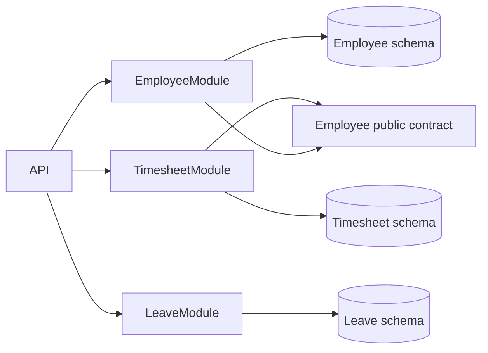
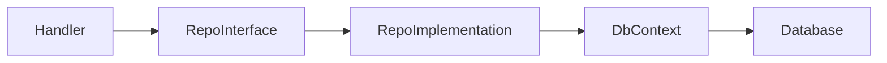
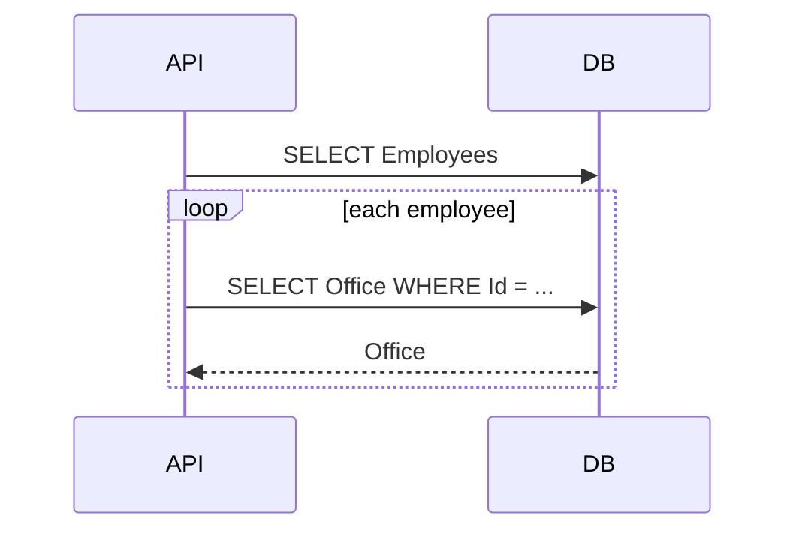
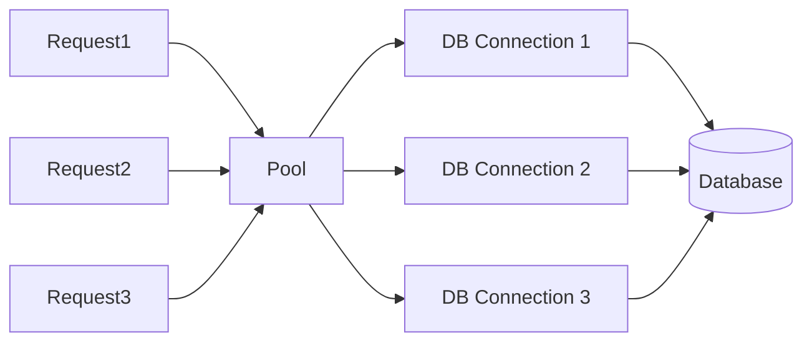
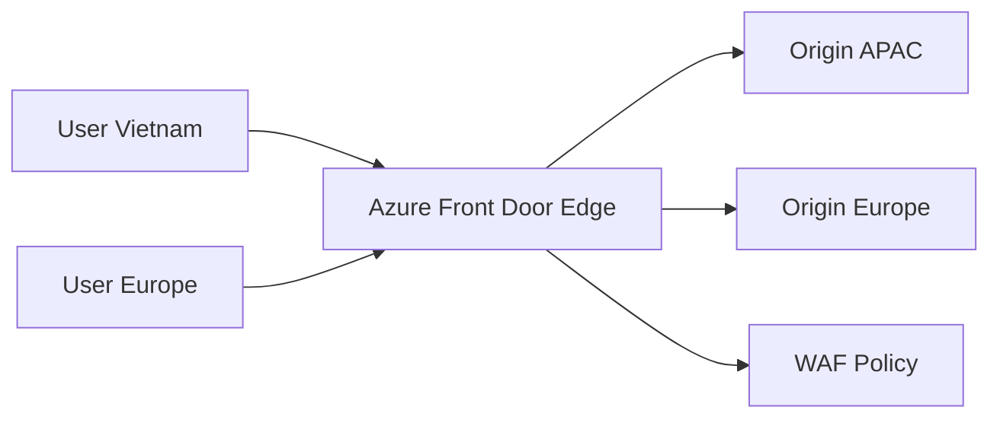
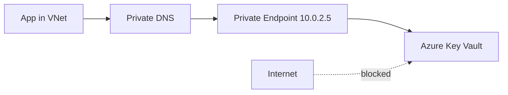
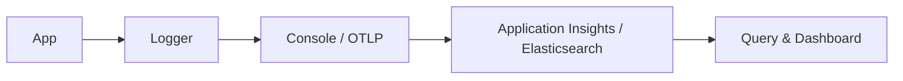
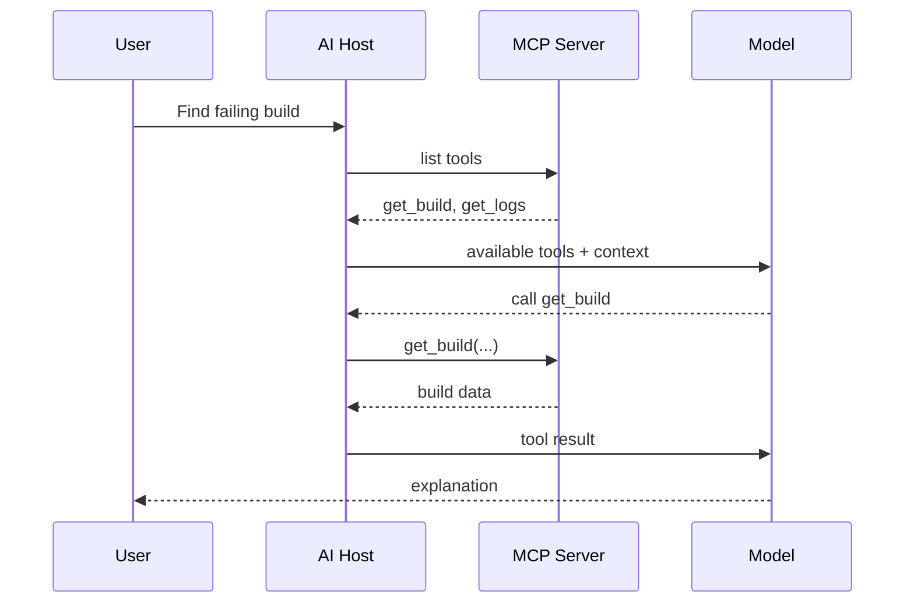
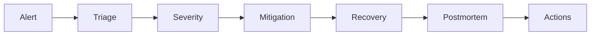

# Daily Knowledge Sharing — 2026-08-17

## Today’s Topics

1. Modular Monolith — module boundary trước khi nghĩ tới Microservices
2. Repository Pattern & Unit of Work — khi nào abstraction có giá trị và khi nào EF Core đã đủ
3. Rate Limiting trong ASP.NET Core — bảo vệ API khỏi overload và abuse
4. EF Core N+1 Query — cách nhận biết, đo và loại bỏ query explosion
5. Database Connection Pooling — vì sao “mở connection” không đồng nghĩa với tạo socket mới
6. Azure Front Door — global routing, edge security và origin failover
7. Azure Private Endpoint — đưa PaaS service vào private network path
8. Structured Logging — thiết kế log để điều tra production thay vì chỉ “ghi text”
9. MCP — chuẩn hóa cách AI agent truy cập tool và data source
10. Incident Management — từ alert đến mitigation, root cause và prevention

---

# 1. Modular Monolith — module boundary trước khi nghĩ tới Microservices

### 1. What is it?

Modular Monolith là một ứng dụng vẫn deploy như **một đơn vị**, nhưng bên trong được chia thành các module có boundary rõ ràng theo business capability.

Ví dụ một hệ thống nội bộ có thể gồm:

```text
Employee
Timesheet
Leave
Billing
Notification
Identity
```

Điểm quan trọng là mỗi module sở hữu model, use case và rule riêng. Module khác không nên tùy ý truy cập trực tiếp table hoặc internal service của nó.

Khác với monolith “truyền thống”, Modular Monolith cố tình kiểm soát coupling. Khác với Microservices, nó chưa tách deployment, network boundary và database ownership thành nhiều service độc lập.

### 2. Why does it exist?

Nhiều team nhảy từ một codebase lộn xộn sang Microservices vì nghĩ “tách service sẽ hết coupling”. Thực tế, nếu boundary business chưa rõ thì coupling chỉ chuyển từ function call sang HTTP/message call.

Không có modularity, một thay đổi nhỏ ở Timesheet có thể làm ảnh hưởng Leave hoặc Payroll do:

* dùng chung entity;
* gọi chéo repository;
* query trực tiếp table module khác;
* transaction đi xuyên nhiều concern;
* shared service trở thành god service.

Modular Monolith giải quyết bài toán này trước khi chịu thêm distributed-systems complexity.

### 3. How does it work?



Trong cùng process, module có thể giao tiếp bằng:

* public application interface;
* domain event/internal event;
* shared contract nhỏ;
* read model được publish có chủ đích.

Không nên giao tiếp bằng cách:

```csharp
otherModuleDbContext.Employees.Where(...)
```

nếu table đó thuộc ownership của module khác.

### 4. Practical example

```csharp
public interface IEmployeeDirectory
{
    Task<EmployeeSummary?> GetByIdAsync(Guid employeeId, CancellationToken ct);
}

public sealed class TimesheetService
{
    private readonly IEmployeeDirectory _employeeDirectory;

    public TimesheetService(IEmployeeDirectory employeeDirectory)
    {
        _employeeDirectory = employeeDirectory;
    }

    public async Task CreateEntryAsync(Guid employeeId, DateOnly date, decimal hours, CancellationToken ct)
    {
        var employee = await _employeeDirectory.GetByIdAsync(employeeId, ct)
            ?? throw new InvalidOperationException("Employee not found");

        if (!employee.IsActive)
            throw new InvalidOperationException("Inactive employee cannot log time");

        // create timesheet entry inside Timesheet module
    }
}
```

Timesheet module cần biết employee có active không, nhưng không cần phụ thuộc trực tiếp vào toàn bộ Employee aggregate hoặc Employee DbContext.

### 5. Real production scenario

Một công ty có HR platform gồm Employee, Leave, Timesheet, Billing và Notification. Ban đầu mọi thứ ở một solution.

Nếu module boundary tốt, team có thể:

```text
Monolith
  ↓
Modular Monolith
  ↓
Tách Notification thành service riêng
  ↓
Tách Billing khi scale/ownership yêu cầu
```

Không cần “microservice hóa” tất cả cùng lúc.

### 6. Common mistakes

* Chia folder theo module nhưng dùng chung mọi repository/entity.
* Shared project chứa gần như toàn bộ domain model.
* Module A query trực tiếp table của module B.
* Một transaction ACID trải rộng mọi module rồi sau đó khó tách service.
* Tạo quá nhiều module nhỏ theo table thay vì business capability.
* Cho rằng Modular Monolith chỉ là “Clean Architecture nhiều lần”.

### 7. Trade-offs

**Advantages**

* Deployment và debugging đơn giản hơn Microservices.
* Transaction nội bộ vẫn dễ.
* Boundary rõ giúp scale team và codebase.
* Có đường tiến hóa tự nhiên sang service độc lập.

**Costs / Risks**

* Cần discipline vì compile-time boundary trong cùng process dễ bị phá.
* Scale runtime vẫn theo toàn application nếu chưa tách deployment.
* Một process crash có thể ảnh hưởng tất cả module.

### 8. Junior → Middle → Senior understanding

**Junior**

Hiểu module là business boundary chứ không chỉ folder.

**Middle**

Biết thiết kế public contract, giới hạn dependency và tránh query chéo ownership.

**Senior / Technical Lead**

Phải xác định boundary dựa trên business capability, change frequency, team ownership, transaction requirement và future extraction cost. Cần biết module nào thực sự đáng tách service và module nào nên ở cùng process.

### 9. Key takeaway

* Boundary tốt quan trọng hơn số lượng deployable services.
* Microservices không sửa được domain boundary tệ.
* Modular Monolith thường là bước kiến trúc rất mạnh cho hệ thống vừa và lớn.

---

# 2. Repository Pattern & Unit of Work — abstraction đúng chỗ

### 1. What is it?

Repository Pattern che giấu chi tiết persistence phía sau một API hướng domain/use case. Unit of Work quản lý một tập thay đổi cần commit như một đơn vị.

Trong EF Core:

* `DbSet<TEntity>` đã có nhiều đặc điểm giống repository;
* `DbContext` đã có nhiều đặc điểm giống Unit of Work.

Vì vậy câu hỏi thực tế không phải “có dùng Repository hay không”, mà là **có cần thêm abstraction trên EF Core hay không**.

### 2. Why does it exist?

Repository hữu ích khi application cần nói theo ngôn ngữ domain:

```csharp
GetPendingApprovalsAsync(...)
GetEmployeesNeedingOffboardingAsync(...)
```

thay vì để mọi nơi tự viết query persistence.

Nhưng generic repository kiểu:

```csharp
Add(T entity)
Update(T entity)
Delete(T entity)
GetById(id)
GetAll()
```

thường chỉ bọc lại EF Core mà không tạo thêm domain value.

### 3. How does it work?



Unit of Work boundary thường trùng use case:

```text
Begin use case
  ↓
Load aggregates
  ↓
Apply business rules
  ↓
Save changes
  ↓
Commit once
```

Nếu hai repository dùng cùng `DbContext` scoped, `SaveChanges()` có thể commit chung transaction mặc định cho một batch change.

### 4. Practical example

```csharp
public interface IEmployeeRepository
{
    Task<Employee?> GetForOffboardingAsync(Guid id, CancellationToken ct);
    void AddHistory(EmployeeOffboardingHistory history);
}

public sealed class EmployeeRepository : IEmployeeRepository
{
    private readonly AppDbContext _db;

    public EmployeeRepository(AppDbContext db) => _db = db;

    public Task<Employee?> GetForOffboardingAsync(Guid id, CancellationToken ct)
        => _db.Employees
            .Include(x => x.MailConfig)
            .SingleOrDefaultAsync(x => x.Id == id, ct);

    public void AddHistory(EmployeeOffboardingHistory history)
        => _db.EmployeeOffboardingHistories.Add(history);
}
```

Application có thể dùng một `IUnitOfWork` rất nhỏ:

```csharp
public interface IUnitOfWork
{
    Task<int> SaveChangesAsync(CancellationToken ct);
}
```

hoặc dùng trực tiếp `DbContext` nếu architecture cho phép.

### 5. Real production scenario

Use case deactivate employee cần:

1. update employee status;
2. create audit history;
3. create outbox event;
4. commit database một lần.

Nếu mỗi repository tự `SaveChanges()` thì transaction boundary bị phân mảnh.

Tốt hơn:

```text
EmployeeRepository.Update
HistoryRepository.Add
OutboxRepository.Add
        ↓
UnitOfWork.SaveChanges()
```

### 6. Common mistakes

* Generic Repository che mất khả năng projection/include/query của EF Core.
* Repository trả `IQueryable` ra ngoài rồi abstraction trở nên vô nghĩa.
* Mỗi repository tạo một DbContext riêng trong cùng request.
* `SaveChanges()` trong từng method repository.
* Interface tồn tại chỉ để mock, không bảo vệ boundary nào.
* Viết abstraction khiến query performance khó tối ưu hơn.

### 7. Trade-offs

**Advantages**

* Centralize persistence logic có ý nghĩa domain.
* Dễ enforce transaction boundary.
* Có thể giảm leakage của ORM vào application layer.

**Costs / Risks**

* Boilerplate.
* Generic abstraction có thể làm mất sức mạnh ORM.
* Mock repository dễ tạo test giả tạo nếu behavior của SQL mới là phần quan trọng.

### 8. Junior → Middle → Senior understanding

**Junior**

Hiểu Repository không phải chỉ là wrapper CRUD.

**Middle**

Biết quản lý DbContext lifetime, transaction và query projection hiệu quả.

**Senior / Technical Lead**

Phải đánh giá abstraction có giảm coupling thực sự không, hay chỉ thêm ceremony. Với hệ thống CRUD đơn giản, direct EF Core trong application handler có thể hoàn toàn hợp lý.

### 9. Key takeaway

* EF Core đã cung cấp nhiều behavior của Repository/UoW.
* Chỉ thêm abstraction khi nó bảo vệ domain/persistence boundary có giá trị.
* Transaction boundary nên thuộc use case, không thuộc từng repository method.

---

# 3. Rate Limiting trong ASP.NET Core

### 1. What is it?

Rate Limiting giới hạn số lượng request một client có thể gửi trong một khoảng thời gian hoặc theo mức concurrency.

Mục tiêu không chỉ chống attacker. Nó còn bảo vệ:

* database;
* external API quota;
* CPU/thread pool;
* expensive AI calls;
* fairness giữa tenants.

### 2. Why does it exist?

Một endpoint bình thường mất 50 ms có thể chịu hàng trăm request/s. Nhưng endpoint export file hoặc gọi LLM mất vài giây có thể làm cạn resource rất nhanh.

Nếu không có rate limiting:

```text
Traffic spike
  ↓
Thread/connection pressure
  ↓
DB latency tăng
  ↓
Request timeout
  ↓
Client retry
  ↓
Traffic tăng thêm
```

Đây là feedback loop gây overload collapse.

### 3. How does it work?

Các thuật toán phổ biến:

* Fixed Window
* Sliding Window
* Token Bucket
* Concurrency Limiter

Ví dụ Token Bucket:

```text
Bucket capacity = 100 tokens
Refill = 10 tokens/second
Each request consumes 1 token
No token -> reject/throttle
```

### 4. Practical example

```csharp
builder.Services.AddRateLimiter(options =>
{
    options.AddFixedWindowLimiter("api", opt =>
    {
        opt.PermitLimit = 100;
        opt.Window = TimeSpan.FromMinutes(1);
        opt.QueueLimit = 0;
    });

    options.RejectionStatusCode = StatusCodes.Status429TooManyRequests;
});

app.UseRateLimiter();

app.MapGet("/reports", GetReport)
   .RequireRateLimiting("api");
```

Production thường cần partition theo user, tenant hoặc API key thay vì một global bucket duy nhất.

### 5. Real production scenario

SaaS có endpoint AI summary tốn tiền theo token. Một tenant bug ở frontend gửi 20 request/second.

Rate limiter có thể áp dụng:

```text
per tenant: 60 req/min
per user: 20 req/min
global concurrency: 100
```

Khi vượt giới hạn trả `429 Too Many Requests`, có thể kèm `Retry-After`.

### 6. Common mistakes

* Rate limit theo IP trong hệ thống sau NAT khiến nhiều user bị gom chung.
* Chỉ limit request count nhưng không limit concurrency của expensive endpoint.
* Không có quota riêng cho authenticated tenant.
* Rate limiter đặt sau expensive authentication/database work.
* Trả 500 thay vì 429.
* Client retry 429 ngay lập tức không backoff.

### 7. Trade-offs

**Advantages**

* Bảo vệ service và downstream dependency.
* Kiểm soát cost.
* Tăng fairness.

**Costs / Risks**

* Có thể reject legitimate burst.
* Distributed rate limiting cần shared state hoặc gateway support.
* Policy quá cứng làm UX kém.

### 8. Junior → Middle → Senior understanding

**Junior**

Hiểu 429 và mục đích hạn chế request.

**Middle**

Biết chọn window/token bucket/concurrency limiter và partition key.

**Senior / Technical Lead**

Phải thiết kế rate limit theo capacity model, tenant tier, external quota, retry behavior và failure mode. Trong distributed system, có thể đặt limit ở API Management/Front Door/gateway thay vì từng service.

### 9. Key takeaway

* Rate limiting là capacity protection, không chỉ security.
* Expensive endpoint thường cần concurrency limit ngoài request-rate limit.
* Client retry policy phải hiểu 429.

---

# 4. EF Core N+1 Query — query explosion

### 1. What is it?

N+1 xảy ra khi application chạy một query lấy danh sách N records, sau đó chạy thêm một query cho từng record.

Ví dụ:

```text
1 query: lấy 100 employees
100 queries: lấy office của từng employee
Total = 101 queries
```

### 2. Why does it exist?

N+1 thường xuất hiện khi developer truy cập navigation property mà không nhận ra ORM đang query database nhiều lần, hoặc khi loop gọi repository riêng cho từng item.

Ở local với 10 records có thể không thấy vấn đề. Production với 1,000 records và database ở network khác, latency tăng cực mạnh.

### 3. How does it work?

Bad flow:



Tốt hơn có thể là join/include hoặc projection thành một query.

### 4. Practical example

Không tốt:

```csharp
var employees = await db.Employees.ToListAsync(ct);

foreach (var employee in employees)
{
    var office = await db.Offices
        .SingleAsync(x => x.Id == employee.OfficeId, ct);

    Console.WriteLine(office.Name);
}
```

Tốt hơn:

```csharp
var employees = await db.Employees
    .AsNoTracking()
    .Select(x => new EmployeeDto
    {
        Id = x.Id,
        Name = x.Name,
        OfficeName = x.Office.Name
    })
    .ToListAsync(ct);
```

### 5. Real production scenario

API `/employees/search` trả 500 employees cùng office, department và manager.

Nếu code query từng navigation riêng:

```text
1 employee query
+ 500 office queries
+ 500 department queries
+ 500 manager queries
= 1501 queries
```

Database CPU có thể vẫn thấp nhưng network round-trip làm response cực chậm.

### 6. Common mistakes

* Bật lazy loading toàn hệ thống mà không kiểm soát.
* Dùng `Include()` quá nhiều rồi tạo cartesian explosion.
* Fix N+1 bằng một query khổng lồ trả hàng trăm MB data.
* Không dùng projection cho read model.
* Không bật SQL logging/APM nên không thấy số query.

### 7. Trade-offs

**Advantages của eager/projected query**

* Giảm round trips.
* Dễ kiểm soát payload.

**Costs / Risks**

* Query quá phức tạp có thể chậm.
* Multiple collection `Include` có thể duplicate rows.
* Có lúc split query hợp lý hơn single query.

### 8. Junior → Middle → Senior understanding

**Junior**

Hiểu vòng lặp có database call là dấu hiệu nguy hiểm.

**Middle**

Biết dùng projection, `Include`, `AsSplitQuery`, logging và query count.

**Senior / Technical Lead**

Phải cân bằng round-trip count, result-set size, join complexity, memory allocation và caching. Không có quy tắc “luôn một query”.

### 9. Key takeaway

* N+1 là latency multiplier.
* Projection thường là giải pháp tốt cho read API.
* Luôn quan sát SQL thực tế chứ không đoán từ LINQ.

---

# 5. Database Connection Pooling

### 1. What is it?

Connection Pooling tái sử dụng database connection vật lý thay vì tạo TCP/TLS/database session mới cho mỗi request.

Khi code gọi:

```csharp
await connection.OpenAsync();
```

thường provider lấy một connection sẵn có từ pool nếu có, chứ không nhất thiết tạo connection mới.

### 2. Why does it exist?

Tạo database connection thực sự khá đắt:

* TCP handshake;
* TLS negotiation;
* authentication;
* session setup.

Nếu mỗi HTTP request tạo và hủy physical connection thật, throughput sẽ rất thấp.

### 3. How does it work?



Lifecycle:

```text
Open logical connection
  ↓
Borrow from pool
  ↓
Execute
  ↓
Dispose/Close
  ↓
Return to pool
```

Vì vậy **dispose connection đúng cách là tốt**, không phải xấu.

### 4. Practical example

```csharp
await using var connection = new SqlConnection(connectionString);
await connection.OpenAsync(ct);

await using var command = connection.CreateCommand();
command.CommandText = "SELECT COUNT(*) FROM Employee";

var count = (int)await command.ExecuteScalarAsync(ct);
```

Connection được dispose sớm để trả về pool.

Với EF Core, `DbContext` scoped cũng nên lifetime ngắn, không giữ sống lâu vô lý.

### 5. Real production scenario

API có 200 concurrent requests, pool max 100 connections. Nếu query mất 3 giây do missing index, 100 connections nhanh chóng bị chiếm hết.

Request tiếp theo chờ connection từ pool và cuối cùng timeout.

Root cause có thể bị hiểu nhầm là “pool quá nhỏ”, nhưng tăng pool lên 500 chỉ đẩy áp lực sang database.

### 6. Common mistakes

* Giữ connection mở trong code lâu hơn cần thiết.
* Transaction bao quanh external HTTP call.
* Tăng `Max Pool Size` mà không hiểu DB capacity.
* Có nhiều connection string hơi khác nhau tạo nhiều pool riêng.
* Không dispose DbContext/connection.
* Nhầm connection-pool exhaustion với database connection limit.

### 7. Trade-offs

**Advantages**

* Giảm connection setup cost.
* Tăng throughput.

**Costs / Risks**

* Pool exhaustion gây queueing.
* Pool quá lớn có thể overload DB.
* Connection stale/broken cần provider handling.

### 8. Junior → Middle → Senior understanding

**Junior**

Hiểu `Dispose()` không nhất thiết đóng physical connection ngay.

**Middle**

Biết nhận diện pool exhaustion, transaction duration và connection lifetime.

**Senior / Technical Lead**

Phải capacity-plan giữa app instances × pool size × DB max sessions. Pool tuning phải đi cùng query latency, autoscaling và database capacity.

### 9. Key takeaway

* Pooling giúp reuse connection vật lý.
* Query chậm có thể gây pool exhaustion.
* Tăng pool size không phải giải pháp mặc định.

---

# 6. Azure Front Door — global edge routing

### 1. What is it?

Azure Front Door là dịch vụ edge/global load balancing cho HTTP(S), đặt trước application origins như App Service, Container Apps hoặc regional endpoints.

Nó có thể cung cấp:

* global routing;
* TLS termination;
* Web Application Firewall;
* caching/CDN capability;
* health probe và origin failover.

### 2. Why does it exist?

Nếu user ở nhiều khu vực cùng truy cập trực tiếp một region, latency và availability đều phụ thuộc region đó.

Một global edge layer có thể route user tới origin phù hợp và fail over khi origin lỗi.

### 3. How does it work?



Front Door health probe origins và chọn route dựa trên policy như priority/latency/weight.

### 4. Practical example

Architecture:

```text
Internet
  ↓
Azure Front Door + WAF
  ↓
App Service APAC
App Service Europe
  ↓
Regional dependencies
```

ASP.NET Core cần xử lý forwarded headers đúng nếu logic phụ thuộc scheme/client IP.

```csharp
app.UseForwardedHeaders();
```

nhưng phải cấu hình trusted proxy/network đúng cách, không tin mọi header từ internet.

### 5. Real production scenario

SaaS có khách hàng ở châu Âu và Đông Nam Á. APAC origin gặp outage.

Front Door health check phát hiện unhealthy và route traffic sang Europe origin. Availability tăng nhưng application/database architecture cũng phải hỗ trợ failover; edge routing không tự replication data.

### 6. Common mistakes

* Cho rằng Front Door thay thế toàn bộ regional load balancer/application gateway.
* Origin vẫn public và cho phép bypass Front Door/WAF.
* Health endpoint chỉ trả 200 dù database dependency chết.
* Cache API response chứa personalized data sai key.
* Không quản lý DNS cutover và certificate.

### 7. Trade-offs

**Advantages**

* Global entry point.
* WAF và edge routing.
* Failover giữa origins.

**Costs / Risks**

* Tăng complexity và cost.
* Một số stateful/session pattern khó multi-region.
* Data consistency giữa regions là bài toán riêng.

### 8. Junior → Middle → Senior understanding

**Junior**

Hiểu Front Door đứng trước origin và route traffic.

**Middle**

Biết health probe, WAF, custom domain, forwarded headers và origin config.

**Senior / Technical Lead**

Phải thiết kế end-to-end multi-region: traffic routing, data replication, failover RTO/RPO, session/state, origin protection và observability.

### 9. Key takeaway

* Global routing không đồng nghĩa multi-region data architecture.
* Origin cần được bảo vệ khỏi bypass.
* Health probe phải phản ánh khả năng phục vụ thực tế.

---

# 7. Azure Private Endpoint — private path tới PaaS

### 1. What is it?

Private Endpoint tạo một network interface với private IP trong VNet để truy cập Azure PaaS service qua private network path.

Ví dụ dùng với:

* Azure SQL;
* Storage;
* Key Vault;
* Cosmos DB.

### 2. Why does it exist?

Mặc dù Azure PaaS hỗ trợ HTTPS và authentication, nhiều hệ thống production yêu cầu network isolation cao hơn:

```text
Only workloads in approved VNet
    ↓
can reach database/storage/key vault
```

Thay vì expose public endpoint cho toàn internet rồi chỉ dựa vào identity/firewall, Private Endpoint giảm attack surface.

### 3. How does it work?



Private DNS cực kỳ quan trọng: service hostname phải resolve sang private IP trong network phù hợp.

### 4. Practical example

App Service với VNet Integration cần gọi Key Vault qua Private Endpoint.

Flow:

```text
App Service
  ↓ VNet Integration
VNet
  ↓ Private DNS
Key Vault private endpoint
```

Nếu DNS resolve sai sang public IP, app có thể fail dù private endpoint đã tạo đúng.

### 5. Real production scenario

Production Azure SQL được cấu hình:

* public network access disabled;
* Private Endpoint trong data subnet;
* app workload đi qua VNet integration;
* DNS `*.database.windows.net` resolve private address.

Ứng dụng vẫn cần Entra/RBAC hoặc SQL authentication phù hợp. Network access và identity là hai lớp khác nhau.

### 6. Common mistakes

* Tạo Private Endpoint nhưng quên Private DNS zone/link.
* Nghĩ VNet Integration và Private Endpoint là cùng một thứ.
* Disable public access trước khi test private connectivity.
* NSG/UDR/DNS làm traffic sai route.
* Cho rằng private network thay thế authorization.

### 7. Trade-offs

**Advantages**

* Giảm public exposure.
* Hỗ trợ compliance/security posture tốt hơn.

**Costs / Risks**

* DNS/network troubleshooting phức tạp.
* Có thêm cost.
* Dev/local access khó hơn nếu không có VPN/jump path.

### 8. Junior → Middle → Senior understanding

**Junior**

Hiểu private IP path và public endpoint khác nhau.

**Middle**

Biết VNet integration, private DNS, connectivity testing.

**Senior / Technical Lead**

Phải thiết kế network segmentation, name resolution, hybrid connectivity, failover và operational access. Security cần defense-in-depth: network + identity + least privilege.

### 9. Key takeaway

* Private Endpoint là network isolation, không phải authorization.
* DNS thường là phần gây lỗi nhiều nhất.
* Thiết kế network production phải tính cả operational/debug access.

---

# 8. Structured Logging — log có thể query được

### 1. What is it?

Structured Logging ghi log dưới dạng event có property có cấu trúc thay vì nối mọi thứ thành một chuỗi text.

Không tốt:

```text
Failed to process employee 123 action Forward after 3 attempts
```

Tốt hơn về semantics:

```text
Message: Failed to process employee {EmployeeId} action {Action}
EmployeeId: 123
Action: Forward
Attempt: 3
```

### 2. Why does it exist?

Production investigation cần query:

* tất cả lỗi của một employee;
* lỗi theo tenant;
* request nào dùng action `Forward`;
* số failure theo exception type;
* correlation giữa request và background job.

Nếu mọi dữ liệu nằm trong text tự do, việc filter/group/aggregate khó hơn nhiều.

### 3. How does it work?



Event nên có các field ổn định như:

```text
TraceId
RequestId
TenantId
Operation
EntityId
DurationMs
Outcome
ExceptionType
```

### 4. Practical example

```csharp
logger.LogInformation(
    "Processing offboarding for employee {EmployeeId} with action {MailAction}",
    employee.Id,
    config.EmailAction);

try
{
    await exchangeService.ApplyAsync(config, ct);
}
catch (Exception ex)
{
    logger.LogError(
        ex,
        "Offboarding failed for employee {EmployeeId} after attempt {Attempt}",
        employee.Id,
        attempt);
    throw;
}
```

Không nên dùng:

```csharp
logger.LogInformation($"Processing employee {employee.Id}");
```

vì interpolation có thể làm mất structured property semantics tùy logging pipeline.

### 5. Real production scenario

Incident: Forward mailbox lỗi ở một số tenant.

Có structured log, có thể query:

```text
MailAction == "Forward"
AND Outcome == "Failed"
GROUP BY TenantId, ExceptionType
```

và nhanh chóng nhận ra chỉ tenant dùng một Exchange policy cụ thể bị ảnh hưởng.

### 6. Common mistakes

* Log secret/access token/password.
* Property name thay đổi tùy nơi: `employee`, `employeeId`, `emp_id`.
* Log quá nhiều INFO trong hot path.
* Catch exception rồi log ở 5 layer gây duplicate noise.
* Không có trace/correlation ID.
* Dùng high-cardinality values làm metric dimension thay vì log property.

### 7. Trade-offs

**Advantages**

* Query và aggregate dễ.
* Incident investigation nhanh hơn.
* Tích hợp tốt với observability backend.

**Costs / Risks**

* Storage cost.
* Schema discipline cần thiết.
* Rủi ro PII/security nếu log sai dữ liệu.

### 8. Junior → Middle → Senior understanding

**Junior**

Hiểu message template và property.

**Middle**

Biết correlation, log level, exception logging và redaction.

**Senior / Technical Lead**

Phải xây logging conventions, retention, privacy policy, sampling và operational queries. Log phải phục vụ incident/debug, không phải thu thập mọi thứ.

### 9. Key takeaway

* Structured log biến log thành dữ liệu query được.
* Property naming consistency rất quan trọng.
* Không log secrets; observability cũng là security concern.

---

# 9. MCP — Model Context Protocol trong AI integration

### 1. What is it?

MCP là một protocol giúp AI client/agent kết nối tới external tools, resources và prompts thông qua một interface chuẩn hóa thay vì mỗi integration tự tạo contract riêng.

Tư duy đơn giản:

```text
AI Client
   ↓ MCP
MCP Server
   ├─ Tools
   ├─ Resources
   └─ Prompts/metadata
```

MCP không biến model thành trusted executor. Nó chỉ chuẩn hóa cách capability được discover và invoked.

### 2. Why does it exist?

Không có standard, mỗi AI application phải custom integration cho GitHub, database, internal docs, ticketing system...

Điều này dẫn đến:

* contract khác nhau;
* permission handling khác nhau;
* khó reuse tool across clients;
* integration code gắn chặt với model vendor.

MCP cố gắng tạo một boundary chung giữa AI host và capability provider.

### 3. How does it work?



Host nên kiểm soát:

* authentication;
* permission;
* user approval;
* tool execution;
* audit.

Model chỉ đề xuất tool call trong boundary được phép.

### 4. Practical example

Một internal MCP server expose tool:

```json
{
  "name": "get_employee_timesheet",
  "description": "Get approved timesheet totals for an employee and month",
  "inputSchema": {
    "type": "object",
    "properties": {
      "employeeId": { "type": "string" },
      "month": { "type": "string" }
    },
    "required": ["employeeId", "month"]
  }
}
```

Server-side code phải validate authorization deterministic:

```csharp
if (!authorization.CanReadTimesheet(currentUser, employeeId))
    throw new ForbiddenException();
```

Không được hỏi model “user có quyền không?”.

### 5. Real production scenario

AI engineering assistant cần:

* đọc GitHub issue;
* query build status;
* đọc runbook;
* tạo incident draft.

MCP có thể cho phép nhiều AI hosts reuse cùng capability server mà không viết lại toàn bộ integration.

### 6. Common mistakes

* Expose destructive tool quá rộng như `execute_sql` unrestricted.
* Tin model để enforce authorization.
* Tool description mơ hồ khiến model chọn sai tool.
* Không validate input ở server.
* Tool trả quá nhiều data gây context/token bloat.
* Không log tool invocation và actor.
* Cho tool side effect cao chạy không cần confirmation.

### 7. Trade-offs

**Advantages**

* Standardized integration boundary.
* Reuse capability giữa AI clients.
* Tool discovery rõ hơn.

**Costs / Risks**

* Thêm protocol/server layer.
* Security boundary phải thiết kế cẩn thận.
* Tool quality và schema design ảnh hưởng trực tiếp agent reliability.

### 8. Junior → Middle → Senior understanding

**Junior**

Hiểu MCP server cung cấp tools/resources cho AI host.

**Middle**

Biết thiết kế tool schema, validate input, scope output và handle errors.

**Senior / Technical Lead**

Phải thiết kế permission boundaries, approval model, audit, tenant isolation, side-effect policy, versioning và failure recovery. MCP là integration protocol, không phải security model hoàn chỉnh.

### 9. Key takeaway

* MCP chuẩn hóa capability access, không thay thế authorization.
* Tool schema càng rõ thì agent càng đáng tin cậy.
* High-risk actions cần deterministic policy và approval boundary.

---

# 10. Incident Management — từ alert đến prevention

### 1. What is it?

Incident Management là quy trình xử lý sự cố production theo mục tiêu ưu tiên:

```text
Detect
→ Triage
→ Mitigate
→ Recover
→ Understand
→ Prevent recurrence
```

Trong incident, mục tiêu đầu tiên thường là khôi phục service, không phải tìm root cause hoàn hảo ngay lập tức.

### 2. Why does it exist?

Khi production lỗi, team dễ rơi vào chaos:

* nhiều người cùng sửa;
* không ai làm coordinator;
* deploy thêm thay đổi không kiểm soát;
* không ghi timeline;
* tập trung tìm người gây lỗi thay vì giảm impact.

Một process rõ giúp giảm MTTR và giảm secondary damage.

### 3. How does it work?



Vai trò có thể gồm:

* Incident Commander — điều phối;
* Technical Lead — điều tra kỹ thuật;
* Communications — cập nhật stakeholder;
* Scribe — timeline/action log.

Team nhỏ có thể gộp vai trò nhưng trách nhiệm vẫn nên rõ.

### 4. Practical example

Sự cố: API timesheet 500 tăng mạnh sau release.

Runbook:

```text
1. Check error rate, latency, dependency health
2. Compare with deployment timestamp
3. Disable risky feature flag / rollback
4. Verify recovery metrics
5. Preserve logs/traces
6. Investigate root cause after stabilization
```

Ví dụ structured timeline:

```text
14:02 deploy v2.8
14:05 5xx > 12%
14:07 incident declared SEV-2
14:10 feature flag disabled
14:12 5xx back to baseline
```

### 5. Real production scenario

Một database migration làm query plan xấu và CPU SQL tăng 95%.

Sai approach:

```text
Team bắt đầu refactor query ngay trên production branch
```

Tốt hơn:

```text
Mitigate: rollback/revert migration or disable feature
Recover: confirm latency/error back to normal
Analyze: inspect plan/stats/index
Prevent: add performance test + deployment guardrail
```

### 6. Common mistakes

* Root-cause hunting trước mitigation.
* Không có single incident owner.
* Deploy nhiều fix song song làm mất khả năng xác định nguyên nhân.
* Không ghi timeline.
* Postmortem chỉ ghi “developer mistake”.
* Action item mơ hồ như “be more careful”.
* Không theo dõi action item đến khi hoàn thành.

### 7. Trade-offs

**Advantages**

* MTTR thấp hơn.
* Communication rõ hơn.
* Học được từ failure.

**Costs / Risks**

* Process quá nặng làm chậm incident nhỏ.
* Quá nhiều alert/SEV làm team mệt mỏi.
* Postmortem không có action thực tế sẽ thành nghi thức vô ích.

### 8. Junior → Middle → Senior understanding

**Junior**

Biết cách báo incident, thu thập evidence và không thay đổi production tùy tiện.

**Middle**

Biết dùng logs/metrics/traces, rollback, feature flags và runbook để mitigation.

**Senior / Technical Lead**

Phải điều phối severity, blast radius, communication, recovery decision, postmortem quality và systemic prevention. Senior cần phân biệt proximate cause với system weakness: vì sao một lỗi cá nhân có thể vượt qua review, test, deployment guardrail và monitoring?

### 9. Key takeaway

* Trong incident: restore service trước, root cause sau.
* Timeline và evidence cực kỳ quan trọng.
* Postmortem tốt phải tạo ra system improvement, không phải blame.
