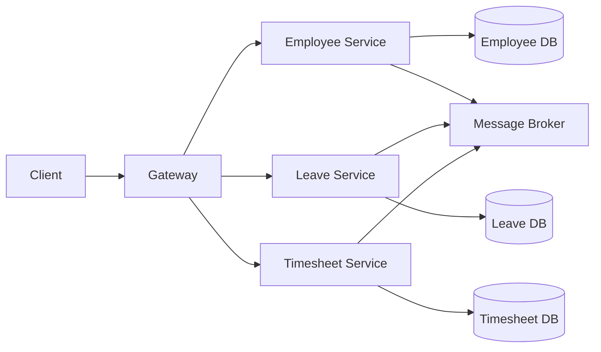
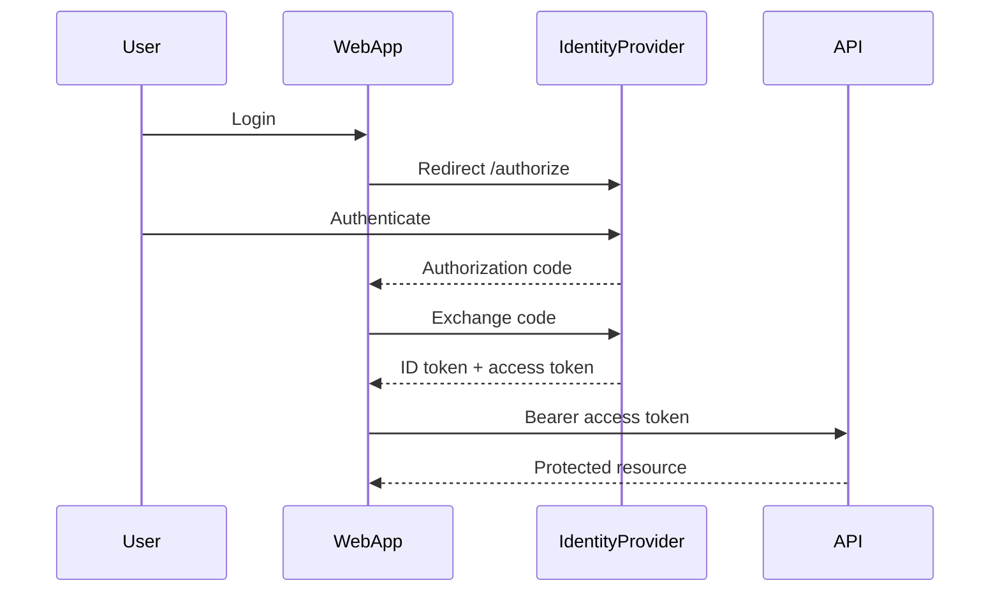
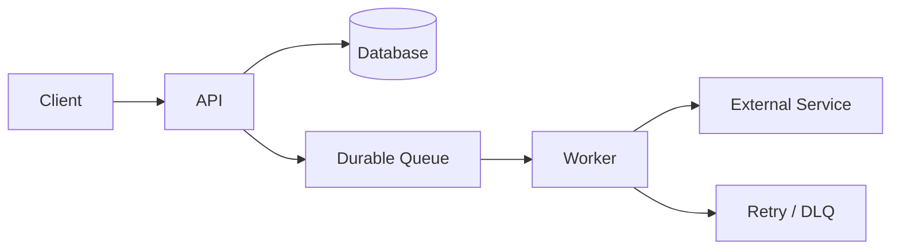
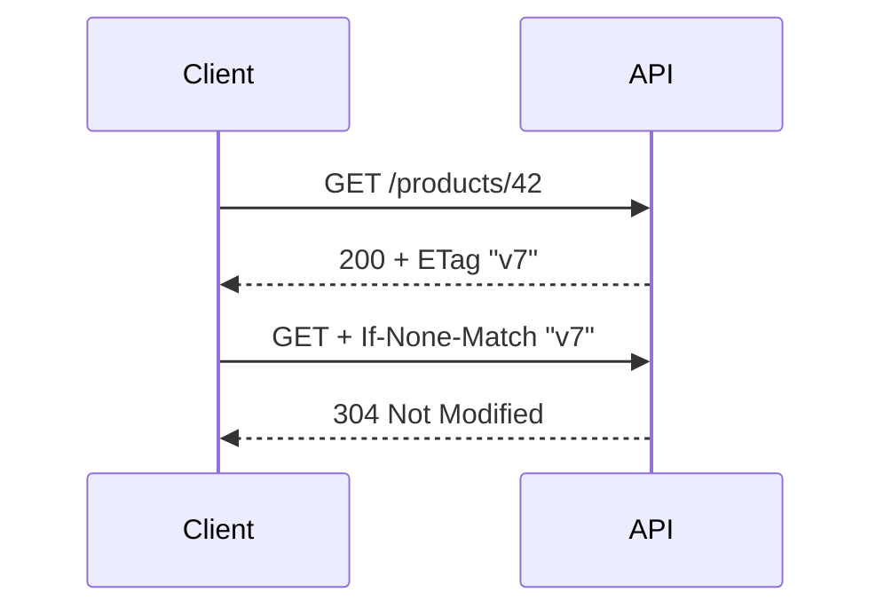
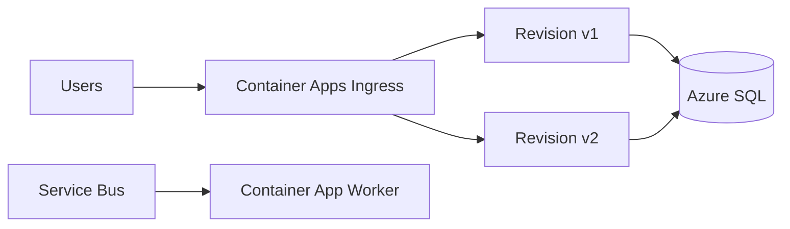
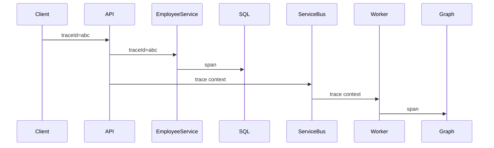
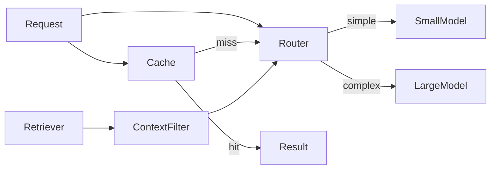
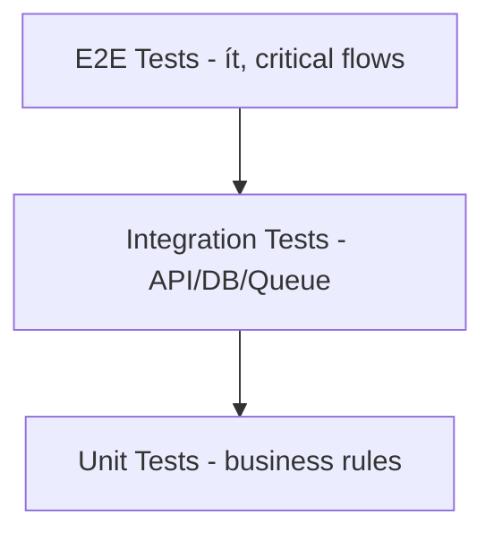

# Daily Knowledge Sharing — 2026-08-17

## Today’s Topics

1. Microservices — xác định service boundary theo business capability
2. OAuth 2.0 & OpenID Connect — authentication và authorization flow trong hệ thống hiện đại
3. Background Processing — thiết kế job bền vững thay vì fire-and-forget
4. Pessimistic Concurrency — khi nào lock dữ liệu thay vì chỉ phát hiện conflict
5. HTTP Caching — ETag, Cache-Control và giảm tải API đúng cách
6. Azure Container Apps — chạy containerized workload mà không quản lý Kubernetes trực tiếp
7. Health Checks — readiness, liveness và dependency health trong production
8. Distributed Tracing — theo dấu request xuyên qua nhiều service
9. AI Cost Optimization — kiểm soát token, model routing và caching trong LLM system
10. Testing Strategy — unit, integration, E2E và cách phân bổ test hợp lý

---

# 1. Microservices — xác định service boundary theo business capability

### 1. What is it?

Microservices là kiến trúc chia hệ thống thành nhiều service nhỏ, deploy độc lập, mỗi service chịu trách nhiệm cho một business capability tương đối rõ ràng.

Điểm quan trọng không phải là “mỗi service có một database” hay “mỗi module thành một API riêng”, mà là **service boundary phải phản ánh business ownership và khả năng thay đổi độc lập**.

Ví dụ, trong hệ thống nhân sự:

```text
Employee Service
Leave Service
Timesheet Service
Payroll Service
Notification Service
```

không có nghĩa là tất cả đều nên tách thành microservice ngay từ đầu. Chỉ nên tách khi boundary và nhu cầu vận hành thực sự đủ mạnh.

### 2. Why does it exist?

Monolith lớn thường gặp:

* mọi thay đổi cần deploy toàn hệ thống;
* một module có traffic cao làm ảnh hưởng module khác;
* team ownership khó rõ ràng;
* dependency giữa các module ngày càng rối;
* một failure có thể ảnh hưởng toàn application process.

Microservices giải quyết bằng cách cho từng capability có lifecycle riêng.

Nhưng naive solution là “cắt monolith thành 20 service CRUD”. Kết quả thường là distributed monolith: vẫn coupling chặt nhưng lại thêm network, deployment và observability complexity.

### 3. How does it work?



Service nên sở hữu:

* data model của riêng nó;
* business rules của capability đó;
* deployment lifecycle;
* API/event contract.

Cross-service communication có thể synchronous qua HTTP/gRPC hoặc asynchronous qua message broker.

### 4. Practical example

Thay vì cho Timesheet Service đọc thẳng bảng Employee:

```csharp
public interface IEmployeeDirectoryClient
{
    Task<EmployeeSummary?> GetEmployeeAsync(Guid employeeId, CancellationToken ct);
}
```

Hoặc tốt hơn với dữ liệu ổn định, Timesheet duy trì local projection từ event:

```csharp
public sealed record EmployeeUpdated(
    Guid EmployeeId,
    string DisplayName,
    string OfficeCode);
```

### 5. Real production scenario

Timesheet cần hiển thị employee name và office.

Cách coupling cao:

```text
Timesheet Service -> Employee Database
```

Cách boundary tốt hơn:

```text
Employee Service -> EmployeeUpdated event -> Timesheet local read model
```

Nếu Employee Service tạm down, Timesheet vẫn có thể đọc projection gần nhất.

### 6. Common mistakes

* Tách service theo database table.
* Shared database giữa các service rồi gọi đó là microservices.
* Mọi request đều synchronous chain qua 5–6 service.
* Không có distributed tracing.
* Không có schema/versioning policy cho event.
* Tách quá sớm khi team nhỏ và domain chưa rõ.
* Dùng microservices để giải quyết code organization problem mà Modular Monolith đủ dùng.

### 7. Trade-offs

**Advantages**

* Independent deployment và scaling.
* Boundary ownership rõ hơn.
* Failure isolation tốt hơn khi thiết kế đúng.

**Costs / Risks**

* Distributed transactions khó.
* Network failures và eventual consistency.
* DevOps, observability, deployment phức tạp hơn.
* Test end-to-end khó hơn.

### 8. Junior → Middle → Senior understanding

**Junior**

Hiểu service là boundary business chứ không chỉ là project/API riêng.

**Middle**

Biết thiết kế API/event contract, client resilience và data ownership.

**Senior / Technical Lead**

Phải quyết định khi nào tách service, boundary ở đâu, consistency model nào chấp nhận được, sync hay async, và liệu lợi ích có đáng với operational cost hay không.

### 9. Key takeaway

* Microservices không phải mặc định tốt hơn monolith.
* Boundary theo business capability quan trọng hơn kích thước codebase.
* Distributed system complexity phải được “trả tiền” bằng lợi ích deploy/scale/ownership thực sự.

---

# 2. OAuth 2.0 & OpenID Connect

### 1. What is it?

OAuth 2.0 là authorization framework cho phép client lấy access token để truy cập resource thay mặt user hoặc chính application.

OpenID Connect (OIDC) xây trên OAuth 2.0 để thêm authentication — xác định user là ai.

Nói ngắn gọn:

```text
OAuth 2.0 -> API authorization
OIDC       -> User authentication + identity
```

### 2. Why does it exist?

Nếu ứng dụng A cần truy cập API B thay user, cách naive là lưu username/password của user. Điều này không an toàn và khó quản lý permission.

Token-based authorization cho phép:

* cấp quyền giới hạn theo scope;
* token có lifetime;
* revoke/rotate credential;
* tách identity provider khỏi resource server.

### 3. How does it work?

Authorization Code Flow:



ID token dành cho client biết user identity.
Access token dành cho API authorization.

### 4. Practical example

ASP.NET Core JWT bearer validation:

```csharp
builder.Services
    .AddAuthentication("Bearer")
    .AddJwtBearer("Bearer", options =>
    {
        options.Authority = "https://login.microsoftonline.com/<tenant>/v2.0";
        options.Audience = "api://my-api";
    });

builder.Services.AddAuthorization(options =>
{
    options.AddPolicy("Timesheet.Write", policy =>
        policy.RequireClaim("scp", "timesheet.write"));
});
```

### 5. Real production scenario

Frontend SPA gọi Timesheet API:

```text
User -> Microsoft Entra ID
     -> access token(scope: timesheet.write)
     -> Timesheet API
```

API không cần biết password user. Nó chỉ validate issuer, audience, signature, expiry và claim/scope.

### 6. Common mistakes

* Dùng ID token để gọi API thay vì access token.
* Chỉ decode JWT mà không verify signature.
* Không validate audience/issuer.
* Nhầm role với scope.
* Token lifetime quá dài.
* Lưu token không an toàn trong browser.
* Cho client secret vào frontend SPA.

### 7. Trade-offs

**Advantages**

* Chuẩn hóa authentication/authorization.
* Hỗ trợ delegated và application permission.
* Dễ tích hợp Identity Provider.

**Costs / Risks**

* Flow phức tạp.
* Misconfiguration dễ tạo security hole.
* Token debugging và consent model khó với team mới.

### 8. Junior → Middle → Senior understanding

**Junior**

Phân biệt authentication và authorization, ID token và access token.

**Middle**

Biết cấu hình JWT validation, scopes, roles, policies.

**Senior / Technical Lead**

Phải thiết kế flow theo loại client, permission model, consent, token lifetime, service-to-service auth và threat model.

### 9. Key takeaway

* OAuth 2.0 không phải protocol “login”; OIDC mới thêm identity layer.
* API phải validate token đầy đủ, không chỉ đọc claim.
* Scope/role design là một phần của architecture security.

---

# 3. Background Processing — thiết kế job bền vững

### 1. What is it?

Background processing là xử lý công việc ngoài HTTP request lifecycle: gửi email, import file, sync dữ liệu, resize ảnh, generate report, cleanup dữ liệu...

Điểm quan trọng là job phải **durable, retryable và observable**, không chỉ là `Task.Run()`.

### 2. Why does it exist?

Nếu request phải chờ xử lý lâu:

* client timeout;
* request thread giữ resource;
* user experience kém;
* downstream service lỗi làm API fail.

Naive approach:

```csharp
Task.Run(() => SendEmailAsync());
```

Nếu process restart, job mất. Exception có thể không được quản lý. Scope dependency cũng có thể bị dispose.

### 3. How does it work?



API thường trả `202 Accepted` khi work được enqueue thành công.

### 4. Practical example

Hangfire:

```csharp
public IActionResult GenerateReport(Guid reportId)
{
    BackgroundJob.Enqueue<IReportJob>(
        job => job.GenerateAsync(reportId, CancellationToken.None));

    return Accepted();
}
```

Worker:

```csharp
public sealed class ReportJob(AppDbContext db, ILogger<ReportJob> logger)
{
    public async Task GenerateAsync(Guid reportId, CancellationToken ct)
    {
        var report = await db.Reports.FindAsync([reportId], ct);
        if (report is null || report.Status == ReportStatus.Completed)
            return;

        // generate output
    }
}
```

Job nên idempotent vì retry có thể chạy lại.

### 5. Real production scenario

Microsoft 365 offboarding gồm nhiều bước: convert mailbox, forwarding, auto reply, license cleanup.

Thay vì thực hiện toàn bộ trong API:

```text
POST deactivate employee
      ↓
DB commit
      ↓
Queue offboarding job
      ↓
Worker xử lý từng side effect
```

API nhanh hơn và retry riêng từng failure.

### 6. Common mistakes

* Fire-and-forget bằng `Task.Run()` trong ASP.NET Core.
* Job không idempotent.
* Retry cả lỗi permanent.
* Không có max retry/DLQ.
* Không log job ID/correlation ID.
* Không xử lý graceful shutdown.
* Giữ transaction database quá lâu trong job.

### 7. Trade-offs

**Advantages**

* API latency thấp hơn.
* Retry và isolation tốt.
* Xử lý workload dài/dạng batch hiệu quả.

**Costs / Risks**

* Eventual completion.
* Cần queue/job storage.
* Debug async workflow khó hơn.

### 8. Junior → Middle → Senior understanding

**Junior**

Hiểu background job khác request thread.

**Middle**

Biết retry, idempotency, queue, Hangfire/worker service.

**Senior / Technical Lead**

Phải thiết kế durability, concurrency, deduplication, scheduling, poison jobs, shutdown và recovery strategy.

### 9. Key takeaway

* Fire-and-forget không đồng nghĩa background processing bền vững.
* Job phải được lưu ở nơi survive process restart.
* Retry chỉ an toàn khi job idempotent.

---

# 4. Pessimistic Concurrency

### 1. What is it?

Pessimistic concurrency giả định conflict có khả năng cao, nên lock dữ liệu trước khi sửa để các transaction khác không thay đổi cùng resource cho tới khi lock được release.

### 2. Why does it exist?

Optimistic concurrency phù hợp khi conflict hiếm. Nhưng với inventory hoặc financial allocation có contention cao, retry liên tục có thể tốn kém hoặc gây business risk.

Ví dụ chỉ còn 1 seat nhưng 100 request đặt cùng lúc.

### 3. How does it work?

SQL Server có thể dùng transaction với locking hints trong trường hợp cụ thể:

```sql
BEGIN TRANSACTION;

SELECT AvailableSeats
FROM EventInventory WITH (UPDLOCK, ROWLOCK)
WHERE EventId = @EventId;

UPDATE EventInventory
SET AvailableSeats = AvailableSeats - 1
WHERE EventId = @EventId
  AND AvailableSeats > 0;

COMMIT;
```

`UPDLOCK` giúp giữ update lock để transaction khác không cùng sửa resource theo flow tương tự.

### 4. Practical example

EF Core đôi khi cần raw SQL cho locking semantics cụ thể:

```csharp
await using var tx = await db.Database.BeginTransactionAsync(ct);

var inventory = await db.EventInventories
    .FromSqlInterpolated($@
        SELECT * FROM EventInventory WITH (UPDLOCK, ROWLOCK)
        WHERE EventId = {eventId}")
    .SingleAsync(ct);

if (inventory.AvailableSeats <= 0)
    throw new InvalidOperationException("Sold out");

inventory.AvailableSeats--;
await db.SaveChangesAsync(ct);
await tx.CommitAsync(ct);
```

### 5. Real production scenario

Ticket booking:

```text
Request A locks row
Request B waits
A decrements inventory and commits
B continues, sees remaining count mới
```

Đổi lại, latency có thể tăng khi contention cao.

### 6. Common mistakes

* Giữ lock trong khi gọi external API.
* Transaction kéo dài hàng chục giây.
* Lock nhiều row theo thứ tự không nhất quán gây deadlock.
* Dùng pessimistic locking cho mọi CRUD.
* Không có timeout.

### 7. Trade-offs

**Advantages**

* Ngăn concurrent modification trực tiếp.
* Phù hợp resource contention cao.

**Costs / Risks**

* Blocking.
* Deadlock.
* Throughput giảm.
* Transaction design khó hơn.

### 8. Junior → Middle → Senior understanding

**Junior**

Hiểu lock ngăn người khác cùng sửa resource.

**Middle**

Biết transaction scope, lock duration và deadlock risk.

**Senior / Technical Lead**

Phải chọn optimistic vs pessimistic dựa trên contention, business invariant, throughput và failure model.

### 9. Key takeaway

* Pessimistic concurrency trả giá bằng blocking để đổi lấy kiểm soát conflict mạnh hơn.
* Lock càng ngắn càng tốt.
* Không gọi external dependency khi đang giữ database lock nếu có thể tránh.

---

# 5. HTTP Caching — ETag và Cache-Control

### 1. What is it?

HTTP caching tận dụng chuẩn HTTP để browser, CDN hoặc proxy tránh tải lại response không thay đổi.

Hai cơ chế quan trọng:

* freshness caching qua `Cache-Control`;
* revalidation qua `ETag` / `If-None-Match`.

### 2. Why does it exist?

Không phải mọi optimization đều cần Redis. Với static hoặc semi-static API response, HTTP cache có thể giảm:

* bandwidth;
* server CPU;
* serialization;
* request latency.

### 3. How does it work?



Client dùng body cũ và server không cần gửi lại payload.

### 4. Practical example

ASP.NET Core:

```csharp
app.MapGet("/products/{id:int}", async (int id, HttpContext ctx, AppDbContext db) =>
{
    var product = await db.Products.FindAsync(id);
    if (product is null) return Results.NotFound();

    var etag = $"\"{product.Version}\"";

    if (ctx.Request.Headers.IfNoneMatch == etag)
        return Results.StatusCode(StatusCodes.Status304NotModified);

    ctx.Response.Headers.ETag = etag;
    ctx.Response.Headers.CacheControl = "private,max-age=60";

    return Results.Ok(product);
});
```

### 5. Real production scenario

Product catalog được đọc hàng nghìn lần nhưng thay đổi ít.

Browser/CDN có thể cache 60 giây. Sau đó ETag giúp revalidate mà không tải lại body nếu dữ liệu chưa đổi.

### 6. Common mistakes

* Cache response chứa dữ liệu user-specific dưới `public` cache.
* Không hiểu `no-cache` khác `no-store`.
* ETag không đổi khi resource đổi.
* Cache API mutation response tùy tiện.
* Không xem CDN/browser behavior.

### 7. Trade-offs

**Advantages**

* Tận dụng protocol sẵn có.
* Giảm bandwidth và server work.
* Không cần cache infrastructure riêng cho nhiều use case.

**Costs / Risks**

* Stale data nếu max-age không hợp lý.
* Cache policy phức tạp với personalized data.
* Debug multi-layer cache khó.

### 8. Junior → Middle → Senior understanding

**Junior**

Hiểu client có thể reuse response cũ.

**Middle**

Biết `Cache-Control`, `ETag`, `304` và cache scope.

**Senior / Technical Lead**

Phải thiết kế caching hierarchy browser/CDN/API/Redis, freshness requirement và security boundary.

### 9. Key takeaway

* HTTP cache thường nên được xem xét trước khi thêm custom distributed cache cho public read API.
* ETag giảm payload khi resource không đổi.
* Cache policy phải xét dữ liệu có user-specific hay sensitive hay không.

---

# 6. Azure Container Apps

### 1. What is it?

Azure Container Apps là managed platform để chạy containerized applications với autoscaling, ingress, revisions và event-driven scaling mà không cần trực tiếp vận hành Kubernetes cluster.

### 2. Why does it exist?

App Service rất thuận tiện cho web app, Kubernetes mạnh nhưng operationally nặng.

Container Apps nằm giữa hai lựa chọn:

```text
App Service      -> đơn giản
Container Apps   -> container-native + flexible scaling
AKS              -> full Kubernetes control
```

### 3. How does it work?



Có thể scale theo HTTP traffic hoặc event source như queue length.

### 4. Practical example

Một .NET worker container:

```dockerfile
FROM mcr.microsoft.com/dotnet/aspnet:8.0 AS base
WORKDIR /app
COPY publish/ .
ENTRYPOINT ["dotnet", "Worker.dll"]
```

Deploy Container App với min replicas = 0 cho event-driven worker để tiết kiệm cost khi idle.

### 5. Real production scenario

Image processing worker chỉ chạy khi có message trong Service Bus.

Container Apps + event scaling có thể:

```text
Queue empty -> 0 replicas
Queue grows -> scale to N replicas
Queue drained -> scale down
```

### 6. Common mistakes

* Chọn Container Apps nhưng vẫn phụ thuộc local filesystem như persistent disk.
* Không hiểu scale-to-zero cold start.
* Không set CPU/memory limit đúng.
* Không dùng Managed Identity.
* Không kiểm soát outbound networking.

### 7. Trade-offs

**Advantages**

* Container-native nhưng ít vận hành hơn AKS.
* Revisions và autoscaling tốt.
* Phù hợp HTTP + worker workloads.

**Costs / Risks**

* Ít control hơn AKS.
* Networking nâng cao có thể phức tạp.
* Cold start khi scale từ zero.

### 8. Junior → Middle → Senior understanding

**Junior**

Hiểu Container App chạy container như deployable unit.

**Middle**

Biết ingress, revision, scaling, environment variables và identity.

**Senior / Technical Lead**

Phải chọn giữa App Service, Functions, Container Apps và AKS dựa trên workload, operational maturity, cost và networking.

### 9. Key takeaway

* Container Apps phù hợp khi cần container flexibility nhưng chưa cần full Kubernetes.
* Scale-to-zero rất hữu ích cho event-driven workload.
* Platform choice nên dựa vào workload, không dựa vào trend.

---

# 7. Health Checks — readiness và liveness

### 1. What is it?

Health Check là endpoint hoặc signal cho platform biết application có đang hoạt động và có sẵn sàng nhận traffic hay không.

Hai khái niệm:

* **Liveness**: process còn sống không?
* **Readiness**: instance có đủ điều kiện phục vụ request không?

### 2. Why does it exist?

Process có thể vẫn chạy nhưng không phục vụ được vì:

* DB unavailable;
* config chưa load;
* migration đang chạy;
* dependency critical bị lỗi;
* startup chưa hoàn tất.

### 3. How does it work?

```mermaid
flowchart LR
    LoadBalancer --> Health[/health/ready]
    Health --> App
    App --> DB[(DB)]
    App --> Redis
    LoadBalancer -->|only healthy instances| Traffic[Production Traffic]
```

Readiness fail -> stop routing traffic.
Liveness fail -> platform có thể restart instance.

### 4. Practical example

```csharp
builder.Services.AddHealthChecks()
    .AddSqlServer(connectionString, name: "sql")
    .AddRedis(redisConnection, name: "redis");

app.MapHealthChecks("/health/ready");
app.MapHealthChecks("/health/live", new HealthCheckOptions
{
    Predicate = _ => false
});
```

Liveness không nhất thiết check external dependencies.

### 5. Real production scenario

Redis bị down nhưng API vẫn có fallback DB.

Nếu readiness bắt buộc Redis healthy, tất cả instances có thể bị rút khỏi load balancer — biến dependency non-critical thành full outage.

Health policy phải phản ánh actual serving capability.

### 6. Common mistakes

* Liveness gọi DB và restart app liên tục khi DB down.
* Health check quá nặng.
* Chỉ trả `200 OK` cố định.
* Không phân biệt critical và optional dependency.
* Endpoint health public và expose chi tiết nhạy cảm.

### 7. Trade-offs

**Advantages**

* Routing/restart tự động tốt hơn.
* Hỗ trợ deployment và autoscaling.

**Costs / Risks**

* Sai health policy có thể làm outage nặng hơn.
* Dependency check tạo thêm load.

### 8. Junior → Middle → Senior understanding

**Junior**

Hiểu health endpoint cho biết app có phục vụ được không.

**Middle**

Biết readiness/liveness và dependency checks.

**Senior / Technical Lead**

Phải quyết định dependency nào critical, degraded mode nào chấp nhận được và health failure sẽ trigger routing/restart behavior ra sao.

### 9. Key takeaway

* Liveness và readiness giải quyết hai câu hỏi khác nhau.
* Không đưa mọi dependency vào health check một cách máy móc.
* Health policy là một phần của reliability design.

---

# 8. Distributed Tracing

### 1. What is it?

Distributed tracing theo dõi một logical request xuyên qua nhiều process/service bằng trace ID và span hierarchy.

### 2. Why does it exist?

Trong distributed system, log từng service riêng lẻ không đủ trả lời:

* request chậm ở đâu?
* service nào retry?
* dependency nào gây lỗi?
* message consumer có thuộc cùng business flow không?

### 3. How does it work?



Mỗi operation tạo span, nhưng cùng trace ID.

### 4. Practical example

```csharp
private static readonly ActivitySource Source = new("Timesheet.Api");

using var activity = Source.StartActivity("SubmitTimesheet");
activity?.SetTag("timesheet.id", timesheetId);

await service.SubmitAsync(timesheetId, ct);
```

HTTP instrumentation có thể tự propagate W3C Trace Context.

### 5. Real production scenario

Submit timesheet mất 7 giây.

Trace:

```text
POST /submit             7.1s
 ├─ SQL update           100ms
 ├─ Approval API          80ms
 └─ Notification API     6.8s
```

Bottleneck rõ ràng hơn việc grep nhiều log files.

### 6. Common mistakes

* Không propagate context qua queue.
* Tag dữ liệu high-cardinality quá mức.
* Không có sampling strategy.
* Span name chứa dynamic ID làm khó aggregate.
* Chỉ trace happy path.

### 7. Trade-offs

**Advantages**

* Root-cause latency nhanh.
* Hiểu cross-service dependency.

**Costs / Risks**

* Telemetry cost.
* Storage lớn.
* Sampling có thể bỏ lỡ incident hiếm.

### 8. Junior → Middle → Senior understanding

**Junior**

Hiểu trace là timeline của request qua nhiều component.

**Middle**

Biết Activity/OpenTelemetry, span, trace ID và propagation.

**Senior / Technical Lead**

Phải thiết kế sampling, naming convention, correlation qua async messaging và telemetry cost governance.

### 9. Key takeaway

* Trace nối nhiều service thành một business flow.
* Correlation phải đi qua cả HTTP lẫn messaging.
* Tracing tốt giúp biến “API chậm” thành “dependency X chậm ở span Y”.

---

# 9. AI Cost Optimization

### 1. What is it?

AI cost optimization là kiểm soát chi phí LLM bằng cách quản lý model choice, token usage, caching, batching, retrieval và workflow architecture.

### 2. Why does it exist?

Một AI feature có thể chạy tốt ở demo nhưng trở nên đắt khi scale vì:

```text
long system prompt
+ full conversation history
+ large retrieved documents
+ expensive model
+ retries
= high cost/request
```

### 3. How does it work?



Các lever chính:

* model routing;
* prompt compression;
* context pruning;
* semantic/exact caching;
* batch processing;
* output token limits;
* retrieval top-k tuning.

### 4. Practical example

```csharp
var model = request.TaskType switch
{
    TaskType.Classification => "small-model",
    TaskType.Extraction => "small-model",
    TaskType.ArchitectureReview => "large-model",
    _ => "small-model"
};

var maxOutputTokens = request.TaskType == TaskType.Classification
    ? 200
    : 1500;
```

Deterministic router tốt hơn việc luôn dùng model đắt nhất.

### 5. Real production scenario

Support platform có 100k tickets/ngày.

Classification chỉ cần enum + confidence, nên small model đủ dùng. Chỉ ticket ambiguous mới escalate sang larger model.

```text
100% large model
vs
90% small + 10% large
```

có thể tạo chênh lệch cost rất lớn.

### 6. Common mistakes

* Luôn dùng model mạnh nhất.
* Gửi full chat history mỗi request.
* Retrieval lấy quá nhiều chunk.
* Không set output limit.
* Retry model timeout không có budget.
* Không track cost theo feature/tenant.

### 7. Trade-offs

**Advantages**

* Giảm unit economics.
* Tăng khả năng scale.

**Costs / Risks**

* Model routing sai có thể giảm quality.
* Aggressive context pruning có thể mất thông tin.
* Cache có stale behavior.

### 8. Junior → Middle → Senior understanding

**Junior**

Hiểu token và model choice ảnh hưởng chi phí.

**Middle**

Biết log usage, giới hạn context/output và cache.

**Senior / Technical Lead**

Phải tối ưu theo quality-cost-latency frontier, thiết kế routing/evaluation và budget guardrails theo tenant/feature.

### 9. Key takeaway

* AI cost là architecture concern, không chỉ billing concern.
* Model mạnh nhất không nên là default cho mọi task.
* Đo cost theo business operation thay vì chỉ tổng hóa đơn.

---

# 10. Testing Strategy — Unit, Integration và E2E

### 1. What is it?

Testing Strategy là cách phân bổ loại test để đạt confidence đủ cao với chi phí maintain hợp lý.

Ba lớp phổ biến:

```text
Unit Test        -> logic nhỏ, nhanh
Integration Test -> component + dependency thật
E2E Test         -> full user/business flow
```

### 2. Why does it exist?

Chỉ unit test không phát hiện lỗi DB mapping/API contract.
Chỉ E2E test thì chậm, flaky và khó debug.

Cần phối hợp nhiều lớp.

### 3. How does it work?



Không nhất thiết phải theo “testing pyramid” cứng nhắc, nhưng phần lớn logic nên được test ở lớp rẻ nhất có thể phát hiện bug đó.

### 4. Practical example

Unit test:

```csharp
[Fact]
public void BillableHours_CannotExceedActualHours()
{
    var entry = new TimesheetEntry(actualHours: 8);

    Assert.Throws<DomainException>(() => entry.SetBillableHours(9));
}
```

Integration test:

```csharp
[Fact]
public async Task PostTimesheet_Returns409_WhenConcurrencyConflict()
{
    // run against test database + real ASP.NET Core pipeline
}
```

E2E test:

```text
Login -> Open Timesheet -> Submit -> Manager Approves -> Status = Approved
```

### 5. Real production scenario

Timesheet release có regression ở approval flow.

Unit test có thể đảm bảo domain rules.
Integration test đảm bảo EF/API behavior.
E2E test đảm bảo user journey critical vẫn hoạt động.

### 6. Common mistakes

* Unit test implementation detail quá nhiều.
* Mock mọi thứ, test không còn giá trị.
* E2E test cho mọi edge case.
* Integration test không reset data.
* Flaky test bị ignore thay vì sửa.
* Không test migration/serialization/API contract.

### 7. Trade-offs

**Advantages**

* Nhiều lớp bắt nhiều loại bug.
* Fast feedback ở unit/integration.
* E2E bảo vệ critical flow.

**Costs / Risks**

* Test suite lớn tốn maintenance.
* E2E chậm/flaky.
* Test data/environment management khó.

### 8. Junior → Middle → Senior understanding

**Junior**

Biết mỗi loại test bắt loại bug khác nhau.

**Middle**

Biết chọn mock vs real dependency và tổ chức integration test.

**Senior / Technical Lead**

Phải thiết kế test portfolio theo risk: business criticality, change frequency, failure impact và feedback speed.

### 9. Key takeaway

* Không phải càng nhiều E2E càng tốt.
* Test bug ở layer thấp nhất nhưng đủ thực tế để bắt lỗi đó.
* Testing strategy tốt tối ưu confidence / speed / maintenance cost.