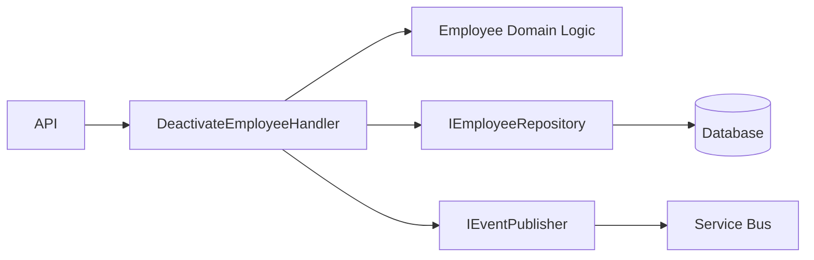
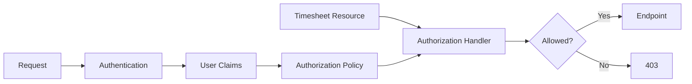
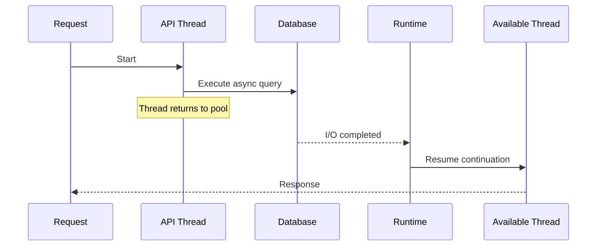
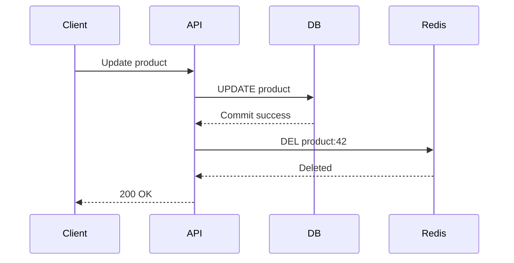
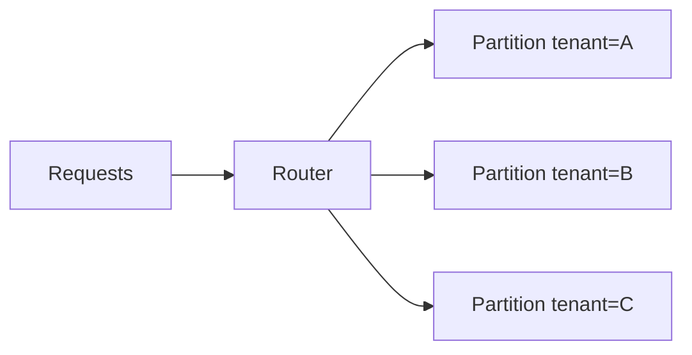
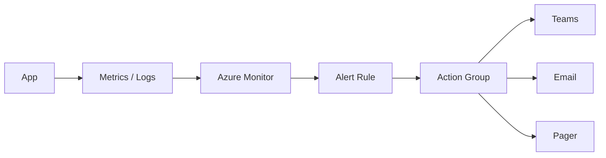
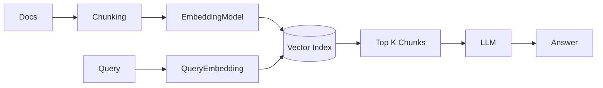
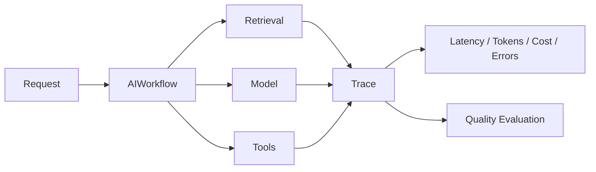
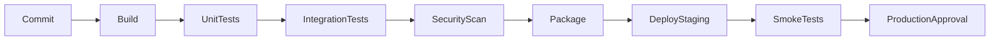

# Daily Knowledge Sharing — 2026-08-17

## Today’s Topics

1. SOLID trong codebase thật — dùng nguyên tắc để giảm coupling thay vì tạo abstraction hình thức
2. Authorization Policy trong ASP.NET Core — từ role-based sang requirement-based authorization
3. Async & Concurrency trong .NET — phân biệt asynchronous I/O, parallelism và shared-state race condition
4. EF Core Query Shaping — projection, tracking, split query và cách tránh tải dữ liệu thừa
5. Cache Invalidation — thiết kế consistency giữa database và cache
6. Azure Cosmos DB — partition key, request units và cách tránh hot partition
7. Azure Monitor Alerting — biến telemetry thành tín hiệu vận hành thực sự
8. Vector Search — embeddings, similarity và retrieval pipeline cho AI application
9. AI Observability — theo dõi latency, token, cost, quality và failure của LLM workflow
10. CI/CD Quality Gates — ngăn code kém chất lượng đi vào production trước khi deployment xảy ra

---

# 1. SOLID trong codebase thật — giảm coupling thay vì tạo abstraction hình thức

### 1. What is it?

SOLID là tập hợp năm nguyên tắc thiết kế object-oriented nhằm giúp code dễ thay đổi, test và mở rộng hơn:

- **S — Single Responsibility Principle**: một module nên có một lý do chính để thay đổi.
- **O — Open/Closed Principle**: mở cho việc mở rộng nhưng hạn chế sửa code ổn định.
- **L — Liskov Substitution Principle**: implementation thay thế abstraction mà không phá hành vi mong đợi.
- **I — Interface Segregation Principle**: interface nhỏ, tập trung, không ép client phụ thuộc thứ không dùng.
- **D — Dependency Inversion Principle**: high-level policy không phụ thuộc trực tiếp low-level detail.

Trong production, SOLID không phải checklist để tạo thật nhiều interface. Mục tiêu là **quản lý dependency và tốc độ thay đổi của code**.

### 2. Why does it exist?

Codebase lớn thường khó bảo trì không phải vì thiếu pattern mà vì coupling tăng dần.

Ví dụ một `EmployeeService` làm tất cả:

```text
Validate employee
→ Update EF Core
→ Call Microsoft Graph
→ Send email
→ Write audit
→ Generate Excel
→ Publish message
```

Mỗi thay đổi ở email, Graph, DB hay reporting đều buộc sửa cùng class. Test cũng phải mock rất nhiều dependencies.

Naive solution thường là “tạo một interface cho mọi class”. Nhưng nếu interface vẫn gom 20 methods và business orchestration vẫn nằm trong một giant service thì coupling chưa giảm.

### 3. How does it work?

Ví dụ tách responsibility:



Thay vì handler trực tiếp biết Graph, email và audit, nó chỉ publish một event. Các detail nằm sau abstraction hoặc downstream consumer.

### 4. Practical example

Không tốt:

```csharp
public class EmployeeService
{
    public async Task DeactivateAsync(Guid id)
    {
        var employee = await _db.Employees.FindAsync(id);
        employee.IsActive = false;
        await _db.SaveChangesAsync();

        await _graph.DisableUserAsync(employee.Email);
        await _email.SendAsync(employee.Email, "Disabled");
        await _audit.WriteAsync("Employee disabled");
    }
}
```

Tốt hơn:

```csharp
public sealed class DeactivateEmployeeHandler
{
    private readonly IEmployeeRepository _employees;
    private readonly IEventPublisher _events;

    public DeactivateEmployeeHandler(
        IEmployeeRepository employees,
        IEventPublisher events)
    {
        _employees = employees;
        _events = events;
    }

    public async Task Handle(Guid id, CancellationToken ct)
    {
        var employee = await _employees.GetAsync(id, ct)
            ?? throw new InvalidOperationException("Employee not found");

        employee.Deactivate();
        await _employees.SaveChangesAsync(ct);
        await _events.PublishAsync(new EmployeeDeactivated(id), ct);
    }
}
```

### 5. Real production scenario

Trong hệ thống HR, ban đầu deactivate employee chỉ update DB. Sau đó business thêm:

- disable Entra account;
- convert Exchange mailbox;
- revoke licenses;
- write audit;
- notify manager.

Nếu mọi side effect nằm trong cùng service, release nhỏ dễ phá nhiều thứ. Khi boundary rõ, mỗi integration có thể thay đổi độc lập hơn.

### 6. Common mistakes

- Một class chỉ có 30 dòng nhưng vẫn tách thành 7 abstraction vì “SOLID”.
- Interface giống hệt class và chỉ có một implementation nhưng không bảo vệ boundary nào.
- Dùng inheritance để reuse code, vô tình vi phạm LSP.
- Tạo interface quá lớn như `IEmployeeService` chứa mọi nghiệp vụ employee.
- Mọi dependency đều inject, nhưng business logic vẫn procedural và tightly coupled.
- Áp SOLID máy móc vào CRUD nhỏ khiến code khó đọc hơn.

### 7. Trade-offs

**Advantages**

- Thay đổi localized hơn.
- Unit test dễ hơn.
- Boundary rõ cho team ownership.
- Giảm khả năng một thay đổi lan rộng.

**Costs / Risks**

- Nhiều type và abstraction hơn.
- Quá nhiều indirection khiến debug khó.
- Overengineering nếu domain đơn giản.

### 8. Junior → Middle → Senior understanding

**Junior**

Hiểu mỗi class không nên “làm tất cả” và dependency nên rõ.

**Middle**

Biết refactor giant service, tách interface có ý nghĩa và dùng composition thay inheritance khi phù hợp.

**Senior / Technical Lead**

Phải nhìn SOLID như công cụ quản lý changeability. Không phải mọi dependency đều cần abstraction; chỉ boundary có volatility, external dependency hoặc policy/value rõ mới đáng tách mạnh.

### 9. Key takeaway

- SOLID giúp kiểm soát coupling, không phải tăng số lượng file.
- Abstraction chỉ có giá trị khi nó bảo vệ một boundary.
- Ưu tiên simplicity trước, refactor khi pressure thay đổi xuất hiện.

---

# 2. Authorization Policy trong ASP.NET Core

### 1. What is it?

Authorization trả lời câu hỏi: **“User đã authenticated rồi, nhưng họ được phép làm gì?”**

ASP.NET Core hỗ trợ role-based authorization nhưng policy-based authorization linh hoạt hơn. Một policy có thể dựa trên:

- role;
- claim;
- tenant;
- resource ownership;
- department;
- permission trong database;
- custom business rule.

### 2. Why does it exist?

Role-only model thường sớm bị giới hạn.

Ví dụ:

```text
Role = Manager
```

nhưng business rule thật có thể là:

```text
Manager chỉ được approve timesheet
nếu employee thuộc team của manager
và period chưa locked
và manager không phải người tạo entry
```

Một `[Authorize(Roles = "Manager")]` không đủ để biểu diễn rule này.

### 3. How does it work?



Policy định nghĩa requirement. Handler quyết định requirement có được satisfy dựa trên user và resource hay không.

### 4. Practical example

```csharp
public sealed record CanApproveTimesheetRequirement
    : IAuthorizationRequirement;

public sealed class CanApproveTimesheetHandler
    : AuthorizationHandler<CanApproveTimesheetRequirement, Timesheet>
{
    protected override Task HandleRequirementAsync(
        AuthorizationHandlerContext context,
        CanApproveTimesheetRequirement requirement,
        Timesheet resource)
    {
        var employeeId = context.User.FindFirst("employee_id")?.Value;

        if (resource.ManagerEmployeeId == employeeId && !resource.IsLocked)
        {
            context.Succeed(requirement);
        }

        return Task.CompletedTask;
    }
}
```

Registration:

```csharp
builder.Services.AddAuthorization(options =>
{
    options.AddPolicy("CanApproveTimesheet", policy =>
        policy.Requirements.Add(new CanApproveTimesheetRequirement()));
});
```

### 5. Real production scenario

Timesheet API nhận request:

```http
POST /timesheets/123/approve
```

Flow:

1. JWT được validate.
2. API load timesheet 123.
3. Authorization service evaluate current user với resource.
4. Handler kiểm tra manager/team/lock state.
5. Nếu fail → 403.
6. Nếu pass → application command chạy.

Authorization phải được kiểm tra server-side dù UI đã ẩn nút Approve.

### 6. Common mistakes

- Dùng authentication thay authorization.
- Tin frontend permission check là đủ.
- Hard-code role string ở hàng chục endpoint.
- Token chứa quá nhiều permission stale trong thời gian dài.
- Authorization handler query database quá nhiều lần mỗi request.
- Return `404` hay `403` không nhất quán và vô tình leak resource existence.

### 7. Trade-offs

**Advantages**

- Business permission rõ ràng hơn.
- Tái sử dụng policy giữa endpoints.
- Hỗ trợ resource-based authorization.

**Costs / Risks**

- Complex permission model dễ khó debug.
- Nếu policy gọi DB quá nhiều có thể tăng latency.
- Claim-based decision có vấn đề freshness.

### 8. Junior → Middle → Senior understanding

**Junior**

Phân biệt authentication với authorization.

**Middle**

Biết implement policy, requirement, handler và resource-based authorization.

**Senior / Technical Lead**

Phải quyết định permission source of truth, token freshness, tenant isolation, caching, audit và deny-by-default strategy.

### 9. Key takeaway

- Authentication = ai đang gọi; Authorization = được phép làm gì.
- Role chỉ là một input, không phải toàn bộ permission model.
- Business authorization quan trọng nên biểu diễn bằng policy rõ ràng.

---

# 3. Async & Concurrency trong .NET

### 1. What is it?

`async/await` giúp thread không bị block khi chờ I/O. Nó **không đồng nghĩa với chạy song song**.

Cần phân biệt:

- **Asynchronous I/O**: chờ DB/HTTP/file mà không giữ thread.
- **Parallelism**: nhiều computation chạy đồng thời trên nhiều core.
- **Concurrency**: nhiều operation tiến triển trong cùng khoảng thời gian và có thể tranh chấp shared state.

### 2. Why does it exist?

Web server có thread pool hữu hạn. Nếu mỗi request block thread trong khi chờ network:

```text
Thread -> HTTP call -> block 3s
```

traffic tăng sẽ gây thread pool starvation.

`await` giải phóng thread trong thời gian I/O chưa hoàn tất, giúp server phục vụ request khác.

### 3. How does it work?



### 4. Practical example

Tốt:

```csharp
public async Task<EmployeeDto?> GetEmployeeAsync(Guid id, CancellationToken ct)
{
    return await db.Employees
        .AsNoTracking()
        .Where(x => x.Id == id)
        .Select(x => new EmployeeDto(x.Id, x.Name))
        .SingleOrDefaultAsync(ct);
}
```

Không tốt:

```csharp
var employee = GetEmployeeAsync(id, ct).Result;
```

Hoặc:

```csharp
Task.Run(() => db.Employees.ToList());
```

cho database I/O trong ASP.NET Core — đây thường không phải optimization.

### 5. Real production scenario

API cần gọi ba independent downstream services:

```csharp
var profileTask = profileClient.GetAsync(id, ct);
var permissionTask = permissionClient.GetAsync(id, ct);
var leaveTask = leaveClient.GetBalanceAsync(id, ct);

await Task.WhenAll(profileTask, permissionTask, leaveTask);
```

Nếu các call thực sự độc lập, concurrent I/O có thể giảm tổng latency từ tổng thời gian thành gần bằng call chậm nhất.

Nhưng nếu downstream giới hạn rate hoặc database connection pool nhỏ, parallelism quá mức có thể làm hệ thống tệ hơn.

### 6. Common mistakes

- Dùng `.Result` hoặc `.Wait()` trong request path.
- `Task.Run` cho I/O async vốn đã non-blocking.
- `Task.WhenAll` hàng nghìn operation không giới hạn concurrency.
- Shared mutable state giữa tasks mà không synchronization.
- Không propagate `CancellationToken`.
- Fire-and-forget task trong request rồi app recycle làm task mất.

### 7. Trade-offs

**Advantages**

- Throughput tốt hơn cho I/O-heavy workloads.
- Giảm thread blocking.
- Có thể giảm latency với independent calls.

**Costs / Risks**

- Debug concurrency khó.
- Concurrency cao gây pressure lên DB/API downstream.
- Exception aggregation/cancellation phức tạp hơn.

### 8. Junior → Middle → Senior understanding

**Junior**

Biết `await` không có nghĩa là “tạo thread mới”.

**Middle**

Biết `Task.WhenAll`, cancellation, timeout và tránh sync-over-async.

**Senior / Technical Lead**

Phải thiết kế concurrency budget theo connection pool, downstream rate limits, CPU, memory và queue depth; concurrency không thể tăng vô hạn.

### 9. Key takeaway

- Async tối ưu việc chờ I/O, không phải CPU-bound computation.
- Parallelize chỉ khi operation độc lập và downstream chịu được tải.
- Concurrency luôn cần giới hạn.

---

# 4. EF Core Query Shaping

### 1. What is it?

Query shaping là cách xác định chính xác dữ liệu EF Core cần lấy về và cách entity graph được materialize.

Các công cụ quan trọng gồm:

- `Select` projection;
- `AsNoTracking`;
- `Include`;
- `AsSplitQuery`;
- filtering;
- pagination;
- compiled query trong trường hợp đặc biệt.

### 2. Why does it exist?

Một query đúng về logic vẫn có thể tệ về performance.

Ví dụ:

```csharp
var employees = await db.Employees
    .Include(x => x.Timesheets)
    .Include(x => x.LeaveRequests)
    .ToListAsync();
```

Nếu mỗi employee có hàng trăm child rows, join có thể tạo cartesian explosion và truyền lượng dữ liệu rất lớn.

### 3. How does it work?

```text
Business need
   ↓
Select only required columns
   ↓
Choose tracking/no-tracking
   ↓
Choose single vs split query
   ↓
Apply pagination
   ↓
Inspect generated SQL
```

### 4. Practical example

Không tốt:

```csharp
var employees = await db.Employees
    .Include(x => x.Department)
    .Include(x => x.Timesheets)
    .ToListAsync(ct);

return employees.Select(x => new EmployeeListItem(...));
```

Tốt hơn:

```csharp
var employees = await db.Employees
    .AsNoTracking()
    .OrderBy(x => x.Name)
    .Select(x => new EmployeeListItem(
        x.Id,
        x.Name,
        x.Department.Name,
        x.Timesheets.Count(t => t.WorkDate >= from && t.WorkDate < to)))
    .Take(100)
    .ToListAsync(ct);
```

### 5. Real production scenario

Dashboard employee list chỉ cần:

- name;
- department;
- active status;
- timesheet count tháng hiện tại.

Load full Employee aggregate + all Timesheet rows là waste. Projection đẩy phần lớn computation xuống SQL và giảm memory allocation ở API.

### 6. Common mistakes

- `Include` mọi navigation vì “có thể cần”.
- Tracking read-only query.
- `ToListAsync()` quá sớm rồi filter trong memory.
- Pagination bằng `Skip` lớn trên bảng rất lớn mà không xem keyset pagination.
- Dùng lazy loading gây N+1.
- Không xem SQL thực tế EF Core generate.

### 7. Trade-offs

**Advantages**

- Giảm data transfer và memory.
- Query intent rõ.
- Tăng throughput.

**Costs / Risks**

- Projection DTO nhiều hơn.
- Query quá phức tạp có thể generate SQL khó tối ưu.
- Split query thêm round trips.

### 8. Junior → Middle → Senior understanding

**Junior**

Biết chỉ lấy dữ liệu cần thiết.

**Middle**

Biết `AsNoTracking`, projection, split query và đọc SQL generated.

**Senior / Technical Lead**

Phải chọn query strategy theo cardinality, latency, network cost, DB CPU và consistency giữa multiple round trips.

### 9. Key takeaway

- ORM không thay thế tư duy SQL.
- Projection thường tốt hơn load full graph cho read API.
- Đo generated SQL và execution plan khi query trở nên quan trọng.

---

# 5. Cache Invalidation — consistency giữa cache và database

### 1. What is it?

Cache invalidation là chiến lược đảm bảo cache không tiếp tục trả dữ liệu cũ sau khi source of truth thay đổi.

Các chiến lược thường gặp:

- TTL expiration;
- explicit delete;
- versioned key;
- event-driven invalidation;
- write-through / write-behind trong một số architecture.

### 2. Why does it exist?

Cache tăng performance bằng cách chấp nhận một mức duplication state. Khi database thay đổi nhưng cache chưa đổi, hai nguồn dữ liệu lệch nhau.

```text
DB = Price 120
Cache = Price 100
```

Vấn đề không nằm ở `GET` hay `SET`; vấn đề thật là **bao lâu stale data được chấp nhận và làm sao đưa cache về trạng thái đúng**.

### 3. How does it work?

Pattern phổ biến:



Read tiếp theo cache miss và reload dữ liệu mới.

### 4. Practical example

```csharp
public async Task UpdateProductAsync(
    int id,
    decimal price,
    CancellationToken ct)
{
    var product = await db.Products.SingleAsync(x => x.Id == id, ct);
    product.Price = price;

    await db.SaveChangesAsync(ct);

    await cache.RemoveAsync($"product:{id}", ct);
}
```

Nếu cache delete fail sau DB commit, dữ liệu stale vẫn còn. Production có thể cần retry, event invalidation hoặc TTL ngắn như fallback.

### 5. Real production scenario

Product price thay đổi từ 100 → 120. API update DB thành công nhưng Redis timeout lúc invalidation.

Nếu TTL là 30 phút, customer có thể thấy giá cũ 30 phút. Nếu business không chấp nhận, cần stronger invalidation strategy hoặc cache không nên nằm trên critical pricing path.

### 6. Common mistakes

- Update cache trước khi DB transaction commit.
- Không TTL.
- Cache key thiếu tenant/version.
- Invalidate một key nhưng bỏ sót query/list cache liên quan.
- Dùng wildcard scan/delete trên Redis production.
- Không nghĩ đến race: request cũ reload cache ngay sau invalidation.

### 7. Trade-offs

**Advantages**

- Explicit invalidation giảm stale window.
- TTL đóng vai trò safety net.

**Costs / Risks**

- Nhiều derived cache keys khó quản lý.
- Distributed invalidation có race condition.
- Strong consistency làm cache architecture phức tạp hơn.

### 8. Junior → Middle → Senior understanding

**Junior**

Hiểu cache có thể stale và TTL không phải decoration.

**Middle**

Biết invalidate sau successful write và thiết kế key rõ ràng.

**Senior / Technical Lead**

Phải định nghĩa freshness requirement, race conditions, failure recovery, event invalidation và có nên cache dữ liệu critical hay không.

### 9. Key takeaway

- Caching tạo thêm một bản sao của state.
- Invalidation strategy phải gắn với consistency requirement.
- TTL là fallback, không phải lời giải duy nhất.

---

# 6. Azure Cosmos DB — partition key và hot partition

### 1. What is it?

Azure Cosmos DB là distributed NoSQL database hướng tới low-latency và global distribution. Một quyết định quan trọng nhất là **partition key**.

Partition key quyết định dữ liệu được phân phối ra logical/physical partitions như thế nào, ảnh hưởng trực tiếp tới scalability, query cost và throughput.

### 2. Why does it exist?

Một database distributed không thể để tất cả request dồn vào một node. Partitioning phân tải storage và throughput.

Nhưng nếu chọn key kém, ví dụ tất cả event dùng:

```json
{ "tenantType": "default" }
```

thì traffic vẫn dồn vào một partition → hot partition.

### 3. How does it work?



Point read với `id + partitionKey` thường hiệu quả hơn cross-partition query.

### 4. Practical example

Document:

```json
{
  "id": "evt-123",
  "tenantId": "niteco-se",
  "employeeId": "emp-42",
  "type": "TimesheetSubmitted",
  "createdAt": "2026-08-17T01:00:00Z"
}
```

Nếu access pattern chủ yếu theo tenant, `/tenantId` có thể là partition key hợp lý.

C# point read:

```csharp
var response = await container.ReadItemAsync<EventDocument>(
    id: "evt-123",
    partitionKey: new PartitionKey("niteco-se"),
    cancellationToken: ct);
```

### 5. Real production scenario

Multi-tenant SaaS lưu audit events. Một tenant enterprise tạo 70% traffic toàn hệ thống.

Partition theo `tenantId` có thể gây hot partition cho tenant đó. Có thể cần hierarchical partitioning hoặc synthetic key như tenant + bucket tùy access pattern.

### 6. Common mistakes

- Chọn partition key chỉ vì field luôn có giá trị.
- Key cardinality quá thấp.
- Query cross-partition thường xuyên.
- Không đo RU consumption.
- Dùng Cosmos DB như relational database rồi join logic ở application.
- Container schema không phản ánh access pattern.

### 7. Trade-offs

**Advantages**

- Scale-out tốt.
- Global distribution.
- Flexible schema.

**Costs / Risks**

- Partitioning sai rất khó sửa.
- Query cross-partition tốn RU.
- Cost model khác relational DB và dễ bất ngờ nếu query pattern kém.

### 8. Junior → Middle → Senior understanding

**Junior**

Hiểu partition key dùng để phân phối dữ liệu.

**Middle**

Biết point read, cross-partition query, RU và thiết kế key theo access pattern.

**Senior / Technical Lead**

Phải model throughput distribution, hot tenant, migration strategy, consistency level và cost trước khi production scale.

### 9. Key takeaway

- Partition key là architecture decision, không phải field annotation nhỏ.
- Thiết kế theo access pattern và traffic distribution.
- Đo RU/query cost liên tục.

---

# 7. Azure Monitor Alerting — từ telemetry tới hành động

### 1. What is it?

Alerting là cơ chế biến telemetry thành tín hiệu cần hành động.

Một alert tốt không đơn giản là:

```text
CPU > 80%
```

mà nên phản ánh user impact hoặc reliability risk như:

```text
5xx rate > 2% trong 10 phút
```

hoặc:

```text
P95 latency > 2s và request volume > threshold
```

### 2. Why does it exist?

Có logs và dashboards không có nghĩa là team sẽ phát hiện incident. Con người không thể nhìn dashboard 24/7.

Alert phải trả lời:

- chuyện gì đang xấu đi;
- mức độ nghiêm trọng;
- có cần đánh thức on-call không;
- action đầu tiên là gì.

### 3. How does it work?



### 4. Practical example

KQL-style concept:

```text
requests
| where timestamp > ago(10m)
| summarize total=count(), failures=countif(success == false)
| extend failureRate = todouble(failures) / total
| where total > 100 and failureRate > 0.02
```

Điều kiện volume giúp tránh alert do 1 request fail trên tổng 1 request.

### 5. Real production scenario

Sau deployment, request 5xx tăng từ 0.1% lên 7%. CPU vẫn chỉ 35%.

Nếu alert chỉ dựa CPU, team không biết gì. User-centric alert trên error rate phát hiện ngay vấn đề.

### 6. Common mistakes

- Alert trên mọi metric.
- Threshold quá nhạy gây alert fatigue.
- Không có runbook link.
- Không phân severity.
- Alert symptom nhưng không correlation deployment/version.
- Không review false positive định kỳ.

### 7. Trade-offs

**Advantages**

- Phát hiện incident nhanh.
- Giảm thời gian user bị ảnh hưởng.

**Costs / Risks**

- Alert noise làm team bỏ qua tín hiệu thật.
- Complex rules cần tuning.

### 8. Junior → Middle → Senior understanding

**Junior**

Hiểu alert khác dashboard.

**Middle**

Biết tạo threshold, action group và KQL-based alert cơ bản.

**Senior / Technical Lead**

Phải xây alert theo SLO/user impact, severity, ownership, escalation và runbook; goal không phải nhiều alerts mà là actionable alerts.

### 9. Key takeaway

- Alert chỉ có giá trị nếu có người biết phải làm gì tiếp theo.
- Ưu tiên symptom/user impact hơn infrastructure noise.
- Alert fatigue là một reliability problem.

---

# 8. Vector Search — nền tảng retrieval cho AI application

### 1. What is it?

Vector Search tìm dữ liệu dựa trên **semantic similarity** thay vì chỉ keyword exact match.

Text được biến thành embedding vector. Query cũng được embedding. Search engine tìm các vector gần nhau theo cosine similarity, dot product hoặc metric tương tự.

### 2. Why does it exist?

Keyword search thất bại khi user dùng từ khác nhưng cùng ý nghĩa.

Ví dụ document có:

```text
How to reset employee mailbox forwarding
```

User hỏi:

```text
How do I remove automatic mail redirection for a former employee?
```

Keyword overlap ít nhưng meaning gần nhau.

### 3. How does it work?



### 4. Practical example

Pseudo C# flow:

```csharp
var queryVector = await embeddingClient.CreateEmbeddingAsync(question, ct);

var matches = await vectorStore.SearchAsync(
    queryVector,
    topK: 5,
    ct);

var context = string.Join("\n\n", matches.Select(x => x.Text));
var answer = await llm.AnswerAsync(question, context, ct);
```

Production cần metadata filter như tenant, document type, permission scope.

### 5. Real production scenario

Internal engineering assistant search trong:

- architecture docs;
- runbooks;
- incident notes;
- API specs;
- onboarding documents.

User hỏi một câu tự nhiên và hệ thống retrieve relevant chunks trước khi gọi model.

### 6. Common mistakes

- Chunk quá lớn hoặc quá nhỏ.
- Không metadata filter theo tenant/security.
- Top-K cố định cho mọi query.
- Dùng vector search thay keyword search trong mọi tình huống.
- Không rerank result.
- Không evaluate retrieval recall.

### 7. Trade-offs

**Advantages**

- Semantic retrieval tốt.
- Hữu ích cho RAG và knowledge assistant.

**Costs / Risks**

- Embedding/index cost.
- Similarity không đảm bảo relevance thật.
- Security filtering phức tạp.

### 8. Junior → Middle → Senior understanding

**Junior**

Hiểu embedding là biểu diễn meaning dưới dạng vector.

**Middle**

Biết chunking, top-K, metadata filter và hybrid search.

**Senior / Technical Lead**

Phải thiết kế evaluation, reranking, permission isolation, freshness, indexing pipeline và cost-quality trade-off.

### 9. Key takeaway

- Vector search giải bài toán semantic retrieval, không thay toàn bộ search engine.
- Retrieval quality quyết định lớn tới RAG quality.
- Security filter phải chạy trước khi context vào model.

---

# 9. AI Observability — theo dõi chất lượng LLM workflow

### 1. What is it?

AI Observability mở rộng observability truyền thống sang các tín hiệu đặc thù của LLM:

- model/provider;
- prompt version;
- input/output tokens;
- latency;
- cost;
- tool calls;
- retrieval results;
- retry/fallback;
- structured-output failures;
- evaluation score;
- human feedback.

### 2. Why does it exist?

Một AI endpoint có thể HTTP 200 nhưng vẫn “fail” về business quality.

Ví dụ:

```text
HTTP success = 99.9%
Nhưng 18% ticket bị classify sai
```

Monitoring truyền thống sẽ coi hệ thống khỏe trong khi business không khỏe.

### 3. How does it work?



### 4. Practical example

Log structured metadata:

```csharp
logger.LogInformation(
    "LLM completed Model={Model} PromptVersion={PromptVersion} InputTokens={InputTokens} OutputTokens={OutputTokens} DurationMs={DurationMs}",
    model,
    promptVersion,
    usage.InputTokens,
    usage.OutputTokens,
    stopwatch.ElapsedMilliseconds);
```

Không nên log raw sensitive prompt/output nếu không có redaction policy.

### 5. Real production scenario

AI ticket classifier sau prompt deployment mới:

- latency giảm 10%;
- token giảm 25%;
- nhưng human override tăng từ 4% lên 17%.

Nếu chỉ theo dõi cost và latency, team sẽ tưởng update thành công. Quality metric cho thấy regression.

### 6. Common mistakes

- Chỉ track token/cost.
- Không version prompt.
- Không lưu model version/provider.
- Không trace tool calls.
- Log dữ liệu nhạy cảm nguyên bản.
- Không có offline/online evaluation.
- Không correlation AI trace với business outcome.

### 7. Trade-offs

**Advantages**

- Debug AI workflow dễ hơn.
- Tối ưu cost dựa dữ liệu thật.
- Detect quality regression.

**Costs / Risks**

- Telemetry volume lớn.
- Evaluation khó định nghĩa.
- Privacy/compliance phức tạp.

### 8. Junior → Middle → Senior understanding

**Junior**

Hiểu AI success không chỉ là HTTP 200.

**Middle**

Biết track tokens, latency, model, prompt version và tool failures.

**Senior / Technical Lead**

Phải kết nối technical telemetry với quality/business outcome, thiết kế evaluation, privacy, sampling và fallback strategy.

### 9. Key takeaway

- AI observability cần đo quality, không chỉ uptime.
- Prompt/model/version phải trace được.
- Cost optimization không có ý nghĩa nếu quality giảm.

---

# 10. CI/CD Quality Gates — chặn lỗi trước production

### 1. What is it?

Quality Gate là điều kiện bắt buộc pipeline phải vượt qua trước khi merge hoặc deploy.

Ví dụ:

- build thành công;
- unit tests pass;
- integration tests pass;
- lint/static analysis pass;
- vulnerability scan không có critical issue;
- migration validation pass;
- artifact immutable và traceable.

### 2. Why does it exist?

Nếu CI chỉ build rồi deploy, lỗi đơn giản như failing tests hoặc schema mismatch sẽ được phát hiện quá muộn.

Quality gate chuyển kiểm tra từ:

```text
Production incident
```

sang:

```text
Pull request / pipeline
```

nơi chi phí sửa thấp hơn nhiều.

### 3. How does it work?



Mỗi bước fail thì pipeline dừng.

### 4. Practical example

GitHub Actions concept:

```yaml
jobs:
  test:
    runs-on: ubuntu-latest
    steps:
      - uses: actions/checkout@v4
      - uses: actions/setup-dotnet@v4
        with:
          dotnet-version: '10.0.x'
      - run: dotnet restore
      - run: dotnet build --no-restore --configuration Release
      - run: dotnet test --no-build --configuration Release
```

Một pipeline production thực tế còn có integration test database, container scan, artifact signing và deployment checks.

### 5. Real production scenario

PR thay EF Core migration và code đọc column mới.

Nếu pipeline chỉ unit test, migration conflict có thể chỉ xuất hiện khi deploy.

Quality gate tốt có thể:

1. tạo temporary DB;
2. apply toàn bộ migrations;
3. chạy integration tests;
4. validate app start;
5. chỉ cho merge khi pass.

### 6. Common mistakes

- Test flaky nhưng vẫn để required check → team học cách rerun thay vì sửa.
- Pipeline quá chậm nên developer bypass.
- Coverage threshold cao nhưng test vô nghĩa.
- Security scanner phát hàng trăm warning không triage.
- Build lại artifact ở production thay vì promote cùng artifact đã test.
- Không có rollback/smoke test sau deployment.

### 7. Trade-offs

**Advantages**

- Phát hiện lỗi sớm.
- Release reproducible hơn.
- Tăng confidence khi deploy thường xuyên.

**Costs / Risks**

- Pipeline dài và tốn compute.
- Integration environment cần bảo trì.
- Gate thiết kế kém gây developer friction.

### 8. Junior → Middle → Senior understanding

**Junior**

Hiểu CI không chỉ là build code.

**Middle**

Biết viết pipeline, test stages và diagnose failing checks.

**Senior / Technical Lead**

Phải cân bằng pipeline duration với risk coverage, chống flaky test, thiết kế artifact promotion, release approval và failure recovery.

### 9. Key takeaway

- Quality Gate chuyển lỗi sang nơi rẻ hơn để sửa.
- Gate phải actionable và đáng tin; flaky gate là anti-pattern.
- Cùng một artifact nên được promote qua environments thay vì build lại.
