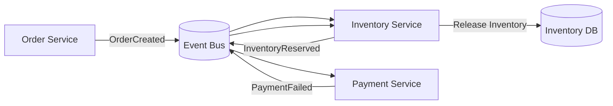
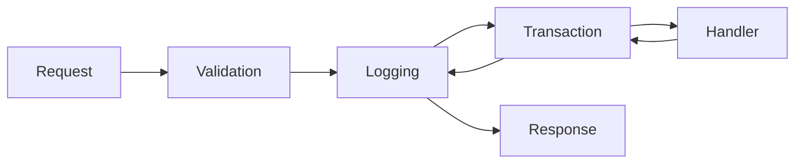
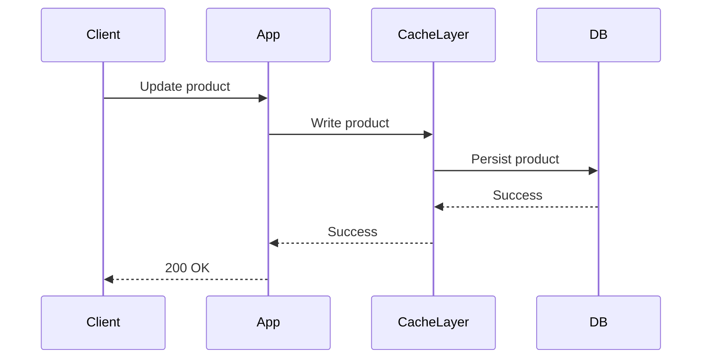
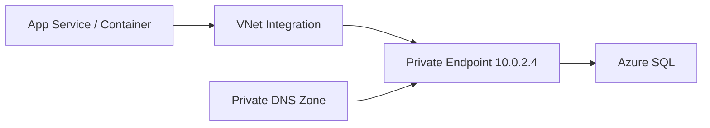
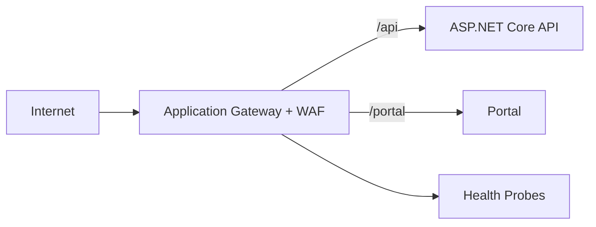
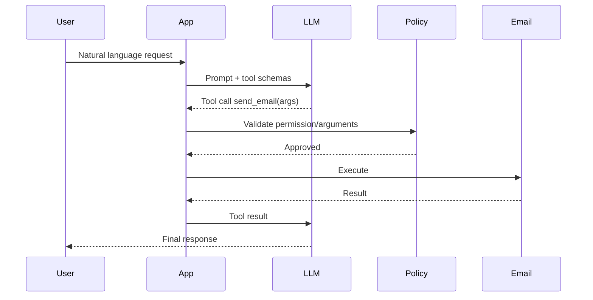
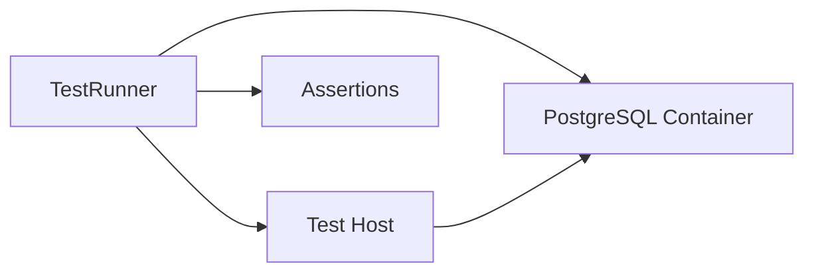

# Daily Knowledge Sharing — 2026-08-17

## Today’s Topics

1. Saga Pattern — quản lý consistency giữa nhiều service khi không có distributed transaction
2. MediatR Pipeline Behaviors — cross-cutting concerns mà không làm handler phình to
3. Error Contract cho REST API — Problem Details, correlation ID và backward compatibility
4. EF Core Split Query — xử lý cartesian explosion khi eager loading nhiều collection
5. Write-Through Cache — khi consistency quan trọng hơn latency ghi
6. Azure Virtual Network + Private Endpoint — cô lập data plane khỏi public Internet
7. Azure Application Gateway — layer 7 routing, WAF và health probe trong production
8. SLI/SLO/Error Budget — biến reliability thành quyết định kỹ thuật có thể đo
9. AI Tool Calling — tách reasoning của model khỏi deterministic execution
10. Integration Testing với Testcontainers — kiểm thử gần production mà không mock database

---

# 1. Saga Pattern — consistency giữa nhiều service

### 1. What is it?

Saga là pattern dùng để quản lý một business transaction trải qua nhiều service hoặc nhiều data store khi không thể dùng một ACID transaction duy nhất. Thay vì `BEGIN TRANSACTION` bao trùm toàn hệ thống, Saga chia workflow thành nhiều local transaction và định nghĩa **compensating action** nếu bước sau thất bại.

Ví dụ một luồng đặt hàng có thể gồm:

```text
Create Order
→ Reserve Inventory
→ Charge Payment
→ Create Shipment
```

Mỗi bước commit độc lập. Nếu `Charge Payment` thất bại sau khi inventory đã reserve, hệ thống cần chạy compensation để release inventory.

### 2. Why does it exist?

Trong monolith với một database, transaction tương đối đơn giản. Nhưng trong microservices:

* Order Service có database riêng.
* Inventory Service có database riêng.
* Payment Service gọi payment provider ngoài.
* Shipment Service có lifecycle độc lập.

Distributed transaction kiểu two-phase commit thường không phù hợp vì coupling cao, latency lớn và nhiều external system không hỗ trợ.

Nếu bỏ qua consistency, hệ thống dễ có trạng thái “nửa thành công”: order đã tạo nhưng payment chưa charge, inventory bị giữ vĩnh viễn hoặc shipment được tạo dù order bị cancel.

### 3. How does it work?

Hai cách phổ biến:

**Choreography** — service publish event và service khác tự phản ứng.



**Orchestration** — có Saga Orchestrator giữ state workflow và điều phối từng command.

```text
Saga Orchestrator
   ├─ Reserve Inventory
   ├─ Charge Payment
   └─ Create Shipment
```

Orchestration dễ quan sát hơn; choreography ít coupling trực tiếp nhưng flow có thể khó đọc khi event chain dài.

### 4. Practical example

```csharp
public sealed class CheckoutSaga
{
    public async Task ExecuteAsync(CheckoutCommand cmd, CancellationToken ct)
    {
        var reservation = await inventory.ReserveAsync(cmd.OrderId, cmd.Items, ct);

        try
        {
            var payment = await payments.ChargeAsync(cmd.OrderId, cmd.Amount, ct);
            await shipping.CreateShipmentAsync(cmd.OrderId, ct);
        }
        catch
        {
            await inventory.ReleaseAsync(reservation.Id, ct);
            throw;
        }
    }
}
```

Đây chỉ là bản đơn giản. Production cần persist Saga state để process restart vẫn resume được.

### 5. Real production scenario

Hệ thống employee offboarding cần:

```text
Deactivate Employee
→ Disable Timesheet Access
→ Convert Mailbox
→ Configure Forwarding
→ Remove License
```

Nếu Exchange Online lỗi, không nên rollback việc employee đã bị deactivate trong HR database một cách mù quáng. Có thể giữ Saga ở trạng thái `MailPending`, retry bước Exchange và chỉ compensate những phần business thực sự cần đảo ngược.

### 6. Common mistakes

* Nghĩ compensation luôn là “undo” hoàn hảo.
* Không persist Saga state.
* Consumer không idempotent nên retry gây duplicate side effect.
* Không có timeout cho step chờ external system.
* Event choreography dài đến mức không ai nhìn thấy full workflow.
* Dùng Saga cho transaction đơn giản trong cùng một database.

### 7. Trade-offs

**Advantages**

* Không cần distributed transaction.
* Scale tốt với service độc lập.
* Cho phép retry và recovery từng bước.

**Costs / Risks**

* Eventual consistency.
* Compensation khó thiết kế.
* Debug phức tạp hơn ACID transaction.
* Cần state machine, observability và idempotency.

### 8. Junior → Middle → Senior understanding

**Junior**

Hiểu rằng nhiều service không thể dùng một transaction DB duy nhất.

**Middle**

Biết implement step, retry, compensation và idempotent consumer.

**Senior / Technical Lead**

Phải xác định transaction boundary, failure policy, orchestration vs choreography, timeout, recovery, observability và business semantics của compensation.

### 9. Key takeaway

* Saga giải quyết distributed consistency bằng local transaction + compensation.
* Compensation là business action, không phải SQL rollback.
* Idempotency và persisted workflow state là nền tảng production.

---

# 2. MediatR Pipeline Behaviors — cross-cutting concerns

### 1. What is it?

MediatR Pipeline Behavior là middleware cho command/query trong application layer. Nó cho phép thêm validation, logging, transaction, metrics hoặc authorization quanh handler mà không lặp code trong từng handler.

### 2. Why does it exist?

Nếu mỗi handler đều viết:

```text
Validate
→ Start timer
→ Log request
→ Begin transaction
→ Execute business logic
→ Commit
→ Log duration
```

thì hàng chục handler sẽ duplicate cùng cross-cutting concern.

Naive solution là tạo `BaseHandler`, nhưng inheritance dễ coupling và khó compose nhiều concern.

### 3. How does it work?



Mỗi behavior có thể gọi `next()` để chuyển sang behavior kế tiếp.

### 4. Practical example

```csharp
public sealed class LoggingBehavior<TRequest, TResponse>
    : IPipelineBehavior<TRequest, TResponse>
    where TRequest : notnull
{
    private readonly ILogger<LoggingBehavior<TRequest, TResponse>> _logger;

    public LoggingBehavior(ILogger<LoggingBehavior<TRequest, TResponse>> logger)
        => _logger = logger;

    public async Task<TResponse> Handle(
        TRequest request,
        RequestHandlerDelegate<TResponse> next,
        CancellationToken ct)
    {
        var started = Stopwatch.GetTimestamp();
        try
        {
            return await next();
        }
        finally
        {
            var elapsed = Stopwatch.GetElapsedTime(started);
            _logger.LogInformation(
                "Handled {RequestType} in {ElapsedMs} ms",
                typeof(TRequest).Name,
                elapsed.TotalMilliseconds);
        }
    }
}
```

### 5. Real production scenario

Một application có 80 commands/queries. Team muốn mọi command ghi audit duration và mọi write command chạy trong transaction.

Pipeline Behavior cho phép áp dụng policy thống nhất thay vì dựa vào developer nhớ thêm code vào handler.

### 6. Common mistakes

* Nhét business logic vào behavior.
* Transaction behavior áp dụng cả query read-only.
* Logging serialize toàn bộ request chứa password/token/PII.
* Behavior order không rõ ràng.
* Handler quá nhỏ chỉ vì mọi logic bị đẩy sang behavior.

### 7. Trade-offs

**Advantages**

* Loại bỏ duplication.
* Policy nhất quán.
* Dễ compose nhiều concern.

**Costs / Risks**

* Flow execution trở nên “ẩn”.
* Debug order behavior khó với team mới.
* Lạm dụng có thể biến pipeline thành framework nội bộ phức tạp.

### 8. Junior → Middle → Senior understanding

**Junior**

Hiểu behavior giống middleware quanh handler.

**Middle**

Biết dùng cho validation/logging/transaction và hiểu order.

**Senior / Technical Lead**

Phải phân biệt cross-cutting concern với domain logic và quyết định policy nào nên global, policy nào nên explicit tại use case.

### 9. Key takeaway

* Pipeline Behavior phù hợp cho policy lặp lại quanh use case.
* Không dùng nó để giấu business logic.
* Order và scope behavior phải được thiết kế rõ.

---

# 3. REST API Error Contract — Problem Details

### 1. What is it?

Error contract là schema ổn định mà API dùng để trả lỗi cho client. Một format chuẩn thường dựa trên Problem Details và bổ sung business code, trace ID và validation details.

Ví dụ:

```json
{
  "type": "https://api.example.com/problems/employee-not-found",
  "title": "Employee not found",
  "status": 404,
  "code": "EMPLOYEE_NOT_FOUND",
  "traceId": "00-4f...",
  "detail": "Employee 42 does not exist"
}
```

### 2. Why does it exist?

Nếu mỗi endpoint trả lỗi khác nhau:

```text
"Not found"
{ "error": "invalid" }
{ "message": "failed" }
```

frontend/mobile/integration client phải viết parsing logic riêng. Khi message text đổi, client có thể hỏng.

### 3. How does it work?

```text
Exception / Validation Failure
        ↓
Global Exception Handler
        ↓
Map to HTTP status + stable error code
        ↓
Problem Details
        ↓
Client
```

Stable machine-readable `code` quan trọng hơn human-readable message.

### 4. Practical example

```csharp
builder.Services.AddProblemDetails(options =>
{
    options.CustomizeProblemDetails = context =>
    {
        context.ProblemDetails.Extensions["traceId"] =
            Activity.Current?.TraceId.ToString() ?? context.HttpContext.TraceIdentifier;
    };
});
```

Mapping custom exception:

```csharp
catch (EmployeeNotFoundException ex)
{
    return Results.Problem(
        statusCode: StatusCodes.Status404NotFound,
        title: "Employee not found",
        extensions: new Dictionary<string, object?>
        {
            ["code"] = "EMPLOYEE_NOT_FOUND"
        });
}
```

### 5. Real production scenario

Mobile app gọi API update timesheet. API trả `409 TIMESHEET_LOCKED`. App có thể hiện UI cụ thể “Timesheet đã bị khóa” mà không cần parse message tiếng Anh.

Trace ID giúp support team tìm request tương ứng trong Application Insights.

### 6. Common mistakes

* Trả stack trace cho client.
* Client dựa vào message text.
* Dùng `500` cho mọi lỗi.
* Validation error trả `200` kèm `{ success:false }`.
* Error code thay đổi tùy message localization.
* Không có correlation/trace ID.

### 7. Trade-offs

**Advantages**

* Client integration ổn định.
* Debug production dễ hơn.
* Error semantics rõ.

**Costs / Risks**

* Cần governance cho error code.
* Contract phải backward compatible.
* Quá nhiều code chi tiết có thể thành taxonomy khó quản lý.

### 8. Junior → Middle → Senior understanding

**Junior**

Biết map lỗi sang HTTP status phù hợp.

**Middle**

Biết centralize exception handling và định nghĩa stable error code.

**Senior / Technical Lead**

Phải thiết kế error taxonomy, observability, security redaction và backward compatibility cho external clients.

### 9. Key takeaway

* Error response cũng là public API contract.
* Stable error code tốt hơn parse message.
* Trace ID nối client failure với production telemetry.

---

# 4. EF Core Split Query — tránh cartesian explosion

### 1. What is it?

Khi eager loading nhiều collection bằng `Include`, EF Core có thể tạo một SQL join rất lớn. Split Query tách eager load thành nhiều SQL queries để tránh cartesian explosion.

### 2. Why does it exist?

Ví dụ:

```csharp
context.Orders
    .Include(x => x.Items)
    .Include(x => x.Payments)
```

Nếu một order có 20 items và 5 payments, join có thể tạo 100 rows cho cùng một order.

Khi nhiều collection cùng được join, số row intermediate tăng mạnh, gây network payload và materialization cost.

### 3. How does it work?

Single query:

```text
Orders
  JOIN Items
  JOIN Payments
       ↓
Duplicated rows
```

Split query:

```text
Query 1: Orders
Query 2: Items for selected Orders
Query 3: Payments for selected Orders
```

### 4. Practical example

```csharp
var orders = await db.Orders
    .Where(x => x.CustomerId == customerId)
    .Include(x => x.Items)
    .Include(x => x.Payments)
    .AsSplitQuery()
    .AsNoTracking()
    .ToListAsync(ct);
```

Tốt hơn nữa, nếu API chỉ cần DTO thì projection thường hiệu quả hơn:

```csharp
var orders = await db.Orders
    .Where(x => x.CustomerId == customerId)
    .Select(x => new OrderDto(
        x.Id,
        x.Items.Count,
        x.Payments.Sum(p => p.Amount)))
    .ToListAsync(ct);
```

### 5. Real production scenario

Admin page load employee cùng roles, permissions, teams và locations. Single join tạo hàng chục nghìn rows dù chỉ có vài chục employee.

Split Query hoặc projection có thể giảm memory và transfer đáng kể.

### 6. Common mistakes

* Thêm `Include` theo thói quen dù response không cần entity graph.
* Dùng split query mà không hiểu nó tạo nhiều round trips.
* Không paging query lớn.
* Load entity tracking cho read-only API.
* Chỉ nhìn execution time DB mà không nhìn network/materialization time.

### 7. Trade-offs

**Advantages**

* Giảm cartesian duplication.
* Memory pressure thấp hơn với graph nhiều collection.

**Costs / Risks**

* Nhiều round trips hơn.
* Data có thể thay đổi giữa các query nếu consistency requirement cao.
* Projection vẫn thường tốt hơn cho read model.

### 8. Junior → Middle → Senior understanding

**Junior**

Biết `Include` không miễn phí.

**Middle**

Biết phân biệt projection, single query và split query.

**Senior / Technical Lead**

Phải tối ưu end-to-end theo row count, network, consistency, tracking và API read model thay vì chỉ “fix SQL chậm”.

### 9. Key takeaway

* Nhiều `Include` collection có thể gây cartesian explosion.
* `AsSplitQuery()` là một lựa chọn, không phải mặc định tuyệt đối.
* Với API read-only, projection thường là baseline tốt nhất.

---

# 5. Write-Through Cache

### 1. What is it?

Write-Through là caching strategy trong đó write đi qua cache layer và cache đảm bảo dữ liệu cũng được ghi xuống source of truth.

Khác Cache-Aside — nơi application tự invalidate/fill cache — Write-Through ưu tiên giữ cache đồng bộ ngay khi write.

### 2. Why does it exist?

Cache-Aside có nguy cơ stale window:

```text
Update DB
→ invalidate cache
```

Nếu invalidate thất bại, cache giữ dữ liệu cũ.

Write-Through cố giảm trường hợp này bằng cách buộc write path cập nhật cả cache và persistence theo một flow đã định nghĩa.

### 3. How does it work?



Một implementation thực tế phải định nghĩa rõ DB fail hoặc cache fail thì trả gì.

### 4. Practical example

```csharp
public async Task UpdateAsync(Product product, CancellationToken ct)
{
    db.Products.Update(product);
    await db.SaveChangesAsync(ct);

    await cache.SetStringAsync(
        $"product:{product.Id}",
        JsonSerializer.Serialize(product),
        cancellationToken: ct);
}
```

Code trên chỉ mô phỏng semantics; nếu cache write fail sau DB commit, vẫn cần recovery strategy.

### 5. Real production scenario

Catalog service có read traffic cực lớn và yêu cầu giá mới hiển thị gần như ngay lập tức. Khi admin đổi giá, hệ thống cập nhật DB và refresh distributed cache trong write flow.

Nếu consistency cực cao, có thể cần event-driven cache update hoặc versioned cache thay vì dựa vào best-effort dual write.

### 6. Common mistakes

* Nghĩ dual write = atomic.
* Cache fail khiến toàn bộ business write fail dù cache chỉ là optimization.
* Không có retry/outbox cho cache update.
* Cache mọi field kể cả volatile/sensitive data.
* Không dùng TTL vì nghĩ write-through luôn perfect.

### 7. Trade-offs

**Advantages**

* Cache fresh hơn sau write.
* Read path đơn giản.

**Costs / Risks**

* Write latency tăng.
* Dual-write failure cần xử lý.
* Coupling write path với cache availability.

### 8. Junior → Middle → Senior understanding

**Junior**

Hiểu dữ liệu được update cache ngay khi write.

**Middle**

Biết failure order DB/cache và fallback.

**Senior / Technical Lead**

Phải quyết định cache có phải critical dependency không, consistency SLA là gì và recovery khi dual write partial success ra sao.

### 9. Key takeaway

* Write-Through giảm stale cache nhưng không tự tạo atomicity.
* Luôn thiết kế partial-failure behavior.
* Cache strategy phải xuất phát từ freshness requirement.

---

# 6. Azure Virtual Network + Private Endpoint

### 1. What is it?

Virtual Network (VNet) cung cấp private network boundary trong Azure. Private Endpoint đưa một PaaS resource như Key Vault, Storage hoặc Azure SQL vào VNet thông qua private IP.

### 2. Why does it exist?

Nếu application gọi Azure SQL qua public endpoint, dù authentication mạnh, traffic vẫn đi qua public network endpoint và resource cần expose public access.

Private Endpoint giảm attack surface bằng cách khiến data plane chỉ reachable qua private network path.

### 3. How does it work?



DNS là phần rất quan trọng: hostname public của service phải resolve về private IP khi request đến từ network nội bộ.

### 4. Practical example

Application vẫn dùng connection string dạng hostname chuẩn:

```text
Server=tcp:mydb.database.windows.net,1433;
```

Nhưng private DNS zone resolve `mydb.database.windows.net` về private endpoint IP.

Code app không cần hard-code private IP.

### 5. Real production scenario

App Service truy cập Key Vault và Azure SQL. Security requirement yêu cầu disable public network access.

Architecture:

```text
App Service
  ↓ VNet Integration
Private Endpoint
  ├─ Azure SQL
  └─ Key Vault
```

### 6. Common mistakes

* Tạo Private Endpoint nhưng DNS vẫn resolve public IP.
* Nhầm inbound Private Endpoint với outbound VNet Integration.
* Disable public access trước khi test private path.
* Cho rằng RBAC không còn cần vì đã private network.
* Không tính subnet/IP planning.

### 7. Trade-offs

**Advantages**

* Giảm public exposure.
* Network isolation tốt hơn.
* Phù hợp compliance requirement.

**Costs / Risks**

* DNS/network troubleshooting phức tạp.
* Tăng operational overhead và cost.
* Cross-region/on-prem connectivity cần thiết kế thêm.

### 8. Junior → Middle → Senior understanding

**Junior**

Hiểu private IP không thay authentication.

**Middle**

Biết VNet Integration, Private Endpoint và Private DNS phối hợp thế nào.

**Senior / Technical Lead**

Phải thiết kế network topology, DNS ownership, subnet sizing, failover, hybrid connectivity và least-privilege network boundary.

### 9. Key takeaway

* Private Endpoint bảo vệ network path; RBAC bảo vệ identity/permission.
* DNS thường là nguồn lỗi lớn nhất.
* Networking security và application security phải đi cùng nhau.

---

# 7. Azure Application Gateway — Layer 7 routing và WAF

### 1. What is it?

Azure Application Gateway là layer-7 load balancer cho HTTP/HTTPS. Nó hiểu host/path, hỗ trợ TLS termination, health probe, routing rule và Web Application Firewall (WAF).

### 2. Why does it exist?

Layer-4 load balancer chỉ nhìn IP/port. Web application thường cần rule như:

```text
/api/*   → API backend
/admin/* → Admin backend
```

Ngoài ra, WAF giúp chặn một số HTTP attack pattern trước khi traffic tới application.

### 3. How does it work?



Gateway chỉ route tới healthy backend dựa trên probe.

### 4. Practical example

Một API expose `/health/ready`:

```csharp
app.MapHealthChecks("/health/ready");
```

Application Gateway probe endpoint này. Nếu instance không ready, gateway ngừng gửi traffic vào instance đó.

### 5. Real production scenario

Enterprise portal cần:

* HTTPS termination;
* WAF;
* path-based routing;
* backend pool gồm nhiều App Service/VM;
* private backend trong VNet.

Application Gateway phù hợp hơn khi cần L7 routing gần regional network boundary.

### 6. Common mistakes

* Health probe chỉ trả 200 dù database/dependency critical đã chết.
* WAF bật blocking mode nhưng không theo dõi false positive.
* Không cấu hình end-to-end TLS khi requirement cần encrypt đến backend.
* Timeout gateway ngắn hơn thời gian xử lý request hợp lệ.
* Nhầm Application Gateway với global edge routing của Front Door.

### 7. Trade-offs

**Advantages**

* L7 routing linh hoạt.
* WAF tích hợp.
* Hỗ trợ private regional backend.

**Costs / Risks**

* Thêm latency và cost.
* WAF tuning cần effort.
* Kiến trúc phức tạp hơn direct App Service exposure.

### 8. Junior → Middle → Senior understanding

**Junior**

Hiểu gateway đứng trước backend và route HTTP request.

**Middle**

Biết configure listener, backend pool, probe, TLS và path rule.

**Senior / Technical Lead**

Phải quyết định Application Gateway vs Front Door vs Load Balancer, cùng với regional failover, TLS policy, WAF operations và private networking.

### 9. Key takeaway

* Application Gateway là L7 regional gateway, không chỉ “load balancer”.
* Health probe quyết định traffic routing thực tế.
* WAF cần monitoring/tuning, không phải bật lên là xong.

---

# 8. SLI, SLO và Error Budget

### 1. What is it?

**SLI** là metric đo reliability thật, ví dụ success rate hoặc p95 latency.

**SLO** là target nội bộ, ví dụ 99.9% request thành công mỗi tháng.

**Error Budget** là phần failure được phép trước khi vượt SLO.

### 2. Why does it exist?

Nếu team chỉ nói “hệ thống phải ổn định”, không ai biết mức nào là đủ.

100% availability gần như không thực tế và có thể khiến team ngừng release vì quá sợ risk. SLO tạo cân bằng giữa reliability và delivery speed.

### 3. How does it work?

Ví dụ SLO 99.9% availability trong 30 ngày:

```text
Allowed failure = 0.1%
30 days × 24h × 60m = 43,200 minutes
Error budget ≈ 43.2 minutes
```

Nếu budget burn quá nhanh, team ưu tiên reliability work thay vì tiếp tục release risky features.

### 4. Practical example

Metric API:

```text
SLI = successful requests / valid requests
SLO = 99.95% over rolling 30 days
```

Không nên tính 4xx do client validation vào server availability nếu semantics không phù hợp.

### 5. Real production scenario

Payment API có SLO 99.95%. Sau release mới, 5xx tăng làm burn 60% monthly budget trong 2 giờ.

Alert dựa trên burn rate có giá trị hơn alert “CPU > 80%” vì nó gắn trực tiếp vào user impact.

### 6. Common mistakes

* Chọn metric dễ đo nhưng không đại diện user experience.
* SLO = SLA external contract một cách máy móc.
* Đặt SLO 100%.
* Không có action khi error budget cạn.
* Alert từng spike nhỏ thay vì burn rate.

### 7. Trade-offs

**Advantages**

* Reliability trở thành mục tiêu đo được.
* Giúp cân bằng feature vs stability.
* Alert tập trung user impact.

**Costs / Risks**

* Cần telemetry tốt.
* SLI sai làm SLO vô nghĩa.
* Cần organizational discipline để error budget ảnh hưởng roadmap.

### 8. Junior → Middle → Senior understanding

**Junior**

Hiểu SLI là đo, SLO là mục tiêu.

**Middle**

Biết tạo metric/alert dựa trên latency và success rate.

**Senior / Technical Lead**

Phải chọn SLI phản ánh business experience, đặt SLO hợp lý và biến error budget thành engineering policy.

### 9. Key takeaway

* Reliability phải đo theo user outcome.
* 100% không phải target mặc định tốt.
* Error budget giúp team ra quyết định release dựa trên dữ liệu.

---

# 9. AI Tool Calling — model quyết định, code thực thi

### 1. What is it?

Tool Calling cho phép LLM chọn một function/tool và tạo arguments có cấu trúc, trong khi application code thực hiện hành động thật.

Model không trực tiếp “chạm database” hay “gửi email”; nó đề xuất tool invocation, còn host application kiểm soát permission và execution.

### 2. Why does it exist?

LLM mạnh ở hiểu ngôn ngữ và quyết định fuzzy, nhưng không nên được tin để tự thực thi side effect không kiểm soát.

Ví dụ user nói:

```text
Gửi email cho quản lý báo timesheet bị khóa.
```

Model có thể chọn `send_email`, nhưng application vẫn phải validate recipient, permission và policy.

### 3. How does it work?



### 4. Practical example

```csharp
public sealed record CreateTicketArgs(string Title, string Description, string Priority);

public async Task<Ticket> CreateTicketAsync(CreateTicketArgs args, UserContext user)
{
    if (!user.CanCreateTickets)
        throw new UnauthorizedAccessException();

    if (!AllowedPriorities.Contains(args.Priority))
        throw new ValidationException("Invalid priority");

    return await ticketService.CreateAsync(args);
}
```

Tool schema chỉ là contract; authorization vẫn nằm trong deterministic code.

### 5. Real production scenario

AI assistant hỗ trợ IT operations có tools:

```text
search_logs
get_incident
restart_worker
create_ticket
```

`search_logs` có thể auto-run. `restart_worker` có thể yêu cầu human approval. Đây là permission boundary theo risk level.

### 6. Common mistakes

* Tin arguments do model tạo mà không validate.
* Tool có quyền quá rộng.
* Không chống prompt injection từ document/web content.
* Không log tool invocation để audit.
* Cho phép model tự retry side-effecting tool vô hạn.
* Tool trả secret rồi đưa nguyên vào model context.

### 7. Trade-offs

**Advantages**

* Kết hợp natural language với deterministic systems.
* Tool interface rõ và testable.
* Có thể enforce permission/policy ngoài model.

**Costs / Risks**

* Prompt injection và authorization complexity.
* Tool failures cần recovery.
* Nhiều tool làm model lựa chọn khó hơn và tăng context/cost.

### 8. Junior → Middle → Senior understanding

**Junior**

Hiểu model chọn tool nhưng code thực thi thật.

**Middle**

Biết schema validation, error handling và tool result loop.

**Senior / Technical Lead**

Phải thiết kế trust boundary, approval policy, least privilege, audit, retry semantics, prompt-injection defense và stop conditions.

### 9. Key takeaway

* Model output là đề xuất, không phải authorization.
* Side effect phải qua deterministic policy layer.
* Tool permission nên tỉ lệ với rủi ro hành động.

---

# 10. Integration Testing với Testcontainers

### 1. What is it?

Testcontainers cho phép integration test khởi chạy dependency thật như PostgreSQL, SQL Server, Redis hoặc RabbitMQ trong Docker container tạm thời.

Mục tiêu là kiểm thử behavior gần production hơn mock nhưng vẫn tự động và repeatable.

### 2. Why does it exist?

Mock repository không phát hiện được:

* SQL syntax/provider difference;
* migration lỗi;
* unique constraint;
* transaction/isolation behavior;
* serialization của Redis;
* broker-specific semantics.

Dùng shared dev database thì test dễ phụ thuộc state và chạy song song kém.

### 3. How does it work?



Mỗi test suite có thể tạo isolated container/database, apply migration, seed data, chạy test rồi destroy.

### 4. Practical example

```csharp
private readonly PostgreSqlContainer _postgres =
    new PostgreSqlBuilder()
        .WithImage("postgres:16")
        .WithDatabase("appdb")
        .WithUsername("test")
        .WithPassword("test")
        .Build();

public async Task InitializeAsync()
{
    await _postgres.StartAsync();
}

public async Task DisposeAsync()
{
    await _postgres.DisposeAsync();
}
```

Sau đó cấu hình `DbContext` bằng `_postgres.GetConnectionString()`.

### 5. Real production scenario

Team dùng PostgreSQL production nhưng unit test chỉ mock EF Core repository. Một migration thêm unique index bị lỗi với dữ liệu cũ nhưng CI không phát hiện.

Integration test chạy migration trên PostgreSQL container có thể bắt lỗi trước deployment.

### 6. Common mistakes

* Biến mọi test thành integration test nên CI quá chậm.
* Không isolate test data.
* Hard-code port gây conflict khi parallel run.
* Container image khác major version production.
* Chỉ test happy path, không test constraint/transaction.
* Dùng InMemory EF provider rồi tưởng tương đương relational DB.

### 7. Trade-offs

**Advantages**

* Fidelity cao hơn mock.
* Reproducible environment.
* Bắt database/broker-specific bug.

**Costs / Risks**

* Chậm hơn unit test.
* CI cần Docker/container runtime.
* Setup và cleanup phức tạp hơn.

### 8. Junior → Middle → Senior understanding

**Junior**

Hiểu integration test kiểm tra nhiều component thật làm việc cùng nhau.

**Middle**

Biết dựng container, migration, seed và isolate test.

**Senior / Technical Lead**

Phải thiết kế test pyramid, quyết định boundary nào cần real dependency, tối ưu CI parallelism và đảm bảo test suite phản ánh production architecture.

### 9. Key takeaway

* Mock không thay thế được test với infrastructure thật.
* Testcontainers tạo môi trường integration reproducible.
* Dùng đúng tầng: nhiều unit tests, ít hơn nhưng giá trị cao integration tests.
