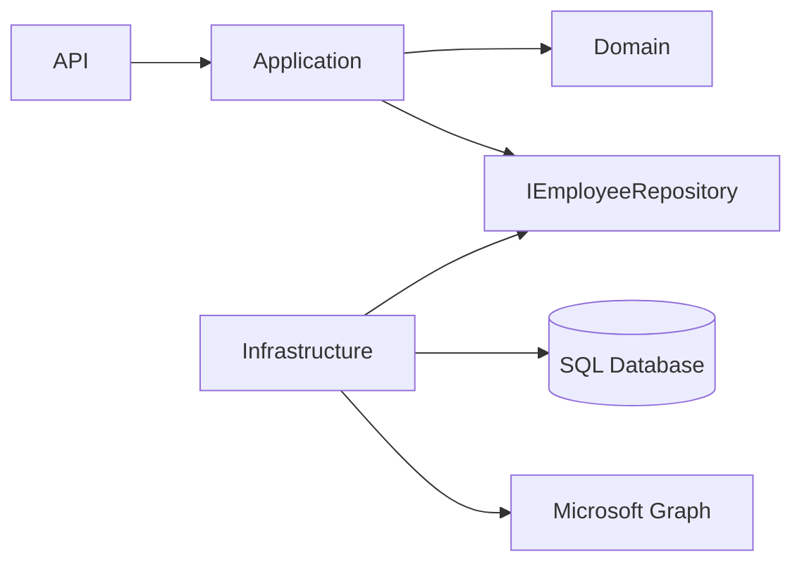
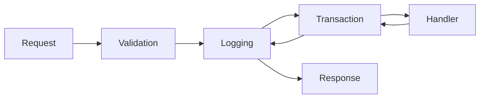
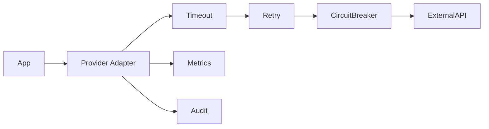
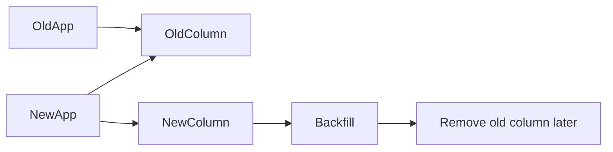
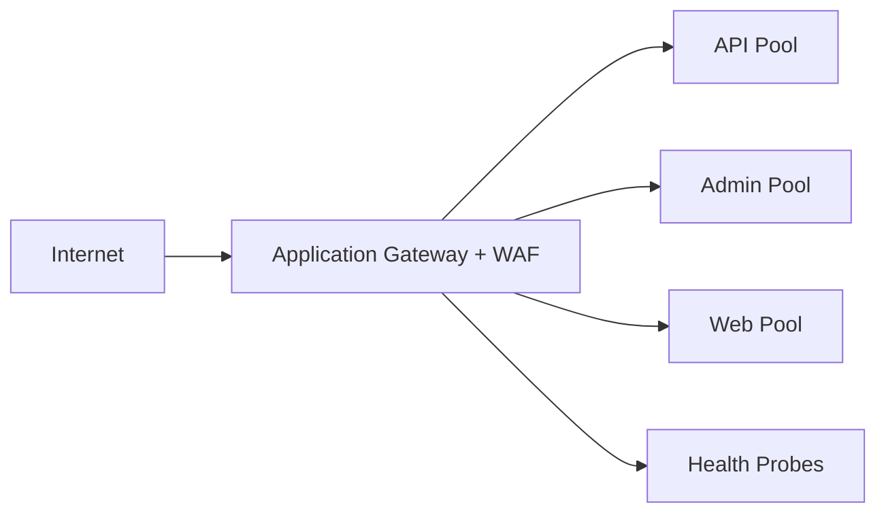
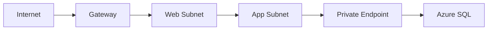
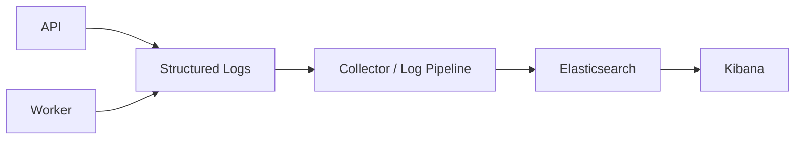
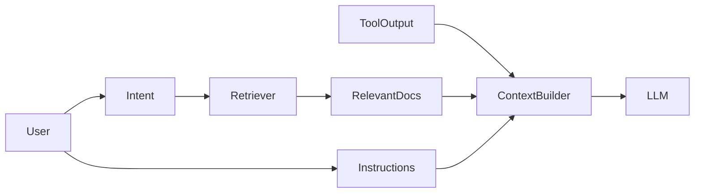
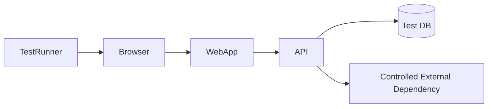

# Daily Knowledge Sharing — 2026-08-17

## Today’s Topics

1. Onion Architecture — dependency inversion và bảo vệ domain khỏi infrastructure
2. MediatR Pipeline Behaviors — cross-cutting concerns mà không làm handler phình to
3. Third-party API Integration — timeout, retry, idempotency và contract isolation
4. Database Migration an toàn — expand/contract và backward compatibility
5. Memory Optimization trong .NET — allocations, GC pressure và object lifetime
6. Azure Application Gateway — layer 7 routing, TLS termination và WAF
7. Azure Virtual Network — network isolation, subnet và private traffic flow
8. Elasticsearch + Kibana — log search, indexing strategy và production observability
9. Context Engineering cho LLM — chọn đúng dữ liệu thay vì nhồi toàn bộ context
10. End-to-End Testing — kiểm tra critical user journeys mà không biến test suite thành bottleneck

---

# 1. Onion Architecture — dependency inversion và bảo vệ domain

### 1. What is it?

Onion Architecture tổ chức hệ thống theo các vòng đồng tâm. **Domain nằm ở trung tâm**, các lớp bên ngoài như Application, Infrastructure và Presentation phụ thuộc hướng vào trong.

Điểm cốt lõi không phải là có bao nhiêu project, mà là quy tắc:

> Code chứa business rule không được phụ thuộc trực tiếp vào database, HTTP framework, Azure SDK hay third-party provider.

Một cách hình dung:

```text
Presentation / API
        ↓
Application
        ↓
Domain
        ↑
Infrastructure implements abstractions
```

Infrastructure biết Domain/Application; Domain không biết Infrastructure.

### 2. Why does it exist?

Trong codebase truyền thống, business logic thường bị đặt cạnh persistence code:

```csharp
public async Task ApproveLeave(int id)
{
    var entity = await _db.Leaves.FindAsync(id);
    entity.Status = "Approved";
    await _db.SaveChangesAsync();
    await _email.Send(...);
}
```

Khi rule tăng lên như balance check, approval chain, audit, notification, role policy, logic dễ bị trộn vào DbContext và external services.

Nếu không có boundary:

* test business rule cần database;
* đổi provider email hoặc persistence lan thay đổi vào core;
* domain model trở thành DTO dữ liệu;
* background job và API dễ duplicate rule.

### 3. How does it work?



Luồng request:

1. API nhận request.
2. Application điều phối use case.
3. Domain quyết định rule.
4. Application gọi interface cần thiết.
5. Infrastructure thực thi interface bằng EF Core, Graph hoặc Azure SDK.

Dependency được đảo bằng abstraction.

### 4. Practical example

```csharp
public interface ILeaveRepository
{
    Task<LeaveRequest?> GetAsync(Guid id, CancellationToken ct);
    Task SaveChangesAsync(CancellationToken ct);
}

public sealed class LeaveRequest
{
    public LeaveStatus Status { get; private set; }

    public void Approve(int remainingDays)
    {
        if (remainingDays <= 0)
            throw new DomainException("Insufficient leave balance.");

        if (Status != LeaveStatus.Pending)
            throw new DomainException("Only pending requests can be approved.");

        Status = LeaveStatus.Approved;
    }
}
```

Business rule không biết EF Core.

### 5. Real production scenario

Trong employee system, cùng rule “approve leave” có thể được gọi từ:

* admin portal;
* mobile API;
* scheduled auto-approval;
* integration workflow.

Nếu rule nằm ở domain/application, tất cả entry point dùng cùng behavior.

### 6. Common mistakes

* Tạo nhiều layer nhưng dependency vẫn chạy hai chiều.
* Domain reference `DbContext`, `HttpContext` hoặc `IConfiguration`.
* Mọi entity đều phải đi qua generic repository dù EF Core đã đủ abstraction.
* Đưa toàn bộ validation kỹ thuật vào domain.
* Chia project quá nhỏ làm tăng ceremony mà không tăng isolation.

### 7. Trade-offs

**Advantages**

* Business logic testable.
* Technology thay đổi ít ảnh hưởng core.
* Boundary rõ hơn khi hệ thống lớn.

**Costs / Risks**

* Thêm mapping và abstraction.
* Codebase nhỏ có thể bị overengineering.
* Team không hiểu dependency rule dễ tạo architecture hình thức.

### 8. Junior → Middle → Senior understanding

**Junior**

Hiểu layer nào được phép phụ thuộc layer nào.

**Middle**

Biết tách use case, domain rule và infrastructure implementation.

**Senior / Technical Lead**

Phải quyết định boundary theo business capability, không theo template. Cần biết khi nào Onion Architecture mang lại giá trị và khi nào vertical slice đơn giản hơn.

### 9. Key takeaway

* Onion Architecture là dependency rule, không phải folder convention.
* Domain nên độc lập với framework và infrastructure.
* Boundary chỉ có giá trị khi giảm coupling thực sự.

---

# 2. MediatR Pipeline Behaviors — cross-cutting concerns đúng chỗ

### 1. What is it?

MediatR Pipeline Behavior là middleware cho request/handler trong application layer. Nó cho phép chạy logic trước hoặc sau handler mà không lặp code trong từng use case.

Các use case phổ biến:

* validation;
* logging;
* tracing;
* transaction;
* authorization;
* performance measurement.

### 2. Why does it exist?

Nếu 100 handlers đều có code giống nhau:

```csharp
_logger.LogInformation(...);
Validate(request);
var sw = Stopwatch.StartNew();
...
_logger.LogInformation("Elapsed {Elapsed}", sw.ElapsedMilliseconds);
```

thì code bị duplicate và dễ thiếu behavior ở handler mới.

Pipeline giúp cross-cutting concern được áp dụng nhất quán.

### 3. How does it work?



Mỗi behavior nhận `next()` để chuyển control sang behavior tiếp theo hoặc handler.

### 4. Practical example

```csharp
public sealed class PerformanceBehavior<TRequest, TResponse>
    : IPipelineBehavior<TRequest, TResponse>
    where TRequest : notnull
{
    private readonly ILogger<PerformanceBehavior<TRequest, TResponse>> _logger;

    public PerformanceBehavior(
        ILogger<PerformanceBehavior<TRequest, TResponse>> logger)
    {
        _logger = logger;
    }

    public async Task<TResponse> Handle(
        TRequest request,
        RequestHandlerDelegate<TResponse> next,
        CancellationToken ct)
    {
        var sw = Stopwatch.StartNew();
        var response = await next();

        if (sw.ElapsedMilliseconds > 1000)
        {
            _logger.LogWarning(
                "Slow request {RequestName}: {Elapsed} ms",
                typeof(TRequest).Name,
                sw.ElapsedMilliseconds);
        }

        return response;
    }
}
```

### 5. Real production scenario

Một timesheet system có hàng chục commands. Mọi command write phải:

1. validate input;
2. tạo transaction;
3. log correlation ID;
4. đo duration.

Pipeline Behavior giúp rule này áp dụng đồng nhất thay vì copy vào từng handler.

### 6. Common mistakes

* Đưa business rule vào pipeline behavior.
* Mọi request đều mở DB transaction kể cả query read-only.
* Logging toàn bộ request chứa password/PII.
* Behavior order sai, ví dụ transaction mở trước validation.
* Tạo quá nhiều behavior làm debugging khó.

### 7. Trade-offs

**Advantages**

* Giảm duplicate code.
* Cross-cutting concern nhất quán.
* Handler tập trung vào use case.

**Costs / Risks**

* Flow execution ít explicit hơn.
* Ordering quan trọng.
* Dễ lạm dụng thành “magic pipeline”.

### 8. Junior → Middle → Senior understanding

**Junior**

Hiểu pipeline giống middleware cho application request.

**Middle**

Biết implement validation, logging, transaction behavior và cấu hình order.

**Senior / Technical Lead**

Phải quyết định concern nào thực sự cross-cutting và concern nào phải explicit trong use case. Tránh biến pipeline thành nơi chứa business workflow ẩn.

### 9. Key takeaway

* Pipeline Behavior phù hợp cho logic áp dụng lặp lại trên nhiều handlers.
* Business rule vẫn nên ở domain/use case.
* Thứ tự behavior là một phần của thiết kế.

---

# 3. Third-party API Integration — thiết kế cho failure

### 1. What is it?

Third-party integration là phần code giao tiếp với hệ thống ngoài như payment provider, Microsoft Graph, CRM hoặc shipping API.

Một integration production-grade phải xử lý không chỉ happy path mà cả:

* timeout;
* transient failure;
* rate limit;
* authentication expiry;
* incompatible contract;
* duplicate request;
* partial success.

### 2. Why does it exist?

Naive implementation:

```csharp
var result = await httpClient.PostAsJsonAsync(url, request);
result.EnsureSuccessStatusCode();
```

sẽ thất bại khi downstream chậm, trả `429`, đổi schema hoặc request timeout sau khi operation đã được xử lý.

External API là dependency ngoài control của team, vì vậy phải thiết kế cho failure ngay từ đầu.

### 3. How does it work?



Một adapter tốt cô lập contract của provider khỏi business model nội bộ.

### 4. Practical example

```csharp
public sealed class GraphMailClient
{
    private readonly HttpClient _http;

    public GraphMailClient(HttpClient http)
    {
        _http = http;
        _http.Timeout = TimeSpan.FromSeconds(10);
    }

    public async Task SendAsync(MailCommand command, CancellationToken ct)
    {
        using var response = await _http.PostAsJsonAsync(
            "/v1.0/users/.../sendMail",
            Map(command),
            ct);

        if ((int)response.StatusCode == 429)
            throw new ExternalRateLimitException();

        response.EnsureSuccessStatusCode();
    }
}
```

Business layer không nên biết raw Graph payload.

### 5. Real production scenario

Employee offboarding gọi Exchange/Graph để:

* convert mailbox;
* configure forwarding;
* remove delegation.

Nếu bước 2 fail sau bước 1 thành công, operation đã partial success. Hệ thống phải lưu state và retry phần còn thiếu thay vì chạy lại mù quáng toàn bộ workflow.

### 6. Common mistakes

* Retry mọi `4xx`.
* Không đặt timeout.
* Dùng `new HttpClient()` cho mỗi request.
* Leak DTO của provider vào domain.
* Không log external request ID/correlation ID.
* Không xử lý `429 Retry-After`.
* Không phân biệt transient và permanent error.

### 7. Trade-offs

**Advantages**

* Adapter layer giảm coupling.
* Resilience tốt hơn.
* Dễ mock/test integration contract.

**Costs / Risks**

* Thêm state machine và failure handling.
* Retry có thể tăng tải downstream.
* Provider behavior không phải lúc nào cũng predictable.

### 8. Junior → Middle → Senior understanding

**Junior**

Hiểu external API có thể fail dù code của mình đúng.

**Middle**

Biết timeout, retry, rate-limit handling, HttpClientFactory và mapping contract.

**Senior / Technical Lead**

Phải thiết kế partial failure, idempotency, compensating action, observability, SLA và degradation strategy.

### 9. Key takeaway

* External API luôn là failure boundary.
* Retry chỉ dành cho lỗi phù hợp.
* Cô lập provider contract khỏi business model.

---

# 4. Database Migration an toàn — expand/contract

### 1. What is it?

Database migration production-safe là quá trình thay đổi schema mà không phá version application đang chạy.

Pattern quan trọng là **Expand → Migrate → Contract**.

### 2. Why does it exist?

Một deployment production có thể có nhiều app instances chạy version cũ và mới cùng lúc.

Nếu migration rename hoặc drop column ngay lập tức, old version có thể crash trước khi traffic chuyển hết.

### 3. How does it work?

```text
Phase 1 — Expand
Add new schema, giữ schema cũ

Phase 2 — Migrate
Deploy app mới, backfill data

Phase 3 — Contract
Khi version cũ không còn chạy, remove schema cũ
```



### 4. Practical example

Thay `OfficeId` bằng `OfficeCode`.

**Phase 1:**

```sql
ALTER TABLE Employee ADD OfficeCode varchar(20) NULL;
```

Backfill:

```sql
UPDATE Employee
SET OfficeCode = CASE OfficeId
    WHEN 1 THEN 'HN'
    WHEN 2 THEN 'HCMC'
END;
```

Sau đó app version mới đọc/write `OfficeCode`, nhưng vẫn giữ `OfficeId` cho version cũ.

Cuối cùng mới drop FK/column cũ.

### 5. Real production scenario

CI/CD deploy 10 API instances rolling deployment. Trong 5 phút đầu, cả version cũ và mới cùng hoạt động.

Schema phải tương thích với cả hai versions trong khoảng transition.

### 6. Common mistakes

* Rename/drop column trong cùng release với app code mới.
* Backfill hàng triệu rows trong một transaction lớn.
* Add `NOT NULL` column không có default lên bảng rất lớn.
* Không test migration duration.
* Không có rollback plan.
* Chạy migration tự động từ nhiều app instances cùng lúc.

### 7. Trade-offs

**Advantages**

* Zero/low downtime dễ đạt hơn.
* Rollback application an toàn hơn.
* Giảm blast radius.

**Costs / Risks**

* Temporary duplicate schema.
* Release kéo dài qua nhiều bước.
* Cần data backfill và cleanup discipline.

### 8. Junior → Middle → Senior understanding

**Junior**

Hiểu schema change có thể phá app version cũ.

**Middle**

Biết thiết kế backward-compatible migration và backfill data.

**Senior / Technical Lead**

Phải tính lock duration, table size, rolling deployment, rollback, online schema change và migration ownership.

### 9. Key takeaway

* Database migration là deployment concern, không chỉ EF migration file.
* Expand/contract giúp backward compatibility.
* Drop/rename nên là bước cuối, không phải bước đầu.

---

# 5. Memory Optimization trong .NET — allocations và GC pressure

### 1. What is it?

Memory optimization trong .NET là giảm allocation không cần thiết, giảm object lifetime và tránh tạo áp lực lên Garbage Collector.

Mục tiêu không phải “dùng ít RAM bằng mọi giá”, mà là giảm:

* allocation rate;
* Gen 0/1/2 collections;
* Large Object Heap pressure;
* pause time;
* memory fragmentation.

### 2. Why does it exist?

Một API có thể không leak memory nhưng vẫn chậm vì mỗi request allocate quá nhiều object.

Ví dụ 10 KB/request ở 10,000 requests/second tương đương ~100 MB allocations mỗi giây.

GC phải làm việc liên tục dù process memory không tăng mãi.

### 3. How does it work?

```text
Request
  ↓
Object allocations
  ↓
Gen 0
  ↓ survives
Gen 1
  ↓ survives
Gen 2
```

Object sống càng lâu, collection càng đắt.

### 4. Practical example

Không tốt:

```csharp
var result = string.Join(",", items
    .Where(x => x.IsActive)
    .Select(x => x.Name.ToUpper())
    .ToList());
```

Ở hot path có thể giảm intermediate allocations:

```csharp
var names = items
    .Where(x => x.IsActive)
    .Select(x => x.Name);

var result = string.Join(',', names);
```

Với buffer processing, dùng `ArrayPool<T>` khi phù hợp:

```csharp
var buffer = ArrayPool<byte>.Shared.Rent(64 * 1024);
try
{
    // process buffer
}
finally
{
    ArrayPool<byte>.Shared.Return(buffer);
}
```

### 5. Real production scenario

File-processing API đọc nhiều file lớn. Mỗi request tạo hàng chục `byte[]` > 85 KB khiến LOH pressure tăng và latency spike.

Optimization đúng cần profiling bằng counters/traces trước, sau đó mới pooling hoặc streaming.

### 6. Common mistakes

* Optimize allocation trước khi đo.
* Cache object vô hạn để “tránh allocation”.
* Dùng pooling cho object nhỏ, đơn giản.
* Quên return pooled buffer.
* Giữ reference lâu khiến object promote lên Gen 2.
* Dùng `.ToList()` ở mọi LINQ chain dù không cần materialize.

### 7. Trade-offs

**Advantages**

* Giảm GC pause.
* Throughput cao hơn trên hot path.
* Memory footprint ổn định hơn.

**Costs / Risks**

* Code phức tạp hơn.
* Pooling có thể gây bug data reuse.
* Micro-optimization có thể giảm readability.

### 8. Junior → Middle → Senior understanding

**Junior**

Hiểu managed memory vẫn có cost.

**Middle**

Biết profiling allocation, object lifetime, LOH và streaming.

**Senior / Technical Lead**

Phải biết khi nào optimization đáng giá, cân bằng latency/throughput/readability và đánh giá GC mode theo workload.

### 9. Key takeaway

* Allocation rate quan trọng không kém tổng RAM.
* Đo trước khi tối ưu.
* Streaming và giảm intermediate object thường hiệu quả hơn micro-tuning.

---

# 6. Azure Application Gateway — Layer 7 routing và WAF

### 1. What is it?

Azure Application Gateway là Layer 7 load balancer cho HTTP/HTTPS. Nó hiểu URL, host header, TLS và có thể tích hợp Web Application Firewall.

Nó phù hợp khi cần:

* path-based routing;
* host-based routing;
* TLS termination;
* WAF;
* backend health probe;
* rewrite HTTP headers/URLs.

### 2. Why does it exist?

Layer 4 load balancer chỉ biết IP/port. Nhưng web architecture thường cần:

```text
/api/*     -> API backend
/admin/*   -> Admin backend
/static/*  -> Static backend
```

Application Gateway xử lý routing ở HTTP layer.

### 3. How does it work?



### 4. Practical example

Routing rules:

```text
api.example.com/*      -> API backend
portal.example.com/*   -> Web backend
example.com/admin/*    -> Admin backend
```

Backend application có thể dùng ASP.NET Core, App Service hoặc VM.

### 5. Real production scenario

Enterprise app cần chỉ expose một public IP nhưng route traffic tới nhiều backend pools trong private network.

Application Gateway terminate TLS, apply WAF rule và forward request tới private backend.

### 6. Common mistakes

* Health probe path phụ thuộc authentication nên backend bị đánh dấu unhealthy.
* Không preserve đúng host header.
* Cấu hình WAF ở blocking mode ngay lập tức làm false positive production.
* Nhầm Application Gateway với Azure Front Door.
* Không thiết kế subnet riêng.

### 7. Trade-offs

**Advantages**

* Layer 7 routing mạnh.
* WAF tích hợp.
* Backend có thể private.

**Costs / Risks**

* Chi phí và cấu hình cao hơn simple load balancer.
* WAF cần tuning.
* Không thay thế global edge routing như Front Door.

### 8. Junior → Middle → Senior understanding

**Junior**

Hiểu reverse proxy/load balancer đứng trước backend.

**Middle**

Biết listener, backend pool, probe và routing rules.

**Senior / Technical Lead**

Phải phân biệt Application Gateway, Front Door, Load Balancer và API Management; thiết kế TLS, WAF, private networking và failure behavior.

### 9. Key takeaway

* Application Gateway là Layer 7 load balancer cho regional web traffic.
* WAF và health probes là production features quan trọng.
* Chọn service dựa trên traffic scope và routing requirement.

---

# 7. Azure Virtual Network — network isolation

### 1. What is it?

Azure Virtual Network (VNet) là mạng logic riêng trong Azure. Nó cho phép tổ chức resources vào address space, subnet và kiểm soát traffic giữa các thành phần.

### 2. Why does it exist?

Nếu mọi Azure service đều expose public endpoint, attack surface tăng và network policy khó kiểm soát.

VNet giúp tạo private communication path giữa application và backend resources.

### 3. How does it work?



Các khái niệm chính:

* address space;
* subnet;
* NSG;
* route table;
* VNet peering;
* private endpoint;
* DNS resolution.

### 4. Practical example

```text
10.10.0.0/16 VNet
├─ 10.10.1.0/24 web-subnet
├─ 10.10.2.0/24 app-subnet
└─ 10.10.3.0/24 private-endpoints
```

NSG có thể chỉ cho phép App subnet gọi database port cần thiết.

### 5. Real production scenario

App Service gọi Azure SQL qua Private Endpoint.

Traffic flow:

```text
App Service VNet Integration
        ↓
VNet
        ↓
Private DNS
        ↓
Private Endpoint
        ↓
Azure SQL
```

Database không cần public network access.

### 6. Common mistakes

* CIDR overlap giữa các VNet cần peering.
* Thiếu Private DNS Zone khiến hostname resolve public IP.
* Dùng NSG nhưng không hiểu inbound/outbound rule priority.
* Cho rằng VNet Integration tự biến App Service thành private ingress.
* Không dự trù address space khi scale.

### 7. Trade-offs

**Advantages**

* Network isolation tốt hơn.
* Hỗ trợ private services.
* Policy và segmentation rõ hơn.

**Costs / Risks**

* DNS/network debugging phức tạp hơn.
* IP planning quan trọng.
* Private architecture có thêm operational overhead.

### 8. Junior → Middle → Senior understanding

**Junior**

Hiểu subnet giống phân vùng mạng.

**Middle**

Biết VNet integration, NSG, private endpoint và DNS.

**Senior / Technical Lead**

Phải thiết kế address plan, hub-spoke, peering, egress, firewall, DNS và zero-trust segmentation.

### 9. Key takeaway

* VNet là nền tảng network isolation trong Azure.
* Private Endpoint và DNS phải được thiết kế cùng nhau.
* Network architecture sai thường gây outage khó debug.

---

# 8. Elasticsearch + Kibana — log search ở quy mô lớn

### 1. What is it?

Elasticsearch là distributed search engine thường dùng để index và tìm kiếm log. Kibana là UI để query, visualize và khám phá dữ liệu Elasticsearch.

Trong observability, chúng thường nhận structured logs từ application.

### 2. Why does it exist?

Text log nằm rải rác trên nhiều server khó tìm khi production có hàng triệu events.

Cần query kiểu:

```text
service = employee-api
AND traceId = abc123
AND level = Error
```

Elasticsearch cung cấp inverted index để tìm kiếm nhanh hơn scan file logs.

### 3. How does it work?



### 4. Practical example

Structured logging trong .NET:

```csharp
_logger.LogError(
    ex,
    "Failed to process employee {EmployeeId} with action {Action}",
    employeeId,
    action);
```

Tốt hơn string concatenation vì fields được index riêng.

### 5. Real production scenario

Incident xảy ra trên một request. Engineer tìm `traceId`, sau đó xem toàn bộ logs từ API, worker và integration client theo cùng correlation ID.

Kibana giúp lọc theo time range và visualize error rate.

### 6. Common mistakes

* Index field có cardinality cực cao không kiểm soát.
* Log payload lớn hoặc secret.
* Không có retention policy.
* Dùng Elasticsearch như primary transactional database.
* Mapping dynamic tạo quá nhiều fields.

### 7. Trade-offs

**Advantages**

* Full-text/search mạnh.
* Query log nhanh ở scale lớn.
* Visualization tốt với Kibana.

**Costs / Risks**

* Cluster sizing và storage cost cao.
* Mapping/index lifecycle cần quản lý.
* Cardinality và retention có thể làm chi phí tăng nhanh.

### 8. Junior → Middle → Senior understanding

**Junior**

Hiểu structured log tốt hơn plain text log.

**Middle**

Biết query theo fields, correlation ID và xây dashboard.

**Senior / Technical Lead**

Phải quản lý mapping, shard strategy, retention, ILM, cost, security và observability taxonomy.

### 9. Key takeaway

* Elasticsearch mạnh khi log được structure đúng.
* Cardinality và retention quyết định cost.
* Correlation ID là chìa khóa điều tra distributed flow.

---

# 9. Context Engineering cho LLM

### 1. What is it?

Context Engineering là việc thiết kế **những gì model nhìn thấy tại thời điểm inference**: instructions, history, retrieved documents, tool outputs, metadata và constraints.

Nó rộng hơn prompt engineering vì vấn đề không chỉ là viết câu prompt đẹp, mà là chọn đúng thông tin và đúng thứ tự.

### 2. Why does it exist?

Nhồi càng nhiều context không đồng nghĩa output càng tốt.

Context dư thừa có thể:

* tăng token cost;
* làm model chú ý sai thông tin;
* đưa dữ liệu stale vào reasoning;
* vượt context window;
* tăng prompt-injection surface.

### 3. How does it work?



Context builder nên ưu tiên relevance, freshness và authority.

### 4. Practical example

Thay vì gửi toàn bộ 500 tài liệu HR, query theo employee policy cần thiết:

```csharp
var docs = await retriever.SearchAsync(
    query: userQuestion,
    topK: 5,
    filters: new { Department = "HR", Status = "Published" });
```

Sau đó chỉ đưa excerpts có citation vào model.

### 5. Real production scenario

AI assistant trả lời policy nội bộ.

Safe flow:

```text
Question
  ↓
Intent + authorization filter
  ↓
Retrieve approved documents
  ↓
Context assembly
  ↓
LLM answer with citations
```

User chỉ được retrieve documents họ có quyền xem.

### 6. Common mistakes

* Nhồi toàn bộ chat history mãi mãi.
* Retrieve top-K chỉ theo similarity mà không filter permission/freshness.
* Đưa tool output chưa validate vào model.
* Không phân biệt system instruction và untrusted document content.
* Không đánh dấu source/citation.

### 7. Trade-offs

**Advantages**

* Output chính xác và relevant hơn.
* Giảm token cost.
* Dễ kiểm soát source.

**Costs / Risks**

* Context builder phức tạp.
* Retrieval sai vẫn dẫn đến answer sai.
* Cần evaluation cho ranking và truncation strategy.

### 8. Junior → Middle → Senior understanding

**Junior**

Hiểu model chỉ biết những gì được đưa vào context hoặc đã học trước đó.

**Middle**

Biết retrieval, chunk selection, summarization và token budgeting.

**Senior / Technical Lead**

Phải thiết kế trust boundary, source authority, permissions, freshness, context compression, failure handling và evaluation.

### 9. Key takeaway

* Context quality quan trọng hơn context quantity.
* Retrieval phải xét relevance + permission + freshness.
* Untrusted context phải được coi là external input.

---

# 10. End-to-End Testing — kiểm tra critical user journeys

### 1. What is it?

End-to-End (E2E) testing kiểm tra hệ thống gần với cách người dùng thật sử dụng: UI/API, authentication, database và các dependency quan trọng cùng tham gia.

Mục tiêu là xác nhận một **business journey hoàn chỉnh**, không phải test mọi nhánh logic.

### 2. Why does it exist?

Unit test có thể pass nhưng production vẫn fail vì:

* route sai;
* DI configuration sai;
* migration thiếu;
* auth policy sai;
* frontend gọi nhầm API;
* integration contract lệch.

E2E test bắt các lỗi wiring mà test nhỏ không thấy.

### 3. How does it work?



Một suite tốt chỉ chọn critical paths.

### 4. Practical example

Playwright:

```csharp
await page.GotoAsync("https://qa.example.com/login");
await page.GetByLabel("Email").FillAsync("qa@example.com");
await page.GetByLabel("Password").FillAsync("***");
await page.GetByRole(AriaRole.Button, new() { Name = "Sign in" }).ClickAsync();

await page.GetByRole(AriaRole.Link, new() { Name = "Timesheet" }).ClickAsync();
await Expect(page.GetByText("My Timesheet")).ToBeVisibleAsync();
```

### 5. Real production scenario

Trước release, CI chạy critical journeys:

* login;
* submit timesheet;
* approve leave;
* upload file;
* checkout/payment.

Nếu các flow này fail, deployment bị block.

### 6. Common mistakes

* Viết hàng nghìn E2E tests cho mọi edge case.
* Test phụ thuộc data dùng chung nên flaky.
* Hard-code sleep thay vì wait theo condition.
* Gọi live third-party service trong mọi CI run.
* Không capture screenshot/video/log khi fail.
* Không cleanup test data.

### 7. Trade-offs

**Advantages**

* Bắt lỗi integration/wiring thực tế.
* Bảo vệ critical business journeys.
* Tăng confidence trước release.

**Costs / Risks**

* Chậm hơn unit/integration test.
* Dễ flaky.
* Môi trường test phức tạp.

### 8. Junior → Middle → Senior understanding

**Junior**

Hiểu E2E test mô phỏng hành vi người dùng thật.

**Middle**

Biết thiết kế stable selectors, deterministic data, waits và artifact collection.

**Senior / Technical Lead**

Phải quyết định test pyramid, critical-path coverage, environment strategy, isolation, parallelization và quality gate để suite hữu ích mà không làm CI chậm quá mức.

### 9. Key takeaway

* E2E test nên bảo vệ critical journeys, không test mọi thứ.
* Flakiness là engineering problem cần xử lý, không nên chấp nhận.
* Unit + integration + E2E bổ sung cho nhau, không thay thế nhau.
