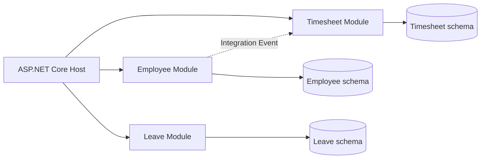
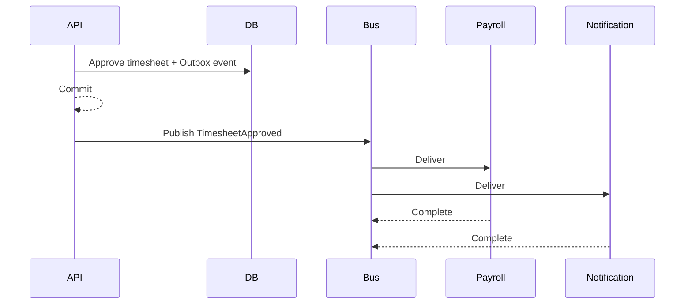
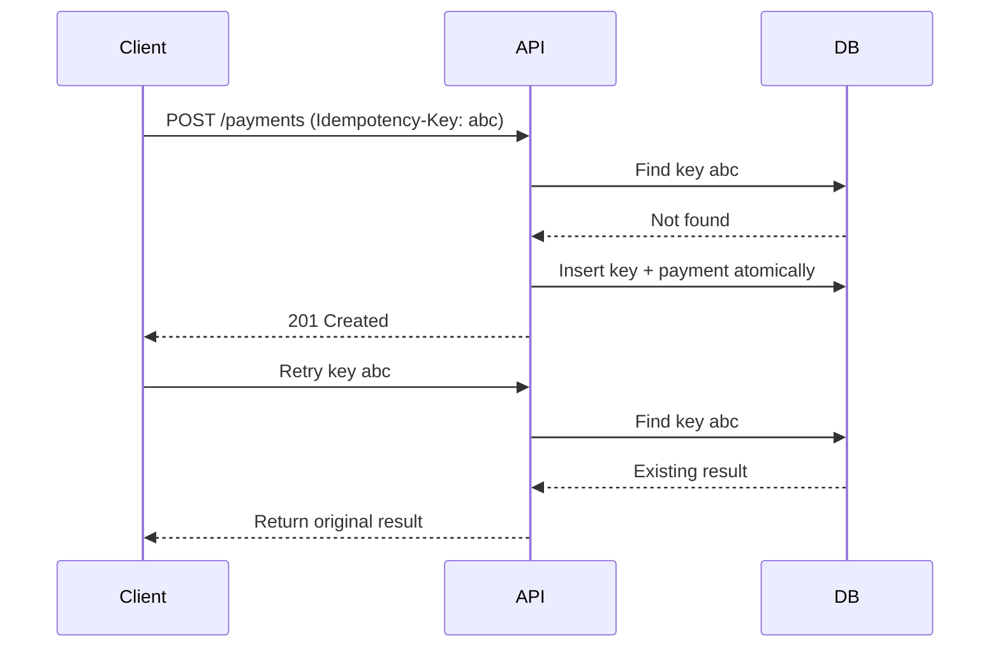
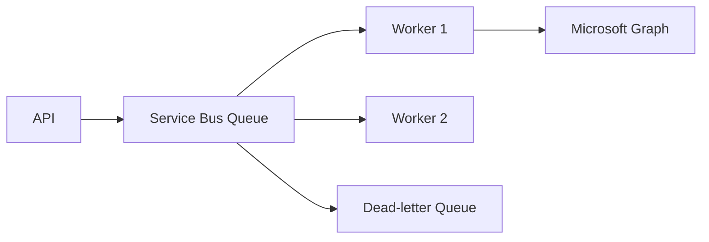
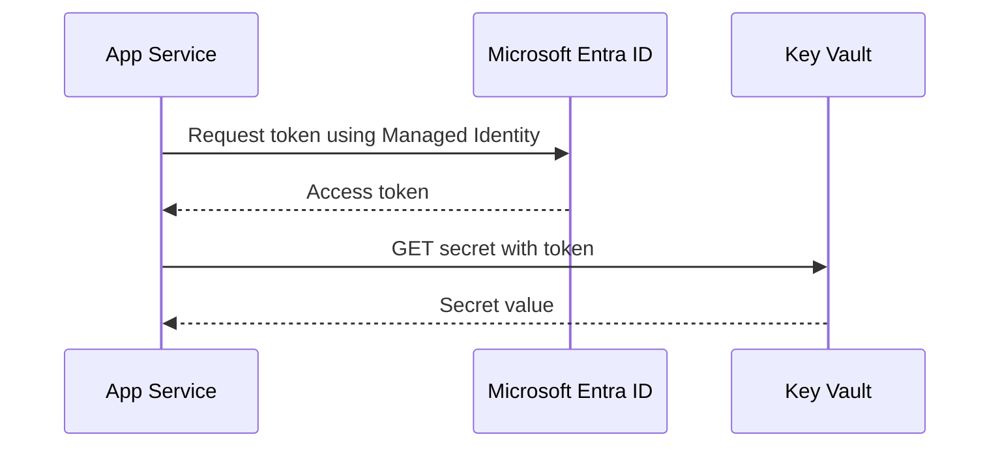
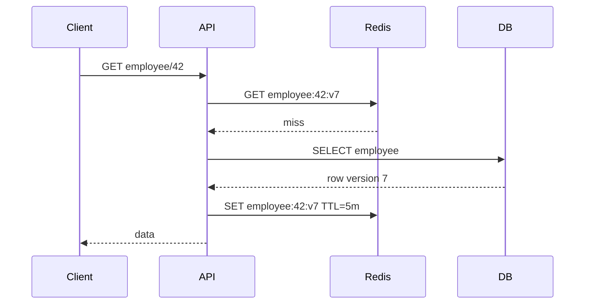
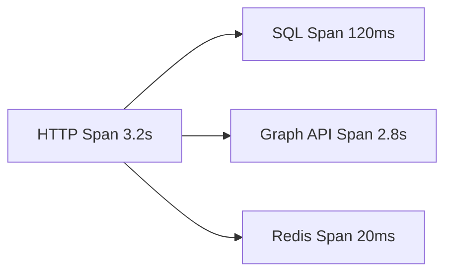
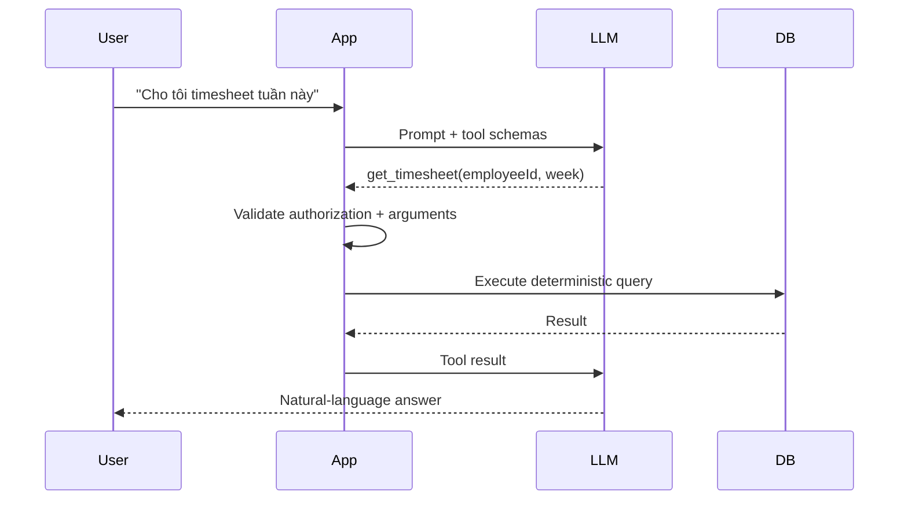
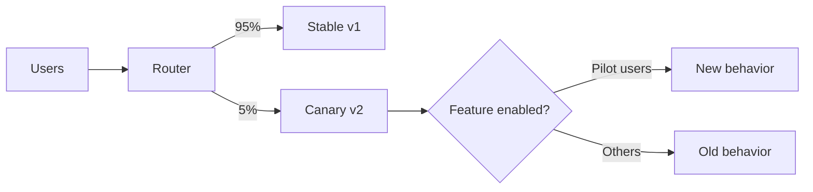

# Daily Knowledge Sharing — 2026-08-17

## Today’s Topics

1. Modular Monolith — module boundaries và chuẩn bị đường lui cho microservices
2. Event-Driven Architecture — xử lý bất đồng bộ mà không đánh mất tính nhất quán
3. Idempotency — chống xử lý trùng trong API và background job
4. Database Isolation Levels — cân bằng consistency, locking và throughput
5. Azure Service Bus — queue/topic, retry và dead-letter trong production
6. Managed Identity + Azure Key Vault — loại bỏ secrets khỏi application
7. Cache Invalidation — versioning, TTL và chống stale data
8. OpenTelemetry Distributed Tracing — theo dấu request xuyên nhiều dependency
9. AI Tool Calling — để LLM đề xuất hành động nhưng code kiểm soát thực thi
10. Canary Deployment + Feature Flags — giảm blast radius khi release

---

# 1. Modular Monolith — module boundaries trước khi nghĩ tới microservices

### 1. What is it?

Modular Monolith vẫn là **một deployable application**, nhưng code và dữ liệu được chia thành các module nghiệp vụ có boundary rõ ràng. Điểm quan trọng không phải số project hay folder, mà là module A không được tùy tiện đọc bảng, entity hay service nội bộ của module B.

Ví dụ hệ thống HR có `Employees`, `Timesheets`, `Leave`, `Payroll`. Một monolith thông thường dễ biến thành mạng dependency chéo. Modular Monolith yêu cầu mỗi module sở hữu model và use case của mình, giao tiếp qua public contract hoặc event.

### 2. Why does it exist?

Microservices giải quyết independent deployment/scaling nhưng mang thêm network failure, distributed transaction, observability và operational cost. Với nhiều hệ thống, vấn đề thực sự ban đầu chỉ là **codebase bị coupling**, chưa phải deployment.

Modular Monolith giải quyết coupling trước mà chưa trả distributed-systems tax.

### 3. How does it work?



Module nên expose application contract thay vì DbContext/entity nội bộ.

### 4. Practical example

```csharp
public interface IEmployeeDirectory
{
    Task<EmployeeSummary?> GetAsync(Guid employeeId, CancellationToken ct);
}

internal sealed class EmployeeDirectory(EmployeeDbContext db)
    : IEmployeeDirectory
{
    public Task<EmployeeSummary?> GetAsync(Guid id, CancellationToken ct) =>
        db.Employees
          .Where(x => x.Id == id)
          .Select(x => new EmployeeSummary(x.Id, x.Email, x.IsActive))
          .SingleOrDefaultAsync(ct);
}
```

Timesheet chỉ biết `IEmployeeDirectory`, không reference `EmployeeDbContext`.

### 5. Real production scenario

Khi submit timesheet, Timesheet module cần kiểm tra employee còn active. Nó gọi contract của Employee module. Sau này nếu Employee được tách thành service, contract có thể đổi implementation sang HTTP/message mà business use case ít bị ảnh hưởng.

### 6. Common mistakes

- Tạo folder `Modules` nhưng tất cả module dùng chung entity/DbContext.
- Shared project trở thành nơi chứa mọi business logic.
- Module gọi trực tiếp repository nội bộ của module khác.
- Tách module quá nhỏ theo technical layer thay vì business capability.
- Dùng event cho mọi interaction, khiến một monolith đơn giản trở nên khó debug.

### 7. Trade-offs

**Advantages:** deployment đơn giản, transaction local dễ hơn microservices, boundary tốt, refactor/tách service về sau thuận lợi.

**Costs / Risks:** cần discipline; không có network boundary ép buộc nên developer vẫn có thể phá encapsulation; module isolation và integration test cần đầu tư.

### 8. Junior → Middle → Senior understanding

**Junior:** hiểu module là business boundary, không chỉ folder.

**Middle:** biết thiết kế contract, dependency direction, module-specific persistence và integration test.

**Senior / Technical Lead:** quyết định boundary theo business capability, xác định phần nào cần synchronous contract/event và chỉ tách microservice khi có deployment/scaling/ownership reason thực sự.

### 9. Key takeaway

- Modular Monolith tối ưu boundary trước distribution.
- Không cần microservices để có module ownership tốt.
- Boundary tốt hôm nay làm giảm chi phí tách service ngày mai.

---

# 2. Event-Driven Architecture — bất đồng bộ mà vẫn kiểm soát consistency

### 1. What is it?

Event-Driven Architecture (EDA) cho phép một component phát thông báo rằng **một sự kiện đã xảy ra**, còn consumer tự quyết định phản ứng. Producer không cần biết tất cả consumer.

`TimesheetApproved` khác command `SendInvoice`: event mô tả fact đã xảy ra; command yêu cầu một hành động cụ thể.

### 2. Why does it exist?

Nếu API đồng bộ gọi Payroll → Notification → Analytics → Audit, latency và availability của request phụ thuộc tất cả downstream services. Một service lỗi có thể làm toàn bộ transaction nghiệp vụ thất bại dù phần chính đã thành công.

EDA giảm temporal coupling và cho phép consumer xử lý độc lập.

### 3. How does it work?



Production thường cần Outbox để tránh trạng thái DB commit thành công nhưng publish event thất bại.

### 4. Practical example

```csharp
public sealed record TimesheetApproved(
    Guid TimesheetId,
    Guid EmployeeId,
    DateTimeOffset ApprovedAt);

// Trong cùng transaction với aggregate change:
db.OutboxMessages.Add(new OutboxMessage
{
    Id = Guid.NewGuid(),
    Type = nameof(TimesheetApproved),
    Payload = JsonSerializer.Serialize(evt),
    OccurredAt = DateTimeOffset.UtcNow
});
await db.SaveChangesAsync(ct);
```

Background publisher đọc Outbox và publish lên message broker.

### 5. Real production scenario

Approval API chỉ commit trạng thái `Approved` và outbox. Payroll consumer cập nhật billing, Notification gửi mail, Analytics cập nhật reporting. Nếu email provider lỗi, approval không bị rollback; message được retry riêng.

### 6. Common mistakes

- Publish event trước khi DB transaction commit.
- Nghĩ broker đảm bảo exactly-once end-to-end.
- Consumer không idempotent.
- Event chứa toàn bộ internal entity làm contract coupling.
- Không version event schema.
- Không có DLQ/replay strategy.

### 7. Trade-offs

**Advantages:** loose coupling, scalable consumers, fault isolation, dễ thêm subscriber.

**Costs / Risks:** eventual consistency, duplicate/out-of-order delivery, debugging khó hơn, cần observability và contract governance.

### 8. Junior → Middle → Senior understanding

**Junior:** phân biệt command và event; hiểu async nghĩa là dữ liệu có thể chưa đồng bộ ngay.

**Middle:** implement consumer idempotency, retry, DLQ và Outbox.

**Senior / Technical Lead:** thiết kế consistency boundary, ordering requirement, event ownership, schema evolution và recovery/replay strategy.

### 9. Key takeaway

- Event là fact, không phải remote method call trá hình.
- Assume at-least-once delivery và thiết kế consumer idempotent.
- Eventual consistency phải là quyết định nghiệp vụ có chủ đích.

---

# 3. Idempotency — chống double charge và duplicate processing

### 1. What is it?

Một operation idempotent cho cùng logical request nhiều lần nhưng chỉ tạo ra **một hiệu ứng nghiệp vụ**.

Điều này đặc biệt quan trọng vì client, proxy, queue và retry policy đều có thể gửi lại request.

### 2. Why does it exist?

Client gọi payment API, server xử lý thành công nhưng response timeout. Client không biết kết quả và retry. Nếu server coi request thứ hai là giao dịch mới, khách hàng có thể bị charge hai lần.

### 3. How does it work?



### 4. Practical example

```csharp
public async Task<IResult> CreatePayment(
    string idempotencyKey,
    CreatePaymentRequest request,
    AppDbContext db,
    CancellationToken ct)
{
    var existing = await db.IdempotencyRecords
        .SingleOrDefaultAsync(x => x.Key == idempotencyKey, ct);

    if (existing is not null)
        return Results.Json(existing.ResponseBody, statusCode: existing.StatusCode);

    // Unique index trên Key là lớp bảo vệ cuối cùng cho concurrent requests.
    // Payment + idempotency record phải commit trong cùng transaction.
    return Results.Created();
}
```

SQL cần unique constraint:

```sql
CREATE UNIQUE INDEX UX_IdempotencyRecords_Key
ON IdempotencyRecords([Key]);
```

### 5. Real production scenario

Background consumer nhận cùng `TimesheetApproved` hai lần. Consumer lưu `MessageId` đã xử lý. Lần hai detect duplicate và complete message mà không tạo invoice lần nữa.

### 6. Common mistakes

- Chỉ kiểm tra key bằng `SELECT` nhưng không có unique constraint → race condition.
- Key không gắn với request payload; client reuse key cho payload khác.
- Lưu idempotency record sau side effect bên ngoài.
- TTL quá ngắn khiến retry muộn trở thành operation mới.
- Retry POST nhưng endpoint không hỗ trợ idempotency.

### 7. Trade-offs

**Advantages:** safe retry, chống duplicate side effect, tăng reliability.

**Costs / Risks:** thêm storage/cleanup, transaction complexity, cần định nghĩa phạm vi và retention của key.

### 8. Junior → Middle → Senior understanding

**Junior:** hiểu retry có thể tạo duplicate.

**Middle:** implement key store, unique constraint và transaction boundary.

**Senior / Technical Lead:** thiết kế idempotency xuyên DB + external side effects, retention, conflict semantics và duplicate strategy cho message processing.

### 9. Key takeaway

- Retry an toàn cần idempotency.
- Application check không thay thế database uniqueness.
- Idempotency phải bảo vệ **business side effect**, không chỉ HTTP response.

---

# 4. Database Isolation Levels — consistency đổi lấy concurrency như thế nào?

### 1. What is it?

Isolation level quyết định một transaction được phép nhìn thấy thay đổi của transaction khác ở mức nào. Nó ảnh hưởng trực tiếp tới dirty read, non-repeatable read, phantom, blocking và throughput.

### 2. Why does it exist?

Nếu mọi transaction được serialize hoàn toàn, consistency dễ hiểu nhưng throughput thấp. Nếu cho phép đọc/ghi quá tự do, concurrency cao nhưng business decision có thể dựa trên dữ liệu không ổn định.

Database cần nhiều mức isolation để hệ thống chọn đúng trade-off.

### 3. How does it work?

Một cách nhìn đơn giản:

```text
Read Uncommitted -> concurrency cao, consistency thấp
Read Committed   -> mặc định phổ biến
Repeatable Read  -> giữ ổn định rows đã đọc
Serializable     -> gần như tuần tự, locking mạnh
Snapshot         -> đọc version cũ thay vì chờ writer
```

SQL Server `READ COMMITTED SNAPSHOT` dùng row versioning để giảm read/write blocking nhưng vẫn cần hiểu write conflict và tempdb/version store cost.

### 4. Practical example

```csharp
await using var tx = await db.Database.BeginTransactionAsync(
    System.Data.IsolationLevel.Serializable, ct);

var balance = await db.Accounts
    .Where(x => x.Id == accountId)
    .Select(x => x.Balance)
    .SingleAsync(ct);

if (balance < amount)
    throw new InvalidOperationException("Insufficient balance");

await DebitAsync(accountId, amount, ct);
await tx.CommitAsync(ct);
```

Không có nghĩa `Serializable` luôn đúng; với workload lớn có thể dùng optimistic concurrency hoặc atomic SQL tốt hơn.

### 5. Real production scenario

Hai request cùng lúc approve overtime quota còn 1 slot. Cả hai đọc `Remaining = 1`, rồi cùng decrement. Isolation/atomic update không đúng sẽ overbook.

Một giải pháp:

```sql
UPDATE Quotas
SET Remaining = Remaining - 1
WHERE Id = @id AND Remaining > 0;
```

Kiểm tra affected rows thường tốt hơn transaction đọc-rồi-ghi dài.

### 6. Common mistakes

- Tăng isolation lên Serializable để “fix mọi race condition”.
- Giữ transaction trong lúc gọi HTTP/Graph API.
- Không hiểu snapshot isolation vẫn có write conflicts.
- Dùng `NOLOCK` như performance switch và chấp nhận dữ liệu sai mà không biết.
- Transaction quá dài gây lock escalation/blocking.

### 7. Trade-offs

**Advantages:** isolation cao làm reasoning consistency dễ hơn.

**Costs / Risks:** lock/blocking/deadlock tăng; snapshot giảm blocking nhưng tốn row-version storage và không loại bỏ mọi conflict.

### 8. Junior → Middle → Senior understanding

**Junior:** transaction không chỉ là commit/rollback; isolation quyết định concurrent visibility.

**Middle:** biết đọc execution/lock behavior, chọn atomic update hoặc optimistic concurrency.

**Senior / Technical Lead:** map business invariant sang concurrency strategy thay vì chọn isolation theo thói quen.

### 9. Key takeaway

- Isolation là business-consistency decision có performance cost.
- Transaction càng ngắn càng tốt.
- Atomic database operation thường tốt hơn read-modify-write dài.

---

# 5. Azure Service Bus — reliable messaging trong hệ thống .NET

### 1. What is it?

Azure Service Bus là managed enterprise message broker. Queue phù hợp competing consumers; Topic/Subscription phù hợp publish-subscribe. Nó cung cấp lock-based processing, retries, dead-letter queue, sessions, duplicate detection và scheduled delivery.

### 2. Why does it exist?

In-memory queue mất dữ liệu khi process restart. Direct HTTP coupling khiến producer phụ thuộc availability của consumer. Service Bus lưu message bền vững và tách thời điểm producer/consumer hoạt động.

### 3. How does it work?



Peek-lock flow: receiver lock message → xử lý → `Complete`; lỗi transient có thể `Abandon`; poison message sau max delivery sẽ vào DLQ.

### 4. Practical example

```csharp
var processor = client.CreateProcessor("mail-actions", new()
{
    MaxConcurrentCalls = 8,
    AutoCompleteMessages = false
});

processor.ProcessMessageAsync += async args =>
{
    var command = args.Message.Body.ToObjectFromJson<MailActionCommand>();
    await handler.HandleAsync(command, args.CancellationToken);
    await args.CompleteMessageAsync(args.Message);
};
```

### 5. Real production scenario

Employee offboarding cần convert mailbox, set forwarding và auto-reply. API lưu request rồi enqueue command. Worker gọi Microsoft 365. Graph/Exchange throttling không giữ HTTP request của người dùng mở; message có thể retry có kiểm soát.

### 6. Common mistakes

- Retry mọi exception kể cả validation/permanent failure.
- Không monitor DLQ.
- Handler không idempotent.
- Lock duration ngắn hơn processing time mà không renew.
- `MaxConcurrentCalls` quá cao gây downstream throttling.
- Nhét payload rất lớn thay vì Blob + reference.

### 7. Trade-offs

**Advantages:** durability, decoupling, retry/DLQ, scale consumers độc lập.

**Costs / Risks:** eventual consistency, broker cost, duplicate delivery, operational monitoring và message-contract complexity.

### 8. Junior → Middle → Senior understanding

**Junior:** hiểu queue không phải database và message có thể được giao lại.

**Middle:** implement processor, cancellation, retry classification, DLQ và idempotency.

**Senior / Technical Lead:** capacity planning, ordering/session, poison-message strategy, backpressure, disaster recovery và broker-vs-event-stream choice.

### 9. Key takeaway

- Assume duplicate delivery.
- DLQ phải có owner và recovery process.
- Consumer concurrency phải dựa vào downstream capacity, không chỉ CPU của worker.

---

# 6. Managed Identity + Azure Key Vault — authentication không cần lưu credentials

### 1. What is it?

Managed Identity cấp identity cho Azure resource. Application dùng identity đó lấy token từ Microsoft Entra ID thay vì lưu client secret. Key Vault giữ secrets/keys/certificates còn thực sự cần thiết.

### 2. Why does it exist?

Secrets trong `appsettings.json`, environment variables hay CI/CD dễ bị leak, hết hạn hoặc rotation khó. Managed Identity loại bỏ một nhóm credential khỏi application lifecycle.

### 3. How does it work?



Key Vault kiểm tra RBAC của identity. Không có password/client secret trong code.

### 4. Practical example

```csharp
var credential = new DefaultAzureCredential();
var client = new SecretClient(
    new Uri("https://my-vault.vault.azure.net/"),
    credential);

KeyVaultSecret secret = await client.GetSecretAsync("ThirdPartyApiKey");
```

Local development có thể dùng developer identity; Azure dùng Managed Identity qua cùng `DefaultAzureCredential` chain.

### 5. Real production scenario

App Service cần đọc connection string của legacy third-party integration. App Service Managed Identity được cấp `Key Vault Secrets User`. CI/CD không cần biết secret; rotation trong Key Vault không yêu cầu commit code.

### 6. Common mistakes

- Dùng Managed Identity nhưng vẫn lưu Key Vault access secret khác trong config.
- Cấp role quá rộng ở subscription scope.
- Public Key Vault endpoint mở không cần thiết.
- Không cache hợp lý secret/config, gọi Key Vault trên từng request.
- Không thiết kế rotation cho secret của third party.

### 7. Trade-offs

**Advantages:** giảm secret management, RBAC/audit tốt, rotation dễ hơn.

**Costs / Risks:** phụ thuộc Entra/Key Vault availability; local-dev identity cần governance; networking/private endpoint tăng complexity.

### 8. Junior → Middle → Senior understanding

**Junior:** phân biệt secret storage và identity.

**Middle:** cấu hình Managed Identity, RBAC, `DefaultAzureCredential`, retry và local development.

**Senior / Technical Lead:** least privilege, private networking, break-glass, rotation, audit và dependency-failure strategy.

### 9. Key takeaway

- Nếu Azure service hỗ trợ Entra auth, ưu tiên identity hơn shared secret.
- Key Vault bảo vệ secret; Managed Identity giúp tránh tạo secret ngay từ đầu.
- RBAC scope phải tối thiểu cần thiết.

---

# 7. Cache Invalidation — phần khó nhất của caching

### 1. What is it?

Cache invalidation là chiến lược đảm bảo cached value không sống lâu hơn mức business chấp nhận sau khi source-of-truth thay đổi.

TTL chỉ là một cơ chế invalidation, không phải toàn bộ chiến lược.

### 2. Why does it exist?

Cache tăng tốc read bằng cách chấp nhận bản sao dữ liệu. Ngay khi DB thay đổi, bản sao có nguy cơ stale. Nếu cache employee permission 30 phút, user đã bị revoke quyền vẫn có thể truy cập nếu thiết kế sai.

### 3. How does it work?



Có thể kết hợp TTL + explicit eviction + versioned key. Với distributed system, invalidation event có thể được broadcast sau write.

### 4. Practical example

```csharp
public async Task UpdateEmployeeAsync(Employee employee, CancellationToken ct)
{
    db.Employees.Update(employee);
    await db.SaveChangesAsync(ct);

    await cache.RemoveAsync($"employee:{employee.Id}", ct);
}
```

Nếu DB commit nhưng Redis eviction lỗi, TTL là safety net; nếu consistency yêu cầu mạnh hơn, cần versioning/outbox-based invalidation.

### 5. Real production scenario

Timesheet configuration được đọc hàng nghìn lần nhưng update vài lần/ngày. Cache-aside TTL 5 phút phù hợp. Ngược lại authorization revocation không nên phụ thuộc TTL dài vì stale permission là security risk.

### 6. Common mistakes

- Cache mọi thứ vì “Redis nhanh”.
- Không định nghĩa stale tolerance.
- Delete cache trước DB commit rồi transaction rollback.
- Cache null quá lâu.
- Cache stampede khi key nóng hết hạn đồng thời.
- Một key chứa object khổng lồ làm network/serialization trở thành bottleneck.

### 7. Trade-offs

**Advantages:** giảm DB load, latency thấp, hấp thụ read burst.

**Costs / Risks:** stale data, invalidation complexity, thêm dependency và serialization/network cost.

### 8. Junior → Middle → Senior understanding

**Junior:** cache là copy, DB thường vẫn là source of truth.

**Middle:** implement cache-aside, TTL, eviction và fallback khi Redis lỗi.

**Senior / Technical Lead:** xác định consistency SLA theo data class, stampede protection, versioning và failure mode khi invalidation pipeline hỏng.

### 9. Key takeaway

- Trước khi cache, hỏi: “stale bao lâu là chấp nhận được?”
- TTL là safety net, không phải lúc nào cũng đủ.
- Security/financial data cần invalidation policy nghiêm hơn catalog/reference data.

---

# 8. OpenTelemetry Distributed Tracing — tìm latency xuyên nhiều dependency

### 1. What is it?

Distributed trace mô tả hành trình của một request qua API, database, queue và downstream services. Trace gồm nhiều span; mỗi span đại diện một operation với duration, status và attributes.

OpenTelemetry cung cấp chuẩn instrumentation/export thay vì khóa application vào một observability vendor.

### 2. Why does it exist?

Log `Request failed` ở API không cho biết 2.8 giây bị mất ở SQL, Redis, Graph hay Service Bus. Correlation ID thủ công giúp một phần nhưng không tự mô tả parent-child timing.

### 3. How does it work?



Trace context được propagate qua HTTP headers/message properties để downstream span cùng trace.

### 4. Practical example

```csharp
builder.Services.AddOpenTelemetry()
    .WithTracing(t => t
        .AddAspNetCoreInstrumentation()
        .AddHttpClientInstrumentation()
        .AddEntityFrameworkCoreInstrumentation()
        .AddSource("Timesheet.Application")
        .AddOtlpExporter());
```

Custom span:

```csharp
using var activity = ActivitySource.StartActivity("ApproveTimesheet");
activity?.SetTag("timesheet.id", timesheetId);
```

Không đưa PII/sensitive payload vào tags.

### 5. Real production scenario

P95 approve API tăng từ 400 ms lên 4 s. Trace cho thấy SQL vẫn 80 ms nhưng Microsoft Graph call chiếm 3.4 s. Team chuyển Graph side effect sang background processing thay vì “tối ưu database” sai chỗ.

### 6. Common mistakes

- Log/trace mọi payload chứa PII/token.
- Sampling quá thấp làm mất rare failures.
- Không propagate trace context qua queue.
- High-cardinality metric/tag gây cost lớn.
- Có traces nhưng không liên kết logs/metrics.

### 7. Trade-offs

**Advantages:** root-cause latency nhanh, dependency map, vendor-neutral instrumentation.

**Costs / Risks:** telemetry volume/cost, sampling, privacy và instrumentation overhead.

### 8. Junior → Middle → Senior understanding

**Junior:** hiểu trace/span và correlation.

**Middle:** instrument HTTP/EF/queue, custom activities và query traces.

**Senior / Technical Lead:** thiết kế telemetry taxonomy, sampling, retention, privacy, SLO linkage và cost controls.

### 9. Key takeaway

- Logs nói “điều gì”; traces cho thấy “nó đi qua đâu và mất bao lâu”.
- Instrument trước khi production incident xảy ra.
- Telemetry cũng là dữ liệu production cần security/cost governance.

---

# 9. AI Tool Calling — LLM chọn ý định, deterministic code kiểm soát hành động

### 1. What is it?

Tool calling cho phép LLM trả về một yêu cầu có cấu trúc để application gọi function/API cụ thể. Model không trực tiếp truy cập database hay gửi email; host application quyết định tool nào tồn tại, validate arguments và có thực thi hay không.

### 2. Why does it exist?

LLM mạnh ở hiểu ngôn ngữ và chọn hành động, nhưng không nên tự tạo SQL, URL hoặc side effect tùy ý. Tool calling tạo boundary giữa probabilistic reasoning và deterministic execution.

### 3. How does it work?



### 4. Practical example

Application-side tool:

```csharp
public async Task<TimesheetDto> GetTimesheetAsync(
    Guid employeeId,
    DateOnly week,
    ClaimsPrincipal user,
    CancellationToken ct)
{
    if (!authorization.CanReadTimesheet(user, employeeId))
        throw new UnauthorizedAccessException();

    return await service.GetWeekAsync(employeeId, week, ct);
}
```

Authorization nằm trong deterministic code, không dựa vào việc model “nhớ” policy từ system prompt.

### 5. Real production scenario

AI assistant nội bộ có tools `search_employee`, `get_timesheet`, `create_leave_draft`. Read tools có thể tự chạy sau validation; `submit_leave` hoặc `disable_account` yêu cầu explicit human confirmation trước side effect.

### 6. Common mistakes

- Tin tool arguments của model như trusted input.
- Cho model quyền gọi generic SQL/shell tool quá rộng.
- Đưa authorization chỉ vào prompt.
- Tool description mơ hồ khiến model chọn sai tool.
- Retry side-effect tool mà không idempotency.
- Tool output chứa untrusted text rồi model coi đó là instruction → prompt injection.

### 7. Trade-offs

**Advantages:** kết hợp natural language với deterministic systems, audit được, schema rõ, giảm hallucinated actions.

**Costs / Risks:** orchestration phức tạp, prompt/tool injection, permission design, latency/token cost và nondeterministic tool selection.

### 8. Junior → Middle → Senior understanding

**Junior:** model đề xuất tool call; application mới là nơi thực thi.

**Middle:** schema validation, timeout, cancellation, authorization, error handling và structured result.

**Senior / Technical Lead:** thiết kế capability boundaries, approval levels, audit, least privilege, replay/idempotency, evaluation và containment khi model bị prompt injection.

### 9. Key takeaway

- LLM quyết định **ý định**; code quyết định **quyền và cơ chế thực thi**.
- Không bao giờ dùng prompt thay authorization.
- Side-effect tools cần approval/idempotency/audit tương xứng rủi ro.

---

# 10. Canary Deployment + Feature Flags — giảm blast radius của release

### 1. What is it?

Canary deployment đưa version mới tới một tỷ lệ traffic nhỏ trước khi rollout toàn bộ. Feature flag tách việc **deploy code** khỏi việc **enable behavior**.

Hai kỹ thuật kết hợp giúp giảm blast radius: deploy binary mới an toàn trước, rồi bật feature dần cho cohort phù hợp.

### 2. Why does it exist?

Test/staging không tái tạo hoàn toàn production traffic, data distribution và integration behavior. Big-bang release biến một lỗi hiếm thành incident cho 100% user ngay lập tức.

### 3. How does it work?



Rollout nên dựa trên metrics/error budget, không chỉ “chờ 10 phút không thấy ai báo lỗi”.

### 4. Practical example

```csharp
if (await featureManager.IsEnabledAsync("NewBillingCalculation"))
{
    return await newCalculator.CalculateAsync(input, ct);
}

return await legacyCalculator.CalculateAsync(input, ct);
```

Pipeline có thể rollout 5% → 25% → 50% → 100%, dừng nếu error rate hoặc latency vượt threshold.

### 5. Real production scenario

Hệ thống timesheet thay billing calculation. Version mới deploy tới 5% instances; flag chỉ bật cho một office. Team so sánh invoice totals, exception rate và latency. Khi invariant sai, tắt flag ngay mà không cần rollback binary.

### 6. Common mistakes

- Feature flag không có owner/expiry → permanent dead code.
- Canary nhưng tất cả instances dùng chung destructive DB migration không backward-compatible.
- Chỉ monitor HTTP 500, bỏ qua business metrics.
- Random user routing làm cùng user lúc vào v1 lúc vào v2.
- Rollback app nhưng schema migration đã phá compatibility.

### 7. Trade-offs

**Advantages:** giảm blast radius, rollback nhanh, progressive validation với production traffic.

**Costs / Risks:** vận hành nhiều version/paths, test matrix tăng, flag debt, routing và observability phức tạp.

### 8. Junior → Middle → Senior understanding

**Junior:** deploy code không nhất thiết đồng nghĩa bật feature.

**Middle:** implement flags, backward-compatible changes, rollout metrics và cleanup.

**Senior / Technical Lead:** thiết kế release guardrails, automated rollback, DB expand-contract migration, cohort strategy và business-level success criteria.

### 9. Key takeaway

- Canary giảm phạm vi ảnh hưởng; feature flag giảm thời gian phục hồi.
- Database compatibility quyết định khả năng rollback thực tế.
- Rollout phải được điều khiển bởi telemetry và business invariants, không phải cảm giác.