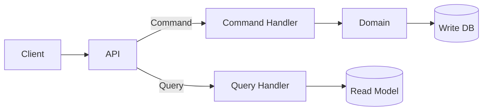
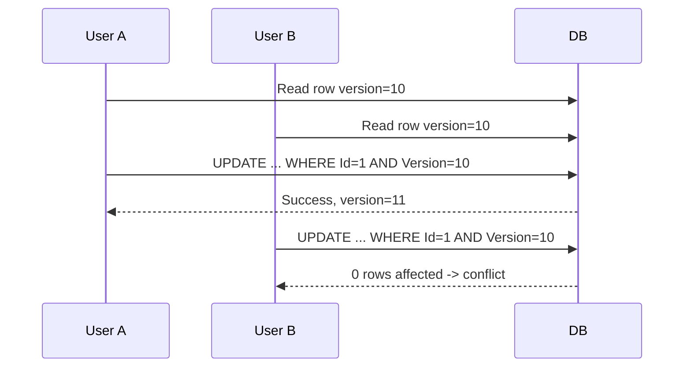
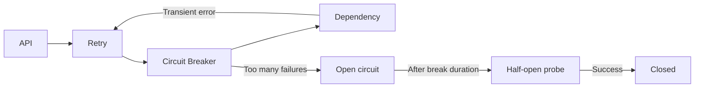
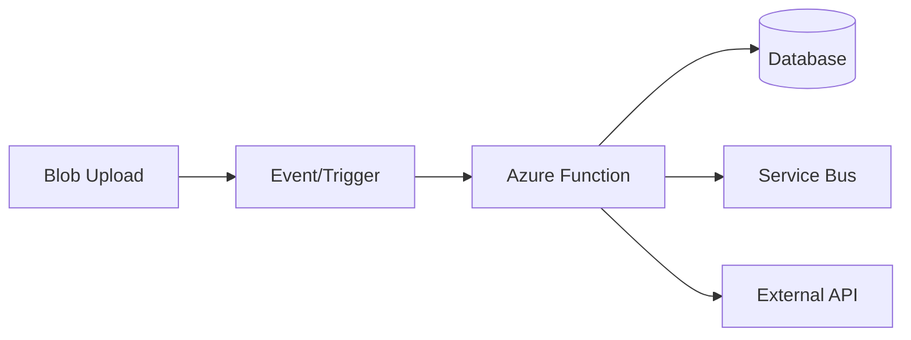
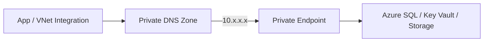
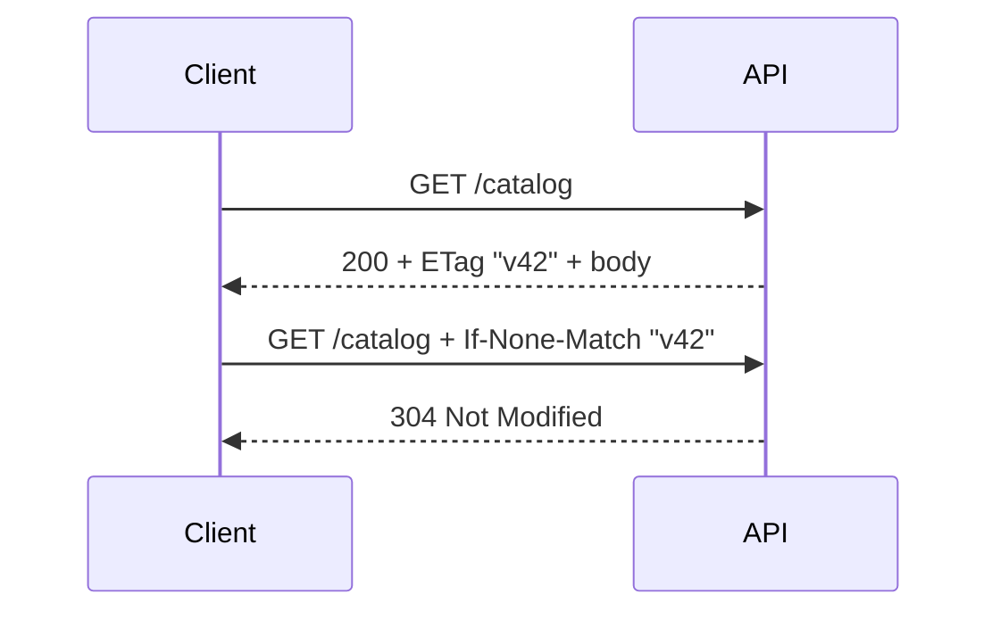
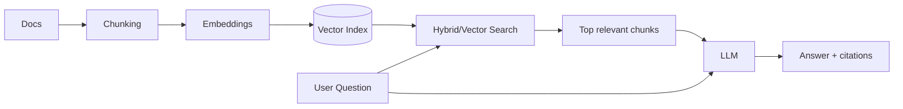
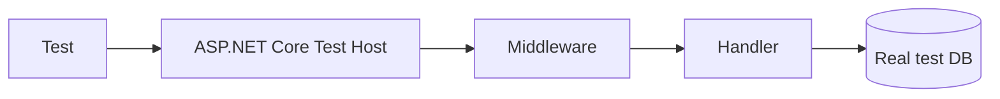
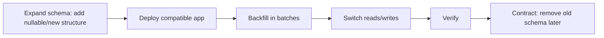

# Daily Knowledge Sharing — 2026-08-17

## Today’s Topics

1. CQRS — tách read/write theo nhu cầu thực tế, không biến mọi CRUD thành framework
2. Optimistic Concurrency với EF Core — ngăn lost update mà không giữ lock dài
3. Retry + Circuit Breaker — resilience đúng cách khi gọi dependency bên ngoài
4. Azure Functions — event-driven compute, scaling và giới hạn vận hành
5. Azure Private Endpoint — đưa PaaS vào private network path
6. HTTP Caching — ETag, Cache-Control và conditional request
7. SLI, SLO, SLA — biến “hệ thống phải ổn định” thành mục tiêu đo được
8. RAG — grounding LLM bằng dữ liệu riêng và kiểm soát retrieval quality
9. Integration Testing — kiểm chứng boundary thật thay vì mock mọi thứ
10. Database Migration Zero-Downtime — thay schema mà không phá phiên bản đang chạy

---

# 1. CQRS — tách read/write theo nhu cầu thực tế

### 1. What is it?

CQRS (Command Query Responsibility Segregation) tách hai loại hành vi: **Command** thay đổi state và **Query** chỉ đọc dữ liệu. CQRS không đồng nghĩa với microservices, event sourcing, hai database hay MediatR. Một ứng dụng .NET đơn giản vẫn có thể áp dụng CQRS trong cùng process và cùng database.

Điểm cốt lõi là read model và write model được phép tối ưu khác nhau. Write side ưu tiên invariant, transaction và domain rule; read side ưu tiên projection, filtering và tốc độ trả dữ liệu.

### 2. Why does it exist?

Một model CRUD dùng cho mọi thứ thường dần trở nên khó chịu: entity domain chứa hàng chục navigation property chỉ để phục vụ màn hình; query phải load aggregate lớn; API update vô tình cho phép sửa field không hợp lệ. Khi nhu cầu đọc và ghi khác biệt mạnh, ép chúng vào một model làm cả hai phía phức tạp.

CQRS tạo boundary rõ: command trả lời “hệ thống có cho phép thay đổi này không?”, query trả lời “client cần nhìn thấy dữ liệu gì?”.

### 3. How does it work?



Ở mức đơn giản `WDB` và `RDB` có thể chính là một SQL Server database. Khi scale lớn hơn, read model có thể là projection riêng và được cập nhật bất đồng bộ.

### 4. Practical example

```csharp
public sealed record ApproveTimesheet(Guid TimesheetId, Guid ApproverId);

public sealed class ApproveTimesheetHandler(AppDbContext db)
{
    public async Task Handle(ApproveTimesheet cmd, CancellationToken ct)
    {
        var sheet = await db.Timesheets
            .SingleAsync(x => x.Id == cmd.TimesheetId, ct);

        sheet.Approve(cmd.ApproverId); // domain rule nằm ở aggregate
        await db.SaveChangesAsync(ct);
    }
}

public sealed class TimesheetQueries(AppDbContext db)
{
    public Task<TimesheetDto?> Get(Guid id, CancellationToken ct) =>
        db.Timesheets.AsNoTracking()
          .Where(x => x.Id == id)
          .Select(x => new TimesheetDto(x.Id, x.Employee.Name, x.Status))
          .SingleOrDefaultAsync(ct);
}
```

Query không cần hydrate toàn bộ aggregate chỉ để tạo DTO.

### 5. Real production scenario

Một hệ thống timesheet có write flow `Submit → Approve → Reject` với rule phức tạp, trong khi dashboard cần join employee, project, approval status và tổng giờ. Write side bảo vệ workflow; read side dùng projection phù hợp dashboard. Nếu sau này dashboard chịu tải cao, projection có thể chuyển sang store riêng mà không phải viết lại command model.

### 6. Common mistakes

- Tạo command/query class cho từng CRUD nhỏ rồi gọi đó là CQRS nhưng không thu được lợi ích nào.
- Cho query handler mutate database.
- Dùng event-driven read model nhưng không thiết kế eventual consistency UX.
- Command handler chứa toàn bộ business rule, khiến domain model vẫn anemic.
- Mặc định thêm message broker và database thứ hai ngay từ đầu.

### 7. Trade-offs

**Advantages:** model đúng mục đích, query linh hoạt, write rule rõ, có đường scale read/write độc lập.

**Costs / Risks:** nhiều type hơn, tracing khó hơn nếu async projection, eventual consistency, vận hành phức tạp nếu tách store.

### 8. Junior → Middle → Senior understanding

**Junior:** phân biệt command thay đổi state và query chỉ đọc.

**Middle:** thiết kế handler, validation, transaction và query projection hiệu quả.

**Senior / Technical Lead:** quyết định khi nào CQRS thực sự đáng giá, mức tách nào đủ dùng, consistency model và cách xử lý projection lag/failure.

### 9. Key takeaway

- CQRS là separation of responsibility, không phải synonym của event sourcing.
- Bắt đầu cùng process/cùng DB nếu chưa có lý do tách.
- Tách read/write khi nhu cầu hai phía thực sự khác nhau.

---

# 2. Optimistic Concurrency với EF Core — ngăn lost update

### 1. What is it?

Optimistic Concurrency giả định conflict hiếm nên không giữ database lock trong suốt thời gian người dùng chỉnh sửa. Thay vào đó, lúc `UPDATE`, hệ thống kiểm tra record có còn phiên bản mà client đã đọc hay không.

SQL Server thường dùng `rowversion`; PostgreSQL có thể dùng concurrency token phù hợp hoặc application-managed version.

### 2. Why does it exist?

Hai người cùng mở hồ sơ employee. A sửa title, B sửa department. Nếu cả hai gửi object cũ và update toàn row, request đến sau có thể ghi đè thay đổi trước mà không ai biết — **lost update**.

Giữ pessimistic lock từ lúc user mở form đến lúc bấm Save là không thực tế: transaction có thể kéo dài hàng phút và giảm throughput nghiêm trọng.

### 3. How does it work?



### 4. Practical example

```csharp
public class Employee
{
    public Guid Id { get; set; }
    public string Title { get; set; } = null!;

    [Timestamp]
    public byte[] Version { get; set; } = null!;
}

try
{
    await db.SaveChangesAsync(ct);
}
catch (DbUpdateConcurrencyException)
{
    return Results.Conflict(new
    {
        code = "employee_concurrency_conflict",
        message = "Employee was changed by another request. Reload and retry."
    });
}
```

API nên gửi version cho client và yêu cầu version đó khi update; nếu không, concurrency token không phản ánh snapshot mà user đã chỉnh.

### 5. Real production scenario

Portal HR và background sync từ Microsoft 365 cùng cập nhật employee. Portal đọc version 25; sync thay đổi record thành version 26. Portal submit dữ liệu cũ phải nhận conflict thay vì vô tình rollback dữ liệu vừa sync.

### 6. Common mistakes

- Catch `DbUpdateConcurrencyException` rồi retry vô hạn với cùng giá trị cũ.
- Không trả concurrency token về client.
- Dùng `ExecuteUpdate`/raw SQL nhưng quên predicate version.
- Treat mọi conflict như HTTP 500.
- Merge field tự động mà không hiểu business ownership của từng field.

### 7. Trade-offs

**Advantages:** không giữ lock dài, throughput tốt, phù hợp web/API.

**Costs / Risks:** application phải có conflict policy; UX phức tạp hơn; workload conflict cao có thể retry nhiều.

### 8. Junior → Middle → Senior understanding

**Junior:** hiểu lost update và version token.

**Middle:** cấu hình EF Core, trả `409 Conflict`, implement reload/merge/retry có giới hạn.

**Senior / Technical Lead:** xác định field ownership, conflict semantics và khi nào pessimistic locking hoặc serialization tốt hơn.

### 9. Key takeaway

- Concurrency control là correctness, không chỉ performance.
- Conflict phải được phát hiện và có policy rõ ràng.
- Retry chỉ hợp lệ khi có thể tính lại operation trên state mới.

---

# 3. Retry + Circuit Breaker — resilience khi gọi dependency

### 1. What is it?

Retry thử lại một operation thất bại tạm thời. Circuit Breaker tạm ngừng gọi một dependency đang lỗi liên tục để hệ thống không tự khuếch đại sự cố.

Hai pattern bổ trợ nhau nhưng giải quyết hai vấn đề khác nhau: retry cho **transient failure**, circuit breaker cho **dependency đang unhealthy kéo dài**.

### 2. Why does it exist?

Network không đáng tin tuyệt đối. Microsoft Graph, payment API hoặc database có thể timeout, trả 429 hoặc 503. Không retry sẽ làm lỗi tạm thời lộ ra user. Nhưng retry mọi lỗi ngay lập tức có thể tạo retry storm, làm dependency vốn đang quá tải càng tệ hơn.

### 3. How does it work?



Retry nên có exponential backoff + jitter. Circuit breaker cần threshold dựa trên failure ratio/minimum throughput, không chỉ một lỗi đơn lẻ.

### 4. Practical example

```csharp
builder.Services.AddHttpClient<GraphClient>(client =>
{
    client.Timeout = TimeSpan.FromSeconds(10);
})
.AddStandardResilienceHandler(options =>
{
    options.Retry.MaxRetryAttempts = 3;
    options.Retry.Delay = TimeSpan.FromMilliseconds(500);
    options.CircuitBreaker.BreakDuration = TimeSpan.FromSeconds(30);
});
```

Quan trọng hơn config là **phân loại lỗi**: 400 validation không nên retry; 429 nên tôn trọng `Retry-After`; POST không-idempotent phải rất cẩn thận.

### 5. Real production scenario

Background job gọi Microsoft Graph để cập nhật calendar. Graph trả 429 do throttling. Worker delay theo `Retry-After` rồi thử lại. Nếu Graph liên tục timeout, circuit mở và job fail nhanh thay vì giữ hàng trăm socket/request chờ timeout. Queue/job scheduler chịu trách nhiệm retry ở tầng phù hợp sau đó.

### 6. Common mistakes

- Retry mọi exception, kể cả authentication/validation failure.
- Retry ở HttpClient, service và Hangfire cùng lúc → số lần gọi nhân lên.
- Không dùng jitter khiến nhiều instance retry cùng thời điểm.
- Timeout dài hơn request budget tổng.
- Circuit breaker global cho dependency có nhiều partition độc lập.

### 7. Trade-offs

**Advantages:** hấp thụ transient fault, giảm blast radius, bảo vệ thread/connection pool.

**Costs / Risks:** tăng latency, duplicate side effect, tuning sai có thể che incident hoặc tạo load lớn hơn.

### 8. Junior → Middle → Senior understanding

**Junior:** không phải lỗi nào cũng retry được.

**Middle:** cấu hình timeout/retry/circuit breaker, idempotency và telemetry.

**Senior / Technical Lead:** thiết kế resilience budget xuyên nhiều layer, tránh retry amplification và xác định degradation/fallback strategy.

### 9. Key takeaway

- Timeout trước, retry có chọn lọc, circuit breaker để fail fast.
- Retry phải xét idempotency.
- Đừng xếp nhiều tầng retry mà không tính tổng số attempt.

---

# 4. Azure Functions — event-driven compute trong production

### 1. What is it?

Azure Functions chạy code theo trigger như HTTP, timer, queue, Service Bus hoặc Blob event. Developer tập trung vào function; platform quản lý phần lớn host và scaling.

Nó phù hợp workload event-driven, bursty hoặc tác vụ nhỏ độc lập; không phải mặc định tốt hơn App Service hay worker service.

### 2. Why does it exist?

Một số workload không cần server chạy liên tục: xử lý file khi upload, chạy timer mỗi giờ, consume queue khi có message. Provision VM/app cố định có thể lãng phí và tăng operational work.

### 3. How does it work?



Platform nhận trigger, cấp instance theo hosting plan và load, rồi function xử lý invocation. Delivery semantics của trigger phải được hiểu rõ; queue processing thường cần code idempotent.

### 4. Practical example

```csharp
public class InvoiceProcessor
{
    [Function("ProcessInvoice")]
    public async Task Run(
        [ServiceBusTrigger("invoices", Connection = "ServiceBus")]
        ServiceBusReceivedMessage message,
        CancellationToken ct)
    {
        var invoice = message.Body.ToObjectFromJson<InvoiceMessage>();
        await ProcessIdempotently(invoice!, ct);
    }
}
```

Trong production nên dùng Managed Identity thay connection string khi binding/service hỗ trợ phù hợp.

### 5. Real production scenario

SaaS nhận file Excel. API upload Blob và enqueue message; Function xử lý parse/import ở background. HTTP request không phải chờ 2 phút. Nếu lượng file tăng đột biến, function scale consumer theo plan/trigger, nhưng database downstream vẫn phải được bảo vệ bằng concurrency limit.

### 6. Common mistakes

- Cho HTTP Function chạy công việc dài và chờ synchronous response.
- Giả định scale-out downstream cũng chịu được scale tương ứng.
- Không idempotent khi message redelivery.
- Dùng static mutable state như thể chỉ có một instance.
- Không quan sát cold start, execution timeout, poison message và cost.

### 7. Trade-offs

**Advantages:** event integration tốt, scale linh hoạt, ít host management.

**Costs / Risks:** cold start/hosting constraints, local debugging phức tạp hơn, scale có thể gây áp lực downstream, execution model khác web app truyền thống.

### 8. Junior → Middle → Senior understanding

**Junior:** hiểu trigger/binding và stateless execution.

**Middle:** implement idempotency, DI, logging, retries, queue/dead-letter handling.

**Senior / Technical Lead:** chọn Functions vs App Service/Container Apps/worker, sizing plan, network/security và kiểm soát downstream concurrency.

### 9. Key takeaway

- Functions mạnh nhất khi workload tự nhiên là event-driven.
- Auto-scale không đồng nghĩa toàn hệ thống auto-scale an toàn.
- Thiết kế cho redelivery, timeout và failure từ đầu.

---

# 5. Azure Private Endpoint — private network path cho PaaS

### 1. What is it?

Private Endpoint tạo một network interface có private IP trong Azure Virtual Network để truy cập một PaaS resource như Storage, Key Vault hoặc Azure SQL qua Azure Private Link.

Thay vì client đi tới public endpoint của service, DNS resolve hostname về private IP và traffic đi qua private connectivity.

### 2. Why does it exist?

Firewall bằng public IP có thể đủ cho hệ thống đơn giản, nhưng enterprise thường yêu cầu database/secrets/storage không expose public network path. Private Endpoint giúp giảm attack surface và kiểm soát network boundary tốt hơn.

### 3. How does it work?



DNS là phần cực kỳ quan trọng. Nếu hostname vẫn resolve public IP, application có thể không dùng private endpoint dù resource đã tạo PE.

### 4. Practical example

Một ASP.NET Core App Service dùng VNet Integration để vào VNet. Azure SQL có Private Endpoint `10.10.2.5`; private DNS zone ánh xạ SQL hostname tới IP đó. Connection string vẫn dùng hostname chuẩn, không hard-code private IP.

```text
App Service
  -> VNet Integration
  -> Private DNS
  -> Private Endpoint
  -> Azure SQL
```

### 5. Real production scenario

HR API truy cập Azure SQL và Key Vault. Public network access của hai resource bị disable. App Service đi qua VNet Integration; developer on-prem muốn debug phải có VPN/ExpressRoute và DNS forwarding phù hợp. Đây là lúc network design trở thành một phần của application availability.

### 6. Common mistakes

- Tạo Private Endpoint nhưng quên Private DNS Zone/link.
- Disable public access trước khi xác minh app có private route.
- Hard-code IP thay hostname.
- Nghĩ Private Endpoint tự động bảo vệ identity/authorization.
- Không tính đường truy cập cho CI/CD, migration và support tooling.

### 7. Trade-offs

**Advantages:** giảm public exposure, network isolation, phù hợp compliance.

**Costs / Risks:** DNS/routing phức tạp, chi phí endpoint/data, troubleshooting khó hơn, developer access cần thiết kế.

### 8. Junior → Middle → Senior understanding

**Junior:** phân biệt public endpoint và private endpoint.

**Middle:** hiểu VNet integration, DNS resolution và cách kiểm tra connectivity.

**Senior / Technical Lead:** thiết kế network topology, hybrid access, deployment/migration path, failover và operational ownership giữa app/network team.

### 9. Key takeaway

- Private Endpoint không chỉ là checkbox security; DNS quyết định traffic thực sự đi đâu.
- Network isolation không thay thế authentication/authorization.
- Phải thiết kế cả runtime lẫn operational access.

---

# 6. HTTP Caching — ETag và conditional request

### 1. What is it?

HTTP caching dùng semantics chuẩn của HTTP để browser, CDN hoặc client tránh tải lại response không đổi. `Cache-Control` quy định cache policy; `ETag` đại diện phiên bản resource; `If-None-Match` cho phép client hỏi “resource có thay đổi không?”.

### 2. Why does it exist?

Không phải request nào cũng cần hit application và gửi lại toàn payload. Một API trả catalog 500 KB mà dữ liệu chỉ đổi vài lần/ngày sẽ lãng phí bandwidth, CPU serialization và DB query nếu mọi client luôn tải lại.

### 3. How does it work?



`304` không có response body lớn, giảm network cost. Shared cache cần policy cẩn thận với dữ liệu user-specific.

### 4. Practical example

```csharp
app.MapGet("/products/{id:guid}", async (Guid id, AppDbContext db, HttpContext ctx) =>
{
    var p = await db.Products.AsNoTracking().SingleOrDefaultAsync(x => x.Id == id);
    if (p is null) return Results.NotFound();

    var etag = $"\"{p.Version}\"";
    if (ctx.Request.Headers.IfNoneMatch == etag)
        return Results.StatusCode(StatusCodes.Status304NotModified);

    ctx.Response.Headers.ETag = etag;
    ctx.Response.Headers.CacheControl = "private, max-age=60";
    return Results.Ok(p);
});
```

### 5. Real production scenario

Mobile app tải configuration/catalog khi mở. ETag giúp app kiểm tra phiên bản nhanh. Với asset công khai versioned, CDN có thể cache rất lâu; với employee profile chứa PII, policy phải là private/no-store tùy yêu cầu.

### 6. Common mistakes

- Cache response có authorization-sensitive data ở shared cache.
- Dùng TTL dài nhưng không có versioning/invalidation.
- ETag thay đổi mỗi request dù content không đổi.
- Nghĩ `304` nghĩa server không làm gì; nếu vẫn query DB nặng để tính ETag thì chỉ tiết kiệm network.
- Không hiểu `Vary` khi response phụ thuộc header.

### 7. Trade-offs

**Advantages:** giảm latency, bandwidth, backend load và serialization.

**Costs / Risks:** stale content, security leak nếu cache scope sai, invalidation/versioning phức tạp.

### 8. Junior → Middle → Senior understanding

**Junior:** hiểu `Cache-Control`, ETag, 304.

**Middle:** implement conditional GET, chọn private/public policy, test proxy/CDN behavior.

**Senior / Technical Lead:** thiết kế cache hierarchy, consistency expectation, security boundary và đo hit ratio/backend savings.

### 9. Key takeaway

- Tận dụng HTTP semantics trước khi tự xây cache protocol.
- Cache scope sai có thể trở thành security incident.
- ETag tốt phải rẻ để xác định và ổn định theo phiên bản resource.

---

# 7. SLI, SLO, SLA — reliability phải đo được

### 1. What is it?

**SLI** là chỉ số reliability thực tế, ví dụ tỷ lệ request thành công hoặc latency p95. **SLO** là mục tiêu nội bộ cho SLI, ví dụ 99.9% request thành công trong 30 ngày. **SLA** là cam kết dịch vụ với khách hàng và có thể kèm hậu quả thương mại.

### 2. Why does it exist?

“API phải ổn định” không thể dùng để quyết định release hay ưu tiên reliability work. Nếu không có mục tiêu định lượng, team dễ tranh luận bằng cảm giác và alert theo mọi metric có sẵn.

### 3. How does it work?

```text
User expectation
      ↓
SLI: đo trải nghiệm thực
      ↓
SLO: đặt ngưỡng chấp nhận
      ↓
Error budget = 100% - SLO
      ↓
Release / reliability decisions
```

SLO 99.9% availability tương ứng error budget khoảng 0.1% trong cửa sổ đo. Không nên hiểu đơn giản thành “được phép downtime đúng X phút” nếu SLI được định nghĩa theo request.

### 4. Practical example

```text
SLI availability = successful eligible requests / total eligible requests
SLO = 99.9% over rolling 30 days
Latency SLO = 99% of GET /timesheets < 500 ms
```

Application Insights/Azure Monitor có thể cung cấp request metrics; query phải loại các response mà client tự gây lỗi nếu định nghĩa SLI yêu cầu như vậy.

### 5. Real production scenario

Payroll API gần kỳ chốt lương có traffic cao. Dashboard CPU vẫn xanh nhưng user gặp timeout. Team dùng request success + latency SLI thay CPU làm reliability signal. Khi error budget burn quá nhanh, release feature không cấp thiết được hoãn và team xử lý DB bottleneck.

### 6. Common mistakes

- Chọn CPU/memory làm SLI thay vì user-visible outcome.
- Đặt SLO 100%, khiến không còn error budget thực tế.
- SLA và SLO bằng nhau, không có safety margin.
- Alert mỗi lần một request fail thay vì burn rate.
- Không định nghĩa request nào thuộc denominator.

### 7. Trade-offs

**Advantages:** reliability có ngôn ngữ chung, ưu tiên dựa trên dữ liệu, alert có ý nghĩa.

**Costs / Risks:** cần telemetry chính xác, SLI sai dẫn đến quyết định sai, SLO quá cao làm tăng cost đáng kể.

### 8. Junior → Middle → Senior understanding

**Junior:** phân biệt metric, SLI, SLO và SLA.

**Middle:** tạo dashboard/query và alert dựa trên user-facing indicators.

**Senior / Technical Lead:** chọn SLO phù hợp business, error-budget policy, multi-window burn-rate alert và cân bằng reliability với delivery speed/cost.

### 9. Key takeaway

- Đo điều user cảm nhận, không chỉ health của server.
- SLO tạo error budget để cân bằng reliability và tốc độ phát triển.
- 100% reliability thường là mục tiêu đắt đỏ và không thực tế.

---

# 8. RAG — grounding LLM bằng dữ liệu riêng

### 1. What is it?

Retrieval-Augmented Generation (RAG) lấy các đoạn dữ liệu liên quan từ knowledge source rồi đưa chúng vào context để LLM trả lời dựa trên evidence đó. RAG không “dạy” model kiến thức mới vĩnh viễn; nó cung cấp context tại request time.

### 2. Why does it exist?

LLM không biết tài liệu nội bộ mới nhất và có thể hallucinate. Nhét toàn bộ wiki vào prompt vừa vượt context vừa tốn token. RAG tìm một tập nhỏ tài liệu có khả năng liên quan trước khi gọi model.

### 3. How does it work?



Production RAG thường cần hybrid search, metadata filter, reranking và access control chứ không chỉ cosine similarity.

### 4. Practical example

```csharp
var hits = await search.SearchAsync(
    query: question,
    top: 8,
    filters: new { TenantId = tenantId, Department = user.Department });

var context = string.Join("\n\n", hits.Select(x =>
    $"SOURCE: {x.DocumentId}\n{x.Text}"));

var prompt = $"""
Answer only from the supplied sources. If evidence is insufficient, say so.

SOURCES:
{context}

QUESTION:
{question}
""";
```

Deterministic code phải enforce tenant/security filter trước khi context tới model.

### 5. Real production scenario

AI assistant trả lời policy HR. Employee hỏi leave policy; search chỉ lấy document user có quyền xem, ưu tiên version đang hiệu lực, rồi LLM tổng hợp câu trả lời kèm source. Nếu retrieval không tìm đủ evidence, assistant nói chưa đủ dữ liệu thay vì tự suy đoán.

### 6. Common mistakes

- Đánh giá model answer nhưng không đánh giá retrieval recall/precision.
- Chunk cố định không xét cấu trúc document.
- Không filter tenant/ACL trước retrieval → data leak.
- Đưa quá nhiều top-k chunks gây context dilution và tăng cost.
- Cho retrieved text có quyền điều khiển system behavior → prompt injection.

### 7. Trade-offs

**Advantages:** cập nhật knowledge nhanh, có evidence, không cần fine-tune cho mỗi thay đổi tài liệu.

**Costs / Risks:** thêm indexing pipeline, retrieval failure, latency/cost, security và evaluation phức tạp.

### 8. Junior → Middle → Senior understanding

**Junior:** hiểu embeddings/retrieval/context ở mức flow.

**Middle:** xây ingestion, chunking, search, metadata filtering, citations và evaluation dataset.

**Senior / Technical Lead:** thiết kế trust boundary, freshness, ACL, hybrid/reranking strategy, observability và quyết định khi RAG không phải giải pháp phù hợp.

### 9. Key takeaway

- RAG quality không thể tốt nếu retrieval đưa sai evidence.
- Security filter phải do deterministic system enforce.
- Đo riêng retrieval quality và answer quality.

---

# 9. Integration Testing — test boundary thật

### 1. What is it?

Integration test kiểm tra nhiều component thật phối hợp với nhau: ASP.NET Core pipeline, DI, EF Core mapping, database, serialization, authentication policy hoặc external adapter ở mức hợp lý.

Nó nằm giữa unit test rất cô lập và end-to-end test toàn hệ thống.

### 2. Why does it exist?

Unit test có thể pass dù SQL mapping sai, migration thiếu column, DI registration lỗi hoặc middleware authorization đặt sai. Mock `DbContext`, repository và HttpClient quá nhiều thường chỉ chứng minh mock setup khớp implementation.

### 3. How does it work?



Test nên tạo environment gần production ở những boundary quan trọng. Với database behavior, SQLite in-memory không phải lúc nào đại diện SQL Server/PostgreSQL; containerized real engine thường đáng tin hơn.

### 4. Practical example

```csharp
public class EmployeesApiTests : IClassFixture<WebApplicationFactory<Program>>
{
    private readonly HttpClient _client;

    public EmployeesApiTests(WebApplicationFactory<Program> factory)
        => _client = factory.CreateClient();

    [Fact]
    public async Task Get_missing_employee_returns_404()
    {
        var response = await _client.GetAsync($"/employees/{Guid.NewGuid()}");
        Assert.Equal(HttpStatusCode.NotFound, response.StatusCode);
    }
}
```

Một suite mạnh hơn sẽ provision SQL Server/PostgreSQL test container, apply migration và seed dữ liệu tối thiểu.

### 5. Real production scenario

Team đổi EF Core relationship và migration. Unit tests service vẫn pass vì repository bị mock. Integration test boot app với database thật phát hiện migration tạo FK sai trước khi deploy staging.

### 6. Common mistakes

- Gọi test dùng 20 mock là integration test.
- Dùng database provider khác production rồi tin behavior giống hệt.
- Shared mutable test data khiến test flaky.
- Seed hàng nghìn record không cần thiết làm suite chậm.
- Không test failure path như unique constraint, transaction rollback hoặc auth policy.

### 7. Trade-offs

**Advantages:** bắt lỗi wiring/boundary thực, confidence cao hơn unit test.

**Costs / Risks:** chậm hơn, setup infrastructure, data isolation và CI complexity.

### 8. Junior → Middle → Senior understanding

**Junior:** hiểu unit test và integration test bắt các loại lỗi khác nhau.

**Middle:** dùng `WebApplicationFactory`, test container, seed/reset data và debug flaky tests.

**Senior / Technical Lead:** thiết kế testing pyramid phù hợp risk, chọn boundary cần real dependency và giữ suite đủ nhanh cho CI.

### 9. Key takeaway

- Mock ít hơn ở boundary quan trọng thường cho signal tốt hơn.
- Test database bằng engine thật khi semantics DB là phần cần kiểm chứng.
- Integration tests nên tập trung rủi ro integration, không duplicate mọi unit test.

---

# 10. Database Migration Zero-Downtime — schema thay đổi mà app vẫn chạy

### 1. What is it?

Zero-downtime migration là cách thay schema theo nhiều bước tương thích ngược để version application cũ và mới có thể chạy đồng thời trong rolling/canary deployment.

Pattern phổ biến là **expand → migrate/backfill → switch → contract**.

### 2. Why does it exist?

Nếu migration rename/drop column ngay trước deploy, instance cũ vẫn đang phục vụ request có thể crash. Với database lớn, `ALTER` hoặc backfill trong một transaction còn có thể lock table, làm production đứng dù application code đúng.

### 3. How does it work?



Mỗi bước phải deployable/rollbackable độc lập. “Rollback code” không giúp nếu migration đã xóa dữ liệu không thể phục hồi.

### 4. Practical example

Cần đổi `FullName` thành `FirstName` + `LastName`.

**Sai:** drop `FullName`, add hai cột, deploy code mới cùng lúc.

**An toàn hơn:** add hai cột nullable; deploy code có dual-read/dual-write hoặc fallback; backfill theo batch; chuyển read sang cột mới; theo dõi; sau khi không còn version cũ mới drop `FullName`.

```sql
ALTER TABLE Employees ADD FirstName nvarchar(100) NULL;
ALTER TABLE Employees ADD LastName nvarchar(100) NULL;
```

Backfill nên chia batch và quan sát lock/log growth thay vì update toàn table một lần.

### 5. Real production scenario

SaaS có 20 App Service instances rolling deploy. Trong vài phút, version N và N+1 cùng chạy. Migration expand phải tương thích cả hai. Background backfill chạy có checkpoint; nếu DB latency tăng vượt threshold, job pause. Chỉ sau vài release mới contract schema cũ.

### 6. Common mistakes

- Rename/drop column trong cùng release với code sử dụng schema mới.
- Backfill hàng triệu row trong một transaction.
- Cho startup của mọi app instance tự chạy migration đồng thời.
- Không tính index creation/locking behavior.
- Rollback application nhưng schema/data đã contract không tương thích.

### 7. Trade-offs

**Advantages:** giảm downtime và release risk, hỗ trợ rolling/canary deployment.

**Costs / Risks:** nhiều bước, schema tạm thời dư thừa, dual-write complexity, cần cleanup discipline.

### 8. Junior → Middle → Senior understanding

**Junior:** migration là thay đổi production state, không chỉ file generated bởi EF Core.

**Middle:** viết backward-compatible migration, batch backfill, verify và monitor lock/performance.

**Senior / Technical Lead:** thiết kế expand-contract protocol, ownership migration, rollback/roll-forward strategy, release sequencing và data recovery.

### 9. Key takeaway

- Database schema là contract giữa nhiều application versions trong lúc deploy.
- Expand trước, contract sau khi đã xác minh và version cũ biến mất.
- Backfill lớn phải được coi như production workload có throttling và observability.