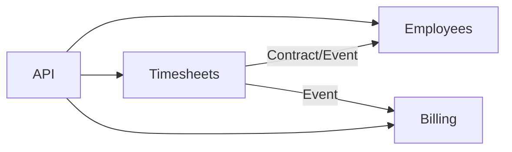
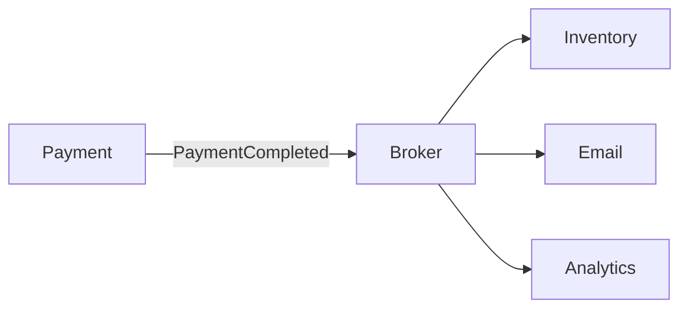
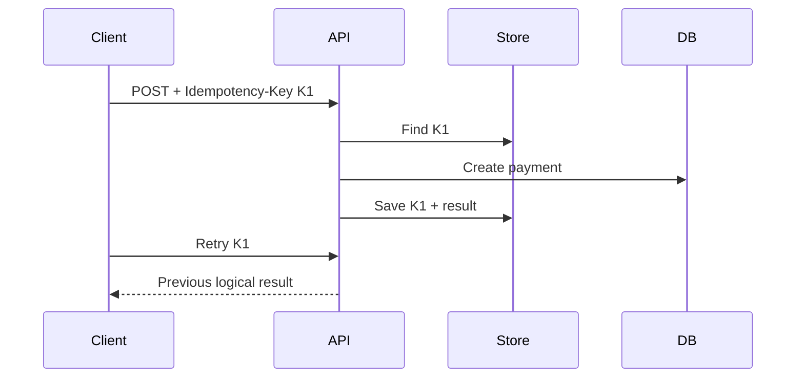
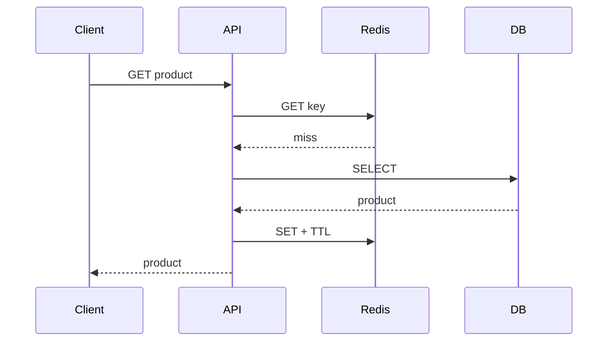
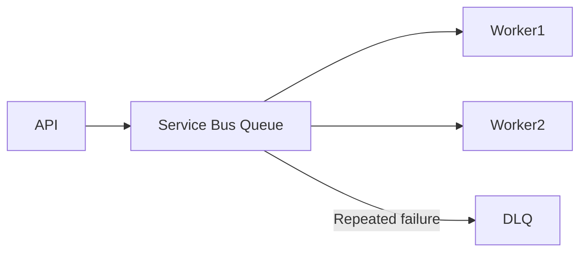
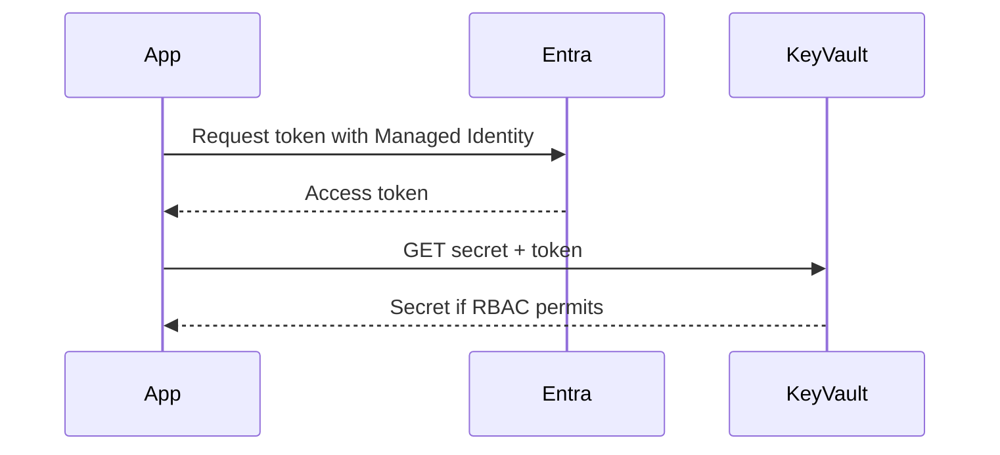
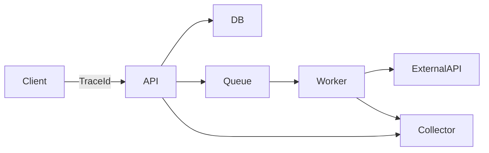
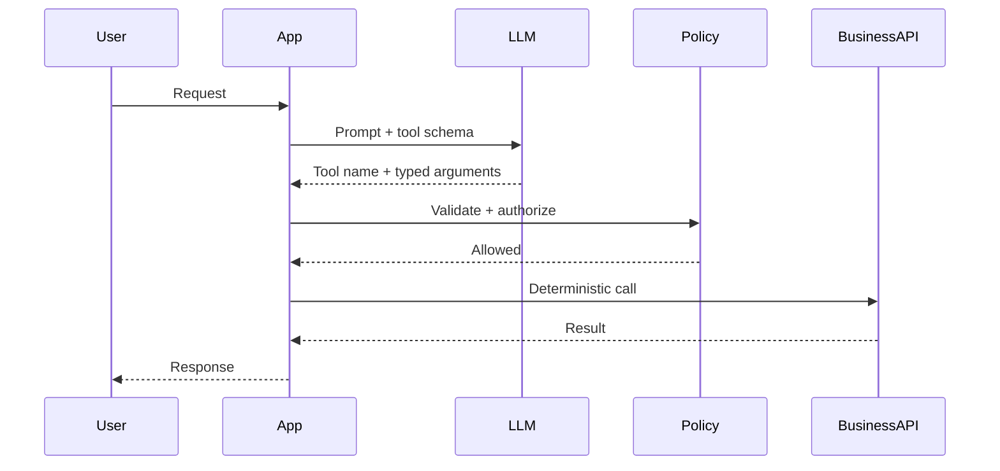
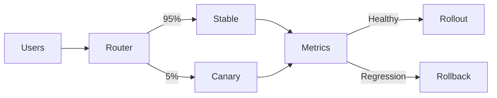

# Daily Knowledge Sharing — 2026-08-17

## Today’s Topics
1. Modular Monolith
2. Event-Driven Architecture
3. Idempotency
4. Optimistic Concurrency với EF Core
5. Cache Aside với Redis
6. Azure Service Bus
7. Managed Identity + Azure Key Vault
8. OpenTelemetry & Distributed Tracing
9. Structured Output + Tool Calling cho LLM
10. Canary Deployment + Feature Flags

---
# 1. Modular Monolith
### 1. What is it?
Một ứng dụng deploy như một unit nhưng chia thành các module nghiệp vụ có boundary rõ ràng. Module sở hữu logic và dữ liệu của mình; module khác chỉ đi qua public contract.
### 2. Why does it exist?
Monolith thiếu boundary dễ thành big ball of mud; Microservices lại thêm network failure, eventual consistency và operational cost. Modular Monolith giữ vận hành đơn giản nhưng tạo ranh giới kiến trúc đủ mạnh.
### 3. How does it work?

Dependency theo business boundary, không phải theo folder. Timesheets không được query trực tiếp bảng nội bộ của Employees chỉ vì dùng chung database.
### 4. Practical example
```csharp
public interface IEmployeeDirectory
{
    Task<EmployeeSummary?> GetAsync(Guid id, CancellationToken ct);
}
```
Timesheets phụ thuộc contract này thay vì `EmployeeRepository` nội bộ.
### 5. Real production scenario
Submit timesheet → Timesheets kiểm tra employee qua contract → lưu dữ liệu → phát `TimesheetSubmitted` → Billing xử lý. Billing có thể được tách thành service sau này mà contract nghiệp vụ không phải thiết kế lại từ đầu.
### 6. Common mistakes
Chỉ đổi folder nhưng vẫn share entity/repository; tạo `Shared` project chứa mọi logic; cross-module DB access; biến mọi interaction thành event dù cần synchronous response.
### 7. Trade-offs
**Advantages:** deployment đơn giản, transaction local, latency thấp. **Costs / Risks:** không có runtime isolation; cần discipline và architecture tests; scale từng module khó hơn Microservices.
### 8. Junior → Middle → Senior understanding
**Junior:** module là business boundary. **Middle:** thiết kế contract và enforce dependency. **Senior / Technical Lead:** chọn boundary, ownership dữ liệu, sync/async interaction và thời điểm thực sự cần tách service.
### 9. Key takeaway
Boundary tốt quan trọng hơn số process. Modular Monolith thường là default tốt khi chưa có nhu cầu scale/deploy độc lập rõ ràng.

---
# 2. Event-Driven Architecture
### 1. What is it?
EDA tổ chức workflow quanh sự kiện đã xảy ra như `OrderPaid` hay `EmployeeDeactivated`. Producer phát event mà không cần biết mọi consumer.
### 2. Why does it exist?
Chuỗi HTTP synchronous tạo temporal coupling: một dependency chậm có thể kéo cả request thất bại. Event cho phép consumer xử lý độc lập và hấp thụ traffic burst.
### 3. How does it work?

Consumer nhận message, xử lý rồi ACK; lỗi tạm thời retry, lỗi kéo dài vào DLQ. Hệ thống phải chấp nhận duplicate và eventual consistency.
### 4. Practical example
```csharp
public sealed record EmployeeDeactivated(Guid EmployeeId, DateTimeOffset OccurredAt);
```
Consumer kiểm tra `MessageId` đã xử lý trước khi thực hiện side effect.
### 5. Real production scenario
Employee deactivate → lưu trạng thái → event → worker mailbox, notification và audit xử lý độc lập. API không phải chờ Microsoft 365 integration hoàn tất.
### 6. Common mistakes
Publish trước DB commit; không Outbox; consumer không idempotent; retry poison message vô hạn; thiếu correlation ID; event chứa internal entity quá chi tiết.
### 7. Trade-offs
**Advantages:** loose coupling, scale consumer độc lập. **Costs / Risks:** eventual consistency, duplicate/out-of-order message, schema evolution và debugging khó hơn.
### 8. Junior → Middle → Senior understanding
**Junior:** phân biệt command và event. **Middle:** retry, DLQ, idempotency, tracing. **Senior / Technical Lead:** Outbox/Inbox, delivery semantics, consistency boundary và recovery.
### 9. Key takeaway
Event giảm temporal coupling nhưng tăng distributed-system complexity. Thiết kế cho at-least-once delivery.

---
# 3. Idempotency
### 1. What is it?
Một operation idempotent có thể được gửi lại nhiều lần nhưng business effect chỉ xảy ra một lần.
### 2. Why does it exist?
Timeout không chứng minh request đầu thất bại. Payment có thể commit rồi response bị mất; retry thiếu idempotency có thể charge hai lần.
### 3. How does it work?

Key phải gắn với operation và request fingerprint.
### 4. Practical example
```csharp
var existing = await db.IdempotencyRecords.SingleOrDefaultAsync(x => x.Key == key, ct);
if (existing is not null) return Results.Ok(existing.Result);
```
Database vẫn cần unique index trên key để chống hai request concurrent cùng vượt qua bước đọc.
### 5. Real production scenario
Mobile app retry payment vì mạng yếu; backend nhận cùng key và trả payment cũ thay vì tạo payment mới.
### 6. Common mistakes
SELECT rồi INSERT nhưng không unique constraint; cùng key cho payload khác; không retention; downstream side effect vẫn duplicate; retry POST khi server không hỗ trợ idempotency.
### 7. Trade-offs
**Advantages:** retry an toàn, giảm duplicate. **Costs / Risks:** storage, cleanup, transaction design và semantics xuyên nhiều service phức tạp.
### 8. Junior → Middle → Senior understanding
**Junior:** timeout tạo trạng thái unknown. **Middle:** key, unique constraint, transaction. **Senior / Technical Lead:** business identity, retention, Outbox/Inbox và downstream semantics.
### 9. Key takeaway
Idempotency là nền tảng của reliable retry. Constraint/atomicity quan trọng hơn một câu `if` trong code.

---
# 4. Optimistic Concurrency với EF Core
### 1. What is it?
Optimistic Concurrency không giữ lock dài; lúc update nó kiểm tra version của record có thay đổi từ lúc đọc hay chưa.
### 2. Why does it exist?
Hai admin cùng sửa một employee có thể tạo lost update nếu request sau ghi đè request trước mà không biết.
### 3. How does it work?
```text
Read Version=7 → Edit → UPDATE ... WHERE Id=42 AND Version=7
0 rows affected => concurrency conflict
```
EF Core chuyển tình huống này thành `DbUpdateConcurrencyException`.
### 4. Practical example
```csharp
public class Employee
{
    public Guid Id { get; set; }
    [Timestamp] public byte[] RowVersion { get; set; } = null!;
}
```
API có thể map conflict thành HTTP `409 Conflict`.
### 5. Real production scenario
Portal HR gửi `RowVersion` cùng PUT/PATCH. Nếu dữ liệu đã đổi, UI reload hoặc cho người dùng merge thay vì silently overwrite.
### 6. Common mistakes
Catch rồi retry mù quáng; không đưa version vào API contract; pessimistic lock cho form mở lâu; update toàn entity; không thiết kế UX cho conflict.
### 7. Trade-offs
**Advantages:** throughput tốt khi conflict hiếm. **Costs / Risks:** caller phải xử lý conflict; contention cao tạo retry và merge phức tạp.
### 8. Junior → Middle → Senior understanding
**Junior:** hiểu lost update. **Middle:** cấu hình concurrency token và integration test. **Senior / Technical Lead:** chọn optimistic/pessimistic theo contention và business merge semantics.
### 9. Key takeaway
Conflict là business outcome cần xử lý, không chỉ exception kỹ thuật.

---
# 5. Cache Aside với Redis
### 1. What is it?
Application đọc Redis trước; cache miss thì đọc DB rồi ghi cache. Database vẫn là source of truth.
### 2. Why does it exist?
Read-heavy query lặp lại gây latency và DB pressure. Distributed cache chia sẻ được giữa nhiều API instances.
### 3. How does it work?

Update thường commit DB trước rồi invalidate key.
### 4. Practical example
```csharp
var json = await cache.GetStringAsync(key, ct);
if (json is not null) return JsonSerializer.Deserialize<ProductDto>(json);
```
Miss thì query `AsNoTracking()`, serialize DTO và cache với TTL phù hợp.
### 5. Real production scenario
Catalog 1.000 reads/s nhưng thay đổi ít. Redis giảm phần lớn DB reads; admin update giá thì invalidation key và request tiếp theo repopulate.
### 6. Common mistakes
Key không scope tenant; TTL quá dài; cache stampede; Redis down làm API down; cache EF entity; không version cache key.
### 7. Trade-offs
**Advantages:** latency thấp, giảm DB load. **Costs / Risks:** stale data, invalidation complexity, thêm network dependency và chi phí.
### 8. Junior → Middle → Senior understanding
**Junior:** hit/miss/TTL. **Middle:** invalidation, fallback, hit ratio. **Senior / Technical Lead:** consistency, stampede protection, multi-region và cache budget.
### 9. Key takeaway
Cache là optimization. Hãy thiết kế invalidation và failure mode trước production.

---
# 6. Azure Service Bus
### 1. What is it?
Azure Service Bus là managed message broker hỗ trợ queue, topic/subscription, durable messaging, retry và dead-lettering.
### 2. Why does it exist?
Workflow dài không nên giữ HTTP request mở. Broker tách producer khỏi consumer và giữ work bền vững khi worker tạm unavailable.
### 3. How does it work?

Peek-lock cho phép message được giao lại nếu consumer chết trước khi complete.
### 4. Practical example
```csharp
var message = new ServiceBusMessage(BinaryData.FromObjectAsJson(new ImportRequested(fileId)))
{
    MessageId = fileId.ToString(), CorrelationId = correlationId
};
await sender.SendMessageAsync(message, ct);
```
### 5. Real production scenario
Upload Excel lớn → Blob Storage → enqueue import → trả `202 Accepted` → worker xử lý batch và cập nhật progress; lỗi nhiều lần vào DLQ.
### 6. Common mistakes
Giả định exactly-once; không monitor DLQ; message quá lớn; lock hết hạn giữa job; retry lỗi business; dùng credential tĩnh khi Managed Identity phù hợp.
### 7. Trade-offs
**Advantages:** durable, burst absorption, independent scaling. **Costs / Risks:** duplicate, eventual consistency, broker cost và operational complexity.
### 8. Junior → Middle → Senior understanding
**Junior:** queue tách request khỏi background work. **Middle:** settlement, lock, retry, DLQ. **Senior / Technical Lead:** queue/topic/session, capacity, schema evolution và recovery.
### 9. Key takeaway
DLQ phải có alert và replay process. Consumer phải idempotent.

---
# 7. Managed Identity + Azure Key Vault
### 1. What is it?
Managed Identity cấp identity do Azure quản lý cho workload; Key Vault giữ secrets/keys/certificates. Workload lấy token từ Microsoft Entra ID thay vì lưu credential để truy cập Vault.
### 2. Why does it exist?
Client secret trong config có thể leak, hết hạn và cần rotation. Managed Identity loại bỏ credential tĩnh giữa workload và Azure resources.
### 3. How does it work?

### 4. Practical example
```csharp
var client = new SecretClient(
    new Uri("https://my-vault.vault.azure.net/"),
    new DefaultAzureCredential());
```
Local có thể dùng developer identity; Azure workload dùng Managed Identity.
### 5. Real production scenario
App Service cần third-party API key. Identity của App Service chỉ có quyền đọc secret cần thiết; key rotate trong Vault mà không thay credential truy cập Vault.
### 6. Common mistakes
Cấp quyền quá rộng; đọc Vault ở mọi request; nhầm Managed Identity loại bỏ third-party secrets; sai firewall/private endpoint; dùng một identity cho quá nhiều workload.
### 7. Trade-offs
**Advantages:** giảm secret management, RBAC/audit tốt. **Costs / Risks:** identity/network debugging phức tạp hơn và local development cần strategy.
### 8. Junior → Middle → Senior understanding
**Junior:** phân biệt workload identity và secret. **Middle:** RBAC, `DefaultAzureCredential`, caching. **Senior / Technical Lead:** least privilege, network boundary, rotation và blast radius.
### 9. Key takeaway
Ưu tiên identity thay credential tĩnh. Key Vault lưu secret; Managed Identity chứng minh workload là ai.

---
# 8. OpenTelemetry & Distributed Tracing
### 1. What is it?
OpenTelemetry chuẩn hóa traces, metrics và logs. Distributed trace nối các span của cùng request qua API, DB, queue, worker và external services.
### 2. Why does it exist?
Một HTTP 500 không cho biết bottleneck nằm ở SQL, Redis hay external API. Correlation thủ công thường thiếu và vendor-specific instrumentation tạo lock-in.
### 3. How does it work?

Trace gồm các span có duration, status, attributes và quan hệ parent/child.
### 4. Practical example
```csharp
builder.Services.AddOpenTelemetry()
    .WithTracing(t => t.AddAspNetCoreInstrumentation()
        .AddHttpClientInstrumentation()
        .AddEntityFrameworkCoreInstrumentation());
```
### 5. Real production scenario
Timesheet API p95 tăng lên 4 giây. Trace cho thấy SQL 30 ms nhưng external call 3.6 giây, giúp team tối ưu đúng dependency.
### 6. Common mistakes
Ghi token/PII vào telemetry; sampling quá mạnh; metric cardinality cao; không propagate context qua queue; instrument mọi method gây noise/cost.
### 7. Trade-offs
**Advantages:** root-cause nhanh, vendor-neutral. **Costs / Risks:** telemetry cost, sampling complexity, overhead và data governance.
### 8. Junior → Middle → Senior understanding
**Junior:** phân biệt logs/metrics/traces. **Middle:** instrumentation và context propagation. **Senior / Technical Lead:** sampling, telemetry budget, SLO signals và PII governance.
### 9. Key takeaway
Trace trả lời request đã đi đâu và chậm ở đâu. Instrument boundary quan trọng hơn mọi method.

---
# 9. Structured Output + Tool Calling cho LLM
### 1. What is it?
Structured Output ép model trả dữ liệu theo schema; Tool Calling cho model đề xuất một capability có contract. Application vẫn là nơi validate và quyết định side effect.
### 2. Why does it exist?
Free-text parsing mong manh. Cho model trực tiếp kiểm soát side effect cũng nguy hiểm vì prompt injection hoặc hallucination có thể tạo hành động sai.
### 3. How does it work?

### 4. Practical example
```csharp
public sealed record CreateTicketArgs(string Title, string Severity);

if (!user.CanCreateTickets) throw new ForbiddenException();
if (args.Severity is not ("low" or "medium" or "high"))
    throw new ValidationException("Invalid severity");
```
Model schema không thay server-side validation.
### 5. Real production scenario
AI assistant đọc incident rồi đề xuất tạo ticket. Tool implementation kiểm tra tenant, role, schema và audit log; action nhạy cảm yêu cầu human approval.
### 6. Common mistakes
Tin model arguments; tool quá rộng; đưa secrets vào context; retry side effect thiếu idempotency; không log token/latency/failure; để model quyết định authorization.
### 7. Trade-offs
**Advantages:** integration ổn định, typed contract, workflow linh hoạt. **Costs / Risks:** model vẫn chọn sai tool/args; latency/cost và security boundary tăng.
### 8. Junior → Middle → Senior understanding
**Junior:** model output là untrusted input. **Middle:** schema, dispatcher, validation, timeout, tests. **Senior / Technical Lead:** AI-vs-deterministic boundary, prompt-injection threat model, approval và evaluation.
### 9. Key takeaway
Tool call là đề xuất, không phải quyền thực thi. Authorization và business invariants phải nằm trong deterministic code.

---
# 10. Canary Deployment + Feature Flags
### 1. What is it?
Canary đưa version mới đến một phần nhỏ traffic trước khi rollout toàn bộ. Feature Flag tách deploy binary khỏi thời điểm bật behavior mới.
### 2. Why does it exist?
Staging không tái tạo production hoàn toàn. Big-bang deployment khiến lỗi mới ảnh hưởng 100% người dùng ngay lập tức.
### 3. How does it work?

### 4. Practical example
```csharp
if (await featureManager.IsEnabledAsync("NewTimesheetCalculation"))
    return await newCalculator.CalculateAsync(input, ct);
return await legacyCalculator.CalculateAsync(input, ct);
```
### 5. Real production scenario
Logic overtime mới deploy nhưng flag chỉ bật internal tenant, sau đó 5% khách hàng. Team theo dõi error rate, latency và billing correctness; có regression thì tắt flag ngay.
### 6. Common mistakes
Migration DB không backward-compatible; không có rollback threshold; flag tồn tại mãi; dùng flag thay authorization; chỉ nhìn CPU mà bỏ business KPI.
### 7. Trade-offs
**Advantages:** giảm blast radius, feedback production sớm, rollback nhanh. **Costs / Risks:** routing/observability phức tạp, phải giữ compatibility và cleanup flag debt.
### 8. Junior → Middle → Senior understanding
**Junior:** deploy và release có thể tách nhau. **Middle:** telemetry theo variant, test hai path, cleanup flag. **Senior / Technical Lead:** rollout stages, rollback criteria, DB compatibility và tenant segmentation.
### 9. Key takeaway
Release an toàn là kiểm soát blast radius. Canary chỉ hữu ích khi có metrics và rollback criteria định trước.