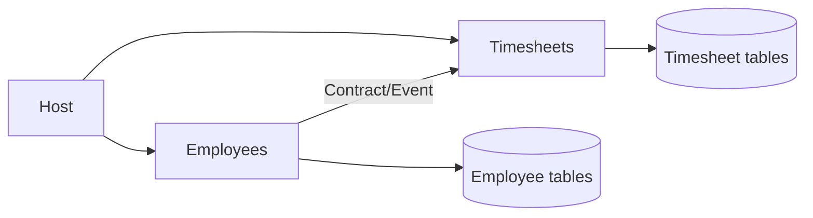
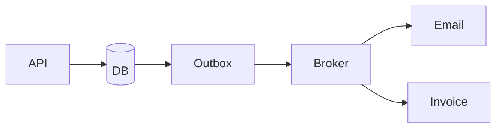
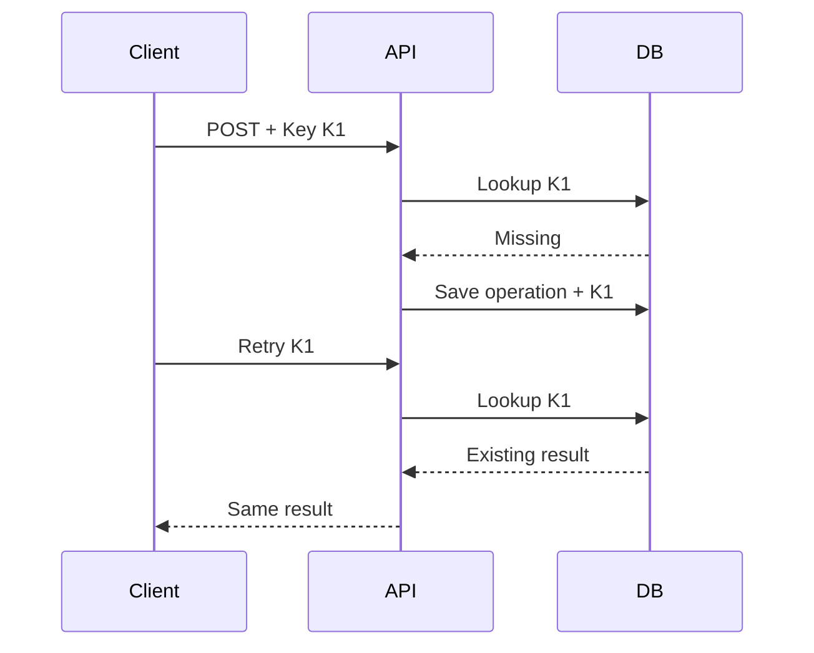
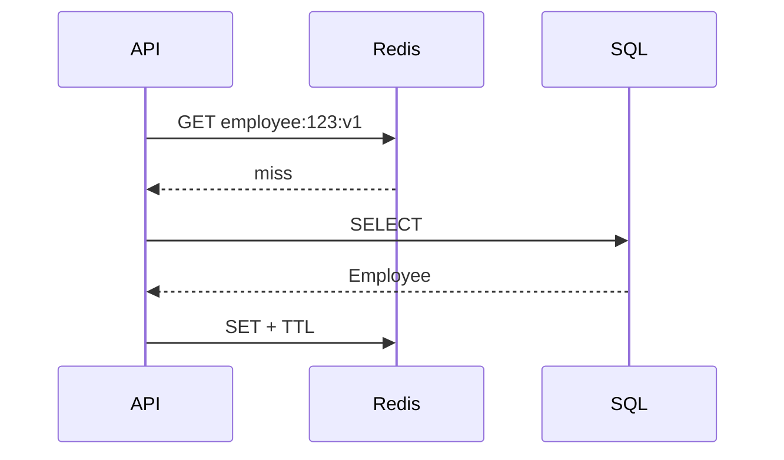
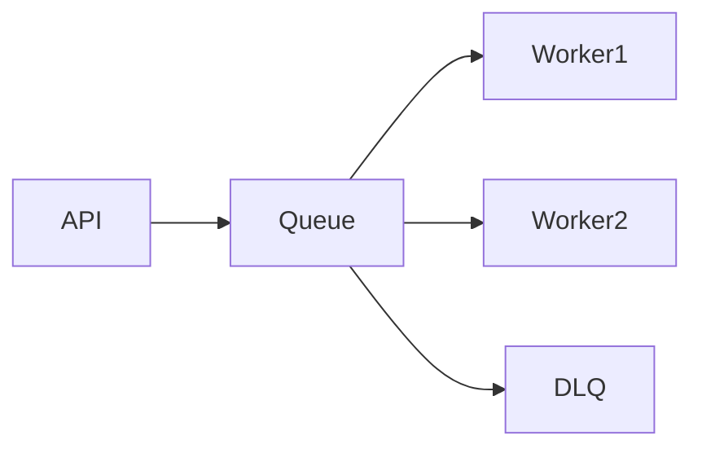
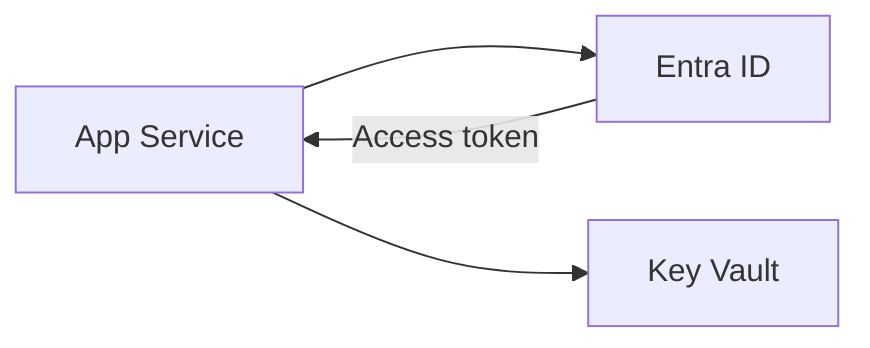
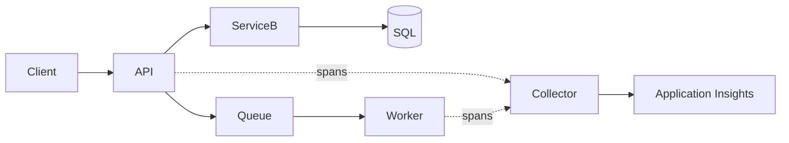
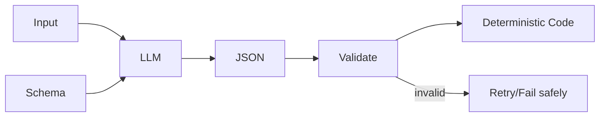
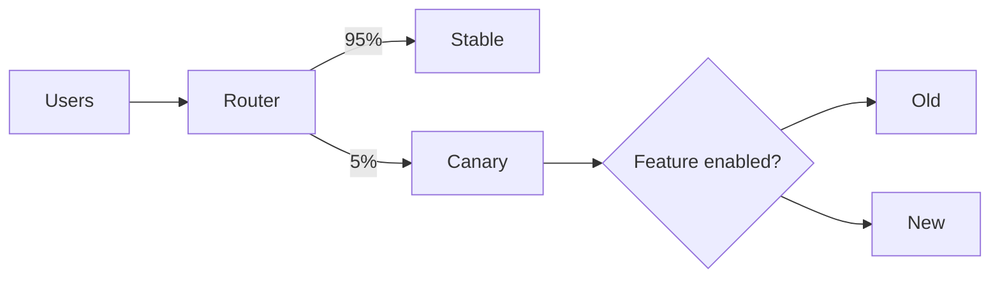

# Daily Knowledge Sharing — 17/08/2026

## Today’s Topics
1. Modular Monolith
2. Event-Driven Architecture
3. Idempotency
4. Optimistic Concurrency với EF Core
5. Cache-Aside với Redis
6. Azure Service Bus
7. Managed Identity + Azure Key Vault
8. OpenTelemetry & Distributed Tracing
9. Structured Output cho LLM
10. Feature Flags + Canary Deployment

---

# 1. Modular Monolith
### 1. What is it?
Một ứng dụng deploy chung nhưng chia thành các module theo business capability như Employees, Timesheets, Notifications. Boundary nằm ở ownership dữ liệu và contract, không chỉ ở folder.
### 2. Why does it exist?
Monolith lớn dễ thành big ball of mud; Microservices lại thêm network failure, deployment và distributed consistency. Modular Monolith giữ vận hành đơn giản nhưng tạo boundary đủ tốt để phát triển lâu dài.
### 3. How does it work?

Mỗi module sở hữu model/data của mình; module khác chỉ đi qua public contract hoặc event.
### 4. Practical example
```csharp
public interface IEmployeeModule
{
    Task<EmployeeSummary?> GetSummaryAsync(Guid id, CancellationToken ct);
}
```
Timesheet inject contract này thay vì `EmployeeDbContext`.
### 5. Real production scenario
Khi Employee bị deactivate, Employees commit trạng thái rồi phát event; Offboarding xử lý mailbox/access thay vì sửa trực tiếp bảng Employee.
### 6. Common mistakes
Chia project nhưng dùng chung entity/repository; `Shared` chứa gần hết domain; module gọi chéo DbContext; tách module theo technical layer.
### 7. Trade-offs
**Advantages:** deploy/debug đơn giản, transaction local dễ, boundary tốt. **Costs/Risks:** isolation và independent scaling kém Microservices; cần discipline để không phá boundary.
### 8. Junior → Middle → Senior understanding
**Junior:** module không chỉ là folder. **Middle:** biết DI, contract, schema và event giữa module. **Senior/Technical Lead:** chọn bounded context, sync/async communication và thời điểm đáng tách service.
### 9. Key takeaway
Boundary quan trọng hơn folder; hãy đạt modularity trước khi trả chi phí Microservices; module nên sở hữu dữ liệu của mình.

---

# 2. Event-Driven Architecture
### 1. What is it?
EDA tổ chức workflow quanh event đã xảy ra như `OrderPaid`, `EmployeeDeactivated`; producer phát event và consumer phản ứng độc lập.
### 2. Why does it exist?
Nếu Payment gọi trực tiếp Invoice, Email, Loyalty và Analytics thì request chậm và downstream failure lan ngược. Event giảm temporal coupling.
### 3. How does it work?

Business state và Outbox được commit cùng transaction; publisher gửi message sau. Consumer phải idempotent vì delivery thường là at-least-once.
### 4. Practical example
```csharp
await using var tx = await db.Database.BeginTransactionAsync(ct);
order.MarkPaid();
db.OutboxMessages.Add(OutboxMessage.From(new OrderPaid(order.Id)));
await db.SaveChangesAsync(ct);
await tx.CommitAsync(ct);
```
### 5. Real production scenario
Payment hoàn tất → Outbox → broker → Invoice/Email/Analytics xử lý riêng. Email lỗi không rollback payment.
### 6. Common mistakes
Tin vào exactly-once; publish trước DB commit; consumer không idempotent; không version schema; không DLQ/correlation ID.
### 7. Trade-offs
**Advantages:** loose coupling, scale độc lập, failure isolation. **Costs/Risks:** eventual consistency, duplicate/out-of-order, observability phức tạp.
### 8. Junior → Middle → Senior understanding
**Junior:** event khác command. **Middle:** retry, DLQ, idempotency, Outbox. **Senior/Technical Lead:** consistency boundary, ordering, partitioning, replay và contract governance.
### 9. Key takeaway
EDA đổi synchronous coupling lấy distributed complexity; Outbox bảo vệ DB/message boundary; consumer luôn chuẩn bị cho duplicate.

---

# 3. Idempotency
### 1. What is it?
Cùng một logical request có thể tới nhiều lần nhưng business side effect chỉ xảy ra một lần.
### 2. Why does it exist?
Client timeout có thể retry dù server đã commit; broker có thể redeliver. Payment hoặc webhook không idempotent dễ tạo duplicate.
### 3. How does it work?

### 4. Practical example
```sql
CREATE UNIQUE INDEX UX_Idempotency_User_Key
ON IdempotencyRecords(UserId, [Key]);
```
Unique constraint chống race condition tốt hơn chỉ `AnyAsync()` rồi insert.
### 5. Real production scenario
Mobile submit timesheet thành công nhưng mất response. Retry cùng key trả submission cũ thay vì tạo bản thứ hai.
### 6. Common mistakes
Key mới cho mỗi retry; không có unique index; cùng key nhưng payload khác; giữ record mãi; retry side effect không được bảo vệ.
### 7. Trade-offs
**Advantages:** retry an toàn, reliability cao. **Costs/Risks:** storage, cleanup, concurrency và response replay semantics.
### 8. Junior → Middle → Senior understanding
**Junior:** retry có thể duplicate. **Middle:** key store + transaction + unique constraint. **Senior/Technical Lead:** scope, retention, payload fingerprint và cross-service effects.
### 9. Key takeaway
Idempotency là business guarantee; database constraint là hàng rào cuối; thiết kế retry và idempotency cùng nhau.

---

# 4. Optimistic Concurrency với EF Core
### 1. What is it?
Cho nhiều request đọc cùng record mà không lock dài; khi update sẽ kiểm tra record có đổi kể từ lúc đọc hay không.
### 2. Why does it exist?
Hai admin sửa cùng Employee có thể gây lost update nếu request sau ghi đè dữ liệu request trước.
### 3. How does it work?
SQL Server `rowversion` đổi sau mỗi update. EF đưa original version vào `WHERE`; affected rows = 0 thì ném `DbUpdateConcurrencyException`.
### 4. Practical example
```csharp
public class Employee
{
    public Guid Id { get; set; }
    [Timestamp] public byte[] RowVersion { get; set; } = [];
}
```
Catch conflict và trả `409 Conflict`, không retry mù.
### 5. Real production scenario
HR Portal gửi DTO kèm rowVersion. Nếu background sync đã sửa record, API yêu cầu reload/merge thay vì silently overwrite.
### 6. Common mistakes
Không gửi token qua API; catch rồi retry mù; dùng timestamp độ chính xác thấp; không định nghĩa reject/merge/last-write-wins.
### 7. Trade-offs
**Advantages:** throughput tốt, không giữ lock dài. **Costs/Risks:** conflict cần UX/business handling; contention cao có thể retry nhiều.
### 8. Junior → Middle → Senior understanding
**Junior:** hiểu lost update. **Middle:** cấu hình token và xử lý exception. **Senior/Technical Lead:** chọn optimistic/pessimistic theo contention và thiết kế merge semantics.
### 9. Key takeaway
Concurrency conflict thường là state conflict, không phải system error; đừng retry mù; API edit dài nên mang concurrency token.

---

# 5. Cache-Aside với Redis
### 1. What is it?
Application đọc Redis trước; miss thì đọc DB rồi populate cache. Redis giảm latency và database load cho read-heavy data.
### 2. Why does it exist?
Profile/config/product được đọc liên tục nhưng ít thay đổi; query DB mỗi request tạo I/O và connection pressure không cần thiết.
### 3. How does it work?

Write thường commit DB trước rồi invalidate cache.
### 4. Practical example
```csharp
var cached = await cache.GetStringAsync(key, ct);
if (cached is not null) return JsonSerializer.Deserialize<EmployeeDto>(cached)!;
var dto = await db.Employees.AsNoTracking().Where(x => x.Id == id)
    .Select(x => new EmployeeDto(x.Id, x.Name)).SingleAsync(ct);
await cache.SetStringAsync(key, JsonSerializer.Serialize(dto), ct);
return dto;
```
### 5. Real production scenario
Employee profile cache 5 phút; HR update xong thì xóa key. Redis down, API fallback SQL thay vì fail toàn bộ.
### 6. Common mistakes
Không TTL; cache authorization quá lâu; key không version; stampede; invalidate trước DB commit; Redis trở thành single point of failure.
### 7. Trade-offs
**Advantages:** latency thấp, giảm DB load. **Costs/Risks:** stale data, invalidation complexity, memory/network dependency.
### 8. Junior → Middle → Senior understanding
**Junior:** hit/miss/TTL. **Middle:** invalidation, serialization, fallback, hit ratio. **Senior/Technical Lead:** consistency tolerance, stampede protection, eviction và degraded mode.
### 9. Key takeaway
Cache không mặc định là source of truth; failure path quan trọng như hit path; invalidation khó hơn GET/SET.

---

# 6. Azure Service Bus
### 1. What is it?
Managed message broker hỗ trợ Queue, Topic/Subscription, retry, dead-lettering và lock-based processing.
### 2. Why does it exist?
HTTP synchronous không hợp với task dài, traffic spike hoặc dependency chập chờn. Queue tách lifetime producer/consumer và load-leveling.
### 3. How does it work?

Peek-Lock giữ message tạm thời; success thì Complete; failure có thể Abandon/retry; poison message vào DLQ.
### 4. Practical example
```csharp
var msg = new ServiceBusMessage(BinaryData.FromObjectAsJson(command))
{
    MessageId = command.OperationId.ToString(),
    CorrelationId = correlationId
};
await sender.SendMessageAsync(msg, ct);
```
### 5. Real production scenario
Offboarding 2.000 employees được enqueue; worker gọi Microsoft Graph theo rate limit; throttling thì retry; poison message vào DLQ.
### 6. Common mistakes
Complete trước DB commit; retry vô hạn; không monitor DLQ; nhét file lớn vào message; consumer không idempotent; lock duration quá ngắn.
### 7. Trade-offs
**Advantages:** durability, load leveling, retry/DLQ managed. **Costs/Risks:** eventual consistency, cost và operational complexity.
### 8. Junior → Middle → Senior understanding
**Junior:** Queue khác Topic. **Middle:** settlement, retry, DLQ, idempotency. **Senior/Technical Lead:** throughput, sessions/order, capacity, DR và contract governance.
### 9. Key takeaway
Queue hấp thụ spike; DLQ cần monitoring/runbook; broker đáng tin cậy không loại bỏ idempotency.

---

# 7. Managed Identity + Azure Key Vault
### 1. What is it?
Managed Identity cho Azure workload một identity không cần client secret; Key Vault giữ secret/key/certificate tập trung.
### 2. Why does it exist?
Secret trong source, pipeline hoặc environment vẫn phải phân phối và rotate. Managed Identity loại credential tĩnh cho Azure-to-Azure authentication.
### 3. How does it work?

Identity được cấp RBAC tối thiểu; SDK dùng `DefaultAzureCredential`.
### 4. Practical example
```csharp
var client = new SecretClient(new Uri(keyVaultUri), new DefaultAzureCredential());
var secret = await client.GetSecretAsync("ExternalApiKey");
```
### 5. Real production scenario
App Service đọc third-party key từ Key Vault bằng Managed Identity; vault dùng RBAC và Private Endpoint; secret không nằm trong deployment package.
### 6. Common mistakes
Cấp Contributor quá rộng; tưởng Managed Identity thay thế nơi lưu third-party secret; không rotate; Private Endpoint nhưng DNS sai; gọi Key Vault trên mọi hot-path request.
### 7. Trade-offs
**Advantages:** giảm secret sprawl, audit/rotation tốt. **Costs/Risks:** RBAC/network phức tạp và phụ thuộc Entra/Key Vault availability.
### 8. Junior → Middle → Senior understanding
**Junior:** không hard-code secret. **Middle:** Managed Identity, RBAC, DefaultAzureCredential. **Senior/Technical Lead:** least privilege, network isolation, rotation, break-glass và degraded mode.
### 9. Key takeaway
Identity và secret storage là hai vấn đề khác nhau; Azure-to-Azure ưu tiên Managed Identity; security cần cả RBAC, network và audit.

---

# 8. OpenTelemetry & Distributed Tracing
### 1. What is it?
OpenTelemetry là chuẩn vendor-neutral cho traces, metrics và logs. Distributed trace nối các span của một request qua API, HTTP dependency, DB, queue và worker.
### 2. Why does it exist?
Trong distributed system, log riêng từng service không cho biết causal chain hoặc bottleneck end-to-end.
### 3. How does it work?

Trace ID nối các span; context được propagate qua HTTP/message headers.
### 4. Practical example
```csharp
builder.Services.AddOpenTelemetry()
    .WithTracing(t => t.AddAspNetCoreInstrumentation()
        .AddHttpClientInstrumentation()
        .AddEntityFrameworkCoreInstrumentation());
```
### 5. Real production scenario
Offboarding mất 40 giây. Trace chỉ ra 35 giây nằm ở Microsoft Graph throttling, không phải SQL; metrics xác nhận dependency latency tăng.
### 6. Common mistakes
Không correlation ID; bỏ background jobs; tag PII/cardinality cao; sampling quá mạnh; thu telemetry nhưng không có alert/runbook.
### 7. Trade-offs
**Advantages:** root-cause nhanh, end-to-end latency. **Costs/Risks:** telemetry cost, storage, sampling và instrumentation overhead.
### 8. Junior → Middle → Senior understanding
**Junior:** phân biệt log/metric/trace. **Middle:** instrument và propagate context. **Senior/Technical Lead:** sampling, semantic conventions, SLO telemetry, cost/cardinality.
### 9. Key takeaway
Logs cho detail, metrics cho health, traces cho request path; context propagation là nền tảng; telemetry phải trả lời operational question.

---

# 9. Structured Output cho LLM
### 1. What is it?
Structured Output yêu cầu model trả dữ liệu theo schema thay vì prose tự do, tạo contract dễ validate cho application.
### 2. Why does it exist?
Regex parse câu trả lời tự do rất mong manh. Production integration cần field/type rõ và failure path xác định.
### 3. How does it work?

Schema validation xác nhận shape/type, không chứng minh nội dung đúng sự thật.
### 4. Practical example
```csharp
public sealed record TicketClassification(string Category, string Priority, double Confidence);
var result = JsonSerializer.Deserialize<TicketClassification>(json)
    ?? throw new InvalidOperationException("Invalid output");
if (result.Confidence is < 0 or > 1) throw new ValidationException();
```
### 5. Real production scenario
AI phân loại QA defect thành category/priority/confidence. Backend validate rồi auto-route case confidence cao; case nhạy cảm vẫn human review.
### 6. Common mistakes
Tin JSON hợp lệ nghĩa là factual; schema toàn string; model được quyền update DB trực tiếp; không version/evaluate; retry vô hạn; log PII.
### 7. Trade-offs
**Advantages:** parsing ổn định, integration/test dễ. **Costs/Risks:** semantic error vẫn tồn tại; cần validation, evaluation và fallback.
### 8. Junior → Middle → Senior understanding
**Junior:** AI output là untrusted input. **Middle:** deserialize, validation, timeout/retry. **Senior/Technical Lead:** autonomy boundary, eval, observability, fallback và cost/security.
### 9. Key takeaway
Structured output giải quyết format, không giải quyết truth; validate như external input; deterministic code giữ quyền kiểm soát side effect quan trọng.

---

# 10. Feature Flags + Canary Deployment
### 1. What is it?
Feature Flag bật/tắt behavior runtime; Canary đưa version mới tới một phần nhỏ traffic. Kết hợp chúng tách deployment khỏi release.
### 2. Why does it exist?
Deploy 100% làm blast radius lớn. Rollback binary cũng không luôn nhanh, nhất là khi migration/background jobs đã chạy.
### 3. How does it work?

Deploy code disabled → canary nhỏ → quan sát telemetry → bật cohort → tăng dần → rollback route hoặc kill-switch khi lỗi.
### 4. Practical example
```csharp
if (await featureManager.IsEnabledAsync("NewTimesheetApproval"))
    return await newApproval.ExecuteAsync(request, ct);
return await legacyApproval.ExecuteAsync(request, ct);
```
### 5. Real production scenario
Approval engine mới deploy nhưng flag off. 5% traffic kiểm tra technical health; sau đó HR pilot được bật. Business metric xấu thì flag off ngay.
### 6. Common mistakes
Flag tồn tại mãi; không test on/off; migration DB không backward-compatible; chỉ nhìn CPU mà bỏ business metric; không định nghĩa fallback khi flag provider lỗi.
### 7. Trade-offs
**Advantages:** blast radius nhỏ, rollback nhanh, progressive delivery. **Costs/Risks:** thêm code path, test matrix, config dependency và governance.
### 8. Junior → Middle → Senior understanding
**Junior:** deployment khác release. **Middle:** implement flag, fallback, telemetry, cleanup. **Senior/Technical Lead:** rollout criteria, backward-compatible migration, automated rollback và flag lifecycle.
### 9. Key takeaway
Canary kiểm soát ai nhận version mới; flag kiểm soát ai dùng behavior mới; progressive delivery chỉ an toàn khi có telemetry và rollback criteria.