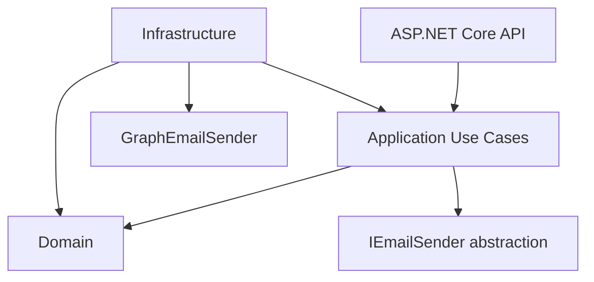
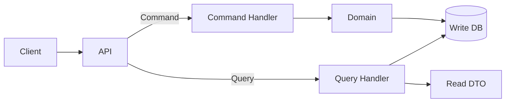
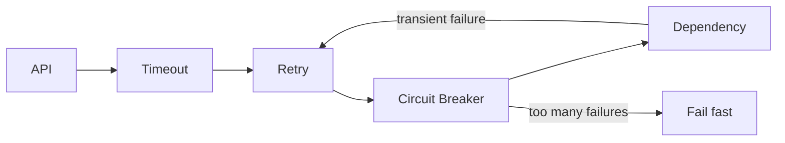
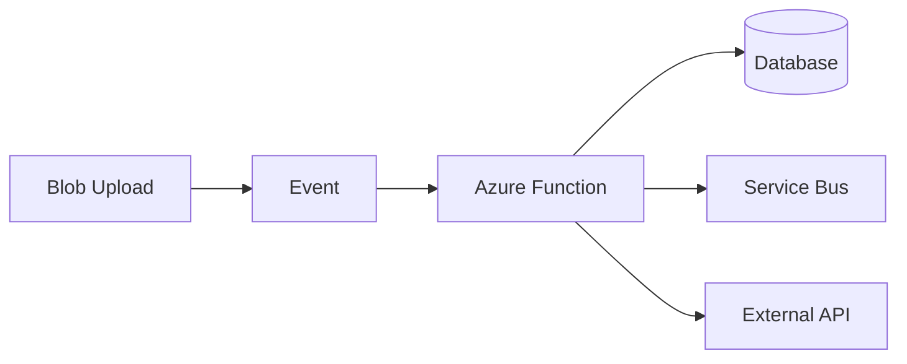
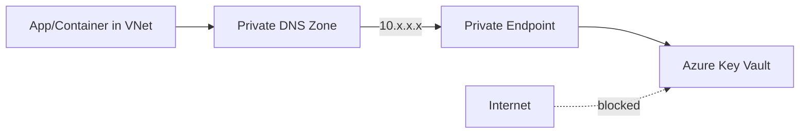
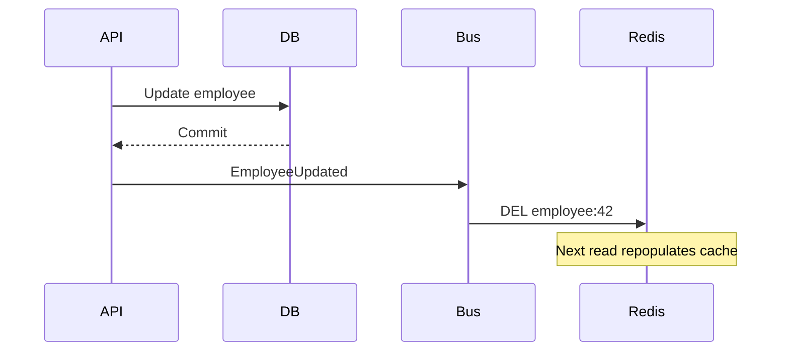
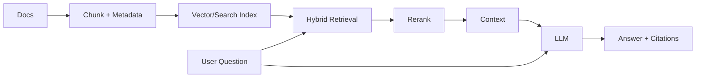

# Daily Knowledge Sharing — 17/08/2026

## Today’s Topics
1. Clean Architecture — dependency boundaries thay vì folder architecture
2. CQRS — tách mô hình đọc và ghi đúng mức
3. API Resilience — Timeout, Retry và Circuit Breaker
4. Database Isolation Levels — consistency, locking và throughput
5. Query Optimization — SARGability và composite index
6. Azure Functions — event-driven compute trong production
7. Azure Private Endpoint — đưa PaaS vào private network path
8. Cache Invalidation — versioning, event invalidation và stale data
9. SLI, SLO và Error Budget — biến reliability thành quyết định kỹ thuật
10. RAG — retrieval, grounding và kiểm soát failure của LLM

---

# 1. Clean Architecture — dependency boundaries thay vì folder architecture

### 1. What is it?
Clean Architecture là cách tổ chức dependency để business rules không phụ thuộc trực tiếp vào ASP.NET Core, EF Core, database, message broker hay một SDK bên ngoài. Ý quan trọng nhất không phải tạo các project `Domain`, `Application`, `Infrastructure`, mà là giữ phần logic có giá trị lâu dài ở phía trong và đẩy implementation detail ra phía ngoài.

Domain chứa invariant và business behavior. Application điều phối use case. Infrastructure hiện thực persistence/integration. API là delivery mechanism. Dependency compile-time phải hướng về abstraction/business core.

### 2. Why does it exist?
Nếu controller gọi thẳng EF Core, Microsoft Graph, Redis và chứa business rule, một thay đổi kỹ thuật sẽ lan khắp hệ thống. Test business logic cũng buộc phải dựng HTTP/database. Clean Architecture giảm coupling này.

Naive solution thường là “chia folder cho đẹp”, nhưng nếu Application vẫn tham chiếu Infrastructure thì boundary chỉ tồn tại trên sơ đồ, không tồn tại trong compiler.

### 3. How does it work?



Application định nghĩa port như `IEmailSender`; Infrastructure cung cấp adapter. Composition root ở API đăng ký implementation bằng DI.

### 4. Practical example

```csharp
public interface IEmployeeRepository
{
    Task<Employee?> GetAsync(Guid id, CancellationToken ct);
    Task SaveChangesAsync(CancellationToken ct);
}

public sealed class DeactivateEmployeeHandler(IEmployeeRepository repository)
{
    public async Task Handle(Guid id, CancellationToken ct)
    {
        var employee = await repository.GetAsync(id, ct)
            ?? throw new KeyNotFoundException();

        employee.Deactivate(); // business invariant nằm trong Domain
        await repository.SaveChangesAsync(ct);
    }
}
```

Handler không cần biết dữ liệu nằm ở SQL Server hay PostgreSQL.

### 5. Real production scenario
Một hệ thống employee management cần deactivate nhân viên, sau đó provisioning Microsoft 365 được thực hiện bất đồng bộ. Domain quyết định trạng thái nào được phép deactivate; Application lưu trạng thái và tạo integration event; Infrastructure dùng EF Core và Azure Service Bus. Nếu sau này thay Service Bus bằng RabbitMQ, business rule không đổi.

### 6. Common mistakes
- Tạo 4 project nhưng mọi layer đều tham chiếu mọi layer.
- Repository abstraction chỉ copy toàn bộ API của `DbSet<T>` và không tạo giá trị.
- Đưa DTO HTTP hoặc EF entity vào Domain.
- Cố abstract mọi framework API dù không có lý do thay đổi/test.
- Domain service biến thành nơi chứa toàn bộ logic procedural, entity trở thành data bag.

### 7. Trade-offs
**Advantages:** test business logic dễ hơn, dependency rõ, integration có thể thay thế, codebase lớn dễ kiểm soát.

**Costs / Risks:** thêm abstraction và mapping; CRUD nhỏ có thể bị ceremony quá mức; boundary sai tạo nhiều lớp nhưng vẫn coupling. Architecture purity không nên quan trọng hơn tốc độ delivery nếu domain rất đơn giản.

### 8. Junior → Middle → Senior understanding
**Junior:** hiểu trách nhiệm từng layer và dependency direction.

**Middle:** biết đặt use case, validation, transaction và integration adapter đúng boundary; viết test không phụ thuộc infrastructure khi phù hợp.

**Senior / Technical Lead:** quyết định chỗ nào cần abstraction, chỗ nào framework coupling là chấp nhận được; bảo vệ module boundary và tránh biến Clean Architecture thành template cứng.

### 9. Key takeaway
- Clean Architecture quản lý dependency, không phải quản lý tên folder.
- Business core không nên biết delivery/persistence detail.
- Chỉ thêm abstraction khi nó bảo vệ boundary hoặc cải thiện testability/changeability.

---

# 2. CQRS — tách mô hình đọc và ghi đúng mức

### 1. What is it?
CQRS (Command Query Responsibility Segregation) tách operation thay đổi state (Command) khỏi operation chỉ đọc dữ liệu (Query). Nó không đồng nghĩa với Microservices, Event Sourcing hay hai database.

Ở mức đơn giản, cùng một ASP.NET Core app và cùng SQL database vẫn có thể dùng CQRS: command đi qua domain/write model, query dùng projection tối ưu cho màn hình.

### 2. Why does it exist?
Một model duy nhất thường bị kéo theo hai nhu cầu trái ngược: write cần invariant và transaction; read cần join, aggregate, filter, pagination và DTO phẳng. Ép cả hai qua generic repository/entity graph thường tạo query khó tối ưu và domain model bị méo theo UI.

### 3. How does it work?



Ở hệ thống lớn hơn, read projection có thể được cập nhật bằng event và nằm trong datastore riêng; khi đó consistency thường là eventual.

### 4. Practical example

```csharp
public sealed record GetTimesheetSummary(Guid EmployeeId, DateOnly Month);

public async Task<IReadOnlyList<TimesheetRowDto>> Handle(
    GetTimesheetSummary query, CancellationToken ct)
{
    return await db.Timesheets
        .AsNoTracking()
        .Where(x => x.EmployeeId == query.EmployeeId && x.WorkDate.Month == query.Month.Month)
        .Select(x => new TimesheetRowDto(x.WorkDate, x.Hours, x.Project.Name))
        .ToListAsync(ct);
}
```

Read side không cần hydrate aggregate nếu chỉ cần DTO báo cáo.

### 5. Real production scenario
E-commerce dùng Order aggregate để kiểm tra inventory/payment transition khi ghi. Trang “My Orders” lại cần order + shipment + payment status. Query side đọc projection được tối ưu cho UI thay vì ép aggregate phục vụ reporting.

### 6. Common mistakes
- Tạo một class command/query cho từng CRUD nhỏ rồi gọi đó là CQRS architecture.
- Dùng CQRS đồng nghĩa với bắt buộc MediatR.
- Tách database quá sớm và vô tình tạo eventual consistency không cần thiết.
- Query side vẫn load full EF entity rồi mapping in-memory.
- Command handler chứa toàn bộ domain rule.

### 7. Trade-offs
**Advantages:** read/write tối ưu độc lập; domain write model sạch hơn; query performance dễ cải thiện.

**Costs / Risks:** nhiều type/handler hơn; read projection riêng cần synchronization; debugging khó hơn nếu event-driven; người dùng có thể thấy dữ liệu chưa cập nhật ngay.

### 8. Junior → Middle → Senior understanding
**Junior:** phân biệt command thay đổi state và query không thay đổi state.

**Middle:** thiết kế handler, DTO projection, validation và transaction boundary; tránh N+1.

**Senior / Technical Lead:** quyết định mức CQRS phù hợp, khi nào cần read store riêng, consistency SLA và cơ chế rebuild projection.

### 9. Key takeaway
- CQRS có thể bắt đầu rất nhẹ trong một process và một database.
- Write model tối ưu correctness; read model tối ưu truy vấn.
- Chỉ tách datastore khi lợi ích scale/performance lớn hơn chi phí consistency.

---

# 3. API Resilience — Timeout, Retry và Circuit Breaker

### 1. What is it?
Resilience là khả năng service tiếp tục hoạt động có kiểm soát khi dependency chậm, lỗi tạm thời hoặc unavailable. Ba primitive quan trọng là timeout, retry và circuit breaker. Chúng giải quyết ba vấn đề khác nhau và phải phối hợp thay vì bật retry một cách máy móc.

### 2. Why does it exist?
Một HTTP call không có timeout hợp lý có thể giữ request, socket và thread/task quá lâu. Retry vô hạn làm dependency đang yếu bị tải thêm. Nếu service vẫn gửi request vào dependency đã lỗi liên tục, failure có thể cascade sang toàn hệ thống.

### 3. How does it work?



Retry chỉ dành cho transient failure và operation an toàn/idempotent. Circuit breaker mở sau ngưỡng lỗi, fail fast một thời gian rồi half-open để thử phục hồi.

### 4. Practical example

```csharp
builder.Services.AddHttpClient<PayrollClient>(client =>
{
    client.Timeout = TimeSpan.FromSeconds(10);
});

// Với .NET resilience pipeline, policy thực tế nên cấu hình
// retry chỉ cho lỗi transient và giới hạn số lần thử.
```

Một nguyên tắc thực tế: request budget 3 giây thì không thể cấu hình ba lần retry, mỗi lần timeout 5 giây. Retry budget phải nằm trong end-to-end latency budget.

### 5. Real production scenario
API đồng bộ employee profile sang Microsoft Graph. Graph trả `429 Too Many Requests` kèm `Retry-After`. Client phải tôn trọng backoff, không retry POST không-idempotent một cách mù quáng, và background job nên lưu trạng thái để retry sau thay vì giữ request người dùng.

### 6. Common mistakes
- Retry mọi `5xx` và mọi HTTP method.
- Retry ngay lập tức không jitter/backoff.
- Timeout từng attempt lớn hơn latency budget toàn request.
- Circuit breaker global cho nhiều downstream endpoint có failure profile khác nhau.
- Nuốt exception sau retry khiến observability mất root cause.
- Retry ở nhiều layer tạo retry amplification: 3×3×3 = 27 calls.

### 7. Trade-offs
**Advantages:** chịu transient fault tốt hơn, giảm cascade failure, dependency có thời gian phục hồi.

**Costs / Risks:** tăng latency và traffic khi retry; breaker tuning sai gây false open; policy phức tạp làm incident khó hiểu hơn.

### 8. Junior → Middle → Senior understanding
**Junior:** hiểu timeout khác retry và không phải lỗi nào cũng retry.

**Middle:** cấu hình backoff, jitter, cancellation token, idempotency và metrics cho retry/breaker.

**Senior / Technical Lead:** thiết kế end-to-end timeout budget, tránh retry amplification, chọn sync vs async recovery và xác định degraded mode.

### 9. Key takeaway
- Timeout trước khi nghĩ đến retry.
- Retry chỉ transient + safe/idempotent operation.
- Circuit breaker bảo vệ cả caller lẫn dependency khỏi cascade failure.

---

# 4. Database Isolation Levels — consistency, locking và throughput

### 1. What is it?
Isolation level quy định một transaction được phép nhìn thấy thay đổi từ transaction khác ở mức nào. Nó là sự cân bằng giữa consistency và concurrency. Các mức phổ biến gồm Read Committed, Repeatable Read, Snapshot và Serializable.

### 2. Why does it exist?
Nếu mọi transaction luôn khóa toàn bộ dữ liệu đến khi hoàn tất, consistency cao nhưng throughput thấp. Nếu transaction đọc dữ liệu quá “thoáng”, nó có thể gặp dirty/non-repeatable/phantom reads. Database cần nhiều mức isolation để workload chọn trade-off phù hợp.

### 3. How does it work?
Ví dụ hai transaction cùng xử lý quota:

```text
T1: READ Remaining = 1
T2: READ Remaining = 1
T1: UPDATE Remaining = 0
T2: UPDATE Remaining = 0
```

Nếu business operation là “chỉ một người được lấy slot cuối”, chỉ đọc rồi update không đủ. Cần atomic conditional update, optimistic concurrency hoặc isolation/locking phù hợp.

### 4. Practical example

```sql
UPDATE BookingSlots
SET Remaining = Remaining - 1
WHERE Id = @id
  AND Remaining > 0;

IF @@ROWCOUNT = 0
    THROW 50001, 'No slot available', 1;
```

Thay vì `SELECT` rồi quyết định ở C#, conditional update để database thực hiện check + mutation atomically.

### 5. Real production scenario
Timesheet approval chạy đồng thời với payroll closing. Nếu payroll đọc một phần dữ liệu trước và phần khác sau khi approval commit, báo cáo có thể không đại diện cho một snapshot nhất quán. Snapshot isolation có thể phù hợp cho reporting dài, nhưng cần theo dõi version store và write conflicts.

### 6. Common mistakes
- Nghĩ `TransactionScope` tự động giải quyết mọi race condition.
- Dùng Serializable cho toàn hệ thống để “an toàn”.
- Transaction mở trong lúc gọi HTTP bên ngoài khiến lock sống rất lâu.
- Không hiểu database default isolation và row-versioning configuration.
- Catch deadlock rồi retry vô hạn.

### 7. Trade-offs
**Advantages:** isolation mạnh giảm anomaly và đơn giản hóa một số invariant.

**Costs / Risks:** lock/blocking nhiều hơn hoặc version storage tăng; transaction dài làm contention; Serializable có thể giảm throughput mạnh.

### 8. Junior → Middle → Senior understanding
**Junior:** hiểu transaction atomicity không đồng nghĩa isolation tuyệt đối.

**Middle:** nhận biết blocking/deadlock, chọn transaction boundary nhỏ và dùng optimistic concurrency khi phù hợp.

**Senior / Technical Lead:** mapping business invariant sang consistency requirement, chọn isolation theo workload và đo contention/version-store cost trong production.

### 9. Key takeaway
- Isolation level là business correctness decision, không chỉ database setting.
- Giữ transaction ngắn và tránh network I/O bên trong transaction.
- Atomic SQL thường tốt hơn “read-check-write” ở application.

---

# 5. Query Optimization — SARGability và composite index

### 1. What is it?
SARGability mô tả predicate mà database có thể dùng hiệu quả với index seek. Composite index là index nhiều cột; thứ tự key ảnh hưởng trực tiếp đến loại query mà optimizer có thể seek, sort hoặc range scan hiệu quả.

### 2. Why does it exist?
Có index không có nghĩa query sẽ nhanh. Nếu bạn bọc indexed column trong function, cast sai kiểu hoặc thiết kế key order không khớp filter, optimizer có thể scan hàng triệu row. Performance phải bắt đầu từ execution plan và lượng data đọc, không phải “thêm index thử”.

### 3. How does it work?

```text
Predicate tốt:
CreatedAt >= @from AND CreatedAt < @to
        ↓
Index seek vào range cần thiết

Predicate kém:
CAST(CreatedAt AS date) = @date
        ↓
Có thể phải evaluate function trên nhiều row
```

### 4. Practical example

```sql
-- Kém SARGable
SELECT Id, EmployeeId, CreatedAt
FROM Timesheets
WHERE CAST(CreatedAt AS date) = @date;

-- Tốt hơn
SELECT Id, EmployeeId, CreatedAt
FROM Timesheets
WHERE CreatedAt >= @date
  AND CreatedAt < DATEADD(day, 1, @date);

CREATE INDEX IX_Timesheets_EmployeeId_CreatedAt
ON Timesheets(EmployeeId, CreatedAt)
INCLUDE(Status, Hours);
```

Nếu query thường filter `EmployeeId = ?` rồi range `CreatedAt`, key order trên phù hợp hơn đảo ngược trong nhiều workload.

### 5. Real production scenario
API lịch sử timesheet từ 150 ms tăng lên 8 giây sau một năm. Root cause không phải CPU application mà query scan 20 triệu rows do `CONVERT(date, WorkDate)`. Rewrite range predicate + index đúng access pattern giảm logical reads đáng kể.

### 6. Common mistakes
- Index mọi column xuất hiện trong `WHERE`.
- Dùng `SELECT *`, khiến covering index khó và network payload lớn.
- Không xem actual execution plan/logical reads.
- Dùng leading wildcard `LIKE '%abc'` rồi kỳ vọng B-tree seek.
- Parameter/data type không khớp gây implicit conversion.
- Tạo quá nhiều index làm write chậm và tăng storage.

### 7. Trade-offs
**Advantages:** giảm I/O, CPU database và latency; đôi khi cải thiện nhiều hơn mọi tối ưu C#.

**Costs / Risks:** mỗi index phải được maintain khi INSERT/UPDATE/DELETE; include quá nhiều cột làm index phình; access pattern thay đổi có thể làm index cũ vô ích.

### 8. Junior → Middle → Senior understanding
**Junior:** hiểu seek/scan và vì sao function trên column có thể phá index usage.

**Middle:** đọc execution plan, đo logical reads, thiết kế composite/covering index theo query.

**Senior / Technical Lead:** cân bằng read/write workload, index portfolio, statistics, parameter sensitivity và capacity growth.

### 9. Key takeaway
- Tối ưu query bằng measurement, không bằng cảm giác.
- Predicate và index key order phải khớp access pattern.
- Index cải thiện read nhưng luôn có write/storage cost.

---

# 6. Azure Functions — event-driven compute trong production

### 1. What is it?
Azure Functions là compute service phù hợp với workload kích hoạt bởi event: HTTP, timer, queue, Service Bus, Event Grid hoặc storage event. Developer tập trung vào function handler trong khi platform quản lý nhiều phần của hosting và scale.

### 2. Why does it exist?
Không phải background task nào cũng cần một App Service chạy 24/7. File upload, webhook, queue consumer hoặc job định kỳ thường có thời gian idle lớn. Functions cung cấp mô hình event-driven và scale theo workload phù hợp hơn.

### 3. How does it work?



Trigger nhận event; function xử lý; checkpoint/retry/dead-letter tùy binding/service. Với workload dài hoặc stateful orchestration, cần Durable Functions hoặc service khác thay vì giữ một invocation quá lâu.

### 4. Practical example

```csharp
public sealed class ProcessInvoiceFunction(ILogger<ProcessInvoiceFunction> logger)
{
    [Function("ProcessInvoice")]
    public async Task Run(
        [ServiceBusTrigger("invoice-jobs", Connection = "ServiceBus")]
        string message,
        CancellationToken ct)
    {
        logger.LogInformation("Processing invoice job {Message}", message);
        await ProcessAsync(message, ct);
    }
}
```

Trong production, secret nên lấy qua Managed Identity/configuration thay vì hard-code connection string khi service hỗ trợ identity-based access.

### 5. Real production scenario
Người dùng upload Excel 100 MB lên Blob Storage. API chỉ tạo metadata và trả `202 Accepted`; event kích hoạt Function parse file, ghi batch vào database và gửi notification. Request web không bị giữ vài phút.

### 6. Common mistakes
- Dùng Function cho CPU-heavy process dài mà không hiểu timeout/scale/cost.
- Assume exactly-once delivery; handler không idempotent.
- Mỗi message mở quá nhiều DB connections khi scale-out.
- Không cấu hình poison/dead-letter handling.
- Dùng static mutable state như thể chỉ có một instance.
- Không quan sát cold start và dependency initialization.

### 7. Trade-offs
**Advantages:** event integration tốt, scale linh hoạt, giảm vận hành cho bursty workload.

**Costs / Risks:** cold start tùy hosting; local debugging và distributed tracing phức tạp hơn; scale-out có thể đánh sập database downstream nếu không giới hạn concurrency.

So với App Service/Container Apps: Functions phù hợp event handler ngắn/bursty; worker/container phù hợp workload liên tục hoặc cần runtime control cao hơn.

### 8. Junior → Middle → Senior understanding
**Junior:** hiểu trigger/binding và stateless execution.

**Middle:** xử lý idempotency, retry, dead-letter, DI, cancellation và observability.

**Senior / Technical Lead:** chọn hosting model, concurrency/scale limits, downstream capacity, networking, security và cost model.

### 9. Key takeaway
- Functions mạnh nhất khi workload thật sự event-driven.
- Scale của consumer phải phù hợp capacity của downstream.
- Luôn thiết kế handler theo at-least-once delivery.

---

# 7. Azure Private Endpoint — đưa PaaS vào private network path

### 1. What is it?
Private Endpoint tạo một network interface có private IP trong Azure Virtual Network để truy cập một PaaS resource như Storage, Key Vault hoặc SQL qua private path. Nó khác service firewall đơn thuần: client resolve service hostname về private IP và traffic đi qua private connectivity.

### 2. Why does it exist?
Một service có public endpoint dù được authentication tốt vẫn mở thêm attack surface và phụ thuộc public network path. Với workload nhạy cảm, tổ chức muốn database/storage chỉ được truy cập từ VNet/on-prem qua private routing.

### 3. How does it work?



DNS là phần thường gây lỗi nhất. Application vẫn gọi hostname chuẩn của service; private DNS mapping làm hostname resolve về private endpoint IP.

### 4. Practical example
Một ASP.NET Core app trong VNet gọi Key Vault bằng SDK:

```csharp
var credential = new DefaultAzureCredential();
var client = new SecretClient(
    new Uri("https://my-vault.vault.azure.net/"), credential);

var secret = await client.GetSecretAsync("ApiKey");
```

Code không cần dùng private IP. Networking/DNS quyết định request đi private path; Managed Identity giải quyết authentication.

### 5. Real production scenario
Payroll API chạy trên Azure Container Apps/App Service có VNet integration. Azure SQL và Key Vault disable public network access. Private Endpoint + Private DNS cho phép workload truy cập hai resource; developer laptop ngoài VPN không thể kết nối trực tiếp production DB.

### 6. Common mistakes
- Tạo Private Endpoint nhưng quên Private DNS zone/link.
- Nghĩ Private Endpoint thay thế authentication/authorization.
- Disable public access trước khi xác minh route/DNS, gây outage.
- Không tính đường kết nối từ on-prem/VPN/CI runner.
- Có private endpoint nhưng app vẫn egress qua public endpoint do DNS sai.

### 7. Trade-offs
**Advantages:** giảm public exposure, network segmentation tốt hơn, phù hợp compliance.

**Costs / Risks:** DNS/routing phức tạp; troubleshooting khó hơn; thêm resource/cost; CI/CD và developer access cần network path phù hợp.

### 8. Junior → Middle → Senior understanding
**Junior:** phân biệt private network access và identity authorization.

**Middle:** debug DNS resolution, VNet integration, NSG/routing và service firewall.

**Senior / Technical Lead:** thiết kế hub-spoke/private DNS topology, hybrid connectivity, break-glass access, deployment path và cost/operational complexity.

### 9. Key takeaway
- Private Endpoint giải quyết network reachability; Managed Identity/RBAC giải quyết identity/permission.
- DNS là thành phần cốt lõi của thiết kế.
- Security tốt cần cả private path lẫn least privilege.

---

# 8. Cache Invalidation — versioning, event invalidation và stale data

### 1. What is it?
Cache invalidation là chiến lược đảm bảo dữ liệu cache không sống sai quá lâu sau khi source of truth thay đổi. TTL chỉ là một cơ chế; hệ thống production thường kết hợp TTL, explicit eviction, key versioning hoặc event-driven invalidation.

### 2. Why does it exist?
Cache giúp giảm latency/load nhưng tạo bản sao dữ liệu. Khi database thay đổi, cache không tự biết. Nếu chỉ đặt TTL 30 phút, người dùng có thể thấy quyền truy cập, giá sản phẩm hoặc trạng thái đơn hàng cũ trong 30 phút — có thể không chấp nhận được.

### 3. How does it work?



Vấn đề khó là đảm bảo event invalidation không bị mất sau DB commit. Outbox pattern thường được dùng khi correctness quan trọng.

### 4. Practical example

```csharp
public async Task<EmployeeDto?> GetEmployeeAsync(Guid id, CancellationToken ct)
{
    var key = $"employee:v2:{id}";
    var cached = await cache.GetStringAsync(key, ct);
    if (cached is not null)
        return JsonSerializer.Deserialize<EmployeeDto>(cached);

    var dto = await db.Employees.AsNoTracking()
        .Where(x => x.Id == id)
        .Select(x => new EmployeeDto(x.Id, x.Name, x.Status))
        .SingleOrDefaultAsync(ct);

    if (dto is not null)
        await cache.SetStringAsync(key, JsonSerializer.Serialize(dto),
            new DistributedCacheEntryOptions { AbsoluteExpirationRelativeToNow = TimeSpan.FromMinutes(5) }, ct);

    return dto;
}
```

`v2` giúp rollout schema cache mới mà không phải scan/delete toàn bộ key cũ.

### 5. Real production scenario
Employee role thay đổi từ Admin thành User. Nếu authorization decision bị cache 30 phút và không invalidate, quyền cũ tồn tại quá lâu. Với security-sensitive data, TTL phải ngắn hoặc invalidation đáng tin cậy; đôi khi không nên cache authorization decision.

### 6. Common mistakes
- Cache data nhạy consistency chỉ vì query chậm.
- Xóa cache trước DB commit; transaction rollback nhưng cache đã mất hoặc repopulate dữ liệu cũ.
- Không chống cache stampede khi key nóng hết hạn.
- Dùng wildcard key scan trong Redis production để invalidate.
- Không version cache serialization schema.
- Coi Redis unavailable là lý do API phải unavailable dù DB vẫn khỏe.

### 7. Trade-offs
**Advantages:** latency thấp, giảm DB load, tăng throughput.

**Costs / Risks:** stale data, thêm failure mode, invalidation phức tạp, memory/cost và operational burden.

### 8. Junior → Middle → Senior understanding
**Junior:** hiểu cache là bản sao, database vẫn là source of truth.

**Middle:** implement cache-aside, TTL, key versioning, fallback và stampede protection.

**Senior / Technical Lead:** phân loại dữ liệu theo consistency tolerance, thiết kế invalidation/outbox, capacity và degraded behavior khi Redis lỗi.

### 9. Key takeaway
- Hỏi “stale tối đa bao lâu?” trước khi chọn TTL.
- Cache invalidation là consistency design, không chỉ `Remove(key)`.
- Không phải dữ liệu nào cũng đáng cache.

---

# 9. SLI, SLO và Error Budget — biến reliability thành quyết định kỹ thuật

### 1. What is it?
SLI là chỉ số đo reliability thực tế, ví dụ tỷ lệ request thành công hoặc latency dưới ngưỡng. SLO là mục tiêu cho SLI, ví dụ 99.9% request thành công trong 30 ngày. Error budget là phần failure được phép: SLO 99.9% tương ứng budget 0.1% trong window.

SLA là cam kết với khách hàng và có thể có hậu quả thương mại; SLO là mục tiêu kỹ thuật nội bộ, thường nên chặt hoặc được thiết kế phù hợp với SLA.

### 2. Why does it exist?
“System phải ổn định” không đo được. 100% availability gần như không thực tế và rất đắt. SLO tạo ngôn ngữ chung giữa product và engineering để quyết định khi nào ưu tiên feature, khi nào phải đầu tư reliability.

### 3. How does it work?

```text
User expectation
      ↓
SLI: successful requests / valid requests
      ↓
SLO: >= 99.9% over 30 days
      ↓
Error budget: 0.1%
      ↓
Burn rate alert → incident / release decision
```

Nên đo user-visible outcome thay vì chỉ CPU hoặc “process đang chạy”.

### 4. Practical example
Nếu API có 10,000,000 valid requests/tháng và SLO availability là 99.9%, budget xấp xỉ 10,000 failed requests. Alert tốt không chỉ báo “5 lỗi”; nó báo tốc độ tiêu budget nhanh bất thường.

Một metric ASP.NET Core/OpenTelemetry có thể phân loại request theo route/status, nhưng tránh high-cardinality label như `userId`.

### 5. Real production scenario
SaaS payroll có SLO 99.95% cho submit timesheet. Sau deployment, error rate 1% trong 20 phút làm burn budget rất nhanh. Team rollback dù CPU/memory bình thường vì user-facing SLI đang vi phạm mục tiêu.

### 6. Common mistakes
- Gọi mọi metric là SLI.
- SLO 100% khiến team không có error budget và overengineer.
- Đo server uptime nhưng bỏ qua request trả dữ liệu sai/chậm.
- Alert trên mọi lỗi đơn lẻ gây alert fatigue.
- Cardinality quá cao làm telemetry đắt và khó query.
- Không loại traffic không hợp lệ/bot khỏi denominator theo định nghĩa rõ ràng.

### 7. Trade-offs
**Advantages:** reliability có thể đo, ưu tiên kỹ thuật dựa trên dữ liệu, alert gắn với user impact.

**Costs / Risks:** cần telemetry chuẩn và định nghĩa denominator tốt; SLO sai có thể thúc đẩy hành vi sai; observability có chi phí ingestion/storage.

### 8. Junior → Middle → Senior understanding
**Junior:** phân biệt metric, SLI, SLO và SLA.

**Middle:** instrument request, tạo dashboard và alert dựa trên error/latency.

**Senior / Technical Lead:** chọn SLI phản ánh user journey, thiết kế multi-window burn-rate alert và dùng error budget trong release governance.

### 9. Key takeaway
- Reliability phải được định nghĩa từ góc nhìn người dùng.
- SLO 100% thường là mục tiêu tệ.
- Error budget giúp cân bằng delivery speed và reliability investment.

---

# 10. RAG — retrieval, grounding và kiểm soát failure của LLM

### 1. What is it?
RAG (Retrieval-Augmented Generation) là kiến trúc trong đó hệ thống tìm các đoạn thông tin liên quan từ nguồn dữ liệu trước, rồi đưa chúng vào context để LLM tạo câu trả lời có grounding. RAG không “dạy lại model”; nó cung cấp evidence tại request time.

Pipeline production thường gồm ingestion → chunking → embedding/index → retrieval → optional reranking → prompt/context construction → generation → citation/evaluation.

### 2. Why does it exist?
LLM không biết dữ liệu private mới nhất và có thể hallucinate. Nhét toàn bộ tài liệu vào prompt vừa đắt vừa vượt context window. RAG tìm subset liên quan để giảm token và tăng khả năng trả lời dựa trên nguồn.

### 3. How does it work?



Vector similarity không phải lúc nào cũng đủ. Tên mã lỗi, employee ID hoặc API name thường cần keyword/BM25; hybrid search thường thực dụng hơn pure vector search.

### 4. Practical example

```csharp
public sealed record RetrievedChunk(string Text, string Source, double Score);

var chunks = await search.SearchAsync(question, topK: 8, ct);
var context = string.Join("\n\n", chunks.Select((x, i) =>
    $"[Source {i + 1}: {x.Source}]\n{x.Text}"));

var prompt = $"""
Answer only from the supplied sources.
If the sources are insufficient, say that the information is unavailable.

Question: {question}
Sources:
{context}
""";
```

Deterministic code phải kiểm soát ACL filtering, source selection, token budget và citation mapping; không giao các bước security này cho model tự quyết.

### 5. Real production scenario
Internal engineering assistant trả lời “quy trình offboarding mailbox hiện tại là gì?”. Search layer chỉ retrieve tài liệu mà user có quyền đọc, ưu tiên bản policy mới nhất, rerank top chunks rồi LLM trả lời kèm source. Nếu retrieval không có evidence đủ mạnh, hệ thống trả “không đủ thông tin” thay vì tự bịa.

### 6. Common mistakes
- Đánh giá RAG chỉ bằng việc “demo trông có vẻ đúng”.
- Chunk cố định quá nhỏ làm mất ngữ cảnh; quá lớn làm retrieval nhiễu.
- Không lưu metadata version/date/ACL.
- Chỉ dùng vector search cho exact identifier.
- Đưa retrieved text vào prompt như trusted instruction, tạo prompt-injection path.
- Không đo retrieval recall riêng với generation quality.
- Top-K quá lớn làm tăng token cost và giảm signal-to-noise.

### 7. Trade-offs
**Advantages:** dùng knowledge mới/private, citation tốt hơn, cập nhật dữ liệu không cần fine-tune model.

**Costs / Risks:** thêm search infrastructure, ingestion/index freshness, retrieval failure, prompt injection và token cost. RAG không đảm bảo factuality nếu source sai hoặc retrieval sai.

### 8. Junior → Middle → Senior understanding
**Junior:** hiểu embedding/search tìm context, LLM dùng context để trả lời.

**Middle:** implement chunking, metadata filter, hybrid retrieval, token budget, citations và evaluation dataset.

**Senior / Technical Lead:** thiết kế ACL trước retrieval, freshness/version strategy, failure policy, evaluation metrics, cost/latency budget và ranh giới giữa deterministic control với model decision.

### 9. Key takeaway
- RAG là retrieval system + generation system; phải đánh giá hai phần riêng.
- Security filtering phải xảy ra bằng deterministic code, không nhờ prompt.
- Retrieval quality và source quality quyết định trần chất lượng của câu trả lời.
