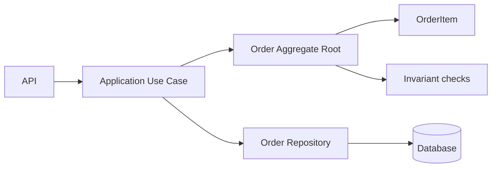
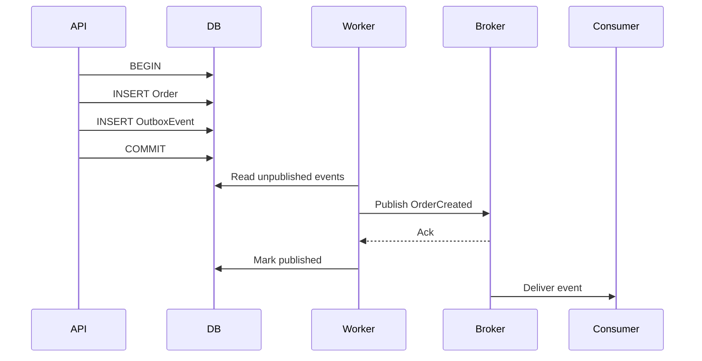
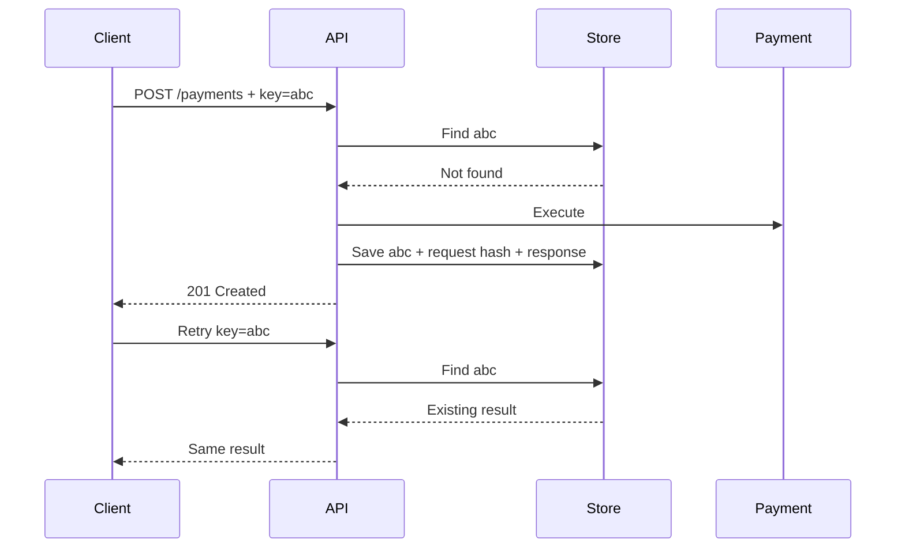
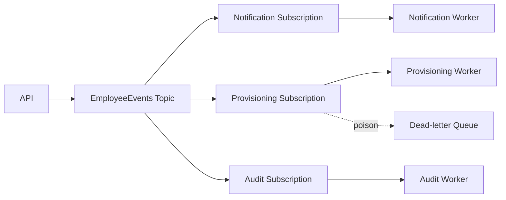
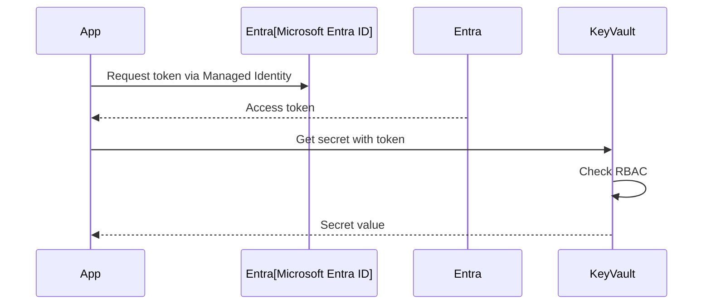
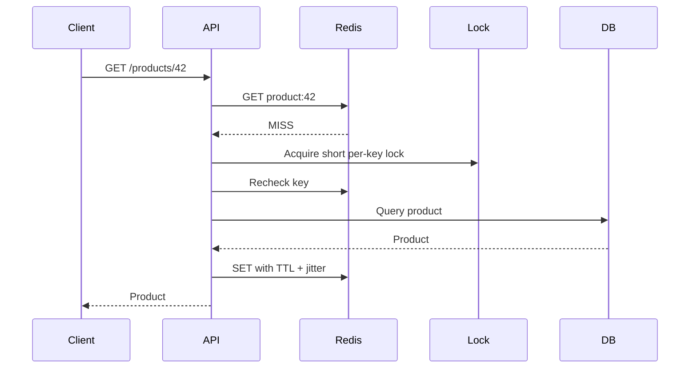
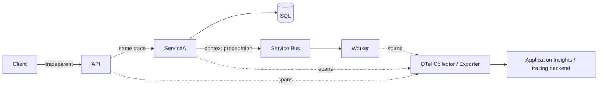
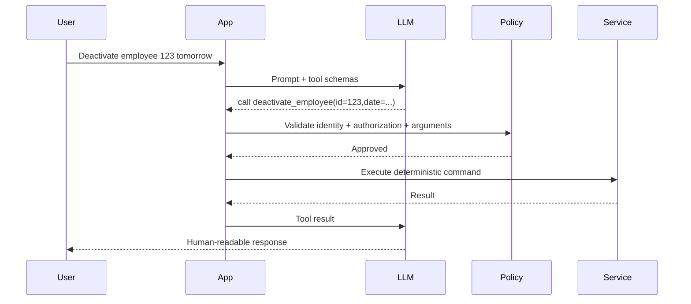
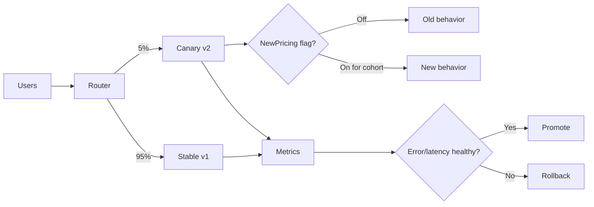

# Daily Knowledge Sharing — 17/08/2026

## Today’s Topics
1. Domain-Driven Design — Aggregate và invariant
2. Event-Driven Architecture — Outbox Pattern và at-least-once delivery
3. API Idempotency — chống xử lý trùng cho write request
4. EF Core Optimistic Concurrency — phát hiện lost update
5. Azure Service Bus — queue, topic và xử lý message an toàn
6. Managed Identity + Azure Key Vault — bỏ secret khỏi application
7. Redis Cache-Aside — cache stampede, TTL và degraded mode
8. OpenTelemetry Distributed Tracing — theo dấu request xuyên service
9. AI Tool Calling — LLM quyết định, code kiểm soát execution
10. Canary Deployment + Feature Flags — giảm blast radius khi release

---

# 1. Domain-Driven Design — Aggregate và invariant

### 1. What is it?

Trong DDD, **Aggregate** là một cụm object nghiệp vụ được xem như một consistency boundary. Mọi thay đổi từ bên ngoài đi qua **Aggregate Root**, thay vì sửa trực tiếp từng entity bên trong.

Ví dụ `Order` có `OrderItem`. Rule “đơn đã thanh toán không được thêm sản phẩm” là **invariant**: điều kiện phải luôn đúng sau mỗi transaction nghiệp vụ. DDD không phải chỉ tạo folder `Domain`; giá trị của nó nằm ở việc đưa business rule vào model và xác định boundary đúng.

### 2. Why does it exist?

Nếu service có thể sửa `OrderItem`, `PaymentStatus`, `TotalAmount` độc lập, dữ liệu có thể hợp lệ về schema nhưng sai nghiệp vụ. Một transaction khổng lồ bao phủ nhiều entity cũng làm tăng lock, coupling và contention.

Aggregate giải quyết hai câu hỏi: dữ liệu nào cần nhất quán ngay lập tức, và object nào có quyền bảo vệ rule đó?

### 3. How does it work?



Application load aggregate, gọi behavior của domain, aggregate kiểm tra invariant, sau đó repository persist toàn bộ thay đổi trong một transaction.

### 4. Practical example

```csharp
public sealed class Order
{
    private readonly List<OrderItem> _items = [];
    public OrderStatus Status { get; private set; }
    public IReadOnlyCollection<OrderItem> Items => _items;

    public void AddItem(Guid productId, int quantity, decimal price)
    {
        if (Status != OrderStatus.Draft)
            throw new DomainException("Only draft orders can be changed.");
        if (quantity <= 0)
            throw new DomainException("Quantity must be positive.");

        _items.Add(new OrderItem(productId, quantity, price));
    }
}
```

Controller không tự kiểm tra `Status` rồi insert `OrderItem`; rule nằm tại nơi sở hữu state.

### 5. Real production scenario

Trong hệ thống timesheet, `Timesheet` có các entry. Sau khi submit, employee không được sửa entry. API load `Timesheet`, gọi `UpdateEntry()`, domain từ chối nếu trạng thái là `Submitted`. Approval có thể là aggregate khác nếu không cần atomic consistency với từng entry.

### 6. Common mistakes

- Một aggregate chứa gần toàn bộ database vì muốn “transaction cho chắc”.
- Expose setter public khiến invariant bị bypass.
- Repository riêng cho mọi child entity của aggregate.
- Nhét validation kỹ thuật như email format và mọi integration vào domain.
- Dùng domain event để né việc xác định consistency boundary.

### 7. Trade-offs

**Advantages:** business rule tập trung, model khó rơi vào trạng thái invalid, transaction boundary rõ.

**Costs / Risks:** cần hiểu domain tốt; aggregate quá lớn gây contention, aggregate quá nhỏ đẩy nhiều rule sang eventual consistency. Rich domain model cũng tốn công hơn CRUD đơn giản.

### 8. Junior → Middle → Senior understanding

**Junior:** hiểu entity, aggregate root và invariant khác DTO như thế nào.

**Middle:** implement behavior, encapsulation, repository và transaction quanh aggregate.

**Senior / Technical Lead:** quyết định aggregate boundary dựa trên consistency, contention và business invariant; biết rule nào cần strong consistency và rule nào có thể eventual consistency.

### 9. Key takeaway

- Aggregate là consistency boundary, không phải nhóm table.
- Mọi mutation quan trọng nên đi qua Aggregate Root.
- Boundary càng lớn không đồng nghĩa càng an toàn.

---

# 2. Event-Driven Architecture — Outbox Pattern và at-least-once delivery

### 1. What is it?

Event-Driven Architecture cho phép một component publish sự kiện để component khác phản ứng bất đồng bộ. Vấn đề khó không phải “gửi message”, mà là đảm bảo thay đổi database và việc publish event không bị lệch nhau.

**Transactional Outbox** ghi business data và event cần publish vào cùng database transaction. Worker sau đó đọc outbox và gửi event tới broker.

### 2. Why does it exist?

Naive flow thường là `SaveChanges()` rồi `Publish()`. Nếu database commit thành công nhưng broker lỗi, order đã tạo nhưng downstream không bao giờ nhận `OrderCreated`. Nếu publish trước rồi DB rollback, consumer lại thấy một event về dữ liệu không tồn tại.

Distributed transaction thường đắt, khó vận hành hoặc không được broker/database hỗ trợ. Outbox đổi bài toán atomic cross-system thành atomic local transaction + reliable asynchronous delivery.

### 3. How does it work?



Broker thường cung cấp **at-least-once delivery**, nên consumer vẫn phải idempotent.

### 4. Practical example

```csharp
await using var tx = await db.Database.BeginTransactionAsync(ct);

db.Orders.Add(order);
db.OutboxMessages.Add(new OutboxMessage
{
    Id = Guid.NewGuid(),
    Type = "OrderCreated",
    Payload = JsonSerializer.Serialize(new { order.Id }),
    OccurredAtUtc = DateTime.UtcNow
});

await db.SaveChangesAsync(ct);
await tx.CommitAsync(ct);
```

Một `BackgroundService` hoặc job riêng publish các row chưa có `PublishedAtUtc`.

### 5. Real production scenario

Employee bị deactivate. Database cập nhật trạng thái và ghi `EmployeeDeactivated`. Worker publish event; notification service gửi mail, provisioning service thu hồi quyền, audit service ghi lịch sử. Nếu broker tạm down, outbox giữ event để retry sau.

### 6. Common mistakes

- Xóa outbox ngay sau HTTP publish mà chưa có broker acknowledgement phù hợp.
- Tin rằng consumer chỉ nhận message đúng một lần.
- Không có unique key theo `MessageId` ở consumer.
- Retry vô hạn poison message.
- Không monitor backlog/oldest outbox age.
- Payload event phụ thuộc trực tiếp entity EF Core.

### 7. Trade-offs

**Advantages:** tránh mất event sau DB commit, giảm coupling, chịu lỗi broker tốt.

**Costs / Risks:** eventual consistency, duplicate delivery, thêm worker/table/cleanup/monitoring. Latency cao hơn synchronous call.

### 8. Junior → Middle → Senior understanding

**Junior:** hiểu producer, broker, consumer và asynchronous flow.

**Middle:** implement outbox publisher, retry, idempotent consumer và dead-letter handling.

**Senior / Technical Lead:** thiết kế delivery semantics, event contract/versioning, ordering, retention, backpressure và recovery khi backlog lớn.

### 9. Key takeaway

- DB commit + broker publish không tự nhiên atomic.
- Outbox bảo vệ event khỏi bị mất, không loại bỏ duplicate.
- Consumer idempotency là phần bắt buộc của at-least-once delivery.

---

# 3. API Idempotency — chống xử lý trùng cho write request

### 1. What is it?

Một operation idempotent cho phép client gửi lại cùng logical request mà không tạo thêm side effect. Với `POST /payments`, client thường gửi `Idempotency-Key`; server lưu kết quả lần đầu và trả lại cùng kết quả khi key được retry.

### 2. Why does it exist?

Network timeout không cho client biết server “chưa xử lý” hay “đã xử lý nhưng response bị mất”. Nếu client retry mù, payment có thể bị charge hai lần, order tạo hai bản ghi hoặc email gửi nhiều lần.

### 3. How does it work?



Key phải gắn với request fingerprint để cùng key nhưng payload khác bị reject.

### 4. Practical example

```csharp
app.MapPost("/payments", async (
    PaymentRequest request,
    HttpRequest http,
    PaymentDbContext db,
    CancellationToken ct) =>
{
    var key = http.Headers["Idempotency-Key"].ToString();
    if (string.IsNullOrWhiteSpace(key)) return Results.BadRequest();

    var existing = await db.IdempotencyRecords.FindAsync([key], ct);
    if (existing is not null)
        return Results.Json(existing.ResponseBody, statusCode: existing.StatusCode);

    // Production code cần unique constraint + transaction để chống concurrent duplicates.
    var payment = await CreatePaymentAsync(request, ct);
    // Persist payment + idempotency record atomically where possible.
    return Results.Created($"/payments/{payment.Id}", payment);
});
```

### 5. Real production scenario

Mobile app gọi API submit timesheet qua mạng yếu. Request đã commit nhưng response timeout. App retry cùng key. Server trả lại timesheet đã tạo thay vì tạo bản thứ hai.

### 6. Common mistakes

- Chỉ check key rồi insert mà không có unique constraint: hai request concurrent vẫn lọt qua.
- Reuse cùng key với payload khác.
- Lưu key vĩnh viễn mà không có retention policy.
- Cho rằng HTTP `POST` không thể idempotent.
- Retry side effect bên thứ ba mà không truyền idempotency mechanism của provider.

### 7. Trade-offs

**Advantages:** retry an toàn, UX tốt hơn, giảm duplicate business records.

**Costs / Risks:** cần storage, locking/unique constraint, TTL và request fingerprint. Không phải mọi side effect external đều có thể rollback hoặc deduplicate.

### 8. Junior → Middle → Senior understanding

**Junior:** hiểu retry có thể tạo duplicate.

**Middle:** implement key store, unique index, response replay và TTL.

**Senior / Technical Lead:** xác định idempotency boundary xuyên database, queue và third-party API; thiết kế recovery cho request đang ở trạng thái `Processing`.

### 9. Key takeaway

- Timeout không đồng nghĩa operation thất bại.
- Idempotency cần được thiết kế ở business operation, không chỉ HTTP layer.
- Concurrent duplicate phải được chặn bằng atomic mechanism.

---

# 4. EF Core Optimistic Concurrency — phát hiện lost update

### 1. What is it?

Optimistic concurrency giả định conflict hiếm nên không lock row trong suốt thời gian user chỉnh sửa. Khi update, EF Core thêm concurrency token vào `WHERE`; nếu row đã đổi, số row affected bằng 0 và EF Core ném `DbUpdateConcurrencyException`.

### 2. Why does it exist?

Hai admin cùng mở employee record. A đổi department và save. B đang giữ dữ liệu cũ, đổi title rồi save toàn entity. Nếu không detect conflict, B có thể ghi đè department của A — **lost update**.

### 3. How does it work?

```text
Read:  Employee(Id=10, Title=Dev, Version=0x01)
A saves -> Version becomes 0x02
B sends Version=0x01
UPDATE ... WHERE Id=10 AND Version=0x01
Affected rows = 0 => concurrency conflict
```

### 4. Practical example

```csharp
public class Employee
{
    public int Id { get; set; }
    public string Title { get; set; } = "";

    [Timestamp]
    public byte[] RowVersion { get; set; } = [];
}

try
{
    await db.SaveChangesAsync(ct);
}
catch (DbUpdateConcurrencyException)
{
    return Results.Conflict(new
    {
        code = "employee_changed",
        message = "The employee was modified by another user."
    });
}
```

SQL Server `rowversion` rất phù hợp; PostgreSQL có thể dùng token/application-managed strategy tùy thiết kế.

### 5. Real production scenario

Trong portal quản lý employee, frontend gửi `RowVersion` cùng update request. Nếu record đã đổi, API trả `409 Conflict`; UI reload dữ liệu mới hoặc cho user merge thay đổi thay vì silently overwrite.

### 6. Common mistakes

- Catch exception rồi retry `SaveChanges` với state cũ, vô tình ghi đè người khác.
- Không gửi concurrency token qua DTO.
- Dùng optimistic concurrency nhưng UI không có conflict UX.
- Mark quá nhiều field là concurrency token làm conflict giả tăng mạnh.
- Nhầm optimistic concurrency với transaction isolation.

### 7. Trade-offs

**Advantages:** không giữ long lock, scale tốt khi conflict hiếm, phát hiện lost update rõ ràng.

**Costs / Risks:** conflict phải resolve ở application; với hot row có contention cao, retry/merge có thể phức tạp.

### 8. Junior → Middle → Senior understanding

**Junior:** hiểu hai update đồng thời có thể ghi đè nhau.

**Middle:** cấu hình token, xử lý `DbUpdateConcurrencyException`, trả HTTP 409.

**Senior / Technical Lead:** chọn optimistic hay pessimistic theo contention và business cost; thiết kế merge/retry semantics và telemetry cho conflict rate.

### 9. Key takeaway

- Optimistic concurrency phát hiện conflict, không tự giải quyết conflict.
- `rowversion` là concurrency token, không phải business timestamp.
- Retry mù có thể phá mục tiêu chống lost update.

---

# 5. Azure Service Bus — queue, topic và xử lý message an toàn

### 1. What is it?

Azure Service Bus là managed message broker cho enterprise messaging. **Queue** phù hợp competing consumers; **Topic + Subscription** phù hợp publish/subscribe khi nhiều consumer độc lập cần cùng event.

### 2. Why does it exist?

Synchronous API chain khiến latency cộng dồn và failure lan truyền. Nếu API tạo employee phải đợi email, provisioning, audit và reporting cùng thành công, một dependency chậm có thể làm cả request fail.

Service Bus tách producer khỏi consumer về thời gian và availability.

### 3. How does it work?



Consumer thường nhận message theo Peek-Lock: xử lý thành công thì complete; lỗi transient thì abandon/retry; lỗi không recover được thì dead-letter.

### 4. Practical example

```csharp
var processor = client.CreateProcessor("employee-events", "provisioning");

processor.ProcessMessageAsync += async args =>
{
    var evt = args.Message.Body.ToObjectFromJson<EmployeeDeactivated>();
    await provisioning.RevokeAccessAsync(evt.EmployeeId, args.CancellationToken);
    await args.CompleteMessageAsync(args.Message);
};

processor.ProcessErrorAsync += args =>
{
    logger.LogError(args.Exception, "Service Bus processing failed");
    return Task.CompletedTask;
};
```

### 5. Real production scenario

Khi employee offboard, API commit trạng thái trước. Event được publish. Worker Exchange Online có thể mất vài phút hoặc retry mà không giữ HTTP request của admin. Poison message đi DLQ để vận hành điều tra.

### 6. Common mistakes

- Complete message trước khi side effect hoàn tất.
- Không idempotent consumer.
- Retry lỗi validation/permanent đến `MaxDeliveryCount` mà không phân loại.
- Không monitor DLQ và message age.
- Giả định global ordering khi scale nhiều consumer.
- Đặt payload quá lớn thay vì lưu blob và gửi reference.

### 7. Trade-offs

**Advantages:** decoupling, buffering, retry, DLQ, scale consumer độc lập.

**Costs / Risks:** eventual consistency, duplicate, ordering complexity, thêm chi phí và operational surface. Với simple low-volume job, database-backed background worker có thể đơn giản hơn.

### 8. Junior → Middle → Senior understanding

**Junior:** phân biệt queue và topic.

**Middle:** implement processor, lock handling, retry, DLQ, idempotency.

**Senior / Technical Lead:** chọn partition/session/order strategy, capacity, backpressure, disaster recovery và event contract ownership.

### 9. Key takeaway

- Broker giảm temporal coupling nhưng tăng consistency complexity.
- DLQ phải có quy trình xử lý, không phải “thùng rác”.
- Message handler phải giả định duplicate có thể xảy ra.

---

# 6. Managed Identity + Azure Key Vault — bỏ secret khỏi application

### 1. What is it?

Managed Identity cấp identity cho Azure resource như App Service, Function hoặc Container Apps. Resource dùng identity đó để lấy token từ Microsoft Entra ID và truy cập Key Vault hay Azure resource khác mà không cần lưu client secret trong config.

### 2. Why does it exist?

Secret trong `appsettings.json`, environment variable hoặc CI/CD vẫn phải được tạo, phân phối, rotate và tránh leak. Secret hết hạn có thể gây outage; secret bị copy sang máy developer làm tăng blast radius.

### 3. How does it work?



Identity được cấp quyền tối thiểu bằng Azure RBAC. Nếu dùng Private Endpoint, network path tới vault cũng có thể bị giới hạn trong VNet.

### 4. Practical example

```csharp
var credential = new Azure.Identity.DefaultAzureCredential();
var client = new Azure.Security.KeyVault.Secrets.SecretClient(
    new Uri(configuration["KeyVaultUri"]!), credential);

var secret = await client.GetSecretAsync("ThirdPartyApiKey");
```

Local development có thể dùng Azure CLI/Visual Studio credential; production tự chuyển sang Managed Identity mà code không cần chứa password.

### 5. Real production scenario

ASP.NET Core App Service cần access Azure Blob và một API key của vendor. Blob dùng Managed Identity trực tiếp, không cần storage key. Vendor key — vì vendor không hỗ trợ Entra — được giữ trong Key Vault và app chỉ có quyền đọc đúng secret cần thiết.

### 6. Common mistakes

- Cấp `Owner`/`Contributor` thay vì data-plane role tối thiểu.
- Cho rằng Key Vault loại bỏ mọi secret; third-party key vẫn tồn tại và cần rotate.
- Fetch secret từ Key Vault trên từng request gây latency/throttling.
- Không phân biệt system-assigned và user-assigned identity lifecycle.
- Firewall/Private Endpoint sai khiến auth đúng nhưng network vẫn fail.

### 7. Trade-offs

**Advantages:** giảm secret distribution, rotation dễ hơn, audit access tốt, identity lifecycle do Azure quản lý.

**Costs / Risks:** phụ thuộc Entra/Key Vault/network; RBAC và private networking tăng setup complexity. Secret caching cần cân bằng latency với rotation freshness.

### 8. Junior → Middle → Senior understanding

**Junior:** hiểu app không nên hard-code credential.

**Middle:** cấu hình identity, RBAC, `DefaultAzureCredential`, Key Vault integration và troubleshoot 401/403/network.

**Senior / Technical Lead:** thiết kế least privilege, identity boundary theo workload, rotation, private networking, break-glass và dependency failure strategy.

### 9. Key takeaway

- Ưu tiên identity-based access hơn long-lived secret.
- Authentication đúng chưa đủ; RBAC và network đều phải đúng.
- Key Vault là secret store, không phải lý do để đọc secret mỗi request.

---

# 7. Redis Cache-Aside — cache stampede, TTL và degraded mode

### 1. What is it?

Cache-Aside để application tự quản lý cache: đọc cache trước; miss thì đọc database và populate cache. Đây là pattern đơn giản nhưng production cần xử lý invalidation, stampede và Redis outage.

### 2. Why does it exist?

Các query đọc nhiều như product catalog hoặc employee profile có thể tạo tải database không cần thiết. Nhưng cache ngây thơ lại tạo stale data; khi một hot key hết TTL, hàng trăm request cùng query DB gây **cache stampede**.

### 3. How does it work?



TTL jitter làm các key không expire cùng lúc. Với hot key, single-flight/distributed lock có thể giảm stampede.

### 4. Practical example

```csharp
public async Task<ProductDto?> GetAsync(int id, CancellationToken ct)
{
    var key = $"product:{id}:v1";
    try
    {
        var cached = await cache.GetStringAsync(key, ct);
        if (cached is not null)
            return JsonSerializer.Deserialize<ProductDto>(cached);
    }
    catch (RedisConnectionException ex)
    {
        logger.LogWarning(ex, "Redis unavailable; falling back to DB");
    }

    var product = await db.Products.AsNoTracking()
        .Where(x => x.Id == id)
        .Select(x => new ProductDto(x.Id, x.Name, x.Price))
        .SingleOrDefaultAsync(ct);

    return product;
}
```

Production code có thể populate cache best-effort và thêm TTL jitter.

### 5. Real production scenario

SaaS dashboard đọc configuration hàng nghìn lần/phút nhưng config chỉ đổi vài lần/ngày. Redis giảm DB load. Khi config thay đổi, write path xóa/version key. Nếu Redis down, hệ thống vẫn đọc DB nhưng rate/load protection phải đủ để DB không bị đánh sập.

### 6. Common mistakes

- Cache dữ liệu permission nhạy cảm quá lâu.
- TTL của hàng nghìn key giống nhau.
- Redis down thì API fail dù DB vẫn khỏe.
- Không có size/serialization strategy.
- `KEYS *` trong production.
- Xóa cache trước DB commit rồi transaction rollback.

### 7. Trade-offs

**Advantages:** giảm latency và DB load, scale read tốt.

**Costs / Risks:** stale data, stampede, memory cost, thêm dependency. Strong consistency thường không phù hợp với cache-aside thông thường.

### 8. Junior → Middle → Senior understanding

**Junior:** hiểu hit, miss và TTL.

**Middle:** implement invalidation, serialization, fallback, metrics và TTL jitter.

**Senior / Technical Lead:** quyết định dữ liệu nào được phép stale, failure mode khi Redis mất, capacity, eviction policy và chống thundering herd.

### 9. Key takeaway

- Cache là bản sao dữ liệu có thể stale.
- Redis outage không nên mặc định biến thành application outage.
- Stampede chỉ xuất hiện rõ khi traffic lớn; phải thiết kế trước cho hot keys.

---

# 8. OpenTelemetry Distributed Tracing — theo dấu request xuyên service

### 1. What is it?

Distributed tracing biểu diễn một request thành **trace** gồm nhiều **span**. Mỗi span mô tả một operation: HTTP request, SQL query, Redis call, Service Bus processing... OpenTelemetry cung cấp chuẩn instrumentation/export vendor-neutral.

### 2. Why does it exist?

Log riêng từng service trả lời “service này đã log gì”, nhưng khó trả lời “request của user đi qua đâu và 1.8 giây mất ở bước nào”. Trong distributed system, correlation thủ công bằng text log nhanh chóng trở nên khó bảo trì.

### 3. How does it work?



Trace context được propagate qua HTTP headers hoặc message properties.

### 4. Practical example

```csharp
builder.Services.AddOpenTelemetry()
    .WithTracing(tracing => tracing
        .AddAspNetCoreInstrumentation()
        .AddHttpClientInstrumentation()
        .AddEntityFrameworkCoreInstrumentation()
        .AddSource("Timesheet.Application")
        .AddAzureMonitorTraceExporter());

private static readonly ActivitySource Source = new("Timesheet.Application");

using var activity = Source.StartActivity("ApproveTimesheet");
activity?.SetTag("timesheet.id", timesheetId);
```

Không gắn PII hoặc high-cardinality dữ liệu tùy tiện vào tag.

### 5. Real production scenario

User báo approve timesheet mất 6 giây. Trace cho thấy API 80 ms, SQL 120 ms nhưng Microsoft Graph call mất 5.6 giây. Team tối ưu đúng integration thay vì đoán database chậm.

### 6. Common mistakes

- Log/trace chứa access token, email hoặc PII không cần thiết.
- Sampling quá thấp khiến incident hiếm biến mất; quá cao gây chi phí lớn.
- Không propagate context qua queue.
- Tạo span cho mọi method nhỏ gây noise.
- Chỉ có trace nhưng không liên kết logs/metrics.

### 7. Trade-offs

**Advantages:** thấy end-to-end latency và dependency chain, giảm thời gian điều tra incident.

**Costs / Risks:** telemetry volume/cost, sampling complexity, instrumentation overhead và privacy concerns.

### 8. Junior → Middle → Senior understanding

**Junior:** hiểu trace, span, trace ID.

**Middle:** instrument HTTP/DB/custom activity, propagate context và dùng trace để debug.

**Senior / Technical Lead:** thiết kế sampling, cardinality, retention, correlation logs-metrics-traces và observability cost budget.

### 9. Key takeaway

- Trace trả lời “thời gian bị mất ở đâu trong toàn request”.
- Context propagation quan trọng hơn việc tạo thật nhiều span.
- Observability tốt phải kết hợp logs, metrics và traces.

---

# 9. AI Tool Calling — LLM quyết định, code kiểm soát execution

### 1. What is it?

Tool Calling cho phép LLM chọn một function/tool có schema rõ ràng và tạo arguments; application mới là thành phần thực sự validate, authorize và execute tool. Model không nên trực tiếp sở hữu database credential hay quyền thực thi không giới hạn.

### 2. Why does it exist?

LLM giỏi hiểu ngôn ngữ tự nhiên nhưng output không deterministic. Nếu yêu cầu “deactivate employee Hà vào cuối tháng”, model có thể hiểu intent tốt, nhưng transaction, permission, date validation và side effect phải do deterministic code kiểm soát.

### 3. How does it work?



High-risk action có thể thêm human approval trước execution.

### 4. Practical example

```csharp
public sealed record DeactivateEmployeeArgs(Guid EmployeeId, DateOnly EffectiveDate);

public async Task<ToolResult> ExecuteAsync(
    DeactivateEmployeeArgs args,
    ClaimsPrincipal user,
    CancellationToken ct)
{
    if (!user.IsInRole("HRAdmin"))
        return ToolResult.Forbidden();

    if (args.EffectiveDate < DateOnly.FromDateTime(DateTime.UtcNow))
        return ToolResult.Invalid("EffectiveDate cannot be in the past.");

    await employeeService.ScheduleDeactivationAsync(
        args.EmployeeId, args.EffectiveDate, ct);

    return ToolResult.Success();
}
```

Schema giúp model tạo arguments; validation C# mới là source of truth.

### 5. Real production scenario

AI assistant nội bộ đọc yêu cầu HR và có tools `find_employee`, `schedule_deactivation`, `get_offboarding_status`. Read tool có thể chạy tự động; destructive write cần confirmation. Audit log lưu user, tool, validated args và result — không chỉ lưu text do model tạo.

### 6. Common mistakes

- Tin arguments của model như trusted input.
- Để model tự quyết authorization.
- Tool quá mạnh kiểu `execute_sql` hoặc `run_shell` không sandbox.
- Retry tool có side effect mà không idempotency.
- Đưa secret/tool output nhạy cảm trở lại context không cần thiết.
- Không giới hạn số vòng tool call và chi phí.

### 7. Trade-offs

**Advantages:** kết hợp natural-language reasoning với deterministic systems, dễ mở rộng capability.

**Costs / Risks:** prompt injection, incorrect tool selection, latency/token cost, permission complexity. Cần policy layer và observability riêng cho agent execution.

### 8. Junior → Middle → Senior understanding

**Junior:** hiểu model đề xuất tool call chứ không phải function tự chạy trong model.

**Middle:** implement schema, validation, timeout, retries, idempotency và error mapping.

**Senior / Technical Lead:** thiết kế permission boundary, approval policy, sandbox, auditability, stop conditions, evaluation và blast-radius control.

### 9. Key takeaway

- LLM có thể chọn **what to try**; deterministic code quyết định **what is allowed**.
- Tool arguments luôn là untrusted input.
- Side-effect tool cần authorization, idempotency, audit và giới hạn execution.

---

# 10. Canary Deployment + Feature Flags — giảm blast radius khi release

### 1. What is it?

Canary deployment đưa version mới tới một phần nhỏ traffic trước khi mở rộng. Feature flag tách việc **deploy code** khỏi **enable behavior**, cho phép bật tính năng theo user, tenant, percentage hoặc environment.

Hai kỹ thuật kết hợp giúp giảm blast radius nhưng giải quyết hai lớp khác nhau: canary kiểm soát version/runtime traffic; feature flag kiểm soát behavior trong application.

### 2. Why does it exist?

Test staging không mô phỏng hoàn toàn production traffic, data và dependency behavior. Big-bang release 100% khiến regression ảnh hưởng toàn bộ user ngay lập tức. Rollback binary cũng không phải lúc nào đủ, nhất là khi database migration đã thay đổi schema.

### 3. How does it work?



Promotion nên dựa trên metric gate, không chỉ “đợi 10 phút thấy có vẻ ổn”.

### 4. Practical example

```csharp
if (await featureManager.IsEnabledAsync("NewTimesheetApproval"))
{
    return await newApprovalFlow.ExecuteAsync(command, ct);
}

return await legacyApprovalFlow.ExecuteAsync(command, ct);
```

Pipeline có thể route 5% traffic sang revision mới, theo dõi 5xx, p95 latency và business error rate rồi tăng 25% → 50% → 100%.

### 5. Real production scenario

Team thay approval engine của timesheet. Code mới được deploy nhưng flag chỉ bật cho internal tenant. Sau khi business validation ổn, canary version nhận 5% production traffic. Nếu p95 latency tăng hoặc approval failure vượt threshold, rollout dừng mà không ảnh hưởng toàn bộ khách hàng.

### 6. Common mistakes

- Feature flag tồn tại vĩnh viễn tạo hai code path khó test.
- Chỉ monitor CPU mà không monitor business KPI/error.
- Database migration destructive khiến rollback application không còn an toàn.
- Canary cohort quá nhỏ để phát hiện lỗi nhưng rollout quá nhanh.
- Không test cả flag ON và OFF.
- Dùng flag như authorization/security boundary.

### 7. Trade-offs

**Advantages:** giảm blast radius, rollback/disable nhanh, progressive validation bằng production signal.

**Costs / Risks:** pipeline/router/flag complexity, telemetry requirement, code path explosion và cleanup debt. Dual compatibility database migration có thể tốn thêm công.

### 8. Junior → Middle → Senior understanding

**Junior:** hiểu deploy khác release và flag có thể bật/tắt behavior.

**Middle:** implement flag, test hai nhánh, dashboard và rollback procedure.

**Senior / Technical Lead:** thiết kế rollout stages, automated health gates, backward-compatible migration, cohort strategy, kill switch và flag lifecycle governance.

### 9. Key takeaway

- Canary giảm phạm vi ảnh hưởng của version mới; feature flag giảm phạm vi ảnh hưởng của behavior mới.
- Progressive delivery chỉ an toàn khi có metric và stop condition rõ.
- Mọi temporary flag cần owner và ngày cleanup.