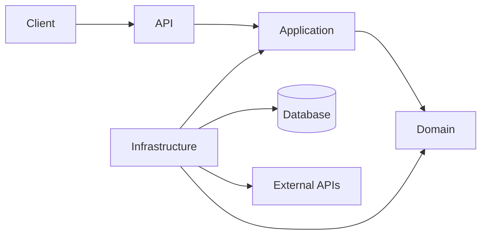
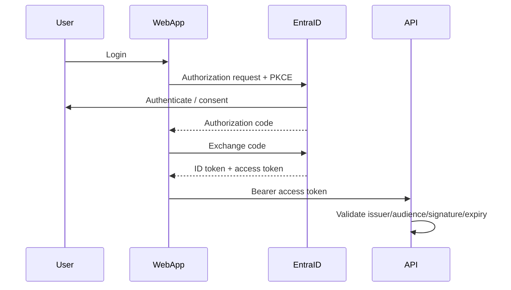
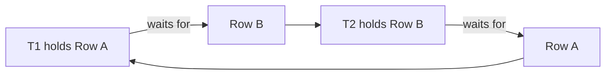
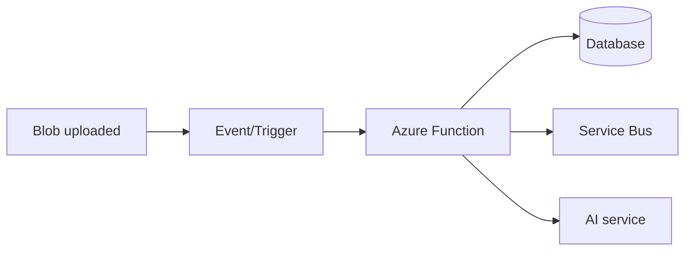
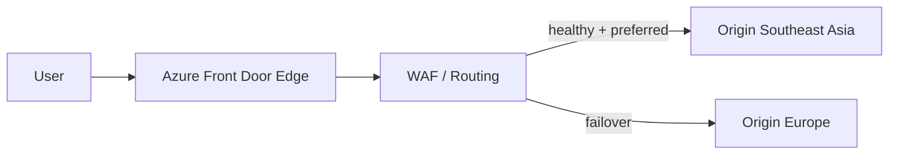
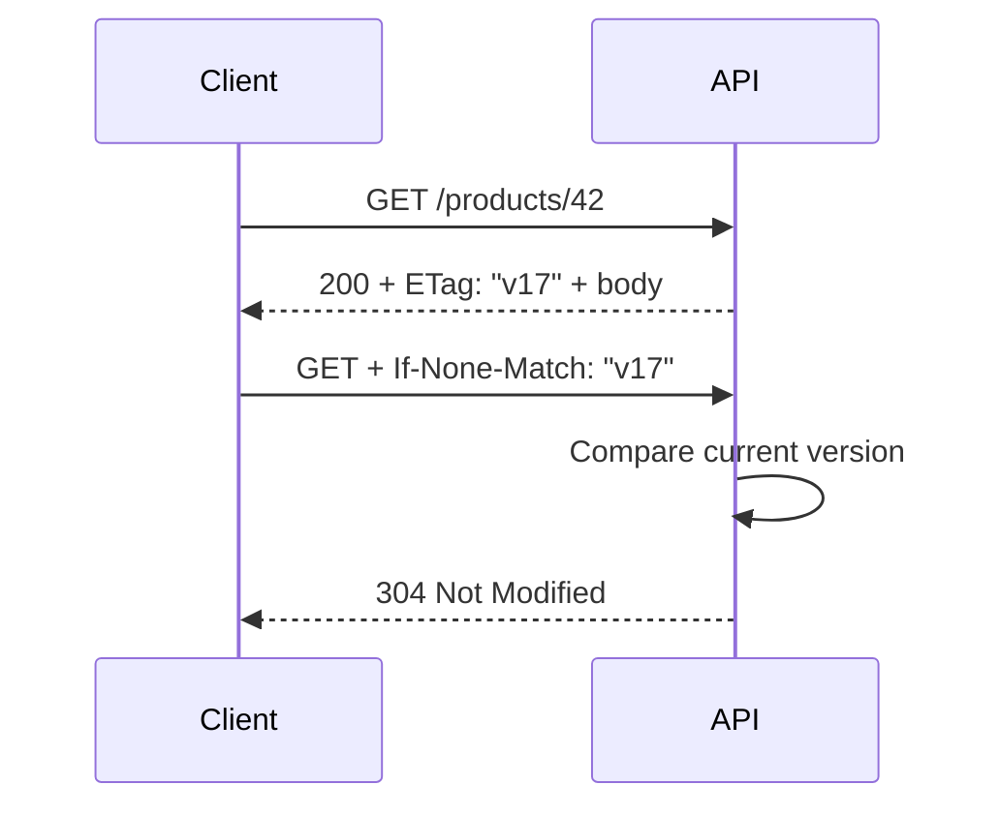
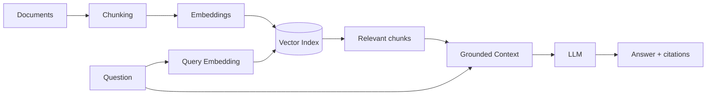
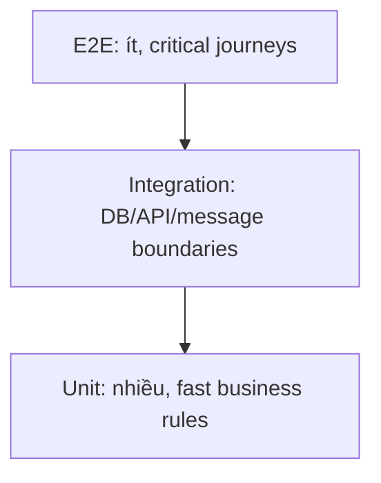

# Daily Knowledge Sharing — 17/08/2026

## Today’s Topics
1. Clean Architecture — dependency direction và boundary thực sự
2. OAuth 2.0 + OpenID Connect — authorization khác authentication thế nào
3. Database Isolation Levels — consistency, locking và throughput
4. SQL Deadlocks — cách hình thành, điều tra và phòng tránh
5. Azure Functions — event-driven compute và lựa chọn hosting phù hợp
6. Azure Front Door — global routing, edge security và failover
7. HTTP Caching — ETag, Cache-Control và conditional requests
8. SLI, SLO, SLA — biến reliability thành con số có thể vận hành
9. RAG — retrieval, grounding và kiểm soát chất lượng câu trả lời AI
10. Testing Strategy — test pyramid, integration test và production confidence

---

# 1. Clean Architecture — dependency direction và boundary thực sự

### 1. What is it?

Clean Architecture là cách tổ chức dependency để **business rule không phụ thuộc vào framework, database, UI hay vendor**. Điểm quan trọng không phải số project hay tên folder, mà là hướng dependency.

Domain chứa business rule cốt lõi. Application điều phối use case. Infrastructure triển khai các capability bên ngoài như EF Core, Redis, email hoặc Microsoft Graph. API chỉ là delivery mechanism.

### 2. Why does it exist?

Một hệ thống ASP.NET Core dễ bắt đầu bằng `Controller -> DbContext`. Khi nhỏ, cách này rất nhanh. Nhưng khi business rule tăng, controller bắt đầu chứa validation, transaction, query, mapping, email và external API. Business logic dần bị khóa vào EF Core và HTTP.

Clean Architecture tạo boundary để thay đổi technology ở bên ngoài ít ảnh hưởng đến rule ở bên trong.

### 3. How does it work?



Điểm thường bị hiểu sai là Application không gọi Infrastructure bằng dependency trực tiếp. Application định nghĩa abstraction cần thiết; Infrastructure implement abstraction đó và DI container nối chúng tại composition root.

```text
Domain         <- không biết EF Core, ASP.NET Core
Application    -> Domain
Infrastructure -> Application + Domain
API            -> Application, đăng ký Infrastructure tại startup
```

### 4. Practical example

```csharp
// Application
public interface IEmployeeDirectory
{
    Task<EmployeeProfile?> GetAsync(Guid id, CancellationToken ct);
}

public sealed class GetEmployeeHandler(IEmployeeDirectory directory)
{
    public Task<EmployeeProfile?> Handle(Guid id, CancellationToken ct)
        => directory.GetAsync(id, ct);
}

// Infrastructure
public sealed class GraphEmployeeDirectory(GraphServiceClient graph)
    : IEmployeeDirectory
{
    public async Task<EmployeeProfile?> GetAsync(Guid id, CancellationToken ct)
    {
        // Microsoft Graph-specific implementation lives here.
        return await LoadFromGraphAsync(graph, id, ct);
    }
}
```

Application biết nó cần employee directory nhưng không cần biết Microsoft Graph SDK được gọi thế nào.

### 5. Real production scenario

Một employee-management system lấy profile từ Microsoft 365, lưu timesheet trong SQL Server và gửi notification. Use case `DeactivateEmployee` có thể nằm ở Application/Domain; Graph, Exchange Online, SQL và notification adapters nằm ngoài boundary. Khi Graph SDK nâng version, phần bị ảnh hưởng chủ yếu là Infrastructure.

### 6. Common mistakes

- Biến Clean Architecture thành hàng chục project dù domain rất đơn giản.
- Tạo interface cho mọi class chỉ để “đúng architecture”.
- Cho Domain reference EF Core attributes hoặc HTTP DTO.
- Repository generic che mất khả năng query mạnh của EF Core mà không đem lại business abstraction nào.
- Đẩy toàn bộ business rule vào handler khiến Domain chỉ còn entity chứa property.

### 7. Trade-offs

**Advantages:** dependency rõ, business rule test dễ, giảm vendor coupling, phù hợp domain phức tạp.

**Costs / Risks:** nhiều abstraction và mapping hơn; với CRUD nhỏ có thể tạo ceremony không cần thiết. Boundary quá cứng còn khiến developer phải đi qua nhiều layer để sửa một thay đổi đơn giản.

### 8. Junior → Middle → Senior understanding

**Junior:** hiểu trách nhiệm của Domain, Application, Infrastructure và API.

**Middle:** implement use case, DI, transaction boundary và adapter mà không làm rò framework dependency vào core.

**Senior / Technical Lead:** quyết định boundary nào thực sự tạo giá trị, nơi nào nên pragmatic; đánh giá coupling, testability, team ownership và chi phí thay đổi thay vì áp architecture theo template.

### 9. Key takeaway

- Clean Architecture là **dependency rule**, không phải folder convention.
- Business rule nên sống độc lập với infrastructure càng nhiều càng tốt.
- Chỉ thêm abstraction khi nó bảo vệ một boundary có giá trị.

---

# 2. OAuth 2.0 + OpenID Connect — authorization khác authentication thế nào

### 1. What is it?

OAuth 2.0 là framework để một client nhận quyền truy cập resource thay mặt user hoặc chính application. OpenID Connect (OIDC) xây trên OAuth 2.0 để thêm **authentication** và identity information.

Nói ngắn gọn: OAuth trả lời “client được phép truy cập resource nào?”, còn OIDC giúp trả lời “user là ai?”.

### 2. Why does it exist?

Nếu application yêu cầu password Microsoft của user rồi tự đăng nhập hộ, application phải giữ credential cực kỳ nhạy cảm. OAuth cho phép user cấp quyền thông qua identity provider mà client không cần biết password.

OIDC bổ sung chuẩn identity để application không phải tự phát minh cơ chế login trên OAuth.

### 3. How does it work?



`ID token` dành cho client hiểu identity của user. `Access token` dành cho resource server/API. Không nên gửi ID token thay access token để gọi API.

### 4. Practical example

```csharp
builder.Services
    .AddAuthentication("Bearer")
    .AddJwtBearer("Bearer", options =>
    {
        options.Authority = "https://login.microsoftonline.com/<tenant-id>/v2.0";
        options.Audience = "api://employee-api";
    });

builder.Services.AddAuthorization(options =>
{
    options.AddPolicy("Timesheet.Write", policy =>
        policy.RequireClaim("scp", "Timesheet.Write"));
});
```

API không chỉ kiểm tra token hợp lệ mà còn kiểm tra scope/claim phù hợp với operation.

### 5. Real production scenario

Portal đăng nhập bằng Microsoft Entra ID. User gọi Employee API bằng delegated access token. Backend cần gọi Microsoft Graph thay user thì sử dụng delegated flow thích hợp; background service không có user context nên dùng service-to-service credential/Managed Identity hoặc application identity phù hợp.

### 6. Common mistakes

- Dùng ID token để authorize API.
- Chỉ decode JWT mà không validate signature, issuer, audience và expiry.
- Xem authentication là đủ rồi bỏ authorization.
- Lưu access/refresh token không mã hóa hoặc log token.
- Xin scope/application permission rộng hơn nhu cầu.
- Retry request với token hết hạn mà không có refresh/reacquire strategy.

### 7. Trade-offs

**Advantages:** centralized identity, SSO, delegated permissions, giảm quản lý password.

**Costs / Risks:** flow phức tạp hơn; token lifecycle, consent, tenant configuration và permission model dễ cấu hình sai. Identity provider outage cũng trở thành dependency quan trọng.

### 8. Junior → Middle → Senior understanding

**Junior:** phân biệt authentication và authorization; biết access token khác ID token.

**Middle:** cấu hình JWT validation, claims/policies, scopes, token acquisition và xử lý 401/403 đúng nghĩa.

**Senior / Technical Lead:** chọn delegated hay application permission, thiết kế least privilege, token boundary, multi-tenant model, secretless authentication và threat model.

### 9. Key takeaway

- OAuth 2.0 chủ yếu là authorization; OIDC bổ sung authentication.
- Access token dành cho API, ID token dành cho client identity.
- Token hợp lệ không có nghĩa user được phép thực hiện mọi action.

---

# 3. Database Isolation Levels — consistency, locking và throughput

### 1. What is it?

Isolation level quy định transaction nhìn thấy thay đổi từ transaction khác ở mức nào. Nó cân bằng giữa consistency và concurrency.

Các mức phổ biến gồm Read Uncommitted, Read Committed, Repeatable Read, Snapshot và Serializable. SQL Server thường dùng Read Committed mặc định; PostgreSQL cũng mặc định Read Committed nhưng implementation dựa nhiều vào MVCC.

### 2. Why does it exist?

Nếu mọi transaction luôn khóa toàn bộ dữ liệu cho tới khi hoàn thành, consistency cao nhưng throughput rất thấp. Nếu transaction đọc bất kỳ thay đổi chưa commit nào, throughput cao hơn nhưng có thể đọc dữ liệu sau đó bị rollback.

Isolation level cho phép chọn mức bảo vệ phù hợp với business invariant.

### 3. How does it work?

```text
T1: BEGIN -> read balance=100 -> ... -> update -> COMMIT
T2:          read/update cùng row
             ^ hành vi phụ thuộc isolation + engine
```

Các anomaly cần biết gồm dirty read, non-repeatable read và phantom read. Snapshot/MVCC có thể giảm reader-writer blocking bằng row versions nhưng không tự giải quyết mọi write conflict.

### 4. Practical example

```csharp
await using var tx = await db.Database.BeginTransactionAsync(
    System.Data.IsolationLevel.Serializable, ct);

var reserved = await db.Seats
    .CountAsync(x => x.EventId == eventId && x.IsReserved, ct);

if (reserved >= capacity)
    throw new InvalidOperationException("Event is full");

seat.IsReserved = true;
await db.SaveChangesAsync(ct);
await tx.CommitAsync(ct);
```

Serializable có thể phù hợp khi rule dựa trên range/predicate phải không đổi trong transaction, nhưng contention có thể tăng mạnh.

### 5. Real production scenario

Trong hệ thống booking, hai request cùng kiểm tra “còn một chỗ” rồi cùng reserve. Nếu transaction boundary/isolation không bảo vệ invariant, hệ thống overbook. Một giải pháp khác có thể là unique constraint, atomic update hoặc optimistic concurrency thay vì tăng isolation toàn hệ thống.

### 6. Common mistakes

- Tăng tất cả transaction lên Serializable để “an toàn”.
- Giữ transaction mở trong lúc gọi HTTP external API.
- Nghĩ rằng transaction tự động ngăn mọi race condition.
- Không hiểu khác biệt implementation giữa SQL Server và PostgreSQL.
- Bỏ qua retry khi snapshot/serialization conflict xảy ra.

### 7. Trade-offs

**Advantages:** isolation cao giúp reasoning về consistency dễ hơn.

**Costs / Risks:** lock/blocking hoặc serialization failures tăng; transaction dài làm giảm throughput. MVCC giảm blocking nhưng tốn version storage và vẫn có conflict.

### 8. Junior → Middle → Senior understanding

**Junior:** hiểu transaction không chỉ là commit/rollback mà còn có isolation.

**Middle:** nhận diện anomaly, chọn isolation cho use case và đọc lock/blocking diagnostics.

**Senior / Technical Lead:** ưu tiên database constraints/atomic operations khi có thể; đánh giá contention, workload, engine semantics và business consistency requirement trước khi chọn isolation.

### 9. Key takeaway

- Isolation là trade-off, không phải “càng cao càng tốt”.
- Transaction càng ngắn càng giảm contention.
- Bảo vệ invariant bằng constraint/atomic operation thường mạnh hơn chỉ dựa vào application check.

---

# 4. SQL Deadlocks — cách hình thành, điều tra và phòng tránh

### 1. What is it?

Deadlock xảy ra khi hai hoặc nhiều transaction giữ resource mà transaction khác cần, đồng thời mỗi bên chờ resource đang bị bên kia giữ. Không transaction nào tự tiến tiếp được, nên database chọn một victim để rollback.

### 2. Why does it exist?

Lock cần thiết để bảo vệ consistency. Khi nhiều transaction lấy lock theo thứ tự khác nhau, circular wait có thể xuất hiện. Vì vậy deadlock không đồng nghĩa database “bị lỗi”; nó là failure mode tự nhiên của concurrent transactional workload.

### 3. How does it work?



Database deadlock detector phát hiện cycle và rollback một transaction để phá vòng chờ.

### 4. Practical example

Transaction A:

```sql
UPDATE Accounts SET Balance = Balance - 100 WHERE Id = 1;
UPDATE Accounts SET Balance = Balance + 100 WHERE Id = 2;
```

Transaction B chạy ngược thứ tự `Id = 2` rồi `Id = 1`. Cách đơn giản để giảm deadlock là luôn lock/update account theo cùng một thứ tự.

```csharp
var orderedIds = new[] { fromId, toId }.OrderBy(x => x).ToArray();
```

Sau đó load/update theo ordering nhất quán.

### 5. Real production scenario

Payment service chuyển tiền giữa account. Traffic tăng khiến deadlock chỉ xuất hiện production. Team cần lấy deadlock graph/extended events, xác định statement, lock mode và resource; không nên chỉ tăng timeout rồi coi như đã sửa.

### 6. Common mistakes

- Nhầm deadlock với blocking dài.
- Retry vô hạn mà không sửa root cause.
- Transaction chứa network call khiến lock giữ lâu.
- Update cùng tập row theo thứ tự không nhất quán.
- Thiếu index khiến query lock nhiều row/page hơn cần thiết.
- Log exception nhưng không giữ đủ context để correlate transaction.

### 7. Trade-offs

**Advantages của retry có kiểm soát:** deadlock victim thường có thể chạy lại thành công.

**Costs / Risks:** retry chỉ là resilience layer; nếu contention cấu trúc không được sửa, retry storm làm tải nặng hơn. Index thêm có thể giảm lock footprint nhưng tăng write/storage cost.

### 8. Junior → Middle → Senior understanding

**Junior:** biết deadlock là circular wait và một transaction sẽ bị rollback.

**Middle:** đọc deadlock graph, tìm query/index/order gây vấn đề và thêm bounded retry với jitter khi operation an toàn.

**Senior / Technical Lead:** thiết kế transaction ordering, partition hot data, giảm lock scope, chọn isolation phù hợp và theo dõi deadlock rate như production signal.

### 9. Key takeaway

- Deadlock khác blocking.
- Giữ transaction ngắn và truy cập resource theo thứ tự nhất quán.
- Retry là safety net, không thay thế root-cause fix.

---

# 5. Azure Functions — event-driven compute và lựa chọn hosting phù hợp

### 1. What is it?

Azure Functions là compute platform hướng event: code chạy khi có HTTP request, timer, queue/message, blob event hoặc trigger khác. Developer tập trung vào function và trigger/binding thay vì tự quản lý web server.

### 2. Why does it exist?

Nhiều workload chỉ chạy khi có event hoặc theo lịch. Giữ một application server luôn hoạt động chỉ để xử lý vài job mỗi giờ có thể lãng phí. Functions cung cấp scaling và execution model phù hợp với workload bursty/event-driven.

### 3. How does it work?



Runtime theo dõi trigger, tạo function instances theo hosting plan/scaling rules và checkpoint event tùy trigger. Vì delivery có thể lặp lại, handler nên idempotent.

### 4. Practical example

```csharp
public sealed class ProcessInvoiceFunction
{
    [Function("ProcessInvoice")]
    public async Task Run(
        [ServiceBusTrigger("invoice-created", Connection = "ServiceBus")]
        ServiceBusReceivedMessage message,
        CancellationToken ct)
    {
        var invoiceId = Guid.Parse(message.Subject);
        await ProcessIdempotentlyAsync(invoiceId, ct);
    }
}
```

Production code cần idempotency, telemetry, poison-message strategy và cancellation.

### 5. Real production scenario

User upload Excel vào Blob Storage. Event kích hoạt Function parse file, ghi import status và gửi message cho worker tiếp theo. HTTP API không phải giữ connection trong vài phút và user có thể poll status hoặc nhận notification.

### 6. Common mistakes

- Dùng Function cho workload luôn chạy và latency-sensitive mà không đánh giá hosting plan/cold start.
- Giả định message chỉ được xử lý đúng một lần.
- Nhét file processing dài, CPU-heavy vào plan không phù hợp.
- Hard-code secret thay Managed Identity/Key Vault.
- Không cấu hình retry, dead-letter/poison handling và monitoring.

### 7. Trade-offs

**Advantages:** event integration tốt, scale linh hoạt, ít server management, hiệu quả cho bursty workload.

**Costs / Risks:** cold start/hosting semantics, execution constraints, distributed debugging và cost khó dự đoán nếu event volume lớn. Container Apps hoặc Worker Service phù hợp hơn cho daemon/long-running compute trong một số trường hợp.

### 8. Junior → Middle → Senior understanding

**Junior:** hiểu trigger -> function -> output flow.

**Middle:** implement idempotency, retry, configuration, telemetry và local integration test.

**Senior / Technical Lead:** chọn hosting plan, concurrency/scaling, networking, identity, cost model; biết khi nào App Service, Container Apps, Worker Service hoặc Logic Apps phù hợp hơn.

### 9. Key takeaway

- Functions phù hợp nhất khi workload tự nhiên là event-driven.
- Thiết kế handler với giả định event có thể được giao lại.
- Hosting/scaling model là quyết định architecture, không chỉ deployment setting.

---

# 6. Azure Front Door — global routing, edge security và failover

### 1. What is it?

Azure Front Door là global Layer-7 entry point cho HTTP(S), cung cấp routing ở edge, TLS termination, acceleration, health probing và tích hợp Web Application Firewall (WAF).

Nó nằm trước origin như App Service, Container Apps hoặc regional load balancer.

### 2. Why does it exist?

Khi user ở nhiều khu vực, một origin duy nhất tạo latency và single-region risk. DNS failover đơn thuần có TTL và không cung cấp đầy đủ HTTP-aware routing/security. Front Door đưa traffic management lên edge network.

### 3. How does it work?



Front Door health-probe origins và chọn origin dựa trên route/origin group configuration. Cacheable static content có thể được phục vụ gần user hơn.

### 4. Practical example

Một API có `/api/*` route tới App Service, còn `/assets/*` cache ở edge. Origin chỉ cho phép traffic từ Front Door theo network/security configuration phù hợp; TLS certificate được quản lý ở edge.

ASP.NET Core vẫn nên hiểu forwarded headers đúng cách:

```csharp
app.UseForwardedHeaders();
app.UseHttpsRedirection();
app.UseAuthentication();
app.UseAuthorization();
```

### 5. Real production scenario

SaaS phục vụ Việt Nam và châu Âu deploy hai region. Front Door route user tới healthy origin gần hơn. Nếu một region unhealthy, traffic chuyển sang region còn lại. Tuy nhiên database/data replication phải được thiết kế riêng; routing failover không tự giải quyết data consistency.

### 6. Common mistakes

- Nghĩ Front Door tự biến application thành multi-region resilient.
- Origin vẫn public hoàn toàn nên attacker bypass WAF bằng cách gọi origin trực tiếp.
- Health endpoint chỉ trả `200` dù dependency quan trọng đã chết.
- Cache nhầm personalized/authenticated response.
- Không kiểm tra timeout, connection draining và failover behavior thực tế.

### 7. Trade-offs

**Advantages:** global entry point, edge routing, WAF, TLS, acceleration và failover.

**Costs / Risks:** thêm network layer, cấu hình phức tạp và chi phí; multi-region data architecture vẫn là bài toán riêng. Application Gateway phù hợp hơn cho một số regional/VNet-centric scenarios.

### 8. Junior → Middle → Senior understanding

**Junior:** hiểu Front Door nằm giữa client và origin.

**Middle:** cấu hình route, health probe, WAF, forwarded headers và cache behavior.

**Senior / Technical Lead:** thiết kế active-active/active-passive, origin protection, RTO/RPO, regional dependency và test failover định kỳ.

### 9. Key takeaway

- Front Door giải quyết global HTTP entry/routing, không giải quyết toàn bộ multi-region architecture.
- Bảo vệ origin để traffic không bypass edge controls.
- Failover chỉ có ý nghĩa khi data và dependencies cũng chịu được failover.

---

# 7. HTTP Caching — ETag, Cache-Control và conditional requests

### 1. What is it?

HTTP caching cho phép browser, proxy hoặc CDN tái sử dụng response thay vì tải lại toàn bộ resource. `Cache-Control` mô tả freshness; `ETag` là validator giúp client hỏi server liệu representation đã thay đổi chưa.

### 2. Why does it exist?

Một API/static resource không đổi nhưng hàng nghìn client vẫn tải lại cùng bytes gây tốn bandwidth, CPU, serialization và latency. Cache không nhất thiết phải là Redis; HTTP protocol đã có caching semantics ngay giữa client và server.

### 3. How does it work?



`max-age` cho phép client dùng bản cache mà chưa hỏi server trong khoảng freshness. `no-store` yêu cầu không lưu response. `private` và `public` ảnh hưởng shared caches.

### 4. Practical example

```csharp
app.MapGet("/products/{id:int}", async (int id, AppDbContext db, HttpContext http) =>
{
    var p = await db.Products.AsNoTracking().SingleOrDefaultAsync(x => x.Id == id);
    if (p is null) return Results.NotFound();

    var etag = $"\"{p.Version}\"";
    if (http.Request.Headers.IfNoneMatch == etag)
        return Results.StatusCode(StatusCodes.Status304NotModified);

    http.Response.Headers.ETag = etag;
    http.Response.Headers.CacheControl = "private, max-age=60";
    return Results.Ok(p);
});
```

### 5. Real production scenario

Employee portal tải company policy hoặc product catalog nhiều lần. Resource ít thay đổi nên ETag giảm payload đáng kể. Ngược lại payroll data mang tính cá nhân cần cache policy thận trọng, thường không cho shared cache.

### 6. Common mistakes

- Cache response chứa dữ liệu user dưới `public`.
- Dùng TTL quá dài nhưng không có invalidation/version strategy.
- Tạo ETag từ timestamp không ổn định khiến mọi request đều miss.
- Nhầm `no-cache` với `no-store`: `no-cache` có thể lưu nhưng phải revalidate trước khi reuse.
- Chỉ thêm Redis trong khi bottleneck thực tế là repeated HTTP transfer.

### 7. Trade-offs

**Advantages:** giảm latency, bandwidth và origin load; tận dụng browser/CDN có sẵn.

**Costs / Risks:** stale data và security leakage nếu cache key/policy sai. Revalidation vẫn tạo request dù payload nhỏ hơn.

### 8. Junior → Middle → Senior understanding

**Junior:** hiểu cache hit, freshness và 304.

**Middle:** cấu hình Cache-Control/ETag phù hợp, test proxy/browser behavior và tránh cache personalized response.

**Senior / Technical Lead:** thiết kế cache hierarchy browser -> CDN -> application -> database, xác định consistency requirement và observability cho hit ratio/staleness.

### 9. Key takeaway

- HTTP caching nên được cân nhắc trước khi thêm custom caching layer.
- `ETag` giúp revalidate thay vì tải lại body.
- Cache policy là một phần của security và consistency design.

---

# 8. SLI, SLO, SLA — biến reliability thành con số có thể vận hành

### 1. What is it?

**SLI** là chỉ số đo reliability thực tế, ví dụ tỷ lệ request thành công hoặc latency dưới 500 ms. **SLO** là mục tiêu nội bộ cho SLI, ví dụ 99.9% request thành công trong 30 ngày. **SLA** là cam kết với khách hàng, thường gắn hậu quả thương mại nếu vi phạm.

### 2. Why does it exist?

“System phải ổn định” không thể đo và không giúp team quyết định có nên release nhanh hơn hay tập trung reliability. SLO tạo ngôn ngữ chung giữa engineering và business.

### 3. How does it work?

```text
Telemetry -> SLI calculation -> compare with SLO -> error budget -> engineering decision
```

SLO 99.9% availability tương đương error budget 0.1% trong measurement window. Nếu burn rate tăng nhanh, alert dựa trên budget consumption thường hữu ích hơn alert “CPU > 80%”.

### 4. Practical example

Một API định nghĩa good request là response không phải 5xx và hoàn thành dưới 1 giây:

```text
SLI = good_requests / eligible_requests
SLO = SLI >= 99.9% over rolling 30 days
```

Application Insights/OpenTelemetry metrics có thể cung cấp numerator và denominator; alert theo fast-burn và slow-burn windows.

### 5. Real production scenario

Timesheet API có 99.95% SLO. Sau release, dependency bên thứ ba timeout làm error budget burn nhanh. Team rollback feature thay vì chỉ nhìn CPU/memory vẫn bình thường. SLO kết nối trực tiếp user experience với release decision.

### 6. Common mistakes

- Chọn SLI dựa trên thứ dễ đo thay vì thứ user quan tâm.
- Đặt SLO 100%, khiến error budget bằng 0 và không phản ánh thực tế distributed systems.
- Đồng nhất SLO nội bộ với SLA contract.
- Alert mọi lỗi riêng lẻ thay vì burn rate có ý nghĩa.
- Tính cả maintenance/test traffic không thuộc user journey.

### 7. Trade-offs

**Advantages:** reliability có thể đo, ưu tiên engineering rõ hơn, giảm alert noise khi thiết kế tốt.

**Costs / Risks:** telemetry/query phải chính xác; SLO sai có thể dẫn tới incentive sai. Reliability cao hơn thường tăng infrastructure và engineering cost.

### 8. Junior → Middle → Senior understanding

**Junior:** phân biệt SLI, SLO và SLA.

**Middle:** instrument metrics, tạo dashboard và alert gắn với user-facing behavior.

**Senior / Technical Lead:** chọn SLO theo business impact, quản lý error budget, cân bằng feature velocity với reliability và định nghĩa dependency SLO.

### 9. Key takeaway

- SLI đo; SLO đặt mục tiêu; SLA là cam kết.
- Reliability nên gắn với trải nghiệm user, không chỉ resource metrics.
- Error budget giúp biến reliability thành quyết định vận hành cụ thể.

---

# 9. RAG — retrieval, grounding và kiểm soát chất lượng câu trả lời AI

### 1. What is it?

Retrieval-Augmented Generation (RAG) là kiến trúc trong đó hệ thống tìm các tài liệu liên quan trước, rồi đưa context đó cho LLM tạo câu trả lời. Mục tiêu là grounding câu trả lời vào dữ liệu riêng hoặc dữ liệu cập nhật thay vì kỳ vọng model “nhớ” mọi thứ.

### 2. Why does it exist?

LLM có knowledge cutoff, không biết tài liệu nội bộ và có thể hallucinate. Fine-tuning không phải cách lý tưởng để liên tục nhồi factual knowledge thay đổi hàng ngày. RAG tách knowledge retrieval khỏi generation.

### 3. How does it work?



Production RAG thường thêm metadata filtering, hybrid search, reranking, context budget và evaluation.

### 4. Practical example

```csharp
var chunks = await search.FindAsync(
    query: question,
    topK: 8,
    filters: new { Department = "Engineering" },
    cancellationToken: ct);

var context = string.Join("\n\n", chunks.Select(x =>
    $"SOURCE:{x.DocumentId}\n{x.Text}"));

var answer = await llm.AnswerAsync(new()
{
    Question = question,
    Context = context,
    Instruction = "Answer only from supplied sources; cite source ids."
}, ct);
```

Deterministic code chịu trách nhiệm access control/filter; không nên giao quyền quyết định permission cho LLM.

### 5. Real production scenario

Internal assistant trả lời câu hỏi từ runbook, architecture docs và HR policies. User thuộc Engineering chỉ được retrieve tài liệu mà họ có quyền xem. Search trả về chunks, reranker chọn context tốt hơn, LLM tổng hợp và trả citation để user kiểm chứng.

### 6. Common mistakes

- Chunk mọi tài liệu với cùng kích thước mà không quan tâm structure.
- Chỉ dùng vector similarity và bỏ metadata/keyword signals.
- `topK` quá lớn làm context nhiễu và tăng token cost.
- Không enforce document permission trước retrieval.
- Đánh giá model nhưng không đánh giá retrieval recall/precision.
- Cho retrieved text chứa prompt injection điều khiển tool/action.

### 7. Trade-offs

**Advantages:** knowledge cập nhật dễ, có thể cite source, không cần retrain model cho mỗi thay đổi dữ liệu.

**Costs / Risks:** thêm ingestion/index/search pipeline; retrieval sai thì generation khó cứu. Latency và cost tăng do embedding/search/reranking/context tokens.

### 8. Junior → Middle → Senior understanding

**Junior:** hiểu RAG = retrieve relevant knowledge rồi mới generate.

**Middle:** implement chunking, embedding, vector/hybrid search, metadata filter, citations và basic evaluation.

**Senior / Technical Lead:** thiết kế permission boundary, freshness/index lifecycle, retrieval metrics, prompt-injection defense, cost/latency budget và fallback khi không đủ evidence.

### 9. Key takeaway

- RAG quality phụ thuộc mạnh vào retrieval, không chỉ model.
- Access control phải được enforce bằng deterministic code.
- “Không đủ evidence” là output hợp lệ và thường an toàn hơn hallucination.

---

# 10. Testing Strategy — test pyramid, integration test và production confidence

### 1. What is it?

Testing strategy là cách phân bổ nhiều loại test để tạo confidence với chi phí hợp lý. Unit test kiểm tra logic nhỏ; integration test kiểm tra component thật phối hợp; end-to-end test kiểm tra user journey xuyên hệ thống.

Không có một tỷ lệ test cố định cho mọi project. Mục tiêu là đặt test ở layer rẻ nhất nhưng vẫn bắt được failure quan trọng.

### 2. Why does it exist?

Chỉ unit test có thể đạt coverage cao nhưng bỏ sót SQL mapping, serialization, authentication hoặc external integration. Chỉ E2E test thì chậm, flaky và khó chẩn đoán. Strategy tốt kết hợp các tầng thay vì chạy theo coverage percentage.

### 3. How does it work?



Test nên phản ánh risk: domain calculation phức tạp cần unit tests dày; EF Core query quan trọng cần test với database engine thật; vài critical journey mới cần E2E.

### 4. Practical example

```csharp
[Fact]
public async Task CreateOrder_WhenRequestIsValid_PersistsOrder()
{
    await using var factory = new ApiFactoryWithPostgres();
    var client = factory.CreateClient();

    var response = await client.PostAsJsonAsync("/orders", new
    {
        CustomerId = Guid.NewGuid(),
        Items = new[] { new { ProductId = 42, Quantity = 2 } }
    });

    response.EnsureSuccessStatusCode();

    await using var db = factory.CreateDbContext();
    Assert.Single(await db.Orders.ToListAsync());
}
```

Test integration bằng PostgreSQL/SQL Server-compatible environment bắt được behavior mà EF Core InMemory provider không mô phỏng chính xác.

### 5. Real production scenario

Payment service có unit tests cho fee/rule, integration tests cho transaction + unique constraint + message outbox, contract tests cho payment provider và một số E2E cho checkout. Khi schema migration thay đổi, integration test phát hiện lỗi trước deployment dù unit tests vẫn xanh.

### 6. Common mistakes

- Đo chất lượng bằng code coverage duy nhất.
- Mock `DbContext` đến mức test không còn kiểm tra query thật.
- Dùng EF Core InMemory cho behavior phụ thuộc relational constraints/transactions.
- E2E test quá nhiều và flaky khiến team bỏ qua failure.
- Test implementation detail làm refactor nhỏ phá hàng loạt test.
- Không test failure path: timeout, duplicate message, concurrency conflict, authorization.

### 7. Trade-offs

**Advantages:** unit test nhanh; integration test confidence cao tại boundary; E2E xác nhận critical journey.

**Costs / Risks:** càng gần production thì test càng chậm, tốn infrastructure và khó isolate. Quá nhiều mock lại tạo false confidence.

### 8. Junior → Middle → Senior understanding

**Junior:** biết test behavior và phân biệt unit/integration/E2E.

**Middle:** chọn test double hợp lý, dựng integration environment, test database/message/API boundaries và debug flaky tests.

**Senior / Technical Lead:** xây risk-based strategy, tối ưu CI duration, production parity, contract testing, test data isolation và quyết định failure nào cần pre-production test so với observability/canary safeguards.

### 9. Key takeaway

- Test strategy tối ưu **confidence / cost**, không tối ưu số lượng test.
- Boundary với database, queue và external API cần integration coverage thực tế.
- Coverage cao không đảm bảo production confidence cao.