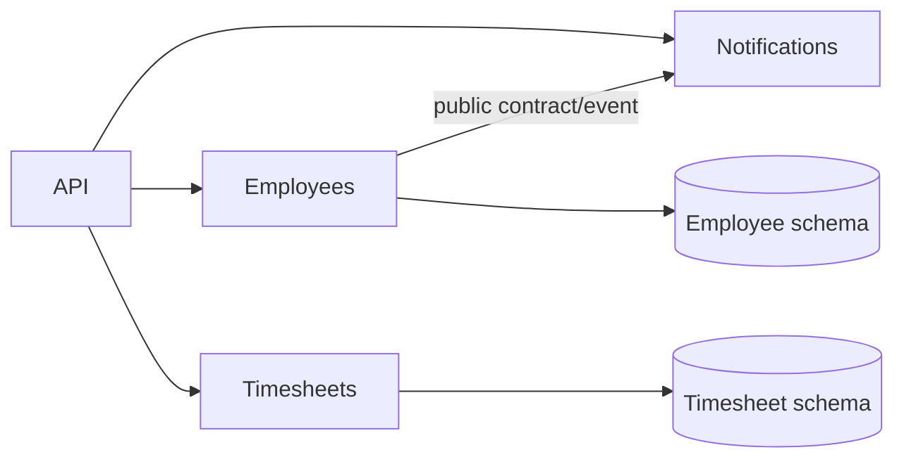
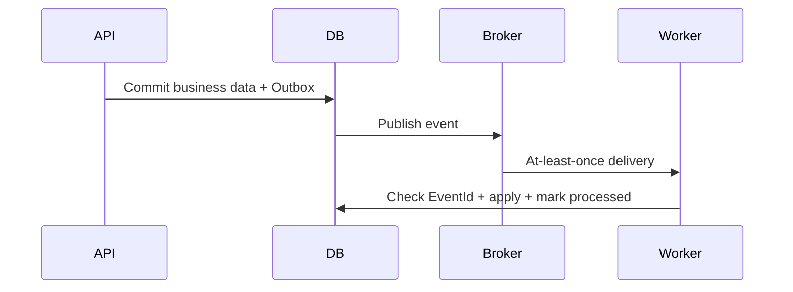
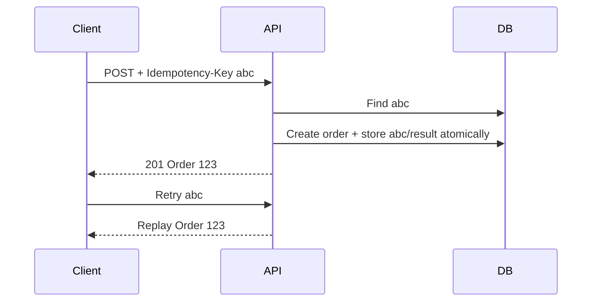
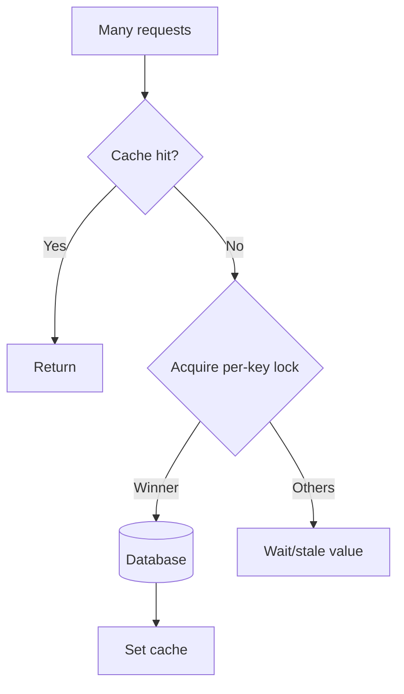
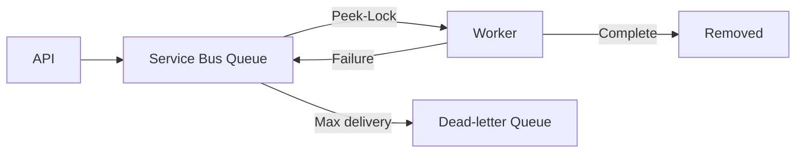
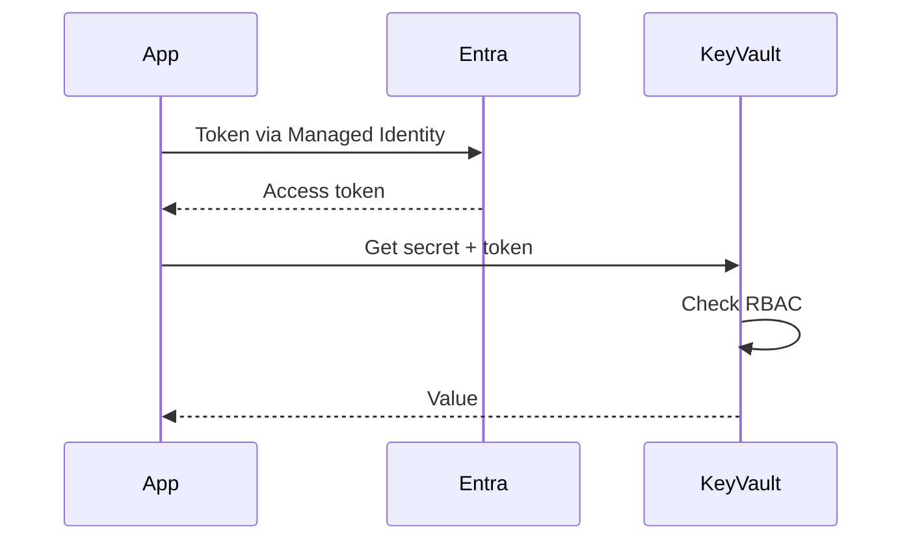
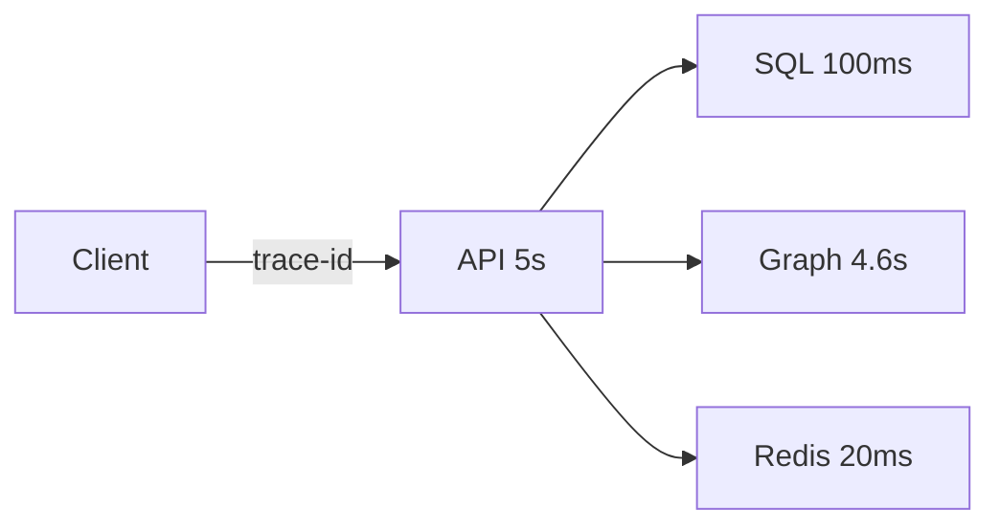
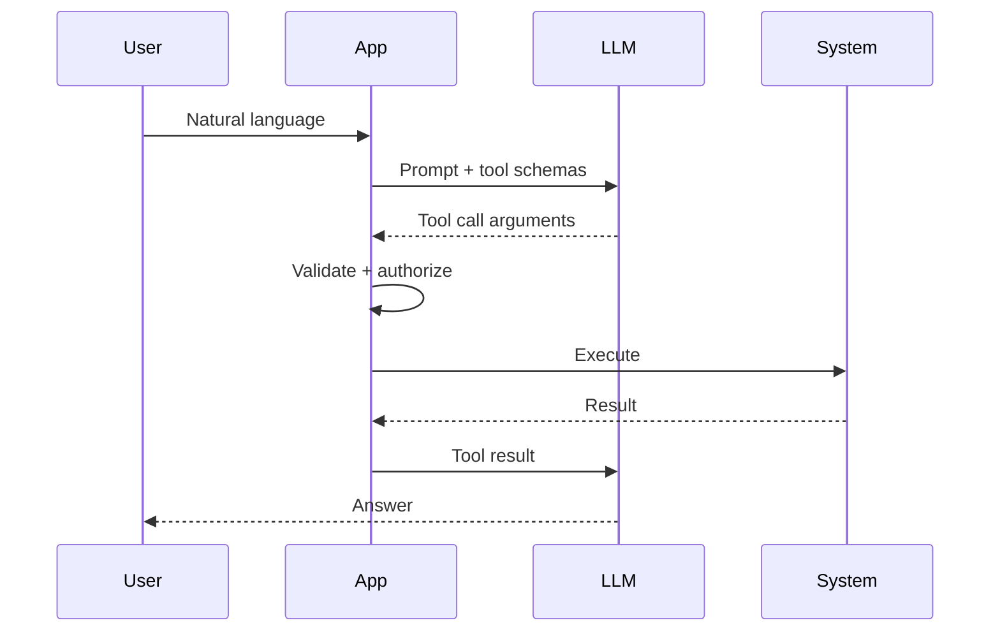
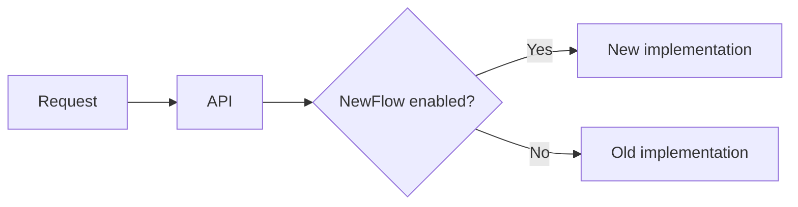

# Daily Knowledge Sharing — 17/08/2026

## Today’s Topics

1. Modular Monolith và module boundaries
2. Event-Driven Architecture và idempotent consumer
3. API Idempotency
4. EF Core Optimistic Concurrency
5. Redis Cache Stampede
6. Azure Service Bus
7. Managed Identity + Azure Key Vault
8. OpenTelemetry Distributed Tracing
9. LLM Tool Calling
10. Feature Flags

---

# 1. Modular Monolith và module boundaries

### 1. What is it?
Modular Monolith vẫn là một deployable application nhưng chia thành các business module như Employees, Timesheets, Notifications. Điểm cốt lõi là boundary: module không tùy tiện dùng entity, table hay internal service của module khác.

### 2. Why does it exist?
Monolith thường xuống cấp khi mọi feature dùng chung DbContext và service. Microservices giải coupling nhưng thêm network failure, eventual consistency và operational cost. Modular Monolith giải quyết code coupling trước khi trả distributed-systems tax.

### 3. How does it work?

Module giao tiếp qua public contract hoặc event; không cross-query database tùy tiện.

### 4. Practical example
```csharp
public interface IEmployeeDirectory
{
    Task<EmployeeSummary?> GetAsync(Guid id, CancellationToken ct);
}
public sealed record EmployeeSummary(Guid Id, string Name, bool IsActive);
```
Timesheets chỉ nhận dữ liệu nó cần thay vì phụ thuộc `Employee` entity.

### 5. Real production scenario
Offboarding đổi trạng thái trong Employees; Microsoft365 module nhận event để xử lý mailbox; Timesheets nhận event để khóa submission. Failure của Graph không rollback trạng thái employee đã commit.

### 6. Common mistakes
Chỉ chia folder nhưng dùng chung mọi entity; tạo `Shared` project khổng lồ; module A query table module B; dùng event cho cả những call đồng bộ đơn giản.

### 7. Trade-offs
**Advantages:** deploy/debug đơn giản, transaction local dễ, boundary tốt. **Costs / Risks:** vẫn scale như một unit; cần kỷ luật boundary; process failure vẫn có blast radius lớn.

### 8. Junior → Middle → Senior understanding
**Junior:** module là business boundary. **Middle:** biết thiết kế contract và integration test. **Senior / Technical Lead:** quyết định boundary, consistency và khi nào thực sự cần tách service.

### 9. Key takeaway
- Boundary quan trọng hơn số service.
- Monolith không đồng nghĩa spaghetti.
- Chỉ trả distributed-systems cost khi có lý do đủ mạnh.

---

# 2. Event-Driven Architecture và idempotent consumer

### 1. What is it?
Producer phát sự kiện đã xảy ra như `EmployeeDeactivated`; consumer tự quyết định phản ứng. Producer không cần biết toàn bộ downstream consumers.

### 2. Why does it exist?
Nếu một API gọi tuần tự Mailbox, Timesheet, Notification và Audit, một dependency lỗi có thể kéo toàn request xuống. Event tách lifecycle và failure domain.

### 3. How does it work?

At-least-once nghĩa là duplicate delivery có thể xảy ra, nên consumer phải idempotent.

### 4. Practical example
```csharp
if (await db.ProcessedMessages.AnyAsync(x => x.Id == msg.Id, ct)) return;
await handler.ApplyAsync(msg, ct);
db.ProcessedMessages.Add(new(msg.Id));
await db.SaveChangesAsync(ct);
```
Với external side effect, còn cần idempotency key hoặc state machine.

### 5. Real production scenario
Payment phát `PaymentSucceeded`; Invoice tạo hóa đơn, Notification gửi mail, Loyalty cộng điểm. Notification outage không được rollback payment.

### 6. Common mistakes
Tin rằng broker cho exactly-once end-to-end; thiếu EventId; retry poison message vô hạn; publish trước DB commit; phụ thuộc ordering nhưng không thiết kế ordering.

### 7. Trade-offs
**Advantages:** loose coupling, async scaling, fault isolation. **Costs / Risks:** eventual consistency, duplicate, broker/observability/outbox complexity.

### 8. Junior → Middle → Senior understanding
**Junior:** hiểu event khác command. **Middle:** retry, DLQ, idempotency, correlation. **Senior / Technical Lead:** delivery semantics, outbox/inbox, ordering và transaction boundary.

### 9. Key takeaway
- Event chuyển failure sang async workflow, không xóa failure.
- At-least-once ⇒ idempotent consumer.
- Business data và event cần consistency strategy.

---

# 3. API Idempotency

### 1. What is it?
Idempotency bảo đảm retry cùng một logical operation không tạo thêm business effect, đặc biệt quan trọng với `POST /orders`, payment hoặc create-event API.

### 2. Why does it exist?
Client timeout không biết server đã commit chưa. Retry mù có thể tạo hai order; không retry thì transient network failure làm UX kém.

### 3. How does it work?

Key nên gắn với request fingerprint để phát hiện cùng key nhưng payload khác.

### 4. Practical example
```csharp
var existing = await db.IdempotencyRecords.SingleOrDefaultAsync(x => x.Key == key, ct);
if (existing is not null) return Results.Ok(existing.Result);
// Unique index + transaction vẫn bắt buộc để chống race.
```

### 5. Real production scenario
Mobile tạo calendar event trên mạng yếu. Response mất sau commit; retry cùng key trả record cũ thay vì tạo event thứ hai.

### 6. Common mistakes
Check tồn tại nhưng thiếu unique constraint; lưu key trong memory ở hệ multi-instance; không kiểm payload; retention vô hạn; retry operation có side effect mà downstream không idempotent.

### 7. Trade-offs
**Advantages:** retry an toàn, giảm duplicate. **Costs / Risks:** thêm storage, TTL, transaction và API contract complexity.

### 8. Junior → Middle → Senior understanding
**Junior:** timeout không nghĩa server chưa xử lý. **Middle:** key, unique index, transaction, replay response. **Senior / Technical Lead:** scope, retention và downstream semantics.

### 9. Key takeaway
- Retry an toàn phải được thiết kế.
- Unique constraint bảo vệ race condition.
- Idempotency là business contract, không chỉ middleware.

---

# 4. EF Core Optimistic Concurrency

### 1. What is it?
Optimistic concurrency dùng version token như SQL Server `rowversion` để phát hiện record đã bị người khác sửa kể từ lúc client đọc.

### 2. Why does it exist?
Hai admin đọc cùng Employee rồi update. Nếu request sau ghi đè dữ liệu request trước mà không phát hiện, ta gặp lost update.

### 3. How does it work?
```sql
UPDATE Employees
SET ManagerId = @manager
WHERE Id = @id AND RowVersion = @originalVersion;
```
Affected rows bằng 0 khiến EF Core phát `DbUpdateConcurrencyException`.

### 4. Practical example
```csharp
public class Employee
{
    public Guid Id { get; set; }
    [Timestamp] public byte[] RowVersion { get; set; } = [];
}
```
API round-trip token và trả `409 Conflict` khi version cũ.

### 5. Real production scenario
HR và manager cùng sửa employee profile. Conflict được báo để reload/merge thay vì silently overwrite.

### 6. Common mistakes
Catch conflict rồi retry ngay dữ liệu cũ; DTO không mang version token; trả 500; nghĩ transaction mặc định ngăn mọi lost update.

### 7. Trade-offs
**Advantages:** không giữ long-lived lock, phù hợp web app. **Costs / Risks:** cần merge/retry UX; contention cao tạo nhiều conflict.

### 8. Junior → Middle → Senior understanding
**Junior:** hiểu lost update. **Middle:** token, exception, 409, concurrent tests. **Senior / Technical Lead:** chọn optimistic/pessimistic theo invariant và contention.

### 9. Key takeaway
- Detect conflict chưa đủ; cần business policy xử lý.
- Retry chỉ đúng nếu operation còn hợp lệ trên state mới.

---

# 5. Redis Cache Stampede

### 1. What is it?
Cache stampede xảy ra khi hot key hết hạn và rất nhiều request cùng cache miss rồi đồng thời đánh xuống database.

### 2. Why does it exist?
Cache giảm load khi hit nhưng TTL đồng loạt có thể biến cache thành load amplifier, làm cạn DB connection pool và tăng tail latency.

### 3. How does it work?

Có thể kết hợp per-key single-flight, stale-while-revalidate và TTL jitter.

### 4. Practical example
```csharp
var cached = await cache.GetStringAsync(key, ct);
if (cached != null) return Deserialize(cached);
await using var lease = await locker.TryAcquireAsync($"lock:{key}", ct);
// Sau khi lấy lock phải double-check cache trước khi query DB.
```

### 5. Real production scenario
Configuration key TTL 10 phút trên nhiều App Service instances. Cùng lúc hết hạn, hàng nghìn request query SQL khiến DB CPU/latency tăng mạnh.

### 6. Common mistakes
TTL giống nhau cho mọi key; global lock; không double-check; Redis down kéo API down; cache PII nhưng key thiếu tenant scope.

### 7. Trade-offs
**Advantages:** giảm DB load và latency. **Costs / Risks:** stale data, invalidation, lock complexity, Redis cost.

### 8. Junior → Middle → Senior understanding
**Junior:** hit/miss/TTL. **Middle:** cache-aside, jitter, fallback, hit ratio. **Senior / Technical Lead:** degradation strategy, hot keys, p95/p99 và consistency requirement.

### 9. Key takeaway
- Hot-key miss đồng thời nguy hiểm hơn miss đơn lẻ.
- TTL jitter và coordination giúp tránh stampede.
- Cache phải có failure strategy.

---

# 6. Azure Service Bus

### 1. What is it?
Azure Service Bus là managed message broker cho queue và publish/subscribe, phù hợp với durable asynchronous workflows.

### 2. Why does it exist?
Direct HTTP coupling khiến producer phụ thuộc availability/latency consumer. Queue giữ message bền vững và cho consumer xử lý, retry, scale độc lập.

### 3. How does it work?

Worker crash trước Complete thì message có thể được giao lại.

### 4. Practical example
```csharp
var processor = client.CreateProcessor("mailbox-jobs",
    new ServiceBusProcessorOptions { AutoCompleteMessages = false, MaxConcurrentCalls = 8 });
```
Handler chỉ Complete sau khi side effect thành công và phải idempotent.

### 5. Real production scenario
Offboarding enqueue mailbox job. Worker gọi Microsoft Graph; throttling được retry có kiểm soát; payload invalid vào DLQ để điều tra.

### 6. Common mistakes
Complete quá sớm; retry permanent error; không monitor DLQ; concurrency vượt downstream capacity; consumer không idempotent.

### 7. Trade-offs
**Advantages:** durability, decoupling, burst absorption. **Costs / Risks:** eventual consistency, duplicate, broker cost, operational complexity.

### 8. Junior → Middle → Senior understanding
**Junior:** queue tách producer/consumer. **Middle:** lock, retry, DLQ, correlation. **Senior / Technical Lead:** concurrency, ordering/session, poison-message policy, SLA.

### 9. Key takeaway
- Durable broker không đồng nghĩa exactly once.
- DLQ cần alert và recovery workflow.
- Concurrency phải tôn trọng downstream capacity.

---

# 7. Managed Identity + Azure Key Vault

### 1. What is it?
Managed Identity cho Azure resource một Microsoft Entra identity để lấy token truy cập service mà không cần client secret. Key Vault lưu secret/key/certificate còn thực sự cần thiết.

### 2. Why does it exist?
Secret tĩnh phải tạo, phân phối, rotate và revoke. Copy secret qua source/config/pipeline làm tăng attack surface.

### 3. How does it work?


### 4. Practical example
```csharp
var credential = new DefaultAzureCredential();
var client = new SecretClient(new Uri(vaultUri), credential);
var secret = await client.GetSecretAsync("ThirdPartyApiKey");
```

### 5. Real production scenario
App Service dùng Managed Identity với Azure SQL; third-party API key còn lại nằm trong Key Vault với least-privilege RBAC.

### 6. Common mistakes
Cấp quyền admin; fetch Key Vault mỗi request; không rotation; mở network rộng không cần thiết; tưởng Key Vault loại bỏ mọi plaintext secret trong process.

### 7. Trade-offs
**Advantages:** giảm secret sprawl, audit/rotation tốt. **Costs / Risks:** thêm identity/network dependency; private networking và caching tăng complexity.

### 8. Junior → Middle → Senior understanding
**Junior:** không commit secret. **Middle:** Managed Identity, RBAC, `DefaultAzureCredential`. **Senior / Technical Lead:** least privilege, rotation, private endpoint, recovery.

### 9. Key takeaway
- Ưu tiên identity/token hơn secret tĩnh.
- Key Vault không thay authorization design.
- Security gồm cả rotation, audit và network boundary.

---

# 8. OpenTelemetry Distributed Tracing

### 1. What is it?
Distributed trace chia một request thành các span để thấy thời gian ở ASP.NET Core, SQL, Redis, HTTP downstream hoặc message consumer.

### 2. Why does it exist?
Log “request mất 5 giây” không cho biết 5 giây nằm ở đâu. Correlation thủ công qua nhiều dependency rất khó.

### 3. How does it work?

Trace context được propagate qua HTTP/message headers.

### 4. Practical example
```csharp
builder.Services.AddOpenTelemetry().WithTracing(t => t
    .AddAspNetCoreInstrumentation()
    .AddHttpClientInstrumentation()
    .AddEntityFrameworkCoreInstrumentation());
```

### 5. Real production scenario
API p95 tăng lên 5 giây. Trace cho thấy Graph span 4.6 giây trong khi SQL bình thường, giúp team tránh tối ưu DB sai chỗ.

### 6. Common mistakes
Trace 100% traffic không tính cost; high-cardinality dimensions; mất context qua queue; ghi token/PII; có telemetry nhưng không alert/runbook.

### 7. Trade-offs
**Advantages:** giảm MTTR, thấy critical path. **Costs / Risks:** telemetry cost, sampling, instrumentation và governance.

### 8. Junior → Middle → Senior understanding
**Junior:** phân biệt logs/metrics/traces. **Middle:** instrumentation và correlation. **Senior / Technical Lead:** sampling, PII policy, SLO dashboards, observability budget.

### 9. Key takeaway
- Logs: chuyện gì; metrics: bao nhiêu; traces: request đi đâu.
- Instrument dependency boundary trước.
- Telemetry cũng cần cost/security governance.

---

# 9. LLM Tool Calling

### 1. What is it?
Tool calling cho phép LLM đề xuất lời gọi có cấu trúc như `get_calendar(start,end)`. Application mới là nơi validate, authorize và thực thi action.

### 2. Why does it exist?
LLM hiểu ngôn ngữ tốt nhưng không phải nguồn dữ liệu hiện tại và không nên trực tiếp sở hữu quyền hệ thống. Tool nối reasoning với deterministic capabilities.

### 3. How does it work?


### 4. Practical example
```csharp
if (input.End <= input.Start || input.End - input.Start > TimeSpan.FromDays(31))
    throw new ValidationException("Invalid range");
authorization.Require(user, Permission.CalendarRead);
return await calendar.GetAsync(user.Id, input.Start, input.End, ct);
```
Model chọn tool; code enforce policy.

### 5. Real production scenario
Engineering agent được auto-run read-only code search nhưng deploy/send-email tools cần human approval, audit trail và scope giới hạn.

### 6. Common mistakes
Raw shell/SQL unrestricted; tin arguments model; tool schema mơ hồ; retry side effect không idempotent; prompt injection kích hoạt privileged tool.

### 7. Trade-offs
**Advantages:** AI dùng dữ liệu/action thật, workflow linh hoạt. **Costs / Risks:** latency, token cost, nondeterminism, prompt injection, authorization complexity.

### 8. Junior → Middle → Senior understanding
**Junior:** tool call là request có cấu trúc. **Middle:** schema, validation, timeout, tests. **Senior / Technical Lead:** permission, approval, audit, eval và deterministic policy boundary.

### 9. Key takeaway
- Model đề xuất; code enforce.
- Tool boundary là security boundary.
- Side effect cần authorization, idempotency và audit.

---

# 10. Feature Flags — tách deployment khỏi release

### 1. What is it?
Feature flag cho phép code đã deploy nhưng behavior mới chỉ bật cho tenant, cohort hoặc percentage traffic. Deployment và release trở thành hai quyết định khác nhau.

### 2. Why does it exist?
Bật feature cho 100% user ngay sau deploy tạo blast radius lớn. Flag hỗ trợ gradual rollout và kill switch mà không phải redeploy ngay.

### 3. How does it work?

Bucketing nên ổn định theo user/tenant; flag provider cần cache/fallback.

### 4. Practical example
```csharp
if (await featureManager.IsEnabledAsync("NewOffboardingFlow"))
    await newFlow.ExecuteAsync(employeeId, ct);
else
    await legacyFlow.ExecuteAsync(employeeId, ct);
```

### 5. Real production scenario
New mailbox flow deploy trước, bật internal tenant rồi 5% → 25% → 100%. Error rate tăng thì tắt flag nhanh mà không rollback các fix khác trong release.

### 6. Common mistakes
Flag sống nhiều năm; thiếu owner/expiry; không test ON/OFF; old path không còn tương thích dữ liệu; flag service outage kéo app down; dùng flag che migration breaking.

### 7. Trade-offs
**Advantages:** giảm blast radius, gradual rollout, kill switch. **Costs / Risks:** tăng combinations, technical debt và yêu cầu cleanup/observability.

### 8. Junior → Middle → Senior understanding
**Junior:** hiểu runtime behavior switch. **Middle:** targeting, fallback, ON/OFF tests, telemetry. **Senior / Technical Lead:** rollout/rollback, compatibility window, governance và cleanup.

### 9. Key takeaway
- Deploy không nhất thiết đồng nghĩa release.
- Flag cần owner, expiry và cleanup plan.
- Rollout an toàn phải gắn với telemetry.
