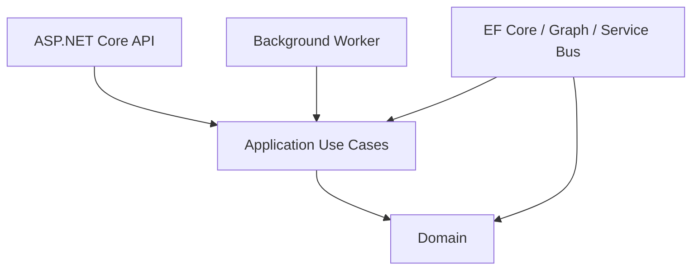
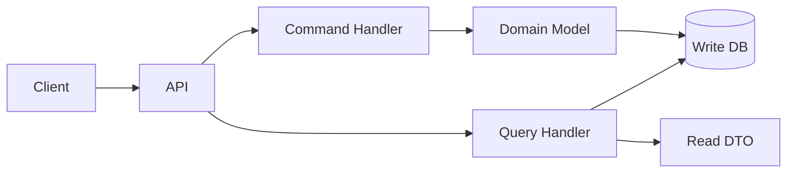
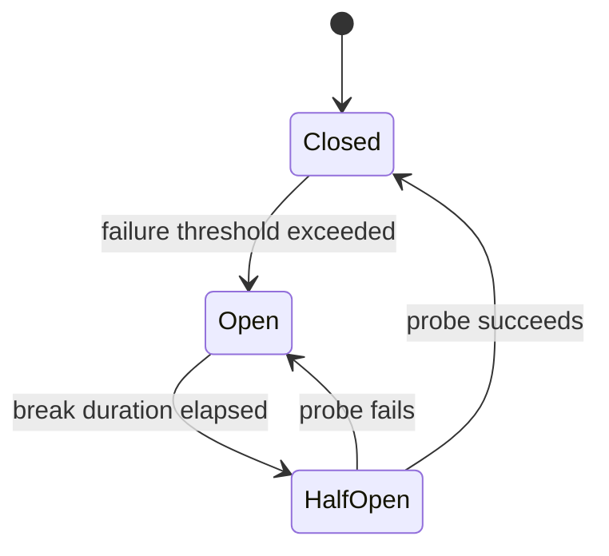
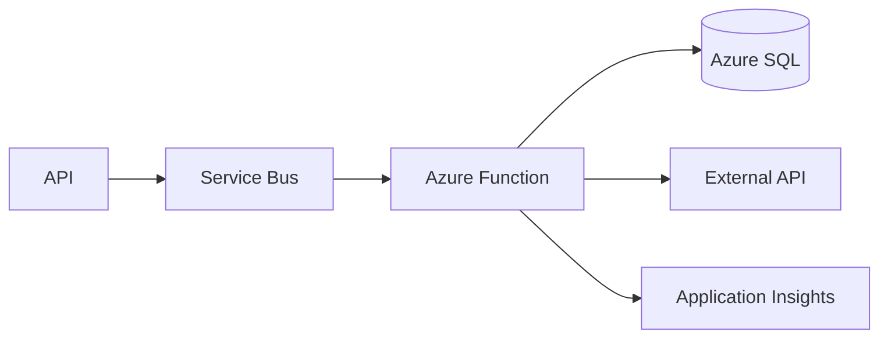
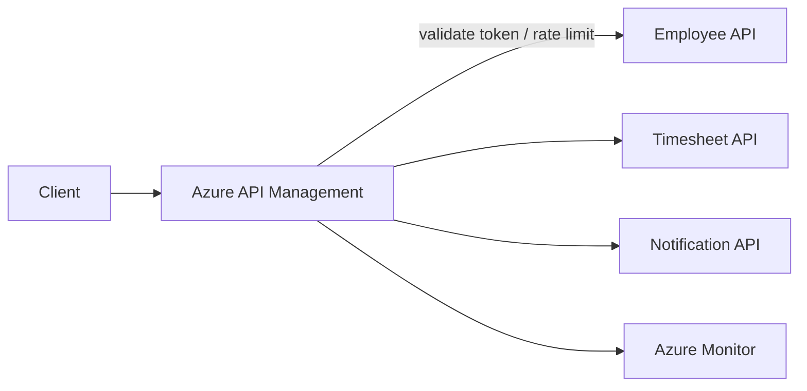
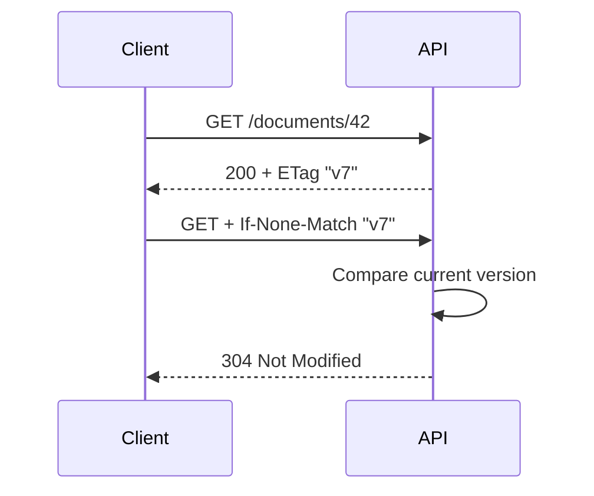
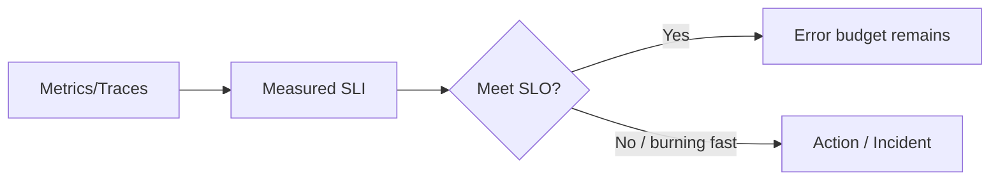
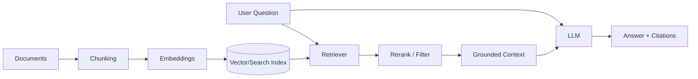

# Daily Knowledge Sharing — 17/08/2026

## Today’s Topics

1. Clean Architecture — dependency direction và use-case boundary
2. CQRS — tách read/write khi mô hình bắt đầu lệch nhau
3. Retry + Circuit Breaker — resilience cho third-party API
4. SQL Indexing — composite index, selectivity và SARGability
5. Database Isolation Levels — consistency, locking và concurrency
6. Azure Functions — event-driven compute và lựa chọn hosting phù hợp
7. Azure API Management — gateway policy, security và governance
8. HTTP Caching — ETag, Cache-Control và conditional request
9. SLI, SLO, SLA — biến reliability thành mục tiêu đo được
10. RAG — retrieval, grounding và kiểm soát chất lượng AI

---

# 1. Clean Architecture — dependency direction và use-case boundary

### 1. What is it?

Clean Architecture là cách tổ chức dependency để business rule không phụ thuộc trực tiếp vào ASP.NET Core, EF Core, SQL Server, Azure hay SDK bên thứ ba. Ý tưởng quan trọng không phải là tạo bốn project có tên `Domain`, `Application`, `Infrastructure`, `API`; điều quan trọng là **code ổn định nhất nằm ở trung tâm và dependency hướng vào trong**.

Domain chứa business concept và invariant. Application điều phối use case. Infrastructure cung cấp implementation cho database, queue, email, Graph API... Presentation/API chuyển HTTP request thành input cho application và chuyển kết quả thành HTTP response.

### 2. Why does it exist?

Một controller ban đầu rất dễ viết như sau: validate request, query EF Core, kiểm business rule, gọi Graph API, gửi email rồi `SaveChanges`. Khi hệ thống lớn lên, business rule bị dính với HTTP và infrastructure. Unit test phải mock quá nhiều thứ; thay integration khó; cùng một use case không thể tái sử dụng từ background worker.

Clean Architecture tạo boundary để business decision tồn tại độc lập với delivery mechanism và infrastructure detail.

### 3. How does it work?



Application định nghĩa abstraction mà nó cần; Infrastructure implement abstraction đó. Ví dụ Application cần `IEmployeeRepository`, không cần biết implementation dùng EF Core hay REST API.

Request flow:

`HTTP → Endpoint → Use Case → Domain Rule → Port/Interface → Infrastructure → Result`

### 4. Practical example

```csharp
public sealed class DeactivateEmployeeHandler(
    IEmployeeRepository employees,
    IUnitOfWork unitOfWork)
{
    public async Task Handle(Guid employeeId, CancellationToken ct)
    {
        var employee = await employees.GetAsync(employeeId, ct)
            ?? throw new NotFoundException("Employee not found");

        employee.Deactivate(DateTimeOffset.UtcNow);
        await unitOfWork.SaveChangesAsync(ct);
    }
}
```

`Employee.Deactivate()` giữ invariant; handler điều phối use case; EF Core implementation nằm ngoài application.

### 5. Real production scenario

Trong hệ thống employee management, thao tác offboarding có thể được gọi từ Portal hoặc scheduled job. Nếu business logic nằm trong controller, job phải copy logic. Với use-case boundary, cả API và worker đều gọi cùng application service. Sau commit, integration event có thể kích hoạt mailbox workflow riêng thay vì nhét Microsoft Graph vào domain.

### 6. Common mistakes

Biến Clean Architecture thành folder ceremony; tạo interface cho mọi class dù không có boundary; domain reference EF Core/HTTP SDK; repository trả `IQueryable` khiến query detail rò ngược vào Application; controller vẫn chứa business rule; Application trở thành tập hợp CRUD service không có use-case semantics.

### 7. Trade-offs

**Advantages:** business rule dễ test, dependency rõ, integration dễ thay, use case tái sử dụng được.

**Costs / Risks:** thêm abstraction và mapping; CRUD nhỏ có thể bị overengineering; boundary sai tạo nhiều boilerplate mà không giảm coupling.

### 8. Junior → Middle → Senior understanding

**Junior:** hiểu trách nhiệm từng layer và dependency phải hướng về business logic.

**Middle:** biết đặt validation, transaction, mapping, repository và external integration đúng boundary; viết test cho use case không cần web server.

**Senior / Technical Lead:** quyết định nơi abstraction thực sự tạo giá trị, module boundary, transaction boundary và mức kiến trúc phù hợp với độ phức tạp hệ thống.

### 9. Key takeaway

- Clean Architecture là dependency rule, không phải template folder.
- Business rule không nên biết HTTP, database hay cloud SDK.
- Chỉ tạo abstraction ở boundary có ý nghĩa.

---

# 2. CQRS — tách read/write khi mô hình bắt đầu lệch nhau

### 1. What is it?

CQRS (Command Query Responsibility Segregation) tách operations thay đổi state (`Command`) khỏi operations chỉ đọc state (`Query`). CQRS không đồng nghĩa microservices, event sourcing hay hai database. Một modular monolith với cùng SQL database vẫn có thể dùng CQRS ở application layer.

### 2. Why does it exist?

CRUD model thường ổn khi read và write có cùng hình dạng. Nhưng production system hay xuất hiện tình huống write cần aggregate/invariant phức tạp, trong khi dashboard cần join, projection và pagination tối ưu. Ép cả hai dùng cùng entity/repository abstraction làm read path khó tối ưu và write model bị méo theo UI.

### 3. How does it work?



Command trả kết quả tối thiểu cần thiết; Query không thay đổi state. Khi cần scale cao hơn, read model có thể được materialize riêng và cập nhật bất đồng bộ.

### 4. Practical example

```csharp
public sealed record GetTimesheetSummary(Guid EmployeeId, DateOnly Month);

public async Task<TimesheetSummaryDto> Handle(
    GetTimesheetSummary query, CancellationToken ct)
{
    return await db.Timesheets
        .AsNoTracking()
        .Where(x => x.EmployeeId == query.EmployeeId && x.Month == query.Month)
        .Select(x => new TimesheetSummaryDto(x.Id, x.TotalHours, x.Status))
        .SingleAsync(ct);
}
```

Read side projection trực tiếp DTO; không cần hydrate aggregate nếu chỉ hiển thị dữ liệu.

### 5. Real production scenario

Timesheet submission command phải kiểm cutoff date, employee status và approval invariant. Trong khi manager dashboard đọc hàng nghìn records theo team/month. Write path ưu tiên correctness; read path ưu tiên query shape và latency. CQRS cho phép tối ưu hai nhu cầu độc lập.

### 6. Common mistakes

Dùng CQRS cho mọi CRUD endpoint; mỗi command/query thành microservice; bắt buộc MediatR dù không cần; query vẫn load entity rồi map trong memory; tách read database nhưng không thiết kế eventual consistency; command handler chứa tất cả domain rule thay vì domain model.

### 7. Trade-offs

**Advantages:** read/write tối ưu độc lập, use case rõ, giảm model compromise.

**Costs / Risks:** nhiều type/handler hơn; nếu tách datastore sẽ có synchronization, lag và operational complexity.

### 8. Junior → Middle → Senior understanding

**Junior:** phân biệt command thay đổi state và query chỉ đọc.

**Middle:** viết projection hiệu quả, validation/transaction cho command, test từng handler.

**Senior / Technical Lead:** biết khi CQRS đơn giản là đủ và khi read model riêng đáng giá; thiết kế consistency SLA và recovery nếu projection bị lệch.

### 9. Key takeaway

- CQRS có thể rất nhẹ, không cần distributed architecture.
- Read model và write model chỉ nên tách sâu khi nhu cầu thực sự khác nhau.
- Đừng trả complexity tax trước khi có vấn đề cần giải quyết.

---

# 3. Retry + Circuit Breaker — resilience cho third-party API

### 1. What is it?

Retry xử lý transient failure bằng cách thử lại có kiểm soát. Circuit Breaker ngừng gửi request tới dependency đang lỗi nghiêm trọng trong một khoảng thời gian để hệ thống không tiếp tục tự gây áp lực.

Hai pattern giải hai vấn đề khác nhau: retry hy vọng lỗi ngắn hạn sẽ hết; circuit breaker bảo vệ hệ thống khi retry không còn hữu ích.

### 2. Why does it exist?

External API có thể trả 429, 503, timeout hoặc reset connection. Không retry làm transient failure trở thành user-visible error. Nhưng retry vô hạn có thể tạo retry storm: dependency đang yếu lại nhận traffic gấp nhiều lần.

### 3. How does it work?



Retry thường dùng exponential backoff + jitter. Circuit breaker quan sát failure rate và fail-fast khi open. Timeout phải tồn tại độc lập; nếu không request có thể treo rất lâu trước khi policy phản ứng.

### 4. Practical example

```csharp
builder.Services.AddHttpClient<GraphGateway>()
    .AddStandardResilienceHandler(options =>
    {
        options.Retry.MaxRetryAttempts = 3;
        options.AttemptTimeout.Timeout = TimeSpan.FromSeconds(5);
        options.TotalRequestTimeout.Timeout = TimeSpan.FromSeconds(15);
    });
```

Với non-idempotent operation, không được retry mù chỉ vì HTTP request lỗi.

### 5. Real production scenario

Worker gọi Microsoft 365 API để cập nhật mailbox. Khi API trả 429, worker tôn trọng `Retry-After`. Nếu dependency liên tục timeout, breaker mở để worker fail-fast hoặc defer message thay vì giữ hàng trăm sockets/tasks chờ timeout.

### 6. Common mistakes

Retry mọi status code; retry `400/401/403`; fixed delay khiến instances retry cùng lúc; timeout ở từng attempt nhưng không có total timeout; retry POST tạo duplicate side effect; circuit breaker đặt global cho nhiều downstream độc lập; không metric retry count/breaker state.

### 7. Trade-offs

**Advantages:** chịu transient failure tốt hơn, giảm cascading failure, cải thiện availability.

**Costs / Risks:** tăng latency; retry tăng load; cấu hình sai che giấu incident; circuit breaker làm một số request fail-fast dù dependency vừa phục hồi.

### 8. Junior → Middle → Senior understanding

**Junior:** hiểu transient và permanent failure khác nhau.

**Middle:** cấu hình timeout, backoff, jitter, cancellation và idempotency; log attempt có correlation.

**Senior / Technical Lead:** đặt retry budget, breaker scope, concurrency limit và degradation strategy dựa trên downstream SLA.

### 9. Key takeaway

- Timeout trước, retry có chọn lọc, breaker để giới hạn blast radius.
- Retry chỉ an toàn khi operation có semantics phù hợp.
- Resilience policy cần metrics, không phải cấu hình rồi quên.

---

# 4. SQL Indexing — composite index, selectivity và SARGability

### 1. What is it?

Index là cấu trúc dữ liệu giúp database tìm rows mà không phải scan toàn bộ table. Composite index chứa nhiều columns; thứ tự key columns ảnh hưởng mạnh tới khả năng seek, sort và range scan.

### 2. Why does it exist?

Query trên bảng vài nghìn rows có thể nhanh dù không index. Khi bảng lên hàng chục triệu rows, table scan gây nhiều logical reads, CPU và I/O. Tuy nhiên “thêm index” không phải miễn phí: mỗi INSERT/UPDATE/DELETE phải duy trì index.

### 3. How does it work?

Giả sử query thường gặp:

```sql
SELECT Id, EmployeeId, WorkDate, Status
FROM Timesheets
WHERE EmployeeId = @employeeId
  AND WorkDate >= @from
  AND WorkDate < @to;
```

Index phù hợp:

```sql
CREATE INDEX IX_Timesheets_EmployeeId_WorkDate
ON Timesheets(EmployeeId, WorkDate)
INCLUDE(Status);
```

Equality column thường hữu ích trước range column. `INCLUDE` có thể tránh key lookup nếu query cần thêm non-key columns.

### 4. Practical example

Query không SARGable:

```sql
WHERE YEAR(WorkDate) = 2026
```

Tốt hơn:

```sql
WHERE WorkDate >= '2026-01-01'
  AND WorkDate <  '2027-01-01'
```

Dạng thứ hai cho optimizer cơ hội dùng range seek trên index `WorkDate`.

### 5. Real production scenario

Timesheet report chậm từ 200 ms lên 8 giây khi data tăng. Execution plan cho thấy clustered index scan và hàng triệu logical reads. Sau khi đổi predicate thành SARGable và thêm composite covering index phù hợp workload, reads giảm mạnh. Việc xác nhận phải dựa trên actual execution plan và metrics, không chỉ thời gian chạy một lần.

### 6. Common mistakes

Index từng column riêng lẻ mà bỏ qua query shape; index mọi foreign key + filter column mà không đo; đặt low-selectivity boolean làm leading key không phù hợp; dùng `SELECT *`; function/cast trên indexed column; quên parameter sniffing/statistics; nhìn estimated plan nhưng không kiểm actual rows.

### 7. Trade-offs

**Advantages:** giảm reads, CPU và query latency; hỗ trợ ordering/covering.

**Costs / Risks:** tăng storage, write amplification, maintenance và memory pressure; index thừa có thể làm optimizer/operations phức tạp hơn.

### 8. Junior → Middle → Senior understanding

**Junior:** index tăng tốc lookup nhưng làm write tốn thêm chi phí.

**Middle:** đọc execution plan, logical reads, composite key order, INCLUDE và SARGability.

**Senior / Technical Lead:** thiết kế index theo workload tổng thể, cân read/write, monitor regression và loại redundant indexes.

### 9. Key takeaway

- Thiết kế index từ query pattern, không từ tên column.
- Đo execution plan + logical reads trước và sau tối ưu.
- Index tốt cho một query có thể là chi phí cho toàn hệ thống.

---

# 5. Database Isolation Levels — consistency, locking và concurrency

### 1. What is it?

Isolation level quyết định transaction được phép nhìn thấy thay đổi của transaction khác như thế nào. Nó là sự cân bằng giữa consistency và concurrency, không đơn giản là “level càng cao càng tốt”.

Các hiện tượng cần hiểu gồm dirty read, non-repeatable read, phantom và write conflict. SQL Server còn có row-versioning options như `READ_COMMITTED_SNAPSHOT` giúp giảm reader/writer blocking.

### 2. Why does it exist?

Nếu mọi transaction khóa toàn bộ dữ liệu đến khi kết thúc, consistency dễ reasoning nhưng throughput thấp. Nếu cho đọc/ghi tự do, dữ liệu có thể không còn đáp ứng business invariant. Isolation cho phép chọn mức bảo vệ phù hợp workload.

### 3. How does it work?

```text
Transaction A                Transaction B
-------------                -------------
Read Balance = 100
                             Update Balance = 50
                             Commit
Read Balance again = ?
```

Ở `READ COMMITTED`, lần đọc thứ hai có thể thấy 50. Ở stronger isolation hoặc snapshot semantics, behavior khác tùy engine/configuration.

### 4. Practical example

```csharp
await using var tx = await db.Database.BeginTransactionAsync(
    System.Data.IsolationLevel.Serializable, ct);

// Critical invariant check + write
await tx.CommitAsync(ct);
```

Không nên đổi toàn hệ thống sang `Serializable` chỉ để sửa một race condition. Đầu tiên phải xác định invariant và contention thực tế.

### 5. Real production scenario

Booking system kiểm tra “slot còn trống” rồi insert reservation. Hai transactions đồng thời đều thấy trống nếu boundary không đúng. Giải pháp có thể là unique constraint, atomic update, optimistic concurrency hoặc isolation mạnh hơn — tùy invariant và workload.

### 6. Common mistakes

Dùng `NOLOCK` để “fix performance”; giữ transaction mở trong lúc gọi HTTP API; tăng isolation toàn database; nghĩ transaction tự động chống mọi race; thiếu unique constraint cho invariant mà database có thể enforce; retry deadlock mà operation không idempotent.

### 7. Trade-offs

**Advantages:** isolation phù hợp giúp bảo vệ consistency mà vẫn giữ throughput.

**Costs / Risks:** stronger locking tăng blocking/deadlock; snapshot tăng version-store cost; weaker isolation yêu cầu application xử lý anomaly tốt hơn.

### 8. Junior → Middle → Senior understanding

**Junior:** transaction không chỉ là commit/rollback; concurrent transactions có thể ảnh hưởng nhau.

**Middle:** hiểu isolation, lock duration, deadlock và database constraints.

**Senior / Technical Lead:** map business invariant sang concurrency control phù hợp; cân contention, latency và correctness bằng measurement.

### 9. Key takeaway

- Chọn isolation từ invariant, không từ cảm giác an toàn.
- Transaction càng ngắn càng tốt; đừng giữ DB transaction qua network call.
- Database constraint thường là tuyến phòng thủ concurrency mạnh và đơn giản.

---

# 6. Azure Functions — event-driven compute và lựa chọn hosting phù hợp

### 1. What is it?

Azure Functions là serverless/event-driven compute: code được kích hoạt bởi HTTP, timer, queue, Service Bus, Event Grid và các trigger khác. Developer tập trung vào function logic; platform quản lý nhiều phần của hosting và scaling.

### 2. Why does it exist?

Nhiều workload không cần một web server chạy liên tục: xử lý file khi upload, consume queue, scheduled cleanup, webhook nhỏ. Provision một App Service riêng cho từng tác vụ có thể tạo operational overhead không cần thiết.

### 3. How does it work?



Platform nhận event, tạo/scale instances theo hosting plan và trigger. Với queue trigger, message có thể được giao lại nếu execution fail; function vẫn phải thiết kế idempotency.

### 4. Practical example

```csharp
public sealed class MailboxJobFunction
{
    [Function("ProcessMailboxJob")]
    public async Task Run(
        [ServiceBusTrigger("mailbox-jobs", Connection = "ServiceBus")]
        ServiceBusReceivedMessage message,
        CancellationToken ct)
    {
        await processor.ProcessAsync(message.MessageId, message.Body, ct);
    }
}
```

Production nên dùng identity-based connection khi service hỗ trợ thay vì secret tĩnh.

### 5. Real production scenario

Employee offboarding ghi job vào Service Bus. Function scale theo backlog và gọi downstream integration. Nếu Graph bị throttling, concurrency phải giới hạn; scale-out không nên vượt capacity của dependency.

### 6. Common mistakes

Cho rằng serverless nghĩa là không cần architecture; function quá lớn chứa toàn business logic; không idempotent; cold start không phù hợp latency SLA; mở concurrency tối đa; lưu state trong local memory; không hiểu timeout/hosting-plan limits; secrets nằm trong settings lâu dài.

### 7. Trade-offs

**Advantages:** event integration tốt, scale linh hoạt, giảm server management, cost tốt cho workload bursty.

**Costs / Risks:** cold start/plan semantics, distributed debugging, trigger-specific behavior, cost có thể tăng với workload chạy liên tục.

So với App Service/Container Apps/Worker Service, Functions phù hợp nhất khi workload thực sự event-driven và lifecycle ngắn/rõ.

### 8. Junior → Middle → Senior understanding

**Junior:** hiểu trigger/binding và stateless execution.

**Middle:** biết retry, poison message, DI, configuration, observability và local testing.

**Senior / Technical Lead:** chọn hosting plan, scale ceiling, downstream protection, networking/private endpoint và cost model.

### 9. Key takeaway

- Function là compute model, không phải lý do bỏ qua reliability design.
- Scale producer/consumer phải tôn trọng downstream capacity.
- Chọn Functions khi workload phù hợp, không chỉ vì “serverless”.

---

# 7. Azure API Management — gateway policy, security và governance

### 1. What is it?

Azure API Management (APIM) đứng trước backend APIs để cung cấp gateway capabilities như authentication/authorization policy, rate limiting, quota, transformation, version exposure, caching và analytics.

### 2. Why does it exist?

Khi nhiều APIs tự implement JWT validation, throttling, header normalization, subscription key và cross-cutting policy, behavior dễ không nhất quán. Gateway tập trung một số concern ở edge và cung cấp governance cho API consumers.

### 3. How does it work?



Gateway xử lý inbound policy, route request tới backend, sau đó có thể áp outbound policy trước khi trả response.

### 4. Practical example

Một inbound policy có thể validate JWT và giới hạn request theo consumer. Nhưng business authorization như “manager có được sửa employee này không?” vẫn phải ở backend vì gateway không nên trở thành domain engine.

```xml
<rate-limit-by-key calls="100" renewal-period="60"
    counter-key="@(context.Subscription.Id)" />
```

### 5. Real production scenario

Mobile app, partner portal và internal tools cùng gọi APIs. APIM enforce token issuer/audience, rate limit partner, thêm correlation header và expose stable public contract trong khi backend topology thay đổi.

### 6. Common mistakes

Nhét business logic vào policy XML; coi APIM là security duy nhất rồi backend mở public; rate limit không phân biệt tenant/client; log sensitive token/body; cache personalized response sai key; policy quá phức tạp không có source control/test; bỏ qua gateway latency/cost.

### 7. Trade-offs

**Advantages:** centralized governance, consistent edge policies, consumer management, backend abstraction.

**Costs / Risks:** thêm hop, cost và failure point; policy complexity có thể khó debug; backend vẫn cần defense in depth.

### 8. Junior → Middle → Senior understanding

**Junior:** APIM là gateway, không phải backend business service.

**Middle:** cấu hình routing, JWT validation, rate limiting, correlation và policy deployment.

**Senior / Technical Lead:** quyết định concern nào ở gateway/backend, network topology, HA, capacity, SKU/cost và multi-region strategy.

### 9. Key takeaway

- Gateway xử lý cross-cutting edge concerns; domain authorization vẫn thuộc application.
- APIM không thay thế secure backend networking.
- Policy cũng là production code: version, test và observe nó.

---

# 8. HTTP Caching — ETag, Cache-Control và conditional request

### 1. What is it?

HTTP caching tận dụng semantics chuẩn của HTTP để browser, proxy hoặc CDN tái sử dụng response và tránh truyền lại dữ liệu không đổi. `Cache-Control` quyết định khả năng/ thời gian cache; `ETag` đại diện version của resource để client kiểm tra resource có thay đổi không.

### 2. Why does it exist?

Nếu client tải lại cùng 500 KB JSON hoặc image mỗi lần dù resource không đổi, hệ thống lãng phí bandwidth, CPU serialization và backend capacity. Application-level Redis không giải quyết network cost giữa client và server.

### 3. How does it work?



Fresh cache có thể không cần gọi origin. Stale cache dùng validator như ETag để conditional request.

### 4. Practical example

```csharp
var etag = $"\"{document.Version}\"";
if (Request.Headers.IfNoneMatch == etag)
    return StatusCode(StatusCodes.Status304NotModified);

Response.Headers.ETag = etag;
Response.Headers.CacheControl = "private, max-age=60";
return Ok(documentDto);
```

`private` quan trọng nếu response chỉ dành cho một user.

### 5. Real production scenario

Employee directory metadata thay đổi ít nhưng được mobile clients đọc thường xuyên. Conditional GET giảm payload đáng kể. Với public static assets, CDN + immutable fingerprinted filenames có thể cache lâu hơn rất nhiều.

### 6. Common mistakes

Cache response chứa PII ở shared cache; ETag không đổi khi representation đổi; dùng `no-cache` như thể nó có nghĩa “không lưu” (`no-store` mới gần semantics đó); cache lỗi/authorization response không chủ ý; quên `Vary`; đặt TTL dài cho data cần consistency mạnh.

### 7. Trade-offs

**Advantages:** giảm bandwidth, origin load và latency; tận dụng chuẩn HTTP.

**Costs / Risks:** invalidation/validator complexity; stale response; security issue nếu cache scope sai.

### 8. Junior → Middle → Senior understanding

**Junior:** hiểu browser có thể tái sử dụng response và 304 không mang body mới.

**Middle:** dùng Cache-Control, ETag, Last-Modified, Vary đúng semantics và test bằng HTTP tools.

**Senior / Technical Lead:** thiết kế caching hierarchy browser/CDN/API/data cache, consistency requirement và privacy boundary.

### 9. Key takeaway

- HTTP cache và Redis giải các tầng vấn đề khác nhau.
- Cache scope phải phù hợp với authorization/privacy.
- ETag giúp tiết kiệm payload ngay cả khi cache đã stale.

---

# 9. SLI, SLO, SLA — biến reliability thành mục tiêu đo được

### 1. What is it?

**SLI** là chỉ số đo reliability thực tế, ví dụ tỷ lệ request thành công hoặc latency p95. **SLO** là mục tiêu nội bộ cho SLI, ví dụ 99.9% request thành công trong 30 ngày. **SLA** là cam kết với khách hàng và có thể gắn hậu quả thương mại.

### 2. Why does it exist?

“API phải ổn định” không đủ để vận hành hệ thống. Team cần biết mức reliability nào là đủ, khi nào phải ưu tiên incident/reliability work và bao nhiêu failure có thể chấp nhận.

### 3. How does it work?

Ví dụ SLO availability 99.9% trong 30 ngày tạo error budget khoảng 0.1% tổng requests hoặc tương đương một lượng downtime nhất định tùy cách đo.



Alert tốt nên dựa trên symptom và burn rate thay vì chỉ CPU > 80%.

### 4. Practical example

Prometheus/OpenTelemetry metric logic có thể phân loại good/total requests. Với API:

```text
Availability SLI = successful eligible requests / total eligible requests
Latency SLI      = requests <= 500 ms / total eligible requests
```

Phải định nghĩa rõ có tính client 4xx, health checks hay maintenance hay không.

### 5. Real production scenario

Notification API có 99.95% success nhưng p99 latency tăng lên 12 giây. Availability SLI một mình không phản ánh UX. Team bổ sung latency SLO và queue-age SLI cho async processing để đo điều user thực sự trải nghiệm.

### 6. Common mistakes

Dùng infrastructure metric làm SLO; chọn 100%; SLA=SLO; alert mỗi error đơn lẻ; không định nghĩa denominator; dashboard có hàng trăm metrics nhưng không có user-centric SLI; không phân biệt sync API latency và async completion time.

### 7. Trade-offs

**Advantages:** reliability có ngôn ngữ chung, alert có ý nghĩa, giúp cân feature velocity với stability.

**Costs / Risks:** telemetry và governance cost; SLI sai dẫn tới tối ưu sai; SLO quá cao làm chi phí tăng mạnh.

### 8. Junior → Middle → Senior understanding

**Junior:** biết logs khác metrics và SLI là thứ đo được.

**Middle:** instrument success/latency, tạo dashboard và alert theo service behavior.

**Senior / Technical Lead:** chọn user-centric SLO, error-budget policy, dependency assumptions và reliability investment dựa trên business impact.

### 9. Key takeaway

- Đo điều user quan tâm, không chỉ điều server dễ đo.
- SLO là engineering target; SLA là external commitment.
- Error budget giúp reliability trở thành quyết định có dữ liệu.

---

# 10. RAG — retrieval, grounding và kiểm soát chất lượng AI

### 1. What is it?

RAG (Retrieval-Augmented Generation) là kiến trúc trong đó hệ thống tìm các đoạn dữ liệu liên quan từ knowledge source rồi đưa chúng vào context cho LLM tạo câu trả lời. LLM không “học lại” dữ liệu ở runtime; nó được cung cấp evidence cho request hiện tại.

### 2. Why does it exist?

Model có knowledge cutoff, không biết private documents và có thể hallucinate. Nhét toàn bộ tài liệu vào prompt không scale về context window, latency và cost. RAG chọn một tập nhỏ evidence có liên quan trước khi generation.

### 3. How does it work?



Production RAG thường có metadata filtering, hybrid lexical+vector search, reranking và citation mapping. Retrieval quality thường quan trọng hơn việc đổi sang model lớn hơn.

### 4. Practical example

Một .NET service có thể tách deterministic pipeline:

```csharp
var candidates = await search.SearchAsync(
    query, tenantId, topK: 20, ct);

var evidence = await reranker.SelectAsync(
    query, candidates, topN: 5, ct);

var answer = await llm.AnswerAsync(
    query, evidence, requireCitations: true, ct);
```

Tenant filter phải được enforce trong search layer, không giao cho prompt quyết định.

### 5. Real production scenario

Internal engineering assistant trả lời câu hỏi từ architecture docs, runbooks và API specs. User hỏi “quy trình reset mailbox forwarding là gì?”. Retriever chỉ lấy tài liệu đúng tenant/project/version; LLM tổng hợp và trả citation. Nếu evidence không đủ, hệ thống phải cho phép trả “không đủ thông tin” thay vì bịa.

### 6. Common mistakes

Chunk cố định không xét document structure; vector search không metadata filter; top-K quá lớn làm context nhiễu; đưa untrusted retrieved text vào prompt như instruction; không version documents; không đo retrieval recall; đánh giá chỉ bằng câu trả lời “nghe hay”; để model tự quyết authorization; không log token/cost/latency.

Prompt injection đặc biệt quan trọng: retrieved document là **data**, không mặc nhiên là trusted instruction.

### 7. Trade-offs

**Advantages:** dùng private/current knowledge, có thể citation, cập nhật dữ liệu không cần retrain model.

**Costs / Risks:** indexing pipeline, retrieval errors, stale documents, extra latency/cost, security boundary phức tạp.

RAG không phải lựa chọn đúng cho mọi bài toán. Nếu dữ liệu nhỏ và ổn định, direct context có thể đơn giản hơn; nếu cần exact deterministic lookup, database/API query có thể tốt hơn LLM retrieval.

### 8. Junior → Middle → Senior understanding

**Junior:** hiểu embedding/search lấy evidence trước khi LLM trả lời; RAG không làm model “biết chắc mọi thứ”.

**Middle:** implement chunking, metadata, hybrid search, citation, timeout và evaluation dataset.

**Senior / Technical Lead:** thiết kế trust boundary, tenant isolation, retrieval/generation evaluation, freshness pipeline, cost/latency budget và fallback khi retrieval kém.

### 9. Key takeaway

- RAG quality bắt đầu từ retrieval và data quality, không chỉ model quality.
- Authorization phải deterministic trước khi context tới LLM.
- Retrieved content là untrusted data; cần chống prompt injection.
- Đánh giá retrieval và generation riêng để biết hệ thống sai ở đâu.
