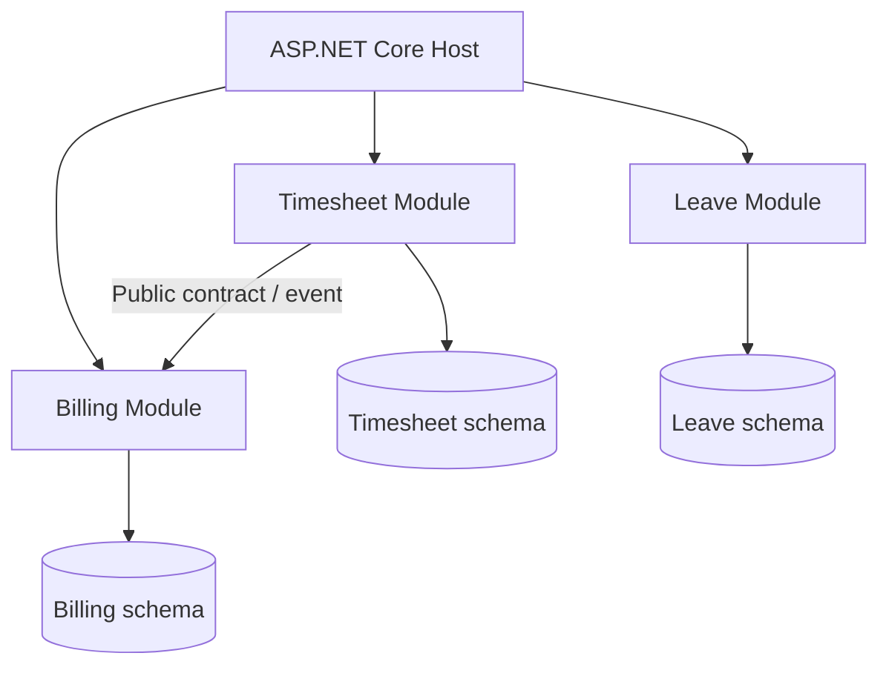
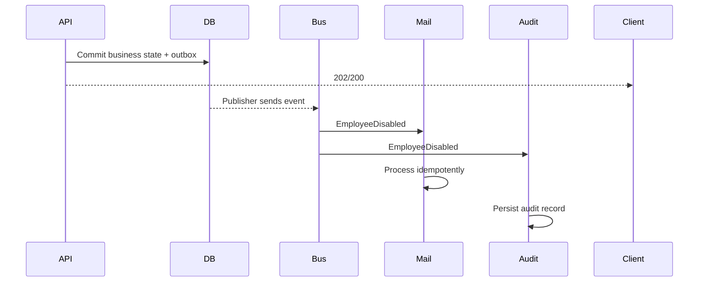
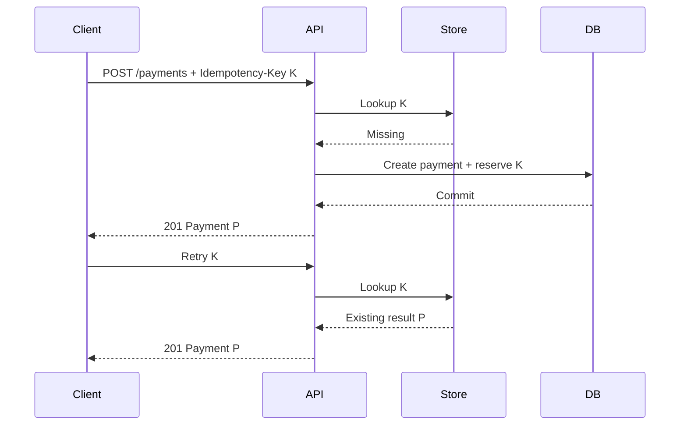
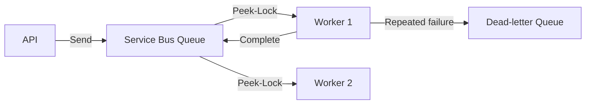
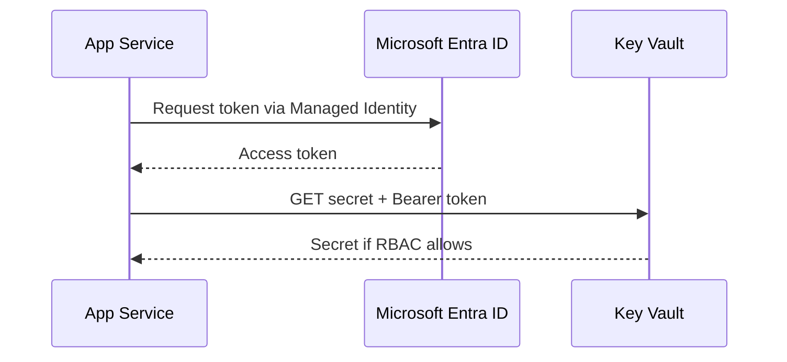
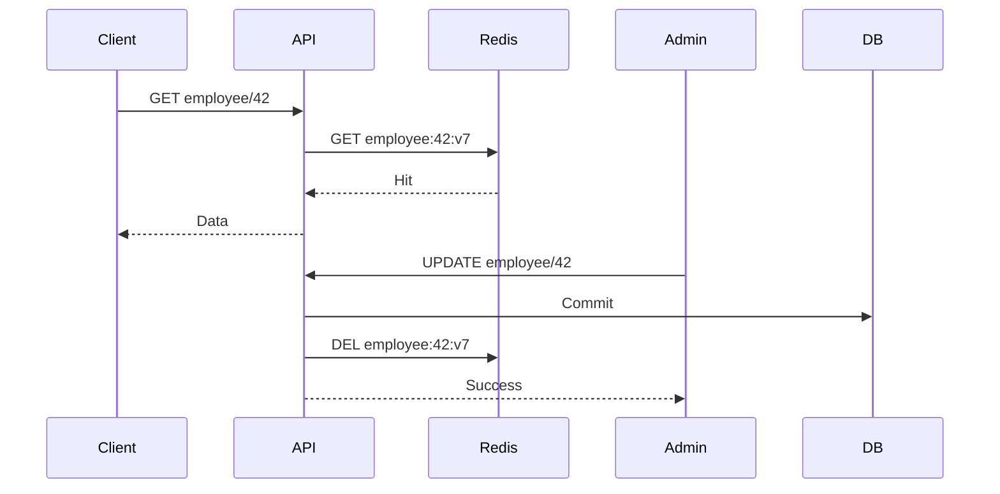
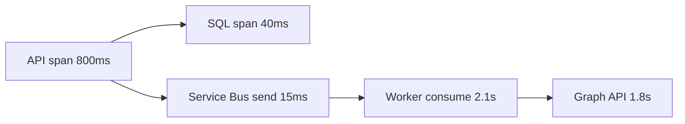
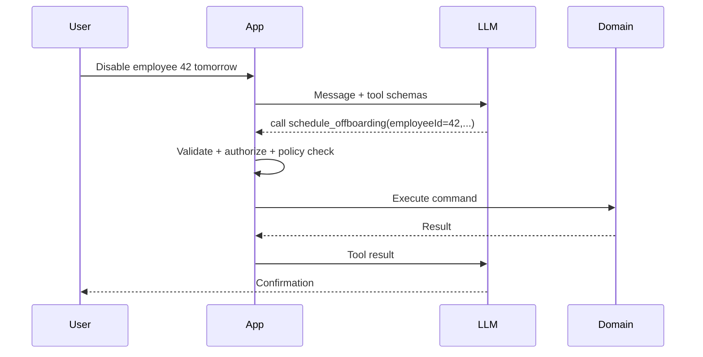
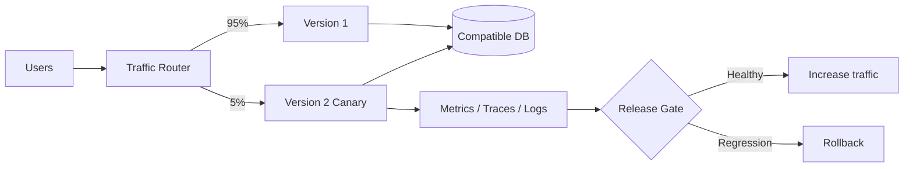

# Daily Knowledge Sharing — 2026-08-17

## Today’s Topics

1. Modular Monolith — module boundary trước khi nghĩ tới microservices
2. Event-Driven Architecture — event, delivery semantics và eventual consistency
3. API Idempotency — chống xử lý trùng trong payment và command API
4. Database Deadlock — hiểu wait-for cycle, điều tra và phòng tránh
5. Azure Service Bus — queue, topic, lock, retry và dead-letter
6. Managed Identity + Azure Key Vault — loại bỏ secret khỏi application configuration
7. Cache Invalidation — versioning, TTL và consistency trong distributed cache
8. OpenTelemetry Distributed Tracing — nối một request xuyên nhiều service
9. AI Tool Calling — để LLM quyết định ý định nhưng code kiểm soát hành động
10. Canary Deployment — giảm blast radius khi release production

---

# 1. Modular Monolith — module boundary trước khi nghĩ tới microservices

### 1. What is it?

Modular Monolith là một ứng dụng được deploy như **một đơn vị**, nhưng code và dữ liệu được chia thành các module nghiệp vụ có boundary rõ ràng. Ví dụ hệ thống SaaS có `Identity`, `Timesheet`, `Leave`, `Billing`; mỗi module sở hữu use case, domain model và contract của nó thay vì tất cả cùng truy cập một tập service/repository dùng chung.

Nó khác “monolith thông thường” ở chỗ dependency giữa module được kiểm soát. `Billing` không nên lấy `TimesheetDbContext` rồi query trực tiếp bảng nội bộ của Timesheet. Nó gọi public contract hoặc nhận integration event.

### 2. Why does it exist?

Một monolith nhỏ rất dễ phát triển, nhưng sau vài năm thường thành distributed spaghetti bên trong cùng process: controller gọi service bất kỳ, entity dùng chung khắp solution, thay một module làm hỏng module khác. Microservices giải quyết một số vấn đề boundary nhưng đưa vào network, deployment, messaging, observability và consistency complexity.

Modular Monolith giữ operational simplicity của một deployment nhưng buộc đội ngũ luyện đúng boundary. Nó cũng tạo đường tách service sau này nếu thật sự cần.

### 3. How does it work?



Một module thường có `Domain`, `Application`, `Infrastructure` riêng. Quan trọng hơn folder là rule: module khác chỉ thấy public API/contract, không thấy implementation nội bộ.

Có thể vẫn dùng một SQL Server instance, nhưng tách schema (`timesheet.*`, `billing.*`) và DbContext giúp ownership rõ hơn.

### 4. Practical example

```csharp
public interface ITimesheetModule
{
    Task<ApprovedHoursDto> GetApprovedHoursAsync(
        Guid employeeId,
        DateOnly month,
        CancellationToken ct);
}

internal sealed class TimesheetModule : ITimesheetModule
{
    private readonly TimesheetDbContext _db;

    public async Task<ApprovedHoursDto> GetApprovedHoursAsync(
        Guid employeeId, DateOnly month, CancellationToken ct)
    {
        var hours = await _db.Entries
            .Where(x => x.EmployeeId == employeeId &&
                        x.Month == month && x.Status == EntryStatus.Approved)
            .SumAsync(x => x.Hours, ct);

        return new ApprovedHoursDto(employeeId, month, hours);
    }
}
```

`Billing` phụ thuộc `ITimesheetModule`, không phụ thuộc `TimesheetDbContext` hay entity `TimesheetEntry`.

### 5. Real production scenario

Một hệ thống HR có Timesheet, Leave và Payroll. Payroll cần số giờ approved. Cách nhanh là query thẳng bảng Timesheet, nhưng sau đó Payroll phụ thuộc schema, enum và rule của Timesheet. Với module boundary, Timesheet công bố contract `GetApprovedHours` hoặc event `TimesheetPeriodApproved`. Payroll chỉ hiểu dữ liệu contract.

Nếu sau này tải Payroll tăng độc lập hoặc cần compliance riêng, boundary đã đủ sạch để cân nhắc tách thành service.

### 6. Common mistakes

- Chỉ tạo folder `Modules` nhưng module vẫn dùng entity và repository của nhau.
- Tạo `SharedKernel` khổng lồ, biến nó thành nơi chứa mọi abstraction.
- Tách database vật lý ngay từ đầu dù chưa có lý do vận hành.
- Dùng event cho mọi lời gọi nội bộ, làm flow đơn giản trở nên khó debug.
- Không có architecture test để ngăn dependency trái phép quay trở lại.

### 7. Trade-offs

**Advantages:** deployment đơn giản, transaction local dễ hơn microservices, boundary rõ, refactor/tách service thuận lợi.

**Costs / Risks:** cần discipline; một process vẫn có shared failure domain; scale thường theo toàn application; boundary sai vẫn tạo coupling dù folder đẹp.

### 8. Junior → Middle → Senior understanding

**Junior:** hiểu module là ownership nghiệp vụ, không chỉ là folder.

**Middle:** biết thiết kế public contract, DI registration, schema/DbContext riêng và tránh cross-module database access.

**Senior / Technical Lead:** quyết định boundary dựa trên business capability, team ownership, consistency và scaling; biết khi nào giữ monolith và khi nào extraction thực sự có ROI.

### 9. Key takeaway

- Module boundary quan trọng hơn số lượng project trong solution.
- Đừng dùng microservices để sửa coupling mà bạn chưa học cách kiểm soát trong monolith.
- Dữ liệu nội bộ của module phải có owner rõ ràng.

---

# 2. Event-Driven Architecture — event, delivery semantics và eventual consistency

### 1. What is it?

Event-Driven Architecture (EDA) tổ chức hệ thống quanh các sự kiện mô tả **một việc đã xảy ra**, ví dụ `EmployeeDisabled`, `OrderPaid`, `InvoiceIssued`. Producer phát event mà không cần biết mọi consumer. Consumer phản ứng độc lập.

Event khác command. `SendWelcomeEmail` là yêu cầu một hành động; `UserRegistered` là fact đã xảy ra. Sự phân biệt này ảnh hưởng ownership và coupling.

### 2. Why does it exist?

Nếu một request phải đồng bộ gọi 5 hệ thống phụ, latency và failure coupling tăng mạnh. Chỉ cần notification service timeout, nghiệp vụ chính có thể fail dù database đã có thể hoàn thành.

EDA cho phép core transaction kết thúc sớm và side effect chạy bất đồng bộ. Nó cũng cho phép thêm consumer mới mà producer ít thay đổi.

### 3. How does it work?



Production thường phải nghĩ đến **at-least-once delivery**: message có thể được giao lại. Vì vậy consumer phải idempotent. Nếu DB commit nhưng publish event thất bại, Outbox Pattern giúp lưu business change và event trong cùng local transaction rồi publisher gửi sau.

### 4. Practical example

```csharp
public sealed record EmployeeDisabled(
    Guid EventId,
    Guid EmployeeId,
    DateTimeOffset OccurredAt);

public async Task Handle(EmployeeDisabled message, CancellationToken ct)
{
    if (await _db.ProcessedMessages.AnyAsync(x => x.Id == message.EventId, ct))
        return;

    await _mailboxService.DisableAsync(message.EmployeeId, ct);
    _db.ProcessedMessages.Add(new ProcessedMessage(message.EventId));
    await _db.SaveChangesAsync(ct);
}
```

Ví dụ đơn giản cho thấy duplicate delivery không được tạo duplicate side effect.

### 5. Real production scenario

Khi employee chuyển Active → Inactive, HR API chỉ cần xác nhận trạng thái nhân sự. Sau commit, `EmployeeDisabled` có thể kích hoạt mailbox workflow, revoke access, audit, notification. Nếu Microsoft 365 tạm lỗi, HR transaction không cần rollback; consumer retry độc lập.

### 6. Common mistakes

- Publish event trước khi transaction database commit.
- Nghĩ message broker đảm bảo “exactly once” end-to-end.
- Event chứa toàn bộ internal entity khiến schema coupling rất mạnh.
- Consumer không idempotent.
- Không có DLQ, correlation ID, retry policy hoặc replay strategy.
- Dùng EDA cho request cần immediate consistency rồi cố che eventual consistency khỏi business.

### 7. Trade-offs

**Advantages:** loose coupling, resilience tốt hơn, scale consumer độc lập, dễ thêm reaction mới.

**Costs / Risks:** eventual consistency, duplicate/out-of-order event, khó trace, schema evolution và vận hành broker phức tạp hơn synchronous call.

### 8. Junior → Middle → Senior understanding

**Junior:** phân biệt command với event và hiểu asynchronous processing.

**Middle:** implement consumer idempotency, retry, DLQ, correlation và Outbox.

**Senior / Technical Lead:** quyết định consistency boundary, ordering requirement, partition key, event ownership, retention/replay và failure recovery.

### 9. Key takeaway

- Event là fact, không phải RPC được ngụy trang.
- At-least-once delivery đồng nghĩa consumer phải chịu được duplicate.
- EDA đổi synchronous coupling lấy consistency và operational complexity.

---

# 3. API Idempotency — chống xử lý trùng trong payment và command API

### 1. What is it?

Một operation idempotent cho phép client gửi cùng một logical request nhiều lần mà **kết quả nghiệp vụ chỉ được áp dụng một lần**. HTTP `GET`, `PUT`, `DELETE` có semantics idempotent theo thiết kế, nhưng `POST` tạo payment/order thường cần cơ chế bổ sung như `Idempotency-Key`.

Idempotency không có nghĩa server chỉ trả cùng status code. Mục tiêu là không tạo hai payment, hai order hoặc hai background job cho cùng một ý định.

### 2. Why does it exist?

Distributed system luôn có trạng thái mơ hồ: client timeout sau 5 giây nhưng server có thể đã commit ở giây thứ 4. Nếu client retry `POST /payments` và server xử lý lại, khách hàng bị charge hai lần.

Không retry thì mất reliability; retry mù thì duplicate side effect. Idempotency là cầu nối giữa hai yêu cầu đó.

### 3. How does it work?



Key nên gắn với caller/tenant và request fingerprint. Nếu cùng key nhưng payload khác, server nên reject thay vì âm thầm trả kết quả cũ.

### 4. Practical example

```csharp
public sealed class IdempotencyRecord
{
    public required string TenantId { get; init; }
    public required string Key { get; init; }
    public required string RequestHash { get; init; }
    public required string ResponseJson { get; set; }
}

// Database unique constraint: (TenantId, Key)
```

Request:

```http
POST /api/payments
Idempotency-Key: 4c96c80d-4f5d-4bb3-87f8-73b45f93d141
Content-Type: application/json

{"invoiceId":"INV-1001","amount":250000}
```

Việc reserve key và tạo payment nên nằm trong transaction phù hợp để hai request đồng thời không cùng thắng.

### 5. Real production scenario

Mobile app gửi submit timesheet trên mạng yếu. Người dùng bấm hai lần hoặc client tự retry. API nhận cùng operation key. Request đầu tạo submission và enqueue approval notification; request sau trả lại submission cũ, không tạo thêm workflow.

### 6. Common mistakes

- Dùng in-memory dictionary trong hệ thống nhiều instance.
- Check key rồi insert sau, tạo race condition.
- Không đặt unique constraint ở storage.
- Cho phép cùng key với payload khác.
- Giữ idempotency record vô hạn mà không có retention policy.
- Retry mọi POST nhưng không biết downstream side effect có idempotent hay không.

### 7. Trade-offs

**Advantages:** retry an toàn, UX tốt hơn, giảm duplicate transaction.

**Costs / Risks:** thêm storage, transaction/concurrency logic, retention và security scope. Cache-only implementation có thể mất key khi eviction.

### 8. Junior → Middle → Senior understanding

**Junior:** hiểu timeout không chứng minh server chưa xử lý.

**Middle:** biết thiết kế key, unique constraint, request hash và response replay.

**Senior / Technical Lead:** xác định idempotency boundary xuyên downstream, retention, tenant isolation và cách phối hợp với message processing/outbox.

### 9. Key takeaway

- Retry an toàn cần idempotency, đặc biệt với side effect tài chính.
- Database uniqueness là lớp bảo vệ quan trọng chống race.
- “Request timeout” là trạng thái unknown, không phải failed.

---

# 4. Database Deadlock — hiểu wait-for cycle, điều tra và phòng tránh

### 1. What is it?

Deadlock xảy ra khi hai hoặc nhiều transaction giữ resource mà transaction khác cần và tạo thành vòng chờ. Database không thể chờ mãi nên deadlock detector chọn một transaction làm **victim**, rollback nó để transaction khác tiếp tục.

Deadlock khác blocking. Blocking bình thường có thể tự hết khi transaction đang giữ lock commit; deadlock là cycle không thể tự phá nếu không rollback một bên.

### 2. Why does it exist?

Transaction và locking bảo vệ consistency. Nhưng khi nhiều request cập nhật resource theo thứ tự khác nhau, chính cơ chế bảo vệ đó tạo vòng chờ.

Ví dụ T1 lock Employee rồi lock Timesheet; T2 lock Timesheet rồi lock Employee. T1 đợi T2, T2 đợi T1.

### 3. How does it work?

```text
T1: holds Employee(42)  ----waits----> Timesheet(900)
 ^                                      |
 |                                      v
 +----------waits---- T2 holds Timesheet(900)
                      and wants Employee(42)
```

Database engine theo dõi wait graph. Khi phát hiện cycle, nó chọn victim dựa trên cost/priority rồi trả lỗi cho application.

### 4. Practical example

Code dễ gây thứ tự lock khác nhau:

```csharp
// Flow A
var employee = await db.Employees.SingleAsync(x => x.Id == employeeId, ct);
employee.Status = Status.Inactive;
await db.SaveChangesAsync(ct);

// Flow B elsewhere may update Timesheet first, then Employee.
```

Một cách giảm rủi ro là thống nhất thứ tự resource: mọi flow đều update `Employee` trước `Timesheet`; transaction càng ngắn càng tốt. Với SQL Server, thu thập deadlock graph bằng Extended Events thay vì đoán.

### 5. Real production scenario

Cuối tháng, hàng trăm nhân viên submit timesheet trong khi batch job khóa kỳ chấm công. API update entries rồi period; batch update period rồi entries. Deadlock tăng đột biến. Fix đúng không phải tăng timeout mà là đọc deadlock graph, xác định object/index/lock order, rồi chuẩn hóa access order hoặc giảm phạm vi transaction.

### 6. Common mistakes

- Nhầm deadlock với query chậm hoặc blocking.
- Chỉ thêm retry mà không sửa nguyên nhân.
- Transaction chứa HTTP call hoặc xử lý CPU dài.
- Thiếu index làm query scan nhiều row và giữ nhiều lock hơn.
- Update cùng resource theo thứ tự không nhất quán.
- Dùng isolation level cao hơn mà không đánh giá lock footprint.

### 7. Trade-offs

**Advantages của locking transaction:** consistency mạnh, model lập trình rõ.

**Costs / Risks:** contention, blocking, deadlock; index và access pattern trở thành yếu tố concurrency chứ không chỉ performance.

Retry deadlock victim là hợp lý khi operation idempotent, nhưng retry chỉ là safety net.

### 8. Junior → Middle → Senior understanding

**Junior:** phân biệt lock, blocking và deadlock.

**Middle:** đọc deadlock graph, kiểm tra execution plan/index và transaction boundary.

**Senior / Technical Lead:** thiết kế access order, workload partitioning, isolation strategy, retry policy và đánh giá contention khi scale.

### 9. Key takeaway

- Deadlock là cycle dependency, không phải “database bị chậm”.
- Transaction ngắn + lock order nhất quán + index đúng giải quyết nhiều trường hợp.
- Điều tra bằng evidence từ deadlock graph, không sửa bằng cảm giác.

---

# 5. Azure Service Bus — queue, topic, lock, retry và dead-letter

### 1. What is it?

Azure Service Bus là managed enterprise message broker. **Queue** phù hợp competing consumers: một message được một consumer logic xử lý. **Topic + Subscription** phù hợp publish/subscribe: một event có thể được nhiều subscriber nhận độc lập.

Nó cung cấp các capability như Peek-Lock, dead-letter queue, scheduled delivery, sessions, duplicate detection và message TTL.

### 2. Why does it exist?

Khi API gọi trực tiếp worker/downstream, producer bị phụ thuộc availability và latency của consumer. Broker hấp thụ burst, giữ message khi consumer tạm down và tách lifecycle hai phía.

Nó không tự giải quyết business consistency; application vẫn cần idempotency và đôi khi Outbox.

### 3. How does it work?



Với Peek-Lock, message chưa bị xóa khi consumer nhận. Consumer xử lý thành công thì `Complete`; lỗi có thể `Abandon`; lock hết hạn thì message có thể xuất hiện lại. Vì vậy duplicate delivery là bình thường.

### 4. Practical example

```csharp
var processor = client.CreateProcessor("mailbox-jobs", new ServiceBusProcessorOptions
{
    AutoCompleteMessages = false,
    MaxConcurrentCalls = 8,
    MaxAutoLockRenewalDuration = TimeSpan.FromMinutes(10)
});

processor.ProcessMessageAsync += async args =>
{
    var job = args.Message.Body.ToObjectFromJson<MailboxJob>();
    await handler.HandleAsync(job, args.CancellationToken);
    await args.CompleteMessageAsync(args.Message);
};
```

`MaxConcurrentCalls` phải dựa trên downstream capacity, không phải đặt càng lớn càng tốt.

### 5. Real production scenario

Employee offboarding tạo mailbox job. API ghi state và outbox; publisher đưa message vào Service Bus. Worker gọi Microsoft Graph/Exchange. Nếu Graph throttling, message được retry với backoff; lỗi poison sau ngưỡng đi DLQ để operator điều tra mà không block toàn queue.

### 6. Common mistakes

- Complete message trước khi side effect hoàn tất.
- Không thiết kế idempotent consumer.
- Đặt lock duration quá ngắn cho job dài nhưng không auto-renew.
- Retry nhanh khi downstream trả 429, tạo retry storm.
- Không monitor active message count, oldest message age và DLQ.
- Nhét payload quá lớn thay vì lưu blob rồi gửi reference.

### 7. Trade-offs

**Advantages:** durable messaging, decoupling, burst absorption, managed reliability.

**Costs / Risks:** thêm latency, eventual consistency, message duplication/order concerns và Azure cost/operations. Với workflow rất đơn giản, storage queue hoặc direct background processing có thể đủ.

### 8. Junior → Middle → Senior understanding

**Junior:** hiểu producer, queue, consumer, Complete và DLQ.

**Middle:** cấu hình concurrency, retry, lock renewal, idempotency và monitoring.

**Senior / Technical Lead:** chọn queue/topic/session, capacity, ordering, partitioning, DR, Outbox và failure policy theo business semantics.

### 9. Key takeaway

- Message broker tách availability nhưng không xóa failure complexity.
- Peek-Lock dẫn tới at-least-once behavior; consumer phải idempotent.
- DLQ phải có operational process, không phải “thùng rác để quên”.

---

# 6. Managed Identity + Azure Key Vault — loại bỏ secret khỏi application configuration

### 1. What is it?

Managed Identity cho Azure resource một identity do Azure quản lý để authenticate với dịch vụ khác mà application không phải giữ client secret. Azure Key Vault lưu secret, key và certificate tập trung với access control và audit.

Hai khái niệm thường đi cùng nhau nhưng không giống nhau: Managed Identity giải quyết **application là ai**; Key Vault giải quyết **secret/key được lưu và kiểm soát ở đâu**.

### 2. Why does it exist?

Connection string, API key và client secret trong `appsettings.json`, pipeline variable hoặc environment variable dễ bị leak, khó rotate và thường có quyền quá rộng. Tệ hơn, nhiều team dùng cùng một credential cho dev/staging/prod.

Managed Identity loại bỏ credential cho Azure-to-Azure authentication khi dịch vụ hỗ trợ Entra ID. Những secret bắt buộc còn lại được giữ trong Key Vault.

### 3. How does it work?



Production dùng Managed Identity; local development có thể dùng developer identity. `DefaultAzureCredential` hỗ trợ credential chain phù hợp hai môi trường.

### 4. Practical example

```csharp
var credential = new DefaultAzureCredential();
var client = new SecretClient(
    new Uri("https://myapp-prod-kv.vault.azure.net/"),
    credential);

KeyVaultSecret secret = await client.GetSecretAsync("ThirdPartyApiKey");
```

Tốt hơn nữa, nếu Azure SQL/Storage hỗ trợ token authentication thì app dùng Managed Identity trực tiếp và **không cần đọc password từ Key Vault**.

### 5. Real production scenario

ASP.NET Core trên App Service cần đọc một API key của vendor và truy cập Blob Storage. App Service Managed Identity được cấp `Key Vault Secrets User` cho đúng vault và `Storage Blob Data Contributor` cho đúng storage scope. Chỉ vendor key nằm trong Key Vault; Blob access không có account key trong config.

### 6. Common mistakes

- Đưa mọi Azure credential vào Key Vault dù có thể dùng identity trực tiếp.
- Cấp `Contributor` ở subscription thay vì least privilege data role.
- Cache secret vô hạn khiến rotation không có tác dụng.
- Không tách vault/permission theo environment phù hợp.
- Public network mở rộng dù workload có yêu cầu private connectivity.
- Log secret value khi debug lỗi configuration.

### 7. Trade-offs

**Advantages:** giảm secret sprawl, rotation và audit tốt hơn, credential lifecycle do Azure quản lý.

**Costs / Risks:** RBAC/networking phức tạp hơn; Key Vault dependency có latency/availability; local development cần identity setup; migration từ legacy secret có effort.

### 8. Junior → Middle → Senior understanding

**Junior:** hiểu secret không nên commit và identity khác secret store.

**Middle:** cấu hình Managed Identity, RBAC, `DefaultAzureCredential`, caching/rotation và diagnostics.

**Senior / Technical Lead:** thiết kế least privilege, environment isolation, private networking, break-glass access và secretless architecture tối đa có thể.

### 9. Key takeaway

- Ưu tiên identity-based access hơn lưu credential.
- Key Vault không phải lý do để tiếp tục tạo secret không cần thiết.
- Security tốt là giảm cả số secret lẫn phạm vi quyền.

---

# 7. Cache Invalidation — versioning, TTL và consistency trong distributed cache

### 1. What is it?

Cache invalidation là chiến lược đảm bảo dữ liệu cache không sống lâu hơn mức business chấp nhận sau khi source of truth thay đổi. Đây thường là phần khó nhất của caching: đọc cache rất dễ, xác định **khi nào cache không còn đúng** mới khó.

TTL chỉ là một cơ chế invalidation, không phải toàn bộ chiến lược. Hệ thống có thể dùng explicit delete, versioned key, event invalidation hoặc phối hợp nhiều cách.

### 2. Why does it exist?

Nếu cache không invalidate, người dùng thấy dữ liệu cũ. Nếu invalidate quá mạnh, hit ratio thấp và database lại chịu tải. Nếu nhiều instance cùng miss một hot key, cache stampede có thể đánh sập database.

Vì vậy cache design luôn là bài toán performance **và** consistency.

### 3. How does it work?



Với aggregate/list phức tạp, versioned namespace hữu ích: `employees:list:v18`. Khi data thay đổi, tăng version thay vì tìm/xóa hàng nghìn key. TTL vẫn là safety net nếu invalidation event bị mất.

### 4. Practical example

```csharp
public async Task<EmployeeDto?> GetAsync(Guid id, CancellationToken ct)
{
    var key = $"employee:{id}";
    var cached = await cache.GetStringAsync(key, ct);
    if (cached is not null)
        return JsonSerializer.Deserialize<EmployeeDto>(cached);

    var dto = await db.Employees.AsNoTracking()
        .Where(x => x.Id == id)
        .Select(x => new EmployeeDto(x.Id, x.Name, x.Status))
        .SingleOrDefaultAsync(ct);

    if (dto is not null)
        await cache.SetStringAsync(key, JsonSerializer.Serialize(dto),
            new DistributedCacheEntryOptions
            {
                AbsoluteExpirationRelativeToNow = TimeSpan.FromMinutes(5)
            }, ct);

    return dto;
}
```

Sau update thành công, xóa `employee:{id}`. Quan trọng: invalidate **sau commit**; xóa trước commit có thể để request khác repopulate dữ liệu cũ.

### 5. Real production scenario

Employee profile được đọc hàng nghìn lần nhưng update ít. Cache-aside giảm SQL load rất tốt. Tuy nhiên permission/authorization data nhạy cảm hơn: TTL 30 phút có thể khiến người vừa bị revoke quyền vẫn được phép truy cập nếu authorization dựa trên cache cũ. Loại dữ liệu này cần TTL ngắn hoặc invalidation đáng tin cậy hơn.

### 6. Common mistakes

- Cache dữ liệu mà không xác định staleness budget.
- Xóa cache trước DB commit.
- Dùng wildcard scan/delete trên Redis production.
- Không chống cache stampede cho hot key.
- Cache `null` vô hạn hoặc không negative-cache có kiểm soát.
- Coi Redis outage là lý do API phải outage dù cache chỉ là optimization.

### 7. Trade-offs

**Advantages:** giảm latency, database/network load, tăng throughput.

**Costs / Risks:** stale data, invalidation complexity, memory cost, serialization overhead, extra dependency. Strong consistency và aggressive caching thường xung đột.

### 8. Junior → Middle → Senior understanding

**Junior:** hiểu cache hit/miss và TTL.

**Middle:** implement cache-aside, invalidation-after-commit, stampede protection và graceful fallback.

**Senior / Technical Lead:** định nghĩa staleness budget theo data class, chọn event/version strategy, capacity và behavior khi cache partition/outage.

### 9. Key takeaway

- Trước khi cache, hãy trả lời “dữ liệu được phép cũ bao lâu?”.
- Invalidation phải gắn với transaction semantics.
- Cache là optimization; đừng vô tình biến nó thành single point of failure.

---

# 8. OpenTelemetry Distributed Tracing — nối một request xuyên nhiều service

### 1. What is it?

Distributed tracing ghi lại hành trình của một request qua nhiều component dưới dạng **trace** gồm nhiều **span**. Mỗi span đại diện một operation như HTTP request, SQL query, message processing hoặc external API call.

OpenTelemetry (OTel) cung cấp chuẩn instrumentation/export telemetry độc lập vendor. Bạn có thể instrument .NET một lần rồi export sang Application Insights, Jaeger, Grafana stack hoặc backend tương thích.

### 2. Why does it exist?

Trong monolith, stack trace và log thường đủ để biết request chậm ở đâu. Trong distributed system, request có thể đi API → Service Bus → Worker → Graph API → database. Log riêng từng service không tự cho biết chúng thuộc cùng một business operation.

Trace context (`trace-id`) nối các span thành một timeline, giúp thấy latency và failure nằm ở hop nào.

### 3. How does it work?



HTTP dùng W3C Trace Context (`traceparent`). Messaging cần propagate context qua message properties. Auto-instrumentation tạo nhiều span; custom `Activity` bổ sung business operation quan trọng.

### 4. Practical example

```csharp
builder.Services.AddOpenTelemetry()
    .WithTracing(tracing => tracing
        .AddAspNetCoreInstrumentation()
        .AddHttpClientInstrumentation()
        .AddEntityFrameworkCoreInstrumentation()
        .AddSource("MyCompany.Offboarding")
        .AddOtlpExporter());

private static readonly ActivitySource Source =
    new("MyCompany.Offboarding");

using var activity = Source.StartActivity("DisableEmployeeMailbox");
activity?.SetTag("employee.operation", "disable-mailbox");
```

Không gắn email, token hoặc PII nhạy cảm làm tag chỉ vì chúng tiện search.

### 5. Real production scenario

P95 offboarding tăng từ 3 giây lên 12 giây. Metrics chỉ nói latency tăng; log có hàng nghìn dòng. Trace cho thấy SQL chỉ 80 ms nhưng Graph call mất 9 giây và retry thêm 2 lần. Team tập trung đúng dependency thay vì tối ưu EF Core vô ích.

### 6. Common mistakes

- Trace 100% traffic ở hệ thống lớn mà không tính telemetry cost.
- Cardinality cực cao trong tag/metric dimension.
- Không propagate context qua queue/background job.
- Log PII/token vào span attributes.
- Instrument quá chi tiết đến mức trace đầy noise.
- Có trace nhưng không liên kết alert/runbook để engineer dùng khi incident.

### 7. Trade-offs

**Advantages:** root-cause latency tốt, nhìn dependency graph, correlation xuyên service.

**Costs / Risks:** storage/ingestion cost, sampling làm mất một số trace, instrumentation overhead và governance về dữ liệu telemetry.

### 8. Junior → Middle → Senior understanding

**Junior:** hiểu trace, span, trace-id và correlation.

**Middle:** cấu hình instrumentation/exporter, custom span và context propagation.

**Senior / Technical Lead:** thiết kế sampling, telemetry governance, SLO-driven observability, cost budget và chuẩn naming xuyên tổ chức.

### 9. Key takeaway

- Metrics nói “có vấn đề”; traces thường giúp nói “vấn đề nằm ở hop nào”.
- Context propagation là nền tảng của distributed tracing.
- Telemetry cũng là production data: phải kiểm soát cost và sensitive information.

---

# 9. AI Tool Calling — để LLM quyết định ý định nhưng code kiểm soát hành động

### 1. What is it?

Tool calling cho phép LLM chọn một function/tool có schema rõ ràng và cung cấp arguments có cấu trúc. Application mới là bên validate arguments, kiểm tra quyền, gọi API/database thực và trả result lại model.

LLM không trực tiếp “có quyền” xóa file hay gửi email chỉ vì model sinh ra JSON. Tool boundary là security boundary của application.

### 2. Why does it exist?

LLM giỏi hiểu ngôn ngữ tự nhiên nhưng không phải source of truth và không nên tự tạo side effect không kiểm soát. Nếu prompt yêu cầu “hãy cập nhật nhân viên này”, model cần một deterministic interface thay vì tự tưởng tượng SQL hoặc HTTP endpoint.

Tool calling tách **reasoning/intention** khỏi **execution/authorization**.

### 3. How does it work?



Một agent loop cần giới hạn số tool call, timeout, allowed tools, approval requirement và stop condition. Tool output cũng là untrusted input nếu đến từ web/email/document bên ngoài.

### 4. Practical example

```csharp
public sealed record DisableEmployeeArgs(Guid EmployeeId, DateTimeOffset EffectiveAt);

public async Task<ToolResult> DisableEmployeeAsync(
    ClaimsPrincipal user,
    DisableEmployeeArgs args,
    CancellationToken ct)
{
    if (!user.HasClaim("permission", "employee.disable"))
        return ToolResult.Forbidden();

    if (args.EffectiveAt < DateTimeOffset.UtcNow)
        return ToolResult.Invalid("EffectiveAt cannot be in the past.");

    return await offboarding.ScheduleAsync(args.EmployeeId, args.EffectiveAt, ct);
}
```

Authorization nằm trong deterministic code. Prompt “user is an admin” không thay thế policy check.

### 5. Real production scenario

Một internal AI assistant có tools đọc employee, tạo offboarding request và gửi notification. Read-only tool có thể chạy tự động. Tool gây irreversible side effect như delete mailbox yêu cầu human approval. Mọi invocation ghi audit gồm user, tool, validated arguments, result và correlation ID.

### 6. Common mistakes

- Tin arguments của model mà không validate.
- Để model quyết định authorization.
- Tool quá rộng như `execute_sql(sql)` hoặc `run_shell(command)`.
- Đưa secret vào prompt/tool result.
- Không giới hạn loop nên model gọi tool vô hạn.
- Tool result từ web chứa prompt injection và được coi là trusted instruction.
- Retry tool side effect mà không có idempotency.

### 7. Trade-offs

**Advantages:** kết hợp NLP flexibility với deterministic execution; schema rõ; dễ audit hơn free-form automation.

**Costs / Risks:** tool design, permission model, approval UX, retries và evaluation phức tạp; model vẫn có thể chọn sai tool hoặc arguments.

### 8. Junior → Middle → Senior understanding

**Junior:** hiểu model đề xuất tool call, application mới thực thi.

**Middle:** thiết kế schema hẹp, validation, timeout, retry/idempotency, audit và error result.

**Senior / Technical Lead:** thiết kế trust boundary, least privilege, approval tiers, prompt-injection defense, evaluation và blast-radius control.

### 9. Key takeaway

- LLM có thể quyết định **nên thử làm gì**; code quyết định **có được phép làm và làm thế nào**.
- Tool càng hẹp và typed càng dễ bảo vệ.
- Side effect cần authorization, idempotency, audit và đôi khi human approval.

---

# 10. Canary Deployment — giảm blast radius khi release production

### 1. What is it?

Canary Deployment đưa phiên bản mới tới một phần nhỏ traffic/user trước, quan sát health rồi tăng dần tỷ lệ nếu ổn. Thay vì đổi 100% production cùng lúc, rollout có thể là 1% → 5% → 25% → 50% → 100%.

Canary khác feature flag: canary điều khiển **phiên bản runtime nhận traffic**; feature flag điều khiển **behavior/functionality** trong code. Hai kỹ thuật có thể phối hợp.

### 2. Why does it exist?

Test/staging không thể mô phỏng hoàn toàn production traffic, data distribution và dependency behavior. Một bug memory leak hoặc query regression chỉ xuất hiện ở tải thật có thể ảnh hưởng toàn bộ khách hàng nếu deploy all-at-once.

Canary giới hạn blast radius và tạo cơ hội rollback trước khi lỗi lan rộng.

### 3. How does it work?



Release gate phải dựa trên signal như error rate, p95/p99 latency, saturation và business KPI. “Pod vẫn running” không đủ để kết luận release tốt.

### 4. Practical example

Một pipeline có thể đặt gate logic:

```text
Deploy v2 to 5%
Wait 10 minutes
Require:
  HTTP 5xx < 0.5%
  p95 latency regression < 15%
  checkout success rate >= baseline - 1%
If pass -> 25%
If fail -> route 100% back to v1
```

ASP.NET Core app cần backward-compatible database migration vì v1 và v2 có thể chạy đồng thời.

### 5. Real production scenario

Release Timesheet API thay đổi query summary. 5% traffic vào v2. Application Insights cho thấy error rate bình thường nhưng p95 DB duration tăng 4 lần với tenant lớn. Automated gate dừng rollout và rollback. Chỉ 5% traffic bị ảnh hưởng trong thời gian ngắn thay vì toàn bộ khách hàng.

### 6. Common mistakes

- Canary nhưng cả v1/v2 dùng migration phá backward compatibility.
- Chỉ nhìn CPU/health check, không nhìn business KPI.
- Canary group quá nhỏ nên không đại diện workload.
- Không có automated rollback hoặc rollback quá chậm.
- Session/state khiến user nhảy giữa version và behavior bất nhất.
- Thay đổi queue consumer schema mà chỉ canary HTTP traffic.

### 7. Trade-offs

**Advantages:** blast radius nhỏ, validation bằng traffic thật, rollback sớm, confidence cao hơn.

**Costs / Risks:** routing/pipeline phức tạp, phải chạy nhiều version đồng thời, database/event compatibility khó hơn, cần observability đủ tốt.

Blue-Green đơn giản hơn về switch environment nhưng thường chuyển traffic lớn hơn tại một thời điểm; canary cho rollout granular hơn.

### 8. Junior → Middle → Senior understanding

**Junior:** hiểu rollout dần và rollback.

**Middle:** biết health metric, deployment slot/routing, backward compatibility và release gate.

**Senior / Technical Lead:** thiết kế progressive delivery theo risk class, statistical signal, database/event evolution, rollback strategy và SLO/error budget.

### 9. Key takeaway

- Canary không làm release hết lỗi; nó giảm số người chịu lỗi khi giả định của ta sai.
- Observability là điều kiện bắt buộc để canary có ý nghĩa.
- Schema và contract phải tương thích khi nhiều version chạy song song.