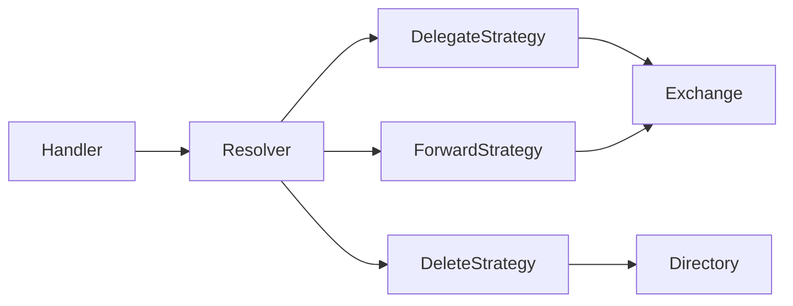
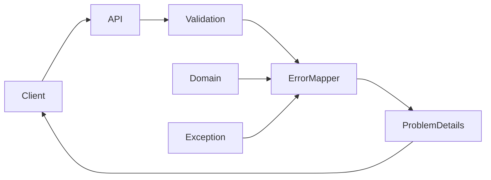
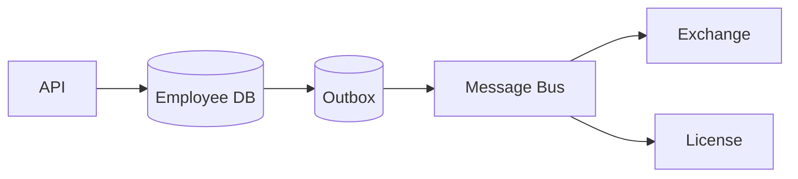
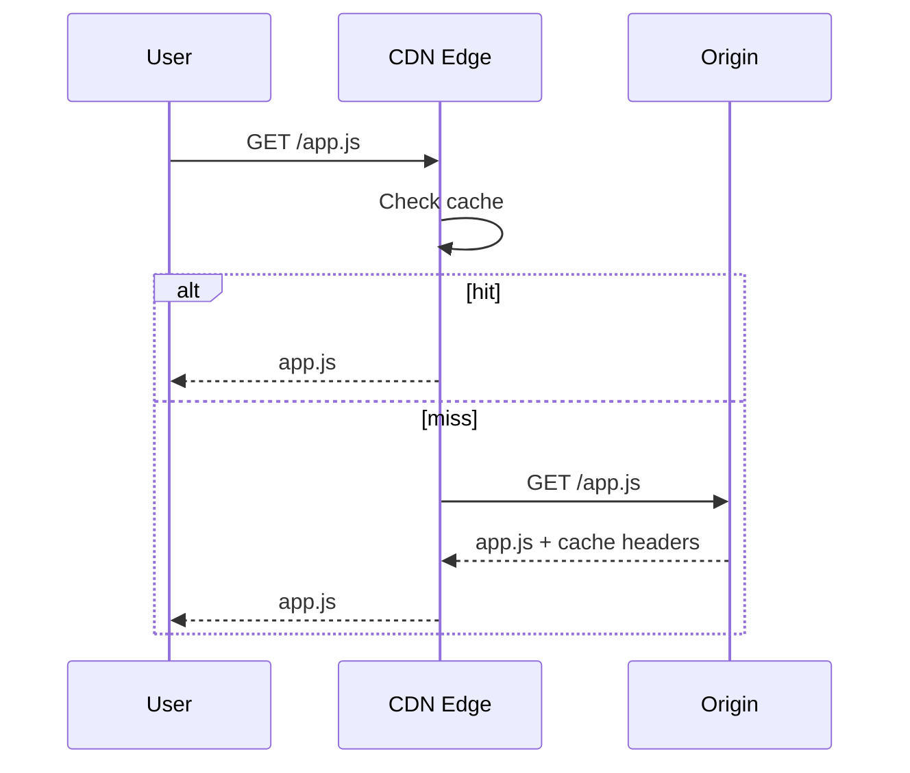
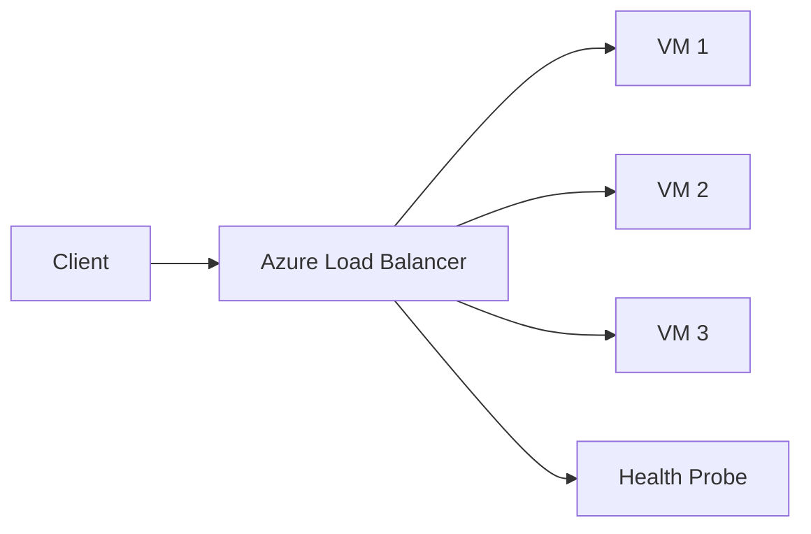
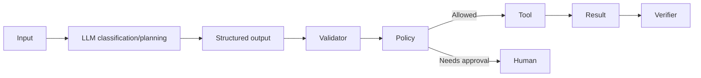

# Daily Knowledge Sharing — 2026-08-17

## Today’s Topics

1. Strategy Pattern trong backend — thay `switch` bằng behavior có cấu trúc
2. REST Error Contracts — thiết kế lỗi nhất quán và có thể quan sát
3. API Pagination — offset, cursor và consistency khi dữ liệu thay đổi
4. SQL Query Optimization — từ symptom đến execution plan
5. Data Consistency & CAP — chọn consistency boundary đúng cho distributed systems
6. CDN — giảm latency và tải origin đúng cách
7. Azure DNS — DNS record, TTL và failover considerations
8. Azure Load Balancer — Layer 4 traffic distribution và health probes
9. AI Workflow Automation — tách quyết định của LLM khỏi deterministic control
10. Technical Design Review — biến requirement thành quyết định kỹ thuật có thể kiểm chứng

---

# 1. Strategy Pattern trong backend — thay `switch` bằng behavior có cấu trúc

### 1. What is it?

Strategy Pattern cho phép đóng gói nhiều cách xử lý khác nhau dưới cùng một abstraction. Thay vì một service chứa `switch` lớn để quyết định behavior theo loại nghiệp vụ, mỗi strategy chịu trách nhiệm cho một nhánh riêng.

Ví dụ trong offboarding, `Delegate`, `Forward`, `Delete` đều là các email action khác nhau nhưng cùng thuộc một use case. Strategy giúp mỗi action có implementation riêng mà orchestration vẫn thống nhất.

### 2. Why does it exist?

Khi một service bắt đầu chứa nhiều nhánh:

```csharp
switch (action)
{
    case EmailAction.Delegate:
        // 40 lines
        break;
    case EmailAction.Forward:
        // 50 lines
        break;
    case EmailAction.Delete:
        // 30 lines
        break;
}
```

thì các vấn đề xuất hiện:

* mỗi action có dependency khác nhau nhưng service phải inject tất cả;
* test một nhánh vẫn phải dựng cả service lớn;
* thêm action mới làm class lớn dần;
* logic validation và side effect dễ bị trộn.

### 3. How does it work?



Flow:

1. Handler nhận request.
2. Resolver chọn strategy theo action.
3. Strategy validate điều kiện riêng.
4. Strategy thực hiện side effect.
5. Handler xử lý logging, transaction hoặc response chung.

### 4. Practical example

```csharp
public interface IEmailActionStrategy
{
    EmailAction Action { get; }
    Task ExecuteAsync(Employee employee, MailConfig config, CancellationToken ct);
}

public sealed class ForwardEmailStrategy : IEmailActionStrategy
{
    private readonly IExchangeService _exchange;

    public EmailAction Action => EmailAction.Forward;

    public ForwardEmailStrategy(IExchangeService exchange)
    {
        _exchange = exchange;
    }

    public Task ExecuteAsync(Employee employee, MailConfig config, CancellationToken ct)
    {
        if (string.IsNullOrWhiteSpace(config.TargetEmail))
            throw new InvalidOperationException("Target email is required.");

        return _exchange.SetForwardingAsync(employee.Email, config.TargetEmail, ct);
    }
}
```

Resolver:

```csharp
public sealed class EmailActionStrategyResolver
{
    private readonly IReadOnlyDictionary<EmailAction, IEmailActionStrategy> _map;

    public EmailActionStrategyResolver(IEnumerable<IEmailActionStrategy> strategies)
    {
        _map = strategies.ToDictionary(x => x.Action);
    }

    public IEmailActionStrategy Resolve(EmailAction action) =>
        _map.TryGetValue(action, out var strategy)
            ? strategy
            : throw new NotSupportedException($"Unsupported action: {action}");
}
```

### 5. Real production scenario

Trong employee offboarding, mỗi action có yêu cầu khác nhau:

* Delegate cần permission assignment.
* Forward cần target email và end time.
* Delete có thể trigger mailbox cleanup khác hẳn.

Nếu tất cả nằm trong một service lớn, thay đổi một action dễ làm regression action khác. Strategy chia behavior theo business capability rõ hơn.

### 6. Common mistakes

* Dùng Strategy cho 2 nhánh cực đơn giản rồi tạo quá nhiều class.
* Strategy tự xử lý transaction riêng khiến boundary không nhất quán.
* Resolver dùng service locator kiểu `IServiceProvider.GetService()` khắp nơi.
* Strategy chứa business orchestration toàn hệ thống thay vì behavior cụ thể.
* Không có fallback rõ ràng khi action không được hỗ trợ.

### 7. Trade-offs

**Advantages**

* Dễ test và mở rộng.
* Giảm `switch` phình to.
* Dependency của từng behavior rõ ràng.

**Costs / Risks**

* Tăng số class.
* Có thể overengineering nếu behavior ít và đơn giản.
* Cần resolver/factory và convention rõ ràng.

### 8. Junior → Middle → Senior understanding

**Junior**: hiểu interface đại diện cho nhiều implementation khác nhau.

**Middle**: biết registration DI, resolver và test từng strategy độc lập.

**Senior / Technical Lead**: biết khi nào Strategy thực sự giảm coupling, khi nào chỉ đổi một `switch` đơn giản thành ceremony. Cần giữ transaction, logging và policy chung ở đúng layer.

### 9. Key takeaway

* Strategy phù hợp khi behavior thay đổi độc lập.
* Không phải mọi `switch` đều cần pattern.
* Pattern tốt phải làm boundary rõ hơn, không chỉ làm code “trông đẹp”.

---

# 2. REST Error Contracts — thiết kế lỗi nhất quán

### 1. What is it?

Error contract là format lỗi ổn định mà API trả cho client. Mục tiêu không chỉ là trả status code đúng, mà còn giúp frontend, mobile, integration và observability hiểu lỗi theo cùng một cách.

### 2. Why does it exist?

Nếu endpoint A trả:

```json
{ "error": "bad request" }
```

endpoint B trả:

```json
{ "message": "invalid employee" }
```

và endpoint C trả stack trace, client phải viết logic riêng cho từng API. Điều này tạo coupling và khó debug.

### 3. How does it work?

Một error contract nên phân biệt:

* machine-readable code;
* human-readable message;
* HTTP status;
* correlation/trace id;
* field validation errors;
* optional metadata an toàn.



### 4. Practical example

ASP.NET Core có thể chuẩn hóa bằng `ProblemDetails`:

```csharp
return Results.Problem(
    statusCode: StatusCodes.Status409Conflict,
    title: "Employee update conflict",
    detail: "The employee was changed by another user.",
    extensions: new Dictionary<string, object?>
    {
        ["code"] = "employee_concurrency_conflict",
        ["traceId"] = Activity.Current?.TraceId.ToString()
    });
```

Validation response:

```json
{
  "type": "https://example/errors/validation",
  "title": "Validation failed",
  "status": 400,
  "code": "validation_failed",
  "errors": {
    "targetEmail": ["Target email is required for forwarding."]
  },
  "traceId": "..."
}
```

### 5. Real production scenario

Microsoft 365 integration gọi Graph rồi Graph trả `429`. API của bạn không nên trả nguyên raw Graph response cho frontend. Internal integration layer map lỗi thành contract business phù hợp, log downstream error riêng, và chỉ expose thông tin cần thiết.

### 6. Common mistakes

* Trả `200 OK` với `{ success:false }` cho mọi lỗi.
* Expose stack trace hoặc internal exception message.
* Dùng message text làm machine contract.
* Không có trace ID nên support không tìm được request trong logs.
* Dùng cùng `500` cho validation, conflict và downstream timeout.

### 7. Trade-offs

**Advantages**

* Client handling đơn giản.
* Observability tốt hơn.
* Backward compatibility rõ hơn.

**Costs / Risks**

* Cần governance để code lỗi không bị duplicate hoặc đổi tùy tiện.
* Contract quá chi tiết có thể leak internal information.

### 8. Junior → Middle → Senior understanding

**Junior**: hiểu status code và response body phải có ý nghĩa nhất quán.

**Middle**: biết middleware/exception handler, mapping domain errors và validation errors.

**Senior / Technical Lead**: xác định taxonomy lỗi, compatibility rule, security boundary, traceability và cách map lỗi downstream thành contract public.

### 9. Key takeaway

* Error contract là API contract thật sự.
* Machine code ổn định quan trọng hơn message text.
* Luôn tách thông tin dành cho client khỏi thông tin dành cho logs.

---

# 3. API Pagination — offset, cursor và consistency

### 1. What is it?

Pagination chia tập kết quả lớn thành từng phần nhỏ. Hai cách phổ biến là offset pagination và cursor/keyset pagination.

### 2. Why does it exist?

Trả hàng chục nghìn rows trong một request gây:

* query lâu;
* memory allocation lớn;
* response JSON lớn;
* network latency cao;
* client render chậm.

### 3. How does it work?

Offset:

```sql
ORDER BY CreatedAt DESC
OFFSET 1000 ROWS FETCH NEXT 50 ROWS ONLY;
```

Cursor/keyset:

```sql
WHERE CreatedAt < @LastCreatedAt
ORDER BY CreatedAt DESC
FETCH FIRST 50 ROWS ONLY;
```

Cursor tránh phải “đếm bỏ” nhiều rows và ổn định hơn khi dataset thay đổi.

### 4. Practical example

```csharp
var query = db.Orders
    .AsNoTracking()
    .OrderByDescending(x => x.CreatedAt)
    .ThenByDescending(x => x.Id);

if (cursor is not null)
{
    query = query.Where(x =>
        x.CreatedAt < cursor.CreatedAt ||
        (x.CreatedAt == cursor.CreatedAt && x.Id.CompareTo(cursor.Id) < 0));
}

var items = await query.Take(51).ToListAsync(ct);
```

Dùng `(CreatedAt, Id)` làm stable ordering key giúp tránh duplicate khi timestamp bằng nhau.

### 5. Real production scenario

Audit log có hàng triệu records và liên tục phát sinh mới. Offset page 10 có thể thay đổi khi có records mới chèn ở đầu. Cursor pagination giữ continuity tốt hơn cho feed kiểu timeline.

### 6. Common mistakes

* Không có `ORDER BY` deterministic.
* Dùng offset rất sâu trên table lớn.
* Cursor chỉ chứa timestamp nhưng timestamp không unique.
* Return total count cho mọi request dù count rất đắt.
* Cho client tự sửa cursor mà không validate.

### 7. Trade-offs

**Offset advantages**: dễ hiểu, dễ jump tới page N.

**Offset costs**: chậm khi page sâu, dễ inconsistency khi dataset thay đổi.

**Cursor advantages**: nhanh và ổn định hơn cho large/active datasets.

**Cursor costs**: khó jump page tùy ý, contract phức tạp hơn.

### 8. Junior → Middle → Senior understanding

**Junior**: hiểu vì sao không trả toàn bộ dataset.

**Middle**: biết offset vs cursor và stable ordering.

**Senior / Technical Lead**: chọn strategy theo UX, query pattern, consistency requirement và index design.

### 9. Key takeaway

* Pagination là database concern lẫn API contract concern.
* Cursor cần stable sort key.
* Total count không phải lúc nào cũng đáng chi phí.

---

# 4. SQL Query Optimization — từ symptom đến execution plan

### 1. What is it?

Query optimization là quá trình đo, xác định bottleneck và cải thiện cách database thực thi query. Nó không đồng nghĩa với “thêm index”.

### 2. Why does it exist?

Một API chậm có thể do:

* table scan;
* bad join order;
* missing statistics;
* parameter sensitivity;
* excessive sorting;
* non-sargable predicate;
* quá nhiều round trips;
* projection quá lớn.

### 3. How does it work?

```text
Symptom
  ↓
Measure duration / reads
  ↓
Execution plan
  ↓
Find expensive operator
  ↓
Form hypothesis
  ↓
Change query/index/schema
  ↓
Measure again
```

### 4. Practical example

Không tốt:

```sql
SELECT *
FROM Employee
WHERE YEAR(CreatedAt) = 2026;
```

Tốt hơn:

```sql
SELECT Id, Name, CreatedAt
FROM Employee
WHERE CreatedAt >= '2026-01-01'
  AND CreatedAt <  '2027-01-01';
```

Predicate thứ hai cho phép index seek dễ hơn nếu có index phù hợp trên `CreatedAt`.

### 5. Real production scenario

Timesheet report chậm 12 giây. CPU DB không cao nhưng logical reads lên hàng triệu. Execution plan cho thấy scan table lớn do function trên indexed column. Chỉ sửa predicate có thể giảm query xuống dưới 1 giây mà không cần Redis.

### 6. Common mistakes

* Optimize bằng cảm giác.
* Không đo logical reads.
* `SELECT *` ở mọi nơi.
* Thêm index trùng lặp.
* Ignore cardinality estimate sai.
* Fix query A nhưng làm write workload tệ hơn.

### 7. Trade-offs

**Advantages**: latency và DB capacity cải thiện trực tiếp.

**Costs/Risks**: index thêm write cost; query hint có thể làm plan cứng; optimization quá riêng cho một workload có thể phản tác dụng khi dữ liệu thay đổi.

### 8. Junior → Middle → Senior understanding

**Junior**: hiểu scan, seek và projection.

**Middle**: đọc execution plan, statistics IO, join và index cơ bản.

**Senior / Technical Lead**: cân bằng query tuning với schema, workload, parameter patterns, maintainability và operational cost.

### 9. Key takeaway

* Đo trước, tối ưu sau.
* Execution plan là bằng chứng, không phải đoán mò.
* Query, index và schema phải được nhìn cùng nhau.

---

# 5. Data Consistency & CAP — chọn consistency boundary

### 1. What is it?

Trong distributed systems, consistency không còn là chuyện một transaction duy nhất. CAP nhắc rằng khi network partition xảy ra, hệ thống phải lựa chọn giữa tiếp tục availability hoặc giữ consistency chặt ở một số luồng.

### 2. Why does it exist?

Khi dữ liệu nằm ở nhiều service/database, không thể giả định mọi write đều commit atomically như trong một database transaction.

Ví dụ:

```text
Employee DB updated
   ↓
Service Bus event
   ↓
Exchange mailbox updated
   ↓
License system updated
```

Các bước có thể fail độc lập.

### 3. How does it work?



Thay vì distributed transaction, thường dùng:

* local transaction;
* outbox;
* idempotent consumer;
* retry;
* compensating action;
* reconciliation job.

### 4. Practical example

```csharp
await using var tx = await db.Database.BeginTransactionAsync(ct);

employee.Deactivate();
db.OutboxMessages.Add(OutboxMessage.From(new EmployeeDeactivated(employee.Id)));

await db.SaveChangesAsync(ct);
await tx.CommitAsync(ct);
```

Publisher đọc outbox và gửi event sau đó. Như vậy state change và intent-to-publish cùng commit trong một DB transaction.

### 5. Real production scenario

Employee đã inactive trong HR nhưng Exchange Online đang outage. Hệ thống có thể chấp nhận eventual consistency: HR state đúng ngay, mailbox cleanup retry sau. Tuy nhiên payment balance có thể yêu cầu consistency boundary chặt hơn.

### 6. Common mistakes

* Dùng “eventual consistency” để biện minh cho mọi inconsistency.
* Không có reconciliation.
* Không biết business chấp nhận stale bao lâu.
* Consumer không idempotent.
* Publish event ngoài transaction và có cửa sổ mất event.

### 7. Trade-offs

**Advantages**: resilience và scalability tốt hơn khi không ép distributed transaction.

**Costs/Risks**: trạng thái tạm thời không đồng nhất, debugging khó, cần retry/reconciliation/audit.

### 8. Junior → Middle → Senior understanding

**Junior**: hiểu nhiều service không thể commit như một DB transaction duy nhất.

**Middle**: biết outbox, retry, idempotency và compensating action.

**Senior / Technical Lead**: xác định consistency requirement theo business, tối đa stale duration, failure recovery và observability.

### 9. Key takeaway

* Consistency là business decision trước khi là technical decision.
* Eventual consistency phải có recovery path.
* Outbox là pattern rất thực tế để nối DB state với event publishing.

---

# 6. CDN — giảm latency và tải origin

### 1. What is it?

CDN phân phối nội dung qua các edge location gần người dùng. Thay vì mọi request phải đi tới origin server, cacheable content có thể được phục vụ từ edge.

### 2. Why does it exist?

Nếu origin đặt ở một region, người dùng ở xa chịu network round-trip cao. Ngoài ra origin phải xử lý lặp lại cùng static asset.

### 3. How does it work?



Cache behavior phụ thuộc `Cache-Control`, TTL, query string policy, purge/invalidation và origin configuration.

### 4. Practical example

ASP.NET Core/static origin trả:

```http
Cache-Control: public, max-age=31536000, immutable
```

cho file fingerprinted:

```text
app.8f3a91c.js
```

Khi release bản mới, filename đổi nên không cần purge toàn bộ cache.

### 5. Real production scenario

Web app phục vụ JavaScript bundle, images và downloadable documents cho user toàn cầu. CDN giảm latency và bandwidth origin, nhưng API chứa dữ liệu user-specific không nên cache public nếu không có policy đúng.

### 6. Common mistakes

* Cache response có dữ liệu user-specific.
* Dùng URL không versioned nhưng TTL rất dài.
* Không hiểu cache key có include query string/header hay không.
* Purge quá thường xuyên làm mất lợi ích CDN.
* Cho rằng CDN tự tối ưu dynamic API mọi trường hợp.

### 7. Trade-offs

**Advantages**: latency thấp, giảm origin load, hấp thụ traffic spike.

**Costs/Risks**: stale content, invalidation complexity, thêm cost và configuration layer.

### 8. Junior → Middle → Senior understanding

**Junior**: hiểu edge cache và origin.

**Middle**: biết cache headers, TTL, versioned assets và purge.

**Senior / Technical Lead**: thiết kế cache key, security boundary, multi-region strategy, origin shielding và cost model.

### 9. Key takeaway

* CDN hiệu quả nhất khi asset cacheable và versioned.
* Cache policy sai có thể trở thành security bug.
* Invalidation là phần khó nhất của caching ở edge.

---

# 7. Azure DNS — record, TTL và failover considerations

### 1. What is it?

Azure DNS là managed DNS hosting. Nó lưu authoritative DNS records cho domain và trả lời mapping tên miền thành endpoint.

### 2. Why does it exist?

DNS là lớp nền tảng để client tìm service. Quản lý DNS thủ công hoặc rải rác gây khó kiểm soát record lifecycle và deployment.

### 3. How does it work?

```text
api.example.com
    ↓ A/CNAME
frontdoor.azurefd.net
    ↓
Application origin
```

TTL quyết định resolver có thể cache record bao lâu. TTL thấp giúp thay đổi nhanh hơn nhưng tăng DNS query volume; TTL cao ổn định hơn nhưng failover chậm hơn.

### 4. Practical example

Một setup phổ biến:

```text
api.example.com  CNAME  my-frontdoor.azurefd.net
```

Khi migrate endpoint, DNS change cần tính đến TTL cũ đã được resolver cache.

### 5. Real production scenario

Team chuyển production từ App Service trực tiếp sang Azure Front Door. Nếu record TTL là 1 giờ, một phần user có thể vẫn hit endpoint cũ trong tối đa khoảng thời gian cache đó.

### 6. Common mistakes

* Đổi DNS và kỳ vọng toàn Internet cập nhật ngay.
* TTL quá thấp mọi lúc.
* Xóa endpoint cũ trước khi TTL hết.
* Không quản lý ownership của DNS records.
* Nhầm DNS failover với application health failover.

### 7. Trade-offs

**Advantages**: managed, tích hợp Azure, automation tốt.

**Costs/Risks**: DNS caching khó kiểm soát hoàn toàn; failover không instant; misconfiguration có blast radius lớn.

### 8. Junior → Middle → Senior understanding

**Junior**: hiểu A/CNAME và TTL.

**Middle**: biết migration/failover phải tính propagation và caching.

**Senior / Technical Lead**: thiết kế DNS lifecycle, disaster recovery, ownership, automation và rollback path.

### 9. Key takeaway

* DNS là distributed cache toàn cầu.
* TTL là operational parameter, không chỉ configuration nhỏ.
* Luôn giữ endpoint cũ đủ lâu khi cutover.

---

# 8. Azure Load Balancer — Layer 4 traffic distribution

### 1. What is it?

Azure Load Balancer phân phối TCP/UDP traffic ở Layer 4 giữa các backend instances. Nó không hiểu route HTTP như `/api/orders`; nó chủ yếu nhìn IP, port và transport-level flow.

### 2. Why does it exist?

Một VM đơn lẻ là single point of failure và giới hạn capacity. Load Balancer cho phép nhiều backend instances cùng phục vụ traffic.

### 3. How does it work?



Health probe xác định backend nào đang healthy. Traffic chỉ nên đi tới instances vượt probe.

### 4. Practical example

Nếu ASP.NET Core chạy trên ba VMs port 8080, load-balancing rule có thể map frontend port 443/TCP về backend pool phù hợp thông qua architecture có TLS termination riêng hoặc trực tiếp tùy setup.

Health endpoint nên phản ánh khả năng phục vụ traffic thực tế, nhưng không nên check quá nhiều dependency đến mức một lỗi minor làm toàn bộ instance bị loại khỏi pool.

### 5. Real production scenario

Background API chạy trên VM Scale Set. Một VM bị crash hoặc deploy lỗi; probe fail và Load Balancer ngừng route traffic tới node đó trong khi các node khác tiếp tục phục vụ.

### 6. Common mistakes

* Dùng Load Balancer khi thực ra cần Layer 7 routing/WAF.
* Health probe chỉ check process alive nhưng app unusable.
* Health probe quá strict làm cả pool bị unhealthy vì dependency phụ.
* Lưu session state local khiến user behavior phụ thuộc backend instance.

### 7. Trade-offs

**Advantages**: throughput cao, simple Layer 4 distribution, HA cho VM workloads.

**Costs/Risks**: không có HTTP-aware routing như Application Gateway/Front Door; stateful app khó scale.

### 8. Junior → Middle → Senior understanding

**Junior**: hiểu frontend IP, backend pool và health probe.

**Middle**: biết rule, probe, stateless app và scaling.

**Senior / Technical Lead**: chọn giữa Load Balancer, Application Gateway, Front Door dựa trên layer, TLS, WAF, routing và regional/global scope.

### 9. Key takeaway

* Azure Load Balancer là Layer 4.
* Health probe quyết định availability thực tế.
* Chọn load-balancing product dựa trên protocol và routing requirement.

---

# 9. AI Workflow Automation — LLM quyết định gì, code kiểm soát gì

### 1. What is it?

AI workflow automation là workflow trong đó LLM xử lý phần fuzzy như hiểu intent, phân loại, trích xuất hoặc lập kế hoạch; còn deterministic code kiểm soát validation, permissions, retries, side effects và stop conditions.

### 2. Why does it exist?

Nếu giao toàn bộ workflow cho model:

```text
"Read ticket, decide what to do, call any tool you need, finish the task."
```

thì hệ thống khó kiểm soát:

* model gọi tool sai;
* loop vô hạn;
* cost tăng;
* action nguy hiểm không có approval;
* output không reproducible.

### 3. How does it work?



### 4. Practical example

```csharp
public sealed record AgentDecision(
    string Action,
    double Confidence,
    Dictionary<string, string> Parameters);

if (decision.Confidence < 0.85)
    return RequiresHumanReview();

if (!allowedActions.Contains(decision.Action))
    return Reject("Unsupported action");

await toolExecutor.ExecuteAsync(decision.Action, decision.Parameters, ct);
```

Model chọn action; code quyết định action đó có được phép chạy hay không.

### 5. Real production scenario

AI agent triage production incident:

* đọc logs/traces;
* đề xuất root cause;
* có thể chạy read-only diagnostics tự động;
* restart service hoặc execute database fix phải cần approval.

Đây là permission boundary quan trọng.

### 6. Common mistakes

* Cho model quyền tool quá rộng.
* Không có max steps/timeout/cost budget.
* Retry mọi lỗi bằng LLM thay vì deterministic retry policy.
* Không lưu audit trail.
* Không verify result sau tool execution.
* Model vừa lập kế hoạch vừa tự khẳng định task thành công mà không kiểm chứng.

### 7. Trade-offs

**Advantages**: xử lý workflow linh hoạt, giảm manual work, tận dụng reasoning ở phần không deterministic.

**Costs/Risks**: unpredictability, token cost, latency, security và observability complexity.

### 8. Junior → Middle → Senior understanding

**Junior**: hiểu model output không phải truth và tool call cần validation.

**Middle**: biết structured output, tool boundary, retry, timeout và audit.

**Senior / Technical Lead**: thiết kế permission model, approval gates, failure recovery, evaluation, budget và stop conditions.

### 9. Key takeaway

* AI nên quyết định phần fuzzy; code kiểm soát phần critical.
* Tool permission là security boundary.
* Workflow phải có verify và stop condition rõ ràng.

---

# 10. Technical Design Review — từ requirement tới quyết định có thể kiểm chứng

### 1. What is it?

Technical Design Review là quá trình đánh giá một giải pháp trước khi implementation lớn bắt đầu. Mục tiêu không phải tạo tài liệu dài, mà là làm rõ requirement, assumptions, data flow, failure modes, trade-offs và rollout plan.

### 2. Why does it exist?

Nhiều bug kiến trúc không xuất phát từ code sai, mà từ assumption sai:

* nghĩ API external luôn available;
* nghĩ một transaction có thể bao phủ nhiều systems;
* nghĩ migration rollback được;
* nghĩ workload nhỏ hơn thực tế;
* nghĩ permission hiện tại đủ.

Review sớm rẻ hơn sửa production design flaw.

### 3. How does it work?

```text
Requirement
   ↓
Constraints / Assumptions
   ↓
Data & request flow
   ↓
Failure modes
   ↓
Alternatives
   ↓
Decision
   ↓
Rollout + Observability + Rollback
```

### 4. Practical example

Thiết kế offboarding flow:

```text
Admin Portal
   ↓
POST /employees/{id}/deactivate
   ↓
Employee DB transaction
   ↓
Outbox event
   ↓
Service Bus
   ├─ Exchange worker
   └─ License worker
```

Review nên hỏi:

* nếu Exchange down thì sao?
* retry có tạo duplicate không?
* employee state và mailbox state lệch nhau bao lâu?
* audit ở đâu?
* rollback deactivate thế nào?
* permission Graph/Exchange cần mức nào?

### 5. Real production scenario

Feature “update calendar event của user sau khi admin sửa event” có thể tưởng chỉ cần gọi API update. Nhưng design review phát hiện application permission bị security reject, delegated permission phụ thuộc user login, và requirement “tự động update dù user không login” xung đột với permission model. Đây là vấn đề architecture/authorization, không phải coding bug.

### 6. Common mistakes

* Review chỉ tập trung class diagram.
* Không ghi assumptions.
* Không bàn failure/rollback.
* Không có expected load.
* Không có security/permission section.
* Không có observability plan.
* Chọn solution trước rồi mới viết requirement để hợp thức hóa.

### 7. Trade-offs

**Advantages**

* Giảm rework.
* Alignment tốt giữa dev/QA/ops/security.
* Làm rõ quyết định và lý do.

**Costs / Risks**

* Có overhead nếu áp dụng quá nặng cho thay đổi nhỏ.
* Design document có thể lỗi thời nếu không cập nhật decision chính.
* Review quá nhiều tầng có thể làm chậm delivery.

### 8. Junior → Middle → Senior understanding

**Junior**: học cách mô tả flow và dependency rõ ràng.

**Middle**: biết phân tích failure cases, database/API impact và testability.

**Senior / Technical Lead**: phải đánh giá trade-off, blast radius, migration, scalability, security, observability, rollback và organizational constraints.

### 9. Key takeaway

* Technical design tốt tập trung vào quyết định và risk, không phải số trang.
* Failure mode và rollback phải được thiết kế trước production.
* Một design chỉ thực sự hoàn chỉnh khi có cách kiểm chứng nó trong runtime.
