# Daily Knowledge Sharing — 2026-08-17

## Today’s Topics

1. Distributed Systems — thiết kế với partial failure thay vì giả định mọi thứ luôn hoạt động
2. Strategy Pattern — thay thế chuỗi `if/else` bằng behavior có thể mở rộng
3. Authentication vs Authorization — tách “Who are you?” khỏi “What are you allowed to do?”
4. Database Design — normalization, aggregate boundary và nơi nên denormalize
5. Transactions & Data Consistency — local ACID, eventual consistency và outbox
6. In-memory Cache — tốc độ rất cao nhưng không phải distributed state
7. Azure App Service — cách đặt Web API .NET vào production đúng nghĩa
8. Metrics, SLI, SLO, SLA — biến “hệ thống đang ổn” thành thứ đo được
9. OpenAI Function Calling — để model đề xuất hành động nhưng code vẫn kiểm soát execution
10. Requirement Analysis — biến yêu cầu mơ hồ thành behavior có thể thiết kế, code và test

---

# 1. Distributed Systems — thiết kế với partial failure

### 1. What is it?

Distributed system là hệ thống trong đó nhiều process hoặc service chạy ở những máy, container, region hoặc network boundary khác nhau nhưng cùng phối hợp để thực hiện một business flow.

Điểm quan trọng nhất không phải là “có nhiều service”, mà là: **các thành phần không còn chia sẻ cùng một process, memory, clock hay failure boundary**.

Trong monolith, lời gọi hàm thường có hai trạng thái tương đối dễ hiểu: hàm trả về hoặc throw exception. Trong distributed system, lời gọi qua network có thêm nhiều trạng thái khó chịu:

- request có thể đã đến server nhưng response bị mất;
- client timeout nhưng server vẫn đang xử lý;
- service A thành công nhưng service B thất bại;
- DNS lỗi trong vài giây;
- queue xử lý message trễ;
- hai node nhìn thấy state khác nhau trong một khoảng thời gian.

Đây gọi là **partial failure**: một phần hệ thống lỗi trong khi phần còn lại vẫn hoạt động.

### 2. Why does it exist?

Ta chấp nhận distributed system khi một process duy nhất không còn đáp ứng tốt các nhu cầu như:

- scale độc lập từng workload;
- tách team ownership;
- cô lập failure;
- triển khai độc lập;
- xử lý bất đồng bộ;
- đặt workload ở nhiều region;
- tích hợp nhiều hệ thống bên ngoài.

Nếu áp dụng cách nghĩ của monolith vào distributed system, bug phổ biến là giả định “gọi API thành công thì mọi thứ chắc chắn đã đồng bộ”. Điều đó không đúng khi network là một phần của bài toán.

### 3. How does it work?

Ví dụ checkout:

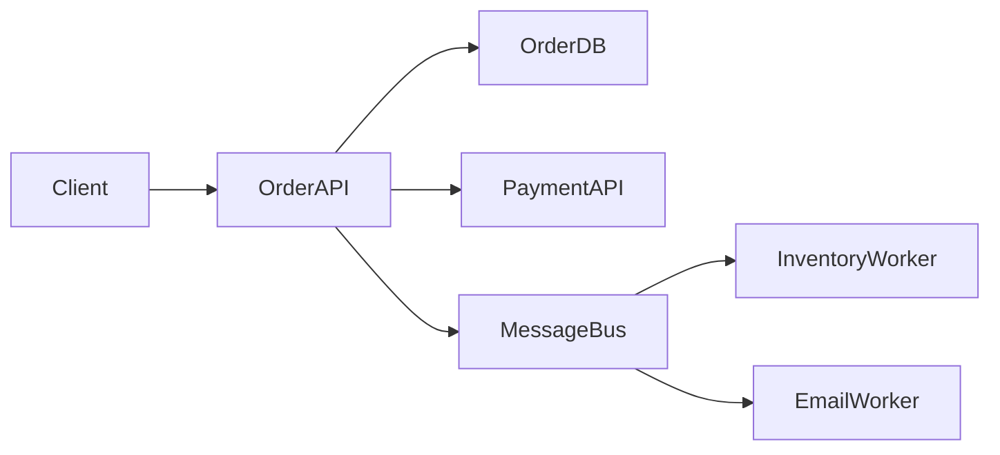

Một request có thể đi qua nhiều failure boundary.

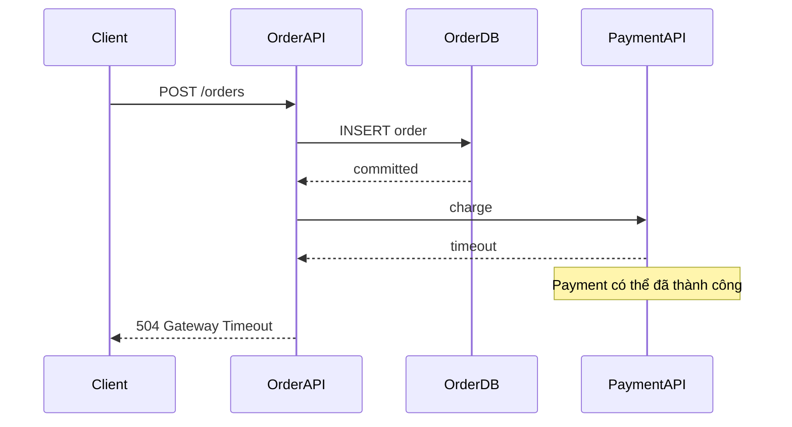

Ở đây 504 không chứng minh payment thất bại. Nếu client retry mù quáng, có thể charge hai lần.

Các nguyên tắc quan trọng:

1. timeout mọi remote call;
2. phân biệt retryable và non-retryable error;
3. dùng idempotency khi retry có thể lặp side effect;
4. chấp nhận eventual consistency khi cần;
5. thiết kế observability xuyên service;
6. không dùng distributed transaction nếu không thật sự cần.

### 4. Practical example

```csharp
public sealed class PaymentClient(HttpClient httpClient)
{
    public async Task<PaymentResult> ChargeAsync(
        ChargeRequest request,
        string idempotencyKey,
        CancellationToken cancellationToken)
    {
        using var message = new HttpRequestMessage(HttpMethod.Post, "/payments");
        message.Headers.Add("Idempotency-Key", idempotencyKey);
        message.Content = JsonContent.Create(request);

        using var response = await httpClient.SendAsync(message, cancellationToken);

        if (response.StatusCode == HttpStatusCode.Conflict)
            return PaymentResult.AlreadyProcessed();

        response.EnsureSuccessStatusCode();
        return await response.Content.ReadFromJsonAsync<PaymentResult>(
                   cancellationToken: cancellationToken)
               ?? throw new InvalidOperationException("Empty payment response");
    }
}
```

Không nên để timeout mặc định quá lớn rồi chờ hàng chục giây trong request path.

### 5. Real production scenario

Trong hệ thống employee offboarding:

1. API cập nhật nhân viên thành Inactive;
2. DB transaction commit trạng thái nội bộ;
3. background worker gọi Microsoft Graph / Exchange Online;
4. Exchange có thể timeout hoặc tạm unavailable;
5. worker retry;
6. UI vẫn cần thể hiện trạng thái `Pending`, `Succeeded`, `Failed` thay vì giả vờ rằng toàn bộ flow là atomic.

### 6. Common mistakes

- Coi timeout là bằng chứng rằng remote operation thất bại.
- Retry tất cả exception, kể cả validation error hoặc business rejection.
- Không có idempotency key cho command tạo side effect.
- Dùng synchronous request chain qua quá nhiều service.
- Không propagate correlation/trace id.
- Không có trạng thái trung gian như `Processing` hoặc `PendingExternalSync`.
- Thiết kế service quá nhỏ chỉ vì “microservice là tốt”.

### 7. Trade-offs

**Advantages**

- scale và deploy độc lập;
- cô lập failure tốt hơn nếu boundary đúng;
- phù hợp tổ chức nhiều team;
- hỗ trợ async workload tự nhiên.

**Costs / Risks**

- network failure;
- eventual consistency;
- debugging phức tạp;
- duplicate message/request;
- khó transaction xuyên service;
- observability và deployment phức tạp hơn nhiều.

### 8. Junior → Middle → Senior understanding

**Junior**: hiểu rằng remote call khác local method call và network có thể fail.

**Middle**: biết implement timeout, retry có chọn lọc, cancellation token, idempotency và correlation id.

**Senior / Technical Lead**: quyết định đúng service boundary, consistency model, failure recovery, retry budget, synchronous vs asynchronous communication và operational complexity.

### 9. Key takeaway

- Distributed system phải được thiết kế cho partial failure.
- Timeout không đồng nghĩa operation chưa xảy ra.
- Idempotency và observability là nền tảng, không phải phần trang trí.
- Chỉ phân tán hệ thống khi lợi ích lớn hơn operational cost.

---

# 2. Strategy Pattern — thay behavior thay vì phình `if/else`

### 1. What is it?

Strategy Pattern đóng gói nhiều cách xử lý cùng một loại bài toán thành các implementation riêng, cùng tuân theo một interface.

Ví dụ một employee offboarding có ba mail action: Delegate, Forward, Delete. Khi mỗi action lớn dần, chứa validation, integration, retry, audit và recovery logic, một chuỗi `if/else` trở thành điểm coupling lớn.

### 2. Why does it exist?

Vấn đề không phải là `if` xấu. Vấn đề là cùng một business decision bị lặp ở nhiều nơi: validation, execution, reset, audit và test. Mỗi action mới buộc sửa nhiều switch statement, làm regression risk tăng.

### 3. How does it work?

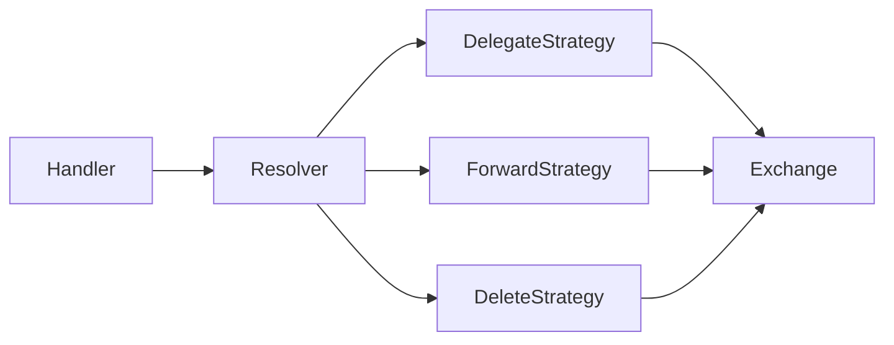

Mỗi strategy xử lý một biến thể; resolver chọn implementation phù hợp.

### 4. Practical example

```csharp
public interface IMailOffboardingStrategy
{
    MailAction Action { get; }
    Task ExecuteAsync(Employee employee, MailConfig config, CancellationToken ct);
}

public sealed class ForwardMailStrategy(IExchangeOnlineService exchange)
    : IMailOffboardingStrategy
{
    public MailAction Action => MailAction.Forward;

    public Task ExecuteAsync(Employee employee, MailConfig config, CancellationToken ct)
    {
        if (string.IsNullOrWhiteSpace(config.TargetEmail))
            throw new ValidationException("TargetEmail is required.");

        return exchange.SetMailboxForwardingAsync(
            employee.Email, config.TargetEmail, ct);
    }
}

public sealed class MailStrategyResolver(IEnumerable<IMailOffboardingStrategy> strategies)
{
    private readonly IReadOnlyDictionary<MailAction, IMailOffboardingStrategy> _map =
        strategies.ToDictionary(x => x.Action);

    public IMailOffboardingStrategy Resolve(MailAction action) =>
        _map.TryGetValue(action, out var strategy)
            ? strategy
            : throw new NotSupportedException($"Unsupported action: {action}");
}
```

### 5. Real production scenario

Payment system có Stripe, PayPal, local bank và internal credit. Mỗi provider có authentication, timeout, callback và error mapping khác nhau. Strategy giúp orchestration phụ thuộc abstraction thay vì biết chi tiết mọi provider.

### 6. Common mistakes

- Tạo strategy cho logic quá nhỏ và không có variability thực tế.
- Resolver dùng reflection phức tạp dù dictionary enum là đủ.
- Dồn business rule chung vào từng strategy gây duplication.
- Strategy tự orchestrate quá nhiều bounded context.

### 7. Trade-offs

**Advantages**: dễ thêm behavior, test độc lập, giảm switch statement phân tán.

**Costs / Risks**: tăng số class, có thể overengineer, cần resolution logic rõ và quản lý logic dùng chung.

### 8. Junior → Middle → Senior understanding

**Junior**: hiểu interface có thể có nhiều implementation.

**Middle**: biết DI, resolver và unit test từng strategy.

**Senior / Technical Lead**: biết khi nào Strategy thực sự giảm coupling và khi nào chỉ làm code dài hơn.

### 9. Key takeaway

- Strategy giải quyết variability của behavior.
- Không dùng pattern chỉ vì pattern tồn tại.
- Boundary của strategy nên tương ứng một business decision rõ ràng.

---

# 3. Authentication vs Authorization

### 1. What is it?

**Authentication** trả lời “Who are you?”. **Authorization** trả lời “What are you allowed to do?”. Một user có token hợp lệ không có nghĩa user đó được phép đọc payroll, approve leave hay quản trị employee.

### 2. Why does it exist?

Nếu trộn hai khái niệm, developer dễ nghĩ “đã login là được access”, permission logic bị rải trong controller và privilege escalation risk tăng.

### 3. How does it work?

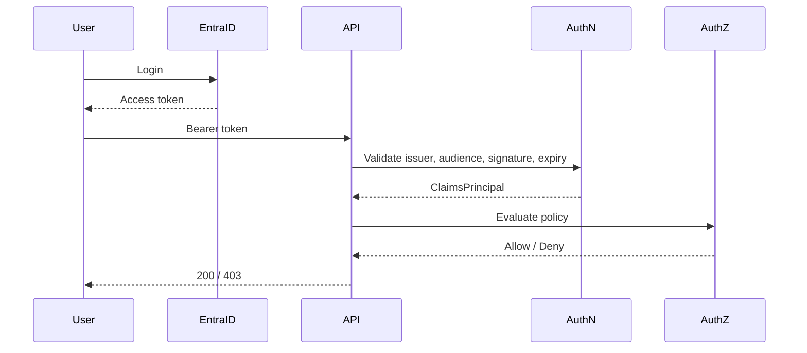

Token invalid thường dẫn tới 401; token valid nhưng thiếu permission thường là 403.

### 4. Practical example

```csharp
builder.Services.AddAuthentication(JwtBearerDefaults.AuthenticationScheme)
    .AddMicrosoftIdentityWebApi(builder.Configuration.GetSection("AzureAd"));

builder.Services.AddAuthorization(options =>
{
    options.AddPolicy("CanApproveLeave", policy =>
    {
        policy.RequireAuthenticatedUser();
        policy.RequireClaim("permission", "leave.approve");
    });
});

[Authorize(Policy = "CanApproveLeave")]
[HttpPost("leave/{id:guid}/approve")]
public async Task<IActionResult> Approve(Guid id, CancellationToken ct)
{
    await leaveService.ApproveAsync(id, User, ct);
    return NoContent();
}
```

### 5. Real production scenario

Trong ETM, employee xem dữ liệu của mình, manager approve team member, HR xem dữ liệu rộng hơn và finance truy cập billing. Authentication mechanism có thể giống nhau nhưng authorization phụ thuộc resource và business context.

### 6. Common mistakes

- Chỉ check role, bỏ qua resource ownership.
- Tin claim từ request body thay vì verified token.
- Log access token.
- Không validate issuer/audience.
- Hard-code email cho permission.
- Chỉ ẩn button trên UI nhưng backend không enforce.

### 7. Trade-offs

**Advantages**: security boundary rõ, audit dễ, policy reusable.

**Costs / Risks**: permission model phức tạp, token claim có thể stale, resource-based authorization cần context bổ sung.

### 8. Junior → Middle → Senior understanding

**Junior**: phân biệt 401/403 và authentication/authorization.

**Middle**: cấu hình JWT, policy, claims, roles và ownership.

**Senior / Technical Lead**: thiết kế permission model, trust boundary, token lifetime, service identity và auditability.

### 9. Key takeaway

- Login thành công không đồng nghĩa có quyền.
- Authorization phải enforce ở backend.
- Policy-based authorization rõ và testable hơn hard-code permission.

---

# 4. Database Design — normalization và denormalization có chủ đích

### 1. What is it?

Database design biến business model thành schema đảm bảo correctness, consistency, queryability, performance và khả năng thay đổi. Normalization giảm duplication và update anomaly; denormalization tối ưu một số read path hoặc giữ snapshot lịch sử.

### 2. Why does it exist?

Lưu department name trong mọi employee row gây update anomaly. Nhưng tách mọi giá trị thành hàng chục lookup table cũng có thể tạo query phức tạp vô ích. Mục tiêu là thiết kế theo invariant và access pattern.

### 3. How does it work?

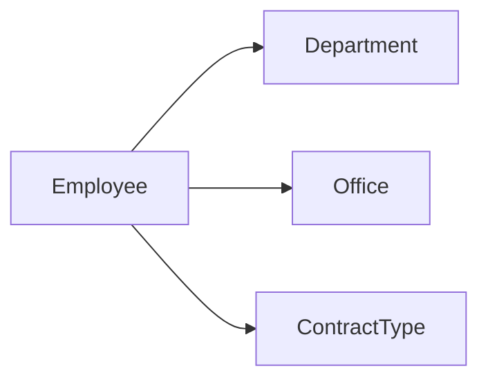

```text
Employee
- Id
- Name
- DepartmentCode
- OfficeCode

Department
- Code
- Name
```

Denormalization có chủ đích: snapshot `DepartmentName` vào invoice history để giữ lịch sử đúng tại thời điểm invoice được tạo.

### 4. Practical example

```csharp
public sealed class Employee
{
    public Guid Id { get; set; }
    public string Name { get; set; } = null!;
    public string DepartmentCode { get; set; } = null!;
    public Department Department { get; set; } = null!;
}

builder.Entity<Department>().HasKey(x => x.Code);

builder.Entity<Employee>()
    .HasOne(x => x.Department)
    .WithMany()
    .HasForeignKey(x => x.DepartmentCode)
    .OnDelete(DeleteBehavior.Restrict);
```

### 5. Real production scenario

Employee tháng trước thuộc Department A, tháng này sang B. Historical invoice tháng trước phải giữ A. Nếu report luôn join current employee, lịch sử bị “viết lại”. Snapshot hoặc reporting model riêng giải quyết tốt hơn.

### 6. Common mistakes

- Dùng JSON column cho mọi thứ để tránh migration.
- Không có unique constraint cho business identity.
- Không enforce FK ở DB.
- Over-normalize lookup không có giá trị.
- Denormalize mà không có ownership/update strategy.
- Không phân biệt OLTP và reporting schema.

### 7. Trade-offs

**Normalization**: consistency tốt, duplication thấp; đổi lại nhiều join và read phức tạp hơn.

**Denormalization**: read đơn giản và nhanh, snapshot tốt; đổi lại stale data và sync complexity.

### 8. Junior → Middle → Senior understanding

**Junior**: hiểu PK, FK, unique constraint và duplication.

**Middle**: model relationship, index và migration an toàn.

**Senior / Technical Lead**: xác định aggregate ownership, historical truth, OLTP/reporting và intentional denormalization.

### 9. Key takeaway

- Schema là một phần của domain design.
- Normalize để giữ consistency, denormalize khi access pattern thật sự yêu cầu.
- Historical data thường cần snapshot thay vì join current state.

---

# 5. Transactions & Data Consistency — ACID, eventual consistency và Outbox

### 1. What is it?

Transaction đảm bảo nhóm thay đổi trong một database commit hoặc rollback như một đơn vị. Nhưng khi flow đi qua DB + message broker + Graph + payment provider, một local transaction không thể bao trùm tất cả một cách đơn giản.

### 2. Why does it exist?

Dual-write problem:

```csharp
await db.SaveChangesAsync();
await bus.PublishAsync(message);
```

DB có thể commit nhưng publish fail. Đảo thứ tự cũng không an toàn: publish xong rồi DB fail.

### 3. How does it work?

Outbox ghi business data và event trong cùng local transaction.

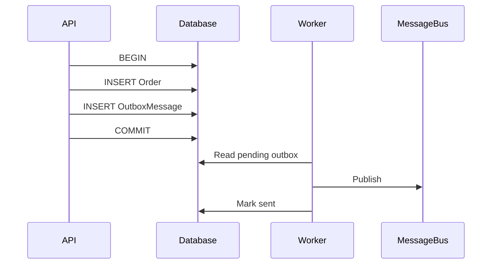

Consumer vẫn cần idempotent vì publish có thể duplicate.

### 4. Practical example

```csharp
await using var tx = await db.Database.BeginTransactionAsync(ct);

var order = Order.Create(request.CustomerId, request.Total);
db.Orders.Add(order);

db.OutboxMessages.Add(new OutboxMessage
{
    Id = Guid.NewGuid(),
    Type = "OrderCreated",
    Payload = JsonSerializer.Serialize(new { order.Id, order.Total }),
    CreatedAtUtc = DateTime.UtcNow
});

await db.SaveChangesAsync(ct);
await tx.CommitAsync(ct);
```

### 5. Real production scenario

Employee offboarding commit trạng thái `Inactive` và outbox event. Worker gọi Exchange sau. Exchange down không làm rollback business state vô lý; integration status được retry và theo dõi độc lập.

### 6. Common mistakes

- Giữ DB transaction mở trong khi gọi remote API.
- Nghĩ broker đảm bảo exactly-once business effect.
- Consumer không idempotent.
- Không cleanup outbox.
- Retry poison message vô hạn.
- Không lưu attempt count/failure reason.

### 7. Trade-offs

**Advantages**: reliable publication, local consistency mạnh, recovery rõ.

**Costs / Risks**: eventual consistency, duplicate delivery, thêm worker/monitoring/cleanup.

### 8. Junior → Middle → Senior understanding

**Junior**: hiểu transaction/rollback trong DB.

**Middle**: biết transaction boundary, outbox và idempotent consumer.

**Senior / Technical Lead**: thiết kế consistency model dựa trên business invariant thay vì cố biến mọi flow thành synchronous transaction.

### 9. Key takeaway

- ACID mạnh trong một database boundary.
- Dual-write là failure mode kiến trúc phổ biến.
- Outbox + idempotent consumer là giải pháp thực dụng cho reliable integration.

---

# 6. In-memory Cache — nhanh nhưng local theo process

### 1. What is it?

In-memory cache lưu dữ liệu trực tiếp trong memory của application process, ví dụ `IMemoryCache`. Nó rất nhanh nhưng chỉ tồn tại trong instance đó.

### 2. Why does it exist?

Lookup và computed data đọc nhiều nhưng đổi ít không cần query DB ở mọi request. Cache giảm DB load và latency.

### 3. How does it work?

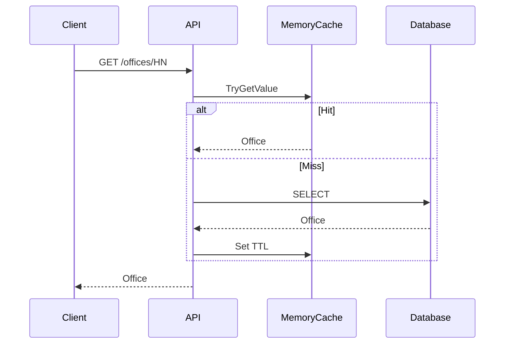

### 4. Practical example

```csharp
public sealed class OfficeService(IMemoryCache cache, AppDbContext db)
{
    public Task<OfficeDto?> GetAsync(string code, CancellationToken ct)
    {
        return cache.GetOrCreateAsync($"office:{code}", async entry =>
        {
            entry.AbsoluteExpirationRelativeToNow = TimeSpan.FromMinutes(10);
            entry.Size = 1;

            return await db.Offices.AsNoTracking()
                .Where(x => x.Code == code)
                .Select(x => new OfficeDto(x.Code, x.Name))
                .SingleOrDefaultAsync(ct);
        });
    }
}
```

### 5. Real production scenario

API có 4 App Service instances. Admin đổi office name. Một node refresh cache nhưng ba node còn lại có thể vẫn trả dữ liệu cũ cho tới khi TTL hết. Nếu cần invalidation cross-node gần real-time, Redis hoặc invalidation event phù hợp hơn.

### 6. Common mistakes

- Dùng memory cache làm shared session/state.
- Cache entity đang tracked.
- Không có size limit.
- TTL quá dài.
- Cache sensitive data không cần thiết.
- Không phòng cache stampede cho hot key.

### 7. Trade-offs

**Advantages**: latency cực thấp, không cần external infrastructure, đơn giản.

**Costs / Risks**: không shared, mất khi restart, chiếm app memory, stale giữa nodes.

### 8. Junior → Middle → Senior understanding

**Junior**: hiểu hit/miss/TTL.

**Middle**: biết invalidation, size limit và scale-out issue.

**Senior / Technical Lead**: chọn giữa local cache, distributed cache và không cache dựa trên consistency requirement.

### 9. Key takeaway

- `IMemoryCache` nhanh nhưng chỉ thuộc một process.
- Không dùng nó làm distributed state.
- Cache phải có TTL, invalidation và memory bound.

---

# 7. Azure App Service — production hosting cho ASP.NET Core

### 1. What is it?

Azure App Service là PaaS để chạy web application/API mà không cần tự quản OS/IIS như VM. Nó phù hợp nhiều business API .NET, hỗ trợ scale-out, deployment slot, Managed Identity và tích hợp monitoring.

### 2. Why does it exist?

Tự vận hành VM buộc team quản OS patch, IIS, process restart, deployment, scaling và certificate. PaaS giảm operational plumbing để tập trung application.

### 3. How does it work?

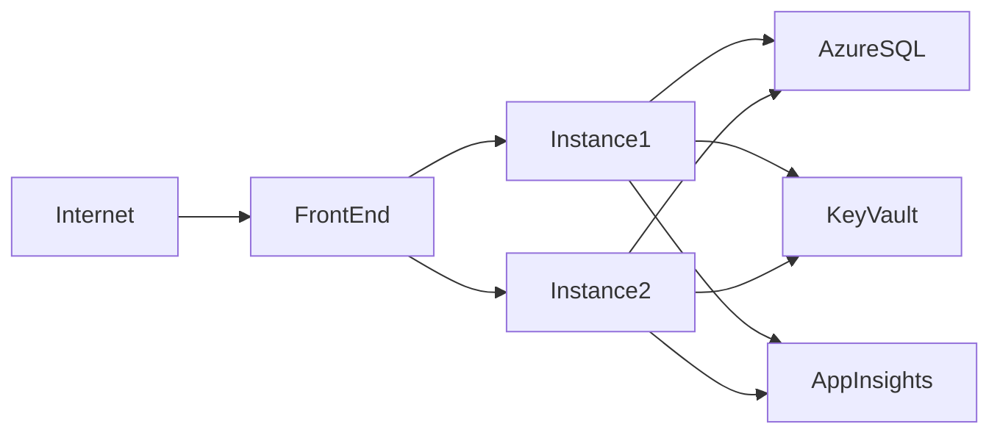

Scale-out tạo nhiều instances, vì vậy application nên stateless.

### 4. Practical example

```csharp
builder.Services.AddHealthChecks()
    .AddSqlServer(builder.Configuration.GetConnectionString("MainDb")!);

var app = builder.Build();
app.MapHealthChecks("/health");
app.Run();
```

Managed Identity với Key Vault:

```csharp
var client = new SecretClient(
    new Uri(builder.Configuration["KeyVaultUri"]!),
    new DefaultAzureCredential());
```

Deployment slot:

```text
Build/Test -> Staging Slot -> Warm-up -> Smoke Test -> Swap -> Production
```

### 5. Real production scenario

ETM backend deploy staging slot, chạy health/smoke test rồi swap production. Application Insights theo dõi error rate/latency. Nếu regression, swap back nhanh hơn rebuild/deploy lại.

### 6. Common mistakes

- Lưu state/file quan trọng trên local instance.
- Hard-code secret.
- Không health check/warm-up slot.
- Không hiểu scale-out và memory state.
- Chọn plan quá nhỏ rồi nhầm là code luôn chậm.

### 7. Trade-offs

**Advantages**: managed hosting, slots, scaling, identity/monitoring tích hợp tốt.

**Costs / Risks**: ít control hơn VM, plan cost, networking/private access cần thiết kế cẩn thận, workload đặc biệt có thể hợp Container Apps hơn.

### 8. Junior → Middle → Senior understanding

**Junior**: hiểu App Service là managed host cho API.

**Middle**: biết deploy, config, slot, health, identity và scale-out.

**Senior / Technical Lead**: quyết định tier, networking, HA, deployment model, observability và App Service vs Container Apps/Functions/VM.

### 9. Key takeaway

- App Service rất phù hợp business API .NET điển hình.
- Stateless design quan trọng khi scale-out.
- Slot + health check + monitoring giảm deployment risk.

---

# 8. Metrics, SLI, SLO, SLA

### 1. What is it?

Metrics là số đo theo thời gian như request rate, error rate, latency và queue depth.

- **SLI**: chỉ số thực tế của service.
- **SLO**: mục tiêu nội bộ cho SLI.
- **SLA**: cam kết với khách hàng, có thể kèm điều khoản thương mại.

### 2. Why does it exist?

“System healthy” quá mơ hồ. CPU 20% không chứng minh user đang nhận response đúng và nhanh. Reliability cần gắn với user-visible behavior.

### 3. How does it work?

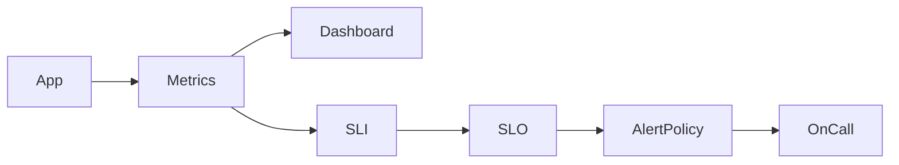

Ví dụ availability SLI:

```text
successful_requests / valid_requests
```

SLO 99.9% cho phép error budget khoảng 0.1% trong window tương ứng.

### 4. Practical example

```csharp
builder.Services.AddOpenTelemetry()
    .WithMetrics(metrics => metrics
        .AddAspNetCoreInstrumentation()
        .AddHttpClientInstrumentation()
        .AddRuntimeInstrumentation());
```

Custom metric:

```csharp
private static readonly Meter Meter = new("ETM.Billing");
private static readonly Counter<long> Failures =
    Meter.CreateCounter<long>("invoice_failures_total");

Failures.Add(1, new("reason", "timeout"));
```

Không dùng request id/user id làm label vì cardinality quá cao.

### 5. Real production scenario

Timesheet API đặt SLO 99.9% success và p95 dưới 800 ms. Khi DB pool gần cạn, p95/error rate tăng dù CPU bình thường. Alert theo SLO symptom giúp điều tra đúng hơn alert CPU đơn thuần.

### 6. Common mistakes

- Alert mọi threshold gây fatigue.
- Dùng average latency thay p95/p99.
- Metric label cardinality quá cao.
- Nhầm SLA với SLO.
- Đặt SLO 100%.
- Chỉ monitor infrastructure, bỏ business outcome.

### 7. Trade-offs

**Advantages**: reliability đo được, alert meaningful, ưu tiên engineering tốt hơn.

**Costs / Risks**: instrumentation/storage cost, SLO sai dẫn tới tối ưu sai, quá nhiều metric gây noise.

### 8. Junior → Middle → Senior understanding

**Junior**: hiểu metric, latency, error rate.

**Middle**: instrument dashboard/alerts.

**Senior / Technical Lead**: thiết kế SLI/SLO theo user journey, error budget và operational decision.

### 9. Key takeaway

- SLI đo thực tế, SLO là mục tiêu, SLA là cam kết.
- Reliability nên đo từ góc nhìn người dùng.
- Alert tốt phản ánh impact chứ không chỉ resource usage.

---

# 9. OpenAI Function Calling — model đề xuất, code kiểm soát execution

### 1. What is it?

Function Calling cho phép application cung cấp tool schema để model chọn tool và arguments có cấu trúc. Model không nên tự thực thi business action; application validate, authorize và execute deterministic code.

### 2. Why does it exist?

Parse plain text kiểu `SEND_EMAIL:user@example.com` mong manh và khó validate. Structured tool contract tạo boundary rõ giữa probabilistic reasoning và deterministic execution.

### 3. How does it work?

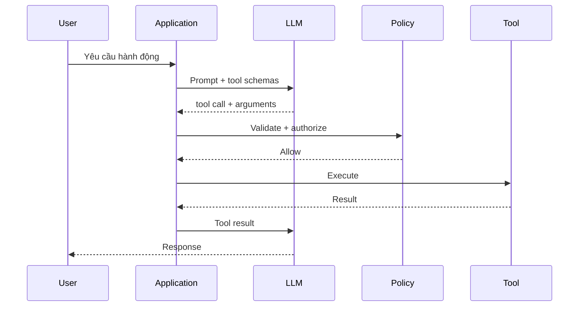

Nguyên tắc:

```text
Model proposes -> Code validates -> Code authorizes -> Code executes -> Code observes
```

### 4. Practical example

```csharp
public sealed record CreateReminderArgs(string Title, DateTimeOffset DueAt);

public async Task<ToolResult> ExecuteAsync(
    CreateReminderArgs args,
    UserContext user,
    CancellationToken ct)
{
    if (string.IsNullOrWhiteSpace(args.Title))
        return ToolResult.Invalid("Title is required.");

    if (args.DueAt < DateTimeOffset.UtcNow)
        return ToolResult.Invalid("DueAt must be in the future.");

    if (!user.Permissions.Contains("reminder.create"))
        return ToolResult.Forbidden();

    var id = await reminderService.CreateAsync(
        user.UserId, args.Title, args.DueAt, ct);

    return ToolResult.Success(new { id });
}
```

### 5. Real production scenario

AI assistant HR có read-only tools như `search_employee` và destructive tool như `disable_account`. Read tool có thể auto-run; destructive tool cần permission mạnh và human approval. Risk class của tool phải là một phần của architecture.

### 6. Common mistakes

- Model được execute destructive action không approval.
- Không validate tool arguments.
- Tool description mơ hồ.
- Expose quá nhiều tools cùng lúc.
- Không timeout/retry policy.
- Không log tool call/result.
- Đưa secrets vào prompt.
- Tin tool output như trusted instruction dù nguồn dữ liệu có thể chứa prompt injection.

### 7. Trade-offs

**Advantages**: structured integration, reusable workflow, audit tốt hơn plain-text parsing.

**Costs / Risks**: model có thể chọn sai tool, tăng latency/token cost, loop runaway, permission boundary phức tạp.

### 8. Junior → Middle → Senior understanding

**Junior**: model đề xuất function call; code mới thực thi.

**Middle**: schema, validation, timeout, retry, result handling.

**Senior / Technical Lead**: tool risk classification, approval, audit, stop condition, budget và security boundary.

### 9. Key takeaway

- LLM không phải nơi enforce business rule.
- Tool arguments luôn phải validate/authorize.
- Deterministic code giữ quyền kiểm soát side effect.

---

# 10. Requirement Analysis — biến yêu cầu mơ hồ thành behavior có thể test

### 1. What is it?

Requirement Analysis làm rõ điều hệ thống phải làm, không được làm, actor, trigger, state transition, validation, failure mode và acceptance criteria trước khi implementation.

### 2. Why does it exist?

Nhiều production bug bắt nguồn từ under-specified behavior chứ không phải syntax. Developer, QA và product có thể mỗi người tự điền assumption khác nhau.

### 3. How does it work?

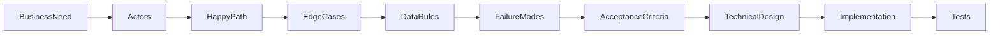

Nên làm rõ actor, permission, trigger, happy path, validation, edge case, integration failure, state transition, audit và non-functional requirement.

### 4. Practical example

Yêu cầu ban đầu:

```text
Inactive employee can forward mailbox to another employee.
```

Sau phân tích:

```text
Given an Active employee
When HR changes status to Inactive
And selects Email Action = Forward
Then TargetEmail and EndTime are required
And mailbox forwarding is configured asynchronously
And the employee remains Inactive even if Exchange configuration fails
And failure is recorded for retry/manual investigation
When EndTime expires
Then forwarding is removed by the reset job
```

Request model:

```csharp
public sealed record EmployeeOffboardingRequest(
    string EmailAction,
    string? TargetEmail,
    DateTimeOffset? EndTime,
    bool EnableAutoReply,
    string? AutoReplyMessage);
```

### 5. Real production scenario

Ticket “update calendar event when admin changes event time” cần làm rõ delegated/application permission, external event id, user offline behavior, near-real-time requirement, manual user edits, retry policy và security consent. Nếu bỏ qua, solution có thể bế tắc ở permission model sau khi đã code nhiều.

### 6. Common mistakes

- Code từ ticket title.
- Chỉ hỏi happy path.
- Không xác định source of truth.
- Không hỏi integration failure.
- Acceptance criteria chỉ mô tả UI.
- Không phân biệt must-have và nice-to-have.
- Khóa technical solution quá sớm khi business rule chưa rõ.

### 7. Trade-offs

**Advantages**: giảm rework, test rõ, architecture decision có căn cứ, giảm assumption ẩn.

**Costs / Risks**: tốn thời gian trước coding; nếu over-analysis cho scope nhỏ sẽ làm delivery chậm.

### 8. Junior → Middle → Senior understanding

**Junior**: hỏi expected behavior, validation, edge case.

**Middle**: chuyển requirement thành state transition, API contract, test scenario.

**Senior / Technical Lead**: nhận ra requirement nào kéo theo security, consistency, integration, architecture và operational consequences lớn.

### 9. Key takeaway

- Requirement tốt mô tả behavior, không chỉ màn hình.
- Failure mode nên được hỏi trước khi trở thành incident.
- Acceptance criteria là cầu nối giữa business, development và QA.
- Technical design chỉ đáng tin khi requirement boundary đủ rõ.
