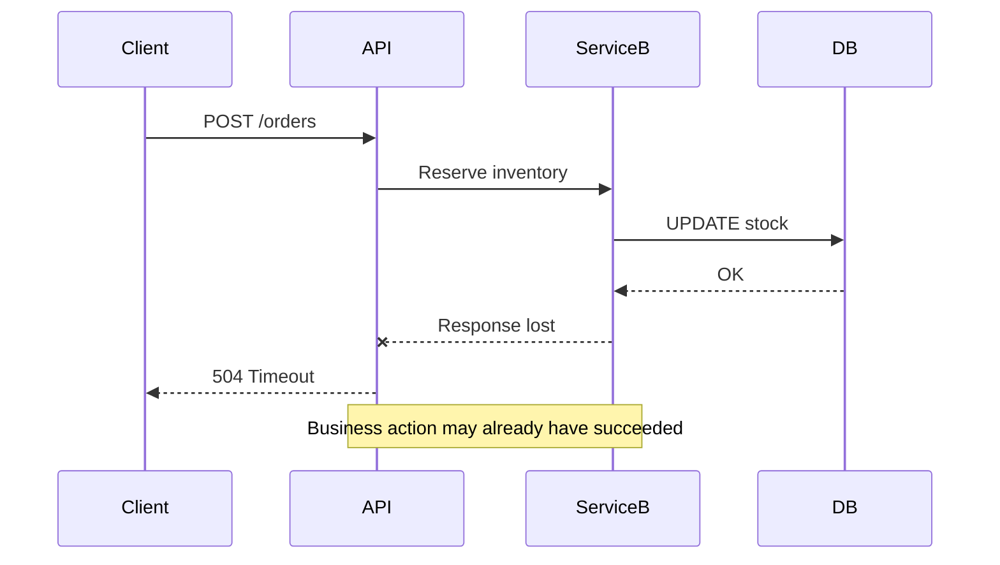
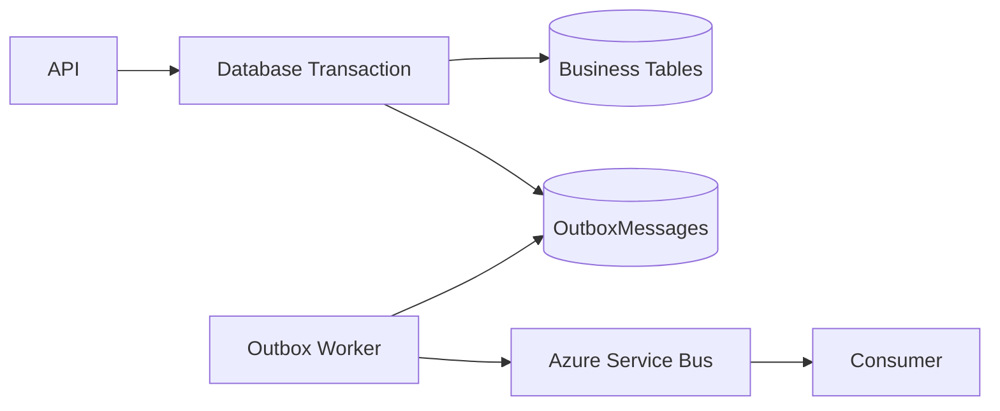
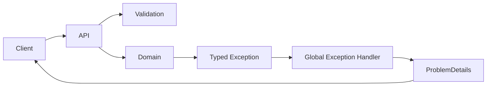
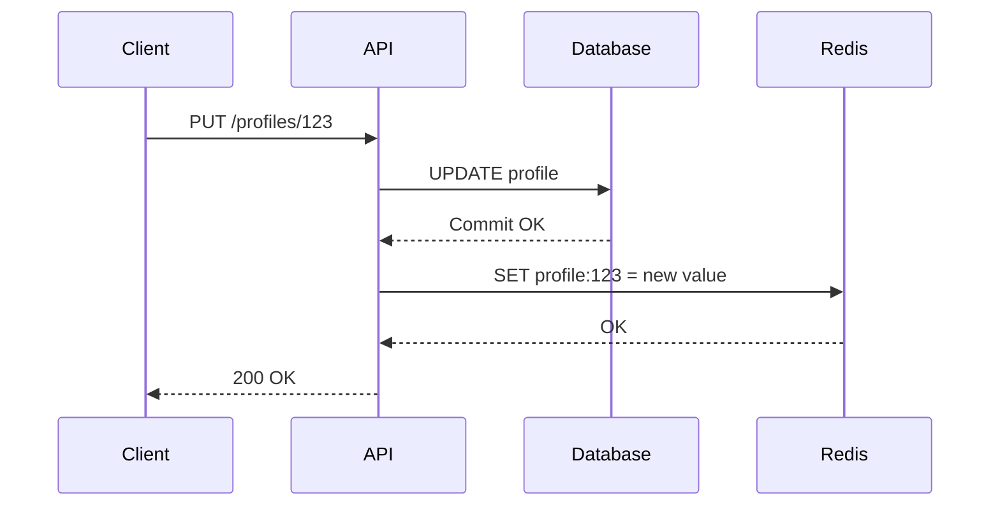
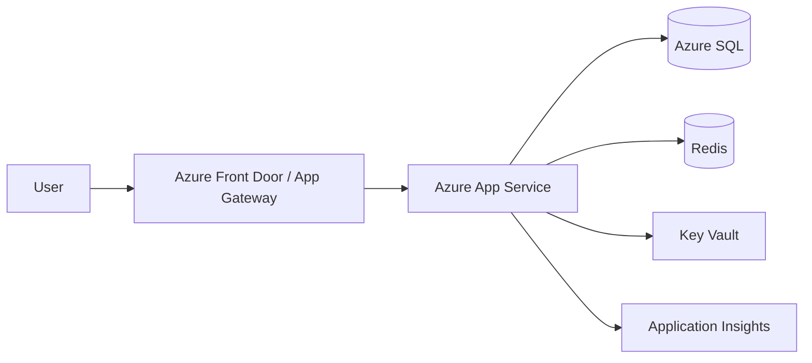
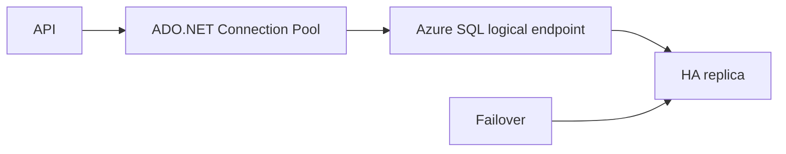
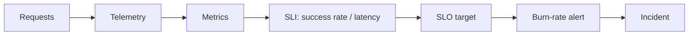
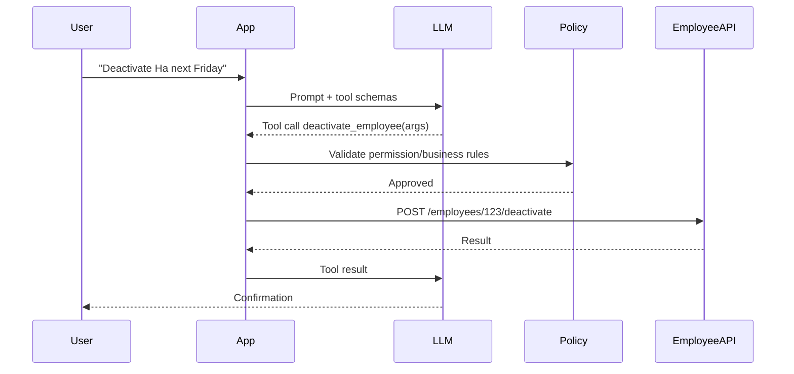
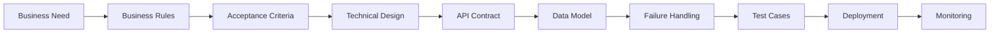

# Daily Knowledge Sharing — 2026-08-17

## Today’s Topics

1. Distributed Systems — partial failure, timeout và failure isolation
2. Transactional Outbox Pattern — đồng bộ dữ liệu và message an toàn
3. REST API Error Handling với Problem Details
4. EF Core Change Tracking, `AsNoTracking()` và hiệu năng truy vấn
5. Write-Through Cache — consistency tốt hơn nhưng chi phí ghi cao hơn
6. Azure App Service — vận hành ASP.NET Core production đúng cách
7. Azure SQL — connection resiliency, security và production reliability
8. Metrics, SLI, SLO — biến monitoring thành mục tiêu vận hành đo được
9. OpenAI Function Calling / Tool Calling — tách quyết định AI khỏi hành động deterministic
10. Requirement Analysis → Technical Design — traceability từ business đến implementation

---

# 1. Distributed Systems — partial failure, timeout và failure isolation

### 1. What is it?

Distributed system là hệ thống trong đó nhiều process hoặc service chạy độc lập trên nhiều máy, container hoặc vùng mạng khác nhau nhưng phối hợp để cung cấp một chức năng chung.

Điểm quan trọng không phải là “có nhiều service” mà là **failure không còn mang tính nhị phân**. Trong một monolith cùng process, lời gọi method thường thành công hoặc ném exception ngay. Trong distributed system, request có thể đã được xử lý nhưng response bị mất, service B có thể sống nhưng network route lỗi, database có thể chậm chứ chưa hẳn down.

Vì vậy Senior Developer phải luôn giả định:

- Network có thể chậm hoặc mất gói.
- Dependency có thể timeout.
- Một phần hệ thống có thể lỗi trong khi phần khác vẫn hoạt động.
- Retry có thể tạo duplicate.
- Timeout quá dài có thể làm nghẽn thread, connection pool và queue.

### 2. Why does it exist?

Distributed architecture xuất hiện để giải quyết các nhu cầu như scale độc lập, fault isolation, ownership theo domain, deployment độc lập và tích hợp nhiều hệ thống.

Nhưng đổi lại ta mất “sự chắc chắn” của lời gọi local.

Nếu một API gọi Microsoft Graph và nhận timeout, ta không biết chắc Graph chưa xử lý hay đã xử lý xong nhưng response bị mất. Naive solution là retry ngay nhiều lần; điều này có thể gây duplicate hoặc tăng tải khi dependency đang suy yếu.

### 3. How does it work?



Một thiết kế production tốt thường kết hợp:

1. Timeout rõ ràng.
2. Retry có giới hạn và chỉ áp dụng với lỗi transient.
3. Idempotency nếu operation có thể bị gửi lại.
4. Circuit breaker để tránh tiếp tục đánh vào dependency đang lỗi.
5. Queue khi công việc không bắt buộc synchronous.
6. Correlation ID + tracing để debug call chain.

### 4. Practical example

Với .NET, có thể cấu hình timeout và resilience thay vì dùng `HttpClient` mặc định vô hạn logic nghiệp vụ:

```csharp
builder.Services
    .AddHttpClient<GraphEmployeeClient>(client =>
    {
        client.BaseAddress = new Uri("https://graph.microsoft.com/v1.0/");
        client.Timeout = TimeSpan.FromSeconds(10);
    });
```

Trong business code, phân biệt timeout với lỗi HTTP:

```csharp
try
{
    var response = await _httpClient.SendAsync(request, cancellationToken);
    response.EnsureSuccessStatusCode();
}
catch (TaskCanceledException) when (!cancellationToken.IsCancellationRequested)
{
    throw new ExternalDependencyTimeoutException("Microsoft Graph timed out.");
}
```

### 5. Real production scenario

Một hệ thống employee offboarding gọi Exchange Online hoặc Microsoft Graph để thay đổi mailbox. API nội bộ ghi trạng thái vào database, sau đó gọi hệ thống ngoài.

Nếu external call timeout sau khi mailbox đã được cập nhật, job retry có thể chạy lại cùng action. Nếu action không idempotent hoặc không kiểm tra trạng thái hiện tại, hệ thống có thể ghi lịch sử sai, gửi mail lặp hoặc tăng `FailedCount` không đúng thực tế.

Production flow tốt hơn là lưu command với correlation ID, retry có kiểm soát và kiểm tra trạng thái đích trước khi thực hiện lại.

### 6. Common mistakes

- Nghĩ timeout đồng nghĩa operation chắc chắn thất bại.
- Retry mọi lỗi, kể cả 400/401/403.
- Không đặt timeout ở từng dependency.
- Timeout tầng ngoài ngắn hơn tầng trong nhưng không propagate cancellation.
- Retry đồng thời ở nhiều tầng, tạo retry storm.
- Không có idempotency key cho write API.
- Log từng service riêng lẻ nhưng không có correlation ID.

### 7. Trade-offs

**Advantages**

- Scale và deploy từng phần độc lập.
- Có thể cô lập failure theo subsystem.
- Dễ tách ownership giữa các team.

**Costs / Risks**

- Network và partial failure làm hệ thống khó suy luận hơn.
- Observability, retry, messaging, consistency phức tạp hơn.
- Debug production khó hơn local call rất nhiều.

### 8. Junior → Middle → Senior understanding

**Junior**: hiểu network call không giống method call và phải có timeout/error handling.

**Middle**: biết implement retry hợp lý, cancellation token, idempotency và logging correlation.

**Senior / Technical Lead**: phải thiết kế failure model cho toàn workflow, quyết định synchronous hay asynchronous, xác định consistency boundary và ngăn cascading failure.

### 9. Key takeaway

- Trong distributed system, “không nhận được response” không có nghĩa “operation chưa chạy”.
- Timeout, idempotency và observability phải được thiết kế cùng nhau.
- Hãy thiết kế theo partial failure, không chỉ happy path.

---

# 2. Transactional Outbox Pattern — đồng bộ dữ liệu và message an toàn

### 1. What is it?

Transactional Outbox là pattern dùng khi một business transaction vừa phải cập nhật database vừa phải phát message/event ra message broker.

Thay vì:

```text
Save DB
→ Publish RabbitMQ/Azure Service Bus
```

ứng dụng ghi cả business data và một bản ghi Outbox trong **cùng database transaction**. Một background worker riêng đọc Outbox và publish message sau.

### 2. Why does it exist?

Vấn đề kinh điển:

1. DB commit thành công.
2. App crash trước khi publish message.

Kết quả: dữ liệu đã đổi nhưng downstream system không biết.

Hoặc ngược lại:

1. Publish message thành công.
2. DB transaction rollback.

Downstream đã xử lý một event cho trạng thái chưa tồn tại.

Distributed transaction hai pha thường quá nặng, khó vận hành và không phù hợp nhiều cloud service. Outbox giải bài toán bằng local transaction + asynchronous delivery.

### 3. How does it work?



Flow:

1. API xử lý business command.
2. Trong cùng transaction, update aggregate và insert Outbox message.
3. Commit.
4. Background worker poll các message chưa gửi.
5. Publish lên broker.
6. Đánh dấu `ProcessedAt`.

Consumer vẫn cần idempotent vì message có thể được publish nhiều hơn một lần.

### 4. Practical example

Entity:

```csharp
public sealed class OutboxMessage
{
    public Guid Id { get; init; }
    public DateTime OccurredOnUtc { get; init; }
    public string Type { get; init; } = null!;
    public string Payload { get; init; } = null!;
    public DateTime? ProcessedOnUtc { get; set; }
}
```

Trong transaction EF Core:

```csharp
await using var transaction = await db.Database.BeginTransactionAsync(ct);

employee.Deactivate();

db.OutboxMessages.Add(new OutboxMessage
{
    Id = Guid.NewGuid(),
    OccurredOnUtc = DateTime.UtcNow,
    Type = "EmployeeDeactivated",
    Payload = JsonSerializer.Serialize(new { employee.Id, employee.Email })
});

await db.SaveChangesAsync(ct);
await transaction.CommitAsync(ct);
```

### 5. Real production scenario

Hệ thống HR deactivate employee. Sau đó cần:

- Revoke access.
- Update mailbox.
- Gửi notification.
- Đồng bộ với AD.

Nếu controller gọi trực tiếp bốn external system, request dễ timeout và failure giữa chừng. Với Outbox, HR database commit trạng thái trước, sau đó publish `EmployeeDeactivated`. Các consumer xử lý độc lập.

### 6. Common mistakes

- Insert Outbox ngoài transaction business.
- Xóa message ngay sau publish mà không xử lý crash window.
- Không index `ProcessedOnUtc`.
- Payload phụ thuộc class nội bộ dễ breaking khi deploy version mới.
- Consumer không idempotent.
- Polling quá nhanh gây tải DB.
- Không có cleanup/retention cho bảng Outbox.

### 7. Trade-offs

**Advantages**

- Tránh mất event giữa DB và broker.
- Không cần distributed transaction.
- Phù hợp microservices/event-driven architecture.

**Costs / Risks**

- Eventual consistency.
- Thêm worker, retry, cleanup và monitoring.
- Có thể publish duplicate.
- Schema event cần quản trị backward compatibility.

### 8. Junior → Middle → Senior understanding

**Junior**: hiểu vấn đề DB commit + publish message không atomic.

**Middle**: implement Outbox table, worker, retry và idempotent consumer.

**Senior / Technical Lead**: quyết định delivery semantics, partitioning, throughput, event versioning, retention và khi nào Outbox là overengineering.

### 9. Key takeaway

- Outbox biến “DB + broker” thành local atomic write + reliable asynchronous delivery.
- At-least-once delivery yêu cầu consumer idempotent.
- Reliability tăng nhưng đổi lại complexity và eventual consistency.

---

# 3. REST API Error Handling với Problem Details

### 1. What is it?

Error handling API không chỉ là `try/catch`. Một API production cần error contract nhất quán để client biết lỗi thuộc loại validation, authentication, conflict, not found hay server failure.

ASP.NET Core hỗ trợ Problem Details theo chuẩn HTTP với các trường như `type`, `title`, `status`, `detail`, `instance`.

### 2. Why does it exist?

Nếu mỗi endpoint trả lỗi một kiểu:

```json
{ "message": "error" }
```

endpoint khác lại:

```json
{ "errorCode": 10, "data": null }
```

thì frontend/mobile/client phải viết logic đặc biệt cho từng API.

Naive solution `return StatusCode(500, ex.Message)` còn làm lộ stack/domain detail và khó monitoring.

### 3. How does it work?



Map exception theo semantics:

- Validation → 400.
- Unauthenticated → 401.
- Forbidden → 403.
- Not found → 404.
- Concurrency/business conflict → 409.
- Rate limit → 429.
- Unexpected → 500.

### 4. Practical example

```csharp
builder.Services.AddProblemDetails();
builder.Services.AddExceptionHandler<GlobalExceptionHandler>();

app.UseExceptionHandler();
```

Handler:

```csharp
public sealed class GlobalExceptionHandler : IExceptionHandler
{
    public async ValueTask<bool> TryHandleAsync(
        HttpContext context,
        Exception exception,
        CancellationToken cancellationToken)
    {
        var status = exception switch
        {
            ValidationException => StatusCodes.Status400BadRequest,
            EntityNotFoundException => StatusCodes.Status404NotFound,
            ConcurrencyException => StatusCodes.Status409Conflict,
            _ => StatusCodes.Status500InternalServerError
        };

        await Results.Problem(
            statusCode: status,
            title: "Request failed",
            extensions: new Dictionary<string, object?>
            {
                ["traceId"] = context.TraceIdentifier
            }).ExecuteAsync(context);

        return true;
    }
}
```

### 5. Real production scenario

Timesheet API update entry đang dùng optimistic concurrency. User A save trước, user B save version cũ. API nên trả `409 Conflict` với error code rõ ràng thay vì 500.

Frontend có thể hiển thị “Dữ liệu đã thay đổi, vui lòng tải lại” thay vì báo generic error.

### 6. Common mistakes

- Trả 200 kèm `{ success:false }` cho mọi lỗi.
- Trả exception message nội bộ ra client.
- Dùng 500 cho business conflict.
- Error response không có stable error code.
- Validation error format khác domain error format.
- Không trả trace ID để support production investigation.
- Log cùng exception nhiều lần ở controller, service và middleware.

### 7. Trade-offs

**Advantages**

- Contract nhất quán.
- Client xử lý đơn giản.
- Dễ correlate với logs/traces.

**Costs / Risks**

- Cần governance error code.
- Mapping exception không cẩn thận có thể che mất bug.
- Không phải mọi lỗi domain nên biểu diễn bằng exception.

### 8. Junior → Middle → Senior understanding

**Junior**: biết status code phản ánh semantics của lỗi.

**Middle**: implement global exception handling, Problem Details và validation contract.

**Senior / Technical Lead**: thiết kế error taxonomy, backward compatibility, observability và security boundary cho error detail.

### 9. Key takeaway

- Error contract là một phần của API contract.
- Không dùng 500 cho mọi lỗi.
- Client cần stable error code; operator cần trace ID.

---

# 4. EF Core Change Tracking, `AsNoTracking()` và hiệu năng truy vấn

### 1. What is it?

EF Core Change Tracker theo dõi entity được query để biết property nào thay đổi và generate SQL `UPDATE/DELETE` khi `SaveChanges()`.

Tracking hữu ích cho command/update workflow nhưng tạo thêm memory và CPU overhead cho read-only query.

### 2. Why does it exist?

Nếu ORM không track trạng thái, developer phải tự so sánh dữ liệu cũ/mới và generate update logic.

Nhưng nếu endpoint chỉ đọc 20.000 records để export mà vẫn tracking toàn bộ, DbContext giữ hàng nghìn object và metadata không cần thiết.

### 3. How does it work?

Khi query tracking:

```text
Database row
→ Materialize Entity
→ ChangeTracker stores original/current state
→ Developer modifies entity
→ SaveChanges
→ DetectChanges
→ SQL UPDATE
```

`AsNoTracking()` bỏ bước quản lý state sau materialization.

### 4. Practical example

Read-only query:

```csharp
var employees = await db.Employees
    .AsNoTracking()
    .Where(x => x.IsActive)
    .Select(x => new EmployeeDto
    {
        Id = x.Id,
        Name = x.DisplayName,
        Email = x.Email
    })
    .ToListAsync(ct);
```

Update workflow:

```csharp
var employee = await db.Employees
    .SingleAsync(x => x.Id == employeeId, ct);

employee.DisplayName = request.DisplayName;
await db.SaveChangesAsync(ct);
```

### 5. Real production scenario

Một employee search API trả 100 records mỗi request. Nếu query entity đầy đủ với nhiều navigation và tracking mặc định, allocation tăng và response chậm.

Tối ưu đúng thường là:

- Projection thẳng sang DTO.
- `AsNoTracking()`.
- Chỉ select column cần dùng.
- Pagination.
- Index đúng predicate/order.

Không nên chỉ “thêm Redis” để che một query EF thiết kế kém.

### 6. Common mistakes

- Dùng tracking cho toàn bộ read endpoint.
- Gọi `ToListAsync()` trước rồi mới `Select`/`Where` trong memory.
- Dùng `AsNoTracking()` rồi attach graph lớn để update.
- DbContext sống quá lâu khiến ChangeTracker phình to.
- Load navigation không cần thiết.
- Nghĩ `AsNoTracking()` luôn nhanh hơn trong mọi trường hợp; identity resolution có thể ảnh hưởng graph lặp entity.

### 7. Trade-offs

**Advantages của tracking**

- Update entity tự nhiên.
- Detect changed properties.
- Identity map trong cùng DbContext.

**Costs / Risks**

- Memory/CPU overhead.
- DbContext dài hạn dễ giữ quá nhiều entity.
- Không phù hợp bulk read/reporting.

### 8. Junior → Middle → Senior understanding

**Junior**: hiểu tracking dùng cho update, no-tracking cho read-only.

**Middle**: biết projection, query shape, split query, pagination và inspect generated SQL.

**Senior / Technical Lead**: đánh giá workload, memory pressure, DbContext lifetime, bulk operation và quyết định ORM abstraction có còn phù hợp cho hot path hay không.

### 9. Key takeaway

- Read-only query thường nên projection + `AsNoTracking()`.
- EF performance bắt đầu từ SQL được generate, không phải chỉ từ C#.
- DbContext nên ngắn hạn và có transaction boundary rõ ràng.

---

# 5. Write-Through Cache — consistency tốt hơn nhưng chi phí ghi cao hơn

### 1. What is it?

Write-through cache là strategy trong đó write được cập nhật vào cache và backing store theo một flow kiểm soát, để cache luôn gần trạng thái mới nhất.

Khác cache-aside, nơi application thường update DB rồi invalidate cache và dữ liệu được load lại ở lần đọc tiếp theo.

### 2. Why does it exist?

Cache-aside dễ triển khai nhưng invalidation có race condition:

1. Request A update DB.
2. Request B đọc cache cũ trước khi invalidation hoàn tất.
3. Client nhận stale data.

Write-through giảm khoảng stale sau write, phù hợp workload đọc rất nhiều và yêu cầu cache nóng ngay sau update.

### 3. How does it work?



Thứ tự có thể thay đổi tùy thiết kế, nhưng điểm khó là xử lý khi một nơi thành công và nơi kia thất bại.

### 4. Practical example

```csharp
public async Task UpdateEmployeeAsync(Employee employee, CancellationToken ct)
{
    db.Employees.Update(employee);
    await db.SaveChangesAsync(ct);

    var key = $"employee:{employee.Id}";
    var json = JsonSerializer.Serialize(employee);

    await cache.SetStringAsync(
        key,
        json,
        new DistributedCacheEntryOptions
        {
            AbsoluteExpirationRelativeToNow = TimeSpan.FromMinutes(10)
        },
        ct);
}
```

Production code cần policy rõ: nếu Redis lỗi sau DB commit thì request có fail không? Hay log + invalidate/rebuild sau?

### 5. Real production scenario

Một SaaS permission service đọc quyền user ở mọi request. Permission thay đổi hiếm nhưng đọc cực nhiều.

Sau khi admin đổi quyền, hệ thống muốn quyền mới có hiệu lực gần như ngay lập tức. Write-through hoặc explicit cache update có thể phù hợp hơn chỉ chờ TTL.

Tuy nhiên security-sensitive data phải có strategy fail-safe: stale permission có thể gây cấp quyền sai.

### 6. Common mistakes

- Coi DB và Redis như một transaction atomic.
- Không xử lý Redis failure sau DB commit.
- Cache object quá lớn.
- Không version cache key khi schema đổi.
- Dùng TTL dài cho authorization data mà không có invalidation.
- Không đo write amplification.

### 7. Trade-offs

**Advantages**

- Cache nóng ngay sau write.
- Giảm stale window.
- Read latency ổn định hơn cho hot data.

**Costs / Risks**

- Write latency tăng.
- Dual-write failure phức tạp.
- Tăng tải Redis.
- Strong consistency thực sự vẫn không tự động có.

### 8. Junior → Middle → Senior understanding

**Junior**: hiểu cache là bản sao và có thể stale.

**Middle**: implement TTL, invalidation, serialization và fallback.

**Senior / Technical Lead**: phải xác định consistency requirement, failure policy, security impact và liệu cache có đang trở thành source of truth thứ hai hay không.

### 9. Key takeaway

- Cache consistency là bài toán dữ liệu, không chỉ hiệu năng.
- Write-through giảm stale read nhưng làm write path phức tạp hơn.
- Luôn định nghĩa hành vi khi cache unavailable.

---

# 6. Azure App Service — vận hành ASP.NET Core production đúng cách

### 1. What is it?

Azure App Service là managed platform để host web app/API mà không cần tự quản lý VM, OS patching và web server infrastructure ở mức thấp.

Với ASP.NET Core, App Service phù hợp cho REST API, admin portal, web backend và nhiều workload HTTP truyền thống.

### 2. Why does it exist?

Nếu deploy trực tiếp lên VM/IIS, team phải quản lý:

- OS patch.
- IIS configuration.
- Process recovery.
- Load balancing.
- Certificate.
- Scaling.
- Deployment slot.

App Service giảm operational burden và cung cấp platform primitives sẵn có.

### 3. How does it work?



Scale-out tạo nhiều instance. Vì vậy application không nên phụ thuộc local memory/session nếu state cần dùng giữa nhiều instance.

### 4. Practical example

ASP.NET Core có thể đọc secret từ environment/Key Vault và dùng health checks:

```csharp
builder.Services.AddHealthChecks()
    .AddSqlServer(builder.Configuration.GetConnectionString("Default")!);

app.MapHealthChecks("/health");
```

Deployment production nên cân nhắc deployment slot:

```text
Build artifact
→ Deploy to staging slot
→ Smoke test
→ Swap staging → production
```

### 5. Real production scenario

Một Employee Management API chạy 4 instance App Service. Request từ cùng user có thể đi vào instance khác nhau.

Nếu application lưu session hoặc cache authorization trong `IMemoryCache` mà không chấp nhận inconsistency giữa instance, bug sẽ xuất hiện ngẫu nhiên.

Giải pháp: stateless API, distributed cache khi cần shared state, external database/storage và observability tập trung.

### 6. Common mistakes

- Lưu file quan trọng vào local filesystem của instance.
- Dùng in-memory state như source of truth.
- Không cấu hình health check.
- Deploy trực tiếp production không staging slot.
- Secret trong appsettings committed vào repo.
- Scale-out nhưng database/connection pool không chịu được tải tăng.
- Không cấu hình Always On cho workload cần process luôn sẵn sàng.

### 7. Trade-offs

**Advantages**

- Managed platform, deploy đơn giản.
- Scale-out, deployment slot, TLS integration tốt.
- Tích hợp Managed Identity, Key Vault, Monitor.

**Costs / Risks**

- Ít quyền kiểm soát host hơn VM/container thuần.
- Cost tăng theo plan/instance.
- Một số workload worker đặc biệt phù hợp Container Apps/Kubernetes hơn.

### 8. Junior → Middle → Senior understanding

**Junior**: hiểu App Service host web/API và app nên stateless.

**Middle**: biết deployment slot, config, health check, diagnostics, scaling.

**Senior / Technical Lead**: đánh giá topology, cost, scaling bottleneck, private networking, DR, dependency capacity và deployment strategy.

### 9. Key takeaway

- App Service giảm hạ tầng phải tự quản lý, không loại bỏ trách nhiệm thiết kế production.
- Scale-out yêu cầu stateless architecture hoặc shared external state.
- Deployment slot + health check + observability là baseline quan trọng.

---

# 7. Azure SQL — connection resiliency, security và production reliability

### 1. What is it?

Azure SQL là relational database managed trên Azure, tương thích mạnh với SQL Server ecosystem nhưng hạ tầng, patching và nhiều khả năng HA được platform quản lý.

Production reliability không chỉ là “database online”, mà gồm connection resiliency, transaction correctness, backup, security, capacity và query performance.

### 2. Why does it exist?

Tự vận hành SQL Server HA trên VM cần patching, backup, failover, monitoring và storage management. Managed database giảm phần việc này nhưng application vẫn phải chịu các transient connection interruption trong failover/maintenance.

### 3. How does it work?

Application kết nối qua logical endpoint. Khi platform thực hiện failover, connection hiện tại có thể bị reset. Vì vậy app cần retry ở **connection/command phù hợp**, nhưng không được retry mù transaction không idempotent.



### 4. Practical example

EF Core SQL Server provider hỗ trợ retry:

```csharp
builder.Services.AddDbContext<AppDbContext>(options =>
    options.UseSqlServer(
        builder.Configuration.GetConnectionString("Default"),
        sql => sql.EnableRetryOnFailure(
            maxRetryCount: 5,
            maxRetryDelay: TimeSpan.FromSeconds(5),
            errorNumbersToAdd: null)));
```

Với explicit transaction, dùng execution strategy để retry cả unit:

```csharp
var strategy = db.Database.CreateExecutionStrategy();

await strategy.ExecuteAsync(async () =>
{
    await using var tx = await db.Database.BeginTransactionAsync(ct);
    // business writes
    await db.SaveChangesAsync(ct);
    await tx.CommitAsync(ct);
});
```

### 5. Real production scenario

Timesheet API có burst traffic lúc cuối tháng. Scale App Service từ 2 lên 10 instances làm số connection tiềm năng tăng mạnh.

Nếu mỗi instance có pool lớn và query chậm, database có thể trở thành bottleneck dù API CPU rất thấp. Senior phải xem DB CPU, waits, active sessions, query duration, connection count và indexing thay vì chỉ scale web tier.

### 6. Common mistakes

- Hard-code SQL username/password trong config.
- Retry toàn transaction thủ công mà không hiểu duplicate side effect.
- Mở connection/DbContext quá lâu.
- Scale API mà không tính DB capacity.
- Không index foreign key/filter phổ biến.
- Không monitor DTU/vCore, waits, deadlocks, long-running query.
- Không test restore/DR procedure.

### 7. Trade-offs

**Advantages**

- Managed HA/backup capabilities.
- Tích hợp Entra ID, private endpoint, monitoring.
- Giảm operational burden.

**Costs / Risks**

- Cost tăng theo compute/storage/tier.
- Failover vẫn có transient interruption.
- Vendor-managed không có nghĩa query/database design tự động tốt.

### 8. Junior → Middle → Senior understanding

**Junior**: hiểu connection pool và query vẫn cần tối ưu.

**Middle**: biết retry transient failure, transaction, index, EF execution strategy.

**Senior / Technical Lead**: capacity planning, failover behavior, security model, private networking, backup/restore objectives và cost-performance trade-off.

### 9. Key takeaway

- Managed database không loại bỏ transient failure.
- Scale application phải tính đến database connection và throughput.
- Reliability cần cả retry, transaction correctness, security và observability.

---

# 8. Metrics, SLI, SLO — biến monitoring thành mục tiêu vận hành đo được

### 1. What is it?

Metric là số đo theo thời gian như request rate, latency, error rate, CPU hoặc queue length.

SLI (Service Level Indicator) là metric đại diện trực tiếp cho trải nghiệm/reliability mà ta quan tâm.

SLO (Service Level Objective) là mục tiêu cho SLI, ví dụ 99.9% request thành công trong 30 ngày.

SLA là cam kết mang tính business/contract, thường có hậu quả nếu vi phạm.

### 2. Why does it exist?

Monitoring kiểu “CPU 70%” không trả lời câu hỏi quan trọng: **người dùng có đang dùng hệ thống bình thường không?**

Một service CPU 20% vẫn có thể lỗi 30% request vì downstream timeout. SLI/SLO buộc team đo reliability theo outcome thay vì chỉ infrastructure health.

### 3. How does it work?



Ví dụ:

- SLI availability = successful eligible requests / total eligible requests.
- SLO = 99.9% trong 30 ngày.
- Error budget = 0.1% request có thể fail trong window.

### 4. Practical example

ASP.NET Core có thể tạo metric custom:

```csharp
private static readonly Meter Meter = new("Timesheet.Api");
private static readonly Counter<long> Submitted =
    Meter.CreateCounter<long>("timesheet.submitted");

public void TrackSubmission(string office)
{
    Submitted.Add(1, new KeyValuePair<string, object?>("office", office));
}
```

Operational metrics nên ưu tiên RED:

```text
Rate
Errors
Duration
```

cho API, và queue depth/processing delay cho background worker.

### 5. Real production scenario

Notification service có 99.99% API availability nhưng queue delay tăng lên 45 phút. Nếu chỉ đo HTTP 200 thì dashboard báo “healthy” trong khi business outcome đã thất bại.

SLI phù hợp hơn có thể là: “99% notification được gửi trong vòng 2 phút”.

### 6. Common mistakes

- Dùng CPU/memory làm SLI business.
- SLO quá nhiều, không action được.
- Alert mỗi metric vượt ngưỡng nhỏ.
- Không loại maintenance/test traffic khỏi SLI đúng cách.
- Metric label có cardinality cao như user ID, request ID.
- Không liên kết SLO violation với incident process.

### 7. Trade-offs

**Advantages**

- Reliability có mục tiêu rõ.
- Alert ít noise hơn khi dựa trên user impact.
- Giúp cân bằng feature velocity và stability.

**Costs / Risks**

- Thiết kế SLI đúng không đơn giản.
- Instrumentation và telemetry có chi phí.
- SLO sai có thể tạo hành vi tối ưu sai mục tiêu.

### 8. Junior → Middle → Senior understanding

**Junior**: hiểu khác nhau giữa logs, metrics và traces.

**Middle**: biết instrument API/background jobs và xây dashboard latency/error rate.

**Senior / Technical Lead**: chọn SLI phản ánh business outcome, đặt SLO hợp lý, dùng error budget và thiết kế alert theo burn rate.

### 9. Key takeaway

- Monitoring tốt phải trả lời “user có đang bị ảnh hưởng không?”.
- SLI đo; SLO đặt mục tiêu; SLA là cam kết business.
- Đừng alert mọi metric — alert những tín hiệu có hành động rõ ràng.

---

# 9. OpenAI Function Calling / Tool Calling — tách quyết định AI khỏi hành động deterministic

### 1. What is it?

Function Calling / Tool Calling cho phép model chọn một tool và tạo structured arguments, còn application code mới là nơi thực sự thực thi API, database, email hoặc external action.

Model không nên trực tiếp có quyền tùy ý chạy SQL hoặc gọi hệ thống production. Model đề xuất intent; deterministic code enforce validation, permission và execution.

### 2. Why does it exist?

Nếu chỉ yêu cầu LLM trả text như:

```text
"Please disable employee 123"
```

application phải parse free text rất mong manh.

Tool calling tạo contract có schema:

```json
{
  "employeeId": 123,
  "reason": "Offboarding"
}
```

Nhưng structured output không đồng nghĩa dữ liệu đúng hay được phép. Business code vẫn phải validate.

### 3. How does it work?



Deterministic boundary nên kiểm soát:

- Authentication/authorization.
- Allowed tools.
- Argument validation.
- Rate limit.
- Approval cho destructive action.
- Timeout/retry.
- Audit log.

### 4. Practical example

C# domain tool abstraction:

```csharp
public sealed record DeactivateEmployeeArgs(
    Guid EmployeeId,
    DateTime EffectiveDate,
    string Reason);

public async Task<DeactivateEmployeeResult> ExecuteAsync(
    DeactivateEmployeeArgs args,
    ClaimsPrincipal user,
    CancellationToken ct)
{
    authorization.EnsureCanDeactivateEmployee(user);

    if (args.EffectiveDate.Date < DateTime.UtcNow.Date)
        throw new ValidationException("Effective date cannot be in the past.");

    return await employeeService.DeactivateAsync(args, ct);
}
```

Model chỉ chọn tool + args; không bypass domain service.

### 5. Real production scenario

AI assistant trong HR admin nhận yêu cầu tự nhiên: “Offboard user X và forward mailbox cho manager đến cuối tháng”.

LLM có thể phân tích intent và gọi tool `prepare_offboarding`. Nhưng trước thao tác thật, backend phải:

1. Resolve employee chính xác.
2. Validate target mailbox.
3. Kiểm tra role người dùng.
4. Hiển thị confirmation cho destructive action.
5. Audit toàn bộ request/tool result.

### 6. Common mistakes

- Tin arguments của model như trusted input.
- Cho model tool quá rộng như `execute_sql`.
- Không có human approval cho action destructive.
- Tool schema mơ hồ.
- Retry tool write không idempotent.
- Gửi secrets vào prompt/tool result.
- Không log model decision và tool execution riêng biệt.

### 7. Trade-offs

**Advantages**

- Biến natural language thành workflow có cấu trúc.
- Tích hợp hệ thống thực tế dễ hơn parsing text.
- Có thể enforce security ở application layer.

**Costs / Risks**

- Model có thể chọn sai tool hoặc args.
- Tăng complexity orchestration.
- Tool schema/versioning cần quản trị.
- Có rủi ro prompt injection nếu input/context không được kiểm soát.

### 8. Junior → Middle → Senior understanding

**Junior**: hiểu LLM không trực tiếp “chạy function”; app quyết định thực thi.

**Middle**: implement schema, validation, tool dispatcher, timeout và error handling.

**Senior / Technical Lead**: thiết kế permission boundary, approval flow, audit, prompt-injection defense, idempotency và deterministic control plane.

### 9. Key takeaway

- AI nên quyết định intent; deterministic code kiểm soát quyền và side effect.
- Structured arguments vẫn là untrusted input.
- Tool càng mạnh, guardrail càng phải chặt.

---

# 10. Requirement Analysis → Technical Design — traceability từ business đến implementation

### 1. What is it?

Requirement Analysis là quá trình biến yêu cầu business thành behavior rõ ràng, constraint, acceptance criteria và edge cases.

Technical Design biến requirement đó thành API, data model, workflow, transaction boundary, security, observability và deployment plan.

Mục tiêu không phải tạo tài liệu dài mà là tạo **traceability**: mỗi quyết định kỹ thuật phải trả lời được nó phục vụ requirement nào.

### 2. Why does it exist?

Một ticket kiểu:

> “Khi employee inactive thì xử lý mailbox.”

không đủ để code production.

Cần làm rõ:

- Delegate, forward hay delete?
- Có end time không?
- Nếu Graph/Exchange fail thì sao?
- Khi re-activate thì rollback gì?
- Ai có quyền thực hiện?
- Audit requirement thế nào?
- Scheduled cleanup chạy bao lâu một lần?

Nếu code trước khi làm rõ, ambiguity biến thành bug và technical debt.

### 3. How does it work?



Senior nên đi qua ít nhất các câu hỏi:

1. Happy path là gì?
2. Invalid input?
3. Authorization?
4. Concurrency?
5. External dependency failure?
6. Retry/idempotency?
7. Backward compatibility?
8. Migration?
9. Monitoring/audit?
10. Rollback?

### 4. Practical example

Requirement:

```text
Inactive employee can forward mailbox to another employee until EndTime.
```

Technical design có thể map thành:

```http
POST /employees/{id}/offboarding-mail
Content-Type: application/json

{
  "action": "Forward",
  "targetEmail": "manager@example.com",
  "endTime": "2026-09-30T23:59:59Z"
}
```

Validation:

```csharp
if (request.Action == MailAction.Forward)
{
    RuleFor(x => x.TargetEmail).NotEmpty().EmailAddress();
    RuleFor(x => x.EndTime).NotNull().GreaterThan(DateTime.UtcNow);
}
```

Design còn phải mô tả job reset forwarding khi `EndTime` hết hạn và behavior nếu Exchange Online temporarily unavailable.

### 5. Real production scenario

Một team thêm feature “Billable Hours” vào Timesheet. Nếu requirement chỉ nói “thêm field billable”, implementation dễ bỏ sót:

- Billable có được lớn hơn Actual không?
- Khi copy entry thì copy cả billable?
- Approval dùng actual hay billable?
- Invoice tính field nào?
- Historical record migration ra sao?
- API/mobile cũ có backward compatible không?

Technical design tốt kết nối business rule với schema, API, validation, analytics, migration và regression tests.

### 6. Common mistakes

- Bắt đầu code khi acceptance criteria còn mơ hồ.
- Tài liệu design chỉ vẽ architecture đẹp nhưng không xử lý failure.
- Không ghi assumptions.
- Không xem backward compatibility.
- Không thiết kế migration/rollback.
- Không map requirement tới test case.
- Overdesign mọi edge case hiếm mà bỏ quên core flow.

### 7. Trade-offs

**Advantages**

- Giảm rework.
- Shared understanding giữa dev, QA, PO.
- Dễ review architecture và test coverage.

**Costs / Risks**

- Tốn thời gian upfront.
- Có thể biến thành bureaucracy nếu tài liệu quá nặng.
- Requirement vẫn có thể thay đổi sau design.

### 8. Junior → Middle → Senior understanding

**Junior**: học hỏi requirement trước khi code và hỏi khi behavior chưa rõ.

**Middle**: biết chuyển acceptance criteria thành API, validation, schema và test cases.

**Senior / Technical Lead**: nhìn xuyên suốt lifecycle từ business rule đến failure mode, migration, operability, security, compatibility và rollback.

### 9. Key takeaway

- Requirement ambiguity luôn quay lại dưới dạng bug hoặc rework.
- Technical design tốt phải bao gồm failure, migration và observability, không chỉ class diagram.
- Traceability giúp mọi quyết định kỹ thuật gắn với giá trị hoặc constraint cụ thể.