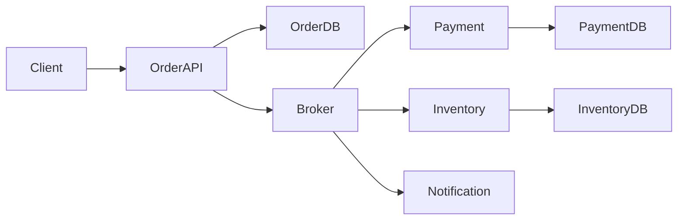
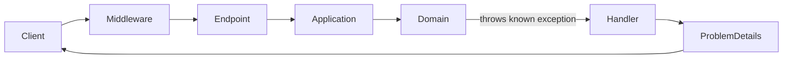
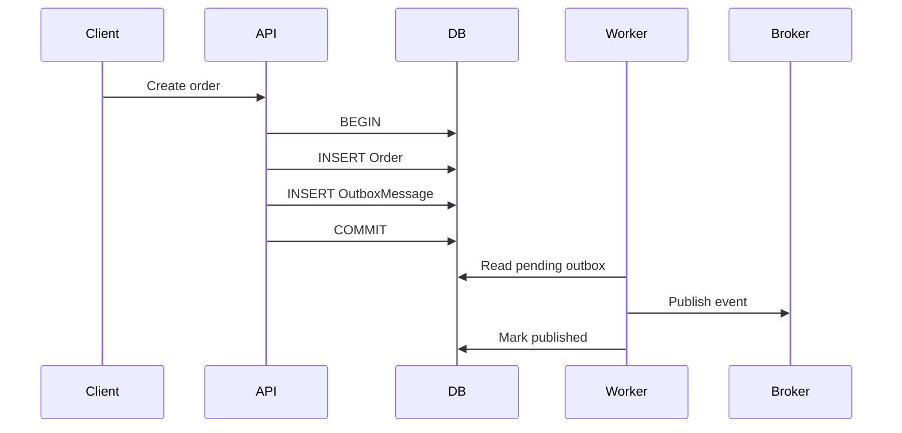
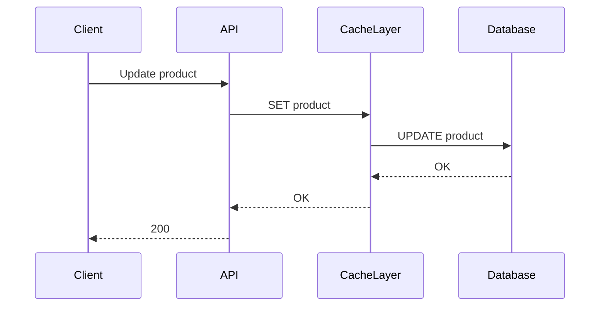
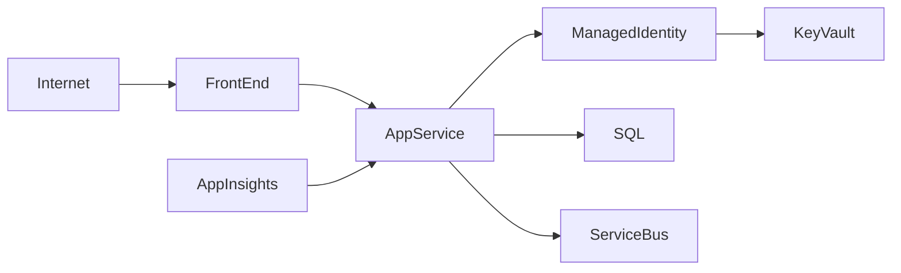
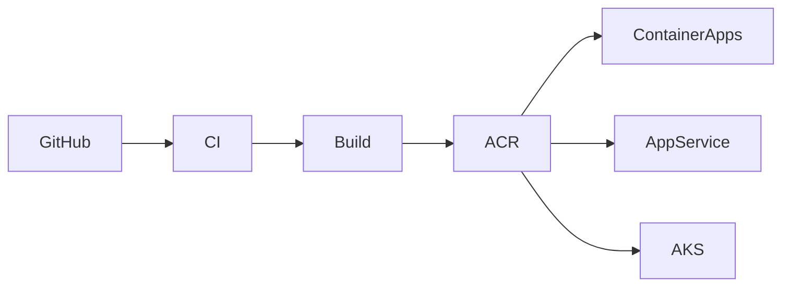
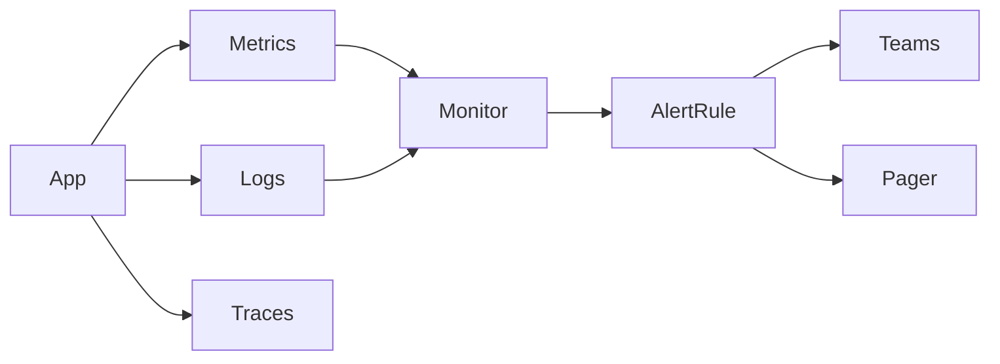
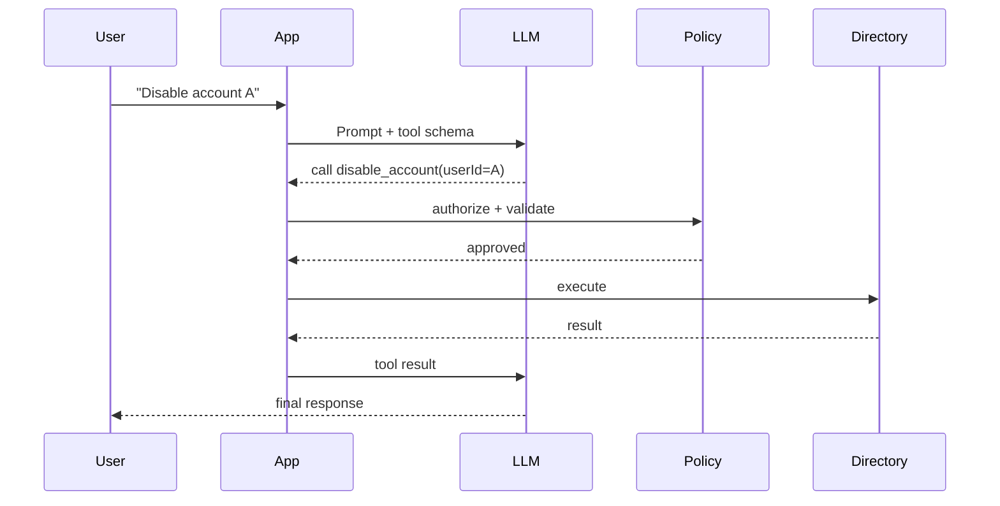
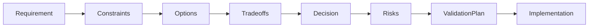

# Daily Knowledge Sharing — 2026-08-17

## Today’s Topics

1. Distributed Systems — thiết kế theo failure boundary thay vì chỉ theo service boundary
2. Error Handling trong ASP.NET Core với Problem Details và exception mapping
3. Transactions + Outbox Pattern để tránh dual-write inconsistency
4. PostgreSQL MVCC và vì sao đọc thường không chặn ghi
5. Write-Through Cache — consistency tốt hơn nhưng write path đắt hơn
6. Azure App Service — scale, deployment slot, networking và production hardening
7. Azure Container Registry — supply chain, image lifecycle và deployment safety
8. Metrics & Alerting — từ số liệu đến cảnh báo có khả năng hành động
9. Function Calling / Tool Calling cho AI — để LLM điều phối nhưng không nắm quyền thực thi
10. Technical Design Review — biến requirement thành quyết định kỹ thuật có thể kiểm chứng

---

# 1. Distributed Systems — thiết kế theo failure boundary thay vì chỉ theo service boundary

### 1. What is it?

Distributed System là hệ thống có nhiều process hoặc service chạy độc lập, giao tiếp qua network và có thể thất bại độc lập với nhau. Điểm quan trọng không phải chỉ là “chia thành nhiều microservice”, mà là chấp nhận rằng mỗi thành phần có **failure boundary** riêng.

Ví dụ một flow đặt hàng có thể đi qua API, Payment Service, Inventory Service, Notification Service và database riêng. Nếu Email Service chết, đơn hàng vẫn có thể được tạo. Nếu Payment Service timeout, hệ thống phải biết trạng thái nào an toàn để retry.

Một Senior Engineer thường nhìn distributed system bằng câu hỏi: “Thành phần nào có thể fail độc lập, và khi fail thì state của hệ thống còn đúng không?”

### 2. Why does it exist?

Khi hệ thống lớn hơn, một process duy nhất không còn luôn đáp ứng đủ yêu cầu về scale, ownership, reliability hoặc deployment independence.

Naive approach là tách service nhưng vẫn suy nghĩ như monolith: gọi service A → B → C đồng bộ và giả định tất cả luôn sẵn sàng. Khi network chậm hoặc một node chết, toàn bộ request chain có thể collapse.

Distributed design tồn tại để xử lý ba thực tế: network không đáng tin tuyệt đối, state nằm ở nhiều nơi, và failure có thể xảy ra ở bất kỳ bước nào.

### 3. How does it work?



Một flow production tốt thường cố gắng giữ transaction quan trọng trong local boundary, sau đó phát event để các thành phần khác xử lý độc lập.

Thay vì:

```text
Order API -> Payment API -> Inventory API -> Email API -> return 200
```

nên cân nhắc:

```text
Order API -> persist order -> publish event -> return
                              |
                              +-> payment consumer
                              +-> inventory consumer
                              +-> notification consumer
```

Điều này giảm coupling theo thời gian nhưng đổi lại tạo eventual consistency.

### 4. Practical example

Một background consumer .NET xử lý event theo cách idempotent:

```csharp
public async Task HandleAsync(OrderCreated message, CancellationToken ct)
{
    var processed = await db.ProcessedMessages
        .AnyAsync(x => x.MessageId == message.MessageId, ct);

    if (processed)
        return;

    await paymentService.ReserveAsync(message.OrderId, message.Amount, ct);

    db.ProcessedMessages.Add(new ProcessedMessage
    {
        MessageId = message.MessageId,
        ProcessedAtUtc = DateTime.UtcNow
    });

    await db.SaveChangesAsync(ct);
}
```

Mục tiêu không phải “message chỉ tới đúng một lần”, mà là “nếu message tới nhiều lần thì kết quả business vẫn đúng”.

### 5. Real production scenario

Trong hệ thống timesheet, khi nhân viên submit timesheet:

- Timesheet Service lưu trạng thái `Submitted`.
- Event `TimesheetSubmitted` được publish.
- Approval Service tạo approval workflow.
- Notification Service gửi email/Teams notification.
- Reporting Service cập nhật read model.

Nếu Notification Service down 10 phút, submit vẫn thành công. Notification có thể retry sau. Đây là failure isolation thực tế.

### 6. Common mistakes

- Dùng synchronous HTTP chain quá dài giữa nhiều service.
- Tin rằng message broker đảm bảo exactly-once business processing.
- Retry mọi lỗi mà không phân biệt transient và permanent failure.
- Không có correlation ID nên không trace được request xuyên service.
- Shared database giữa “microservices” nhưng lại giả định chúng độc lập.
- Không định nghĩa trạng thái trung gian như `Pending`, `Processing`, `Failed`.

### 7. Trade-offs

**Advantages**

- Scale và deploy độc lập.
- Failure isolation tốt hơn.
- Phân tách domain ownership rõ hơn.
- Có thể dùng công nghệ khác nhau cho từng workload.

**Costs / Risks**

- Eventual consistency.
- Debugging khó hơn.
- Cần idempotency, retry, dead-letter, observability.
- Network và serialization trở thành failure mode mới.
- Operational cost tăng mạnh nếu tách service quá sớm.

### 8. Junior → Middle → Senior understanding

**Junior**: hiểu service gọi nhau qua network nên không thể coi như method call local.

**Middle**: biết timeout, retry, idempotency, message broker, tracing và xử lý duplicate message.

**Senior / Technical Lead**: xác định boundary theo domain và failure mode, đánh giá synchronous vs asynchronous flow, consistency requirement, recovery strategy và operational complexity.

### 9. Key takeaway

- Distributed system là bài toán về failure và consistency trước khi là bài toán về số lượng service.
- Thiết kế boundary sao cho một failure cục bộ không kéo sập toàn bộ flow.
- Idempotency và observability là nền tảng, không phải phần bổ sung.

---

# 2. Error Handling trong ASP.NET Core với Problem Details và exception mapping

### 1. What is it?

Error Handling là cách hệ thống biến lỗi nội bộ thành response ổn định, có cấu trúc và an toàn cho client. Trong ASP.NET Core, `ProblemDetails` là format chuẩn để biểu diễn HTTP API error.

Điểm quan trọng là phân biệt **business/validation error** với **unexpected exception**. Không phải exception nào cũng là HTTP 500, và cũng không nên để stack trace lọt ra ngoài production.

### 2. Why does it exist?

Nếu mỗi controller tự `try/catch`, code nhanh chóng bị lặp và API trả lỗi không nhất quán:

```json
{ "error": "Something went wrong" }
```

ở endpoint này nhưng endpoint khác lại trả:

```json
{ "message": "Invalid employee" }
```

Client rất khó xử lý. Monitoring cũng khó group lỗi. Error handling tập trung giúp API có contract ổn định.

### 3. How does it work?



Một mapping tốt thường là:

- Validation failure → 400
- Authentication failure → 401
- Authorization failure → 403
- Resource not found → 404
- Conflict / concurrency → 409
- Rate limit → 429
- Unexpected exception → 500

### 4. Practical example

```csharp
public sealed class GlobalExceptionHandler(ILogger<GlobalExceptionHandler> logger)
    : IExceptionHandler
{
    public async ValueTask<bool> TryHandleAsync(
        HttpContext context,
        Exception exception,
        CancellationToken ct)
    {
        var (status, title) = exception switch
        {
            ValidationException => (400, "Validation failed"),
            NotFoundException => (404, "Resource not found"),
            DbUpdateConcurrencyException => (409, "Concurrency conflict"),
            _ => (500, "Unexpected server error")
        };

        if (status == 500)
            logger.LogError(exception, "Unhandled exception");

        context.Response.StatusCode = status;

        await context.Response.WriteAsJsonAsync(new ProblemDetails
        {
            Status = status,
            Title = title,
            Type = $"https://httpstatuses.com/{status}",
            Extensions = { ["traceId"] = context.TraceIdentifier }
        }, ct);

        return true;
    }
}
```

Registration:

```csharp
builder.Services.AddExceptionHandler<GlobalExceptionHandler>();
builder.Services.AddProblemDetails();
app.UseExceptionHandler();
```

### 5. Real production scenario

Một employee API update record có optimistic concurrency. Hai user cùng sửa. User thứ hai nhận `DbUpdateConcurrencyException`. Thay vì 500, API trả 409 với `traceId` và message rõ ràng để frontend reload data.

Production log vẫn giữ exception detail, nhưng client không thấy connection string, SQL hoặc stack trace.

### 6. Common mistakes

- Catch `Exception` trong mọi controller và trả 200 cùng `{ success:false }`.
- Expose stack trace ra internet.
- Dùng 500 cho validation hoặc business conflict.
- Log cùng exception ở nhiều layer gây duplicate noise.
- Không trả correlation/trace ID.
- Dùng exception cho mọi nhánh business bình thường dù có thể dùng result type.

### 7. Trade-offs

**Advantages**

- Contract lỗi thống nhất.
- Client dễ xử lý.
- Dễ monitoring và support.
- Giảm code lặp.

**Costs / Risks**

- Mapping quá generic có thể che mất semantic business error.
- Lạm dụng exception cho control flow làm code tốn chi phí và khó đọc.
- Nếu handler nuốt lỗi không log đúng mức, production investigation sẽ khó.

### 8. Junior → Middle → Senior understanding

**Junior**: biết status code có ý nghĩa và không phải lỗi nào cũng là 500.

**Middle**: implement global handler, validation response, correlation ID và test error contract.

**Senior / Technical Lead**: thiết kế taxonomy lỗi giữa domain/application/API, cân nhắc exception vs result type, observability, PII leakage và backward compatibility của error contract.

### 9. Key takeaway

- Error response là một phần của API contract.
- Client-facing error và server-side diagnostic detail phải tách nhau.
- Một global mapping tốt giúp cả maintainability lẫn production support.

---

# 3. Transactions + Outbox Pattern để tránh dual-write inconsistency

### 1. What is it?

Outbox Pattern giải quyết tình huống một service vừa phải ghi database vừa phải publish message. Hai hành động này nằm ở hai hệ thống khác nhau nên không thể dễ dàng commit trong cùng local transaction.

Thay vì ghi DB rồi publish trực tiếp, service ghi **business data + outbox message** trong cùng transaction database. Một worker riêng đọc outbox và publish sau.

### 2. Why does it exist?

Naive flow:

```text
1. INSERT Order
2. Publish OrderCreated
```

Nếu bước 1 thành công nhưng bước 2 fail, order tồn tại nhưng downstream không biết.

Nếu publish trước rồi DB commit fail, downstream nhận event cho một order không tồn tại.

Đây là dual-write problem.

### 3. How does it work?



Consistency guarantee nằm ở local transaction giữa business row và outbox row.

### 4. Practical example

```csharp
await using var tx = await db.Database.BeginTransactionAsync(ct);

var order = new Order(customerId, total);
db.Orders.Add(order);

db.OutboxMessages.Add(new OutboxMessage
{
    Id = Guid.NewGuid(),
    Type = nameof(OrderCreated),
    Payload = JsonSerializer.Serialize(new OrderCreated(order.Id, total)),
    OccurredAtUtc = DateTime.UtcNow
});

await db.SaveChangesAsync(ct);
await tx.CommitAsync(ct);
```

Worker:

```csharp
var batch = await db.OutboxMessages
    .Where(x => x.ProcessedAtUtc == null)
    .OrderBy(x => x.OccurredAtUtc)
    .Take(100)
    .ToListAsync(ct);

foreach (var message in batch)
{
    await bus.PublishAsync(message.Type, message.Payload, ct);
    message.ProcessedAtUtc = DateTime.UtcNow;
}

await db.SaveChangesAsync(ct);
```

### 5. Real production scenario

Khi offboarding employee, hệ thống cần lưu trạng thái employee và phát event để worker thực hiện Exchange Online actions. Nếu Graph/Exchange tạm lỗi, business state vẫn được lưu và outbox message còn lại để retry.

Điều này tốt hơn nhiều so với fire-and-forget `Task.Run` không có durable state.

### 6. Common mistakes

- Mark outbox processed trước khi publish thật sự thành công.
- Không làm consumer idempotent.
- Không cleanup outbox cũ khiến table phình to.
- Một worker giữ transaction DB quá lâu khi gọi broker.
- Không có retry/backoff/dead-letter strategy.
- Không đảm bảo ordering khi business yêu cầu strict order.

### 7. Trade-offs

**Advantages**

- Tránh mất event do dual-write.
- Không cần distributed transaction.
- Có audit trail và retry durable.

**Costs / Risks**

- Eventual consistency.
- Cần outbox worker và cleanup.
- Có khả năng duplicate publish.
- Monitoring phức tạp hơn.

### 8. Junior → Middle → Senior understanding

**Junior**: hiểu DB commit và broker publish là hai operation độc lập.

**Middle**: implement outbox table, publisher worker, retry và idempotent consumer.

**Senior / Technical Lead**: đánh giá throughput, ordering, partitioning, lock contention, retention, CDC alternative và failure recovery.

### 9. Key takeaway

- Outbox không tạo exactly-once delivery; nó giúp đạt at-least-once một cách an toàn hơn.
- Business transaction và outbox row phải commit cùng nhau.
- Consumer vẫn phải idempotent.

---

# 4. PostgreSQL MVCC và vì sao đọc thường không chặn ghi

### 1. What is it?

MVCC — Multi-Version Concurrency Control — cho phép database giữ nhiều version của một row để transaction đọc snapshot phù hợp thay vì luôn khóa row cho read.

PostgreSQL dùng MVCC rất sâu trong storage model. Một UPDATE thường tạo row version mới thay vì sửa trực tiếp version cũ tại chỗ.

### 2. Why does it exist?

Nếu mọi read đều lấy shared lock và mọi write lấy exclusive lock lâu dài, hệ thống nhiều concurrent user sẽ dễ block nhau.

MVCC cho phép reader thấy snapshot ổn định trong khi writer tạo version mới, từ đó tăng concurrency.

### 3. How does it work?

```text
Row version V1  ---> visible to transaction T1
       |
       +-- UPDATE --> Row version V2 ---> visible to later transaction T2
```

Mỗi transaction nhìn thấy version hợp lệ dựa trên transaction ID và visibility rules.

Old versions không biến mất ngay; VACUUM dọn dead tuples khi không transaction nào cần chúng nữa.

### 4. Practical example

Transaction A:

```sql
BEGIN;
SELECT balance FROM accounts WHERE id = 10;
```

Transaction B:

```sql
UPDATE accounts
SET balance = balance - 100
WHERE id = 10;
COMMIT;
```

A vẫn có thể tiếp tục đọc snapshot của mình tùy isolation level thay vì nhất thiết bị block bởi B.

Trong EF Core:

```csharp
await using var tx = await db.Database.BeginTransactionAsync(
    IsolationLevel.RepeatableRead,
    cancellationToken);

var account = await db.Accounts.SingleAsync(x => x.Id == id, cancellationToken);
```

### 5. Real production scenario

Một báo cáo timesheet chạy query vài giây trong khi user vẫn submit/update entries. MVCC giúp report read không chặn phần lớn write workload. Tuy nhiên transaction report quá dài có thể giữ old row versions và làm VACUUM khó reclaim space.

### 6. Common mistakes

- Nghĩ MVCC nghĩa là “không bao giờ lock”.
- Giữ transaction mở quá lâu.
- Không theo dõi dead tuples hoặc autovacuum.
- Dùng `SELECT ... FOR UPDATE` bừa bãi.
- Không hiểu isolation level nên gặp lost update hoặc write skew.
- Chạy long-running transaction trong background job rồi làm table bloat.

### 7. Trade-offs

**Advantages**

- Read/write concurrency cao.
- Snapshot semantics mạnh.
- Giảm blocking cho read-heavy workload.

**Costs / Risks**

- Cần VACUUM.
- Storage có dead tuples tạm thời.
- Isolation anomalies vẫn có thể xảy ra tùy level.
- Long transaction làm maintenance khó hơn.

### 8. Junior → Middle → Senior understanding

**Junior**: hiểu reader có thể đọc version cũ thay vì block writer.

**Middle**: biết transaction scope, isolation level, `FOR UPDATE`, autovacuum và cách xem blocking.

**Senior / Technical Lead**: phân tích MVCC bloat, long transaction, vacuum tuning, write contention và consistency anomaly theo workload.

### 9. Key takeaway

- MVCC tăng concurrency bằng nhiều row version, không phải bằng cách loại bỏ lock hoàn toàn.
- Transaction càng dài, chi phí giữ old version càng lớn.
- Isolation và locking vẫn phải được thiết kế theo business invariant.

---

# 5. Write-Through Cache — consistency tốt hơn nhưng write path đắt hơn

### 1. What is it?

Write-Through là chiến lược mà application ghi qua cache layer và cache đảm bảo dữ liệu được ghi xuống backing store trước khi write được coi là thành công.

Khác cache-aside thường load cache khi read miss, write-through tập trung vào việc cache được cập nhật đồng bộ với write.

### 2. Why does it exist?

Cache-aside dễ gặp stale data sau update nếu developer quên invalidate cache. Write-through làm write path có discipline rõ hơn: update cache và persistent store trong một flow được kiểm soát.

### 3. How does it work?



Một biến thể production phổ biến là application tự điều phối DB write rồi cache update, nhưng đó không hoàn toàn atomic nếu Redis và DB tách rời. Vì vậy cần hiểu rõ consistency guarantee thực tế.

### 4. Practical example

```csharp
public async Task UpdateProductAsync(Product product, CancellationToken ct)
{
    db.Products.Update(product);
    await db.SaveChangesAsync(ct);

    var key = $"product:{product.Id}";
    var json = JsonSerializer.Serialize(product);

    await redis.StringSetAsync(key, json, TimeSpan.FromMinutes(10));
}
```

Trong code trên, DB là source of truth. Nếu Redis update fail, có thể invalidate key hoặc chấp nhận cache miss để self-heal thay vì rollback DB.

### 5. Real production scenario

Một product catalog có read traffic rất cao. Giá sản phẩm update không thường xuyên nhưng sau update phải phản ánh nhanh. Write-through hoặc write-update-cache giúp giảm cửa sổ stale data so với TTL-only cache.

### 6. Common mistakes

- Coi DB + Redis write là atomic dù không có distributed transaction.
- Cache object quá lớn.
- Không có TTL vì tin rằng write-through đủ để luôn đúng.
- Không xử lý Redis unavailable.
- Update cache trước DB rồi DB fail.
- Cache dữ liệu permission/security nhạy cảm quá lâu.

### 7. Trade-offs

**Advantages**

- Cache mới hơn sau write.
- Read hit rate tốt cho dữ liệu vừa cập nhật.
- Giảm reliance vào invalidation thuần túy.

**Costs / Risks**

- Write latency tăng.
- Failure handling phức tạp.
- Hai datastore vẫn có thể diverge.
- Cache có thể chứa dữ liệu ít khi được đọc.

### 8. Junior → Middle → Senior understanding

**Junior**: hiểu cache và DB là hai nơi khác nhau, cập nhật một nơi chưa chắc cập nhật nơi kia.

**Middle**: implement TTL, fallback, invalidate và metrics hit/miss.

**Senior / Technical Lead**: chọn cache strategy theo consistency SLA, failure semantics, write/read ratio và source-of-truth design.

### 9. Key takeaway

- Write-through giảm stale window nhưng không tự biến Redis + DB thành một transaction atomic.
- Luôn xác định source of truth.
- Cache failure nên degrade gracefully nếu business cho phép.

---

# 6. Azure App Service — scale, deployment slot, networking và production hardening

### 1. What is it?

Azure App Service là managed hosting platform cho web app và API. Với .NET backend, nó cung cấp runtime hosting, TLS integration, autoscale, deployment slot, health check, diagnostics và integration với Azure networking.

Điểm giá trị chính là giảm operational burden so với tự quản VM.

### 2. Why does it exist?

Deploy ASP.NET Core lên VM yêu cầu quản lý OS patch, IIS/Nginx, process restart, certificate, scaling và monitoring. App Service gom phần lớn hạ tầng đó vào PaaS.

### 3. How does it work?



App Service Plan cung cấp compute. Web Apps trong cùng plan chia sẻ compute capacity. Scale-up tăng kích thước instance; scale-out tăng số instance.

Deployment Slot tạo môi trường song song như `staging`, sau đó swap vào production.

### 4. Practical example

App settings:

```text
ASPNETCORE_ENVIRONMENT=Production
KeyVaultUri=https://myvault.vault.azure.net/
```

Managed Identity trong .NET:

```csharp
var credential = new DefaultAzureCredential();
var secretClient = new SecretClient(new Uri(keyVaultUri), credential);
var secret = await secretClient.GetSecretAsync("SqlConnectionString");
```

Health check endpoint:

```csharp
builder.Services.AddHealthChecks()
    .AddSqlServer(connectionString);

app.MapHealthChecks("/health");
```

### 5. Real production scenario

Một ASP.NET Core HR API chạy trên 3 App Service instances. Deploy version mới vào staging slot, warm up, chạy smoke test, sau đó swap. Nếu version lỗi, swap back nhanh hơn rollback thủ công binary.

### 6. Common mistakes

- Scale-out nhưng dùng in-memory session/state.
- Lưu file quan trọng trên local filesystem của instance.
- Không cấu hình health check.
- Connection pool quá lớn trên mỗi instance khiến SQL bị overload khi scale-out.
- Expose App Service public khi requirement cần private access.
- Không dùng Managed Identity mà nhúng secret vào app settings.

### 7. Trade-offs

**Advantages**

- Operational overhead thấp.
- Deployment slot tiện.
- Tích hợp identity, monitoring, TLS tốt.
- Scale tương đối dễ.

**Costs / Risks**

- Ít control hơn VM/Kubernetes.
- Cost plan cao khi workload nhỏ nhưng cần always-on/high tier feature.
- Networking/private endpoint có thể phức tạp.
- Một App Service Plan bị quá tải có thể ảnh hưởng nhiều apps trong plan.

### 8. Junior → Middle → Senior understanding

**Junior**: biết App Service host web/API và không phải VM trực tiếp.

**Middle**: cấu hình slot, health check, autoscale, managed identity, diagnostics.

**Senior / Technical Lead**: thiết kế plan isolation, scale unit, networking, cost model, deployment strategy và dependency capacity khi autoscale.

### 9. Key takeaway

- App Service phù hợp khi muốn PaaS đơn giản hơn VM/Kubernetes.
- Scale application phải đi cùng scale database/cache/dependency.
- Deployment slot và Managed Identity là hai capability production rất đáng dùng.

---

# 7. Azure Container Registry — supply chain, image lifecycle và deployment safety

### 1. What is it?

Azure Container Registry (ACR) là private registry để lưu OCI/Docker container images và artifacts. Trong production, ACR không chỉ là chỗ “đẩy image”, mà là một phần của software supply chain.

### 2. Why does it exist?

Container deployment cần artifact immutable và có thể trace từ source commit → image → environment. Dùng image local hoặc public registry tùy tiện gây khó kiểm soát access, provenance và rollback.

### 3. How does it work?



Một pipeline tốt tag image bằng commit SHA:

```text
myapi:8f4c2e1
```

thay vì deploy chỉ bằng `latest`.

### 4. Practical example

```bash
docker build -t myregistry.azurecr.io/employee-api:$GITHUB_SHA .
docker push myregistry.azurecr.io/employee-api:$GITHUB_SHA
```

Deployment dùng exact tag:

```text
myregistry.azurecr.io/employee-api:8f4c2e1
```

Trong Azure, workload nên pull image bằng Managed Identity thay vì registry username/password cố định.

### 5. Real production scenario

CI build employee API, chạy unit/integration tests, push image SHA tag lên ACR. Production release chỉ promote image đã test, không build lại code trong production. Khi rollback, deploy SHA trước đó.

### 6. Common mistakes

- Dùng `latest` làm production deployment source.
- Giữ image vô thời hạn không có retention policy.
- Nhúng registry password vào CI logs.
- Build image khác nhau giữa staging và production.
- Không scan dependency/image vulnerability.
- Cho tất cả developer quyền push production registry.

### 7. Trade-offs

**Advantages**

- Private artifact store.
- Tích hợp tốt với Azure identity.
- Rollback và traceability tốt hơn.
- Có thể geo-replicate ở tier phù hợp.

**Costs / Risks**

- Storage và egress cost.
- Supply-chain governance cần thiết.
- Registry outage có thể ảnh hưởng new deployment dù workload hiện tại vẫn chạy.

### 8. Junior → Middle → Senior understanding

**Junior**: hiểu image là artifact versioned, registry là nơi lưu artifact.

**Middle**: build/tag/push, CI integration, pull bằng Managed Identity, retention.

**Senior / Technical Lead**: thiết kế promotion model, immutable artifacts, RBAC, vulnerability policy, disaster recovery và multi-region strategy.

### 9. Key takeaway

- Production image phải trace được về commit cụ thể.
- Tránh `latest` cho deployment quan trọng.
- Registry là một phần của security boundary và release process.

---

# 8. Metrics & Alerting — từ số liệu đến cảnh báo có khả năng hành động

### 1. What is it?

Metrics là các số liệu theo thời gian như request rate, latency, error rate, CPU, queue length hoặc business count. Alerting là cơ chế đánh giá metric/log condition và notify khi hệ thống có dấu hiệu cần con người hành động.

Một alert tốt không chỉ nói “CPU > 80%”, mà trả lời: “Có impact gì, có cần hành động ngay không?”

### 2. Why does it exist?

Log chỉ cho biết chuyện gì đã xảy ra trong từng event. Metrics cho biết xu hướng và magnitude. Nếu không có alert, đội vận hành có thể biết sự cố chỉ khi user phàn nàn.

### 3. How does it work?



Một monitoring hierarchy thực tế:

```text
Telemetry -> Signal -> Threshold/Anomaly -> Alert -> Action
```

### 4. Practical example

Custom metric trong .NET:

```csharp
private static readonly Meter Meter = new("Employee.Api");
private static readonly Counter<long> FailedSyncs =
    Meter.CreateCounter<long>("employee_sync_failed_total");

public void RecordSyncFailure(string provider)
{
    FailedSyncs.Add(1, new KeyValuePair<string, object?>("provider", provider));
}
```

Alert tốt hơn CPU-only:

```text
Condition:
5xx rate > 5% for 5 minutes
AND request count > 100/min
```

Điều này tránh alert khi traffic gần bằng 0.

### 5. Real production scenario

Exchange offboarding job gọi Microsoft 365. Nếu failed count tăng đột biến sau deployment, alert dựa trên `offboarding_failed_total` và queue age giúp team biết ngay. CPU có thể vẫn bình thường, nên hạ tầng metric đơn thuần không đủ.

### 6. Common mistakes

- Alert mọi thứ → alert fatigue.
- Chỉ alert CPU/memory, bỏ qua user-facing SLI.
- Threshold không có duration nên transient spike cũng page team.
- Không có runbook hoặc dashboard link trong alert.
- Metric label cardinality quá cao, ví dụ dùng `userId` làm dimension.
- Alert nhưng không có owner.

### 7. Trade-offs

**Advantages**

- Phát hiện incident sớm.
- Thấy trend và capacity issue.
- Có dữ liệu cho SLO và architecture decision.

**Costs / Risks**

- Telemetry có cost.
- Alert sai tạo noise.
- Dimension cardinality cao có thể tăng chi phí mạnh.
- Instrumentation sai tạo false confidence.

### 8. Junior → Middle → Senior understanding

**Junior**: phân biệt log và metric.

**Middle**: instrument application metric, tạo dashboard, alert threshold và validate signal.

**Senior / Technical Lead**: chọn SLI, thiết kế alert theo user impact, error budget, ownership, escalation và cost/cardinality governance.

### 9. Key takeaway

- Alert nên đại diện cho condition cần hành động, không chỉ cho một con số vượt ngưỡng.
- Ưu tiên user-impact signal hơn infrastructure noise.
- Metric phải gắn với ownership và runbook.

---

# 9. Function Calling / Tool Calling cho AI — để LLM điều phối nhưng không nắm quyền thực thi

### 1. What is it?

Function Calling / Tool Calling cho phép LLM chọn một tool có schema đã định nghĩa và tạo arguments có cấu trúc. Application nhận tool request, validate rồi mới thực thi code thật.

Điểm cốt lõi: LLM **đề xuất hành động**, deterministic code **kiểm soát quyền và thực thi**.

### 2. Why does it exist?

LLM giỏi hiểu ngôn ngữ nhưng không nên trực tiếp có quyền chạy SQL, gửi email hay xóa dữ liệu. Nếu chỉ yêu cầu model trả text rồi parse bằng regex, flow rất fragile.

Tool schema tạo contract rõ hơn giữa model và application.

### 3. How does it work?



Tool boundary là nơi bắt buộc thêm validation, authorization, idempotency và audit log.

### 4. Practical example

Tool contract:

```csharp
public sealed record DisableAccountArgs(string EmployeeEmail, string Reason);
```

Execution layer:

```csharp
public async Task<ToolResult> DisableAccountAsync(
    DisableAccountArgs args,
    ClaimsPrincipal user,
    CancellationToken ct)
{
    if (!user.IsInRole("HRAdmin"))
        return ToolResult.Denied("Insufficient permission");

    if (!EmailAddress.TryParse(args.EmployeeEmail, out var email))
        return ToolResult.Invalid("Invalid employee email");

    var operationId = Guid.NewGuid();
    await audit.WriteAsync(operationId, user.Identity!.Name!, args, ct);

    await directory.DisableAsync(email, ct);
    return ToolResult.Success(operationId);
}
```

Model không được tự bypass policy layer.

### 5. Real production scenario

Một internal AI assistant hỗ trợ Microsoft 365 administration. User hỏi “forward mailbox của employee X sang Y đến cuối tháng”. LLM trích xuất intent và arguments, nhưng application kiểm tra role, employee status, target email, end time và yêu cầu human approval trước khi gọi Exchange Online.

### 6. Common mistakes

- Cho model trực tiếp thực thi tool nguy hiểm không approval.
- Tin arguments của model như trusted input.
- Tool quá rộng kiểu `execute_sql(sql)`.
- Không giới hạn timeout/retry.
- Không log tool call và result.
- Để prompt injection từ document kích hoạt hành động write.

### 7. Trade-offs

**Advantages**

- Kết nối natural language với deterministic system.
- Schema rõ hơn text parsing.
- Dễ audit và test hơn agent tự do hoàn toàn.

**Costs / Risks**

- Model có thể chọn sai tool hoặc arguments.
- Cần policy/approval layer.
- Tool taxonomy quá lớn làm routing kém.
- Latency và cost tăng theo multi-step interaction.

### 8. Junior → Middle → Senior understanding

**Junior**: hiểu model không trực tiếp chạy function; app vẫn là executor.

**Middle**: thiết kế JSON schema, validation, retry, timeout, error result.

**Senior / Technical Lead**: thiết kế permission boundary, human approval, audit, tool granularity, prompt-injection containment và deterministic stop conditions.

### 9. Key takeaway

- LLM nên quyết định “tool nào có thể cần”, không nên tự quyết định security policy.
- Tool arguments phải được validate như external input.
- Các action có side effect cần authorization, audit và thường cả approval.

---

# 10. Technical Design Review — biến requirement thành quyết định kỹ thuật có thể kiểm chứng

### 1. What is it?

Technical Design Review là quá trình team xem xét một thiết kế trước khi implementation lớn bắt đầu. Mục tiêu không phải tạo tài liệu dài, mà làm rõ assumptions, boundary, data model, failure mode, security, deployment và trade-off.

### 2. Why does it exist?

Một requirement đơn giản như “thêm chức năng forward mailbox” có thể kéo theo data model, Graph/Exchange permission, retry, expiration job, audit, security và rollback.

Nếu team code trước rồi mới phát hiện những câu hỏi đó, chi phí thay đổi tăng rất nhanh.

### 3. How does it work?



Một design review nên trả lời ít nhất:

```text
Problem
Scope / non-scope
Current state
Proposed flow
Data model
API contract
Failure modes
Security
Observability
Migration
Rollback
Alternatives
Open questions
```

### 4. Practical example

Requirement: “Khi employee inactive, cho phép forward mailbox tới manager đến một EndTime.”

Thiết kế cần chỉ rõ:

```text
API -> save forwarding configuration
    -> outbox event
    -> worker calls Exchange Online
    -> history records attempt
    -> scheduled expiration removes forwarding
```

Data model có thể gồm:

```csharp
public sealed class MailForwardingConfig
{
    public int EmployeeId { get; init; }
    public string TargetEmail { get; init; } = null!;
    public DateTime EndTimeUtc { get; init; }
    public int FailedCount { get; set; }
}
```

Reviewer không chỉ nhìn code shape mà phải hỏi: timezone? retry? duplicate request? permission? target mailbox validation? rollback?

### 5. Real production scenario

Một team chuẩn bị đổi schema từ foreign key `OfficeId` sang `OfficeCode`. Nếu chỉ sửa entity và migration, có thể fail khi external systems vẫn gửi ID. Design review nên bàn compatibility window, backfill, dual-read/dual-write tạm thời, deployment order và rollback.

### 6. Common mistakes

- Design doc chỉ mô tả solution đã chọn, không nói alternatives.
- Không ghi assumption.
- Không mô tả failure mode.
- Bỏ qua migration và rollback.
- Review quá muộn khi code gần xong.
- Biến review thành tranh luận preference thay vì constraint/trade-off.
- Overdesign cho feature nhỏ.

### 7. Trade-offs

**Advantages**

- Bắt lỗi kiến trúc sớm.
- Đồng bộ hiểu biết giữa dev/QA/ops/product.
- Làm rõ risk và ownership.
- Tạo record cho quyết định quan trọng.

**Costs / Risks**

- Tốn thời gian nếu process quá nặng.
- Có thể tạo analysis paralysis.
- Document nhanh lỗi thời nếu không gắn với implementation.

### 8. Junior → Middle → Senior understanding

**Junior**: học cách đọc flow, data model và API contract.

**Middle**: có thể đề xuất implementation, failure handling, test cases và migration step.

**Senior / Technical Lead**: dẫn dắt trade-off discussion, xác định non-functional requirements, operational risk, rollout/rollback và decision criteria.

### 9. Key takeaway

- Technical design review nhằm giảm expensive surprise, không nhằm tạo tài liệu cho đẹp.
- Một thiết kế tốt phải mô tả cả happy path lẫn failure path.
- Luôn đưa migration, observability và rollback vào discussion trước production.