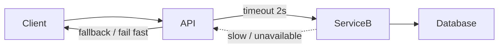
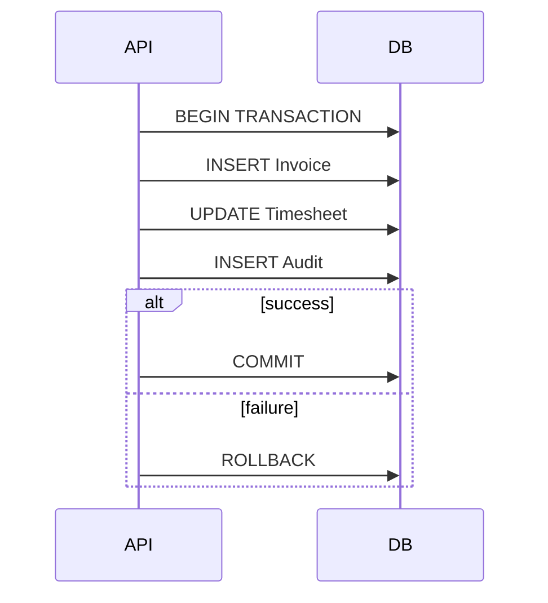
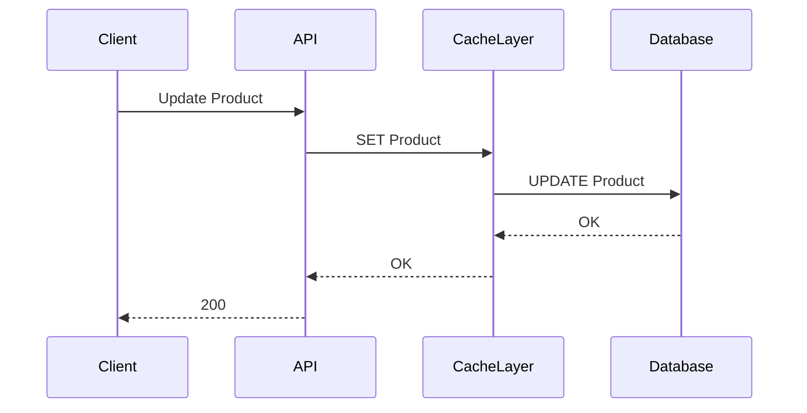
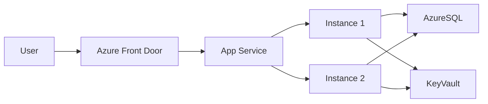
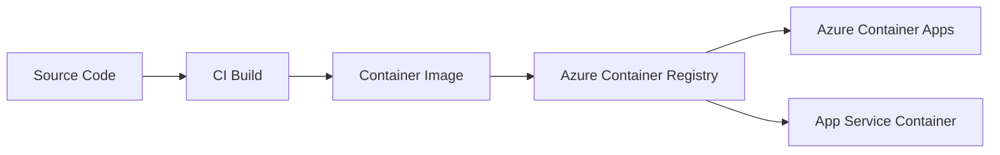
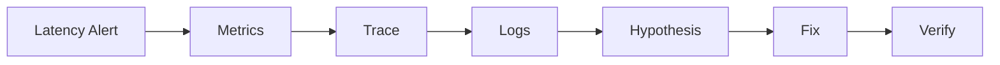
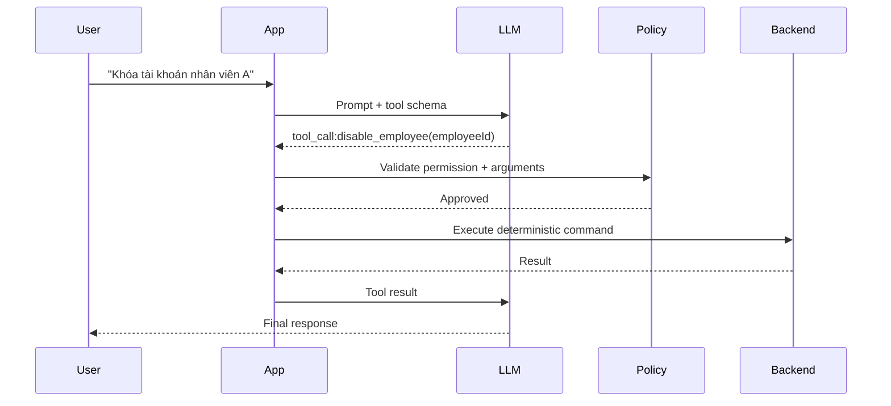

# Daily Knowledge Sharing — 2026-08-17

## Today’s Topics

1. Distributed Systems — Partial Failure, Timeout và Failure Isolation
2. RESTful API Design — Resource Semantics và Error Contract
3. EF Core Transactions — Transaction Boundary thực tế
4. Write-Through Cache — Đồng bộ cache và source of truth
5. Azure App Service — Production topology và scaling
6. Azure Container Registry — Container supply chain an toàn
7. Production Troubleshooting — Logs, Metrics, Traces và Hypothesis-Driven Debugging
8. Function Calling / Tool Calling — Ranh giới giữa AI và deterministic code
9. Requirement Analysis — Biến yêu cầu mơ hồ thành engineering constraints
10. Unit Testing — Test behavior thay vì test implementation

---

# 1. Distributed Systems — Partial Failure, Timeout và Failure Isolation

### 1. What is it?

Trong một hệ thống phân tán, nhiều thành phần chạy trên các process, máy, container hoặc vùng mạng khác nhau. Vì vậy hệ thống có thể rơi vào trạng thái **partial failure**: một phần vẫn hoạt động bình thường trong khi một phần khác chậm, mất kết nối hoặc trả về kết quả không xác định.

Điểm quan trọng là: trong monolith, lỗi thường khá rõ ràng — method throw exception hoặc process crash. Trong distributed system, request có thể timeout nhưng service phía sau thực tế đã xử lý thành công. Client không biết chính xác trạng thái cuối cùng.

Ví dụ: API A gọi Payment Service B. A timeout sau 3 giây, nhưng B hoàn tất giao dịch ở giây thứ 4. Nếu A retry mù quáng, user có thể bị charge hai lần nếu operation không idempotent.

### 2. Why does it exist?

Khi hệ thống scale ra nhiều service, network trở thành một phần của execution path. Network không đảm bảo:

- latency ổn định;
- packet luôn đến nơi;
- response luôn quay về;
- DNS luôn resolve nhanh;
- dependency luôn healthy.

Nếu code giả định rằng remote call giống như local method call, production sẽ xuất hiện các lỗi khó đoán như cascading timeout, thread pool exhaustion, retry storm và duplicate side effects.

Naive solution thường là: “Nếu lỗi thì retry 3 lần”. Nhưng retry không có timeout budget, idempotency và backoff có thể làm dependency chết nhanh hơn.

### 3. How does it work?

Một remote call nên được nhìn như một operation có failure budget:



Một pipeline resilience hợp lý thường gồm:

1. Set timeout cho từng remote call.
2. Phân loại lỗi transient và permanent.
3. Retry chỉ lỗi transient.
4. Dùng exponential backoff + jitter.
5. Circuit breaker khi dependency liên tục lỗi.
6. Bulkhead/concurrency limit để cô lập tài nguyên.
7. Idempotency cho operation có side effect.

### 4. Practical example

Với .NET có thể dùng resilience handler:

```csharp
builder.Services
    .AddHttpClient<PaymentClient>(client =>
    {
        client.BaseAddress = new Uri("https://payment.internal");
        client.Timeout = Timeout.InfiniteTimeSpan;
    })
    .AddStandardResilienceHandler(options =>
    {
        options.AttemptTimeout.Timeout = TimeSpan.FromSeconds(2);
        options.TotalRequestTimeout.Timeout = TimeSpan.FromSeconds(5);
        options.Retry.MaxRetryAttempts = 2;
        options.CircuitBreaker.SamplingDuration = TimeSpan.FromSeconds(30);
    });
```

Điểm đáng chú ý: timeout của `HttpClient` được tắt để resilience pipeline kiểm soát timeout rõ ràng, tránh nhiều timeout layer chồng lên nhau.

### 5. Real production scenario

Trong hệ thống timesheet, khi approve một record có thể cần gọi Microsoft Graph để gửi notification. Nếu Graph chậm mà transaction database đang giữ lock chờ HTTP call, toàn bộ approval flow có thể nghẽn.

Thiết kế tốt hơn:

```text
Approve request
→ update DB transaction
→ save outbox event
→ commit
→ background worker gửi Graph notification
```

Core business transaction không bị phụ thuộc trực tiếp vào network latency của external service.

### 6. Common mistakes

- Retry tất cả exception, kể cả validation hoặc 4xx permanent error.
- Retry POST có side effect mà không có idempotency key.
- Timeout quá dài khiến connection và thread bị giữ lâu.
- Timeout quá ngắn khiến hệ thống tự tạo false failure.
- Circuit breaker đặt ở sai scope, ví dụ mỗi request có breaker riêng.
- Không giới hạn concurrency tới dependency đang yếu.
- Gọi external service bên trong database transaction.

### 7. Trade-offs

**Advantages**

- Hệ thống chịu lỗi tốt hơn.
- Giảm cascading failure.
- Latency tail được kiểm soát.
- Dependency failure không kéo sập toàn hệ thống.

**Costs / Risks**

- Resilience policy làm flow phức tạp hơn.
- Retry có thể tăng traffic đáng kể.
- Timeout quá aggressive làm giảm success rate.
- Circuit breaker tuning sai dễ tạo false outage.

### 8. Junior → Middle → Senior understanding

**Junior**

Hiểu remote call có thể timeout, network call không giống local method call và cần timeout rõ ràng.

**Middle**

Biết implement retry, timeout, circuit breaker, cancellation token và phân loại lỗi transient.

**Senior / Technical Lead**

Phải thiết kế failure isolation, idempotency, retry budget, dependency SLO, graceful degradation và tránh cascading failure toàn hệ thống.

### 9. Key takeaway

- Partial failure là trạng thái bình thường của distributed systems.
- Retry không phải thuốc chữa mọi lỗi.
- Mọi remote call cần timeout budget và failure strategy.
- Side effect phải được thiết kế idempotent nếu có khả năng retry.

---

# 2. RESTful API Design — Resource Semantics và Error Contract

### 1. What is it?

RESTful API Design không chỉ là đặt endpoint theo dạng `/api/products`. Quan trọng hơn là thiết kế resource, HTTP semantics, status code và error contract để client hiểu đúng hành vi của hệ thống.

Một API tốt tạo ra contract ổn định giữa client và server. Client không cần đoán rằng `200 OK` chứa một field `success=false`, hoặc lỗi validation lại được trả về `500`.

### 2. Why does it exist?

Nếu mọi endpoint đều có rule riêng, client sẽ phải viết logic đặc biệt cho từng API. Hệ thống càng lớn thì coupling càng cao.

Ví dụ naive:

```http
POST /api/doSomething
200 OK
{
  "success": false,
  "message": "Employee not found"
}
```

HTTP nói rằng request thành công nhưng payload nói thất bại. Monitoring, gateway và client library đều khó xử lý chính xác.

### 3. How does it work?

HTTP semantics nên phản ánh meaning của operation:

```text
GET    /employees/42      → đọc resource
POST   /employees         → tạo mới
PUT    /employees/42      → replace/update toàn bộ representation
PATCH  /employees/42      → partial update
DELETE /employees/42      → xóa
```

Error contract nên thống nhất. ASP.NET Core hỗ trợ `ProblemDetails`:

```json
{
  "type": "https://example.com/problems/validation-error",
  "title": "Validation failed",
  "status": 400,
  "detail": "One or more fields are invalid",
  "traceId": "00-abcd..."
}
```

### 4. Practical example

```csharp
app.UseExceptionHandler(exceptionHandlerApp =>
{
    exceptionHandlerApp.Run(async context =>
    {
        context.Response.StatusCode = StatusCodes.Status500InternalServerError;

        await context.Response.WriteAsJsonAsync(new ProblemDetails
        {
            Status = 500,
            Title = "Unexpected server error",
            Detail = "The request could not be completed."
        });
    });
});
```

Validation endpoint:

```csharp
if (!await db.Employees.AnyAsync(x => x.Id == employeeId))
{
    return Results.Problem(
        statusCode: StatusCodes.Status404NotFound,
        title: "Employee not found");
}
```

### 5. Real production scenario

Mobile app gọi API duyệt leave request. Có ba trường hợp:

- request không tồn tại → `404`;
- request đã được duyệt trước đó → `409 Conflict`;
- payload thiếu field bắt buộc → `400`;
- user không có quyền → `403`.

Client có thể xử lý UX chính xác dựa trên status code thay vì parse message text.

### 6. Common mistakes

- Dùng `200` cho mọi kết quả.
- Dùng `500` cho lỗi business rule.
- Trả stack trace hoặc internal exception message cho client.
- Không version error contract.
- Endpoint chứa verbs không cần thiết như `/getEmployee`, `/createEmployee`.
- Không phân biệt `401 Unauthorized` và `403 Forbidden`.
- Pagination không có giới hạn tối đa.

### 7. Trade-offs

**Advantages**

- Contract dễ hiểu và chuẩn hóa.
- Monitoring/APM đọc status code chính xác.
- Client code đơn giản hơn.
- Dễ tích hợp gateway, SDK, generated client.

**Costs / Risks**

- Contract phải được quản lý backward compatibility.
- Strict REST đôi khi không phù hợp workflow domain phức tạp.
- Một số action business tự nhiên hơn khi dùng command endpoint.

### 8. Junior → Middle → Senior understanding

**Junior**

Biết HTTP methods, basic status code và resource naming.

**Middle**

Biết validation, pagination, ProblemDetails, versioning và backward compatibility.

**Senior / Technical Lead**

Phải quyết định contract boundaries, compatibility policy, idempotency semantics, API governance và khi nào nên ưu tiên domain command thay vì REST purity.

### 9. Key takeaway

- HTTP status code là một phần của contract.
- Error contract phải ổn định như success contract.
- REST là semantics, không chỉ là URL đẹp.

---

# 3. EF Core Transactions — Transaction Boundary thực tế

### 1. What is it?

Transaction boundary xác định những thay đổi nào phải cùng thành công hoặc cùng rollback.

Trong EF Core, một lần `SaveChangesAsync()` mặc định chạy trong transaction khi provider hỗ trợ transaction. Nhưng nhiều workflow thực tế có nhiều lần save, raw SQL hoặc nhiều aggregate nên cần hiểu rõ boundary.

### 2. Why does it exist?

Giả sử flow tạo invoice:

1. Insert invoice.
2. Update timesheet status.
3. Insert audit history.

Nếu step 2 lỗi sau khi step 1 đã commit, dữ liệu có thể inconsistent.

Naive solution là gọi `SaveChangesAsync()` sau từng step mà không xem xét atomicity.

### 3. How does it work?

Transaction tạo một atomic unit:



Transaction boundary nên bao quanh state changes cần consistency trực tiếp, nhưng không nên kéo dài qua network call.

### 4. Practical example

```csharp
await using var transaction =
    await db.Database.BeginTransactionAsync(cancellationToken);

try
{
    db.Invoices.Add(invoice);

    timesheet.MarkInvoiced(invoice.Id);
    db.AuditLogs.Add(AuditLog.Create("InvoiceCreated", invoice.Id));

    await db.SaveChangesAsync(cancellationToken);
    await transaction.CommitAsync(cancellationToken);
}
catch
{
    await transaction.RollbackAsync(cancellationToken);
    throw;
}
```

Nếu cần publish message, nên dùng Outbox Pattern thay vì gửi message trước commit.

### 5. Real production scenario

Employee offboarding cập nhật trạng thái nhân viên và tạo mail configuration. Nếu hai thay đổi thuộc cùng business invariant, chúng nên commit cùng transaction.

Nhưng call Exchange Online để convert mailbox thành shared mailbox không nên nằm trong transaction. Thay vào đó lưu command/outbox rồi background worker xử lý sau commit.

### 6. Common mistakes

- Giữ transaction mở trong khi gọi HTTP API.
- Transaction scope quá lớn gây lock lâu.
- Cho rằng nhiều `DbContext` tự chia sẻ cùng transaction.
- Không hiểu retry execution strategy có thể tương tác với manual transaction.
- Dùng transaction để che giấu design domain kém.
- `SaveChanges` quá nhiều lần trong cùng workflow không cần thiết.

### 7. Trade-offs

**Advantages**

- Bảo đảm atomicity.
- Giữ invariant dữ liệu.
- Failure handling rõ ràng.

**Costs / Risks**

- Lock contention tăng nếu transaction dài.
- Throughput giảm nếu isolation quá mạnh.
- Distributed transaction giữa nhiều systems rất phức tạp.

### 8. Junior → Middle → Senior understanding

**Junior**

Hiểu commit và rollback.

**Middle**

Biết đặt transaction boundary hợp lý, debug lock và xử lý exception.

**Senior / Technical Lead**

Phải quyết định consistency boundary, aggregate boundary, outbox/eventual consistency và tác động của isolation level lên throughput.

### 9. Key takeaway

- Transaction boundary là business decision, không chỉ là database API.
- Không giữ DB transaction trong lúc chờ network.
- Cross-system consistency thường cần Outbox/Saga thay vì distributed transaction.

---

# 4. Write-Through Cache — Đồng bộ cache và source of truth

### 1. What is it?

Write-Through là chiến lược cache trong đó application ghi dữ liệu qua cache layer, và cache layer đảm bảo dữ liệu được ghi xuống backing store.

Khác Cache-Aside, nơi application tự cập nhật database rồi invalidate/cache lại, Write-Through cố tạo một đường ghi thống nhất.

### 2. Why does it exist?

Cache-Aside dễ dùng nhưng invalidation rất dễ sai. Một write cập nhật database nhưng quên xóa cache khiến người dùng đọc stale data.

Write-Through giảm khả năng cache và database lệch nhau bằng cách chuẩn hóa write path.

### 3. How does it work?



Một variant khác là DB được update trước rồi cache update đồng bộ, nhưng khi đó cần xử lý failure giữa hai bước.

### 4. Practical example

```csharp
public sealed class ProductService(
    AppDbContext db,
    IDistributedCache cache)
{
    public async Task UpdatePriceAsync(
        int productId,
        decimal price,
        CancellationToken ct)
    {
        var product = await db.Products
            .SingleAsync(x => x.Id == productId, ct);

        product.Price = price;
        await db.SaveChangesAsync(ct);

        var payload = JsonSerializer.Serialize(product);
        await cache.SetStringAsync(
            $"product:{productId}",
            payload,
            new DistributedCacheEntryOptions
            {
                AbsoluteExpirationRelativeToNow = TimeSpan.FromMinutes(10)
            },
            ct);
    }
}
```

Đây là implementation gần write-through ở application layer, nhưng vẫn có failure window giữa DB và cache. Với hệ thống nghiêm ngặt hơn có thể dùng event/outbox để đảm bảo cache refresh eventually.

### 5. Real production scenario

Một SaaS quản lý tenant settings có read volume rất cao nhưng update hiếm. Mỗi update settings cần phản ánh nhanh sang cache để hàng nghìn request sau không hit database.

Write-through phù hợp nếu write volume thấp và stale settings gây lỗi nghiệp vụ.

### 6. Common mistakes

- Xem cache là source of truth.
- Không có expiration.
- Ghi cache thành công nhưng DB thất bại.
- Cache object quá lớn.
- Cache dữ liệu security-sensitive không đúng isolation key.
- Không có fallback khi Redis unavailable.

### 7. Trade-offs

**Advantages**

- Giảm stale data so với invalidation thủ công.
- Read path nhanh.
- Write logic nhất quán hơn.

**Costs / Risks**

- Write latency tăng.
- Cache outage có thể ảnh hưởng write path.
- Vẫn cần xử lý partial failure.
- Implementation phức tạp hơn Cache-Aside đơn giản.

### 8. Junior → Middle → Senior understanding

**Junior**

Hiểu cache không thay thế database.

**Middle**

Biết implement TTL, fallback, invalidation và serialization.

**Senior / Technical Lead**

Phải quyết định consistency model, failure handling giữa cache và DB, cache ownership và khi nào nên dùng event-driven refresh.

### 9. Key takeaway

- Write-Through chuẩn hóa write path nhưng không loại bỏ failure.
- Cache phải có TTL và fallback strategy.
- Chọn strategy dựa trên consistency requirement, không chỉ performance.

---

# 5. Azure App Service — Production topology và scaling

### 1. What is it?

Azure App Service là managed platform để host web app, REST API và backend application mà không phải quản lý VM trực tiếp.

Developer deploy code hoặc container; Azure xử lý phần lớn host OS, load balancing nội bộ, TLS integration, deployment slots và scaling.

### 2. Why does it exist?

Tự quản VM cho một ASP.NET Core API có nhiều overhead:

- patch OS;
- IIS/Nginx configuration;
- scaling;
- certificate;
- health monitoring;
- deployment orchestration.

App Service giảm operational burden để team tập trung vào application.

### 3. How does it work?



Scale-out tạo nhiều instance. Vì vậy application phải tránh giữ session state trong memory nếu request có thể đi tới instance khác.

### 4. Practical example

ASP.NET Core app nên đọc secret qua environment/managed configuration thay vì hard-code:

```csharp
var builder = WebApplication.CreateBuilder(args);

builder.Services.AddHealthChecks()
    .AddDbContextCheck<AppDbContext>();

var app = builder.Build();
app.MapHealthChecks("/health");
app.Run();
```

Với deployment slot:

```text
Production slot
Staging slot

Deploy → Staging → warm-up → smoke test → swap → Production
```

### 5. Real production scenario

Backend employee management chạy App Service Premium với 3 instances. Front Door xử lý public entry point, Key Vault chứa secrets, Azure SQL là database, Application Insights thu telemetry.

Khi release mới, CI/CD deploy vào staging slot, chạy smoke test rồi swap. Nếu lỗi, swap back nhanh hơn deploy lại binary cũ.

### 6. Common mistakes

- Lưu session/user state trong process memory.
- Không cấu hình health check.
- Scale-out nhưng database connection pool trở thành bottleneck.
- Dùng sticky session để che application state design kém.
- Secret nằm trong appsettings committed lên Git.
- Không warm up slot trước swap.

### 7. Trade-offs

**Advantages**

- Managed hosting đơn giản.
- Deployment slots hữu ích.
- Scale-out tương đối dễ.
- Tích hợp Azure ecosystem tốt.

**Costs / Risks**

- Ít control hơn VM/Kubernetes.
- Một số workload background dài không phù hợp.
- Premium tier có thể tốn chi phí.
- Scale app không giải quyết bottleneck downstream.

### 8. Junior → Middle → Senior understanding

**Junior**

Hiểu App Service là nơi host API/web app managed.

**Middle**

Biết deploy, configuration, slots, health checks và autoscale cơ bản.

**Senior / Technical Lead**

Phải thiết kế stateless app, capacity, dependency limits, networking/private endpoint, DR, deployment strategy và cost model.

### 9. Key takeaway

- App Service scale tốt khi application stateless.
- Scale compute không tự động scale database/dependency.
- Deployment slots là công cụ production rất giá trị.

---

# 6. Azure Container Registry — Container supply chain an toàn

### 1. What is it?

Azure Container Registry (ACR) là private registry dùng để lưu container images và OCI artifacts.

Trong pipeline containerized, ACR nằm giữa build system và runtime environment như Container Apps, AKS hoặc App Service for Containers.

### 2. Why does it exist?

Nếu image chỉ tồn tại trên developer machine hoặc public registry không kiểm soát, team khó đảm bảo:

- image nào đang chạy production;
- ai được push/pull;
- image có bị thay đổi hay không;
- vulnerability nào tồn tại;
- rollback về version nào.

Registry cung cấp immutable artifact boundary giữa build và deploy.

### 3. How does it work?



Một image nên được tag bằng immutable identifier như commit SHA:

```text
my-api:867a2454
```

Tag `latest` có thể tồn tại cho convenience, nhưng deployment production nên pin version cụ thể.

### 4. Practical example

```yaml
- name: Build
  run: docker build -t myregistry.azurecr.io/employee-api:${{ github.sha }} .

- name: Push
  run: docker push myregistry.azurecr.io/employee-api:${{ github.sha }}
```

Runtime nên authenticate bằng Managed Identity khi có thể thay vì username/password registry.

### 5. Real production scenario

CI build .NET API, chạy unit/integration test, scan image rồi push ACR. Release pipeline lấy đúng digest/image tag đã được verify và deploy sang Container Apps.

Nếu production lỗi, rollback sang image SHA trước đó mà không rebuild source.

### 6. Common mistakes

- Deploy bằng `latest`.
- Rebuild cùng version thay vì promote cùng artifact.
- Dùng admin credentials của ACR trong pipeline lâu dài.
- Không cleanup image cũ.
- Không scan dependencies/base image.
- Build production image trên developer laptop.

### 7. Trade-offs

**Advantages**

- Artifact traceability tốt.
- Private access control.
- Tích hợp Azure runtime.
- Rollback dễ hơn.

**Costs / Risks**

- Storage và egress có chi phí.
- Cần lifecycle policy.
- Registry availability trở thành dependency của deployment/startup.

### 8. Junior → Middle → Senior understanding

**Junior**

Hiểu image registry là nơi lưu image đã build.

**Middle**

Biết tagging, push/pull, authentication, CI/CD và rollback.

**Senior / Technical Lead**

Phải quản artifact provenance, immutable promotion, vulnerability policy, private networking và disaster recovery của supply chain.

### 9. Key takeaway

- Build once, promote the same artifact.
- Production nên pin image version hoặc digest cụ thể.
- Registry credentials nên được thay bằng identity-based access khi có thể.

---

# 7. Production Troubleshooting — Logs, Metrics, Traces và Hypothesis-Driven Debugging

### 1. What is it?

Production troubleshooting là quá trình điều tra lỗi trên hệ thống thật bằng evidence thay vì đoán.

Ba nguồn telemetry chính:

- **Logs**: sự kiện chi tiết.
- **Metrics**: xu hướng số liệu theo thời gian.
- **Traces**: request đi qua các service như thế nào.

Một Senior Engineer không bắt đầu bằng “chắc database chậm”. Họ bắt đầu bằng symptom và measurement.

### 2. Why does it exist?

Production khác local:

- traffic lớn;
- nhiều instance;
- network thật;
- database thật;
- concurrency cao;
- dependency có latency biến động.

Không thể attach debugger vào mọi process. Cần telemetry để reconstruct điều gì đã xảy ra.

### 3. How does it work?

Một flow điều tra tốt:

```text
Symptom
→ xác định thời gian ảnh hưởng
→ xem metrics
→ tìm correlation/trace
→ đọc logs liên quan
→ lập hypothesis
→ verify bằng data
→ mitigation
→ root cause
```

Ví dụ:



### 4. Practical example

Structured logging:

```csharp
logger.LogInformation(
    "Approve leave {LeaveId} for employee {EmployeeId} completed in {ElapsedMs} ms",
    leave.Id,
    leave.EmployeeId,
    elapsed.TotalMilliseconds);
```

Không nên:

```csharp
logger.LogInformation($"Approve leave {leave.Id} completed");
```

Structured fields giúp query dễ hơn.

### 5. Real production scenario

Alert cho biết P95 latency endpoint `/api/timesheets/search` tăng từ 300ms lên 4s.

Điều tra:

1. Metrics cho thấy CPU app bình thường.
2. Trace cho thấy 3.5s nằm ở SQL dependency.
3. Query log chỉ ra một filter mới dùng `LIKE '%text%'` trên bảng lớn.
4. Execution plan cho thấy table scan.
5. Fix query/index rồi đo lại P95.

Đây là evidence-driven debugging.

### 6. Common mistakes

- Log quá nhiều nhưng không structured.
- Không có correlation/trace ID.
- Alert theo CPU nhưng bỏ qua user-facing SLI.
- Fix trước khi xác định bottleneck.
- Chỉ xem average latency, bỏ qua P95/P99.
- Log PII hoặc secret.
- Không ghi lại timeline incident.

### 7. Trade-offs

**Advantages**

- Giảm MTTR.
- Root cause chính xác hơn.
- Phát hiện regression sớm.

**Costs / Risks**

- Telemetry có chi phí ingestion/storage.
- Logging quá mức tạo noise.
- Trace sampling có thể bỏ sót edge case.

### 8. Junior → Middle → Senior understanding

**Junior**

Biết đọc logs và trace ID.

**Middle**

Biết correlate logs/metrics/traces và đặt metric dashboard.

**Senior / Technical Lead**

Phải thiết kế observability model, SLI/SLO, alert quality, incident workflow và cost-control telemetry.

### 9. Key takeaway

- Debug production bằng evidence, không bằng phỏng đoán.
- Logs, metrics và traces bổ sung cho nhau.
- P95/P99 thường quan trọng hơn average.

---

# 8. Function Calling / Tool Calling — Ranh giới giữa AI và deterministic code

### 1. What is it?

Function Calling/Tool Calling cho phép model chọn một tool có schema rõ ràng để thực hiện hành động như tra cứu dữ liệu, gọi API hoặc trigger workflow.

Model không trực tiếp thực thi business-critical operation. Nó sinh ra structured tool request; application validate và quyết định có thực thi hay không.

### 2. Why does it exist?

LLM mạnh ở reasoning trên ngôn ngữ nhưng không nên tự quyết định các thao tác deterministic như:

- chuyển tiền;
- xóa dữ liệu;
- cấp quyền;
- update trạng thái business;
- chạy SQL tùy ý.

Nếu chỉ prompt “hãy gọi API đúng”, model vẫn có thể hallucinate parameter hoặc chọn action sai.

Tool schema tạo một boundary rõ giữa AI decision và application control.

### 3. How does it work?



LLM đề xuất action; application sở hữu authorization, validation và side effects.

### 4. Practical example

```csharp
public sealed record DisableEmployeeArgs(Guid EmployeeId);

public async Task<ToolResult> DisableEmployeeAsync(
    DisableEmployeeArgs args,
    ClaimsPrincipal user,
    CancellationToken ct)
{
    if (!user.IsInRole("HRAdmin"))
        return ToolResult.Denied("Permission denied");

    var employee = await db.Employees.FindAsync([args.EmployeeId], ct);
    if (employee is null)
        return ToolResult.NotFound();

    employee.Disable();
    await db.SaveChangesAsync(ct);

    return ToolResult.Success();
}
```

### 5. Real production scenario

AI assistant nội bộ cho phép HR hỏi: “Nhân viên nào sắp hết hợp đồng?” Model có thể dùng read-only search tool.

Nếu user yêu cầu “disable account”, hệ thống bắt buộc policy check, audit log và human confirmation trước execution.

### 6. Common mistakes

- Tin tool arguments từ model mà không validate.
- Cho model quyền gọi SQL/raw shell trực tiếp.
- Không phân biệt read-only tool và destructive tool.
- Không audit tool execution.
- Không đặt timeout/retry cho tool.
- Prompt injection có thể khiến model chọn tool nguy hiểm.

### 7. Trade-offs

**Advantages**

- Kết nối LLM với hệ thống thật.
- Structured parameters dễ validate.
- Tách reasoning khỏi execution.

**Costs / Risks**

- Tool orchestration phức tạp.
- Model vẫn có thể chọn tool sai.
- Cần permission boundary và approval flow.
- Latency tăng do nhiều vòng model/tool.

### 8. Junior → Middle → Senior understanding

**Junior**

Hiểu model không nên trực tiếp thao tác database production.

**Middle**

Biết define schema, validate argument, execute tool và handle tool result.

**Senior / Technical Lead**

Phải thiết kế least privilege, approval gates, observability, deterministic invariants, tool isolation và blast radius khi model sai.

### 9. Key takeaway

- AI đề xuất; deterministic code kiểm soát.
- Tool input luôn phải validate và authorize.
- Destructive action cần stronger guardrail hơn read-only action.

---

# 9. Requirement Analysis — Biến yêu cầu mơ hồ thành engineering constraints

### 1. What is it?

Requirement Analysis là quá trình chuyển nhu cầu business thành behavior, constraints, edge cases và acceptance conditions có thể implement/test được.

Senior Developer không chỉ hỏi “feature làm gì?” mà còn hỏi “feature phải đúng trong điều kiện nào, tải bao nhiêu, thất bại ra sao và ai được dùng?”.

### 2. Why does it exist?

Một yêu cầu như:

> “Khi nhân viên nghỉ việc thì forward email sang manager.”

nghe đơn giản nhưng thiếu rất nhiều thông tin:

- forward đến bao giờ?
- có auto reply không?
- user reactivated thì sao?
- target mailbox bị xóa thì sao?
- action retry thế nào nếu Exchange Online lỗi?
- ai được thay đổi cấu hình?

Nếu code ngay, những gap này sẽ biến thành production bug.

### 3. How does it work?

Một flow tốt:

```text
Business goal
→ actor
→ happy path
→ business rules
→ edge cases
→ failure scenarios
→ security
→ data model
→ non-functional requirements
→ acceptance criteria
```

### 4. Practical example

Từ requirement “forward email khi offboarding”, có thể chuyển thành rules:

```text
IF Employee.Status changes Active → Inactive
AND EmailAction = Forward
THEN TargetEmail is required
AND EndTime is required
AND EndTime > now
AND configuration must be persisted before external execution
```

Sau đó command model:

```csharp
public sealed record OffboardEmployeeCommand(
    Guid EmployeeId,
    MailAction Action,
    string? TargetEmail,
    DateTimeOffset? EndTime,
    bool EnableAutoReply,
    string? AutoReplyMessage);
```

### 5. Real production scenario

Trong timesheet billing, business nói “Billable Hours không được lớn hơn Actual Hours”. Senior cần làm rõ:

- check theo row, day hay week?
- historical data có bị validate lại không?
- import data xử lý ra sao?
- API batch update fail toàn bộ hay partial?
- timezone nào xác định ngày?

Những câu hỏi này ảnh hưởng trực tiếp tới data model và transaction design.

### 6. Common mistakes

- Chỉ đọc user story title rồi code.
- Không hỏi edge case.
- Không ghi assumption.
- Bỏ qua security và permission.
- Không xác định source of truth.
- Không làm rõ failure semantics.
- Acceptance criteria quá phụ thuộc UI thay vì behavior.

### 7. Trade-offs

**Advantages**

- Giảm rework.
- Design chính xác hơn.
- QA dễ test.
- Business rule ít bị “ẩn” trong code.

**Costs / Risks**

- Analysis quá lâu có thể delay delivery.
- Over-specification gây chậm nếu domain còn biến động.

### 8. Junior → Middle → Senior understanding

**Junior**

Biết hỏi khi requirement thiếu thông tin.

**Middle**

Biết chuyển requirement thành acceptance criteria, validation và data flow.

**Senior / Technical Lead**

Phải nhận diện ambiguity có ảnh hưởng architecture, security, consistency, scale và operations; đồng thời biết khi nào đủ rõ để bắt đầu implement.

### 9. Key takeaway

- Requirement rõ ràng là đầu vào của design tốt.
- Edge case phải được phát hiện trước production.
- Non-functional requirement quan trọng không kém happy path.

---

# 10. Unit Testing — Test behavior thay vì test implementation

### 1. What is it?

Unit test kiểm tra behavior của một unit nhỏ, thường là class hoặc domain service, trong isolation tương đối.

Mục tiêu không phải đạt coverage cao bằng mọi giá. Mục tiêu là bảo vệ business behavior để refactor implementation mà test vẫn còn giá trị.

### 2. Why does it exist?

Nếu test phụ thuộc quá sâu vào internal implementation, mỗi lần refactor sẽ làm hàng loạt test hỏng dù behavior không đổi.

Ví dụ test tệ:

- verify private helper được gọi;
- verify repository method gọi đúng 3 lần dù không phải requirement;
- mock mọi class chỉ để assert implementation detail.

### 3. How does it work?

Test behavior thường theo Arrange → Act → Assert:

```text
Arrange state/input
→ Execute public behavior
→ Assert observable result/state
```

Điều quan trọng là assertion phản ánh rule business.

### 4. Practical example

Domain rule: billable hours không vượt actual hours.

```csharp
public sealed class TimesheetEntry
{
    public decimal ActualHours { get; private set; }
    public decimal BillableHours { get; private set; }

    public void SetBillableHours(decimal hours)
    {
        if (hours > ActualHours)
            throw new DomainException("Billable hours cannot exceed actual hours.");

        BillableHours = hours;
    }
}
```

Test:

```csharp
[Fact]
public void SetBillableHours_WhenGreaterThanActual_ShouldFail()
{
    var entry = TimesheetEntry.Create(actualHours: 8);

    var act = () => entry.SetBillableHours(9);

    act.Should()
        .Throw<DomainException>()
        .WithMessage("Billable hours cannot exceed actual hours.");
}
```

Test không quan tâm method nội bộ nào thực hiện validation.

### 5. Real production scenario

Một team refactor validation từ service sang domain entity. Nếu tests verify behavior, hầu hết test vẫn pass. Nếu tests mock chặt internal service call, rất nhiều test phải viết lại dù requirement không đổi.

Đó là dấu hiệu test đang coupling với implementation.

### 6. Common mistakes

- Mock quá nhiều.
- Unit test EF Core query bằng mock `DbSet` không thực tế.
- Assert implementation detail.
- Test chỉ happy path.
- Dùng test data không phản ánh domain boundary.
- Coverage cao nhưng business rule quan trọng lại không có test.

### 7. Trade-offs

**Advantages**

- Feedback nhanh.
- Bảo vệ domain rules.
- Hỗ trợ refactoring.
- Debug failure dễ hơn E2E test.

**Costs / Risks**

- Không phát hiện integration issue.
- Mock sai có thể tạo false confidence.
- Test suite kém thiết kế trở thành maintenance burden.

### 8. Junior → Middle → Senior understanding

**Junior**

Biết Arrange/Act/Assert và viết test cho public behavior.

**Middle**

Biết chọn mock/fake phù hợp, test edge case và tránh fragile tests.

**Senior / Technical Lead**

Phải thiết kế testing pyramid, xác định boundary nào cần unit/integration/E2E, giữ test maintainable và tối ưu confidence trên chi phí chạy/maintain.

### 9. Key takeaway

- Test business behavior, không test cách code được viết bên trong.
- Unit test nhanh nhưng không thay thế integration test.
- Coverage chỉ là signal, không phải mục tiêu cuối cùng.
