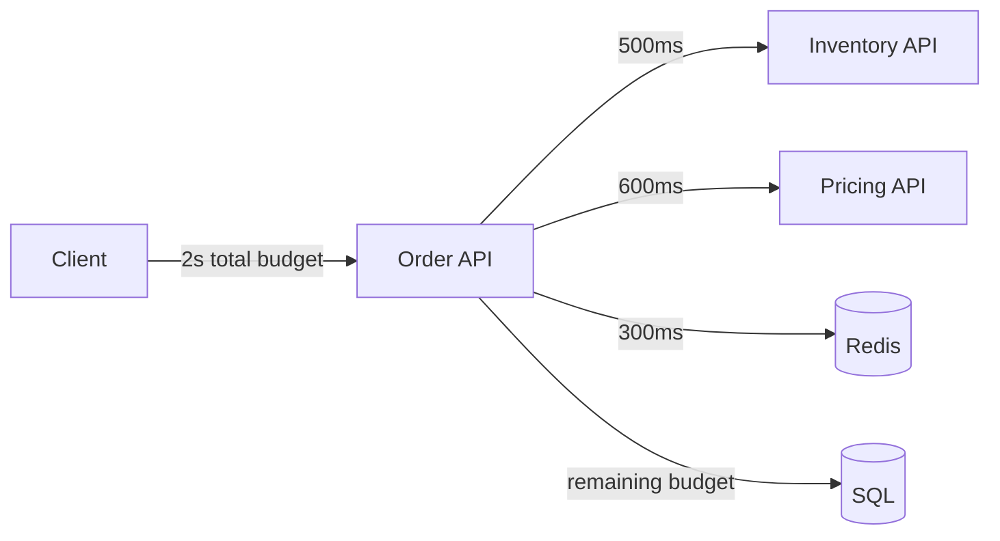
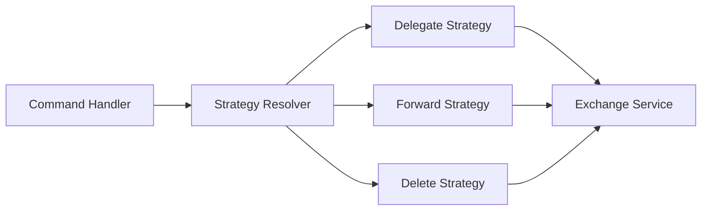
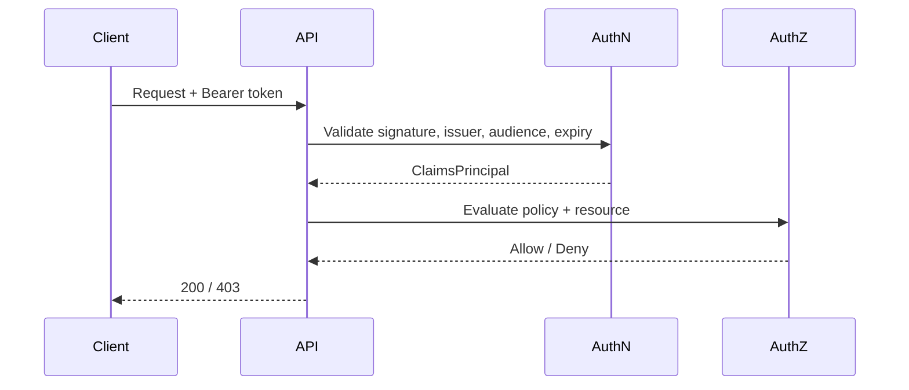
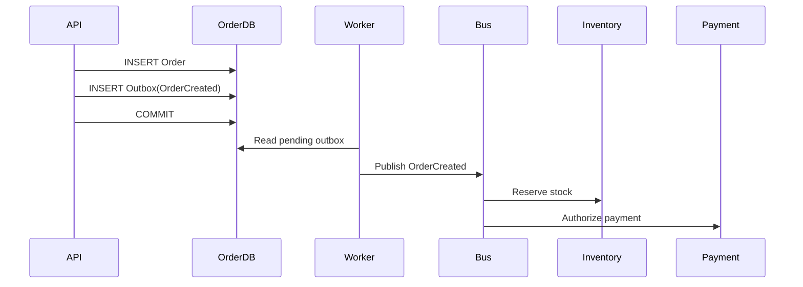
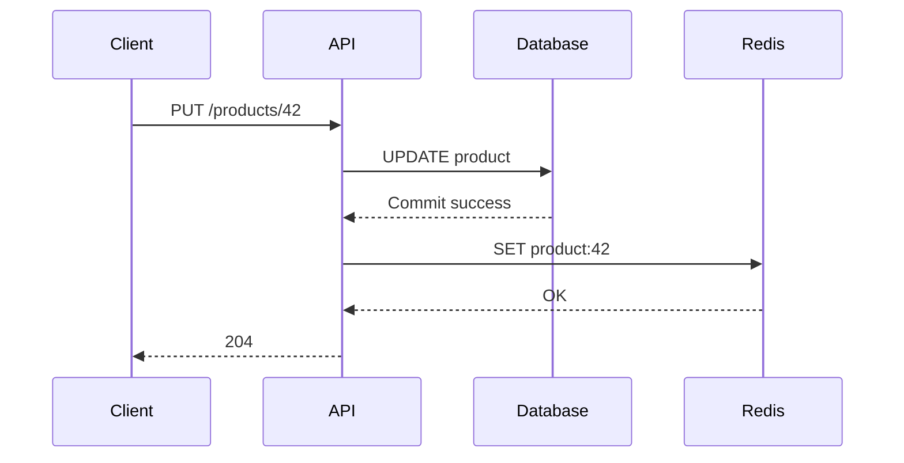
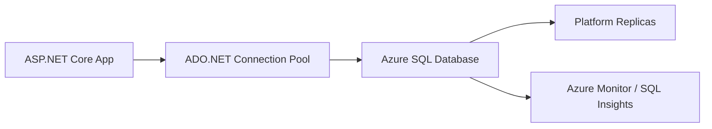
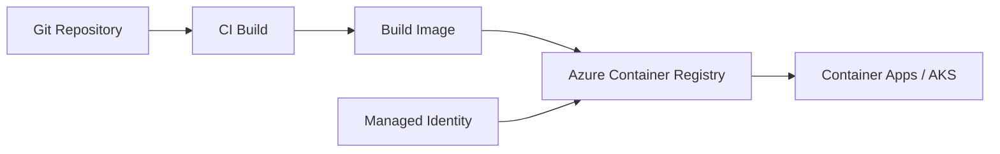
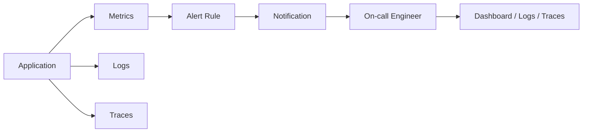
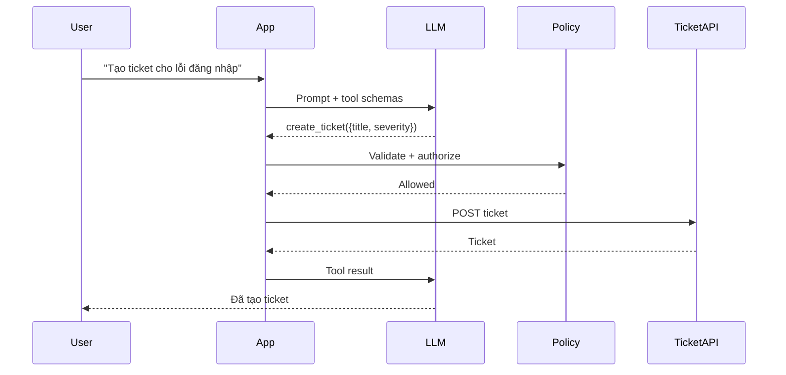
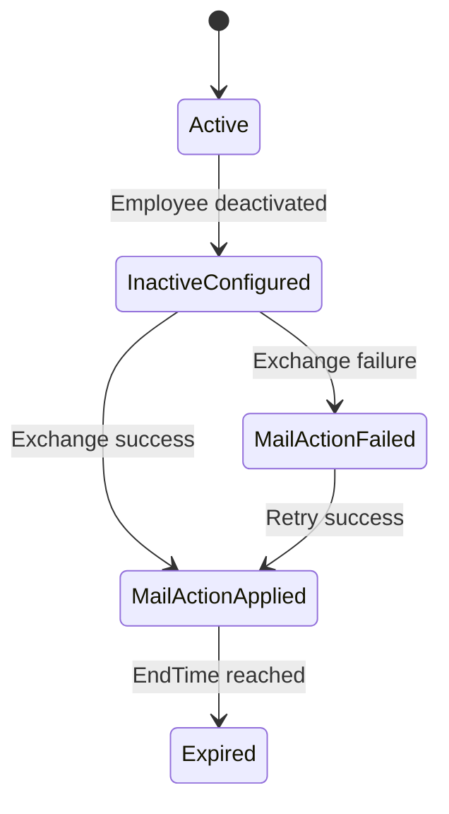

# Daily Knowledge Sharing — 17/08/2026

## Today’s Topics

1. Distributed Systems — timeout budget, partial failure và graceful degradation
2. Design Patterns — Strategy Pattern trong backend thực tế
3. Authentication vs Authorization — thiết kế boundary bảo mật trong ASP.NET Core
4. Data Consistency — eventual consistency, Saga và Outbox Pattern
5. Write-Through Cache — khi nào nên ghi cache đồng thời với database
6. Azure SQL — connection resiliency, scaling và production design
7. Azure Container Registry — supply-chain security cho container image
8. Metrics & Alerting — từ telemetry đến actionable alert
9. Function Calling / Tool Calling — tách quyết định của LLM khỏi hành động deterministic
10. Requirement Analysis — biến yêu cầu mơ hồ thành technical contract có thể kiểm thử

---

# 1. Distributed Systems — timeout budget, partial failure và graceful degradation

### 1. What is it?

Trong một monolith, nhiều lời gọi hàm diễn ra trong cùng process. Khi chuyển sang distributed system, một request có thể đi qua nhiều service, database, queue và external API. Mỗi network hop đều có thể chậm, timeout hoặc trả kết quả một phần.

Timeout budget là cách phân bổ tổng thời gian cho phép của một request cho từng dependency thay vì để mỗi dependency tự chờ rất lâu. Partial failure là trạng thái một phần hệ thống hỏng nhưng phần còn lại vẫn hoạt động. Graceful degradation là chiến lược chủ động giữ lại chức năng cốt lõi khi dependency phụ bị lỗi.

### 2. Why does it exist?

Naive approach thường là: service A gọi B với timeout 30 giây, B gọi C 30 giây, C gọi database 30 giây. Nếu dependency chậm, request có thể treo rất lâu, thread bị giữ, connection pool cạn và lỗi lan sang các request khỏe mạnh.

Trong distributed system, “mọi thứ hoặc hoạt động hoặc chết hẳn” gần như không đúng. Thực tế thường là: một region chậm, một endpoint timeout, một cache unavailable, một downstream chỉ lỗi 10% request. Ta cần thiết kế cho trạng thái xám này.

### 3. How does it work?

Giả sử API có SLA nội bộ 2 giây. Ta phân bổ budget:



Nếu Pricing API quá 600 ms, Order API có thể dùng giá cache gần nhất hoặc trả response thiếu phần “promotion” nhưng vẫn giữ chức năng chính. Đây là graceful degradation.

Điểm quan trọng: timeout phải nhỏ hơn remaining budget và phải được propagate bằng `CancellationToken`.

### 4. Practical example

```csharp
builder.Services.AddHttpClient<IInventoryClient, InventoryClient>(client =>
{
    client.Timeout = TimeSpan.FromMilliseconds(500);
});

public async Task<OrderSummary> GetOrderSummaryAsync(
    Guid orderId,
    CancellationToken cancellationToken)
{
    var order = await _db.Orders
        .AsNoTracking()
        .SingleAsync(x => x.Id == orderId, cancellationToken);

    InventoryResult? inventory = null;

    try
    {
        inventory = await _inventoryClient
            .GetAsync(order.ProductId, cancellationToken);
    }
    catch (OperationCanceledException) when (!cancellationToken.IsCancellationRequested)
    {
        _logger.LogWarning(
            "Inventory timeout for product {ProductId}",
            order.ProductId);
    }

    return new OrderSummary(
        order.Id,
        order.ProductId,
        inventory?.Available,
        inventory is null ? "unknown" : "confirmed");
}
```

Ở đây inventory là thông tin phụ. Timeout dependency không nhất thiết biến thành 500 cho toàn request.

### 5. Real production scenario

Một hệ thống timesheet có màn hình dashboard gồm dữ liệu timesheet, leave balance, approval count và notification count. Nếu notification service lỗi, không hợp lý khi toàn bộ dashboard trả 500. API có thể trả các phần quan trọng trước và đánh dấu notification là unavailable.

Trong payment flow thì ngược lại: dependency xác nhận thanh toán là critical path, không được degrade bằng dữ liệu giả. Production design phải phân loại dependency nào critical, dependency nào optional.

### 6. Common mistakes

- Đặt cùng một timeout cho mọi dependency.
- Retry sau timeout nhưng không giảm remaining budget.
- Retry các request non-idempotent.
- Nuốt mọi exception rồi trả dữ liệu “default”, khiến lỗi bị che giấu.
- Không propagate `CancellationToken` xuống EF Core, HTTP client và queue client.
- Dùng timeout quá lớn làm connection pool và thread pool bị giữ lâu.
- Không phân biệt hard dependency và soft dependency.

### 7. Trade-offs

**Advantages**

- Giảm cascading failure.
- Giữ trải nghiệm người dùng ở mức chấp nhận được khi dependency phụ lỗi.
- Làm latency predictable hơn.
- Giúp capacity planning rõ hơn.

**Costs / Risks**

- Flow phức tạp hơn vì phải mô hình hóa fallback.
- Dữ liệu có thể thiếu hoặc stale.
- Cần observability tốt để không biến graceful degradation thành “silent failure”.

### 8. Junior → Middle → Senior understanding

**Junior**

Hiểu rằng network call không giống method call; nó có timeout, retry và failure độc lập.

**Middle**

Biết cấu hình timeout hợp lý, propagate cancellation, phân biệt dependency bắt buộc và không bắt buộc, và debug latency theo từng hop.

**Senior / Technical Lead**

Phải thiết kế end-to-end latency budget, retry policy, fallback semantics, dependency classification, capacity protection và SLO cho partial failure.

### 9. Key takeaway

- Distributed system phải được thiết kế cho partial failure, không chỉ total failure.
- Timeout cần dựa trên end-to-end budget.
- Fallback chỉ đúng khi business chấp nhận dữ liệu thiếu hoặc stale.
- Graceful degradation phải observable.

---

# 2. Design Patterns — Strategy Pattern trong backend thực tế

### 1. What is it?

Strategy Pattern đóng gói nhiều cách xử lý cùng một business capability vào các implementation riêng và chọn implementation tại runtime.

Thay vì một method có `if/else` dài cho từng loại hành động, ta định nghĩa một contract ổn định và nhiều strategy.

### 2. Why does it exist?

Khi business rule tăng dần, code kiểu sau nhanh chóng khó bảo trì:

```csharp
if (action == "Delegate") { ... }
else if (action == "Forward") { ... }
else if (action == "Delete") { ... }
```

Nếu mỗi branch có validation, API integration, rollback logic và logging riêng, method trung tâm trở thành “god method”. Strategy Pattern giúp tách từng behavior thành đơn vị độc lập.

### 3. How does it work?



Command handler quyết định “cần thực hiện email action”, còn từng strategy quyết định “thực hiện action đó như thế nào”.

### 4. Practical example

```csharp
public enum MailAction
{
    Delegate,
    Forward,
    Delete
}

public interface IMailActionStrategy
{
    MailAction Action { get; }
    Task ExecuteAsync(MailActionContext context, CancellationToken ct);
}

public sealed class ForwardMailStrategy : IMailActionStrategy
{
    private readonly IExchangeOnlineService _exchange;

    public ForwardMailStrategy(IExchangeOnlineService exchange)
    {
        _exchange = exchange;
    }

    public MailAction Action => MailAction.Forward;

    public Task ExecuteAsync(MailActionContext context, CancellationToken ct)
        => _exchange.SetMailboxForwardingAsync(
            context.SourceEmail,
            context.TargetEmail!,
            ct);
}

public sealed class MailActionStrategyResolver
{
    private readonly IReadOnlyDictionary<MailAction, IMailActionStrategy> _strategies;

    public MailActionStrategyResolver(IEnumerable<IMailActionStrategy> strategies)
    {
        _strategies = strategies.ToDictionary(x => x.Action);
    }

    public IMailActionStrategy Resolve(MailAction action) =>
        _strategies.TryGetValue(action, out var strategy)
            ? strategy
            : throw new NotSupportedException($"Unsupported action: {action}");
}
```

### 5. Real production scenario

Trong employee offboarding, `Delegate`, `Forward`, `Delete` có lifecycle và validation khác nhau. Forward cần target email và end time; Delete không cần target. Nếu tất cả logic nằm trong một handler, thay đổi một action dễ làm hỏng action khác.

Strategy giúp mỗi behavior có unit test riêng và deployment change nhỏ hơn.

### 6. Common mistakes

- Tạo Strategy Pattern cho logic chỉ có hai branch đơn giản và không có dấu hiệu mở rộng.
- Strategy vẫn gọi ngược vào god service chứa toàn bộ business logic, nên chỉ tách file chứ không tách trách nhiệm.
- Resolver dùng string magic thay vì enum hoặc strongly typed key.
- Đưa transaction ownership mơ hồ vào từng strategy.
- Strategy phụ thuộc quá nhiều service, làm abstraction mất giá trị.

### 7. Trade-offs

**Advantages**

- Dễ mở rộng behavior.
- Test độc lập.
- Giảm conditional complexity.
- Tách business rules theo capability.

**Costs / Risks**

- Nhiều class hơn.
- Debug flow cần đi qua resolver.
- Có thể overengineering nếu rule ít và ổn định.

### 8. Junior → Middle → Senior understanding

**Junior**

Hiểu Strategy là “nhiều cách làm cùng một việc qua một interface”.

**Middle**

Biết dùng DI để đăng ký nhiều strategy, resolve theo key và test từng implementation.

**Senior / Technical Lead**

Biết khi nào conditional đơn giản tốt hơn pattern, xác định transaction boundary và tránh abstraction ceremony.

### 9. Key takeaway

- Strategy hữu ích khi behavior thay đổi theo loại và tiếp tục mở rộng.
- Đừng dùng pattern chỉ để tăng số lượng class.
- Contract phải ổn định, implementation mới là phần biến đổi.

---

# 3. Authentication vs Authorization — thiết kế boundary bảo mật trong ASP.NET Core

### 1. What is it?

Authentication trả lời: **“Bạn là ai?”**

Authorization trả lời: **“Bạn được phép làm gì?”**

Một user có JWT hợp lệ mới chỉ được xác thực danh tính; điều đó không có nghĩa user được phép đọc mọi employee, approve mọi leave request hay gọi admin endpoint.

### 2. Why does it exist?

Một lỗi bảo mật phổ biến là controller chỉ có `[Authorize]` rồi coi mọi authenticated user là hợp lệ cho toàn bộ action. Đây là authentication đúng nhưng authorization thiếu.

Business systems thường có permission dựa trên role, claim, tenant, resource ownership, department hoặc workflow state. Role-only authorization thường không đủ.

### 3. How does it work?



401 thường nghĩa là chưa authenticate hợp lệ. 403 thường nghĩa là đã authenticate nhưng không có quyền.

### 4. Practical example

```csharp
builder.Services.AddAuthorization(options =>
{
    options.AddPolicy("CanApproveLeave", policy =>
    {
        policy.RequireAuthenticatedUser();
        policy.RequireClaim("permission", "leave.approve");
    });
});

[Authorize(Policy = "CanApproveLeave")]
[HttpPost("leave/{id:guid}/approve")]
public async Task<IActionResult> Approve(
    Guid id,
    CancellationToken cancellationToken)
{
    await _leaveService.ApproveAsync(id, User, cancellationToken);
    return NoContent();
}
```

Nhưng nếu chỉ manager của employee đó mới được approve, cần resource-based authorization chứ không chỉ claim toàn cục.

```csharp
var result = await _authorizationService.AuthorizeAsync(
    User,
    leaveRequest,
    "CanApproveLeaveResource");

if (!result.Succeeded)
    return Forbid();
```

### 5. Real production scenario

Trong timesheet system, một project manager có thể approve timesheet cho project A nhưng không được approve project B. Claim `TimesheetApprover=true` là quá rộng. Resource-based authorization cần kiểm tra mapping giữa user, project và timesheet.

### 6. Common mistakes

- Dùng authentication thay cho authorization.
- Chỉ kiểm tra quyền ở frontend.
- Tin role từ request body hoặc query string.
- Không validate `issuer`, `audience`, expiry của token.
- Dùng role cực rộng như `Admin` cho mọi use case.
- Authorization check ở nhiều nơi không nhất quán.
- Trả 404/403 không có chiến lược rõ ràng, vô tình leak resource existence.

### 7. Trade-offs

**Advantages**

- Principle of least privilege.
- Policy rõ ràng, test được.
- Resource-based authorization phù hợp business phức tạp.

**Costs / Risks**

- Policy engine phức tạp hơn role check.
- Cần đồng bộ permission lifecycle và token claims.
- Có thể tạo nhiều database lookup nếu authorization không được thiết kế tốt.

### 8. Junior → Middle → Senior understanding

**Junior**

Phân biệt 401 và 403, authentication và authorization.

**Middle**

Biết cấu hình JWT bearer, policy, claim và resource authorization.

**Senior / Technical Lead**

Thiết kế permission model, tenant isolation, token lifetime, claim freshness và audit trail.

### 9. Key takeaway

- Authenticated không đồng nghĩa authorized.
- Role phù hợp quyền thô; policy/resource phù hợp business permission tinh hơn.
- Authorization phải enforced ở backend boundary.

---

# 4. Data Consistency — eventual consistency, Saga và Outbox Pattern

### 1. What is it?

Khi một business operation chạm nhiều database/service, ta không còn dễ dùng một ACID transaction duy nhất. Eventual consistency chấp nhận các service đạt trạng thái đồng bộ sau một khoảng thời gian thay vì ngay lập tức.

Saga quản lý chuỗi local transaction và compensation. Outbox Pattern đảm bảo “database change” và “event cần publish” được ghi atomic trong cùng local transaction.

### 2. Why does it exist?

Ví dụ tạo order:

1. Order DB tạo order.
2. Payment service charge tiền.
3. Inventory service reserve stock.

Nếu bước 1 commit nhưng event publish thất bại, downstream không biết order tồn tại. Nếu payment thành công nhưng inventory thất bại, cần compensation.

Distributed transaction kiểu 2PC thường đắt, khó vận hành và không được mọi hệ thống/cloud service hỗ trợ tốt.

### 3. How does it work?



Nếu publish lỗi, outbox worker retry. Business state và event intent không bị lệch vì cùng transaction.

### 4. Practical example

```csharp
await using var transaction = await _db.Database.BeginTransactionAsync(ct);

var order = new Order(customerId, totalAmount);
_db.Orders.Add(order);

_db.OutboxMessages.Add(new OutboxMessage
{
    Id = Guid.NewGuid(),
    Type = "OrderCreated",
    Payload = JsonSerializer.Serialize(new
    {
        order.Id,
        order.CustomerId,
        order.TotalAmount
    }),
    OccurredAtUtc = DateTime.UtcNow
});

await _db.SaveChangesAsync(ct);
await transaction.CommitAsync(ct);
```

Background worker đọc outbox, publish và đánh dấu processed. Consumer phải idempotent vì publish có thể xảy ra nhiều lần.

### 5. Real production scenario

Employee offboarding có thể gồm disable account trong AD, update database, convert mailbox, set forwarding, revoke sessions. Không thể bao tất cả trong một SQL transaction.

Một saga có thể lưu state từng bước. Nếu mailbox forwarding thất bại, hệ thống không rollback việc disable account nếu business không cho phép; thay vào đó lưu trạng thái `MailConfigurationFailed` và retry riêng.

### 6. Common mistakes

- Giả định message bus exactly-once.
- Không thiết kế idempotent consumer.
- Xóa outbox record ngay khi gửi request thay vì sau khi broker xác nhận.
- Compensation được hiểu là “rollback tuyệt đối”; thực tế có action không thể undo hoàn toàn.
- Không lưu correlation ID / causation ID.
- Không có dead-letter hoặc manual recovery path.

### 7. Trade-offs

**Advantages**

- Reliability cao hơn khi publish event.
- Giảm coupling giữa service.
- Tránh distributed transaction nặng.

**Costs / Risks**

- Consistency chậm hơn.
- Debug khó hơn synchronous flow.
- Cần retry, deduplication, outbox cleanup và observability.

### 8. Junior → Middle → Senior understanding

**Junior**

Hiểu local transaction chỉ bảo vệ resource cục bộ.

**Middle**

Biết implement outbox worker, idempotent consumer và retry.

**Senior / Technical Lead**

Phải thiết kế consistency boundary, compensation semantics, operational recovery và business tolerance với stale state.

### 9. Key takeaway

- Outbox giải quyết atomicity giữa DB change và event intent.
- Saga giải quyết workflow nhiều local transaction.
- Eventual consistency là business decision, không chỉ technical compromise.

---

# 5. Write-Through Cache — khi nào nên ghi cache đồng thời với database

### 1. What is it?

Write-through cache là chiến lược trong đó write đi qua một lớp caching abstraction; khi dữ liệu được cập nhật, cache cũng được cập nhật đồng bộ hoặc gần đồng bộ thay vì chờ request đọc sau đó cache lại.

Khác với cache-aside, application không chỉ invalidate rồi chờ cache miss.

### 2. Why does it exist?

Cache-aside đơn giản nhưng sau update thường có khoảng trống: cache bị xóa, request kế tiếp phải hit database. Với workload read-heavy và dữ liệu hot, cache miss burst có thể gây spike database.

Write-through giúp dữ liệu hot có sẵn ngay sau write.

### 3. How does it work?



Một biến thể khác đặt cache layer trước repository, nhưng production design phải rất rõ source of truth vẫn là database hay cache.

### 4. Practical example

```csharp
public async Task UpdateProductAsync(
    Product product,
    CancellationToken ct)
{
    _db.Products.Update(product);
    await _db.SaveChangesAsync(ct);

    var cacheValue = JsonSerializer.Serialize(new ProductDto(
        product.Id,
        product.Name,
        product.Price));

    await _cache.SetStringAsync(
        $"product:{product.Id}",
        cacheValue,
        new DistributedCacheEntryOptions
        {
            AbsoluteExpirationRelativeToNow = TimeSpan.FromMinutes(10)
        },
        ct);
}
```

Nếu Redis fail sau DB commit, phải quyết định: request fail hay vẫn success và chấp nhận cache stale? Đây là business/consistency decision.

### 5. Real production scenario

Catalog service có product metadata được đọc hàng nghìn lần nhưng chỉ update vài lần mỗi giờ. Sau khi admin đổi giá hoặc title, write-through giúp cache có dữ liệu mới ngay lập tức và tránh miss burst.

Ngược lại, balance tài khoản ngân hàng không nên dựa trên cache write-through thiếu transaction guarantee giữa DB và cache.

### 6. Common mistakes

- Coi DB và Redis như một atomic transaction.
- Update cache trước DB commit.
- Không có TTL vì nghĩ write-through luôn giữ cache đúng.
- Cache object quá lớn.
- Ghi cache cho dữ liệu ít được đọc.
- Không có fallback khi cache unavailable.

### 7. Trade-offs

**Advantages**

- Giảm cache miss sau write.
- Latency read ổn định hơn cho hot data.
- Phù hợp workload read-heavy.

**Costs / Risks**

- Write latency tăng.
- Dual-write consistency problem.
- Có thể tạo unnecessary cache writes.

### 8. Junior → Middle → Senior understanding

**Junior**

Hiểu cache không phải source of truth mặc định.

**Middle**

Biết implement TTL, serialization, fallback và invalidate/update đúng thứ tự.

**Senior / Technical Lead**

Đánh giá consistency model, cache outage behavior, stampede risk và cost/benefit theo access pattern.

### 9. Key takeaway

- Write-through đổi chi phí từ read sang write.
- DB và cache không tự nhiên atomic.
- Chỉ nên cache dữ liệu có access pattern chứng minh được giá trị.

---

# 6. Azure SQL — connection resiliency, scaling và production design

### 1. What is it?

Azure SQL Database là managed relational database dựa trên SQL Server engine, loại bỏ phần lớn trách nhiệm quản lý OS, patching và cơ sở hạ tầng database server.

Production engineering không chỉ là “đưa connection string vào app”; cần hiểu transient failure, connection pool, service tier, geo-redundancy, indexing và monitoring.

### 2. Why does it exist?

Tự quản SQL Server VM đòi hỏi patch, backup, HA, storage, failover và capacity planning. Managed database chuyển nhiều trách nhiệm đó sang platform nhưng application vẫn phải chịu trách nhiệm resilience và query quality.

### 3. How does it work?



Ứng dụng lấy physical/logical connection từ pool. Failover hoặc maintenance có thể tạo transient error; client cần retry đúng loại lỗi thay vì retry mọi exception.

### 4. Practical example

```csharp
builder.Services.AddDbContext<AppDbContext>(options =>
{
    options.UseSqlServer(
        builder.Configuration.GetConnectionString("Sql"),
        sql => sql.EnableRetryOnFailure(
            maxRetryCount: 5,
            maxRetryDelay: TimeSpan.FromSeconds(10),
            errorNumbersToAdd: null));
});
```

Retry ở EF Core phù hợp transient connectivity. Nhưng transaction thủ công nhiều bước cần execution strategy phù hợp; không nên retry tùy tiện một phần transaction.

### 5. Real production scenario

Một SaaS timesheet tăng traffic mạnh vào cuối tháng. API latency tăng do query aggregation và lock contention. Scale compute có thể giúp tạm thời, nhưng nếu query scan hàng triệu rows vì thiếu index thì scale chỉ che vấn đề.

Senior engineer sẽ xem Query Store, execution plan, DTU/vCore metrics, waits, connection count và top queries trước khi tăng tier.

### 6. Common mistakes

- Scale tier trước khi đo query bottleneck.
- Tăng `Max Pool Size` vô hạn khi gặp timeout.
- Retry deadlock hoặc transient error mà không đảm bảo idempotency.
- Không dùng parameterized query.
- Không theo dõi Query Store.
- Đặt app và database khác region gây network latency.
- Mở public access rộng thay vì private networking khi security yêu cầu.

### 7. Trade-offs

**Advantages**

- Managed backup, HA và patching.
- Scale nhanh hơn self-managed VM.
- Tích hợp Azure security và monitoring.

**Costs / Risks**

- Chi phí tăng mạnh nếu scale compute/storage thiếu kiểm soát.
- Một số server-level feature khác self-managed SQL Server.
- Vendor/platform dependency.

### 8. Junior → Middle → Senior understanding

**Junior**

Biết Azure SQL vẫn là relational DB và query/index fundamentals vẫn quan trọng.

**Middle**

Biết connection pooling, EF retry, migration, Query Store và basic monitoring.

**Senior / Technical Lead**

Thiết kế HA/DR, networking, capacity, failover behavior, cost model và performance troubleshooting.

### 9. Key takeaway

- Managed database không loại bỏ responsibility về query và schema design.
- Retry chỉ dành cho transient failure và phải tôn trọng transaction semantics.
- Measure trước khi scale.

---

# 7. Azure Container Registry — supply-chain security cho container image

### 1. What is it?

Azure Container Registry (ACR) là private registry dùng để lưu trữ container images và OCI artifacts. Nó nằm giữa CI pipeline và runtime như Azure Container Apps, AKS hoặc App Service for Containers.

### 2. Why does it exist?

Nếu image chỉ nằm local hoặc public registry không kiểm soát, tổ chức khó quản lý version, provenance, access, vulnerability và deployment reproducibility.

Production cần biết chính xác image digest nào đã được deploy, ai push và runtime lấy image bằng identity nào.

### 3. How does it work?



Runtime nên pull image bằng Managed Identity/RBAC thay vì hard-code admin username/password.

### 4. Practical example

Docker image nên pin version rõ ràng:

```dockerfile
FROM mcr.microsoft.com/dotnet/aspnet:8.0 AS base
WORKDIR /app

FROM mcr.microsoft.com/dotnet/sdk:8.0 AS build
WORKDIR /src
COPY . .
RUN dotnet publish -c Release -o /out

FROM base AS final
COPY --from=build /out .
ENTRYPOINT ["dotnet", "MyApi.dll"]
```

CI push:

```bash
docker build -t myregistry.azurecr.io/timesheet-api:${GITHUB_SHA} .
docker push myregistry.azurecr.io/timesheet-api:${GITHUB_SHA}
```

Dùng immutable commit SHA tốt hơn tag `latest` cho production deployment.

### 5. Real production scenario

Một deployment bị regression. Nếu production dùng `latest`, team khó biết image thực tế là build nào. Nếu tag theo commit SHA và lưu deployment metadata, rollback chỉ cần trỏ runtime về digest/tag trước.

### 6. Common mistakes

- Dùng `latest` cho production.
- Enable admin account rồi lưu password lâu dài.
- Không scan dependency/image vulnerability.
- Build image chứa secret trong layer.
- Không cleanup old images, làm storage cost tăng.
- Không pin base image policy.

### 7. Trade-offs

**Advantages**

- Private artifact control.
- Tích hợp Azure RBAC/Managed Identity.
- Audit và deployment reproducibility tốt hơn.

**Costs / Risks**

- Thêm storage/egress cost.
- Cần retention policy và image lifecycle management.
- Registry outage có thể ảnh hưởng scale-out/deployment nếu runtime cần pull image mới.

### 8. Junior → Middle → Senior understanding

**Junior**

Hiểu registry là nơi lưu image, không phải nơi chạy container.

**Middle**

Biết build/tag/push, CI authentication và deploy image version cụ thể.

**Senior / Technical Lead**

Thiết kế supply-chain security, retention, provenance, RBAC, network isolation và rollback strategy.

### 9. Key takeaway

- Image tag production phải traceable và immutable về mặt quy trình.
- Không dùng long-lived registry password khi có identity-based access.
- Registry là một phần của software supply chain, không chỉ là kho file.

---

# 8. Metrics & Alerting — từ telemetry đến actionable alert

### 1. What is it?

Metric là số đo theo thời gian: request rate, latency, error rate, CPU, memory, queue length, dependency duration, business throughput.

Alert là rule biến metric hoặc log condition thành tín hiệu hành động. Một alert tốt phải dẫn tới quyết định hoặc hành động cụ thể, không chỉ báo rằng “có gì đó thay đổi”.

### 2. Why does it exist?

Log cho biết chi tiết từng event nhưng không lý tưởng để thấy xu hướng toàn hệ thống. Metric giúp trả lời: “error rate có tăng không?”, “p95 latency hiện tại là bao nhiêu?”, “queue backlog đang phình ra hay giảm?”.

Không có alert, team chỉ phát hiện lỗi khi user báo. Nhưng alert quá nhạy tạo alert fatigue và cuối cùng bị bỏ qua.

### 3. How does it work?



Một alert nên dựa trên symptom có ý nghĩa thay vì chỉ resource utilization. Ví dụ “5xx > 5% trong 10 phút” thường hữu ích hơn “CPU > 80% trong 1 phút”.

### 4. Practical example

ASP.NET Core có thể expose custom metric bằng OpenTelemetry `Meter`:

```csharp
private static readonly Meter Meter = new("Timesheet.Api");
private static readonly Counter<long> ApprovalCounter =
    Meter.CreateCounter<long>("timesheet.approval.completed");

public async Task ApproveAsync(Guid id, CancellationToken ct)
{
    await _service.ApproveAsync(id, ct);
    ApprovalCounter.Add(1);
}
```

Production alert có thể dùng rate của failed approvals hoặc queue backlog thay vì chỉ CPU.

### 5. Real production scenario

Background job gửi email vẫn chạy process bình thường, CPU thấp nhưng queue backlog tăng từ 100 lên 50.000 do Exchange Online throttling. Infrastructure metrics nhìn “xanh”, nhưng business throughput đã hỏng.

Metric `email_queue_oldest_message_age_seconds` hoặc `queue_depth` sẽ phát hiện đúng failure mode hơn.

### 6. Common mistakes

- Alert mọi exception log.
- Alert threshold quá ngắn, gây noise.
- Chỉ monitor CPU/RAM mà bỏ business metrics.
- Không có runbook hoặc ownership.
- Không phân biệt warning và paging alert.
- Dashboard đẹp nhưng không phục vụ incident response.

### 7. Trade-offs

**Advantages**

- Phát hiện incident sớm.
- Cho thấy xu hướng trước khi hệ thống sập.
- Hỗ trợ SLO và capacity planning.

**Costs / Risks**

- Telemetry có storage/ingestion cost.
- Cardinality cao làm metric system đắt hoặc chậm.
- Alert fatigue nếu rule kém chất lượng.

### 8. Junior → Middle → Senior understanding

**Junior**

Biết khác biệt logs, metrics và traces.

**Middle**

Biết tạo metric, dashboard và threshold có cửa sổ thời gian hợp lý.

**Senior / Technical Lead**

Thiết kế golden signals, SLO-based alerts, business metrics, escalation và telemetry cost control.

### 9. Key takeaway

- Metric tốt phải phản ánh health của user journey hoặc system behavior.
- Alert tốt phải actionable.
- Monitor business flow, không chỉ infrastructure.

---

# 9. Function Calling / Tool Calling — tách quyết định của LLM khỏi hành động deterministic

### 1. What is it?

Function Calling/Tool Calling cho phép LLM đề xuất một structured action, ví dụ `get_employee`, `create_ticket`, `search_documents`, thay vì tự giả lập kết quả bằng text.

LLM quyết định **tool nào cần gọi và arguments nào phù hợp**; application code mới là nơi validate, authorize và thực hiện action thật.

### 2. Why does it exist?

LLM giỏi xử lý ngôn ngữ nhưng không nên được tin tưởng để trực tiếp thay đổi hệ thống chỉ dựa trên free-form text. Ta cần boundary deterministic giữa reasoning và side effect.

Không có tool boundary, agent dễ hallucinate rằng nó đã tạo ticket, gửi email hoặc cập nhật database dù chưa có hành động thật nào xảy ra.

### 3. How does it work?



Điểm quan trọng là application không được thực thi tool call mù quáng.

### 4. Practical example

```csharp
public sealed record CreateTicketArgs(
    string Title,
    string Description,
    string Severity);

public async Task<TicketResult> ExecuteCreateTicketAsync(
    CreateTicketArgs args,
    ClaimsPrincipal user,
    CancellationToken ct)
{
    if (!user.HasClaim("permission", "ticket.create"))
        throw new UnauthorizedAccessException();

    if (args.Title.Length > 200)
        throw new ValidationException("Title is too long.");

    var severity = args.Severity switch
    {
        "low" or "medium" or "high" => args.Severity,
        _ => throw new ValidationException("Invalid severity.")
    };

    return await _ticketApi.CreateAsync(
        args.Title,
        args.Description,
        severity,
        ct);
}
```

Schema từ model chỉ là input proposal; server vẫn validate như bất kỳ API input nào khác.

### 5. Real production scenario

Một AI assistant nội bộ cho phép tra employee, đọc leave balance và tạo support ticket. Tool `get_employee` là read-only, nhưng `disable_account` có side effect nghiêm trọng. Với tool nguy hiểm, app có thể yêu cầu human confirmation trước execution.

### 6. Common mistakes

- Tin tool arguments do LLM sinh ra mà không validate.
- Không enforce authorization ở tool handler.
- Cho model quyền gọi tool destructive không cần approval.
- Trả toàn bộ secret hoặc internal exception về model.
- Retry tool non-idempotent tự động.
- Không log tool invocation/correlation ID.

### 7. Trade-offs

**Advantages**

- Tách natural-language reasoning khỏi deterministic execution.
- Tích hợp hệ thống thật có cấu trúc.
- Audit được tool calls.

**Costs / Risks**

- Tool schema và orchestration phức tạp.
- Model có thể chọn sai tool hoặc argument.
- Side-effect tools cần permission, approval và idempotency.

### 8. Junior → Middle → Senior understanding

**Junior**

Hiểu model không trực tiếp “chạy function”; application mới là bên thực thi.

**Middle**

Biết định nghĩa schema, validate arguments, execute tool và feed result lại model.

**Senior / Technical Lead**

Thiết kế permission boundary, human approval, audit, idempotency, retry, timeout và failure recovery cho agent workflow.

### 9. Key takeaway

- LLM đề xuất hành động; deterministic code kiểm soát hành động.
- Tool input luôn phải validate và authorize.
- Side effect càng lớn, guardrail càng phải mạnh.

---

# 10. Requirement Analysis — biến yêu cầu mơ hồ thành technical contract có thể kiểm thử

### 1. What is it?

Requirement Analysis là quá trình chuyển nhu cầu business từ mô tả tự nhiên thành behavior rõ ràng, boundary, validation, edge case và acceptance criteria có thể implement/test.

Senior engineer không bắt đầu bằng code ngay khi nghe “thêm chức năng forward email”. Trước hết phải làm rõ trigger, dữ liệu bắt buộc, lifecycle, quyền và failure behavior.

### 2. Why does it exist?

Yêu cầu tự nhiên thường thiếu chi tiết:

> “Khi nhân viên nghỉ việc thì forward email sang manager.”

Các câu hỏi chưa được trả lời:

- Khi nào bắt đầu forward?
- Khi nào dừng?
- Có giữ mailbox không?
- Nếu manager thay đổi thì sao?
- Nếu Exchange API lỗi thì employee status có rollback không?
- Ai được phép sửa target email?

Nếu không phân tích trước, ambiguity sẽ biến thành bug và rework.

### 3. How does it work?

Một flow tốt:

```text
Business intent
    ↓
Actors + permissions
    ↓
Happy path
    ↓
Validation rules
    ↓
Edge cases / failure modes
    ↓
State transitions
    ↓
API + data contract
    ↓
Acceptance criteria
    ↓
Implementation + tests
```

Senior engineer nên mô hình hóa state transition khi feature có lifecycle.



### 4. Practical example

Từ requirement “Forward email khi employee inactive”, technical contract có thể trở thành:

```text
Given employee status changes Active -> Inactive
And EmailAction = Forward
Then TargetEmail is required
And EndTime must be greater than current UTC time
And mailbox is converted to Shared
And forwarding is configured with DeliverToMailboxAndForward = false
If Exchange call fails
Then employee deactivation remains committed
And mail configuration status becomes Failed
And retry is scheduled
```

API request:

```csharp
public sealed record OffboardingRequest(
    string EmployeeEmail,
    string EmailAction,
    string? TargetEmail,
    DateTimeOffset? EndTime,
    bool EnableAutoReply,
    string? AutoReplyMessage);
```

Validation phải phụ thuộc `EmailAction`, không áp một rule chung cho mọi action.

### 5. Real production scenario

Trong employee offboarding, nếu requirement không xác định rõ việc re-activate user thì forwarding/delegation cũ có bị xóa hay không, production có thể giữ quyền truy cập ngoài ý muốn. Đây vừa là business bug vừa là security bug.

Requirement analysis tốt phải bao phủ lifecycle đầy đủ: create, update, expire, retry, reactivate, audit.

### 6. Common mistakes

- Chỉ ghi happy path.
- Nhảy thẳng vào database schema trước khi hiểu lifecycle.
- Không hỏi ownership và permission.
- Không phân biệt business rule với implementation detail.
- Acceptance criteria không test được, ví dụ “system should work correctly”.
- Không định nghĩa failure behavior.
- Không xem xét backward compatibility khi API đã có consumer.

### 7. Trade-offs

**Advantages**

- Giảm rework.
- API/data model ổn định hơn.
- Test coverage có mục tiêu rõ.
- Architecture decision dựa trên behavior thực.

**Costs / Risks**

- Tốn thời gian upfront.
- Có thể analysis paralysis nếu cố mô hình hóa mọi edge case trước khi có đủ thông tin.
- Requirement vẫn có thể thay đổi sau khi business học thêm từ production.

### 8. Junior → Middle → Senior understanding

**Junior**

Biết đọc acceptance criteria và hỏi khi behavior không rõ.

**Middle**

Biết chuyển requirement thành validation, API contract, state transition và test cases.

**Senior / Technical Lead**

Phải phát hiện ambiguity, non-functional requirement, security implication, operational failure mode và architectural impact trước implementation.

### 9. Key takeaway

- Requirement tốt phải mô tả behavior có thể kiểm thử.
- Failure path và lifecycle quan trọng ngang happy path.
- Technical design tốt bắt đầu từ việc hiểu đúng business semantics, không bắt đầu từ class hay table.