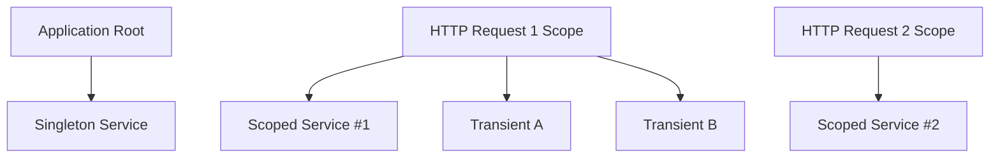
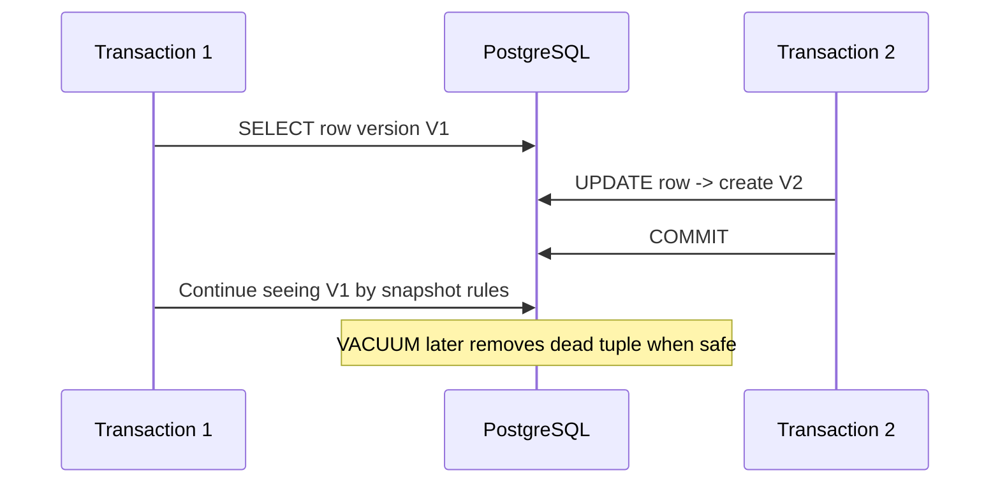
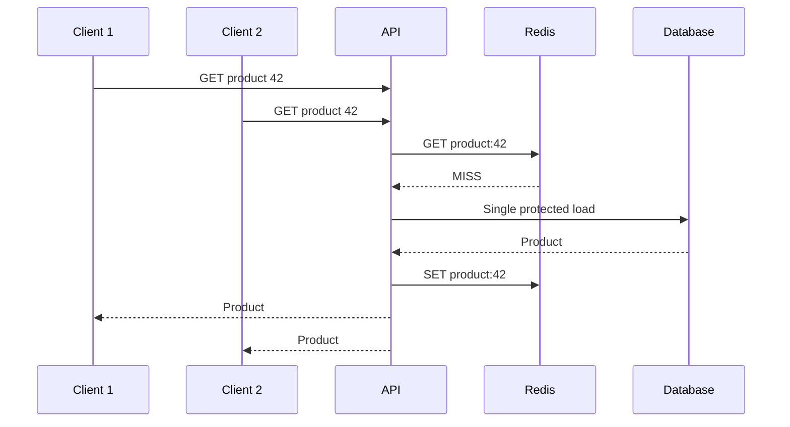
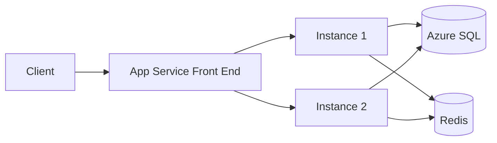
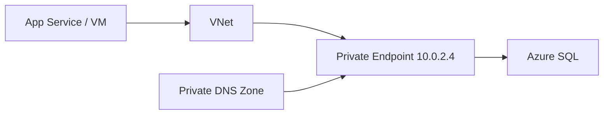
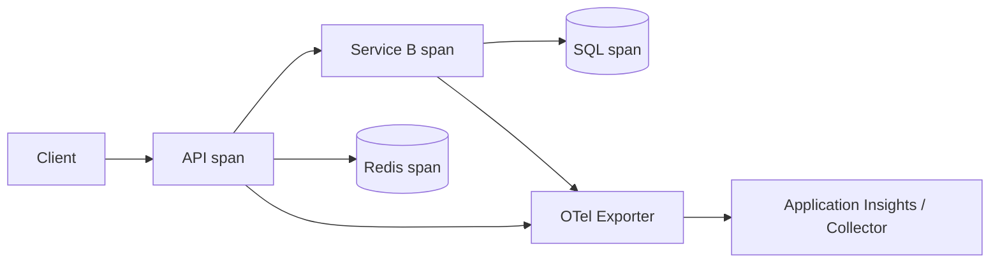
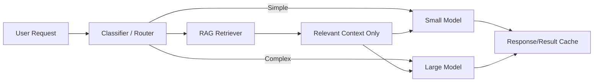
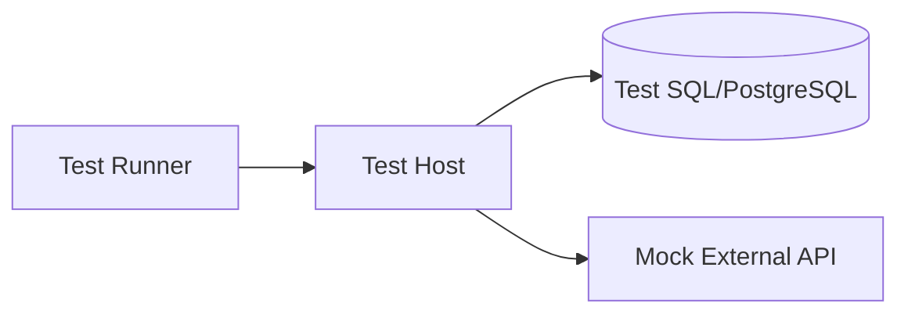
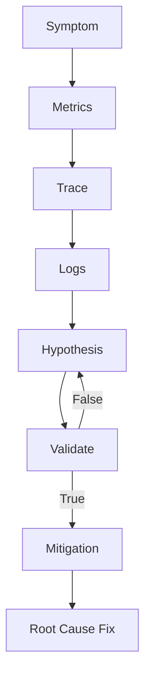

# Daily Knowledge Sharing — 17/08/2026

## Today’s Topics

1. Dependency Injection Lifetimes — Singleton, Scoped, Transient và captive dependency
2. RESTful API Design — resource modeling, status codes và backward compatibility
3. PostgreSQL MVCC — visibility, vacuum và concurrency thực tế
4. Distributed Cache — cache stampede, cache penetration và hot-key protection
5. Azure App Service — scaling, deployment slots và production readiness
6. Azure Private Endpoint — đưa PaaS service vào private network boundary
7. OpenTelemetry Tracing — correlation xuyên nhiều service
8. AI Cost Optimization — token budget, model routing và caching
9. Integration Testing — test thật với database và external boundary
10. Production Troubleshooting — phương pháp điều tra sự cố theo evidence thay vì phỏng đoán

---

# 1. Dependency Injection Lifetimes — Singleton, Scoped, Transient và captive dependency

### 1. What is it?

Dependency Injection lifetime xác định một service instance sống bao lâu trong ứng dụng. Trong ASP.NET Core, ba lifetime phổ biến là `Singleton`, `Scoped` và `Transient`.

`Singleton` tạo một instance cho toàn bộ process. `Scoped` thường tạo một instance cho mỗi HTTP request. `Transient` tạo instance mới mỗi lần resolve.

Khái niệm nghe đơn giản, nhưng production bug thường xuất hiện khi lifetime không phù hợp với state, thread-safety hoặc dependency chain.

### 2. Why does it exist?

Không phải object nào cũng nên sống cùng thời gian. `DbContext` giữ change tracking và database connection state nên không phù hợp làm singleton. Ngược lại, một stateless formatter có thể transient hoặc singleton tùy implementation.

Nếu lifetime sai, hệ thống có thể gặp memory leak, stale data, thread-safety bug hoặc exception kiểu “Cannot consume scoped service from singleton”.

### 3. How does it work?



Container tạo object graph dựa trên registration. Một singleton không nên giữ reference trực tiếp tới scoped service, vì scoped service sẽ bị “kéo dài tuổi thọ” ngoài scope dự kiến. Đây gọi là captive dependency.

### 4. Practical example

Sai:

```csharp
builder.Services.AddScoped<AppDbContext>();
builder.Services.AddSingleton<ReportCache>();

public sealed class ReportCache
{
    private readonly AppDbContext _db;

    public ReportCache(AppDbContext db)
    {
        _db = db;
    }
}
```

Đúng hơn nếu singleton cần chạy tác vụ theo scope:

```csharp
public sealed class ReportCache
{
    private readonly IServiceScopeFactory _scopeFactory;

    public ReportCache(IServiceScopeFactory scopeFactory)
    {
        _scopeFactory = scopeFactory;
    }

    public async Task RefreshAsync(CancellationToken ct)
    {
        await using var scope = _scopeFactory.CreateAsyncScope();
        var db = scope.ServiceProvider.GetRequiredService<AppDbContext>();

        var data = await db.Reports
            .AsNoTracking()
            .ToListAsync(ct);

        // update thread-safe in-memory state here
    }
}
```

### 5. Real production scenario

Một background service singleton cần đọc dữ liệu định kỳ bằng EF Core. Nếu inject `DbContext` trực tiếp, lifetime conflict xảy ra. Cách đúng là tạo scope cho mỗi iteration hoặc dùng `IDbContextFactory<TContext>`.

Một lỗi tinh vi hơn là singleton cache giữ object mutable và nhiều request cùng ghi vào mà không synchronization, gây race condition.

### 6. Common mistakes

- Đăng ký `DbContext` là singleton.
- Inject scoped service vào singleton.
- Cho singleton giữ request-specific state.
- Dùng transient cho object cực nặng, tạo allocation quá nhiều.
- Nghĩ scoped luôn đồng nghĩa “mỗi user”. Thực tế mặc định là mỗi DI scope, thường là mỗi request.
- Không xem xét thread-safety của singleton.

### 7. Trade-offs

**Advantages**

- Lifetime đúng giúp quản lý state và resource rõ ràng.
- Scoped phù hợp unit-of-work per request.
- Singleton tiết kiệm object creation cho stateless/thread-safe service.

**Costs / Risks**

- Lifetime graph phức tạp khi service chain dài.
- Singleton cần thread-safety.
- Transient có thể tăng allocation và GC pressure.

### 8. Junior → Middle → Senior understanding

**Junior**

Hiểu khác biệt ba lifetime và biết `DbContext` thường là scoped.

**Middle**

Biết xử lý background service, scope factory, thread-safety và debug captive dependency.

**Senior / Technical Lead**

Phải đánh giá object ownership, concurrency, memory profile, resource cleanup và lifetime boundary của toàn application graph.

### 9. Key takeaway

- Lifetime là design decision, không chỉ DI syntax.
- Singleton phải thread-safe và không giữ scoped state.
- `DbContext` nên gắn với một unit-of-work hữu hạn.

---

# 2. RESTful API Design — resource modeling, status codes và backward compatibility

### 1. What is it?

RESTful API Design là cách mô hình API quanh resource và HTTP semantics thay vì biến mọi endpoint thành RPC action.

Ví dụ `POST /orders` thường rõ hơn `POST /createOrder`, vì URL biểu diễn resource còn HTTP method biểu diễn hành động.

REST không phải luật cứng tuyệt đối; mục tiêu là contract dễ hiểu, predictable và backward-compatible.

### 2. Why does it exist?

API trở nên khó dùng khi mỗi team tự đặt conventions khác nhau: endpoint trả 200 cho mọi trường hợp, error shape không thống nhất, pagination khác nhau, hoặc action name tràn ngập URL.

RESTful conventions giảm cognitive load cho consumer và giúp infrastructure như proxy, cache, observability hiểu request tốt hơn.

### 3. How does it work?

Một resource lifecycle thường map như sau:

```text
GET    /employees/{id}      -> đọc
POST   /employees           -> tạo
PUT    /employees/{id}      -> thay thế/update idempotent
PATCH  /employees/{id}      -> cập nhật một phần
DELETE /employees/{id}      -> xóa/deactivate
```

Status code nên phản ánh semantics:

- `200 OK`: request thành công có response body.
- `201 Created`: resource mới được tạo.
- `204 No Content`: thành công không cần body.
- `400 Bad Request`: request malformed/validation tổng quát.
- `404 Not Found`: resource không tồn tại.
- `409 Conflict`: conflict về state hoặc uniqueness.
- `422 Unprocessable Content`: request hợp lệ về syntax nhưng fail domain validation, nếu team chọn convention này.

### 4. Practical example

```csharp
[HttpPost("employees")]
public async Task<IActionResult> Create(
    CreateEmployeeRequest request,
    CancellationToken ct)
{
    var employee = await _service.CreateAsync(request, ct);

    return CreatedAtAction(
        nameof(GetById),
        new { id = employee.Id },
        employee);
}

[HttpGet("employees/{id:guid}")]
public async Task<IActionResult> GetById(Guid id, CancellationToken ct)
{
    var employee = await _service.GetByIdAsync(id, ct);
    return employee is null ? NotFound() : Ok(employee);
}
```

Error contract nên ổn định, ví dụ `ProblemDetails`:

```csharp
return Conflict(new ProblemDetails
{
    Title = "Employee already exists",
    Detail = "An employee with this email already exists.",
    Status = StatusCodes.Status409Conflict
});
```

### 5. Real production scenario

Một mobile app đã dùng API version hiện tại. Backend đổi field `name` thành `displayName` và xóa field cũ ngay sẽ phá client chưa update. Backward compatibility yêu cầu additive change trước, deprecation sau, rồi mới breaking change ở version mới nếu cần.

### 6. Common mistakes

- Trả `200 OK` cho mọi trường hợp kể cả error.
- Dùng `POST` cho operation đáng lẽ idempotent nhưng không có lý do rõ ràng.
- Endpoint tên action tùy tiện, ví dụ `/doCreateEmployeeNow`.
- Pagination không có stable ordering.
- Breaking contract vì rename/remove field trực tiếp.
- Leak internal exception/stack trace cho client.
- Error response mỗi endpoint một kiểu.

### 7. Trade-offs

**Advantages**

- Contract predictable.
- Dễ document và integrate.
- Tận dụng HTTP semantics tốt hơn.

**Costs / Risks**

- Một số domain action không map đẹp vào CRUD.
- Quá giáo điều với REST có thể tạo API khó hiểu hơn business language.
- Backward compatibility kéo theo maintenance cost.

### 8. Junior → Middle → Senior understanding

**Junior**

Biết HTTP method và status code cơ bản.

**Middle**

Biết pagination, validation, `ProblemDetails`, idempotency và versioning.

**Senior / Technical Lead**

Thiết kế resource boundary, compatibility policy, deprecation strategy, idempotency semantics và contract governance giữa nhiều consumer.

### 9. Key takeaway

- REST tốt là predictable, không phải “CRUD bằng mọi giá”.
- HTTP status code là một phần của contract.
- Backward compatibility phải được thiết kế ngay từ đầu.

---

# 3. PostgreSQL MVCC — visibility, vacuum và concurrency thực tế

### 1. What is it?

MVCC — Multi-Version Concurrency Control — cho phép PostgreSQL giữ nhiều version logic của một row để reader và writer ít block nhau hơn.

Thay vì update trực tiếp một row theo kiểu overwrite tại chỗ, PostgreSQL tạo version mới và đánh dấu version cũ không còn visible với transaction mới.

### 2. Why does it exist?

Nếu mọi read đều phải lock chặt row đang được write, concurrency sẽ giảm mạnh. MVCC giúp một transaction đọc snapshot nhất quán trong khi transaction khác update cùng row.

Nhưng đổi lại, old row versions phải được dọn bởi VACUUM. Nếu vacuum không theo kịp, table bloat và performance suy giảm.

### 3. How does it work?



Visibility phụ thuộc transaction ID và snapshot. Một row có thể tồn tại vật lý nhiều version nhưng transaction chỉ thấy version phù hợp snapshot của nó.

### 4. Practical example

Một query update thường:

```sql
UPDATE employee
SET status = 'Inactive'
WHERE id = '5d6d8b8d-3f0c-4ca0-8f03-df39d99188e2';
```

PostgreSQL tạo tuple version mới. Nếu workload update rất lớn, cần theo dõi dead tuples:

```sql
SELECT
    relname,
    n_live_tup,
    n_dead_tup,
    last_autovacuum,
    last_autoanalyze
FROM pg_stat_user_tables
ORDER BY n_dead_tup DESC;
```

### 5. Real production scenario

Một job cập nhật hàng triệu notification rows từ `Pending` sang `Sent`. Nếu batch quá lớn và autovacuum không theo kịp, dead tuples tăng, index phình, query dần chậm dù dữ liệu logical không tăng nhiều.

Giải pháp có thể gồm batch nhỏ hơn, tuning autovacuum cho table nóng, index phù hợp và giảm update không cần thiết.

### 6. Common mistakes

- Nghĩ PostgreSQL update overwrite row cũ ngay lập tức.
- Chạy transaction quá lâu, giữ old snapshot khiến VACUUM không reclaim được dead tuples.
- Tắt autovacuum vì thấy nó tiêu CPU.
- Không theo dõi table/index bloat.
- Update hàng triệu rows trong một transaction khổng lồ.
- Nhầm MVCC với “không còn lock”; write-write conflict vẫn cần lock.

### 7. Trade-offs

**Advantages**

- Reader và writer ít block nhau.
- Snapshot consistency tốt.
- Concurrency cao cho workload hỗn hợp.

**Costs / Risks**

- Dead tuples cần vacuum.
- Long-running transaction gây bloat.
- Storage và maintenance complexity tăng.

### 8. Junior → Middle → Senior understanding

**Junior**

Hiểu reader không nhất thiết block writer nhờ snapshot/versioning.

**Middle**

Biết xem `pg_stat_user_tables`, dead tuples, autovacuum và long transaction.

**Senior / Technical Lead**

Thiết kế batch size, transaction duration, vacuum tuning, index lifecycle và capacity cho write-heavy workload.

### 9. Key takeaway

- MVCC đổi lock contention lấy version-management cost.
- Long transaction có thể phá vacuum hiệu quả.
- PostgreSQL performance phụ thuộc cả query lẫn maintenance behavior.

---

# 4. Distributed Cache — cache stampede, cache penetration và hot-key protection

### 1. What is it?

Distributed cache như Redis cho phép nhiều application instance chia sẻ cùng cache state. Nhưng khi scale lớn, vấn đề không chỉ là hit/miss mà còn có cache stampede, cache penetration và hot key.

Cache stampede xảy ra khi nhiều request cùng miss một key và đồng loạt query database. Cache penetration là request lặp lại cho dữ liệu không tồn tại. Hot key là một key nhận traffic quá lớn.

### 2. Why does it exist?

Cache được thêm để giảm tải database, nhưng nếu strategy kém, chính cache miss burst có thể tạo tải lớn hơn không cache. Một key hết hạn đúng lúc peak traffic có thể khiến hàng nghìn request cùng đánh database.

### 3. How does it work?



Một kỹ thuật là single-flight/local lock cho mỗi key, distributed lock có timeout ngắn, hoặc stale-while-revalidate.

### 4. Practical example

```csharp
private readonly ConcurrentDictionary<string, SemaphoreSlim> _locks = new();

public async Task<ProductDto?> GetProductAsync(int id, CancellationToken ct)
{
    var key = $"product:{id}";
    var cached = await _cache.GetStringAsync(key, ct);
    if (cached is not null)
        return JsonSerializer.Deserialize<ProductDto>(cached);

    var gate = _locks.GetOrAdd(key, _ => new SemaphoreSlim(1, 1));
    await gate.WaitAsync(ct);

    try
    {
        cached = await _cache.GetStringAsync(key, ct);
        if (cached is not null)
            return JsonSerializer.Deserialize<ProductDto>(cached);

        var product = await _db.Products
            .AsNoTracking()
            .Where(x => x.Id == id)
            .Select(x => new ProductDto(x.Id, x.Name, x.Price))
            .SingleOrDefaultAsync(ct);

        var value = JsonSerializer.Serialize(product);
        await _cache.SetStringAsync(
            key,
            value,
            new DistributedCacheEntryOptions
            {
                AbsoluteExpirationRelativeToNow = TimeSpan.FromMinutes(5)
            },
            ct);

        return product;
    }
    finally
    {
        gate.Release();
    }
}
```

Lưu ý lock này chỉ bảo vệ trong một process; multi-instance cần strategy rộng hơn.

### 5. Real production scenario

Product detail của chiến dịch flash sale có 100.000 request/phút. Key hết hạn đồng thời ở tất cả instance gây database spike. Một giải pháp là randomized TTL, stale-while-revalidate hoặc proactive refresh trước expiry.

Với ID không tồn tại bị bot scan liên tục, có thể cache negative result ngắn để tránh penetration.

### 6. Common mistakes

- Cho mọi key cùng TTL chính xác.
- Cache null vĩnh viễn.
- Dùng distributed lock không timeout.
- Không có fallback khi Redis lỗi.
- Đưa payload cực lớn vào một hot key.
- Không đo hit ratio và backend load sau cache miss.

### 7. Trade-offs

**Advantages**

- Giảm database load.
- Tăng throughput và giảm latency.
- Shared cache phù hợp multi-instance.

**Costs / Risks**

- Consistency phức tạp.
- Stampede/hot-key có thể trở thành bottleneck mới.
- Redis outage có thể dồn tải ngược vào database.

### 8. Junior → Middle → Senior understanding

**Junior**

Hiểu cache hit, miss và TTL.

**Middle**

Biết cache-aside, negative caching, stampede protection và fallback.

**Senior / Technical Lead**

Thiết kế cache failure mode, expiry jitter, hot-key strategy, capacity và consistency semantics.

### 9. Key takeaway

- Cache miss pattern quan trọng ngang cache hit.
- Expiry đồng loạt có thể tạo thundering herd.
- Cache phải giảm tải backend cả khi failure, không được khuếch đại tải.

---

# 5. Azure App Service — scaling, deployment slots và production readiness

### 1. What is it?

Azure App Service là managed platform để chạy web app/API mà không cần quản lý VM trực tiếp. Nó cung cấp deployment, scaling, TLS, logging, health check và integration với Azure networking.

### 2. Why does it exist?

Không phải workload nào cũng cần Kubernetes hoặc VM. Nhiều ASP.NET Core API chỉ cần platform ổn định, dễ deploy, scale theo instance và tích hợp monitoring.

App Service giảm operational burden nhưng vẫn yêu cầu hiểu stateless design, startup behavior, connection limits và deployment strategy.

### 3. How does it work?



Khi scale-out, request có thể vào bất kỳ instance nào. Vì vậy session hoặc state quan trọng không nên chỉ nằm trong process memory nếu cần consistency xuyên instance.

### 4. Practical example

Health check endpoint:

```csharp
builder.Services.AddHealthChecks()
    .AddSqlServer(builder.Configuration.GetConnectionString("Sql")!);

app.MapHealthChecks("/health");
```

App Service deployment slot cho phép deploy version mới vào staging rồi swap sang production sau validation.

Một pipeline có thể:

```text
Build
→ Deploy to staging slot
→ Warm up / health check
→ Smoke test
→ Swap slot
→ Monitor
```

### 5. Real production scenario

Một API nội bộ đang có 10.000 user. Deploy trực tiếp vào production gây cold start và vài chục giây 5xx. Dùng staging slot giúp warm-up dependency, validate config và swap traffic gần như không downtime.

### 6. Common mistakes

- Lưu critical state trong in-memory session khi scale-out.
- Không có health check.
- Hard-code secret thay vì Key Vault/Managed Identity.
- Deploy thẳng production không warm-up.
- Scale instance nhưng database vẫn là bottleneck.
- Không xem connection pool khi scale từ 2 lên 20 instance.

### 7. Trade-offs

**Advantages**

- Managed hosting đơn giản.
- Scaling và deployment slot tiện.
- Tích hợp Azure Monitor/Application Insights tốt.

**Costs / Risks**

- Ít control hơn VM/container orchestration.
- Cost tăng theo plan/instance.
- Một số workload background dài hoặc network phức tạp phù hợp Container Apps/AKS hơn.

### 8. Junior → Middle → Senior understanding

**Junior**

Hiểu App Service là nơi host app, không phải database hay queue.

**Middle**

Biết deploy, slot, health check, config, scale-out và logging.

**Senior / Technical Lead**

Đánh giá statelessness, dependency capacity, networking, deployment strategy, DR và cost model.

### 9. Key takeaway

- Scale app không có nghĩa toàn hệ thống scale.
- Deployment slot giúp giảm release risk.
- App phải thiết kế stateless hoặc externalize state khi scale-out.

---

# 6. Azure Private Endpoint — đưa PaaS service vào private network boundary

### 1. What is it?

Private Endpoint tạo một network interface với private IP trong Virtual Network để truy cập Azure PaaS service như Storage, Key Vault hoặc Azure SQL qua private network path.

Nó không biến service thành VM trong VNet; service vẫn là PaaS, nhưng endpoint truy cập được map vào private IP.

### 2. Why does it exist?

Nhiều hệ thống không muốn database/storage/key vault reachable qua public internet dù có authentication. Private Endpoint giúp giảm public exposure và đáp ứng security/compliance requirement.

### 3. How does it work?



DNS là phần cực quan trọng. Hostname public như `mydb.database.windows.net` cần resolve thành private IP trong network phù hợp.

### 4. Practical example

Application vẫn dùng hostname bình thường:

```text
Server=tcp:mydb.database.windows.net,1433;
Database=Timesheet;
Authentication=Active Directory Managed Identity;
```

Không nên hard-code private IP. DNS mapping xử lý resolution.

Checklist production:

```text
1. Create private endpoint
2. Link private DNS zone to VNet
3. Verify DNS resolution from application subnet
4. Disable public network access if policy requires
5. Validate NSG/route/firewall dependencies
```

### 5. Real production scenario

App Service tích hợp VNet và truy cập Azure SQL qua Private Endpoint. Sau migration, production không connect được dù endpoint “Approved”. Root cause là DNS vẫn resolve public IP do private DNS zone chưa link đúng VNet.

### 6. Common mistakes

- Tạo Private Endpoint nhưng quên Private DNS.
- Hard-code private IP.
- Disable public access trước khi validate private path.
- Không hiểu outbound path của App Service.
- Nhầm Service Endpoint với Private Endpoint.
- Không kiểm thử name resolution từ đúng subnet/runtime.

### 7. Trade-offs

**Advantages**

- Giảm public exposure.
- Network isolation tốt hơn.
- Phù hợp zero-trust/compliance architecture.

**Costs / Risks**

- DNS/networking phức tạp hơn.
- Troubleshooting khó hơn public endpoint.
- Có thêm chi phí endpoint và network architecture overhead.

### 8. Junior → Middle → Senior understanding

**Junior**

Hiểu private endpoint cung cấp private IP path đến PaaS service.

**Middle**

Biết kiểm tra DNS, VNet integration, public access và connectivity.

**Senior / Technical Lead**

Thiết kế hub-spoke DNS, hybrid connectivity, failover, network policy và blast-radius khi private DNS sai.

### 9. Key takeaway

- Private Endpoint là network + DNS problem, không chỉ checkbox security.
- Không hard-code private IP.
- Luôn test resolution và connectivity từ đúng runtime environment.

---

# 7. OpenTelemetry Tracing — correlation xuyên nhiều service

### 1. What is it?

Distributed tracing cho phép theo dõi một request xuyên qua nhiều service bằng trace/span. OpenTelemetry cung cấp chuẩn và SDK để instrument HTTP, database, messaging và custom operation.

Một trace gồm nhiều span; mỗi span biểu diễn một đoạn công việc như API request, SQL query hoặc HTTP dependency.

### 2. Why does it exist?

Trong microservices, log riêng lẻ không đủ trả lời “request này chậm ở đâu?”. Một user request có thể đi qua API Gateway, Order API, Redis, Payment API và SQL.

Nếu chỉ có log timestamp, việc ghép chuỗi rất khó. Trace ID/correlation giúp reconstruct flow.

### 3. How does it work?



Context được propagate qua HTTP headers hoặc messaging metadata.

### 4. Practical example

```csharp
builder.Services.AddOpenTelemetry()
    .WithTracing(tracing => tracing
        .AddAspNetCoreInstrumentation()
        .AddHttpClientInstrumentation()
        .AddEntityFrameworkCoreInstrumentation()
        .AddSource("Timesheet.Application")
        .AddOtlpExporter());
```

Custom span:

```csharp
private static readonly ActivitySource Source =
    new("Timesheet.Application");

public async Task ApproveAsync(Guid id, CancellationToken ct)
{
    using var activity = Source.StartActivity("ApproveTimesheet");
    activity?.SetTag("timesheet.id", id);

    await _repository.ApproveAsync(id, ct);
}
```

Không nên đưa PII hoặc secret vào tag.

### 5. Real production scenario

User báo endpoint `/dashboard` mất 4 giây. Trace cho thấy API chỉ tốn 100 ms local nhưng call Microsoft Graph mất 3,2 giây. Team tránh tối ưu nhầm SQL và tập trung đúng dependency.

### 6. Common mistakes

- Ghi quá nhiều tag/cardinality cao.
- Đưa email, token, secret vào trace.
- Không propagate trace context qua queue.
- Sampling quá thấp làm mất incident trace cần thiết.
- Trace mà không kết nối logs/metrics.
- Instrument mọi method nhỏ gây noise.

### 7. Trade-offs

**Advantages**

- Root-cause latency nhanh hơn.
- Hiểu dependency graph.
- Kết nối incident giữa nhiều service.

**Costs / Risks**

- Telemetry volume và storage cost.
- High-cardinality tag gây chi phí lớn.
- Sampling cần thiết kế cẩn thận.

### 8. Junior → Middle → Senior understanding

**Junior**

Hiểu trace, span và correlation ID.

**Middle**

Biết instrument HTTP/EF/custom activity và đọc trace tree.

**Senior / Technical Lead**

Thiết kế sampling, semantic conventions, PII policy, collector architecture và telemetry cost governance.

### 9. Key takeaway

- Trace trả lời “request này đi đâu và chậm ở đâu?”.
- Context propagation là cốt lõi.
- Telemetry phải hữu ích nhưng có kiểm soát cardinality và cost.

---

# 8. AI Cost Optimization — token budget, model routing và caching

### 1. What is it?

AI cost optimization là thiết kế workflow để đạt chất lượng mong muốn với chi phí token/model hợp lý. Nó không chỉ là chọn model rẻ nhất mà còn gồm prompt size, output length, context selection, model routing, caching và retry policy.

### 2. Why does it exist?

LLM application có cost tăng gần tuyến tính theo traffic và token usage. Một prompt gửi 50.000 token context cho mọi request sẽ rất đắt dù user chỉ hỏi một câu đơn giản.

Naive retry sau mỗi lỗi hoặc gọi model mạnh nhất cho mọi task cũng làm cost tăng mà không tăng chất lượng tương ứng.

### 3. How does it work?

Một architecture cost-aware:



Ta tối ưu cả input và output token. Structured output giúp giảm verbose text nếu application chỉ cần JSON fields.

### 4. Practical example

Một request pipeline có thể đặt budget:

```csharp
public sealed record AiRequestBudget(
    int MaxInputTokens,
    int MaxOutputTokens,
    decimal MaxEstimatedCostUsd);

public ModelTier SelectModel(int estimatedInputTokens, bool requiresDeepReasoning)
{
    if (!requiresDeepReasoning && estimatedInputTokens < 8_000)
        return ModelTier.Small;

    return ModelTier.Large;
}
```

RAG nên retrieve top relevant chunks thay vì đưa toàn bộ tài liệu.

Ví dụ:

```text
Bad: 100-page handbook -> model every request
Better: query -> embedding search -> top 5 relevant chunks -> model
```

### 5. Real production scenario

Một AI support assistant có 100.000 request/ngày. 80% request chỉ là FAQ đơn giản nhưng hệ thống luôn dùng model mạnh nhất với full conversation history. Chỉ cần route simple requests sang model nhỏ và trim context có thể giảm cost đáng kể mà không giảm UX.

### 6. Common mistakes

- Gửi toàn bộ chat history mãi mãi.
- Retry model call nhiều lần mà không có stop condition.
- Không log token usage theo feature/customer.
- Dùng model mạnh cho classification đơn giản.
- Không cache deterministic/repeated result.
- Output token limit quá cao.
- Tối ưu cost mà không đo quality/evaluation.

### 7. Trade-offs

**Advantages**

- Giảm unit cost.
- Tăng throughput trên cùng budget.
- Giúp forecast chi phí tốt hơn.

**Costs / Risks**

- Model routing phức tạp.
- Model nhỏ có thể giảm chất lượng ở edge case.
- Cache dễ stale nếu prompt/context thay đổi.

### 8. Junior → Middle → Senior understanding

**Junior**

Hiểu input/output token đều có cost.

**Middle**

Biết trim context, set output limit, log usage, cache và chọn model theo task.

**Senior / Technical Lead**

Thiết kế budget per feature/tenant, routing policy, eval gate, fallback và cost observability.

### 9. Key takeaway

- Cost optimization phải đi cùng quality measurement.
- Context càng lớn không đồng nghĩa output càng tốt.
- Route workload theo complexity thay vì một model cho mọi thứ.

---

# 9. Integration Testing — test thật với database và external boundary

### 1. What is it?

Integration test kiểm tra nhiều component hoạt động cùng nhau: API + DI + EF Core + database, hoặc service + HTTP dependency mock server.

Khác unit test, mục tiêu không phải isolate mọi dependency mà kiểm tra integration contract và behavior thật.

### 2. Why does it exist?

Unit test có thể pass nhưng production vẫn lỗi vì migration sai, SQL behavior khác, serialization mismatch, auth middleware hoặc DI registration sai.

In-memory fake thường không thể tái hiện đầy đủ constraint, transaction, index hay SQL semantics của database thật.

### 3. How does it work?



Một integration test tốt tạo environment gần production ở boundary quan trọng nhưng vẫn deterministic và disposable.

### 4. Practical example

Với ASP.NET Core:

```csharp
public class EmployeeApiTests : IClassFixture<WebApplicationFactory<Program>>
{
    private readonly HttpClient _client;

    public EmployeeApiTests(WebApplicationFactory<Program> factory)
    {
        _client = factory.CreateClient();
    }

    [Fact]
    public async Task CreateEmployee_Returns201()
    {
        var response = await _client.PostAsJsonAsync("/employees", new
        {
            email = "user@example.com",
            name = "Test User"
        });

        Assert.Equal(HttpStatusCode.Created, response.StatusCode);
    }
}
```

Trong production-grade test suite, database có thể được chạy bằng container riêng và reset state giữa test cases.

### 5. Real production scenario

Một EF Core query chạy tốt với InMemory provider nhưng fail PostgreSQL vì function translation khác. Integration test với PostgreSQL thật sẽ bắt lỗi trước release.

### 6. Common mistakes

- Dùng InMemory provider rồi gọi đó là database integration test.
- Test phụ thuộc dữ liệu từ test trước.
- Dùng shared database không reset state.
- Mock mọi thứ khiến test trở thành unit test lớn.
- Integration test gọi external production API thật.
- Test quá chậm vì setup/teardown không tối ưu.

### 7. Trade-offs

**Advantages**

- Bắt lỗi integration thực tế.
- Xác thực migration, serialization, middleware và DI.
- Confidence cao hơn unit test đơn lẻ.

**Costs / Risks**

- Chậm hơn.
- Setup phức tạp hơn.
- Có thể flaky nếu environment không deterministic.

### 8. Junior → Middle → Senior understanding

**Junior**

Hiểu unit test và integration test khác mục tiêu.

**Middle**

Biết dùng test host, test database, seed/reset data và mock external boundary.

**Senior / Technical Lead**

Thiết kế test pyramid, CI isolation, fixture strategy, contract coverage và balance giữa speed/confidence.

### 9. Key takeaway

- Integration test nên dùng implementation thật ở boundary quan trọng.
- Deterministic test data là bắt buộc.
- Unit test nhanh, integration test cho confidence — cần cả hai.

---

# 10. Production Troubleshooting — phương pháp điều tra sự cố theo evidence thay vì phỏng đoán

### 1. What is it?

Production troubleshooting là quá trình tìm nguyên nhân sự cố dựa trên evidence: logs, metrics, traces, deployment history, dependency health và dữ liệu runtime.

Một Senior engineer không bắt đầu bằng “chắc database chậm” mà bắt đầu bằng việc xác định symptom, scope, timeline và recent change.

### 2. Why does it exist?

Trong incident, áp lực khiến team dễ sửa ngẫu nhiên: restart app, scale CPU, clear cache, rollback code mà chưa biết nguyên nhân. Những hành động này đôi khi làm mất evidence hoặc tạo sự cố mới.

Một quy trình điều tra có cấu trúc giúp giảm MTTR và tránh fix sai lớp.

### 3. How does it work?

Một flow thực tế:

```text
1. Xác định symptom
2. Xác định phạm vi ảnh hưởng
3. Xác định thời điểm bắt đầu
4. Kiểm tra recent changes
5. Đọc metrics tổng quan
6. Theo trace/log vào bottleneck
7. Tạo hypothesis
8. Kiểm chứng hypothesis
9. Mitigate
10. Fix root cause
11. Post-incident review
```



### 4. Practical example

Symptom: API latency tăng từ 300 ms lên 5 giây lúc 14:05.

Evidence:

```text
14:03 deployment completed
14:05 p95 latency spikes
CPU normal
SQL duration normal
HTTP dependency duration rises from 150 ms -> 4.5 s
```

Trace cho thấy Microsoft Graph call chiếm phần lớn thời gian. Team kiểm tra retry policy và phát hiện code mới retry 3 lần với timeout 2 giây.

Mitigation: disable feature flag hoặc rollback retry config. Root fix: timeout/retry budget hợp lý hơn.

### 5. Real production scenario

Một Hangfire job bị backlog. Team ban đầu tăng worker count. Backlog vẫn tăng vì root cause là external API throttling 429. Tăng worker thậm chí làm throttling nặng hơn.

Đúng cách là xem throughput, response code, retry delay và queue age trước khi scale worker.

### 6. Common mistakes

- Restart trước khi lấy evidence.
- Thay nhiều biến cùng lúc.
- Scale resource thay vì xác minh bottleneck.
- Chỉ xem application log mà bỏ dependency metrics.
- Không lưu timeline incident.
- Không phân biệt mitigation và permanent fix.
- Không có correlation ID.

### 7. Trade-offs

**Advantages**

- Giảm thời gian điều tra.
- Tránh fix cảm tính.
- Tạo kiến thức reusable cho incident sau.

**Costs / Risks**

- Observability tốt cần đầu tư trước incident.
- Thu thập telemetry có cost.
- Trong outage lớn đôi khi phải mitigate trước rồi mới phân tích sâu.

### 8. Junior → Middle → Senior understanding

**Junior**

Biết thu thập symptom, timestamp và log liên quan trước khi sửa.

**Middle**

Biết correlate metrics, logs, traces, deployment và dependency status.

**Senior / Technical Lead**

Phải điều phối incident, ưu tiên mitigation, bảo vệ evidence, xây hypothesis tree, quản lý communication và dẫn postmortem.

### 9. Key takeaway

- Troubleshooting tốt bắt đầu từ evidence, không từ phỏng đoán.
- Một incident cần tách mitigation khỏi root-cause fix.
- Metrics chỉ ra nơi có vấn đề; traces/logs giúp giải thích vì sao.