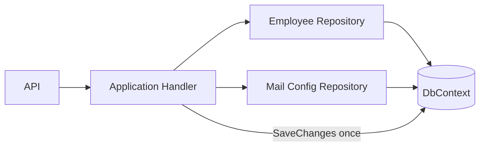
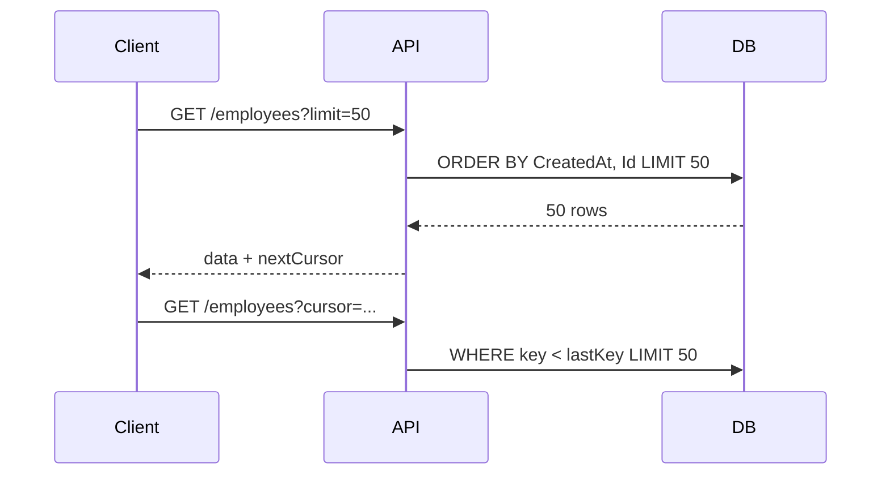
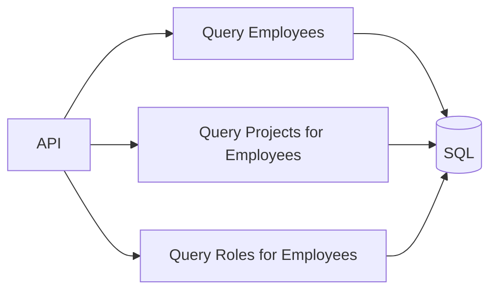
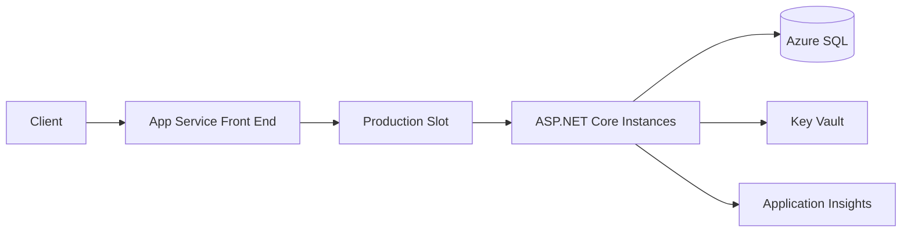
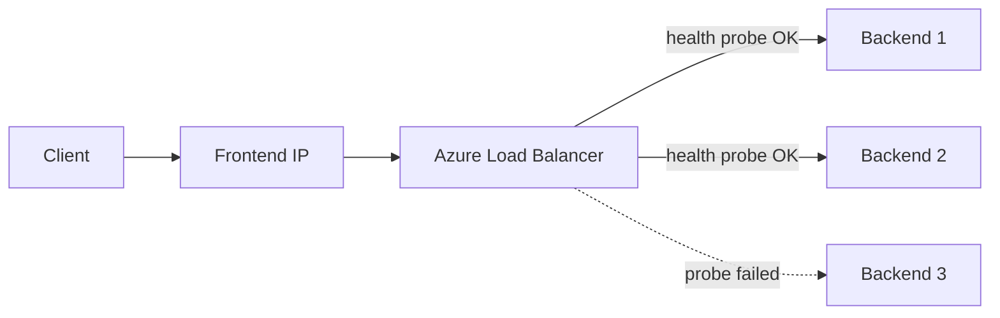
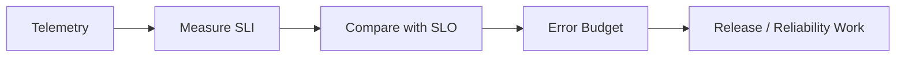
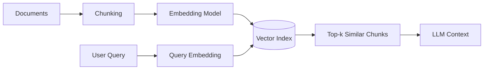
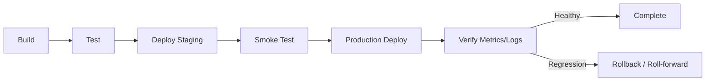
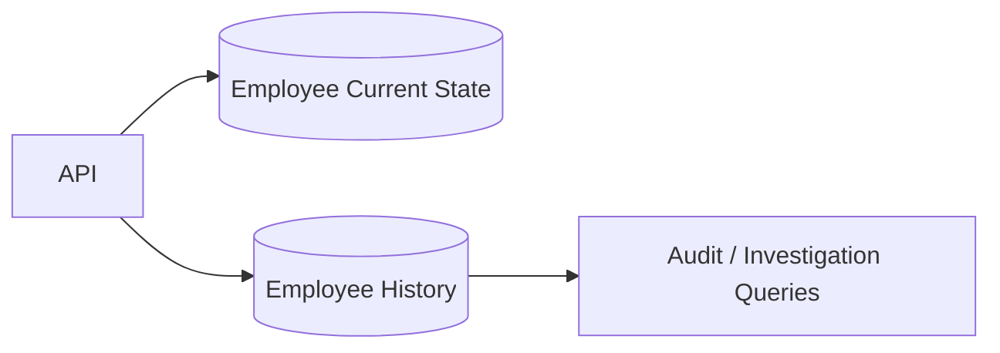

# Daily Knowledge Sharing — 17/08/2026

## Today’s Topics

1. Unit of Work — transaction boundary thực sự trong EF Core
2. RESTful API Pagination — offset, keyset và cursor pagination
3. EF Core Query Strategy — tracking, projection và split query
4. Network Optimization — giảm round-trip, payload và connection overhead
5. Azure App Service — deployment slots, scaling và production design
6. Azure Load Balancer — Layer 4 routing và high availability
7. SLI, SLO, SLA — biến “hệ thống ổn định” thành mục tiêu đo được
8. Embeddings — biểu diễn semantic để search và retrieval hiệu quả
9. Production Release — readiness, rollback và release safety
10. Database Design — audit history và temporal data trong hệ thống nghiệp vụ

---

# 1. Unit of Work — transaction boundary thực sự trong EF Core

### 1. What is it?

Unit of Work là pattern dùng để gom nhiều thay đổi dữ liệu liên quan thành một đơn vị commit logic. Trong EF Core, `DbContext` bản thân đã mang nhiều đặc tính của Unit of Work: nó theo dõi entity thay đổi, gom `INSERT/UPDATE/DELETE`, rồi flush bằng `SaveChangesAsync()`.

Điểm quan trọng không phải là “có class `UnitOfWork` hay không”, mà là **transaction boundary nằm ở đâu** và **business operation nào phải commit cùng nhau**.

### 2. Why does it exist?

Giả sử một use case tạo employee rồi tạo mail configuration. Nếu mỗi repository tự `SaveChangesAsync()` ngay sau thao tác của mình, ta có thể gặp trạng thái:

- Employee đã lưu.
- Mail configuration fail.
- Database còn trạng thái nửa vời.

Naive design thường biến mỗi repository thành một transaction nhỏ, trong khi business lại cần một transaction lớn hơn bao quanh toàn use case.

Unit of Work tồn tại để giữ quyền commit ở nơi hiểu business operation đầy đủ nhất.

### 3. How does it work?



Repository chỉ thực hiện query hoặc thêm/sửa entity trong `DbContext`. Application layer quyết định khi nào commit.

Nếu operation gồm nhiều bước cần transaction explicit:

```text
Begin transaction
  -> write A
  -> write B
  -> validate dependent state
  -> SaveChanges
Commit
```

### 4. Practical example

```csharp
public sealed class DeactivateEmployeeHandler
{
    private readonly AppDbContext _db;

    public DeactivateEmployeeHandler(AppDbContext db)
    {
        _db = db;
    }

    public async Task HandleAsync(
        Guid employeeId,
        string targetEmail,
        CancellationToken ct)
    {
        var employee = await _db.Employees
            .SingleAsync(x => x.Id == employeeId, ct);

        employee.Deactivate();

        _db.EmployeeMailConfigs.Add(new EmployeeMailConfig
        {
            EmployeeId = employeeId,
            Action = "Forward",
            TargetEmail = targetEmail,
            Status = "Pending"
        });

        await _db.SaveChangesAsync(ct);
    }
}
```

Nếu hai thay đổi cùng database và cùng `DbContext`, `SaveChangesAsync()` đã tạo một transaction cho batch cần thiết trong nhiều trường hợp.

Khi cần transaction explicit:

```csharp
await using var tx = await _db.Database.BeginTransactionAsync(ct);

employee.Deactivate();
await _db.SaveChangesAsync(ct);

await CreateRelatedRecordsAsync(ct);
await _db.SaveChangesAsync(ct);

await tx.CommitAsync(ct);
```

### 5. Real production scenario

Trong timesheet system, thao tác `ApproveTimesheet` có thể cập nhật:

- Timesheet status.
- Approval history.
- Audit record.
- Accumulated hours.

Nếu tất cả nằm cùng SQL database, đây là candidate tốt cho một transaction boundary duy nhất.

Nhưng nếu sau đó cần gửi notification qua Azure Service Bus, không nên kéo message broker vào cùng database transaction. Khi đó dùng Outbox Pattern để tách local transaction khỏi external side effect.

### 6. Common mistakes

- Mỗi repository tự gọi `SaveChangesAsync()`.
- Tạo `IUnitOfWork` chỉ bọc đúng một method `SaveChangesAsync()` nhưng không làm rõ transaction ownership.
- Giữ transaction mở quá lâu trong lúc gọi HTTP API bên ngoài.
- Dùng một `DbContext` singleton.
- Cố dùng distributed transaction cho mọi integration.
- Commit trước rồi mới validate business invariant quan trọng.

### 7. Trade-offs

**Advantages**

- Business transaction boundary rõ ràng.
- Giảm partial update trong cùng datastore.
- Dễ reasoning và test use case hơn.

**Costs / Risks**

- Transaction dài có thể giữ lock lâu.
- Unit of Work abstraction thừa có thể che mất khả năng của EF Core.
- Không giải quyết atomicity giữa nhiều external systems.

### 8. Junior → Middle → Senior understanding

**Junior**

Hiểu `DbContext` theo dõi thay đổi và `SaveChangesAsync()` là điểm commit chính.

**Middle**

Biết đặt commit ở application use case, dùng explicit transaction khi thật sự cần và không để repository tự commit tùy tiện.

**Senior / Technical Lead**

Thiết kế transaction boundary dựa trên business consistency, lock duration, concurrency và external side effects; biết khi nào chuyển sang Outbox/Saga thay vì mở rộng transaction.

### 9. Key takeaway

- Unit of Work là về transaction ownership, không phải tên class.
- `DbContext` đã cung cấp nhiều hành vi Unit of Work.
- Không giữ database transaction trong lúc chờ external API.
- Cross-system consistency cần pattern khác ngoài local transaction.

---

# 2. RESTful API Pagination — offset, keyset và cursor pagination

### 1. What is it?

Pagination chia một tập dữ liệu lớn thành các page nhỏ để API không trả hàng chục nghìn record trong một response.

Ba chiến lược phổ biến:

- Offset pagination: `page=5&pageSize=50`.
- Keyset pagination: lấy tiếp dựa trên giá trị sort cuối cùng.
- Cursor pagination: client nhận một cursor opaque và gửi lại để lấy page kế tiếp.

### 2. Why does it exist?

Endpoint kiểu:

```http
GET /api/employees
```

nếu trả toàn bộ 500.000 employees sẽ gây:

- Query DB nặng.
- Serialization tốn CPU/memory.
- Response lớn.
- Network latency cao.
- Client render chậm.

Naive pagination bằng offset giải quyết kích thước response, nhưng khi offset rất lớn, database vẫn có thể phải scan/bỏ qua nhiều rows.

### 3. How does it work?

Offset:

```sql
SELECT Id, Name, CreatedAt
FROM Employees
ORDER BY CreatedAt DESC
OFFSET 100000 ROWS FETCH NEXT 50 ROWS ONLY;
```

Keyset:

```sql
SELECT TOP (50) Id, Name, CreatedAt
FROM Employees
WHERE CreatedAt < @LastCreatedAt
   OR (CreatedAt = @LastCreatedAt AND Id < @LastId)
ORDER BY CreatedAt DESC, Id DESC;
```



Cursor thường encode các key cần cho seek, ví dụ `{createdAt,id}`.

### 4. Practical example

```csharp
public async Task<IReadOnlyList<EmployeeDto>> GetEmployeesAsync(
    DateTimeOffset? lastCreatedAt,
    Guid? lastId,
    int pageSize,
    CancellationToken ct)
{
    var query = _db.Employees
        .AsNoTracking();

    if (lastCreatedAt.HasValue && lastId.HasValue)
    {
        query = query.Where(x =>
            x.CreatedAt < lastCreatedAt.Value ||
            (x.CreatedAt == lastCreatedAt.Value && x.Id.CompareTo(lastId.Value) < 0));
    }

    return await query
        .OrderByDescending(x => x.CreatedAt)
        .ThenByDescending(x => x.Id)
        .Select(x => new EmployeeDto(x.Id, x.Name, x.CreatedAt))
        .Take(Math.Min(pageSize, 100))
        .ToListAsync(ct);
}
```

### 5. Real production scenario

Một admin portal hiển thị audit logs vài triệu rows. Người dùng chủ yếu xem log mới nhất và bấm “Load more”. Offset page 20.000 không mang nhiều giá trị; keyset/cursor phù hợp hơn vì client chỉ cần đi tuần tự.

Ngược lại, dashboard cần nhảy trực tiếp đến page 30 có thể vẫn phù hợp offset nếu dataset vừa phải và có index tốt.

### 6. Common mistakes

- Không `ORDER BY` ổn định.
- Sort chỉ theo `CreatedAt` dù nhiều row trùng timestamp.
- Cho `pageSize` tùy ý tới hàng chục nghìn.
- Trả `TotalCount` cho mọi request dù count rất đắt.
- Cursor chứa dữ liệu client có thể tự sửa mà server không validate.
- Keyset nhưng thiếu index theo sort key.
- Dùng offset cực lớn trong table hàng chục triệu rows.

### 7. Trade-offs

**Offset advantages**

- Dễ hiểu.
- Hỗ trợ jump-to-page.

**Offset costs**

- Large offset chậm.
- Dễ bị duplicate/missing rows khi dữ liệu thay đổi giữa các page.

**Keyset/cursor advantages**

- Hiệu quả cho scrolling/feed.
- Ổn định hơn với dataset lớn.

**Keyset/cursor costs**

- Khó jump arbitrary page.
- Sort/filter phức tạp hơn.

### 8. Junior → Middle → Senior understanding

**Junior**

Hiểu vì sao API phải giới hạn số record mỗi request.

**Middle**

Biết implement offset/keyset, stable ordering và index phù hợp.

**Senior / Technical Lead**

Chọn pagination theo access pattern, consistency requirement, dataset size và query plan; quyết định có cần exact total count hay không.

### 9. Key takeaway

- Pagination strategy phải theo cách người dùng duyệt dữ liệu.
- Stable sort key là bắt buộc.
- Keyset thường tốt hơn offset cho dataset rất lớn và sequential navigation.
- Pagination không thể tách rời indexing.

---

# 3. EF Core Query Strategy — tracking, projection và split query

### 1. What is it?

EF Core có nhiều lựa chọn query ảnh hưởng trực tiếp đến memory, SQL generated và performance:

- Tracking query: entity được `DbContext` theo dõi để update.
- `AsNoTracking()`: phù hợp read-only.
- Projection: chỉ lấy field cần bằng `Select`.
- Split query: tách một query include nhiều collection thành nhiều SQL query nhỏ hơn để tránh Cartesian explosion.

### 2. Why does it exist?

Naive code thường là:

```csharp
var employees = await _db.Employees
    .Include(x => x.Projects)
    .Include(x => x.Roles)
    .ToListAsync();
```

Nếu mỗi employee có 10 projects và 5 roles, SQL join có thể tạo nhiều row lặp, làm payload DB lớn hơn nhiều so với dữ liệu thực.

Ngoài ra nếu endpoint chỉ cần `Id`, `Name`, `Email` mà load nguyên entity với hàng chục cột, ta đang tốn IO và memory không cần thiết.

### 3. How does it work?

Tracking flow:

```text
Database row
 -> materialize entity
 -> attach ChangeTracker
 -> detect changes later
 -> SaveChanges
```

Read-only projection:

```text
Database row
 -> SELECT only required columns
 -> DTO
 -> return
```

Split query:



### 4. Practical example

```csharp
var employees = await _db.Employees
    .AsNoTracking()
    .Where(x => x.IsActive)
    .OrderBy(x => x.Name)
    .Select(x => new EmployeeListItem(
        x.Id,
        x.Name,
        x.Email,
        x.Department.Name))
    .Take(100)
    .ToListAsync(ct);
```

Khi thật sự cần aggregate graph:

```csharp
var employee = await _db.Employees
    .AsNoTracking()
    .Include(x => x.Projects)
    .Include(x => x.Roles)
    .AsSplitQuery()
    .SingleAsync(x => x.Id == id, ct);
```

### 5. Real production scenario

Một endpoint `/employees/search` bị chậm dù chỉ trả 50 records. Investigation cho thấy query `Include` 4 collections, SQL trả hơn 30.000 rows do join multiplication. Chuyển sang projection đúng fields và query riêng phần detail giúp response từ vài giây xuống vài trăm milliseconds.

### 6. Common mistakes

- Dùng `AsNoTracking()` rồi sửa entity và kỳ vọng `SaveChanges()` tự update.
- `Include` mọi navigation “cho tiện”.
- Gọi `ToListAsync()` quá sớm rồi filter trong memory.
- N+1 vì lazy loading hoặc loop query.
- `AsSplitQuery()` cho mọi query mà không đo round-trip cost.
- Projection nhưng vẫn gọi method không translate được sang SQL.

### 7. Trade-offs

**Tracking**

- Tốt cho update flow.
- Tốn memory/change tracking overhead.

**NoTracking + Projection**

- Tốt cho read API.
- Không phù hợp khi cần mutate entity trực tiếp.

**Split query**

- Tránh row explosion.
- Tăng số round trip và có thể thấy state khác nhau giữa các query nếu concurrency cao.

### 8. Junior → Middle → Senior understanding

**Junior**

Biết `Include`, `Select`, `AsNoTracking` khác nhau ở mục đích.

**Middle**

Biết đọc generated SQL, phát hiện N+1 và Cartesian explosion.

**Senior / Technical Lead**

Thiết kế read model, query boundary, consistency requirement và benchmark theo production-shaped data thay vì áp rule cứng.

### 9. Key takeaway

- Đừng load entity graph lớn nếu API chỉ cần vài field.
- Read-only endpoint thường nên projection + no tracking.
- Split query là công cụ, không phải mặc định.
- Luôn xem SQL thực tế và execution plan khi query quan trọng.

---

# 4. Network Optimization — giảm round-trip, payload và connection overhead

### 1. What is it?

Network optimization là giảm thời gian và tài nguyên tiêu tốn khi dữ liệu đi giữa client, API, services và external systems.

Nó không chỉ là “internet nhanh hay chậm”. Latency thường đến từ:

- Số round-trip quá nhiều.
- Payload lớn.
- DNS/TLS/connection setup.
- Serialization.
- Cross-region traffic.
- Chatty service-to-service design.

### 2. Why does it exist?

Nếu một request cần gọi 10 downstream API tuần tự, mỗi API 80 ms, dù CPU gần như không bận thì request vẫn có thể mất hơn 800 ms.

Nếu client gọi 20 endpoint để render một màn hình, mobile network có thể làm tổng latency tăng mạnh.

Naive optimization tập trung CPU hoặc database nhưng bỏ qua network path.

### 3. How does it work?

Một cách điều tra:

```text
Symptom: API p95 = 2.4s
  -> trace request
  -> DB = 120ms
  -> external API A = 700ms
  -> external API B = 600ms
  -> serialization = 80ms
  -> client transfer = 500ms
```

Sau đó tối ưu đúng bottleneck:

- Parallelize independent calls.
- Aggregate endpoint nếu client quá chatty.
- Compression cho payload text lớn.
- Pagination/projection.
- Reuse HTTP connections.
- Đặt services cùng region khi phù hợp.

### 4. Practical example

Không tốt:

```csharp
var profile = await _profileClient.GetAsync(userId, ct);
var permissions = await _permissionClient.GetAsync(userId, ct);
var notifications = await _notificationClient.GetAsync(userId, ct);
```

Nếu ba call độc lập:

```csharp
var profileTask = _profileClient.GetAsync(userId, ct);
var permissionsTask = _permissionClient.GetAsync(userId, ct);
var notificationsTask = _notificationClient.GetAsync(userId, ct);

await Task.WhenAll(profileTask, permissionsTask, notificationsTask);

return new DashboardDto(
    await profileTask,
    await permissionsTask,
    await notificationsTask);
```

Chỉ parallelize khi downstream chịu được concurrency và call thực sự độc lập.

### 5. Real production scenario

Portal mở employee detail phải gọi Graph API, local database và notification API. Nếu call tuần tự, latency tích lũy. Nếu local DB và notification độc lập với Graph, ta chạy song song, nhưng vẫn đặt timeout riêng và degradation policy để notification lỗi không phá whole page.

### 6. Common mistakes

- Tạo `new HttpClient()` mỗi request.
- Gọi external API trong loop từng record.
- Trả entity JSON quá lớn.
- Parallelize hàng trăm call không giới hạn.
- Không đo DNS/TLS/dependency latency trong trace.
- Cross-region call thường xuyên mà không nhận thức egress/latency.
- Nén payload rất nhỏ làm CPU cost lớn hơn lợi ích.

### 7. Trade-offs

**Advantages**

- Giảm end-user latency.
- Giảm bandwidth và egress cost.
- Tăng throughput nếu giảm thời gian giữ resource.

**Costs / Risks**

- Parallel call tăng áp lực downstream.
- Compression tốn CPU.
- Aggregation endpoint có thể tăng coupling UI-backend.

### 8. Junior → Middle → Senior understanding

**Junior**

Hiểu mỗi network call đều có latency và có thể fail.

**Middle**

Biết dùng `HttpClientFactory`, timeout, tracing, parallelism có kiểm soát và payload optimization.

**Senior / Technical Lead**

Phân tích end-to-end latency, cross-region topology, concurrency limits, backpressure và cost của network architecture.

### 9. Key takeaway

- Tối ưu network bắt đầu bằng trace, không bằng đoán.
- Giảm round-trip thường giá trị hơn micro-optimize code.
- Parallelism phải có giới hạn.
- Payload và topology ảnh hưởng trực tiếp latency/cost.

---

# 5. Azure App Service — deployment slots, scaling và production design

### 1. What is it?

Azure App Service là managed hosting platform cho web app và API. Với .NET backend, nó cung cấp runtime hosting, HTTPS integration, scaling, deployment slots, managed identity, diagnostics và integration với networking của Azure.

Nó phù hợp khi cần chạy web workload liên tục mà không muốn quản lý VM hoặc orchestration platform phức tạp.

### 2. Why does it exist?

Tự quản VM nghĩa là team phải xử lý OS patch, web server config, scaling, process recovery và deployment. App Service đưa những concern đó lên platform layer để application team tập trung code và runtime configuration.

### 3. How does it work?



Deployment slot cho phép deploy version mới vào `staging`, warm up, smoke test rồi swap traffic/config phù hợp sang production.

### 4. Practical example

ASP.NET Core có thể dùng Managed Identity để lấy secret thay vì lưu password trong config:

```csharp
var credential = new DefaultAzureCredential();
var secretClient = new SecretClient(
    new Uri(builder.Configuration["KeyVaultUri"]!),
    credential);
```

Health endpoint:

```csharp
builder.Services.AddHealthChecks()
    .AddSqlServer(builder.Configuration.GetConnectionString("Sql")!);

app.MapHealthChecks("/health");
```

### 5. Real production scenario

Một employee management API có traffic ổn định, deployment vài lần/tuần, không cần Kubernetes. App Service với deployment slots có thể đơn giản hơn AKS/Container Apps.

Release flow:

1. Deploy staging slot.
2. Warm-up.
3. Run smoke tests.
4. Verify telemetry.
5. Swap.
6. Nếu regression, swap back nhanh.

### 6. Common mistakes

- Chỉ chạy một instance production quan trọng.
- Để startup rất chậm nhưng không warm-up trước swap.
- Slot setting không cấu hình đúng, làm secret/config bị swap ngoài ý muốn.
- Scale-out nhưng app lưu session state trong memory local.
- Không dùng Managed Identity khi phù hợp.
- Không cấu hình health check/monitoring.
- Đặt database khác region.

### 7. Trade-offs

**Advantages**

- Vận hành đơn giản.
- Tích hợp deployment slots, autoscale, identity và monitoring.
- Phù hợp web/API workload phổ biến.

**Costs / Risks**

- Ít control hơn container orchestrator.
- Chi phí tăng theo plan/instance.
- Một số workload background/long-running đặc biệt có thể phù hợp Container Apps hoặc Worker hơn.

### 8. Junior → Middle → Senior understanding

**Junior**

Hiểu App Service là managed hosting cho web/API.

**Middle**

Biết deploy, config, health check, slot, scale và Application Insights.

**Senior / Technical Lead**

Chọn App Service so với Container Apps/AKS/Functions dựa trên workload, cost, operational complexity, networking và scaling behavior.

### 9. Key takeaway

- App Service mạnh nhất khi ưu tiên simplicity và managed hosting.
- Deployment slot giảm release risk nhưng cần warm-up và config discipline.
- Stateless app dễ scale-out hơn.
- Identity, networking và telemetry phải là part of design ngay từ đầu.

---

# 6. Azure Load Balancer — Layer 4 routing và high availability

### 1. What is it?

Azure Load Balancer là network load balancer hoạt động chủ yếu ở Layer 4, phân phối TCP/UDP traffic đến backend instances dựa trên rules và health probes.

Nó khác Application Gateway/Front Door ở chỗ không tập trung vào HTTP-aware routing như path routing, TLS termination nâng cao hay WAF.

### 2. Why does it exist?

Nếu có nhiều VM/service instances phục vụ cùng endpoint, client không nên biết từng backend IP. Load balancer cung cấp một frontend IP ổn định và phân phối connection tới backend khỏe mạnh.

### 3. How does it work?



Health probe xác định backend có nhận traffic mới hay không. Load balancer không hiểu business response sâu như reverse proxy HTTP.

### 4. Practical example

Giả sử hai .NET services chạy trên VMs port 443. Health probe gọi TCP/HTTPS endpoint. Application phải expose health đủ nhẹ và phản ánh khả năng phục vụ traffic.

Trong code:

```csharp
builder.Services.AddHealthChecks()
    .AddCheck("self", () => HealthCheckResult.Healthy());

app.MapHealthChecks("/health/live");
```

Liveness không nhất thiết kiểm tra mọi dependency; nếu database tạm chậm mà app bị loại khỏi toàn bộ backend pool, có thể làm outage nặng hơn.

### 5. Real production scenario

Một legacy .NET service vẫn chạy trên Azure VMs vì phụ thuộc software đặc thù. Team cần HA qua nhiều instances nhưng không cần path routing. Azure Load Balancer phù hợp hơn một HTTP gateway đầy đủ.

### 6. Common mistakes

- Nhầm Load Balancer với Application Gateway.
- Health probe quá sâu, dependency phụ lỗi làm toàn bộ instance bị rút khỏi pool.
- Chỉ có một backend instance rồi nghĩ đã HA.
- Stateful session phụ thuộc một VM.
- Không monitor probe failure và backend health.
- Thiết kế inbound/outbound networking mà không hiểu SNAT/connection behavior.

### 7. Trade-offs

**Advantages**

- Hiệu quả cho TCP/UDP load balancing.
- Latency thấp, architecture đơn giản.
- Phù hợp VM-based workloads và private networking.

**Costs / Risks**

- Không có nhiều HTTP-specific capability.
- WAF/path routing cần service khác.
- Network troubleshooting đòi hỏi hiểu Layer 4 và backend health.

### 8. Junior → Middle → Senior understanding

**Junior**

Hiểu load balancer phân phối traffic tới nhiều backend.

**Middle**

Biết health probe, backend pool, frontend IP và basic routing.

**Senior / Technical Lead**

Chọn đúng Layer 4 vs Layer 7 solution, thiết kế zone/HA, health semantics, SNAT và failure recovery.

### 9. Key takeaway

- Azure Load Balancer phù hợp TCP/UDP Layer 4.
- Health probe design ảnh hưởng trực tiếp availability.
- HA cần nhiều backend và failure-domain thinking.
- Đừng dùng Layer 7 gateway nếu Layer 4 đã đủ, và ngược lại.

---

# 7. SLI, SLO, SLA — biến “hệ thống ổn định” thành mục tiêu đo được

### 1. What is it?

**SLI (Service Level Indicator)** là số đo reliability thực tế, ví dụ availability, latency, successful request rate.

**SLO (Service Level Objective)** là mục tiêu nội bộ cho SLI, ví dụ 99.9% request thành công trong 30 ngày.

**SLA (Service Level Agreement)** là cam kết với khách hàng/đối tác, thường có hậu quả thương mại nếu vi phạm.

### 2. Why does it exist?

Nếu team chỉ nói “API phải nhanh và ổn định”, không ai biết:

- Nhanh là bao nhiêu?
- Bao nhiêu lỗi được chấp nhận?
- Đo theo average hay p95?
- Trong cửa sổ thời gian nào?

Không có mục tiêu đo được, alerting và prioritization sẽ mang tính cảm tính.

### 3. How does it work?

Ví dụ:

```text
SLI: successful requests / valid requests
SLO: >= 99.9% trong rolling 30 days
Error budget: 0.1%
```

Nếu có 10 triệu request/tháng, error budget tương đương khoảng 10.000 failed requests theo định nghĩa SLI đó.



### 4. Practical example

Một .NET API có thể emit metrics cho request success và latency. Trong observability backend, tính:

```text
Availability SLI = successful valid requests / all valid requests
Latency SLI = percentage of requests < 500ms
```

Không nên tính 4xx do client validation sai là server availability failure nếu contract đã định nghĩa rõ.

### 5. Real production scenario

Một notification service có 99.99% process uptime nhưng queue backlog 2 giờ. Nếu SLI chỉ đo process alive, dashboard xanh nhưng user không nhận email.

SLI tốt hơn có thể là:

- 99.9% notifications được delivered hoặc permanently classified trong 5 phút.
- Oldest queue message age < 10 phút.

### 6. Common mistakes

- Nhầm uptime của process với user-facing reliability.
- Đặt SLO 100%.
- Average latency thay vì percentile.
- SLA nội bộ giống SLO mà không hiểu contractual consequence.
- Có SLO nhưng alert không liên quan error budget.
- Định nghĩa SLI không loại bỏ invalid traffic/bot noise phù hợp.

### 7. Trade-offs

**Advantages**

- Reliability có ngôn ngữ định lượng.
- Alerting meaningful hơn.
- Giúp cân bằng tốc độ release và stability.

**Costs / Risks**

- Cần telemetry chính xác.
- SLI sai dẫn đến quyết định sai.
- SLO quá chặt làm chi phí vận hành tăng mạnh.

### 8. Junior → Middle → Senior understanding

**Junior**

Biết phân biệt indicator, objective và agreement.

**Middle**

Biết tạo metric phù hợp user journey và dashboard theo percentile/error rate.

**Senior / Technical Lead**

Thiết kế SLO theo business criticality, error budget policy, alert strategy và trade-off cost/reliability.

### 9. Key takeaway

- Reliability phải đo theo user outcome.
- SLO không nên mặc định 100%.
- Error budget giúp biến reliability thành quyết định engineering.
- SLA là business contract, không chỉ technical metric.

---

# 8. Embeddings — biểu diễn semantic để search và retrieval hiệu quả

### 1. What is it?

Embedding là vector số biểu diễn semantic meaning của text hoặc dữ liệu. Những đoạn có ý nghĩa gần nhau thường có vector gần nhau theo một distance/similarity metric.

Embedding không phải câu trả lời của LLM. Nó là representation dùng cho search, clustering, recommendation, retrieval và deduplication semantic.

### 2. Why does it exist?

Keyword search thất bại khi từ khác nhau nhưng nghĩa giống nhau.

Ví dụ user hỏi:

> “Làm sao xử lý nhân viên nghỉ việc?”

Tài liệu có tiêu đề:

> “Employee offboarding workflow”

Keyword thuần có thể không match tốt. Embedding giúp match semantic giữa hai câu dù từ vựng khác nhau.

### 3. How does it work?



Pipeline production thường gồm:

1. Chuẩn hóa/chunk document.
2. Generate embedding.
3. Lưu vector + metadata.
4. Query embedding.
5. Similarity search.
6. Metadata filter/rerank nếu cần.

### 4. Practical example

Pseudo-realistic C# structure:

```csharp
public sealed record KnowledgeChunk(
    string Id,
    string DocumentId,
    string Text,
    float[] Embedding,
    string Department);

public async Task<IReadOnlyList<KnowledgeChunk>> SearchAsync(
    string query,
    string department,
    CancellationToken ct)
{
    var queryVector = await _embeddingService.CreateAsync(query, ct);

    return await _vectorStore.SearchAsync(
        queryVector,
        topK: 8,
        filter: x => x.Department == department,
        cancellationToken: ct);
}
```

Metadata filter quan trọng để không retrieve tài liệu user không có quyền xem.

### 5. Real production scenario

Internal AI assistant tìm policy từ SharePoint/Microsoft 365 documents. User hỏi bằng tiếng Việt, tài liệu có thể tiếng Anh. Embedding multilingual phù hợp có thể tìm đúng semantic chunk, rồi LLM trả lời dựa trên retrieved context.

Security phải enforce trước hoặc trong retrieval; không được retrieve secret document rồi chỉ hy vọng prompt không leak.

### 6. Common mistakes

- Chunk quá lớn hoặc quá nhỏ mà không evaluate.
- Không lưu metadata source/version/permission.
- Dùng top-k cố định không đo precision/recall.
- Coi similarity score cao là factual correctness.
- Re-embed toàn kho mỗi lần nhỏ thay đổi.
- Không version embedding model/index.
- Bỏ keyword/hybrid search dù domain có mã, ID, acronym chính xác.

### 7. Trade-offs

**Advantages**

- Semantic search mạnh hơn keyword-only.
- Hỗ trợ RAG, clustering và recommendations.
- Có thể cross-language tùy model.

**Costs / Risks**

- Index/storage cost.
- Re-index khi model/chunking thay đổi.
- Similarity không đảm bảo relevance tuyệt đối.
- Security filtering và freshness phức tạp.

### 8. Junior → Middle → Senior understanding

**Junior**

Hiểu embedding là vector semantic, không phải generated answer.

**Middle**

Biết chunk, embed, store, query top-k và metadata filtering.

**Senior / Technical Lead**

Thiết kế evaluation, hybrid retrieval, model/index versioning, access control, refresh strategy và cost/latency trade-offs.

### 9. Key takeaway

- Embedding giải quyết semantic retrieval, không thay thế source-of-truth.
- Chunking và metadata quan trọng ngang model.
- Retrieval phải enforce authorization.
- Luôn evaluate bằng query thực tế của domain.

---

# 9. Production Release — readiness, rollback và release safety

### 1. What is it?

Production release là toàn bộ quá trình đưa thay đổi vào production một cách kiểm soát, không chỉ thao tác deploy binary.

Một release tốt bao gồm:

- Readiness checks.
- Database compatibility.
- Configuration/secrets.
- Observability.
- Rollback hoặc roll-forward plan.
- Smoke test.
- Ownership khi incident xảy ra.

### 2. Why does it exist?

Code chạy pass CI không có nghĩa production-safe. Production có:

- Data thật.
- Traffic concurrency.
- External dependency.
- Old/new instances chạy song song trong rolling deployment.
- Config khác environment.

Naive release kiểu “merge main rồi deploy” dễ tạo incident khó rollback.

### 3. How does it work?



Release phải xác định trước điều kiện rollback, ví dụ error rate > 5% trong 10 phút hoặc key business transaction fail.

### 4. Practical example

Backward-compatible migration:

Release 1:

```sql
ALTER TABLE Employees ADD PreferredName nvarchar(200) NULL;
```

Application version mới bắt đầu đọc/ghi field mới nhưng vẫn chịu được `NULL`.

Release sau mới enforce constraint nếu dữ liệu đã backfill.

Không nên deploy migration đổi tên/xóa column ngay khi old instances vẫn chạy.

### 5. Real production scenario

Một API thêm field mới và migration đồng thời. Rolling deployment khiến instance cũ và mới cùng hoạt động vài phút. Nếu migration xóa column mà instance cũ vẫn query, production sẽ lỗi dù version mới đúng.

Safe release cần “expand → migrate/backfill → contract” thay vì breaking schema một bước.

### 6. Common mistakes

- Không có rollback criteria.
- Migration destructive chạy trước khi app version cũ ngừng dùng field.
- Rollback code nhưng database schema không rollback được.
- Không smoke test user journey chính.
- Deploy Friday evening mà không có owner/on-call rõ.
- Không kiểm tra config/secret/environment differences.
- Chỉ nhìn deployment success chứ không nhìn business metrics.

### 7. Trade-offs

**Advantages**

- Giảm blast radius.
- Recovery nhanh hơn.
- Release confidence cao hơn.

**Costs / Risks**

- Pipeline và operational process phức tạp hơn.
- Compatibility code tồn tại tạm thời.
- Canary/blue-green có thêm infrastructure cost.

### 8. Junior → Middle → Senior understanding

**Junior**

Hiểu deploy success không đồng nghĩa release success.

**Middle**

Biết smoke test, config check, migration compatibility và log/metric verification.

**Senior / Technical Lead**

Thiết kế rollout strategy, rollback/roll-forward, database evolution, release gates, error budget và incident ownership.

### 9. Key takeaway

- Production release là một workflow quản lý risk.
- Database change phải tương thích với nhiều app version khi rollout.
- Rollback plan phải được thiết kế trước release.
- Verify bằng user/business signals, không chỉ deployment status.

---

# 10. Database Design — audit history và temporal data trong hệ thống nghiệp vụ

### 1. What is it?

Audit history lưu lại **ai thay đổi gì, khi nào, từ giá trị nào sang giá trị nào**. Temporal data đi xa hơn: hệ thống có thể trả lời trạng thái của dữ liệu tại một thời điểm trong quá khứ.

Trong business systems như employee, timesheet, approval hay offboarding, current state thường không đủ cho điều tra và compliance.

### 2. Why does it exist?

Nếu bảng `Employee` chỉ giữ trạng thái hiện tại:

```text
Status = Inactive
ManagerId = 42
```

Ta không trả lời được:

- Khi nào employee chuyển inactive?
- Manager trước là ai?
- Ai thay đổi?
- Forwarding email được bật lúc nào?
- Cấu hình trước đó là gì?

Naive solution là log text tự do, nhưng log không phải structured business history và khó query đáng tin cậy.

### 3. How does it work?

Một mô hình đơn giản:



History table có thể chứa:

```text
Id
EmployeeId
ChangeType
OldValue
NewValue
ChangedBy
ChangedAtUtc
CorrelationId
```

Hoặc dùng domain-specific history rows thay vì generic JSON nếu cần query mạnh.

### 4. Practical example

```csharp
public async Task ChangeManagerAsync(
    Employee employee,
    Guid newManagerId,
    string changedBy,
    CancellationToken ct)
{
    var oldManagerId = employee.ManagerId;

    employee.ManagerId = newManagerId;

    _db.EmployeeHistories.Add(new EmployeeHistory
    {
        EmployeeId = employee.Id,
        Action = "ManagerChanged",
        OldValue = oldManagerId?.ToString(),
        NewValue = newManagerId.ToString(),
        ChangedBy = changedBy,
        ChangedAtUtc = DateTimeOffset.UtcNow
    });

    await _db.SaveChangesAsync(ct);
}
```

Current state và history nên commit cùng transaction nếu history là audit bắt buộc.

### 5. Real production scenario

Một incident cho thấy forwarding email của employee bị đổi sang sai target. Team cần biết:

- Request nào thực hiện thay đổi.
- User/admin nào thao tác.
- Target cũ/mới.
- Thời điểm.
- Correlation ID để nối sang application logs.

Nếu chỉ có current row, gần như không thể điều tra chính xác.

### 6. Common mistakes

- Chỉ log text, không có structured history.
- Audit table bị update/delete tự do.
- Không lưu actor/correlation ID.
- History chứa PII/secret không cần thiết.
- Generic JSON history nhưng sau này cần báo cáo SQL phức tạp.
- Lưu local time thay vì UTC hoặc timestamp có offset rõ ràng.
- Không có retention policy.

### 7. Trade-offs

**Advantages**

- Debugging và audit tốt hơn.
- Hỗ trợ compliance và business investigation.
- Có thể reconstruct state history.

**Costs / Risks**

- Storage tăng liên tục.
- Query/history schema phức tạp.
- PII retention và access control cần được quản lý nghiêm ngặt.

### 8. Junior → Middle → Senior understanding

**Junior**

Hiểu current state khác history/audit.

**Middle**

Biết ghi history cùng transaction, lưu actor/time/correlation và query lịch sử.

**Senior / Technical Lead**

Quyết định generic audit vs domain history vs database temporal feature, retention, privacy, immutability, partitioning và compliance boundary.

### 9. Key takeaway

- Nhiều hệ thống nghiệp vụ cần biết “đã từng xảy ra gì”, không chỉ “hiện tại là gì”.
- Audit phải structured và traceable.
- Current state + history cần consistency rõ ràng.
- Retention, PII và access control là phần của database design.