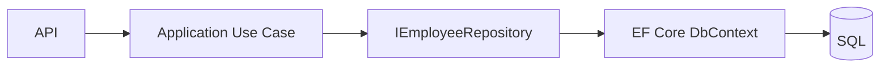
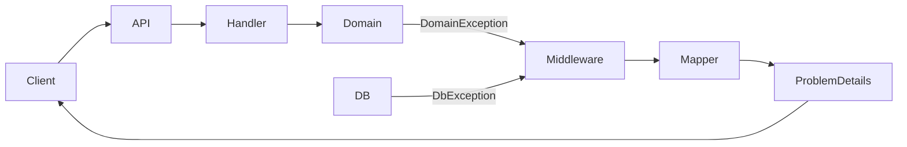
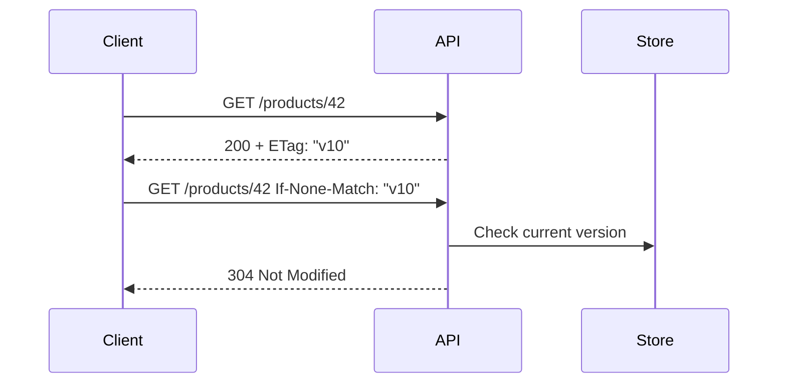
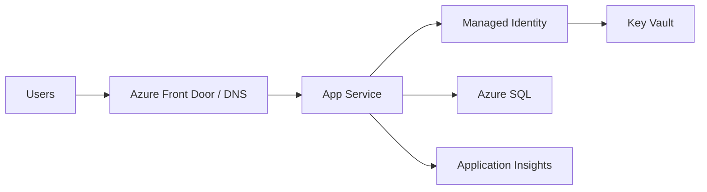
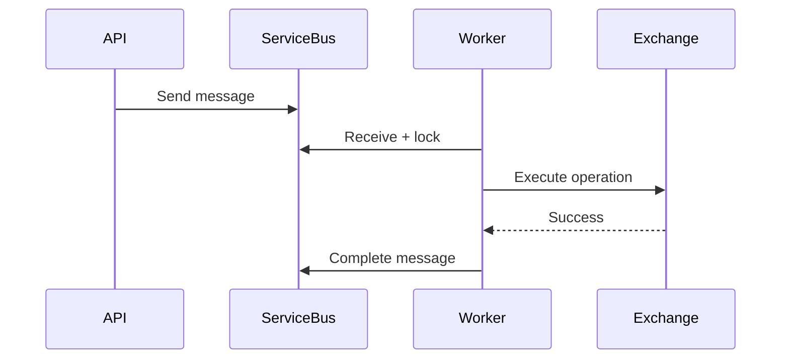
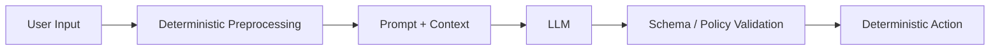
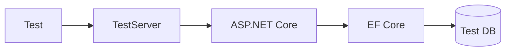

# Daily Knowledge Sharing — 17/08/2026

## Today’s Topics

1. Repository Pattern vs EF Core DbContext — khi abstraction giúp ích và khi chỉ làm phức tạp hệ thống
2. Error Handling — thiết kế Problem Details và exception boundary trong ASP.NET Core
3. PostgreSQL — MVCC, vacuum và lý do query có thể chậm dù không bị lock
4. HTTP Caching — ETag, Cache-Control và conditional request cho API
5. Azure App Service — production hosting, scaling, deployment slot và networking
6. Azure Service Bus — duplicate delivery, lock renewal và idempotent consumer
7. Production Troubleshooting — phương pháp điều tra từ symptom đến root cause
8. Prompt Engineering — thiết kế prompt như một interface có contract và failure mode
9. Integration Testing — test boundary thật thay vì mock toàn bộ dependency
10. Incident Management — containment, recovery, postmortem và prevention

---

# 1. Repository Pattern vs EF Core DbContext — khi abstraction giúp ích và khi chỉ làm phức tạp hệ thống

### 1. What is it?

Repository Pattern tạo một abstraction đại diện cho việc truy cập và lưu trữ aggregate/domain entity. Ý tưởng gốc là business code không cần biết dữ liệu đến từ SQL, file hay external service.

Trong .NET hiện đại, EF Core `DbContext` và `DbSet<T>` bản thân đã mang nhiều đặc tính của Unit of Work và Repository. Vì vậy câu hỏi quan trọng không còn là “có nên dùng Repository Pattern không?” mà là “abstraction nào thực sự tạo giá trị?”.

### 2. Why does it exist?

Nếu application layer truy cập trực tiếp SQL, business logic bị coupling với persistence detail. Nhưng nếu ta tạo generic repository kiểu `Add`, `Update`, `Delete`, `GetAll`, rồi bên trong chỉ gọi lại EF Core, abstraction đó thường không thêm giá trị mà còn che mất khả năng query của EF.

Naive abstraction:

```csharp
public interface IRepository<T>
{
    IQueryable<T> GetAll();
    Task<T?> GetByIdAsync(Guid id);
    void Add(T entity);
}
```

Nếu đã expose `IQueryable`, repository gần như không còn bảo vệ boundary gì cả.

### 3. How does it work?

Một repository hữu ích nên bám theo domain capability:



Repository không nên phản ánh table CRUD; nó nên phản ánh ngôn ngữ domain, ví dụ:

- `GetActiveEmployeeForOffboardingAsync`
- `GetExpiredMailConfigurationsAsync`
- `SaveChangesAsync`

### 4. Practical example

```csharp
public interface IEmployeeRepository
{
    Task<Employee?> GetForOffboardingAsync(
        Guid employeeId,
        CancellationToken ct);

    Task<IReadOnlyList<EmployeeOffboardingMailConfig>>
        GetExpiredMailConfigurationsAsync(
            DateTimeOffset now,
            CancellationToken ct);
}

public sealed class EmployeeRepository : IEmployeeRepository
{
    private readonly AppDbContext _db;

    public EmployeeRepository(AppDbContext db) => _db = db;

    public Task<Employee?> GetForOffboardingAsync(
        Guid employeeId,
        CancellationToken ct)
        => _db.Employees
            .Include(x => x.MailConfiguration)
            .SingleOrDefaultAsync(x => x.Id == employeeId, ct);

    public async Task<IReadOnlyList<EmployeeOffboardingMailConfig>>
        GetExpiredMailConfigurationsAsync(
            DateTimeOffset now,
            CancellationToken ct)
        => await _db.EmployeeOffboardingMailConfigs
            .Where(x => x.EndTime <= now && !x.IsReset)
            .ToListAsync(ct);
}
```

### 5. Real production scenario

Trong hệ thống employee management, offboarding flow cần load employee, mail config và audit state cùng nhau. Repository có thể encapsulate query shape đúng cho use case thay vì để mỗi handler tự include navigation khác nhau.

Nhưng với reporting query thuần read model, trực tiếp dùng EF Core projection trong query service có thể đơn giản và nhanh hơn cố ép qua repository domain.

### 6. Common mistakes

- Tạo generic repository cho mọi entity.
- Repository chỉ là wrapper 1-1 quanh `DbSet<T>`.
- Expose `IQueryable` nhưng vẫn tuyên bố đã “hide EF Core”.
- Đặt business logic vào repository.
- Mỗi repository tự gọi `SaveChangesAsync`, phá transaction boundary.
- Mock repository quá nhiều thay vì integration test query thật.

### 7. Trade-offs

**Advantages**

- Encapsulate query phức tạp theo domain.
- Giảm persistence coupling trong application layer.
- Dễ giữ aggregate boundary.

**Costs / Risks**

- Thêm abstraction và code ceremony.
- Có thể che mất feature của EF Core.
- Generic repository thường làm query kém rõ ràng.

### 8. Junior → Middle → Senior understanding

**Junior**

Hiểu repository là boundary truy cập dữ liệu, không phải “mỗi table một class CRUD”.

**Middle**

Biết thiết kế repository theo use case/domain, kiểm soát transaction và tránh N+1.

**Senior / Technical Lead**

Phải quyết định nơi nào abstraction tạo giá trị, nơi nào trực tiếp dùng EF Core tốt hơn, và cách giữ query model khác command model.

### 9. Key takeaway

- EF Core đã cung cấp nhiều behavior của Repository/Unit of Work.
- Repository chỉ đáng dùng khi nó bảo vệ domain/persistence boundary thật sự.
- Tránh generic abstraction chỉ để “đúng pattern”.

---

# 2. Error Handling — thiết kế Problem Details và exception boundary trong ASP.NET Core

### 1. What is it?

Error Handling production không phải chỉ là `try/catch`. Nó là cách phân loại lỗi, log đúng mức, trả contract ổn định cho client và không leak implementation detail.

ASP.NET Core có thể dùng RFC 7807/9457 style `ProblemDetails` để trả lỗi có cấu trúc.

### 2. Why does it exist?

Nếu mỗi controller tự catch exception và trả format riêng, client phải xử lý hàng chục dạng lỗi. Đồng thời developer dễ trả stack trace hoặc message nội bộ ra ngoài.

Naive code:

```csharp
try
{
    ...
}
catch (Exception ex)
{
    return BadRequest(ex.Message);
}
```

Cách này vừa sai status code vừa leak detail.

### 3. How does it work?



Global exception handler map exception type thành HTTP status + error code.

### 4. Practical example

```csharp
public sealed class GlobalExceptionHandler : IExceptionHandler
{
    private readonly ILogger<GlobalExceptionHandler> _logger;

    public GlobalExceptionHandler(ILogger<GlobalExceptionHandler> logger)
        => _logger = logger;

    public async ValueTask<bool> TryHandleAsync(
        HttpContext httpContext,
        Exception exception,
        CancellationToken cancellationToken)
    {
        var (status, title, code) = exception switch
        {
            ValidationException => (400, "Validation failed", "validation_error"),
            NotFoundException => (404, "Resource not found", "not_found"),
            ConflictException => (409, "Conflict", "conflict"),
            _ => (500, "Unexpected server error", "internal_error")
        };

        if (status >= 500)
            _logger.LogError(exception, "Unhandled exception");
        else
            _logger.LogWarning(exception, "Request failed with {Code}", code);

        await Results.Problem(
            statusCode: status,
            title: title,
            extensions: new Dictionary<string, object?>
            {
                ["code"] = code,
                ["traceId"] = httpContext.TraceIdentifier
            })
            .ExecuteAsync(httpContext);

        return true;
    }
}
```

### 5. Real production scenario

Một API update timesheet gặp optimistic concurrency conflict. Đây không phải 500 mà thường là 409 để client reload state. Một employee ID không tồn tại là 404. SQL connection timeout mới có thể là 500/503 tùy policy.

### 6. Common mistakes

- Catch `Exception` ở mọi service layer rồi throw lại.
- Dùng 400 cho mọi lỗi.
- Trả stack trace ra client.
- Log cùng một exception ở 4 layer gây duplicate noise.
- Không có stable machine-readable `error code`.
- Dùng exception cho expected validation quá thường xuyên khi flow có thể xử lý bằng result type.

### 7. Trade-offs

**Advantages**

- Error contract nhất quán.
- Client dễ xử lý.
- Observability tốt hơn.
- Giảm leak security detail.

**Costs / Risks**

- Mapping layer cần duy trì.
- Nếu abstraction quá tổng quát có thể mất business context.

### 8. Junior → Middle → Senior understanding

**Junior**

Biết phân biệt validation error, not found, conflict và server error.

**Middle**

Biết implement global handler, ProblemDetails, correlation ID và logging level.

**Senior / Technical Lead**

Thiết kế error taxonomy, retryability, public/private error detail và backward-compatible error contract.

### 9. Key takeaway

- Error handling là API contract, không chỉ try/catch.
- Log một lần tại đúng boundary.
- Public error cần ổn định nhưng không leak nội bộ.

---

# 3. PostgreSQL — MVCC, vacuum và lý do query có thể chậm dù không bị lock

### 1. What is it?

PostgreSQL dùng MVCC (Multi-Version Concurrency Control) để reader và writer ít block nhau hơn. Khi row được update, phiên bản cũ không bị ghi đè ngay; PostgreSQL tạo version mới và giữ version cũ cho transaction còn cần nhìn thấy nó.

### 2. Why does it exist?

Nếu mọi read phải lock row và chờ writer, concurrency sẽ giảm mạnh. MVCC cho phép mỗi transaction nhìn snapshot phù hợp với isolation level.

Nhưng trade-off là dead tuples tích tụ và cần VACUUM để reclaim space và giữ visibility metadata hiệu quả.

### 3. How does it work?

```text
UPDATE row
   ↓
old tuple vẫn tồn tại
   ↓
new tuple được tạo
   ↓
transaction mới thấy version phù hợp
   ↓
VACUUM dọn tuple không còn cần thiết
```

Nếu autovacuum không theo kịp workload update/delete, table/index bloat có thể tăng.

### 4. Practical example

Giả sử table job queue bị update trạng thái liên tục:

```sql
UPDATE jobs
SET status = 'processed', processed_at = now()
WHERE id = $1;
```

Theo thời gian, row version cũ trở thành dead tuples. Kiểm tra:

```sql
SELECT
    relname,
    n_live_tup,
    n_dead_tup,
    last_autovacuum
FROM pg_stat_user_tables
ORDER BY n_dead_tup DESC;
```

### 5. Real production scenario

Background job system có hàng triệu record được update status liên tục. Query `WHERE status = 'pending'` ngày càng chậm dù index vẫn tồn tại. Nguyên nhân có thể là bloat, stale statistics hoặc index không còn selective như trước.

### 6. Common mistakes

- Nghĩ PostgreSQL “không lock” vì có MVCC.
- Tắt autovacuum để giảm IO.
- Giữ transaction mở rất lâu, ngăn vacuum dọn version cũ.
- Không monitor dead tuples.
- Dùng `SELECT *` trên bảng lớn rồi đổ lỗi database.

### 7. Trade-offs

**Advantages**

- Read/write concurrency tốt.
- Snapshot isolation behavior mạnh.

**Costs / Risks**

- Bloat.
- Vacuum overhead.
- Long-running transactions gây tác động lớn.

### 8. Junior → Middle → Senior understanding

**Junior**

Hiểu update không nhất thiết overwrite row tại chỗ.

**Middle**

Biết đọc `pg_stat_user_tables`, explain plan và nhận diện autovacuum issue.

**Senior / Technical Lead**

Phải cân tuning autovacuum, transaction duration, partitioning và workload characteristics.

### 9. Key takeaway

- MVCC giảm blocking nhưng không miễn phí.
- Long transaction là kẻ thù của vacuum.
- Query performance cần nhìn cả tuples, stats và index health.

---

# 4. HTTP Caching — ETag, Cache-Control và conditional request cho API

### 1. What is it?

HTTP caching tận dụng cơ chế chuẩn của HTTP để client, browser, proxy hoặc CDN reuse response thay vì gọi backend đầy đủ mỗi lần.

`Cache-Control` quy định cách cache. `ETag` đại diện version của resource để client thực hiện conditional request.

### 2. Why does it exist?

Nếu resource ít thay đổi nhưng được đọc nhiều, request lặp lại làm tốn bandwidth, CPU và database. Redis không phải lúc nào cũng là đáp án; đôi khi HTTP layer đã có cơ chế phù hợp hơn.

### 3. How does it work?



304 không gửi body lại, giảm network payload.

### 4. Practical example

```csharp
[HttpGet("products/{id:guid}")]
public async Task<IActionResult> Get(Guid id, CancellationToken ct)
{
    var product = await _db.Products
        .AsNoTracking()
        .SingleOrDefaultAsync(x => x.Id == id, ct);

    if (product is null)
        return NotFound();

    var etag = $"\"{product.RowVersionHex}\"";

    if (Request.Headers.IfNoneMatch == etag)
        return StatusCode(StatusCodes.Status304NotModified);

    Response.Headers.ETag = etag;
    Response.Headers.CacheControl = "private,max-age=60";

    return Ok(product);
}
```

### 5. Real production scenario

Employee profile được mobile app mở nhiều lần nhưng thay đổi ít. ETag giúp client xác nhận resource chưa thay đổi mà không tải lại payload đầy đủ.

Với dữ liệu nhạy cảm, cần thận trọng với shared caches và dùng `private` hoặc `no-store` phù hợp.

### 6. Common mistakes

- Cache response có dữ liệu user-specific ở shared proxy.
- Dùng `max-age` rất dài nhưng không có invalidation/versioning.
- ETag tính từ toàn body quá đắt.
- Không hiểu khác biệt browser cache, CDN cache và application cache.
- Cache error response ngoài ý muốn.

### 7. Trade-offs

**Advantages**

- Giảm bandwidth và backend load.
- Dùng HTTP standard, không cần infrastructure mới.

**Costs / Risks**

- Cache semantics phức tạp.
- Security issue nếu cache private data sai cách.
- Stale data nếu policy không phù hợp.

### 8. Junior → Middle → Senior understanding

**Junior**

Hiểu 304 và ETag.

**Middle**

Biết set `Cache-Control`, conditional request và version resource.

**Senior / Technical Lead**

Thiết kế caching policy theo data sensitivity, CDN topology và consistency requirement.

### 9. Key takeaway

- Không phải caching nào cũng cần Redis.
- HTTP caching đặc biệt hiệu quả cho read-heavy resource.
- Security và cache scope phải được thiết kế rõ.

---

# 5. Azure App Service — production hosting, scaling, deployment slot và networking

### 1. What is it?

Azure App Service là managed hosting platform cho web app/API. Nó quản lý VM underlying, patching platform, health infrastructure và integration với deployment, scaling, identity, TLS.

### 2. Why does it exist?

Không phải team nào cũng cần Kubernetes hay container orchestration. Với nhiều ASP.NET Core API, App Service cung cấp đủ managed capability với operational burden thấp hơn.

### 3. How does it work?



Scale-out tạo thêm instances. Deployment slot cho phép deploy version mới sang staging rồi swap.

### 4. Practical example

Ứng dụng không nên giữ state session trong memory nếu scale-out nhiều instance. Dùng distributed store nếu session thật sự cần.

Config production có thể lấy secret từ Key Vault bằng Managed Identity thay vì connection string chứa secret trong repository.

```csharp
builder.Configuration.AddAzureKeyVault(
    new Uri(keyVaultUri),
    new DefaultAzureCredential());
```

### 5. Real production scenario

Một timesheet API deploy bản mới. Thay vì deploy trực tiếp production, pipeline deploy slot `staging`, chạy smoke test rồi swap slot. Nếu lỗi, swap back nhanh hơn rebuild.

### 6. Common mistakes

- Lưu file quan trọng vào local filesystem của instance.
- In-memory session khi scale-out.
- Không warm-up slot trước swap.
- Scale-out nhưng database vẫn bottleneck.
- Expose public network rộng trong khi backend requirement cần private access.

### 7. Trade-offs

**Advantages**

- Managed platform đơn giản.
- Deployment slot tiện.
- Tích hợp Managed Identity/monitoring.

**Costs / Risks**

- Ít kiểm soát infrastructure hơn VM/container platform.
- Cost tier tăng khi cần nhiều instance.
- Một số workload background dài hạn phù hợp Container Apps/Worker hơn.

### 8. Junior → Middle → Senior understanding

**Junior**

Biết App Service là hosting platform, không phải chỉ “server trên Azure”.

**Middle**

Biết scaling, slots, configuration, health check và App Insights.

**Senior / Technical Lead**

Quyết định App Service vs Container Apps/AKS, network topology, DR và capacity/cost model.

### 9. Key takeaway

- App Service phù hợp nhiều web/API workload mà không cần orchestration phức tạp.
- Stateless design là điều kiện quan trọng để scale-out.
- Deployment slot giảm release risk.

---

# 6. Azure Service Bus — duplicate delivery, lock renewal và idempotent consumer

### 1. What is it?

Azure Service Bus là enterprise message broker hỗ trợ queue/topic, lock-based delivery, retries và dead-letter queue.

Consumer thường nhận message theo mô hình at-least-once, nghĩa là duplicate delivery có thể xảy ra.

### 2. Why does it exist?

Nếu API phải chờ email, file processing hoặc external integration hoàn tất, latency và reliability bị coupling. Queue tách producer khỏi consumer và hấp thụ traffic spike.

### 3. How does it work?



Nếu worker chết trước `Complete`, lock hết hạn và message có thể được delivery lại.

### 4. Practical example

Idempotent consumer:

```csharp
public async Task ProcessAsync(ServiceBusReceivedMessage message, CancellationToken ct)
{
    var messageId = message.MessageId;

    if (await _db.ProcessedMessages.AnyAsync(x => x.Id == messageId, ct))
        return;

    await _mailService.ApplyForwardingAsync(
        message.Body.ToObjectFromJson<ForwardingCommand>()!, ct);

    _db.ProcessedMessages.Add(new ProcessedMessage(messageId));
    await _db.SaveChangesAsync(ct);
}
```

Tốt hơn nữa nếu side effect và dedupe state có transaction semantics rõ ràng.

### 5. Real production scenario

Job reset expired forwarding gửi message vào queue. Worker xử lý Exchange Online nhưng bị network timeout sau khi remote side đã success. Message retry có thể gọi action lần hai. Operation phải idempotent hoặc kiểm tra current state trước khi thực hiện.

### 6. Common mistakes

- Giả định message chỉ đến một lần.
- `Complete` trước khi side effect hoàn tất.
- Không handle lock expiration cho task dài.
- Retry poison message vô hạn.
- Không monitor DLQ.
- Không set correlation/message ID ổn định.

### 7. Trade-offs

**Advantages**

- Decoupling.
- Buffer traffic spikes.
- Retry và DLQ built-in.

**Costs / Risks**

- Eventual consistency.
- Duplicate delivery.
- Operational complexity cao hơn synchronous HTTP.

### 8. Junior → Middle → Senior understanding

**Junior**

Hiểu queue tách sender và worker.

**Middle**

Biết lock, complete, abandon, DLQ và duplicate handling.

**Senior / Technical Lead**

Thiết kế delivery semantics, idempotency, poison-message recovery và throughput/cost.

### 9. Key takeaway

- At-least-once nghĩa là phải thiết kế duplicate-safe.
- Retry không thay thế idempotency.
- DLQ phải được vận hành, không chỉ bật lên rồi bỏ quên.

---

# 7. Production Troubleshooting — phương pháp điều tra từ symptom đến root cause

### 1. What is it?

Production troubleshooting là quy trình có hệ thống để đi từ triệu chứng người dùng quan sát được tới bottleneck hoặc failure mechanism thực sự.

Không phải “đoán rồi restart”.

### 2. Why does it exist?

Production system có nhiều layer: DNS, network, app, thread pool, DB, cache, queue, external API. Một triệu chứng như “API chậm” có thể đến từ bất kỳ layer nào.

### 3. How does it work?

Flow tốt:

```text
Symptom
→ Scope
→ Timeline
→ Metrics
→ Traces
→ Logs
→ Dependency checks
→ Hypothesis
→ Reproduce/validate
→ Mitigate
→ Root cause
```

### 4. Practical example

Symptom: API `/employees` p95 từ 300ms tăng lên 4s.

Điều tra:

1. Check request rate: không tăng.
2. CPU app: bình thường.
3. DB dependency duration: tăng từ 100ms lên 3.5s.
4. Query Store: query mới scan table.
5. Deployment trước incident thêm filter dùng function trên indexed column.

Bad query:

```sql
WHERE LOWER(Email) = LOWER(@email)
```

Index có thể không được dùng như mong đợi. Fix bằng normalized column/index phù hợp.

### 5. Real production scenario

Background Hangfire chậm chỉ trong giờ cao điểm. Root cause không phải worker count mà connection pool bị web API chiếm gần hết do một endpoint giữ transaction lâu.

### 6. Common mistakes

- Restart trước khi thu evidence.
- Nhìn mỗi log mà bỏ metrics/traces.
- Đổi nhiều thứ cùng lúc.
- Nhầm correlation với causation.
- Chỉ fix symptom như tăng timeout.
- Không lưu timeline incident.

### 7. Trade-offs

**Advantages**

- Giảm guesswork.
- Root cause đáng tin hơn.
- Học được failure mode để phòng ngừa.

**Costs / Risks**

- Cần telemetry đủ tốt.
- Investigation có thể chậm nếu system thiếu correlation ID.

### 8. Junior → Middle → Senior understanding

**Junior**

Biết thu log, request ID, timestamp và reproduction step.

**Middle**

Biết dùng metrics, traces, DB plan, queue metrics để khoanh vùng.

**Senior / Technical Lead**

Biết điều phối mitigation trước, root-cause sau, và phân biệt systemic issue với local bug.

### 9. Key takeaway

- Khoanh vùng trước khi sửa.
- Evidence quan trọng hơn intuition.
- Mitigation và root-cause fix là hai việc khác nhau.

---

# 8. Prompt Engineering — thiết kế prompt như một interface có contract và failure mode

### 1. What is it?

Prompt Engineering trong production không phải “viết câu lệnh hay”. Nó là thiết kế input contract cho model: mục tiêu, context, constraints, output schema, examples và failure behavior.

### 2. Why does it exist?

LLM có tính probabilistic. Prompt mơ hồ tạo output không ổn định, khó parse và khó test. Nếu downstream code phụ thuộc output, prompt phải được đối xử gần giống API contract.

### 3. How does it work?



Prompt nên tách rõ:

- system instruction
- task instruction
- trusted context
- untrusted user/data content
- output format

### 4. Practical example

Thay vì:

```text
Analyze this ticket and tell me what to do.
```

Dùng contract:

```text
Task: classify the ticket.
Allowed categories: Bug, Requirement, Support, Security.
Return JSON only with:
- category
- confidence from 0 to 1
- short_reason
If information is insufficient, use category = Support and confidence <= 0.5.
Do not execute actions.
```

Sau đó application validate schema trước khi dùng.

### 5. Real production scenario

AI triage issue GitHub. Model chỉ được classify và đề xuất label. Code deterministic mới kiểm tra repository permission và apply label. Prompt không được có quyền side effect trực tiếp.

### 6. Common mistakes

- Nhồi tất cả instruction vào một đoạn dài không cấu trúc.
- Không phân biệt trusted/untrusted context.
- Yêu cầu JSON nhưng không validate.
- Dùng prompt để enforce security thay vì backend policy.
- Không version prompt.
- Không có evaluation dataset.

### 7. Trade-offs

**Advantages**

- Output ổn định hơn.
- Dễ test/evaluate.
- Giảm hallucination không cần thiết.

**Costs / Risks**

- Prompt dài làm tăng token/cost.
- Vẫn không deterministic tuyệt đối.
- Cần evaluation liên tục khi model/version thay đổi.

### 8. Junior → Middle → Senior understanding

**Junior**

Biết prompt phải rõ input/output.

**Middle**

Biết structured output, examples, validation và context boundaries.

**Senior / Technical Lead**

Thiết kế prompt/version/evaluation/guardrail như một production component.

### 9. Key takeaway

- Prompt không phải security boundary.
- Output model luôn cần validation nếu dùng downstream.
- Prompt tốt là contract rõ, không phải câu chữ hoa mỹ.

---

# 9. Integration Testing — test boundary thật thay vì mock toàn bộ dependency

### 1. What is it?

Integration test kiểm tra nhiều component thật làm việc cùng nhau: API + middleware + DI + EF Core + database hoặc message broker test environment.

Nó nằm giữa unit test và end-to-end test.

### 2. Why does it exist?

Unit test với mock không phát hiện được:

- mapping EF sai
- migration thiếu
- DI lifetime lỗi
- authorization pipeline sai
- SQL syntax/provider behavior khác
- serialization mismatch

### 3. How does it work?



`WebApplicationFactory` giúp boot application gần production pipeline.

### 4. Practical example

```csharp
public sealed class EmployeeApiTests : IClassFixture<WebApplicationFactory<Program>>
{
    private readonly HttpClient _client;

    public EmployeeApiTests(WebApplicationFactory<Program> factory)
    {
        _client = factory.CreateClient();
    }

    [Fact]
    public async Task Get_missing_employee_returns_404()
    {
        var response = await _client.GetAsync(
            "/api/employees/00000000-0000-0000-0000-000000000001");

        Assert.Equal(HttpStatusCode.NotFound, response.StatusCode);
    }
}
```

Production-grade test nên dùng database engine thật tương ứng khi behavior provider-specific quan trọng.

### 5. Real production scenario

Query chạy đúng với EF InMemory provider nhưng fail trên PostgreSQL vì case-sensitivity hoặc SQL translation khác. Integration test với PostgreSQL container/test database sẽ bắt được lỗi này.

### 6. Common mistakes

- Dùng EF InMemory rồi gọi đó là integration test database.
- Mock tất cả external layer khiến test lại thành unit test.
- Test dùng shared database và phụ thuộc thứ tự.
- Không reset data.
- Integration suite quá chậm vì setup thiếu tối ưu.

### 7. Trade-offs

**Advantages**

- Confidence cao hơn unit test cho integration boundary.
- Bắt lỗi config/provider thực.

**Costs / Risks**

- Chạy chậm hơn.
- Setup phức tạp.
- Cần isolation tốt để tránh flaky test.

### 8. Junior → Middle → Senior understanding

**Junior**

Hiểu integration test không giống unit test có mock.

**Middle**

Biết setup test host, database và seeded data.

**Senior / Technical Lead**

Thiết kế test pyramid, CI runtime budget, environment fidelity và contract coverage.

### 9. Key takeaway

- Mock không thể chứng minh integration thật hoạt động.
- Test càng gần production boundary càng có giá trị cho config/provider bug.
- Integration test cần deterministic data isolation.

---

# 10. Incident Management — containment, recovery, postmortem và prevention

### 1. What is it?

Incident Management là cách tổ chức phản ứng khi production có sự cố: phát hiện, đánh giá impact, containment, recovery, communication và học sau incident.

Mục tiêu đầu tiên không phải tìm người gây lỗi mà là giảm impact.

### 2. Why does it exist?

Trong incident lớn, nhiều người cùng sửa dễ tạo hỗn loạn: người restart service, người deploy hotfix, người đổi config. Không có coordination, team có thể làm tình hình xấu hơn.

### 3. How does it work?

Một flow thực tế:

```text
Detect
→ Declare incident
→ Assign owner
→ Assess blast radius
→ Contain
→ Recover
→ Verify
→ Close
→ Postmortem
→ Prevent recurrence
```

### 4. Practical example

Incident: API 5xx tăng sau deployment.

Hành động:

1. Incident commander xác nhận impact.
2. Compare deployment timeline.
3. Rollback bản mới nếu correlation mạnh.
4. Verify error rate và latency về baseline.
5. Sau recovery mới phân tích bug chi tiết.

### 5. Real production scenario

Một migration thêm index chạy lâu làm table lock và API timeout. Containment có thể là cancel migration hoặc redirect traffic; root cause analysis sau đó xem deployment procedure, online migration strategy và lock timeout.

### 6. Common mistakes

- Debug root cause quá lâu trước khi rollback.
- Nhiều người thay đổi production không coordination.
- Không ghi timeline.
- Postmortem tập trung “ai gây lỗi”.
- Action item quá chung như “cẩn thận hơn”.
- Không verify recovery bằng metric.

### 7. Trade-offs

**Advantages**

- Giảm MTTR.
- Communication rõ.
- Học được systemic weakness.

**Costs / Risks**

- Cần process và on-call discipline.
- Nếu quá nặng quy trình sẽ làm phản ứng chậm cho incident nhỏ.

### 8. Junior → Middle → Senior understanding

**Junior**

Biết không tự ý thay đổi production khi incident đang được điều phối.

**Middle**

Biết thu evidence, execute rollback/runbook và report impact.

**Senior / Technical Lead**

Điều phối containment, quyết định trade-off recovery, communication, postmortem và prevention work.

### 9. Key takeaway

- Restore service trước, root cause sau nếu cần.
- Incident response cần owner và timeline rõ.
- Postmortem tốt tập trung vào hệ thống và prevention, không đổ lỗi cá nhân.