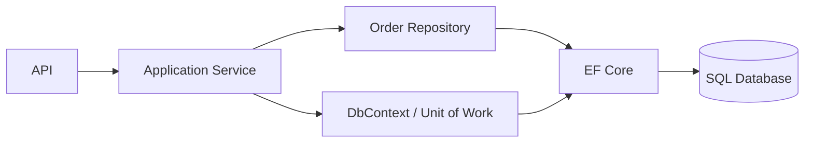
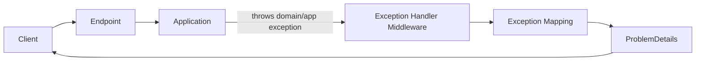
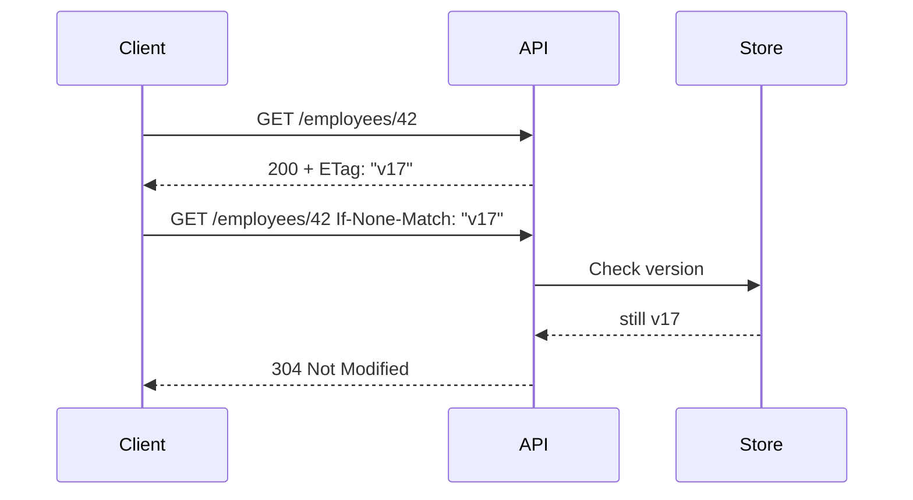
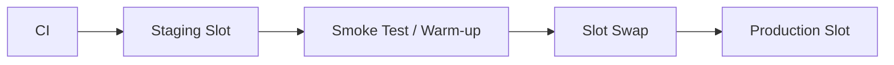
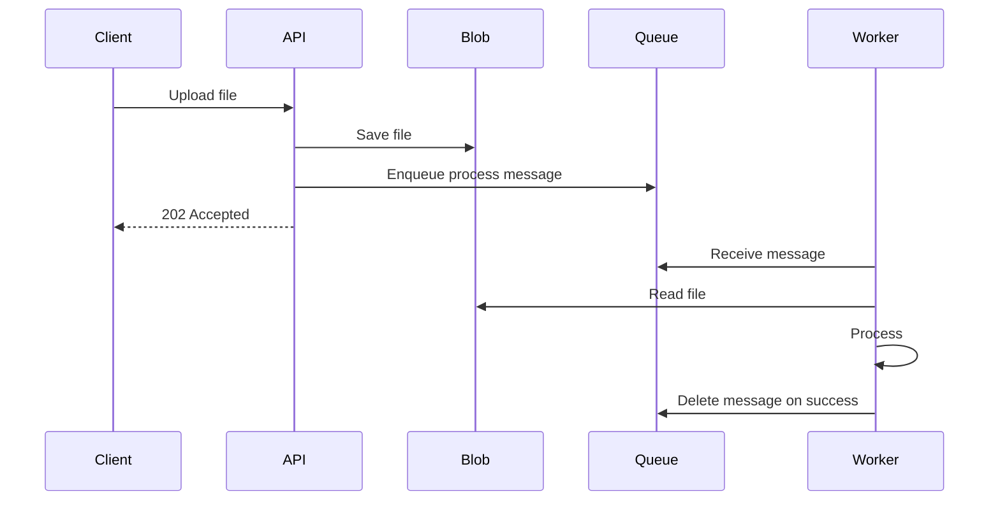
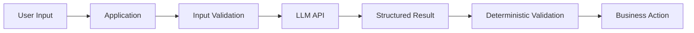
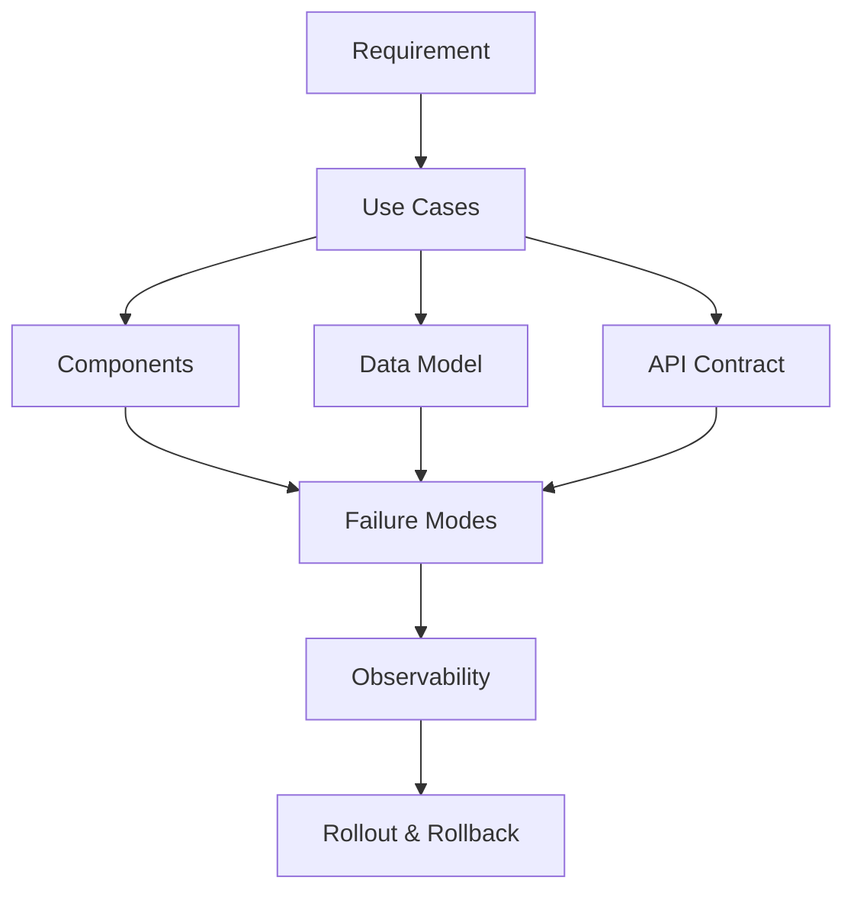
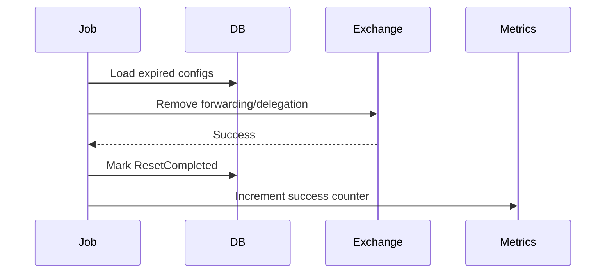

# Daily Knowledge Sharing — 17/08/2026

## Today’s Topics

1. Repository Pattern & Unit of Work — khi nào nên dùng với EF Core và khi nào không nên bọc thêm abstraction
2. Error Handling trong REST API — Problem Details, exception boundary và error contract ổn định
3. SQL Locking — shared/exclusive locks, blocking và cách chẩn đoán production contention
4. HTTP Caching — ETag, conditional request và giảm tải API mà không phá consistency
5. Azure App Service Deployment Slots — zero-downtime deployment, warm-up và rollback
6. Azure Storage Queue — background decoupling đơn giản và failure handling
7. SLI, SLO, SLA — biến “hệ thống phải ổn định” thành mục tiêu vận hành đo được
8. OpenAI/LLM API Integration — timeout, retries, structured boundary và deterministic orchestration
9. Production Release — release checklist, rollback và blast-radius control
10. Technical Design — từ requirement đến component/data/failure design có thể review

---

# 1. Repository Pattern & Unit of Work — khi nào nên dùng với EF Core và khi nào không nên bọc thêm abstraction

### 1. What is it?

Repository Pattern cung cấp một abstraction để application truy cập aggregate/entity như một collection thay vì thao tác trực tiếp với chi tiết persistence. Unit of Work đại diện cho một transaction boundary: gom nhiều thay đổi và commit chúng như một đơn vị.

Trong .NET hiện đại, `DbContext` của EF Core đã mang nhiều đặc tính của Unit of Work, còn `DbSet<TEntity>` đã gần với Repository. Vì vậy câu hỏi quan trọng không phải là “có nên luôn dùng Repository không?”, mà là “abstraction bổ sung có tạo giá trị thật hay chỉ bọc EF Core thêm một lớp?”.

### 2. Why does it exist?

Nếu business layer phụ thuộc trực tiếp vào query persistence chi tiết ở mọi nơi, code dễ bị phân tán và transaction boundary khó kiểm soát.

Nhưng nếu tạo một generic repository kiểu `GetAll`, `Find`, `Add`, `Update`, `Delete` chỉ để che `DbSet`, ta thường mất những khả năng mạnh của EF Core như LINQ composition, projection, include có kiểm soát và query optimization.

### 3. How does it work?

Một boundary hợp lý thường là repository theo aggregate/use case thay vì generic CRUD:



Repository chịu trách nhiệm truy vấn aggregate đúng cách. Application service quyết định transaction boundary. `DbContext.SaveChangesAsync()` là điểm commit.

### 4. Practical example

```csharp
public interface IOrderRepository
{
    Task<Order?> GetForUpdateAsync(Guid id, CancellationToken ct);
    void Add(Order order);
}

public sealed class EfOrderRepository : IOrderRepository
{
    private readonly AppDbContext _db;

    public EfOrderRepository(AppDbContext db) => _db = db;

    public Task<Order?> GetForUpdateAsync(Guid id, CancellationToken ct) =>
        _db.Orders
            .Include(x => x.Items)
            .SingleOrDefaultAsync(x => x.Id == id, ct);

    public void Add(Order order) => _db.Orders.Add(order);
}

public sealed class ConfirmOrderHandler
{
    private readonly IOrderRepository _orders;
    private readonly AppDbContext _db;

    public ConfirmOrderHandler(IOrderRepository orders, AppDbContext db)
    {
        _orders = orders;
        _db = db;
    }

    public async Task Handle(Guid orderId, CancellationToken ct)
    {
        var order = await _orders.GetForUpdateAsync(orderId, ct)
            ?? throw new InvalidOperationException("Order not found");

        order.Confirm();
        await _db.SaveChangesAsync(ct);
    }
}
```

Ở đây repository không expose `IQueryable` một cách vô kiểm soát, nhưng cũng không ép mọi query vào generic CRUD.

### 5. Real production scenario

Trong hệ thống employee management, aggregate `EmployeeOffboarding` có nhiều bảng liên quan. Nếu mỗi handler tự viết `Include` khác nhau, có nơi quên load mail configuration hoặc history, dẫn đến business rule chạy thiếu dữ liệu. Một repository chuyên biệt giúp chuẩn hóa cách load aggregate cho các use case write.

Ngược lại, màn hình reporting chỉ cần projection read-only. Dùng trực tiếp EF Core query service có thể đơn giản và hiệu quả hơn ép qua repository domain.

### 6. Common mistakes

- Tạo generic repository cho mọi entity chỉ vì “architecture chuẩn phải có repository”.
- Repository trả `IEnumerable` rồi load toàn bộ dữ liệu trước khi filter.
- Repository che mất `CancellationToken`, pagination hoặc projection.
- Mỗi repository tự `SaveChangesAsync()`, làm transaction boundary bị chia nhỏ.
- Repository dùng chung cho cả read model phức tạp và aggregate write model.
- Unit of Work abstraction chỉ gọi đúng một dòng `_db.SaveChangesAsync()` nhưng không thêm semantics nào.

### 7. Trade-offs

**Advantages**

- Boundary persistence rõ hơn.
- Có thể chuẩn hóa cách load aggregate.
- Dễ test business flow khi abstraction có ý nghĩa.
- Transaction ownership rõ nếu UoW được thiết kế đúng.

**Costs / Risks**

- Thêm boilerplate.
- Generic abstraction dễ làm giảm sức mạnh EF Core.
- Có thể tạo “abstraction leak” khi nhu cầu query ngày càng phức tạp.

### 8. Junior → Middle → Senior understanding

**Junior**

Hiểu repository không chỉ là class CRUD và `DbContext` đã có vai trò Unit of Work.

**Middle**

Biết tách read/write query hợp lý, kiểm soát tracking, projection và transaction boundary.

**Senior / Technical Lead**

Đánh giá liệu abstraction có giảm coupling thực sự hay chỉ tạo ceremony; xác định aggregate boundary, query ownership và consistency boundary.

### 9. Key takeaway

- Đừng bọc EF Core chỉ để “đúng pattern”.
- Repository có giá trị khi nó thể hiện domain/query semantics thực.
- Transaction boundary nên do use case/application layer kiểm soát.

---

# 2. Error Handling trong REST API — Problem Details, exception boundary và error contract ổn định

### 1. What is it?

Error handling trong API là cách hệ thống chuyển lỗi nội bộ thành HTTP response có cấu trúc, nhất quán và đủ thông tin cho client xử lý mà không làm lộ implementation detail.

Một error contract tốt thường chứa status code, error type/code, message an toàn, trace/correlation ID và validation details khi cần.

### 2. Why does it exist?

Nếu mỗi controller tự `try/catch` và trả string khác nhau, client phải xử lý hàng chục format lỗi. Khi exception stack trace bị trả trực tiếp, ta còn tạo security risk.

Naive approach cũng dễ biến mọi lỗi thành `500`, kể cả validation, not found hay conflict.

### 3. How does it work?



Application code ném exception có semantics rõ; boundary HTTP mapping chúng sang status code thích hợp.

### 4. Practical example

```csharp
builder.Services.AddProblemDetails();

app.UseExceptionHandler(exceptionHandlerApp =>
{
    exceptionHandlerApp.Run(async context =>
    {
        var feature = context.Features.Get<IExceptionHandlerFeature>();
        var exception = feature?.Error;

        var (status, title) = exception switch
        {
            KeyNotFoundException => (StatusCodes.Status404NotFound, "Resource not found"),
            ValidationException => (StatusCodes.Status400BadRequest, "Validation failed"),
            DbUpdateConcurrencyException => (StatusCodes.Status409Conflict, "Concurrency conflict"),
            _ => (StatusCodes.Status500InternalServerError, "Unexpected server error")
        };

        context.Response.StatusCode = status;
        await Results.Problem(
            statusCode: status,
            title: title,
            extensions: new Dictionary<string, object?>
            {
                ["traceId"] = context.TraceIdentifier
            }).ExecuteAsync(context);
    });
});
```

Production implementation có thể dùng custom exception hierarchy hoặc result type thay vì exception cho mọi flow.

### 5. Real production scenario

Một mobile app gọi API approve timesheet. Nếu record đã được người khác approve trước, backend nên trả `409 Conflict` với error code ổn định như `timesheet.already_approved`. Client có thể hiển thị thông báo phù hợp thay vì coi đó là lỗi mạng chung.

### 6. Common mistakes

- Trả exception message/stack trace cho client.
- Mỗi endpoint có format lỗi khác nhau.
- Dùng `200 OK` rồi nhét `success=false` cho mọi lỗi.
- Trả `500` cho validation hoặc business conflict.
- Log cùng một exception nhiều lần ở nhiều layer.
- Không có correlation/trace ID.
- Dùng exception cho flow bình thường với volume cực lớn mà không cân nhắc cost.

### 7. Trade-offs

**Advantages**

- Client dễ tích hợp.
- Monitoring và troubleshooting nhất quán.
- Giảm leak thông tin nội bộ.

**Costs / Risks**

- Cần governance cho error code.
- Mapping exception phức tạp nếu hierarchy thiếu kiểm soát.
- Có thể overengineer nếu mọi lỗi nhỏ đều tạo class riêng.

### 8. Junior → Middle → Senior understanding

**Junior**

Hiểu khác nhau giữa 400, 404, 409, 401, 403 và 500.

**Middle**

Biết centralize error handling, Problem Details, validation errors và logging correlation.

**Senior / Technical Lead**

Thiết kế error taxonomy, backward compatibility, observability và ranh giới giữa result type, domain error và exception.

### 9. Key takeaway

- Error response là API contract, không phải chi tiết phụ.
- Centralize exception-to-HTTP mapping.
- Không để lỗi nội bộ rò rỉ ra client.

---

# 3. SQL Locking — shared/exclusive locks, blocking và cách chẩn đoán production contention

### 1. What is it?

Lock là cơ chế database dùng để bảo vệ tính nhất quán khi nhiều transaction truy cập cùng dữ liệu. Shared lock thường phục vụ read; exclusive lock bảo vệ write. Khi một transaction giữ lock mà transaction khác cần lock xung đột, transaction thứ hai phải chờ: đó là blocking.

Blocking không đồng nghĩa deadlock. Deadlock là vòng chờ lẫn nhau và database phải chọn một transaction làm victim.

### 2. Why does it exist?

Nếu không có concurrency control, hai transaction có thể ghi đè nhau hoặc đọc trạng thái không hợp lệ. Locking là một trong các cơ chế đảm bảo isolation.

Vấn đề là transaction dài hoặc query scan nhiều row có thể giữ nhiều lock và làm throughput giảm mạnh.

### 3. How does it work?

```text
Transaction A: UPDATE Orders WHERE Id = 10
               └─ giữ Exclusive Lock trên row/page liên quan

Transaction B: SELECT/UPDATE Orders WHERE Id = 10
               └─ phải chờ nếu isolation/lock mode xung đột
```

Query càng rộng, càng lâu, lock footprint càng lớn.

### 4. Practical example

Problematic transaction:

```sql
BEGIN TRANSACTION;

UPDATE Orders
SET Status = 'Processing'
WHERE CustomerId = @CustomerId;

-- External API call happens here for 8 seconds

UPDATE Customers
SET LastProcessedAt = SYSUTCDATETIME()
WHERE Id = @CustomerId;

COMMIT;
```

Sai lầm là giữ SQL transaction trong lúc gọi external API.

Cải thiện: transaction chỉ bao thao tác database cần atomicity; external call thực hiện ngoài transaction hoặc dùng outbox/workflow.

### 5. Real production scenario

Một Hangfire job xử lý 5.000 employee trong một transaction. Trong thời gian job chạy, portal update employee bị block. CPU database không cao nhưng API timeout hàng loạt. Root cause không phải “database chậm” mà là lock duration và transaction scope.

### 6. Common mistakes

- Giữ transaction trong lúc HTTP call.
- Update batch quá lớn trong một transaction.
- Thiếu index làm query scan và lock nhiều row hơn.
- Tăng timeout thay vì xử lý blocking root cause.
- Nhầm blocking với deadlock.
- Dùng `NOLOCK` như thuốc chữa mọi performance issue.
- Không thống nhất thứ tự update các bảng trong nhiều code path.

### 7. Trade-offs

**Advantages**

- Bảo vệ consistency.
- Transaction semantics dễ reasoning hơn eventual consistency trong một database.

**Costs / Risks**

- Contention.
- Reduced concurrency.
- Deadlock/timeout nếu transaction boundary kém.

### 8. Junior → Middle → Senior understanding

**Junior**

Hiểu write có thể block request khác và transaction không nên kéo dài tùy ý.

**Middle**

Biết xem blocking session, execution plan, index và transaction scope.

**Senior / Technical Lead**

Thiết kế access pattern, isolation level, batching và consistency boundary để giảm contention ở scale lớn.

### 9. Key takeaway

- Transaction càng dài, lock risk càng lớn.
- Query/index design ảnh hưởng trực tiếp lock footprint.
- Không gọi external service bên trong DB transaction nếu không thật sự cần.

---

# 4. HTTP Caching — ETag, conditional request và giảm tải API mà không phá consistency

### 1. What is it?

HTTP caching cho phép browser, proxy hoặc client reuse response thay vì luôn tải lại toàn bộ payload. ETag là một validator đại diện cho version của resource. Client gửi `If-None-Match`; server trả `304 Not Modified` nếu resource chưa đổi.

### 2. Why does it exist?

Nhiều API GET trả dữ liệu ít thay đổi nhưng bị gọi thường xuyên. Nếu mỗi lần đều query DB và serialize JSON lớn, ta lãng phí CPU, bandwidth và database capacity.

Cache phía HTTP khác Redis: nó tận dụng semantics của protocol và có thể giảm cả response body truyền qua network.

### 3. How does it work?



Client giữ body cũ và không cần tải lại payload.

### 4. Practical example

```csharp
app.MapGet("/products/{id:guid}", async (
    Guid id,
    AppDbContext db,
    HttpContext http,
    CancellationToken ct) =>
{
    var item = await db.Products
        .AsNoTracking()
        .Where(x => x.Id == id)
        .Select(x => new { x.Id, x.Name, x.Price, x.RowVersion })
        .SingleOrDefaultAsync(ct);

    if (item is null)
        return Results.NotFound();

    var etag = $"\"{Convert.ToBase64String(item.RowVersion)}\"";

    if (http.Request.Headers.IfNoneMatch == etag)
        return Results.StatusCode(StatusCodes.Status304NotModified);

    http.Response.Headers.ETag = etag;
    return Results.Ok(item);
});
```

### 5. Real production scenario

Mobile app tải employee profile mỗi lần mở màn hình. Profile chỉ đổi vài lần mỗi tháng. ETag giúp client kiểm tra nhanh và tránh tải lại avatar metadata/profile payload nếu version không đổi.

### 6. Common mistakes

- Gắn cache header cho dữ liệu user-specific nhưng quên `private`/authorization implications.
- Dùng TTL dài cho dữ liệu cần freshness cao.
- ETag không thay đổi khi representation thay đổi.
- Cache response chứa PII ở shared proxy.
- Không phân biệt `Cache-Control`, ETag và server-side Redis cache.

### 7. Trade-offs

**Advantages**

- Giảm bandwidth.
- Giảm serialization và backend load.
- Tận dụng chuẩn HTTP có sẵn.

**Costs / Risks**

- Cache semantics phức tạp.
- Security/privacy risk nếu cache scope sai.
- Validation vẫn có thể cần backend lookup.

### 8. Junior → Middle → Senior understanding

**Junior**

Hiểu `304` nghĩa là client dùng bản đã có.

**Middle**

Biết ETag, `If-None-Match`, `Cache-Control` và invalidation semantics.

**Senior / Technical Lead**

Đánh giá cacheability theo data sensitivity, freshness SLO, CDN/proxy behavior và distributed invalidation.

### 9. Key takeaway

- HTTP caching không giống Redis nhưng có thể giảm tải rất hiệu quả.
- Validator tốt giúp giữ freshness mà vẫn tiết kiệm bandwidth.
- Không cache shared dữ liệu nhạy cảm nếu chưa hiểu scope.

---

# 5. Azure App Service Deployment Slots — zero-downtime deployment, warm-up và rollback

### 1. What is it?

Deployment Slot là môi trường deployment riêng trong cùng App Service, ví dụ `production` và `staging`. Ta deploy version mới vào staging, kiểm tra/warm-up rồi swap traffic sang production.

### 2. Why does it exist?

Deploy trực tiếp lên production có thể gây cold start, lỗi config hoặc version hỏng ngay lập tức ảnh hưởng toàn bộ user. Slot giúp giảm blast radius và hỗ trợ rollback nhanh bằng swap ngược.

### 3. How does it work?



Một số app settings có thể đánh dấu “slot setting” để không bị swap, ví dụ environment-specific secrets/config.

### 4. Practical example

ASP.NET Core health endpoint:

```csharp
builder.Services.AddHealthChecks()
    .AddDbContextCheck<AppDbContext>();

app.MapHealthChecks("/health/ready");
```

Pipeline có thể deploy staging, gọi `/health/ready`, chạy smoke test, sau đó mới swap.

### 5. Real production scenario

Một API release có migration backward-compatible và code mới. Team deploy staging, warm JIT/cache, gọi synthetic requests rồi swap. Nếu error rate tăng sau swap, có thể swap trở lại slot trước trong vài phút.

### 6. Common mistakes

- Database migration breaking được chạy trước khi old code ngừng phục vụ.
- Không phân biệt slot-specific config.
- Smoke test chỉ check HTTP 200 mà không kiểm tra dependency thật.
- Không warm-up endpoint quan trọng.
- Swap xong mới phát hiện secrets/config sai.
- Coi slot swap là thay thế hoàn toàn cho canary.

### 7. Trade-offs

**Advantages**

- Giảm downtime.
- Rollback nhanh.
- Cho phép pre-production validation gần production.

**Costs / Risks**

- Tăng complexity config.
- Database vẫn là shared dependency nên migration cần chiến lược riêng.
- Một số pricing tier/capacity considerations cần tính toán.

### 8. Junior → Middle → Senior understanding

**Junior**

Hiểu staging slot là môi trường chạy version mới trước production.

**Middle**

Biết deploy, health check, slot settings và swap.

**Senior / Technical Lead**

Thiết kế backward-compatible migration, rollback, warm-up, observability gate và release policy.

### 9. Key takeaway

- Zero-downtime deployment cần cả app strategy và DB compatibility.
- Slot giúp giảm rủi ro nhưng không tự động giải quyết mọi release problem.
- Luôn có smoke test và rollback plan.

---

# 6. Azure Storage Queue — background decoupling đơn giản và failure handling

### 1. What is it?

Azure Storage Queue là managed message queue đơn giản để tách producer khỏi background consumer. Producer ghi message rồi trả response; worker xử lý sau.

Nó phù hợp workload không cần các capability messaging nâng cao như topic/subscription, sessions hay rich routing.

### 2. Why does it exist?

Nếu API gửi email, resize file hoặc gọi external service ngay trong request, latency và failure của dependency bị truyền trực tiếp sang user. Queue giúp chuyển công việc dài sang asynchronous processing.

### 3. How does it work?



Message được ẩn trong visibility timeout khi worker nhận. Nếu worker chết trước khi delete, message xuất hiện lại để retry.

### 4. Practical example

```csharp
var queue = new QueueClient(connectionString, "file-processing");
await queue.CreateIfNotExistsAsync(cancellationToken: ct);

var payload = JsonSerializer.Serialize(new
{
    FileId = file.Id,
    BlobName = file.BlobName
});

await queue.SendMessageAsync(
    Convert.ToBase64String(Encoding.UTF8.GetBytes(payload)),
    cancellationToken: ct);
```

Consumer phải xử lý duplicate message an toàn.

### 5. Real production scenario

Một HR system import Excel 50.000 employee. API chỉ upload file và enqueue job. Worker parse từng batch, ghi progress và retry lỗi tạm thời. User không phải giữ HTTP request hàng phút.

### 6. Common mistakes

- Giả định message chỉ được deliver đúng một lần.
- Không thiết kế idempotency.
- Visibility timeout ngắn hơn thời gian xử lý.
- Message payload chứa dữ liệu lớn thay vì lưu blob rồi gửi reference.
- Không có poison-message handling.
- Không monitor queue depth và oldest-message age.

### 7. Trade-offs

**Advantages**

- Đơn giản, rẻ, dễ vận hành.
- Tách request khỏi background work.
- Tự nhiên hỗ trợ retry bằng visibility timeout.

**Costs / Risks**

- Ít capability hơn Service Bus.
- Ordering và advanced routing hạn chế.
- Consumer phải tự xử lý idempotency và poison message.

### 8. Junior → Middle → Senior understanding

**Junior**

Hiểu producer enqueue, worker consume.

**Middle**

Biết visibility timeout, retry, idempotency và poison handling.

**Senior / Technical Lead**

Biết khi nào Storage Queue đủ tốt và khi nào cần Service Bus; thiết kế throughput, backpressure và recovery.

### 9. Key takeaway

- Queue giảm coupling thời gian giữa request và background processing.
- At-least-once delivery nghĩa là duplicate phải được dự kiến.
- Chọn Storage Queue khi simplicity quan trọng hơn messaging feature phong phú.

---

# 7. SLI, SLO, SLA — biến “hệ thống phải ổn định” thành mục tiêu vận hành đo được

### 1. What is it?

SLI là chỉ số đo reliability, ví dụ success rate hoặc latency.

SLO là mục tiêu nội bộ cho SLI, ví dụ 99.9% request thành công trong 30 ngày.

SLA là cam kết chính thức với khách hàng, thường gắn hậu quả thương mại nếu vi phạm.

### 2. Why does it exist?

“API phải nhanh” hay “service phải ổn định” không đủ để quyết định engineering trade-off. SLO tạo target cụ thể để biết khi nào nên ưu tiên reliability thay vì feature velocity.

### 3. How does it work?

Ví dụ availability SLI:

```text
SLI = successful_requests / valid_requests
```

Nếu SLO là 99.9% trong 30 ngày, error budget xấp xỉ 0.1%. Team có thể dùng error budget để quyết định có tiếp tục release nhanh hay tập trung reliability.

### 4. Practical example

Một API có 10.000.000 request/tháng và SLO 99.9%.

Error budget là khoảng:

```text
10,000,000 × 0.001 = 10,000 failed requests
```

Nếu mới nửa tháng đã dùng 9.000 lỗi, release policy nên thận trọng hơn.

### 5. Real production scenario

Timesheet API có dashboard không critical bằng endpoint submit timesheet cuối tháng. Có thể đặt SLO khác nhau theo user journey thay vì một SLO chung cho toàn hệ thống.

### 6. Common mistakes

- Dùng CPU làm SLI cho user experience.
- Đặt SLO 100% không thực tế.
- Đo tất cả 5xx nhưng không loại request invalid do client.
- Có dashboard SLO nhưng không gắn với release/incident decision.
- SLA nội bộ bị nhầm với SLO.

### 7. Trade-offs

**Advantages**

- Reliability có thể đo và quản lý.
- Ưu tiên engineering dựa trên dữ liệu.
- Giúp cân bằng velocity và stability.

**Costs / Risks**

- Chọn SLI sai sẽ tối ưu sai thứ.
- Telemetry/aggregation cần đáng tin cậy.
- SLO quá nghiêm làm cost tăng không cần thiết.

### 8. Junior → Middle → Senior understanding

**Junior**

Hiểu SLI là cái đo, SLO là mục tiêu, SLA là cam kết.

**Middle**

Biết xây metric và dashboard cho availability/latency.

**Senior / Technical Lead**

Thiết kế SLO theo critical user journey, error budget policy và liên kết với release/incident management.

### 9. Key takeaway

- Reliability phải được định lượng.
- SLO nên phản ánh user experience thực.
- 100% uptime thường là mục tiêu kém thực tế và rất đắt.

---

# 8. OpenAI/LLM API Integration — timeout, retries, structured boundary và deterministic orchestration

### 1. What is it?

LLM API integration là việc gọi model từ application nhưng giữ control flow, validation, timeout, authorization và side effect trong deterministic code.

Model nên xử lý ngôn ngữ/suy luận; application phải kiểm soát những gì có hậu quả thực.

### 2. Why does it exist?

Naive implementation thường gửi prompt rồi lấy text trả thẳng cho downstream logic. Điều này dễ vỡ vì output không ổn định, latency biến động và model có thể hallucinate.

Production integration cần coi LLM như external dependency không deterministic.

### 3. How does it work?



LLM không trực tiếp ghi database hay gửi email trừ khi application cấp tool rõ ràng và kiểm soát execution.

### 4. Practical example

```csharp
public sealed record ClassificationResult(
    string Category,
    double Confidence);

public async Task<ClassificationResult> ClassifyAsync(
    string text,
    CancellationToken ct)
{
    using var timeoutCts = CancellationTokenSource
        .CreateLinkedTokenSource(ct);
    timeoutCts.CancelAfter(TimeSpan.FromSeconds(8));

    var result = await _llmClient.ClassifyAsync(text, timeoutCts.Token);

    var allowed = new[] { "bug", "feature", "question" };
    if (!allowed.Contains(result.Category, StringComparer.OrdinalIgnoreCase))
        throw new ValidationException("Unexpected model category");

    return result;
}
```

Business action phía sau chỉ chạy khi deterministic validation pass.

### 5. Real production scenario

Support assistant phân loại ticket thành bug/feature/question. Model có thể đề xuất severity nhưng rule deterministic vẫn áp dụng: production outage luôn ít nhất `High` dù model đánh giá thấp hơn.

### 6. Common mistakes

- Retry mọi request vô hạn khi model timeout.
- Không có token/cost budget.
- Tin raw text output để chạy logic quan trọng.
- Đưa secret/PII vào prompt không kiểm soát.
- Cho model gọi destructive tool không approval.
- Không log latency, model errors và structured validation failures.

### 7. Trade-offs

**Advantages**

- Xử lý natural language linh hoạt.
- Tự động hóa các tác vụ khó viết rule thủ công.

**Costs / Risks**

- Latency và cost biến động.
- Output không hoàn toàn deterministic.
- Cần security, evaluation và fallback.

### 8. Junior → Middle → Senior understanding

**Junior**

Hiểu LLM là external dependency và output cần validate.

**Middle**

Biết timeout, retry có giới hạn, structured parsing, logging và fallback.

**Senior / Technical Lead**

Thiết kế control boundary giữa probabilistic reasoning và deterministic execution; quản lý cost, privacy, evaluation và failure recovery.

### 9. Key takeaway

- Đừng để model quyết định và thực thi side effect mà không guardrail.
- Structured boundary giúp giảm lỗi downstream.
- LLM integration cần observability giống mọi external dependency khác.

---

# 9. Production Release — release checklist, rollback và blast-radius control

### 1. What is it?

Production Release là toàn bộ quá trình đưa thay đổi vào môi trường thật một cách có kiểm soát: readiness check, deployment, validation, monitoring và rollback.

Deployment chỉ là một bước kỹ thuật; release bao gồm cả quyết định business và operational safety.

### 2. Why does it exist?

Build pass không đảm bảo production an toàn. Khác biệt config, dữ liệu thật, traffic thật và dependency thật có thể tạo lỗi chỉ xuất hiện sau release.

### 3. How does it work?

Một flow tốt:

```text
Code complete
→ automated tests
→ migration compatibility check
→ deployment
→ health/smoke test
→ limited exposure
→ monitor key metrics
→ expand traffic
→ close release
```

Rollback phải được chuẩn bị trước, không phải nghĩ ra khi incident đã xảy ra.

### 4. Practical example

Release checklist cho ASP.NET Core API:

```text
[ ] Database migration backward-compatible
[ ] Secrets/config validated
[ ] Health checks green
[ ] Error rate baseline captured
[ ] p95 latency baseline captured
[ ] Rollback artifact identified
[ ] Feature flag default confirmed
[ ] On-call owner aware
```

### 5. Real production scenario

Một release thêm cột `NOT NULL` vào bảng lớn và code mới phụ thuộc cột đó. Nếu migration lock bảng lâu, toàn hệ thống bị ảnh hưởng. Better approach là expand-contract: thêm nullable/default trước, deploy code compatible, backfill, sau đó mới enforce constraint.

### 6. Common mistakes

- Không có rollback plan.
- Rollback code nhưng database schema không backward-compatible.
- Chỉ nhìn CPU sau release.
- Deploy toàn bộ traffic ngay lập tức cho thay đổi risk cao.
- Không có owner quyết định rollback.
- Feature flag tồn tại nhưng không được test trạng thái OFF.

### 7. Trade-offs

**Advantages**

- Giảm blast radius.
- Phát hiện regression sớm.
- Rollback nhanh hơn.

**Costs / Risks**

- Release process phức tạp hơn.
- Cần observability và automation tốt.
- Quá nhiều gate có thể làm delivery chậm nếu áp dụng cứng nhắc.

### 8. Junior → Middle → Senior understanding

**Junior**

Hiểu deploy xong chưa có nghĩa release thành công.

**Middle**

Biết smoke test, rollback, migration compatibility và monitor sau deploy.

**Senior / Technical Lead**

Thiết kế progressive delivery, release policy theo risk, blast radius và incident decision criteria.

### 9. Key takeaway

- Rollback phải được thiết kế trước release.
- Database compatibility là phần quan trọng nhất của zero-downtime release.
- Monitor user-facing signals sau deploy, không chỉ infrastructure metrics.

---

# 10. Technical Design — từ requirement đến component/data/failure design có thể review

### 1. What is it?

Technical Design là bước chuyển requirement thành một thiết kế có thể implement và review: component responsibilities, data model, API contract, sequence flow, security, failure mode, observability và rollout.

Nó không phải tài liệu dài để “đủ quy trình”; mục tiêu là làm rõ những quyết định khó trước khi code lan rộng.

### 2. Why does it exist?

Nếu team bắt đầu code khi boundary chưa rõ, thường xuất hiện duplicated logic, transaction sai, API contract đổi liên tục và production failure path bị bỏ quên.

Một design review tốt giúp phát hiện vấn đề rẻ hơn nhiều so với sau deployment.

### 3. How does it work?



Design nên tập trung vào decision và trade-off, không chỉ vẽ box.

### 4. Practical example

Feature: “Tự động reset forwarding khi EndTime hết hạn.”

Technical design cần trả lời:

```text
Trigger: Hangfire recurring job mỗi ngày hay event-driven timer?
Query: lấy config nào đã expired và chưa reset?
Concurrency: hai worker chạy trùng thì sao?
Idempotency: reset Exchange hai lần có an toàn không?
Transaction: update DB trước hay sau Exchange call?
Retry: transient Exchange failure xử lý thế nào?
Observability: log/counter nào xác nhận job thành công?
Security: credential/Managed Identity nào gọi external service?
```

Một sequence hữu ích:



Nếu Exchange fail, DB không được đánh dấu completed.

### 5. Real production scenario

Một feature Microsoft 365 integration tưởng đơn giản nhưng có throttling, eventual consistency, permission boundary và retry. Nếu technical design chỉ ghi “call Graph/PowerShell API” thì implementation sẽ phát hiện quá muộn các vấn đề về rate limit, idempotency và recovery.

### 6. Common mistakes

- Design doc chỉ mô tả happy path.
- Vẽ architecture diagram nhưng không định nghĩa ownership.
- Không ghi assumptions.
- Không xem xét migration/rollout.
- Không định nghĩa measurable success/failure.
- Thiết kế quá chi tiết class-level trước khi boundary chính ổn định.
- Không ghi alternative đã cân nhắc và lý do loại bỏ.

### 7. Trade-offs

**Advantages**

- Giảm rework.
- Tạo shared understanding.
- Phát hiện failure/security/scalability issue sớm.

**Costs / Risks**

- Tốn thời gian upfront.
- Design có thể stale nếu không cập nhật theo implementation.
- Quá nhiều tài liệu làm chậm thay đổi nhỏ.

### 8. Junior → Middle → Senior understanding

**Junior**

Biết đọc flow, API contract và data model trước khi implement.

**Middle**

Biết đề xuất component/data/error flow và đánh giá implementation impact.

**Senior / Technical Lead**

Phải dẫn dắt trade-off, failure-mode analysis, migration, observability, rollout và đảm bảo design phù hợp business constraints.

### 9. Key takeaway

- Technical design tốt làm rõ decision khó, không phải tạo tài liệu đẹp.
- Failure path, migration và observability phải xuất hiện trước coding.
- Design review giúp giảm chi phí sửa sai ở production.