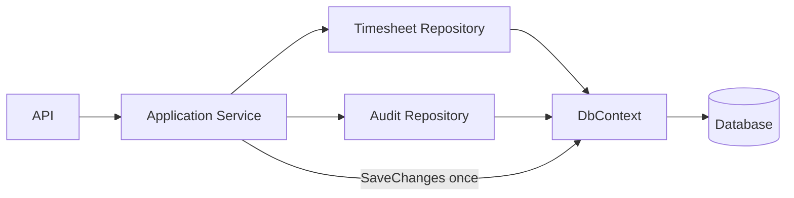
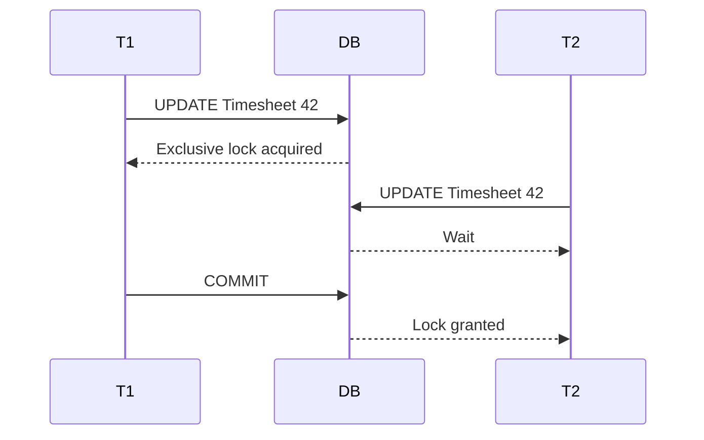
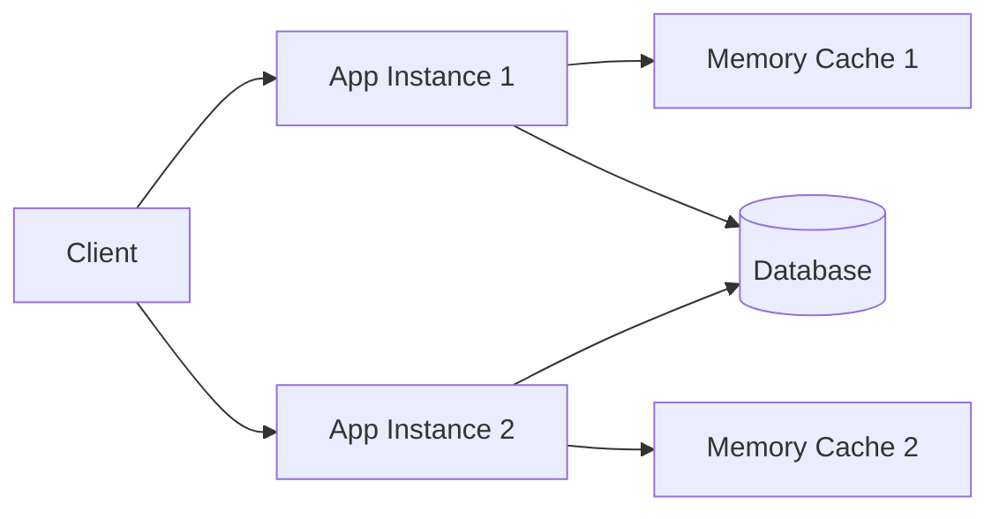
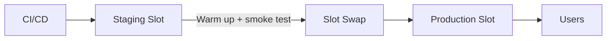
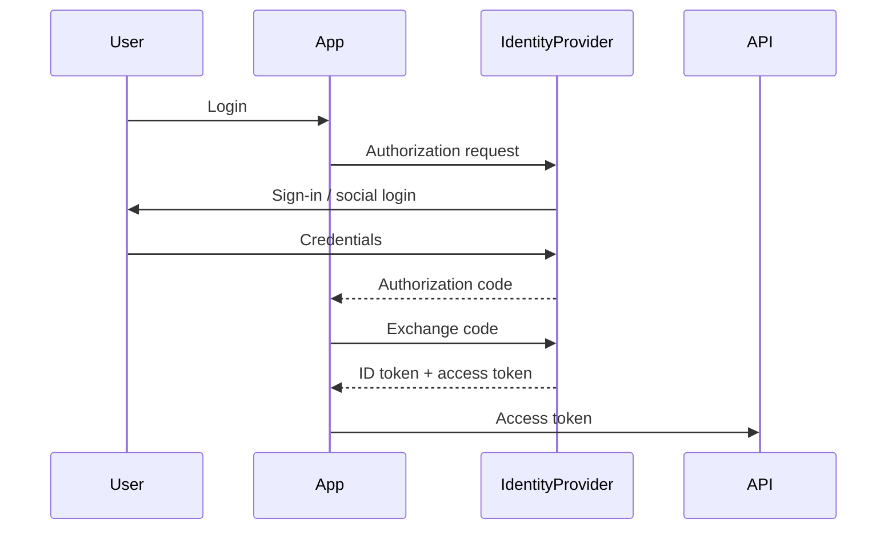
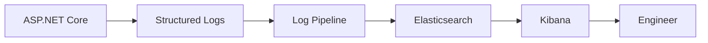
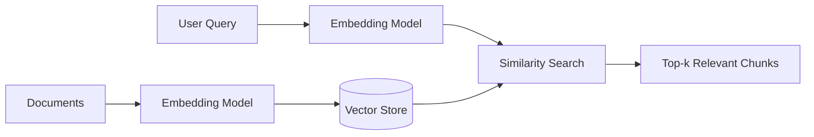

# Daily Knowledge Sharing — 17/08/2026

## Today’s Topics

1. Unit of Work — transaction boundary thật sự trong EF Core
2. API Versioning — backward compatibility thay vì chỉ đổi URL
3. PostgreSQL Query Planning — đọc execution plan để tối ưu đúng bottleneck
4. Database Locking — hiểu lock scope trước khi đổ lỗi cho “DB chậm”
5. In-memory Cache — nhanh nhưng không phải distributed truth
6. Azure App Service Deployment Slots — zero-downtime release thực tế
7. Azure AD B2C / External Identity — consumer identity khác workforce identity thế nào
8. Kibana + Elasticsearch — điều tra incident từ structured logs
9. Embeddings — biến semantic meaning thành dữ liệu có thể search
10. Kanban & WIP Limits — tối ưu flow thay vì tối đa số task đang làm

---

# 1. Unit of Work — transaction boundary thật sự trong EF Core

### 1. What is it?

Unit of Work (UoW) là một pattern gom nhiều thay đổi liên quan thành một transaction boundary logic: hoặc toàn bộ thay đổi được commit, hoặc không thay đổi nào được xem là hoàn tất.

Trong EF Core, `DbContext` vốn đã mang nhiều đặc tính của Unit of Work: nó theo dõi entity state, gom thay đổi và `SaveChangesAsync()` phát sinh một database transaction cho một lần save khi cần.

Điểm quan trọng là không nên hiểu Unit of Work chỉ là “tạo interface `IUnitOfWork` rồi bọc `DbContext`”. Ý nghĩa thật nằm ở việc xác định **business operation nào phải atomic**.

### 2. Why does it exist?

Giả sử một API approve timesheet cần:

- cập nhật trạng thái timesheet;
- thêm audit record;
- cập nhật approval history.

Nếu từng bước tự `SaveChanges()` riêng, lỗi ở bước cuối có thể khiến dữ liệu ở trạng thái nửa thành công.

Naive solution thường là repository nào cũng tự save, khiến transaction boundary bị phân tán và khó reason.

### 3. How does it work?



Application service điều phối business operation. Repository thêm/sửa entity vào cùng `DbContext`, còn commit diễn ra tại transaction boundary rõ ràng.

### 4. Practical example

```csharp
public async Task ApproveTimesheetAsync(
    Guid timesheetId,
    Guid approverId,
    CancellationToken ct)
{
    var timesheet = await _db.Timesheets
        .SingleAsync(x => x.Id == timesheetId, ct);

    timesheet.Approve(approverId, DateTimeOffset.UtcNow);

    _db.TimesheetApprovalHistories.Add(new TimesheetApprovalHistory
    {
        Id = Guid.NewGuid(),
        TimesheetId = timesheet.Id,
        ApproverId = approverId,
        Action = "Approved",
        CreatedAtUtc = DateTimeOffset.UtcNow
    });

    _db.AuditLogs.Add(new AuditLog
    {
        Id = Guid.NewGuid(),
        EntityType = "Timesheet",
        EntityId = timesheet.Id.ToString(),
        Action = "Approve",
        CreatedAtUtc = DateTimeOffset.UtcNow
    });

    await _db.SaveChangesAsync(ct);
}
```

Ba thay đổi cùng commit. Không cần ba lần `SaveChangesAsync()`.

Nếu có external API như Microsoft Graph, transaction SQL không thể rollback external side effect. Khi đó cần workflow/saga/outbox thay vì kéo external call vào transaction DB dài.

### 5. Real production scenario

Trong employee offboarding, cập nhật employee status và mail configuration trong cùng DB có thể là một Unit of Work. Nhưng thao tác Exchange Online không nằm trong cùng database transaction.

Thiết kế tốt có thể:

1. commit trạng thái `PendingMailAction`;
2. ghi outbox event;
3. background worker gọi Exchange;
4. cập nhật `Completed` hoặc `Failed` sau đó.

### 6. Common mistakes

- Mỗi repository tự gọi `SaveChanges()`.
- Giữ SQL transaction mở trong lúc gọi external HTTP API.
- Tạo `IUnitOfWork` chỉ để wrap `SaveChangesAsync()` nhưng không làm rõ boundary.
- Dùng một `DbContext` singleton.
- Catch exception rồi vẫn commit một phần thay đổi.
- Coi distributed operation là một local transaction.

### 7. Trade-offs

**Advantages**

- Atomicity rõ ràng.
- Business flow dễ reason và test hơn.
- Giảm partial persistence trong cùng database.

**Costs / Risks**

- Transaction quá dài làm tăng lock duration.
- Abstraction dư thừa có thể làm EF Core khó dùng hơn.
- Không giải quyết atomicity giữa nhiều service/resource.

### 8. Junior → Middle → Senior understanding

**Junior**

Hiểu `SaveChanges()` là điểm commit quan trọng và không nên gọi tùy tiện.

**Middle**

Biết đặt transaction boundary ở application/business operation, dùng explicit transaction khi thực sự cần.

**Senior / Technical Lead**

Phân biệt local transaction, distributed workflow, outbox, saga; đánh giá lock duration và consistency requirement.

### 9. Key takeaway

- Unit of Work là transaction boundary, không phải tên interface.
- EF Core `DbContext` đã cung cấp phần lớn cơ chế UoW.
- External side effect không nên bị nhét vào SQL transaction dài.

---

# 2. API Versioning — backward compatibility thay vì chỉ đổi URL

### 1. What is it?

API Versioning là chiến lược cho phép contract API tiến hóa mà không phá client đang dùng version cũ.

Version có thể đặt trong URL, header hoặc media type, nhưng vấn đề cốt lõi không phải cú pháp. Cốt lõi là **contract evolution** và **backward compatibility**.

### 2. Why does it exist?

Client mobile, web, partner integration và third-party system không thể nâng cấp đồng thời với backend.

Nếu API đổi từ:

```json
{ "fullName": "Ha Dinh" }
```

sang:

```json
{ "firstName": "Ha", "lastName": "Dinh" }
```

mà xóa `fullName`, client cũ có thể hỏng ngay.

### 3. How does it work?

```mermaid
flowchart LR
    C1[Client v1] --> V1[/api/v1/employees]
    C2[Client v2] --> V2[/api/v2/employees]
    V1 --> APP[Application Layer]
    V2 --> APP
    APP --> DB[(Database)]
```

Hai API contract có thể dùng chung application/domain logic nhưng mapping khác nhau.

### 4. Practical example

```csharp
[ApiController]
[Route("api/v1/employees")]
public sealed class EmployeesV1Controller : ControllerBase
{
    [HttpGet("{id:guid}")]
    public async Task<ActionResult<EmployeeV1Dto>> Get(Guid id, CancellationToken ct)
    {
        var employee = await _service.GetAsync(id, ct);
        return Ok(new EmployeeV1Dto(employee.Id, employee.FullName));
    }
}
```

Version mới:

```csharp
public sealed record EmployeeV2Dto(
    Guid Id,
    string FirstName,
    string LastName,
    string DisplayName);
```

Không nên duplicate toàn bộ business logic giữa version; chỉ khác contract và mapping khi có thể.

### 5. Real production scenario

Một mobile app version cũ vẫn tồn tại hàng tháng. Backend muốn thêm pagination mới hoặc thay đổi error model. Nếu hard break API cũ, người dùng chưa update app sẽ gặp lỗi.

Production strategy thường cần deprecation window, usage telemetry và deadline rõ ràng trước khi retire version.

### 6. Common mistakes

- Version mỗi thay đổi nhỏ.
- Duplicate toàn bộ service logic giữa v1/v2.
- Không đo client nào còn dùng version cũ.
- Đổi semantic behavior nhưng giữ cùng version mà không đánh giá compatibility.
- Version database schema thay vì version external contract.
- Không có deprecation policy.

### 7. Trade-offs

**Advantages**

- Client migration an toàn hơn.
- Cho phép backend tiến hóa có kiểm soát.

**Costs / Risks**

- Nhiều version làm tăng test/support cost.
- Bug fix có thể phải backport.
- Contract drift dễ xảy ra nếu duy trì quá lâu.

### 8. Junior → Middle → Senior understanding

**Junior**

Hiểu breaking change là gì và vì sao client cũ có thể hỏng.

**Middle**

Biết mapping contract theo version, test compatibility, quản lý deprecation.

**Senior / Technical Lead**

Quyết định versioning strategy, support window, migration path và observability usage.

### 9. Key takeaway

- Versioning giải quyết contract evolution, không chỉ URL naming.
- Không phải thay đổi nào cũng cần version mới.
- Deprecation phải có telemetry và kế hoạch retire.

---

# 3. PostgreSQL Query Planning — đọc execution plan để tối ưu đúng bottleneck

### 1. What is it?

PostgreSQL Query Planner chọn cách thực thi SQL: sequential scan, index scan, bitmap scan, join order, nested loop, hash join hay merge join.

Developer viết SQL mô tả **muốn dữ liệu gì**; planner quyết định **lấy dữ liệu bằng cách nào**.

### 2. Why does it exist?

Hai query giống về business intent có thể có execution cost rất khác. Tối ưu bằng cảm tính như “thêm index chắc sẽ nhanh” thường sai nếu không xem plan.

### 3. How does it work?

Planner dựa trên statistics để ước lượng số row và cost. `EXPLAIN ANALYZE` chạy query thật và cho actual timing/rows.

```sql
EXPLAIN ANALYZE
SELECT id, employee_id, work_date, hours
FROM timesheets
WHERE employee_id = 1024
  AND work_date >= DATE '2026-08-01'
ORDER BY work_date DESC;
```

Nếu thấy `Seq Scan` trên bảng hàng triệu row, có thể index phù hợp là:

```sql
CREATE INDEX idx_timesheets_employee_workdate
ON timesheets(employee_id, work_date DESC);
```

### 4. Practical example

Problematic query:

```sql
SELECT *
FROM employees
WHERE LOWER(email) = LOWER('ha@example.com');
```

Index thông thường trên `email` có thể không được dùng do function wrapping. Có thể dùng normalized data hoặc expression index:

```sql
CREATE INDEX idx_employees_lower_email
ON employees (LOWER(email));
```

### 5. Real production scenario

Dashboard cuối tháng chậm từ 300 ms lên 8 giây. CPU DB cao nhưng app server bình thường. `EXPLAIN ANALYZE` cho thấy query estimation sai nghiêm trọng vì statistics cũ và join order không tối ưu.

Fix có thể là `ANALYZE`, index mới hoặc rewrite query — không nhất thiết scale database.

### 6. Common mistakes

- Chỉ nhìn estimated plan, không dùng `ANALYZE` khi an toàn.
- Thêm quá nhiều index.
- Dùng `SELECT *` trong read path nóng.
- Không xem row estimate vs actual rows.
- Bỏ qua sort/hash spill.
- Tối ưu query nhỏ trong khi bottleneck là network hoặc application.

### 7. Trade-offs

**Advantages**

- Tối ưu dựa trên bằng chứng.
- Hiểu đúng bottleneck DB.

**Costs / Risks**

- `EXPLAIN ANALYZE` chạy query thật, có thể nguy hiểm với DML hoặc query nặng.
- Index tăng write cost và storage.

### 8. Junior → Middle → Senior understanding

**Junior**

Hiểu sequential scan và index scan cơ bản.

**Middle**

Biết đọc actual rows, loops, timing và join types.

**Senior / Technical Lead**

Đánh giá statistics, cardinality, index selectivity, workload read/write và capacity implications.

### 9. Key takeaway

- Query tuning bắt đầu bằng execution plan, không bằng đoán.
- Index đúng phụ thuộc predicate, order và selectivity.
- Estimated vs actual rows là tín hiệu quan trọng.

---

# 4. Database Locking — hiểu lock scope trước khi đổ lỗi cho “DB chậm”

### 1. What is it?

Lock là cơ chế database bảo vệ consistency khi nhiều transaction truy cập cùng dữ liệu đồng thời.

Lock không phải bug. Vấn đề xuất hiện khi lock giữ quá lâu, lock scope quá rộng hoặc nhiều transaction tạo circular wait.

### 2. Why does it exist?

Nếu hai request cùng cập nhật cùng balance hoặc cùng timesheet row mà không có concurrency control, dữ liệu có thể bị lost update hoặc inconsistent.

Database dùng lock/isolation để kiểm soát visibility và mutation.

### 3. How does it work?



Thời gian T2 chờ phụ thuộc T1 giữ transaction lâu bao nhiêu.

### 4. Practical example

Anti-pattern:

```csharp
await using var tx = await _db.Database.BeginTransactionAsync(ct);

var order = await _db.Orders.SingleAsync(x => x.Id == id, ct);
order.Status = OrderStatus.Processing;
await _db.SaveChangesAsync(ct);

// External API may take 10 seconds
await _paymentClient.CaptureAsync(order.PaymentId, ct);

await tx.CommitAsync(ct);
```

Transaction bị mở trong lúc HTTP call. Row lock có thể bị giữ hàng giây.

Tốt hơn là tách DB state transition và external workflow theo state machine/outbox.

### 5. Real production scenario

Một batch job update hàng nghìn employee trong một transaction. Trong lúc đó API portal update employee bị timeout. Root cause không phải CPU mà là blocking chain do batch transaction quá lớn.

### 6. Common mistakes

- Mở transaction rồi gọi API ngoài.
- Update hàng chục nghìn row trong một transaction khổng lồ.
- Không có index khiến update/select khóa hoặc scan nhiều row hơn cần thiết.
- Không phân biệt blocking với deadlock.
- Retry lock timeout vô hạn.
- Chỉ tăng command timeout thay vì sửa root cause.

### 7. Trade-offs

**Advantages**

- Bảo vệ consistency.
- Cho phép concurrent access có kiểm soát.

**Costs / Risks**

- Blocking và throughput giảm.
- Isolation mạnh hơn thường tăng contention.

### 8. Junior → Middle → Senior understanding

**Junior**

Hiểu transaction có thể giữ lock cho đến commit/rollback.

**Middle**

Biết tìm blocking session, giảm transaction scope và tránh external call trong transaction.

**Senior / Technical Lead**

Thiết kế isolation, batch size, concurrency model và contention budget theo workload.

### 9. Key takeaway

- Lock cần thiết; lock lâu mới là vấn đề.
- Transaction càng dài, contention risk càng cao.
- Đừng chữa blocking bằng cách chỉ tăng timeout.

---

# 5. In-memory Cache — nhanh nhưng không phải distributed truth

### 1. What is it?

In-memory cache lưu dữ liệu trong RAM của chính process application, ví dụ `IMemoryCache` trong ASP.NET Core.

Nó cực nhanh vì không có network hop, nhưng mỗi application instance có cache riêng.

### 2. Why does it exist?

Một số dữ liệu đọc nhiều, thay đổi ít như lookup table, feature metadata hoặc configuration derived data không cần query DB mỗi request.

### 3. How does it work?



`M1` và `M2` không tự đồng bộ.

### 4. Practical example

```csharp
public async Task<IReadOnlyList<CountryDto>> GetCountriesAsync(
    CancellationToken ct)
{
    return await _cache.GetOrCreateAsync("countries", async entry =>
    {
        entry.AbsoluteExpirationRelativeToNow = TimeSpan.FromMinutes(30);

        return await _db.Countries
            .AsNoTracking()
            .OrderBy(x => x.Name)
            .Select(x => new CountryDto(x.Code, x.Name))
            .ToListAsync(ct);
    }) ?? [];
}
```

### 5. Real production scenario

Một API chạy 8 App Service instances. Admin cập nhật lookup ở DB. Instance 1 cache miss và thấy dữ liệu mới, instance 2 vẫn giữ cache cũ 30 phút.

Nếu business cần consistency nhanh giữa instance, distributed cache hoặc invalidation signal phù hợp hơn.

### 6. Common mistakes

- Cache dữ liệu per-user nhạy cảm bằng key không đầy đủ.
- Quên multi-instance behavior.
- Không đặt TTL.
- Cache object lớn làm memory pressure/GC tăng.
- Không giới hạn cache growth.
- Cache dữ liệu cần consistency mạnh.

### 7. Trade-offs

**Advantages**

- Latency cực thấp.
- Không cần Redis/network.
- Dễ triển khai.

**Costs / Risks**

- Không share giữa instance.
- Mất cache khi restart.
- Tăng memory pressure.

### 8. Junior → Middle → Senior understanding

**Junior**

Hiểu cache nằm trong process và có TTL.

**Middle**

Biết chọn cache key, expiration, invalidation và chống cache stampede cơ bản.

**Senior / Technical Lead**

Đánh giá consistency, memory budget, multi-instance topology và failure behavior.

### 9. Key takeaway

- In-memory cache phù hợp local optimization, không phải distributed state.
- Scale-out làm cache consistency phức tạp.
- Cache phải có memory và invalidation strategy.

---

# 6. Azure App Service Deployment Slots — zero-downtime release thực tế

### 1. What is it?

Deployment Slot cho phép App Service có nhiều environment deployment như `production`, `staging`. Ta deploy version mới vào staging, warm up, test rồi swap sang production.

### 2. Why does it exist?

Deploy trực tiếp lên production có rủi ro cold start, startup failure hoặc configuration mismatch. Slot tạo một môi trường gần-production để verify trước khi chuyển traffic.

### 3. How does it work?



Một số app settings có thể đánh dấu “slot setting” để không swap, ví dụ secret hoặc connection string khác môi trường.

### 4. Practical example

Pipeline logic:

```text
Build
→ Deploy staging
→ Health check /health/ready
→ Smoke test critical APIs
→ Swap staging → production
→ Monitor error rate
→ Swap back if necessary
```

Health endpoint:

```csharp
builder.Services.AddHealthChecks()
    .AddDbContextCheck<AppDbContext>();

app.MapHealthChecks("/health/ready");
```

### 5. Real production scenario

Version mới có EF migration incompatible với old version. Slot swap application code rất nhanh nhưng database là shared resource. Nếu schema migration không backward-compatible, rollback slot không cứu được.

Deployment strategy phải phối hợp app version và database migration.

### 6. Common mistakes

- Nghĩ slot swap giải quyết mọi zero-downtime problem.
- Không warm up staging.
- Swap nhầm environment-specific setting.
- Migration destructive trước khi old code ngừng chạy.
- Không monitor sau swap.
- Không có rollback criteria.

### 7. Trade-offs

**Advantages**

- Giảm downtime.
- Cho phép smoke test gần production.
- Rollback app nhanh.

**Costs / Risks**

- Tăng App Service plan resource usage.
- Shared DB/schema vẫn là điểm rủi ro.
- Configuration management phức tạp hơn.

### 8. Junior → Middle → Senior understanding

**Junior**

Hiểu staging slot là một deployment target riêng.

**Middle**

Biết deploy, health check, swap và rollback.

**Senior / Technical Lead**

Thiết kế backward-compatible DB migration, release gate, rollback policy và traffic observation.

### 9. Key takeaway

- Slot giúp giảm app deployment downtime, không tự giải quyết database compatibility.
- Warm-up và smoke test là phần bắt buộc của quy trình.
- Rollback phải được thiết kế trước release.

---

# 7. Azure AD B2C / External Identity — consumer identity khác workforce identity thế nào

### 1. What is it?

Workforce identity dùng cho nhân viên/tổ chức nội bộ. External/consumer identity dùng cho khách hàng hoặc user bên ngoài, thường cần sign-up, social login, password reset và profile flows.

Azure AD B2C historically phục vụ bài toán customer identity; về mặt kiến trúc cần hiểu nó khác với tenant workforce Microsoft Entra ID.

### 2. Why does it exist?

Không nên đưa hàng trăm nghìn khách hàng vào directory workforce như nhân viên. Hai nhóm có lifecycle, policy, branding và permission khác nhau.

### 3. How does it work?



Authentication sử dụng OIDC/OAuth, còn application vẫn phải authorization theo claims/resources.

### 4. Practical example

ASP.NET Core JWT validation:

```csharp
builder.Services.AddAuthentication("Bearer")
    .AddJwtBearer("Bearer", options =>
    {
        options.Authority = builder.Configuration["Auth:Authority"];
        options.Audience = builder.Configuration["Auth:Audience"];
    });
```

Application không nên tin `email` là immutable primary key; subject/object identifier từ identity provider thường phù hợp hơn.

### 5. Real production scenario

SaaS có employee nội bộ quản trị bằng workforce Entra ID, còn khách hàng đăng nhập portal bằng consumer identity. Nếu dùng chung role model, rất dễ cấp nhầm internal permission cho external user.

### 6. Common mistakes

- Dùng email làm identity key duy nhất.
- Mix internal admin và external customer authorization.
- Không validate issuer/audience.
- Cho access token sống quá lâu.
- Lưu password ở application DB dù đã dùng identity provider.
- Không thiết kế account linking và duplicate identity.

### 7. Trade-offs

**Advantages**

- Tách lifecycle external user.
- Hỗ trợ federation/social identity.
- Giảm trách nhiệm tự quản password/auth flow.

**Costs / Risks**

- Identity configuration phức tạp.
- Migration provider khó.
- Claims/policy cần quản trị chặt.

### 8. Junior → Middle → Senior understanding

**Junior**

Phân biệt authentication provider và application authorization.

**Middle**

Biết OIDC flow, validate token, map claims.

**Senior / Technical Lead**

Thiết kế identity domain, account lifecycle, tenant isolation, federation và incident response.

### 9. Key takeaway

- Workforce và customer identity là hai bài toán khác nhau.
- Token hợp lệ chưa đồng nghĩa có quyền business.
- Identity key nên ổn định hơn email.

---

# 8. Kibana + Elasticsearch — điều tra incident từ structured logs

### 1. What is it?

Elasticsearch lưu và index log theo document; Kibana cung cấp giao diện search, filter, visualization và dashboard.

Giá trị lớn nhất không phải “xem log đẹp”, mà là query theo structured fields như `traceId`, `userId`, `endpoint`, `statusCode`, `elapsedMs`.

### 2. Why does it exist?

Text log kiểu:

```text
Something failed when calling Graph
```

khó aggregate và correlate. Structured log biến event thành dữ liệu có field.

### 3. How does it work?



### 4. Practical example

```csharp
_logger.LogError(
    ex,
    "Graph call failed for EmployeeId {EmployeeId} Endpoint {Endpoint} CorrelationId {CorrelationId}",
    employeeId,
    endpoint,
    correlationId);
```

Kibana query có thể filter:

```text
service.name : "offboarding-api"
and endpoint : "/mail/configurations/reset-expired"
and level : "Error"
```

### 5. Real production scenario

Job reset expired forwarding lỗi 3% mailbox. Search theo `correlationId` cho thấy tất cả lỗi xảy ra trên cùng tenant và cùng error code từ Exchange. Team xác định đây là permission/throttling issue thay vì bug business logic.

### 6. Common mistakes

- Log full request body chứa PII/secret.
- Không có correlation ID.
- Log message khác format ở mọi nơi.
- High-cardinality field không kiểm soát.
- Retention quá dài làm storage cost tăng.
- Chỉ có logs mà không có metrics/traces.

### 7. Trade-offs

**Advantages**

- Search incident mạnh.
- Correlation theo field.
- Dashboard và aggregation linh hoạt.

**Costs / Risks**

- Ingestion/storage cost lớn.
- Mapping/cardinality sai làm cluster nặng.
- Cần governance PII và retention.

### 8. Junior → Middle → Senior understanding

**Junior**

Biết log có structure và field.

**Middle**

Biết tìm theo correlation ID, endpoint, user, error type.

**Senior / Technical Lead**

Thiết kế logging schema, retention, redaction, sampling và incident workflow.

### 9. Key takeaway

- Structured fields biến log thành dữ liệu có thể điều tra.
- Correlation ID là chìa khóa trong distributed flow.
- Logging phải cân bằng usefulness, privacy và cost.

---

# 9. Embeddings — biến semantic meaning thành dữ liệu có thể search

### 1. What is it?

Embedding là vector số đại diện cho semantic meaning của text hoặc dữ liệu. Hai đoạn text có ý nghĩa gần nhau thường có vector gần nhau trong không gian embedding.

Embedding không phải câu trả lời của LLM; nó là representation dùng cho retrieval, clustering, recommendation và semantic similarity.

### 2. Why does it exist?

Keyword search thất bại khi wording khác nhau.

Query:

> “nhân viên nghỉ việc chuyển email sang quản lý”

Document có thể viết:

> “offboarding mailbox forwarding to manager”

Keyword overlap thấp nhưng semantic meaning gần nhau.

### 3. How does it work?



Similarity thường dùng cosine similarity hoặc distance metric phù hợp với vector store.

### 4. Practical example

Pseudo-production flow trong C#:

```csharp
var queryVector = await _embeddingClient.CreateEmbeddingAsync(
    "How do we reset expired mail forwarding?",
    ct);

var matches = await _vectorStore.SearchAsync(
    queryVector,
    topK: 5,
    ct);
```

Sau đó mới đưa các chunk phù hợp vào LLM nếu xây RAG.

### 5. Real production scenario

Một AI assistant nội bộ cần search technical docs, runbook và incident notes. Embeddings giúp tìm tài liệu liên quan dù developer dùng wording khác tài liệu gốc.

Nhưng nếu document ACL không được filter trước retrieval, AI có thể trả dữ liệu người dùng không được phép xem.

### 6. Common mistakes

- Embed nguyên file cực lớn thay vì chunk hợp lý.
- Không lưu metadata như source, tenant, permission.
- Không version embedding model/index.
- Chỉ dùng vector similarity, bỏ keyword/hybrid search khi domain cần exact terms.
- Không evaluate retrieval quality.
- Đưa PII vào external embedding service mà không có policy.

### 7. Trade-offs

**Advantages**

- Semantic retrieval tốt hơn keyword thuần.
- Hữu ích cho RAG, clustering, recommendation.

**Costs / Risks**

- Embedding generation và vector storage có cost.
- Retrieval có false positive/negative.
- Re-indexing cần thiết khi model/chunk strategy thay đổi.

### 8. Junior → Middle → Senior understanding

**Junior**

Hiểu embedding là vector representation, không phải generated answer.

**Middle**

Biết chunk, embed, store, similarity search và metadata filtering.

**Senior / Technical Lead**

Thiết kế retrieval evaluation, hybrid search, access control, index lifecycle và cost model.

### 9. Key takeaway

- Embedding giải quyết semantic similarity, không thay thế mọi search technique.
- Chunking và metadata quan trọng ngang model.
- Access control phải áp dụng trong retrieval layer.

---

# 10. Kanban & WIP Limits — tối ưu flow thay vì tối đa số task đang làm

### 1. What is it?

Kanban tập trung vào flow của work item qua các trạng thái. WIP Limit giới hạn số task đang “in progress” cùng lúc.

Mục tiêu không phải làm mọi người luôn bận 100%; mục tiêu là giảm lead time và tăng throughput ổn định.

### 2. Why does it exist?

Một team có 8 developer nhưng 25 task “In Progress” thường không nhanh hơn. Context switching, dependency wait và review bottleneck làm task hoàn thành chậm.

### 3. How does it work?

```text
Backlog → Ready → Development → Code Review → QA → Done
                    WIP 4        WIP 2       WIP 3
```

Nếu Code Review đã đạt WIP limit 2, developer nên giúp review hoặc unblock flow thay vì kéo thêm task mới.

### 4. Practical example

Giả sử tuần này board có:

```text
Development: 6
Code Review: 8
QA: 2
```

Bottleneck rõ ràng là review. Thêm developer vào coding chỉ làm queue review lớn hơn.

Action tốt hơn:

- pair review;
- chia PR nhỏ hơn;
- tăng reviewer ownership;
- tự động hóa lint/test;
- giảm batch size.

### 5. Real production scenario

Một backend team thường xuyên có 15 PR chờ review. Lead time từ code-complete đến production là 4 ngày. Sau khi đặt review WIP limit và ưu tiên finish-before-start, lead time giảm dù số developer không đổi.

### 6. Common mistakes

- Dùng WIP limit như công cụ ép năng suất cá nhân.
- Đặt limit nhưng vẫn bypass khi áp lực deadline.
- Không đo cycle time.
- Board status không phản ánh workflow thật.
- Có quá nhiều lane và trạng thái vô nghĩa.
- Tối ưu utilization thay vì flow.

### 7. Trade-offs

**Advantages**

- Giảm context switching.
- Lộ bottleneck rõ hơn.
- Lead time thường ổn định hơn.

**Costs / Risks**

- Có lúc một số người “rảnh” theo local utilization.
- Cần văn hóa hỗ trợ cross-functional.
- Limit đặt sai có thể tạo artificial bottleneck.

### 8. Junior → Middle → Senior understanding

**Junior**

Hiểu finish work quan trọng hơn start nhiều task.

**Middle**

Biết nhìn bottleneck, review queue và cycle time.

**Senior / Technical Lead**

Thiết kế workflow, WIP policy, service classes và team-level flow metrics; không dùng utilization làm KPI chính.

### 9. Key takeaway

- Nhiều task đang làm không đồng nghĩa nhiều task hoàn thành.
- WIP limit giúp bottleneck lộ ra.
- Tối ưu system flow quan trọng hơn tối ưu từng cá nhân.