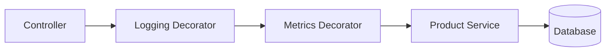
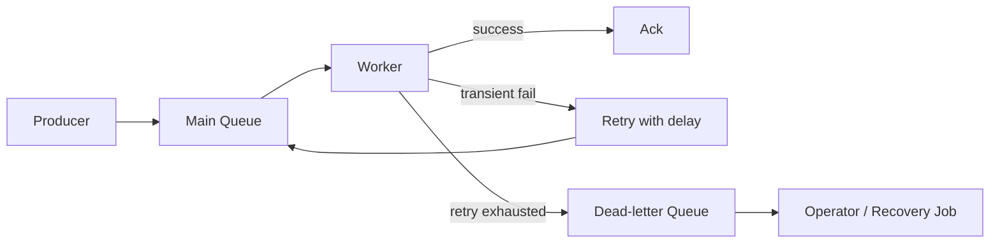
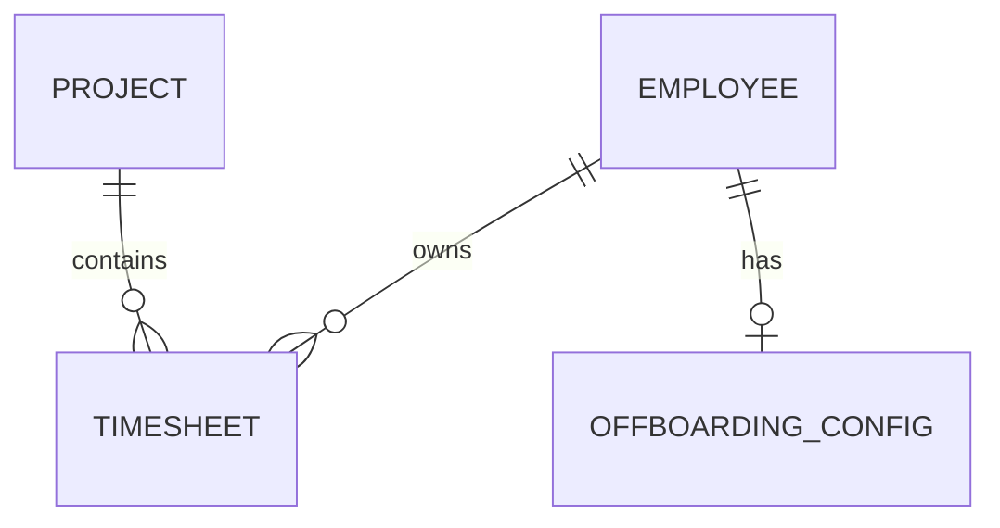
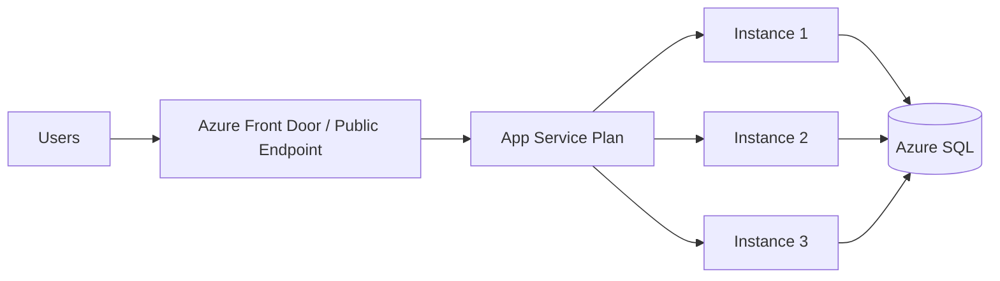
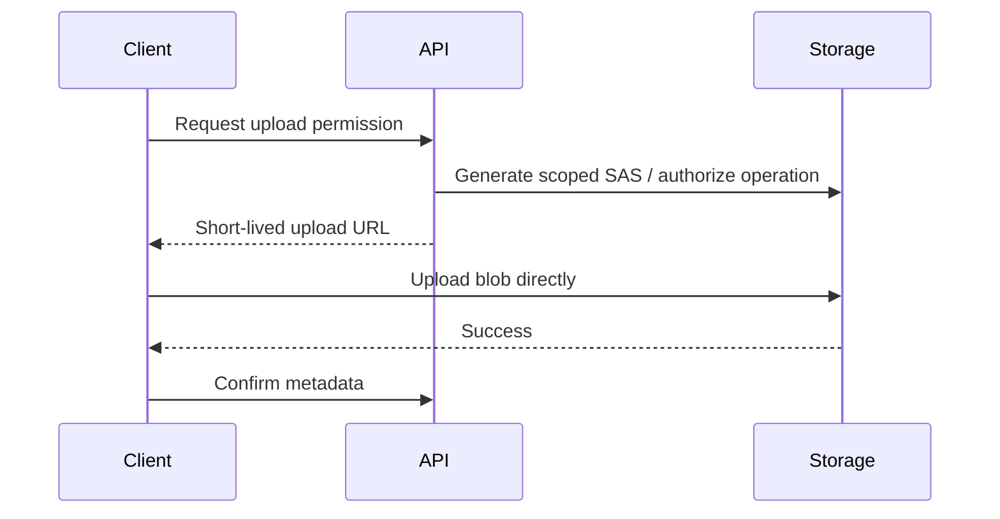
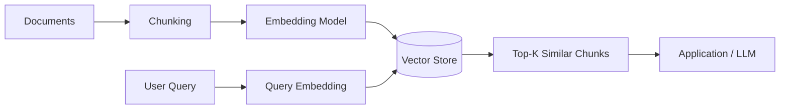
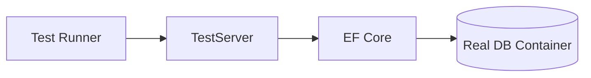

# Daily Knowledge Sharing — 17/08/2026

## Today’s Topics

1. Decorator Pattern cho cross-cutting behavior mà không làm service phình to
2. Background Processing — poison message, retry budget và dead-letter handling
3. Database Design — normalization, constraints và business invariants
4. API Performance — giảm latency bằng batching, projection và serialization discipline
5. Azure App Service — scale-out, deployment slots và production topology
6. Azure Blob Storage — upload an toàn, SAS, Managed Identity và lifecycle
7. Production Troubleshooting — evidence-first investigation thay vì đoán lỗi
8. Embeddings — semantic retrieval, similarity search và giới hạn thực tế
9. Integration Testing — test thật với database/container thay vì mock quá mức
10. Network Optimization — connection reuse, HTTP/2 và giảm round-trip

---

# 1. Decorator Pattern cho cross-cutting behavior mà không làm service phình to

### 1. What is it?

Decorator Pattern bọc một implementation bằng một implementation khác có cùng interface để thêm behavior trước hoặc sau lời gọi gốc. Trong backend, nó rất hữu ích cho logging, caching, metrics, authorization phụ, retry có điều kiện hoặc validation mà không nhồi tất cả logic vào service chính.

Nếu `IProductService` thực hiện business logic, `LoggingProductServiceDecorator` có thể đo thời gian và ghi log mà không sửa code business.

### 2. Why does it exist?

Service thường bắt đầu nhỏ nhưng dần bị thêm logging, metrics, cache, audit, retry và exception translation. Nếu tất cả nằm trong một class, logic business bị chìm trong infrastructure concern.

Decorator tồn tại để giữ core responsibility tập trung và cho phép composition behavior theo nhu cầu.

### 3. How does it work?



Mỗi decorator nhận cùng interface ở constructor và forward lời gọi sau khi thực hiện behavior phụ.

### 4. Practical example

```csharp
public interface IProductService
{
    Task<ProductDto> GetAsync(Guid id, CancellationToken ct);
}

public sealed class ProductService : IProductService
{
    private readonly AppDbContext _db;

    public ProductService(AppDbContext db) => _db = db;

    public async Task<ProductDto> GetAsync(Guid id, CancellationToken ct)
    {
        return await _db.Products
            .AsNoTracking()
            .Where(x => x.Id == id)
            .Select(x => new ProductDto(x.Id, x.Name, x.Price))
            .SingleAsync(ct);
    }
}

public sealed class LoggingProductServiceDecorator : IProductService
{
    private readonly IProductService _inner;
    private readonly ILogger<LoggingProductServiceDecorator> _logger;

    public LoggingProductServiceDecorator(
        IProductService inner,
        ILogger<LoggingProductServiceDecorator> logger)
    {
        _inner = inner;
        _logger = logger;
    }

    public async Task<ProductDto> GetAsync(Guid id, CancellationToken ct)
    {
        var started = Stopwatch.GetTimestamp();
        try
        {
            return await _inner.GetAsync(id, ct);
        }
        finally
        {
            _logger.LogInformation(
                "Get product {ProductId} completed in {ElapsedMs} ms",
                id,
                Stopwatch.GetElapsedTime(started).TotalMilliseconds);
        }
    }
}
```

### 5. Real production scenario

Trong hệ thống timesheet, service lấy employee profile có thể cần audit, caching và metrics. Nếu ba concern này nằm trực tiếp trong service, mỗi business change đều chạm code infrastructure. Decorator giúp thay đổi logging hay cache policy mà không sửa core query.

### 6. Common mistakes

- Tạo quá nhiều decorator khiến call chain khó debug.
- Decorator thay đổi business semantics thay vì chỉ thêm concern phụ.
- Không hiểu order: cache ngoài logging khác cache trong logging.
- Decorator có dependency vòng.
- Dùng decorator cho flow cần orchestration phức tạp; lúc đó pipeline/middleware có thể phù hợp hơn.

### 7. Trade-offs

**Advantages**

- Tách cross-cutting concern khỏi business code.
- Dễ test từng behavior.
- Composition linh hoạt.

**Costs / Risks**

- Nhiều lớp indirection.
- Order composition có thể ảnh hưởng behavior.
- Stack trace và DI registration phức tạp hơn.

### 8. Junior → Middle → Senior understanding

**Junior**

Hiểu decorator là “bọc service để thêm behavior mà vẫn giữ cùng interface”.

**Middle**

Biết implement và test decorator, hiểu lifetime và order trong DI.

**Senior / Technical Lead**

Biết chọn decorator, middleware, pipeline behavior hay domain service tùy loại concern; tránh biến pattern thành ceremony.

### 9. Key takeaway

- Decorator phù hợp cross-cutting behavior quanh một abstraction ổn định.
- Order của decorator là một phần của design.
- Không dùng decorator để giấu business workflow phức tạp.

---

# 2. Background Processing — poison message, retry budget và dead-letter handling

### 1. What is it?

Background processing xử lý công việc ngoài request-response trực tiếp, ví dụ gửi email, xử lý file, đồng bộ Microsoft 365 hoặc chạy scheduled job. Poison message là message luôn thất bại dù retry nhiều lần vì dữ liệu hoặc business state không hợp lệ.

Dead-letter queue (DLQ) là nơi cô lập message không thể xử lý để không chặn queue chính.

### 2. Why does it exist?

Naive worker thường có vòng lặp: nhận message → xử lý → lỗi thì retry vô hạn. Một poison message có thể chiếm worker, tạo retry storm, spam external API và làm queue backlog tăng.

Retry phải có budget và stop condition.

### 3. How does it work?



Lỗi transient như timeout có thể retry. Lỗi permanent như invalid recipient hoặc schema sai nên fail fast hoặc nhanh chóng đi DLQ.

### 4. Practical example

```csharp
public async Task HandleAsync(EmailMessage message, CancellationToken ct)
{
    try
    {
        await _mailer.SendAsync(message, ct);
    }
    catch (ExternalRateLimitException ex)
    {
        throw new TransientMessageException("Provider throttled", ex);
    }
    catch (InvalidRecipientException ex)
    {
        throw new PermanentMessageException("Recipient is invalid", ex);
    }
}
```

Retry policy có thể dùng exponential backoff, ví dụ 5 giây → 30 giây → 2 phút → 10 phút, nhưng cần giới hạn tổng số lần và tổng thời gian.

### 5. Real production scenario

Một background job đồng bộ mailbox qua Microsoft Graph gặp 429 throttling. Retry ngay lập tức hàng trăm lần chỉ làm tình trạng tệ hơn. Worker nên tôn trọng `Retry-After`, giảm concurrency và sau ngưỡng nhất định đưa message vào DLQ hoặc trạng thái cần xử lý thủ công.

### 6. Common mistakes

- Retry mọi exception giống nhau.
- Retry vô hạn.
- Không idempotent nên mỗi retry tạo side effect trùng.
- Không lưu attempt count, last error, correlation ID.
- DLQ chỉ để “cất lỗi” nhưng không có recovery process.
- Một message lỗi chặn toàn partition/queue.

### 7. Trade-offs

**Advantages**

- Tăng reliability và bảo vệ throughput.
- Tách transient failure khỏi permanent failure.
- Cho phép vận hành và recovery có kiểm soát.

**Costs / Risks**

- Workflow phức tạp hơn synchronous processing.
- Cần DLQ monitoring và runbook.
- Eventual completion có thể chậm.

### 8. Junior → Middle → Senior understanding

**Junior**

Hiểu background job vẫn có failure và retry không phải lúc nào cũng đúng.

**Middle**

Biết phân loại lỗi, thiết kế retry/delay, idempotency và dead-letter handling.

**Senior / Technical Lead**

Thiết kế throughput, backpressure, retry budget, recovery ownership và SLO cho queue processing.

### 9. Key takeaway

- Retry phải có giới hạn và chỉ áp dụng cho lỗi có khả năng hồi phục.
- Poison message phải được cô lập.
- DLQ chỉ hữu ích khi có quy trình xử lý sau đó.

---

# 3. Database Design — normalization, constraints và business invariants

### 1. What is it?

Normalization tổ chức dữ liệu thành các bảng và quan hệ để giảm duplication và update anomaly. Nhưng production database design không chỉ là đạt “3NF”; quan trọng hơn là schema phải bảo vệ business invariants bằng primary key, foreign key, unique constraint, check constraint và transaction boundary.

### 2. Why does it exist?

Nếu employee email được lặp trong nhiều bảng thay vì dùng `EmployeeId`, đổi email có thể phải update nhiều nơi và dễ lệch dữ liệu.

Nếu business nói một employee chỉ có một active offboarding configuration nhưng database không có constraint, race condition có thể tạo hai record active dù code đã check trước.

### 3. How does it work?



Ứng dụng kiểm tra business rule, nhưng database vẫn là lớp bảo vệ cuối cùng cho invariant quan trọng.

### 4. Practical example

```sql
CREATE TABLE EmployeeOffboardingConfig
(
    Id uniqueidentifier NOT NULL PRIMARY KEY,
    EmployeeId uniqueidentifier NOT NULL,
    IsActive bit NOT NULL,
    TargetEmail nvarchar(320) NULL,
    EndTime datetime2 NULL,
    CONSTRAINT FK_Offboarding_Employee
        FOREIGN KEY (EmployeeId) REFERENCES Employee(Id),
    CONSTRAINT CK_Offboarding_EndTime
        CHECK (EndTime IS NULL OR EndTime > '2000-01-01')
);

CREATE UNIQUE INDEX UX_Offboarding_OneActivePerEmployee
ON EmployeeOffboardingConfig(EmployeeId)
WHERE IsActive = 1;
```

Constraint này bảo vệ invariant ngay cả khi hai request chạy song song.

### 5. Real production scenario

Trong hệ thống payroll, duplicate payroll period hoặc duplicate payment instruction có thể gây lỗi tài chính. Chỉ check bằng `AnyAsync()` trước insert là chưa đủ vì hai transaction có thể cùng vượt qua check. Unique constraint mới là guarantee cuối cùng.

### 6. Common mistakes

- Denormalize quá sớm chỉ vì sợ join.
- Tin application validation mà không có database constraint.
- Dùng nullable column khắp nơi thay vì mô hình hóa state rõ.
- Không index foreign key thường xuyên join/filter.
- Dùng soft delete nhưng quên unique constraint có filtered condition.
- Thiết kế generic EAV schema cho mọi thứ.

### 7. Trade-offs

**Advantages**

- Giảm duplicate và inconsistency.
- Constraint bảo vệ dữ liệu khỏi bug/concurrency.
- Schema diễn đạt business rule rõ hơn.

**Costs / Risks**

- Nhiều join hơn.
- Constraint có thể làm migration phức tạp.
- Một số read model analytics có thể cần denormalization.

### 8. Junior → Middle → Senior understanding

**Junior**

Hiểu PK, FK, unique và normalization cơ bản.

**Middle**

Biết chọn index, constraint và transaction phù hợp với rule.

**Senior / Technical Lead**

Quyết định consistency boundary, normalization/denormalization và cách database enforce invariant dưới concurrency.

### 9. Key takeaway

- Database schema là một phần của business correctness.
- Validation trong code không thay thế unique/foreign/check constraint.
- Denormalization là optimization có chủ đích, không phải mặc định.

---

# 4. API Performance — giảm latency bằng batching, projection và serialization discipline

### 1. What is it?

API performance là khả năng phục vụ request trong latency và throughput mục tiêu. Tối ưu API không bắt đầu bằng “thêm cache”; phải đo xem thời gian nằm ở database, downstream API, CPU, serialization hay network.

### 2. Why does it exist?

Một endpoint 2 giây có thể gồm 50 ms application code nhưng 1.5 giây do N+1 calls và 400 ms serialization payload 5 MB. Nếu tối ưu sai chỗ, kết quả gần như không đổi.

### 3. How does it work?

Flow điều tra:

```text
Symptom
→ measure p50/p95/p99
→ trace request
→ locate bottleneck
→ form hypothesis
→ change one thing
→ load test
→ compare again
```

### 4. Practical example

Thay vì load entity graph lớn:

```csharp
var employees = await _db.Employees
    .Include(x => x.Department)
    .Include(x => x.Timesheets)
    .ToListAsync(ct);
```

Chỉ projection dữ liệu cần thiết:

```csharp
var employees = await _db.Employees
    .AsNoTracking()
    .Select(x => new EmployeeListItem(
        x.Id,
        x.Name,
        x.Department.Name,
        x.Timesheets.Count(t => t.Status == TimesheetStatus.Pending)))
    .Take(100)
    .ToListAsync(ct);
```

Nếu client cần data từ 20 IDs, một batch endpoint hoặc query set-based thường tốt hơn 20 HTTP round-trip.

### 5. Real production scenario

Dashboard gọi 12 endpoint riêng, mỗi endpoint 100–200 ms. Trên mobile network, tổng UX latency cao dù backend từng endpoint “nhanh”. Một BFF hoặc endpoint aggregate có thể giảm round-trip, nhưng cần kiểm soát fan-out và timeout downstream.

### 6. Common mistakes

- Chỉ nhìn average latency thay vì p95/p99.
- Return entity graph quá lớn.
- Không paginate.
- Gzip/compression cho payload rất nhỏ gây CPU overhead không đáng.
- Batch quá lớn khiến request nặng và timeout.
- Tối ưu code trước khi trace dependency latency.

### 7. Trade-offs

**Advantages**

- Projection và batching giảm IO/round-trip.
- Payload nhỏ giảm serialization và network cost.

**Costs / Risks**

- Aggregate endpoint tăng coupling.
- Batch lớn tăng memory và tail latency.
- Optimization đôi khi làm API contract phức tạp hơn.

### 8. Junior → Middle → Senior understanding

**Junior**

Hiểu payload size, query count và network call đều ảnh hưởng latency.

**Middle**

Biết profiling, projection, pagination, batching và load test.

**Senior / Technical Lead**

Đặt performance budget, chọn BFF/aggregation boundary và cân bằng latency, complexity, caching, throughput.

### 9. Key takeaway

- Measure trước khi optimize.
- Giảm dữ liệu và round-trip thường hiệu quả hơn micro-optimization CPU.
- Theo dõi p95/p99, không chỉ average.

---

# 5. Azure App Service — scale-out, deployment slots và production topology

### 1. What is it?

Azure App Service là PaaS để chạy web app/API mà không cần quản lý VM trực tiếp. Nó quản lý runtime hosting, deployment integration, TLS, scaling và health management ở mức platform.

### 2. Why does it exist?

Nếu dùng VM, team phải tự patch OS, configure IIS/nginx, load balancer, process restart và nhiều phần vận hành. App Service giảm operational burden cho ứng dụng web truyền thống.

### 3. How does it work?



App Service Plan định nghĩa compute. Scale-out thêm instance. Application nên stateless; session và file local không nên là dependency chính.

Deployment slot cho phép deploy version mới vào staging rồi swap vào production.

### 4. Practical example

ASP.NET Core health endpoint:

```csharp
builder.Services.AddHealthChecks()
    .AddDbContextCheck<AppDbContext>();

app.MapHealthChecks("/health");
```

Configuration nhạy cảm nên lấy từ Key Vault hoặc app settings, không commit vào repo.

### 5. Real production scenario

API employee management chạy 3 instances. Nếu app lưu file upload vào local disk của instance A rồi request sau vào instance B, file có thể “mất”. Production design nên dùng Blob Storage cho shared durable file.

Khi deploy version mới, staging slot được warm up, smoke test, sau đó swap để giảm downtime.

### 6. Common mistakes

- Lưu state/session quan trọng trong memory khi scale-out.
- Assume local filesystem là durable/shared.
- Không cấu hình health check.
- Auto-scale chỉ dựa CPU mà bỏ queue length/request rate.
- Slot swap nhưng config không đánh dấu slot-specific đúng chỗ.
- Scale-out để che database bottleneck.

### 7. Trade-offs

**Advantages**

- Quản lý đơn giản.
- Deployment slots hữu ích.
- Scale-out nhanh.

**Costs / Risks**

- Ít control hơn VM/container orchestration.
- Cost phụ thuộc App Service Plan chạy liên tục.
- Stateful app cần refactor để scale tốt.

### 8. Junior → Middle → Senior understanding

**Junior**

Biết App Service chạy web/API và instance có thể tăng giảm.

**Middle**

Biết deployment slot, health check, app settings và stateless design.

**Senior / Technical Lead**

Thiết kế autoscale signal, DR, networking, cost tier, warm-up và dependency capacity.

### 9. Key takeaway

- Scale-out chỉ hiệu quả khi app stateless và dependency chịu được tải.
- Deployment slot giảm release risk nhưng không thay thế migration strategy.
- Local disk/memory không nên là shared state.

---

# 6. Azure Blob Storage — upload an toàn, SAS, Managed Identity và lifecycle

### 1. What is it?

Azure Blob Storage là object storage cho file, ảnh, document, export, log archive và dữ liệu nhị phân lớn. Nó phù hợp hơn database khi cần lưu object lớn không yêu cầu relational query.

### 2. Why does it exist?

Lưu file lớn trực tiếp trong SQL có thể làm backup, IO và storage cost tăng. Lưu file local trên web server lại không phù hợp scale-out và failover.

Blob Storage cung cấp durability, scalability và access control riêng cho object.

### 3. How does it work?



Direct upload giúp API không phải proxy toàn bộ file, giảm CPU/memory/network load.

### 4. Practical example

Server-side access bằng Managed Identity:

```csharp
var credential = new DefaultAzureCredential();
var serviceClient = new BlobServiceClient(
    new Uri("https://myaccount.blob.core.windows.net"),
    credential);

var container = serviceClient.GetBlobContainerClient("documents");
var blob = container.GetBlobClient($"employees/{employeeId}/{fileName}");

await blob.UploadAsync(stream, overwrite: false, cancellationToken: ct);
```

Không cần lưu account key lâu dài trong application settings.

### 5. Real production scenario

Hệ thống HR cho phép upload hợp đồng 50 MB. Nếu API nhận toàn file vào memory, nhiều upload đồng thời có thể gây memory pressure. Direct upload qua short-lived SAS giảm tải backend, còn API chỉ quản lý authorization và metadata.

### 6. Common mistakes

- Container public ngoài ý muốn.
- SAS expiry quá dài hoặc permission quá rộng.
- Dùng account key cho mọi service.
- Không validate file type/size và malware risk.
- Không có lifecycle rule cho file tạm/archive.
- Dùng blob name do client cung cấp trực tiếp, gây path/key collision.

### 7. Trade-offs

**Advantages**

- Scale tốt cho file lớn.
- Tách binary storage khỏi relational DB.
- Tích hợp Managed Identity và lifecycle management.

**Costs / Risks**

- Consistency giữa DB metadata và blob cần thiết kế.
- Egress và transaction cost có thể đáng kể.
- Access URL phải quản lý cẩn thận.

### 8. Junior → Middle → Senior understanding

**Junior**

Hiểu Blob Storage lưu object/file, không phải relational database.

**Middle**

Biết upload/download, SAS, metadata và Managed Identity.

**Senior / Technical Lead**

Thiết kế security boundary, retention, lifecycle, orphan cleanup, DR và direct-upload architecture.

### 9. Key takeaway

- File lớn nên tách khỏi web server local và thường tách khỏi relational DB.
- Ưu tiên identity-based access thay account key.
- SAS phải scope nhỏ và sống ngắn.

---

# 7. Production Troubleshooting — evidence-first investigation thay vì đoán lỗi

### 1. What is it?

Production troubleshooting là quá trình xác định nguyên nhân sự cố dựa trên evidence: logs, metrics, traces, deployment history, dependency status và reproduction data.

Mục tiêu đầu tiên không phải “tìm ngay root cause”, mà là thu hẹp phạm vi một cách có hệ thống.

### 2. Why does it exist?

Khi incident xảy ra, team thường đoán: “chắc database”, “chắc deploy mới”, “restart thử xem”. Restart có thể tạm hết triệu chứng nhưng xóa evidence và không ngăn sự cố lặp lại.

### 3. How does it work?

```text
1. Xác định impact và thời điểm bắt đầu
2. Kiểm tra change gần nhất
3. So sánh healthy vs unhealthy requests
4. Xem metrics để tìm bottleneck
5. Dùng trace để xác định dependency chậm/lỗi
6. Dùng logs để lấy detail
7. Form hypothesis
8. Kiểm chứng hypothesis
9. Mitigate
10. Root-cause + follow-up
```

### 4. Practical example

Giả sử p95 latency từ 300 ms tăng lên 4 giây sau 14:05.

Evidence có thể cho thấy:

```text
API CPU: 35%
Memory: bình thường
SQL CPU: 90%
DB connection count: tăng mạnh
Trace: 82% latency nằm ở SELECT TimesheetSummary
Deploy gần nhất: thêm filter theo Status + EndDate
```

Lúc này focus vào execution plan/index/query, không phải tăng App Service instance.

### 5. Real production scenario

Một Hangfire job chạy mỗi giờ bỗng làm API chậm. Metrics cho thấy DB IO spike đúng lúc job bắt đầu. Trace request user cho thấy query bị block bởi transaction của job. Root cause là transaction giữ lock quá lâu, không phải “API server yếu”.

### 6. Common mistakes

- Restart trước khi thu thập evidence.
- Chỉ xem log lỗi mà bỏ metrics/traces.
- Thay nhiều thứ cùng lúc nên không biết fix nào có tác dụng.
- Không ghi incident timeline.
- Chỉ fix symptom, không tìm mechanism.
- Không so sánh trước/sau deployment.

### 7. Trade-offs

**Advantages**

- Giảm guesswork.
- Root cause chính xác hơn.
- Tạo knowledge cho incident sau.

**Costs / Risks**

- Cần telemetry chuẩn bị trước incident.
- Deep investigation tốn thời gian; mitigation có thể phải ưu tiên trước root cause.

### 8. Junior → Middle → Senior understanding

**Junior**

Biết thu thập timestamp, correlation ID, error detail và reproduction.

**Middle**

Biết kết hợp logs, metrics, traces và query plan để kiểm chứng giả thuyết.

**Senior / Technical Lead**

Điều phối mitigation vs investigation, xác định blast radius, timeline, systemic cause và preventive action.

### 9. Key takeaway

- Incident investigation phải dựa evidence, không dựa trực giác đơn thuần.
- Metrics chỉ ra “ở đâu”, traces chỉ ra “đường đi”, logs cung cấp detail.
- Mitigation và root-cause analysis là hai mục tiêu khác nhau.

---

# 8. Embeddings — semantic retrieval, similarity search và giới hạn thực tế

### 1. What is it?

Embedding là vector số biểu diễn ý nghĩa tương đối của text, image hoặc dữ liệu khác. Các nội dung có nghĩa gần nhau thường có vector gần nhau theo một similarity metric như cosine similarity.

Embedding không phải “AI trả lời câu hỏi”; nó là representation dùng cho search, clustering, recommendation và retrieval.

### 2. Why does it exist?

Keyword search thất bại khi người dùng dùng từ khác nhưng cùng nghĩa. Query “nhân viên nghỉ việc” có thể cần tìm document chứa “employee offboarding” dù không có từ trùng trực tiếp.

### 3. How does it work?



Search vector thường nên kết hợp metadata filter và đôi khi hybrid keyword search.

### 4. Practical example

Pseudo-flow trong C#:

```csharp
var queryVector = await embeddingClient.CreateEmbeddingAsync(
    "How do we handle employee offboarding?",
    ct);

var results = await vectorRepository.SearchAsync(
    queryVector,
    topK: 5,
    filters: new { Department = "IT" },
    ct);
```

Sau đó application có thể đưa các chunk phù hợp vào context của LLM hoặc hiển thị trực tiếp cho user.

### 5. Real production scenario

Một knowledge assistant nội bộ index tài liệu architecture, runbook và policy. Khi developer hỏi “mailbox forwarding khi nhân viên nghỉ việc xử lý thế nào?”, semantic retrieval có thể tìm đúng runbook dù wording khác hoàn toàn.

### 6. Common mistakes

- Chunk quá lớn hoặc quá nhỏ.
- Dùng embedding search mà không metadata filter, gây cross-tenant leak.
- Assume nearest vector luôn đúng.
- Không re-embed khi document thay đổi.
- Không đánh giá retrieval quality.
- Đưa top-K quá lớn vào LLM gây token cost và noise.

### 7. Trade-offs

**Advantages**

- Search theo semantic meaning.
- Hữu ích cho RAG và knowledge discovery.

**Costs / Risks**

- Có index/storage cost.
- Retrieval là probabilistic.
- Version embedding model có thể ảnh hưởng vector compatibility.

### 8. Junior → Middle → Senior understanding

**Junior**

Hiểu embedding là vector representation, không phải câu trả lời.

**Middle**

Biết chunking, similarity, top-K, metadata filter và re-index.

**Senior / Technical Lead**

Thiết kế retrieval evaluation, tenant isolation, cost, versioning và fallback khi semantic search kém.

### 9. Key takeaway

- Embedding giải quyết semantic retrieval, không thay thế business logic.
- Metadata filter là security boundary quan trọng.
- Retrieval quality phải được đo, không nên tin cảm giác.

---

# 9. Integration Testing — test thật với database/container thay vì mock quá mức

### 1. What is it?

Integration test kiểm tra nhiều component thật làm việc cùng nhau: API + EF Core + database, service + queue, hoặc repository + SQL engine. Nó nằm giữa unit test và end-to-end test.

### 2. Why does it exist?

Mock có thể xác nhận method được gọi nhưng không bắt được lỗi SQL syntax, transaction, mapping, migration, collation, unique constraint hoặc query behavior thực.

Một repository test bằng mock `DbSet` thường không chứng minh query chạy đúng trên SQL Server/PostgreSQL.

### 3. How does it work?



Test tạo database disposable, chạy migration, seed dữ liệu, gọi API/service thật rồi assert kết quả.

### 4. Practical example

Với ASP.NET Core `WebApplicationFactory`:

```csharp
public class EmployeeApiTests : IClassFixture<WebApplicationFactory<Program>>
{
    private readonly HttpClient _client;

    public EmployeeApiTests(WebApplicationFactory<Program> factory)
    {
        _client = factory.CreateClient();
    }

    [Fact]
    public async Task GetEmployee_Returns404_WhenMissing()
    {
        var response = await _client.GetAsync($"/api/employees/{Guid.NewGuid()}");
        Assert.Equal(HttpStatusCode.NotFound, response.StatusCode);
    }
}
```

Trong pipeline thật, nên dùng SQL Server/PostgreSQL container tương ứng production thay vì SQLite nếu query semantics khác.

### 5. Real production scenario

Một EF migration thêm filtered unique index. Unit test repository bằng in-memory provider vẫn pass, nhưng production insert duplicate thất bại khác mong đợi. Integration test với SQL engine thật phát hiện behavior trước release.

### 6. Common mistakes

- Dùng EF InMemory rồi gọi đó là integration test database thật.
- Shared database giữa test làm test phụ thuộc thứ tự.
- Test quá nhiều scenario qua UI làm suite chậm.
- Không reset state giữa test.
- Mock external dependency nhưng mock contract không giống production.

### 7. Trade-offs

**Advantages**

- Bắt lỗi integration thực tế.
- Tăng confidence cho migration/query/configuration.

**Costs / Risks**

- Chậm hơn unit test.
- Setup CI phức tạp hơn.
- Cần quản lý test data và container lifecycle.

### 8. Junior → Middle → Senior understanding

**Junior**

Biết khác unit test và integration test.

**Middle**

Biết `WebApplicationFactory`, test database, seed/reset state và assert API behavior.

**Senior / Technical Lead**

Thiết kế test pyramid, chọn boundary cần integration test và cân bằng runtime/coverage/reliability.

### 9. Key takeaway

- Mock không thể chứng minh integration thật hoạt động.
- Database behavior quan trọng nên test trên engine gần production.
- Integration test nên tập trung boundary có rủi ro cao.

---

# 10. Network Optimization — connection reuse, HTTP/2 và giảm round-trip

### 1. What is it?

Network optimization trong backend là giảm chi phí giao tiếp giữa client, API và dependency: DNS lookup, TCP/TLS handshake, round-trip, payload size và connection churn.

### 2. Why does it exist?

Một HTTP call 20 ms business processing có thể mất thêm hàng chục mili-giây nếu phải mở TCP/TLS connection mới. Khi có hàng nghìn call, connection churn còn gây socket exhaustion và load lên dependency.

### 3. How does it work?

```text
Bad:
Request → new TCP → TLS → HTTP → close
Request → new TCP → TLS → HTTP → close

Better:
Connection pool
  ├─ Request 1
  ├─ Request 2
  └─ Request 3
```

HTTP/2 còn cho phép multiplex nhiều request trên một connection trong nhiều trường hợp.

### 4. Practical example

Trong .NET, dùng `IHttpClientFactory` thay vì tạo `new HttpClient()` liên tục:

```csharp
builder.Services.AddHttpClient<IMicrosoftGraphGateway, MicrosoftGraphGateway>(client =>
{
    client.Timeout = TimeSpan.FromSeconds(10);
    client.DefaultRequestHeaders.Accept.ParseAdd("application/json");
});
```

Handler pooling quản lý connection reuse và DNS refresh tốt hơn cách tạo/dispose client cho mỗi request.

### 5. Real production scenario

Một notification service gửi hàng nghìn request tới external provider. Nếu mỗi request tạo mới `HttpClient`, socket có thể vào `TIME_WAIT`, dẫn đến connection error. Sau khi chuyển sang factory + pooled connection, throughput ổn định hơn và latency giảm.

### 6. Common mistakes

- Tạo/dispose `HttpClient` mỗi request.
- Set timeout cực lớn.
- Không giới hạn concurrent downstream calls.
- Gửi payload dư thừa.
- Nhiều chatty API call nhỏ thay vì batch.
- Chỉ nhìn server CPU mà bỏ network latency.

### 7. Trade-offs

**Advantages**

- Giảm handshake và connection churn.
- Tăng throughput.
- Giảm latency cho chatty integration.

**Costs / Risks**

- Connection pool cần timeout/lifetime phù hợp.
- Batch/multiplex có thể tăng complexity.
- Downstream vẫn cần rate limit/backpressure.

### 8. Junior → Middle → Senior understanding

**Junior**

Hiểu network call có latency và connection cost.

**Middle**

Biết `IHttpClientFactory`, timeout, batching và connection reuse.

**Senior / Technical Lead**

Thiết kế network budget, concurrency limit, regional placement, HTTP protocol choice và dependency fan-out.

### 9. Key takeaway

- Reuse connection; đừng tạo connection mới cho từng request.
- Giảm round-trip thường có tác động lớn hơn tối ưu vài microsecond trong code.
- Network performance phải được đo end-to-end, không chỉ ở server.