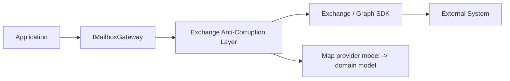
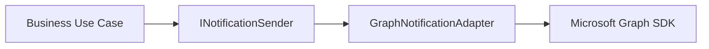
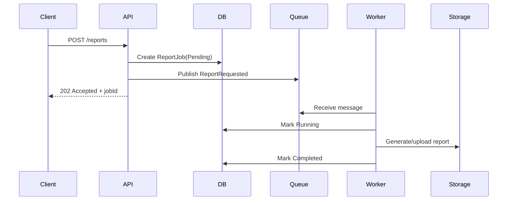
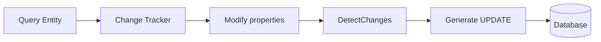
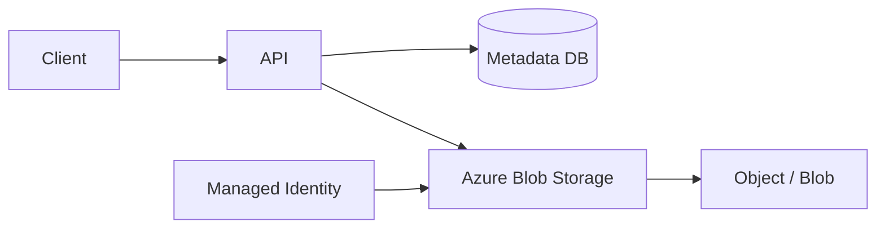
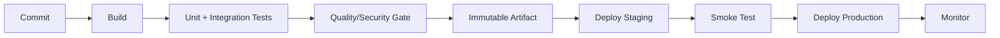
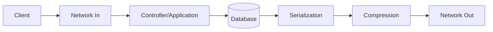
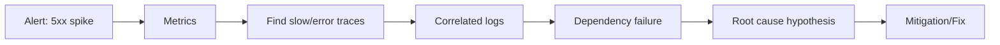
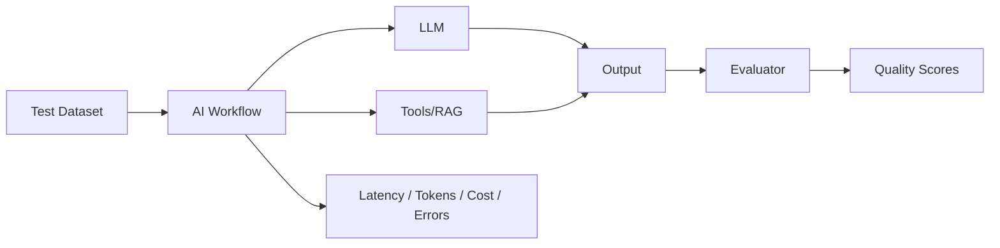

# Daily Knowledge Sharing — 17/08/2026

## Today’s Topics

1. Anti-Corruption Layer — bảo vệ domain khỏi model của hệ thống bên ngoài
2. Adapter Pattern — cô lập third-party integration trong .NET
3. Background Processing — queue semantics, retry và idempotent worker
4. SQL Server Parameter Sniffing — khi cùng một query nhưng execution plan lại gây chậm production
5. EF Core Change Tracking — hiểu tracking cost, state và update semantics
6. Azure Blob Storage — thiết kế file storage an toàn và có khả năng mở rộng
7. Azure DevOps Pipeline — xây CI/CD có quality gate và rollback path
8. API Performance — tối ưu serialization, payload và network cost có đo lường
9. Incident Investigation — nối logs, metrics, traces thành một timeline điều tra production
10. AI Evaluation & Observability — đo chất lượng LLM thay vì chỉ “thấy câu trả lời có vẻ đúng”

---

# 1. Anti-Corruption Layer — bảo vệ domain khỏi model của hệ thống bên ngoài

### 1. What is it?

Anti-Corruption Layer, thường viết tắt ACL, là một boundary nằm giữa domain của hệ thống và một hệ thống bên ngoài có model, terminology hoặc contract khác.

Mục tiêu của ACL không phải chỉ là “map DTO”. Nó bảo vệ domain nội bộ khỏi việc bị kéo theo cách suy nghĩ của hệ thống bên ngoài.

Ví dụ domain của bạn dùng khái niệm `Employee`, `OffboardingAction`, `MailboxPolicy`, nhưng Microsoft Graph hoặc Exchange Online trả về các object, status và error code hoàn toàn khác. Nếu application layer truyền thẳng các type của SDK vào domain, dependency của domain sẽ dần bị “nhiễm”.

### 2. Why does it exist?

Nếu không có boundary, code dễ đi theo hướng:

```text
Domain Service
  -> Graph SDK object
  -> Exchange SDK exception
  -> Provider-specific enum
  -> Provider-specific status code
```

Kết quả là:

- Domain logic phụ thuộc provider.
- Việc đổi provider hoặc SDK version khó hơn.
- Unit test phải biết chi tiết infrastructure.
- Business terminology trở nên lẫn lộn.

Naive mapping trực tiếp chỉ giải quyết syntax, không giải quyết semantic mismatch.

### 3. How does it work?



Application chỉ biết contract nội bộ:

```csharp
public interface IMailboxGateway
{
    Task<MailboxResult> ConfigureForwardingAsync(
        MailboxForwardingRequest request,
        CancellationToken cancellationToken);
}
```

ACL chịu trách nhiệm:

1. Chuyển domain request thành provider request.
2. Gọi SDK/API ngoài.
3. Chuyển provider response/error về model nội bộ.
4. Che provider-specific details khỏi domain.

### 4. Practical example

```csharp
public sealed record MailboxForwardingRequest(
    string SourceEmail,
    string TargetEmail,
    DateTimeOffset? EndTime);

public sealed record MailboxResult(
    bool Success,
    string? ErrorCode,
    string? Message);

public sealed class ExchangeMailboxGateway : IMailboxGateway
{
    private readonly IExchangeClient _client;

    public ExchangeMailboxGateway(IExchangeClient client)
    {
        _client = client;
    }

    public async Task<MailboxResult> ConfigureForwardingAsync(
        MailboxForwardingRequest request,
        CancellationToken cancellationToken)
    {
        try
        {
            await _client.SetForwardingAsync(
                request.SourceEmail,
                request.TargetEmail,
                cancellationToken);

            return new MailboxResult(true, null, null);
        }
        catch (ExchangeThrottledException ex)
        {
            return new MailboxResult(
                false,
                "MAIL_PROVIDER_THROTTLED",
                ex.Message);
        }
    }
}
```

Application không cần biết `ExchangeThrottledException` là gì.

### 5. Real production scenario

Một hệ thống employee offboarding tích hợp Exchange Online. Business chỉ quan tâm rằng forwarding đã thành công, bị throttled, bị permission-denied hay mailbox không tồn tại.

Nếu provider sau này đổi từ PowerShell/Exchange Online sang một service wrapper khác, domain contract vẫn giữ nguyên.

### 6. Common mistakes

- Chỉ đổi tên DTO rồi gọi đó là ACL.
- Cho domain tham chiếu package SDK ngoài.
- Truyền provider exception xuyên qua application boundary.
- Map quá nhiều field không cần thiết.
- Giấu luôn mọi chi tiết lỗi đến mức không thể troubleshoot.
- Tạo ACL cực dày cho integration rất đơn giản và ổn định.

### 7. Trade-offs

**Advantages**

- Giảm coupling vào provider.
- Domain terminology rõ hơn.
- Dễ test business logic.
- Dễ thay đổi SDK/provider.

**Costs / Risks**

- Thêm mapping code.
- Có thể mất provider-specific capability nếu abstraction quá nghèo.
- Cần quyết định error translation cẩn thận.

### 8. Junior → Middle → Senior understanding

**Junior**

Hiểu rằng domain không nên biết type của SDK bên ngoài.

**Middle**

Biết thiết kế gateway interface, mapping DTO và error translation.

**Senior / Technical Lead**

Biết khi nào cần ACL thật sự, abstraction nên rộng đến đâu, semantic nào phải giữ lại và chi phí migration/provider lock-in.

### 9. Key takeaway

- ACL bảo vệ business model khỏi external model.
- Boundary tốt không chỉ map field, mà map cả semantics và error.
- Đừng để SDK của provider trở thành ngôn ngữ của domain.

---

# 2. Adapter Pattern — cô lập third-party integration trong .NET

### 1. What is it?

Adapter Pattern chuyển một interface không tương thích thành interface mà application mong muốn.

Nếu ACL bảo vệ semantic boundary ở mức domain, Adapter Pattern thường giải quyết compatibility ở mức implementation: application muốn `INotificationSender`, trong khi provider lại cung cấp `SendGridClient`, `GraphServiceClient` hoặc một REST API riêng.

### 2. Why does it exist?

Nếu code gọi SDK trực tiếp ở nhiều nơi:

```csharp
await graphClient.Users[userId].SendMail.PostAsync(...);
```

thì application bị phụ thuộc vào SDK shape. SDK nâng major version, method chain đổi, hàng chục chỗ phải sửa.

Adapter gom sự thay đổi đó vào một nơi.

### 3. How does it work?



Application định nghĩa contract theo nhu cầu của mình, adapter dịch sang SDK.

### 4. Practical example

```csharp
public interface INotificationSender
{
    Task SendAsync(
        string recipient,
        string subject,
        string body,
        CancellationToken cancellationToken);
}

public sealed class GraphNotificationAdapter : INotificationSender
{
    private readonly GraphServiceClient _graph;

    public GraphNotificationAdapter(GraphServiceClient graph)
    {
        _graph = graph;
    }

    public async Task SendAsync(
        string recipient,
        string subject,
        string body,
        CancellationToken cancellationToken)
    {
        var message = new Microsoft.Graph.Models.Message
        {
            Subject = subject,
            Body = new ItemBody
            {
                ContentType = BodyType.Html,
                Content = body
            },
            ToRecipients =
            [
                new Recipient
                {
                    EmailAddress = new EmailAddress
                    {
                        Address = recipient
                    }
                }
            ]
        };

        await _graph.Users["service-account@contoso.com"]
            .SendMail
            .PostAsync(
                new SendMailPostRequestBody
                {
                    Message = message,
                    SaveToSentItems = false
                },
                cancellationToken: cancellationToken);
    }
}
```

### 5. Real production scenario

Một notification service ban đầu gửi mail qua SMTP, sau đó chuyển sang Microsoft Graph. Business use case chỉ cần `INotificationSender`; adapter thay đổi còn caller gần như không đổi.

### 6. Common mistakes

- Adapter chỉ wrap một method nhưng vẫn leak toàn bộ SDK type ra ngoài.
- Adapter chứa business rule thay vì integration logic.
- Một adapter ôm quá nhiều capability không liên quan.
- Không normalize timeout/retry behavior.
- Không test contract khi nâng SDK major version.

### 7. Trade-offs

**Advantages**

- Giảm SDK coupling.
- Dễ mock/test.
- Dễ thay provider.
- Upgrade dependency ít ảnh hưởng hơn.

**Costs / Risks**

- Thêm abstraction layer.
- Có thể che capability hữu ích của SDK.
- Interface thiết kế sai sẽ trở thành abstraction cứng nhắc.

### 8. Junior → Middle → Senior understanding

**Junior**

Hiểu Adapter là “dịch interface này thành interface khác”.

**Middle**

Biết wrap SDK, normalize error và test adapter.

**Senior / Technical Lead**

Quyết định abstraction boundary, tránh generic interface quá mức và đánh giá provider lock-in.

### 9. Key takeaway

- Adapter cô lập dependency change.
- Không leak external SDK type qua boundary.
- Business rule không nên nằm trong adapter.

---

# 3. Background Processing — queue semantics, retry và idempotent worker

### 1. What is it?

Background processing chuyển công việc không cần hoàn thành trong request/response sang worker xử lý bất đồng bộ.

Ví dụ: gửi email, resize file, đồng bộ Microsoft 365, generate report, xử lý import lớn.

Điểm quan trọng không phải chỉ “đẩy việc ra background”, mà phải hiểu semantics của queue: message có thể được giao lại, xử lý trễ, xử lý song song hoặc chết giữa chừng.

### 2. Why does it exist?

Nếu request HTTP phải chờ một job 20 giây:

- User latency tăng.
- Connection bị giữ lâu.
- Retry từ client có thể tạo duplicate work.
- App khó scale ổn định.

Queue giúp tách user-facing latency khỏi long-running work.

### 3. How does it work?



Message thường có semantics **at-least-once**, nghĩa là worker phải chịu duplicate delivery.

### 4. Practical example

```csharp
public sealed class ReportWorker : BackgroundService
{
    private readonly IServiceScopeFactory _scopeFactory;

    public ReportWorker(IServiceScopeFactory scopeFactory)
    {
        _scopeFactory = scopeFactory;
    }

    protected override async Task ExecuteAsync(CancellationToken stoppingToken)
    {
        while (!stoppingToken.IsCancellationRequested)
        {
            await using var scope = _scopeFactory.CreateAsyncScope();
            var queue = scope.ServiceProvider.GetRequiredService<IJobQueue>();
            var db = scope.ServiceProvider.GetRequiredService<AppDbContext>();

            var message = await queue.ReceiveAsync(stoppingToken);
            if (message is null)
                continue;

            var alreadyDone = await db.ReportJobs
                .AnyAsync(x =>
                    x.Id == message.JobId &&
                    x.Status == ReportJobStatus.Completed,
                    stoppingToken);

            if (alreadyDone)
            {
                await queue.CompleteAsync(message, stoppingToken);
                continue;
            }

            await ProcessAsync(message, db, stoppingToken);
            await queue.CompleteAsync(message, stoppingToken);
        }
    }
}
```

### 5. Real production scenario

Một hệ thống import Excel có file 50.000 rows. API upload file vào storage, ghi job record, trả `202 Accepted`, sau đó worker parse và ghi database.

Nếu worker crash ở row 30.000, hệ thống phải biết resume, retry hoặc restart mà không insert duplicate.

### 6. Common mistakes

- Fire-and-forget bằng `Task.Run()` trong ASP.NET Core request.
- Không có persisted job state.
- Tin rằng queue chỉ giao message một lần.
- Retry vô hạn.
- Retry non-idempotent action mà không deduplicate.
- Dùng scoped `DbContext` như singleton trong worker.
- Không có dead-letter queue.
- Không expose job progress/status cho client.

### 7. Trade-offs

**Advantages**

- Giảm HTTP latency.
- Tách scaling worker khỏi API.
- Tăng resilience cho long-running work.

**Costs / Risks**

- Eventual consistency.
- Cần queue, retry, DLQ, monitoring.
- Debug flow phức tạp hơn synchronous request.

### 8. Junior → Middle → Senior understanding

**Junior**

Hiểu khi nào nên xử lý background thay vì trong request.

**Middle**

Biết implement worker, job state, retry và idempotency.

**Senior / Technical Lead**

Thiết kế delivery semantics, poison-message handling, partitioning, backpressure, throughput và operational recovery.

### 9. Key takeaway

- Background processing không đồng nghĩa fire-and-forget.
- Worker phải chịu duplicate delivery.
- Retry phải đi cùng idempotency và dead-letter strategy.

---

# 4. SQL Server Parameter Sniffing — khi cùng một query nhưng execution plan lại gây chậm production

### 1. What is it?

Parameter sniffing là hành vi SQL Server sử dụng giá trị parameter tại thời điểm compile execution plan để ước lượng cardinality và chọn plan.

Điều này thường tốt, nhưng có thể gây vấn đề khi dữ liệu skew mạnh: một parameter trả 5 rows, parameter khác trả 2 triệu rows.

### 2. Why does it exist?

SQL Server cache execution plan để tránh compile query mỗi lần. Nhưng một plan tối ưu cho giá trị “hiếm” có thể rất tệ cho giá trị “phổ biến”.

Nếu developer chỉ nhìn query text, sẽ thấy “cùng một query”, nhưng production latency có lúc 20 ms, có lúc 8 giây.

### 3. How does it work?

```text
First execution:
CustomerId = 42
-> estimate 10 rows
-> choose Index Seek + Nested Loop
-> cache plan

Later execution:
CustomerId = 999
-> actual 1,500,000 rows
-> reuse same plan
-> huge lookup cost
```

### 4. Practical example

```sql
CREATE PROCEDURE dbo.GetOrdersByCustomer
    @CustomerId INT
AS
BEGIN
    SELECT Id, CustomerId, CreatedAt, TotalAmount
    FROM dbo.Orders
    WHERE CustomerId = @CustomerId;
END
```

Nếu distribution skew, có thể cân nhắc:

```sql
OPTION (RECOMPILE)
```

hoặc:

```sql
OPTIMIZE FOR UNKNOWN
```

Nhưng đây không phải “fix mặc định”. Cần đo execution plan, actual rows và workload.

### 5. Real production scenario

Một SaaS multi-tenant có tenant nhỏ vài nghìn records và tenant lớn hàng chục triệu records. Stored procedure query theo `TenantId` chạy rất nhanh cho tenant nhỏ nhưng chậm bất thường cho tenant lớn vì reuse plan.

### 6. Common mistakes

- Thấy chậm rồi thêm index ngay mà không xem plan.
- Dùng `OPTION(RECOMPILE)` cho mọi query.
- Clear plan cache toàn server như giải pháp lâu dài.
- Không xem data distribution.
- Chỉ test bằng một tenant/sample dataset.
- Nhầm parameter sniffing với missing index.

### 7. Trade-offs

**Advantages của plan caching**

- Giảm CPU compile.
- Tăng throughput.

**Costs / Risks**

- Plan có thể không phù hợp mọi parameter.
- Recompile quá nhiều cũng tiêu CPU.
- Fix sai có thể chỉ chuyển bottleneck sang chỗ khác.

### 8. Junior → Middle → Senior understanding

**Junior**

Hiểu execution plan có thể được cache.

**Middle**

Biết đọc actual execution plan, estimated/actual rows và nhận diện skew.

**Senior / Technical Lead**

Phải cân nhắc indexing, statistics, plan stability, workload diversity và compile CPU trước khi chọn mitigation.

### 9. Key takeaway

- Cùng query text không đảm bảo cùng performance.
- Data distribution ảnh hưởng plan selection.
- Không fix parameter sniffing bằng “một mẹo SQL” cho mọi trường hợp.

---

# 5. EF Core Change Tracking — hiểu tracking cost, state và update semantics

### 1. What is it?

EF Core Change Tracker theo dõi entity đang được `DbContext` quản lý và state của chúng: `Unchanged`, `Added`, `Modified`, `Deleted`, `Detached`.

Khi `SaveChanges`, EF dựa vào state để sinh SQL cần thiết.

### 2. Why does it exist?

Developer muốn thao tác object tự nhiên:

```csharp
employee.Name = "New Name";
await db.SaveChangesAsync();
```

Change Tracker giúp EF biết property nào thay đổi. Nhưng tracking có cost về memory và CPU, đặc biệt khi query hàng chục nghìn rows mà chỉ đọc.

### 3. How does it work?



Query read-only có thể dùng `AsNoTracking()` để bỏ tracking overhead.

### 4. Practical example

Read-only:

```csharp
var employees = await db.Employees
    .AsNoTracking()
    .Where(x => x.IsActive)
    .Select(x => new EmployeeDto(x.Id, x.Name))
    .ToListAsync(ct);
```

Update tracked entity:

```csharp
var employee = await db.Employees
    .SingleAsync(x => x.Id == id, ct);

employee.DisplayName = request.DisplayName;
await db.SaveChangesAsync(ct);
```

Không nên dùng `Update(entity)` bừa bãi vì có thể mark nhiều property là modified.

### 5. Real production scenario

Một export endpoint load 200.000 rows bằng tracked entities. Memory tăng mạnh, GC pressure cao và API chậm. Chuyển sang projection + `AsNoTracking()` giảm memory đáng kể.

### 6. Common mistakes

- Dùng tracking cho mọi query.
- Dùng `Update()` với detached entity từ request body và vô tình overwrite field không mong muốn.
- Giữ `DbContext` quá lâu.
- Attach cùng entity key nhiều lần gây tracking conflict.
- Không hiểu navigation fix-up.
- Query quá nhiều entity trước khi update một record.

### 7. Trade-offs

**Advantages**

- Update code đơn giản.
- EF tự detect change.
- Relationship handling thuận tiện.

**Costs / Risks**

- Memory/CPU overhead.
- Hidden behavior nếu developer không hiểu state.
- Dễ accidental overwrite với detached update.

### 8. Junior → Middle → Senior understanding

**Junior**

Hiểu tracked và no-tracking query khác nhau.

**Middle**

Biết inspect `EntityEntry.State`, handle detached entity và projection.

**Senior / Technical Lead**

Đánh giá tracking cost, bulk workload, lifetime của `DbContext`, concurrency và update semantics an toàn.

### 9. Key takeaway

- Read-only query thường nên ưu tiên projection + `AsNoTracking()`.
- `DbContext` là unit-of-work ngắn hạn, không phải cache dài hạn.
- Hiểu entity state giúp tránh update ngoài ý muốn.

---

# 6. Azure Blob Storage — thiết kế file storage an toàn và có khả năng mở rộng

### 1. What is it?

Azure Blob Storage là object storage dành cho file, binary object và unstructured data như ảnh, report, export, attachment, backup hoặc log archive.

Nó khác relational database: Blob Storage tối ưu cho object lớn và throughput file, không cho relational query.

### 2. Why does it exist?

Lưu file binary trực tiếp trong SQL có thể khiến:

- Database phình nhanh.
- Backup/restore nặng.
- Query workload và file workload cạnh tranh I/O.

Blob Storage tách file lifecycle khỏi transactional database.

### 3. How does it work?



Database thường chỉ giữ metadata: blob name, content type, owner, size, checksum, status.

### 4. Practical example

```csharp
var blobServiceClient = new BlobServiceClient(
    new Uri("https://mystorage.blob.core.windows.net"),
    new DefaultAzureCredential());

var container = blobServiceClient.GetBlobContainerClient("reports");
var blob = container.GetBlobClient($"{reportId}.pdf");

await blob.UploadAsync(
    stream,
    new BlobHttpHeaders
    {
        ContentType = "application/pdf"
    },
    cancellationToken: ct);
```

Managed Identity tránh lưu account key trong config.

### 5. Real production scenario

Một hệ thống timesheet generate PDF hàng tháng. Worker upload PDF vào Blob Storage, database lưu `BlobName`, `GeneratedAt`, `Size`, `Status`. Client lấy file qua API hoặc short-lived SAS URL.

### 6. Common mistakes

- Lưu account key lâu dài trong appsettings.
- Container public ngoài ý muốn.
- Không validate file type/size.
- Tin `Content-Type` từ client.
- Không có lifecycle policy cho file cũ.
- Không xử lý orphan blob khi DB transaction fail.
- Dùng blob name dự đoán được cho dữ liệu nhạy cảm.

### 7. Trade-offs

**Advantages**

- Scale tốt cho file.
- Rẻ hơn database cho object storage.
- Lifecycle tiering hữu ích.
- Tích hợp identity/networking Azure.

**Costs / Risks**

- Không có ACID transaction chung với SQL.
- Phải quản lý metadata consistency.
- Egress và transaction cost cần theo dõi.

### 8. Junior → Middle → Senior understanding

**Junior**

Hiểu Blob Storage dành cho file/object, SQL dành cho relational data.

**Middle**

Biết upload/download, metadata, SAS, Managed Identity và validation.

**Senior / Technical Lead**

Thiết kế retention, private networking, consistency giữa DB/blob, encryption, cost tier và disaster recovery.

### 9. Key takeaway

- Lưu file lớn trong object storage thường hợp lý hơn database.
- Metadata và binary data nên có boundary rõ.
- Identity, network và lifecycle policy là phần production design bắt buộc.

---

# 7. Azure DevOps Pipeline — xây CI/CD có quality gate và rollback path

### 1. What is it?

Azure DevOps Pipeline tự động hóa build, test, package và deployment.

Một pipeline tốt không chỉ “deploy được”, mà phải tạo ra artifact xác định, kiểm tra quality, giữ traceability và có đường rollback.

### 2. Why does it exist?

Deploy thủ công dẫn đến:

- Sai command.
- Environment drift.
- Không biết version nào đang chạy.
- Khó rollback.
- Phụ thuộc cá nhân.

CI/CD chuẩn hóa release flow.

### 3. How does it work?



Artifact nên build một lần và promote qua environment, thay vì build lại ở production.

### 4. Practical example

```yaml
trigger:
- main

pool:
  vmImage: ubuntu-latest

steps:
- task: UseDotNet@2
  inputs:
    packageType: sdk
    version: '8.x'

- script: dotnet restore
  displayName: Restore

- script: dotnet build --configuration Release --no-restore
  displayName: Build

- script: dotnet test --configuration Release --no-build
  displayName: Test

- script: dotnet publish src/MyApi/MyApi.csproj -c Release -o $(Build.ArtifactStagingDirectory)
  displayName: Publish
```

Production pipeline thực tế nên thêm artifact publish, deployment stage, environment approval và smoke tests.

### 5. Real production scenario

Một API deploy thành công về mặt infrastructure nhưng migration làm endpoint `/timesheets` lỗi 500. Pipeline chỉ check “deployment succeeded” là chưa đủ; cần post-deploy health/smoke test trước khi coi release thành công.

### 6. Common mistakes

- Build lại ở từng environment.
- Secret hard-code trong YAML.
- Không pin dependency/tool version.
- Không có rollback strategy.
- Pipeline pass dù integration tests không chạy.
- Deploy migration destructive cùng lúc với app không backward-compatible.
- Không giữ artifact/version traceability.

### 7. Trade-offs

**Advantages**

- Release repeatable.
- Giảm human error.
- Traceability tốt.
- Feedback nhanh.

**Costs / Risks**

- Pipeline phức tạp nếu nhiều environment.
- CI minutes/agent cost.
- Quality gate quá nặng có thể làm delivery chậm.

### 8. Junior → Middle → Senior understanding

**Junior**

Hiểu CI build/test và CD deploy.

**Middle**

Biết viết pipeline, artifact, secrets, environment variables và smoke test.

**Senior / Technical Lead**

Thiết kế promotion model, approval, rollback, migration compatibility, deployment strategy và failure recovery.

### 9. Key takeaway

- Build once, promote many.
- Deployment success không đồng nghĩa application healthy.
- Pipeline phải có quality gate và rollback path.

---

# 8. API Performance — tối ưu serialization, payload và network cost có đo lường

### 1. What is it?

API performance không chỉ là database performance. Một endpoint có thể chậm vì payload lớn, JSON serialization, compression, network round-trip hoặc object allocation.

Performance tuning đúng phải đi theo chu trình:

```text
Symptom -> Measure -> Bottleneck -> Hypothesis -> Change -> Measure again
```

### 2. Why does it exist?

Developer thường tối ưu sai chỗ. Ví dụ query chỉ mất 20 ms nhưng response serialize 50 MB JSON trong 800 ms. Thêm index sẽ không giúp.

### 3. How does it work?

Một request có latency budget:



Mỗi stage cần đo độc lập.

### 4. Practical example

Bad:

```csharp
var employees = await db.Employees
    .Include(x => x.Department)
    .Include(x => x.Manager)
    .ToListAsync(ct);

return Ok(employees);
```

Improved:

```csharp
var employees = await db.Employees
    .AsNoTracking()
    .OrderBy(x => x.Id)
    .Take(100)
    .Select(x => new EmployeeListItem(
        x.Id,
        x.DisplayName,
        x.Department.Name))
    .ToListAsync(ct);

return Ok(employees);
```

Giảm columns, rows, object graph và payload.

### 5. Real production scenario

Một endpoint employee directory trả 20.000 records đầy đủ profile và ảnh URL metadata. Database chỉ dùng 100 ms nhưng response 12 MB, mobile client mất vài giây.

Giải pháp đúng có thể là pagination, projection, HTTP caching và response compression chứ không phải scale database.

### 6. Common mistakes

- Benchmark local rồi suy ra production.
- Chỉ xem average latency, bỏ p95/p99.
- Trả entity EF trực tiếp.
- Payload lớn không pagination.
- Compression mọi response, kể cả payload rất nhỏ.
- Không đo serialization allocation.
- Tối ưu trước khi có baseline.

### 7. Trade-offs

**Advantages của tối ưu payload**

- Giảm latency.
- Giảm bandwidth.
- Giảm memory/CPU phía client/server.

**Costs / Risks**

- DTO nhiều hơn.
- Compression tốn CPU.
- Cache/pagination làm API contract phức tạp hơn.

### 8. Junior → Middle → Senior understanding

**Junior**

Hiểu endpoint chậm có nhiều nguyên nhân ngoài database.

**Middle**

Biết đo query time, serialization time, payload size và p95.

**Senior / Technical Lead**

Thiết kế latency budget, caching strategy, pagination contract, capacity target và profiling methodology.

### 9. Key takeaway

- Đo trước khi tối ưu.
- Payload size là một phần của performance.
- p95/p99 thường hữu ích hơn average cho production.

---

# 9. Incident Investigation — nối logs, metrics, traces thành một timeline điều tra production

### 1. What is it?

Incident Investigation là quá trình xác định điều gì đã xảy ra, khi nào, ảnh hưởng ai và dependency nào gây ra failure.

Logs, metrics và traces không nên được xem như ba công cụ rời rạc. Chúng bổ sung nhau:

- Metrics: chuyện gì đang bất thường?
- Traces: request đi qua đâu?
- Logs: chi tiết tại từng điểm là gì?

### 2. Why does it exist?

Khi production lỗi, chỉ grep log thường không đủ. Một request có thể đi qua API, Redis, Service Bus, worker và database.

Không có correlation/tracing, team chỉ thấy nhiều error riêng lẻ nhưng không nối được timeline.

### 3. How does it work?



Correlation ID, trace ID và span ID là chìa khóa để nối dữ liệu.

### 4. Practical example

Structured logging:

```csharp
using (_logger.BeginScope(new Dictionary<string, object>
{
    ["CorrelationId"] = correlationId,
    ["EmployeeId"] = employeeId
}))
{
    _logger.LogInformation("Starting mailbox offboarding");

    await _mailboxService.ConfigureAsync(employeeId, ct);

    _logger.LogInformation("Mailbox offboarding completed");
}
```

Khi dùng OpenTelemetry, trace context nên được propagate qua HTTP và messaging headers.

### 5. Real production scenario

Alert báo API p95 tăng từ 300 ms lên 5 giây. Metrics cho thấy CPU app bình thường. Trace cho thấy 80% latency nằm ở Exchange API. Logs cho thấy `429 Too Many Requests`. Root cause là provider throttling, không phải database hay CPU.

### 6. Common mistakes

- Log text tự do không structure.
- Không có correlation ID.
- Log quá nhiều PII.
- Chỉ xem log của service đầu tiên.
- Không lưu dependency duration.
- Alert không link dashboard/runbook.
- Jump to conclusion trước khi dựng timeline.

### 7. Trade-offs

**Advantages**

- Giảm MTTR.
- Root cause rõ hơn.
- Hỗ trợ capacity và reliability review.

**Costs / Risks**

- Telemetry ingestion cost.
- High-cardinality field gây chi phí lớn.
- Trace sampling có thể bỏ sót edge case.

### 8. Junior → Middle → Senior understanding

**Junior**

Biết đọc structured log và correlation ID.

**Middle**

Biết điều tra từ metric -> trace -> log.

**Senior / Technical Lead**

Thiết kế observability architecture, sampling, retention, privacy, runbook và incident review process.

### 9. Key takeaway

- Metrics tìm symptom, traces tìm path, logs tìm detail.
- Điều tra tốt cần timeline có correlation.
- Observability phải được thiết kế trước incident.

---

# 10. AI Evaluation & Observability — đo chất lượng LLM thay vì chỉ “thấy câu trả lời có vẻ đúng”

### 1. What is it?

AI evaluation là cách đo chất lượng output của LLM bằng test case, rubric, expected properties hoặc automated checks.

AI observability theo dõi runtime behavior: model, latency, token usage, cost, tool calls, failure rate, refusal rate, retrieval quality và user feedback.

Một AI feature production không thể chỉ dựa trên vài lần manual prompt thử thấy “có vẻ ổn”.

### 2. Why does it exist?

LLM là probabilistic system. Cùng intent có thể sinh output khác nhau. Model upgrade, prompt change hoặc context change đều có thể làm quality regression.

Không có eval suite, team không biết release mới tốt hơn hay tệ hơn.

### 3. How does it work?



Deterministic checks nên được ưu tiên khi có thể. Ví dụ structured output có JSON Schema thì validate schema bằng code, không nhờ model tự chấm.

### 4. Practical example

```csharp
public sealed record AiExecutionMetric(
    string Model,
    int InputTokens,
    int OutputTokens,
    TimeSpan Duration,
    bool ToolCalled,
    bool Succeeded);

public static bool IsValidTicketSuggestion(TicketSuggestion result)
{
    return !string.IsNullOrWhiteSpace(result.Title)
        && result.Title.Length <= 200
        && result.Severity is "low" or "medium" or "high";
}
```

Eval dataset có thể chứa 100 real-world prompts và expected properties, không nhất thiết expected exact text.

### 5. Real production scenario

Một AI assistant phân loại support ticket. Prompt version mới giảm token cost 20% nhưng làm `high severity` false-negative tăng. Nếu chỉ nhìn cost, team tưởng release tốt hơn; nếu có eval, regression được phát hiện trước production.

### 6. Common mistakes

- Dùng vài prompt thủ công làm tiêu chuẩn chất lượng.
- Chỉ đo latency, không đo correctness.
- Dùng LLM judge cho mọi thứ dù có thể dùng deterministic validation.
- Không version prompt/model/config.
- Không lưu tool-call failure.
- Không tách retrieval failure khỏi generation failure.
- Ghi toàn bộ sensitive prompt vào log.

### 7. Trade-offs

**Advantages**

- Detect regression.
- So sánh model/prompt có dữ liệu.
- Kiểm soát cost và reliability.
- Hỗ trợ release decision.

**Costs / Risks**

- Eval dataset cần maintenance.
- Human labeling tốn công.
- LLM-as-judge cũng có bias và variance.
- Logging AI context có privacy risk.

### 8. Junior → Middle → Senior understanding

**Junior**

Hiểu AI output cần validation và monitoring như mọi external dependency khác.

**Middle**

Biết lưu metrics, version prompt, xây deterministic validators và eval cases.

**Senior / Technical Lead**

Thiết kế quality gates, offline/online eval, cost budget, privacy, model fallback và release criteria.

### 9. Key takeaway

- AI quality phải đo được, không dựa vào cảm giác.
- Ưu tiên deterministic validation khi có thể.
- Model, prompt, tool và context đều phải version và observable.