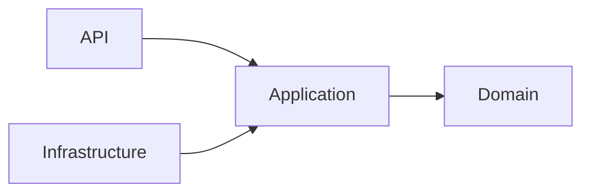
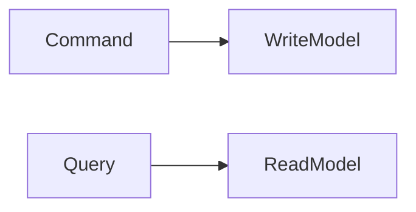
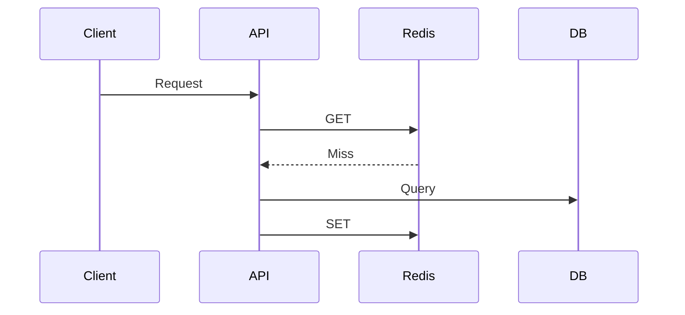
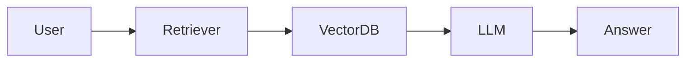

# Daily Knowledge Sharing — 17/08/2026

## Today’s Topics

1. Clean Architecture Dependency Rule
2. CQRS
3. REST API Idempotency
4. EF Core Query Optimization
5. Redis Cache Aside
6. Azure Service Bus
7. Azure Managed Identity
8. OpenTelemetry
9. RAG Architecture
10. Canary Deployment

---

# 1. Clean Architecture Dependency Rule

Clean Architecture đặt business logic ở trung tâm và dependency hướng vào domain.



Ví dụ ASP.NET Core dùng interface repository trong Application, EF Core nằm ở Infrastructure.

Sai lầm phổ biến là chỉ chia folder nhưng Controller vẫn chứa business rule.

Trade-off: dễ test, dễ thay đổi nhưng tăng abstraction.

Key takeaway: boundary quan trọng hơn cấu trúc folder.

---

# 2. CQRS

CQRS tách command xử lý ghi và query xử lý đọc.



Phù hợp khi hệ thống có read/write workload khác nhau.

Không nên áp dụng cho mọi CRUD đơn giản.

---

# 3. REST API Idempotency

Idempotency giúp request retry không tạo duplicate side effect.

Ví dụ payment API dùng Idempotency-Key để tránh charge hai lần.

Production cần lưu request state và xử lý duplicate delivery.

---

# 4. EF Core Query Optimization

EF Core cần đi cùng hiểu biết SQL.

Dùng projection để tránh load dữ liệu thừa:

```csharp
var items = await db.Products.Select(x => new { x.Id, x.Name }).ToListAsync();
```

Cần kiểm tra generated SQL, index và execution plan.

---

# 5. Redis Cache Aside

Flow:



Cần thiết kế TTL, invalidation và fallback khi Redis lỗi.

---

# 6. Azure Service Bus

Message broker giúp tách producer và consumer.

Production cần retry, dead-letter queue, duplicate handling và monitoring.

Trade-off: reliability cao hơn nhưng có eventual consistency.

---

# 7. Azure Managed Identity

Managed Identity loại bỏ việc lưu secret trong configuration.

App Service có thể truy cập Key Vault bằng identity được cấp quyền.

Cần quản lý RBAC và audit.

---

# 8. OpenTelemetry

OpenTelemetry kết nối logs, metrics và traces.

Giúp tìm bottleneck trong distributed system thay vì đoán.

Cần kiểm soát sampling và telemetry cost.

---

# 9. RAG Architecture

RAG kết hợp LLM với dữ liệu riêng.



Cần kiểm soát permission, embedding quality và prompt injection.

---

# 10. Canary Deployment

Canary triển khai version mới cho một nhóm nhỏ trước khi mở rộng.

Cần metrics, rollback nhanh và release strategy rõ ràng.

---

# Final Key Takeaways

- Senior engineering tập trung vào boundary và failure mode.
- Distributed system cần thiết kế cho retry và duplicate.
- AI production cần kết hợp model với deterministic control.
