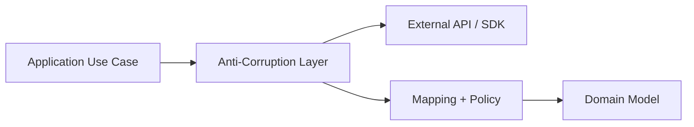
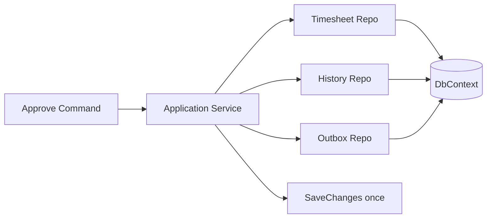
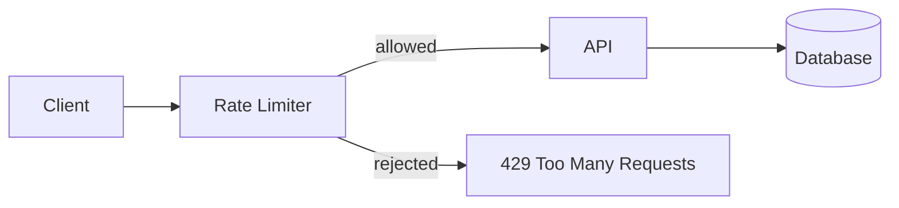
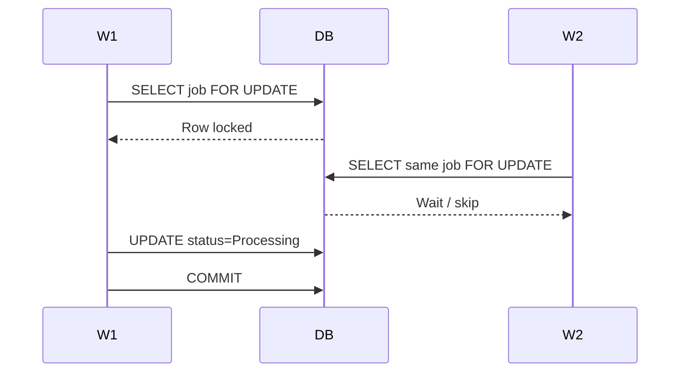
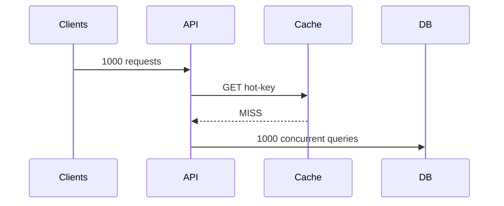
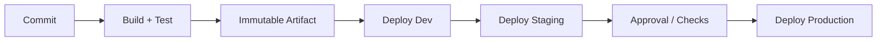
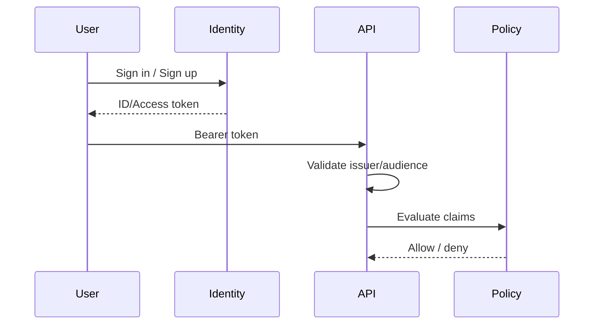
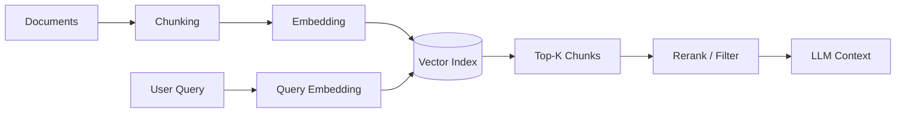
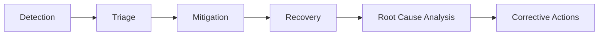

# Daily Knowledge Sharing — 17/08/2026

## Today’s Topics

1. DDD Anti-Corruption Layer — bảo vệ domain khỏi model của hệ thống ngoài
2. Unit of Work — transaction boundary và thay đổi nhiều aggregate trong .NET
3. API Rate Limiting — bảo vệ capacity mà không phá trải nghiệm client
4. PostgreSQL Locking — row lock, `FOR UPDATE` và contention trong production
5. Cache Stampede — single-flight, jitter TTL và bảo vệ database khi cache hết hạn
6. Azure DevOps Pipelines — thiết kế CI/CD có promotion, approvals và rollback
7. Microsoft Entra External ID / B2C-style identity — tách customer identity khỏi workforce identity
8. SLO & Error Budget — biến reliability thành quyết định kỹ thuật có thể đo được
9. Embeddings & Vector Search — retrieval pipeline, ranking và failure modes trong AI app
10. Incident Management — từ detection đến mitigation, recovery và post-incident learning

---

# 1. DDD Anti-Corruption Layer — bảo vệ domain khỏi model của hệ thống ngoài

### 1. What is it?

Anti-Corruption Layer (ACL) là một lớp chuyển đổi giữa domain của hệ thống và model/API của một hệ thống bên ngoài. Mục tiêu không phải chỉ “map DTO”, mà là ngăn khái niệm, naming và constraint của external system rò rỉ vào core business model.

Junior có thể hiểu ACL như một “phiên dịch viên”. Middle cần hiểu nó là boundary cho integration. Senior phải nhìn nó như cơ chế bảo vệ bounded context.

### 2. Why does it exist?

Giả sử Microsoft Graph trả về các object, trạng thái và lỗi theo cách riêng. Nếu application layer dùng trực tiếp Graph SDK types ở khắp nơi, domain dần bị phụ thuộc vào API ngoài. Khi SDK đổi version, mapping thay đổi hoặc business semantics khác với Graph semantics, change blast radius rất lớn.

Naive solution thường là gọi SDK trực tiếp trong service business. Cách này nhanh lúc đầu nhưng làm coupling tăng dần.

### 3. How does it work?



ACL làm ba việc chính:

1. Chuyển external request/response thành internal model.
2. Chuẩn hóa external error thành application/domain error.
3. Chuyển semantics khác biệt thành rule nội bộ.

### 4. Practical example

```csharp
public interface IEmployeeDirectory
{
    Task<DirectoryEmployee?> FindByEmailAsync(
        string email,
        CancellationToken ct);
}

public sealed class GraphEmployeeDirectory : IEmployeeDirectory
{
    private readonly GraphServiceClient _graph;

    public GraphEmployeeDirectory(GraphServiceClient graph)
    {
        _graph = graph;
    }

    public async Task<DirectoryEmployee?> FindByEmailAsync(
        string email,
        CancellationToken ct)
    {
        var users = await _graph.Users.GetAsync(config =>
        {
            config.QueryParameters.Filter = $"mail eq '{email}'";
            config.QueryParameters.Select =
                ["id", "displayName", "mail", "accountEnabled"];
        }, ct);

        var user = users?.Value?.SingleOrDefault();
        if (user is null) return null;

        return new DirectoryEmployee(
            user.Id!,
            user.DisplayName ?? email,
            user.Mail ?? email,
            user.AccountEnabled ?? false);
    }
}
```

Application chỉ biết `IEmployeeDirectory`, không biết Graph SDK.

### 5. Real production scenario

Employee offboarding cần disable account, đổi mailbox và lưu audit. Domain có thể dùng khái niệm `EmployeeDeactivated`, trong khi Entra ID chỉ có `accountEnabled=false`. ACL giúp giữ business language ổn định dù integration provider thay đổi.

### 6. Common mistakes

- Chỉ đổi tên file thành “Adapter” nhưng vẫn expose SDK types.
- Mapping 1:1 toàn bộ external schema vào domain.
- Retry, throttling và lỗi integration bị xử lý rải rác khắp business code.
- Cho external enum quyết định business enum trực tiếp.
- Tạo ACL khổng lồ chứa mọi integration không liên quan.

### 7. Trade-offs

**Advantages**

- Giảm coupling với vendor/API.
- Domain language rõ hơn.
- Dễ test và thay provider.
- Centralize mapping và error translation.

**Costs / Risks**

- Có thêm code mapping.
- Dễ tạo abstraction thừa nếu integration cực đơn giản.
- Cần giữ mapping logic đồng bộ khi external API thay đổi.

### 8. Junior → Middle → Senior understanding

**Junior**

Hiểu không nên dùng SDK type ở mọi layer.

**Middle**

Biết thiết kế interface theo business capability và implement adapter riêng.

**Senior / Technical Lead**

Xác định bounded context, semantics cần bảo vệ, migration strategy khi provider thay đổi và operational policy cho integration failure.

### 9. Key takeaway

- ACL bảo vệ business language khỏi vendor model.
- Abstraction nên mô tả capability nội bộ, không mirror SDK.
- External errors cần được translate thành contract ổn định.

---

# 2. Unit of Work — transaction boundary và thay đổi nhiều aggregate trong .NET

### 1. What is it?

Unit of Work (UoW) gom một nhóm thay đổi dữ liệu thành một transaction boundary logic. Trong EF Core, `DbContext` đã thực hiện phần lớn vai trò Unit of Work: track entity changes và `SaveChanges` chúng theo một transaction phù hợp.

### 2. Why does it exist?

Một business use case thường không chỉ cập nhật một row. Ví dụ approve timesheet có thể update timesheet status, insert history và enqueue outbox message. Nếu từng repository tự commit độc lập, hệ thống dễ rơi vào trạng thái nửa thành công.

### 3. How does it work?



Transaction boundary nên align với business consistency boundary.

### 4. Practical example

```csharp
public async Task ApproveAsync(Guid id, Guid approverId, CancellationToken ct)
{
    var timesheet = await _db.Timesheets
        .SingleAsync(x => x.Id == id, ct);

    timesheet.Approve(approverId);

    _db.TimesheetHistories.Add(
        TimesheetHistory.Approved(id, approverId));

    _db.OutboxMessages.Add(
        OutboxMessage.From(new TimesheetApproved(id)));

    await _db.SaveChangesAsync(ct);
}
```

Không cần tạo custom `IUnitOfWork` chỉ để wrap `DbContext.SaveChangesAsync` nếu abstraction không mang thêm giá trị.

### 5. Real production scenario

Trong payroll/timesheet, một approval phải update status và audit record cùng nhau. Nếu audit insert thất bại nhưng status đã commit, investigation sau này rất khó.

### 6. Common mistakes

- Mỗi repository gọi `SaveChanges` riêng.
- Một transaction kéo dài qua HTTP call tới external API.
- Tạo generic UoW abstraction nhưng vẫn leak EF Core behavior.
- Giữ `DbContext` quá lâu, gây tracking bloat.
- Dùng transaction để cố bao cả message broker/external service.

### 7. Trade-offs

**Advantages**

- Consistency rõ ràng.
- Ít partial commit.
- Business transaction dễ reasoning.

**Costs / Risks**

- Transaction càng lớn càng dễ lock contention.
- Cross-service consistency không thể giải quyết chỉ bằng UoW.
- Custom abstraction có thể làm EF Core khó dùng hơn.

### 8. Junior → Middle → Senior understanding

**Junior**

Hiểu `SaveChanges` là commit point quan trọng.

**Middle**

Biết đặt transaction boundary theo use case và tránh commit rải rác.

**Senior / Technical Lead**

Phân biệt local transaction với distributed workflow, cân bằng atomicity và contention, biết khi nào cần Outbox/Saga thay vì transaction dài.

### 9. Key takeaway

- Unit of Work là consistency boundary, không phải chỉ một interface.
- Trong EF Core, `DbContext` đã là UoW mạnh.
- Đừng kéo database transaction qua network call.

---

# 3. API Rate Limiting — bảo vệ capacity mà không phá trải nghiệm client

### 1. What is it?

Rate limiting giới hạn số lượng request một client có thể thực hiện trong một khoảng thời gian hoặc theo lượng tài nguyên tiêu thụ.

Mục tiêu không chỉ chống abuse; nó còn bảo vệ database, dependency, thread pool và external API quota.

### 2. Why does it exist?

Không có rate limit, một client lỗi loop, crawler, bot hoặc tenant lớn có thể chiếm toàn bộ capacity. Khi đó user bình thường cũng bị timeout.

### 3. How does it work?

Các chiến lược phổ biến: fixed window, sliding window, token bucket, concurrency limit.



### 4. Practical example

```csharp
builder.Services.AddRateLimiter(options =>
{
    options.AddFixedWindowLimiter("api", limiter =>
    {
        limiter.PermitLimit = 100;
        limiter.Window = TimeSpan.FromMinutes(1);
        limiter.QueueLimit = 0;
    });

    options.RejectionStatusCode = StatusCodes.Status429TooManyRequests;
});

app.UseRateLimiter();

app.MapGet("/reports", GetReports)
   .RequireRateLimiting("api");
```

Production thường cần partition theo user, tenant, API key hoặc IP chứ không dùng một bucket toàn hệ thống.

### 5. Real production scenario

Một reporting endpoint chạy query nặng. Một tenant gọi 500 lần/phút có thể làm SQL CPU đạt 100%. Rate limit theo tenant giúp giữ fairness và bảo vệ hệ thống.

### 6. Common mistakes

- Limit theo IP cho toàn bộ SaaS, làm user sau NAT ảnh hưởng nhau.
- Không trả `Retry-After` hoặc hướng dẫn retry.
- Limit quá thấp, phá legitimate burst.
- Chỉ rate-limit API gateway nhưng bỏ internal expensive endpoint.
- Không phân biệt read cheap và report expensive.

### 7. Trade-offs

**Advantages**

- Bảo vệ capacity.
- Fairness giữa tenant.
- Hạn chế abuse.

**Costs / Risks**

- Có thể reject legitimate traffic.
- Distributed rate limiter cần shared state.
- Partitioning sai gây trải nghiệm không công bằng.

### 8. Junior → Middle → Senior understanding

**Junior**

Biết 429 nghĩa là client đang vượt giới hạn.

**Middle**

Biết chọn limiter, partition key và trả retry hints.

**Senior / Technical Lead**

Thiết kế quota theo cost, tenant tier, SLO, downstream capacity và burst behavior.

### 9. Key takeaway

- Rate limit là capacity control, không chỉ anti-DDoS.
- Partition key quan trọng ngang threshold.
- Client cần contract rõ để retry đúng.

---

# 4. PostgreSQL Locking — row lock, `FOR UPDATE` và contention trong production

### 1. What is it?

PostgreSQL dùng MVCC để cho nhiều transaction đọc dữ liệu mà không block nhau trong nhiều trường hợp. Tuy nhiên write vẫn cần lock và một số workflow cần explicit row lock như `SELECT ... FOR UPDATE`.

### 2. Why does it exist?

Nếu hai worker cùng đọc một job `Pending`, cả hai có thể cùng xử lý nó. Optimistic concurrency có thể giải quyết, nhưng có trường hợp ta muốn lock row ngay khi claim work.

### 3. How does it work?



`SKIP LOCKED` rất hữu ích cho worker pool.

### 4. Practical example

```sql
BEGIN;

SELECT id, payload
FROM background_jobs
WHERE status = 'Pending'
ORDER BY created_at
FOR UPDATE SKIP LOCKED
LIMIT 10;

UPDATE background_jobs
SET status = 'Processing'
WHERE id = ANY(@ids);

COMMIT;
```

Mỗi worker claim batch khác nhau mà không chờ lock của worker khác.

### 5. Real production scenario

Notification worker có 20 instance cùng lấy email pending. Nếu chỉ `SELECT ... LIMIT 10` rồi update sau, nhiều worker có thể gửi trùng. `FOR UPDATE SKIP LOCKED` giúp phân chia work.

### 6. Common mistakes

- Giữ transaction mở trong lúc gọi external API.
- Lock quá nhiều row.
- Không có index cho điều kiện chọn job, khiến query scan lớn trong transaction.
- Không monitor blocked sessions.
- Nhầm MVCC nghĩa là “không bao giờ có lock”.

### 7. Trade-offs

**Advantages**

- Coordination đơn giản trong DB.
- Tránh duplicate processing trong queue table.
- `SKIP LOCKED` scale worker tốt.

**Costs / Risks**

- Transaction dài gây contention.
- Database trở thành coordination point.
- Không thay thế message broker cho mọi workload.

### 8. Junior → Middle → Senior understanding

**Junior**

Hiểu read/write concurrent có thể xung đột.

**Middle**

Biết khi nào dùng `FOR UPDATE`, timeout và `SKIP LOCKED`.

**Senior / Technical Lead**

Thiết kế transaction duration, contention model, worker scaling và quyết định DB queue vs message broker.

### 9. Key takeaway

- MVCC giảm lock contention nhưng không loại bỏ lock.
- Lock row càng ngắn càng tốt.
- `SKIP LOCKED` rất phù hợp worker claim pattern.

---

# 5. Cache Stampede — single-flight, jitter TTL và bảo vệ database khi cache hết hạn

### 1. What is it?

Cache stampede xảy ra khi một key hot hết hạn và hàng trăm request cùng lúc đều cache miss rồi cùng truy vấn database/backend.

### 2. Why does it exist?

Cache giúp giảm load, nhưng nếu nhiều key cùng hết hạn hoặc một key cực hot hết hạn, cache có thể biến từ protection layer thành trigger tạo traffic spike.

### 3. How does it work?



Mitigation phổ biến: single-flight/request coalescing, distributed lock, stale-while-revalidate, randomized TTL jitter.

### 4. Practical example

```csharp
private readonly ConcurrentDictionary<string, SemaphoreSlim> _locks = new();

public async Task<ProductDto> GetProductAsync(Guid id, CancellationToken ct)
{
    var key = $"product:{id}";
    var cached = await _cache.GetStringAsync(key, ct);
    if (cached is not null)
        return JsonSerializer.Deserialize<ProductDto>(cached)!;

    var gate = _locks.GetOrAdd(key, _ => new SemaphoreSlim(1, 1));
    await gate.WaitAsync(ct);

    try
    {
        cached = await _cache.GetStringAsync(key, ct);
        if (cached is not null)
            return JsonSerializer.Deserialize<ProductDto>(cached)!;

        var product = await _db.Products
            .AsNoTracking()
            .Where(x => x.Id == id)
            .Select(x => new ProductDto(x.Id, x.Name, x.Price))
            .SingleAsync(ct);

        var ttl = TimeSpan.FromSeconds(Random.Shared.Next(240, 360));
        await _cache.SetStringAsync(
            key,
            JsonSerializer.Serialize(product),
            new DistributedCacheEntryOptions
            {
                AbsoluteExpirationRelativeToNow = ttl
            }, ct);

        return product;
    }
    finally
    {
        gate.Release();
    }
}
```

Lưu ý `ConcurrentDictionary` chỉ bảo vệ một process; nhiều instance cần distributed coordination hoặc stale strategy.

### 5. Real production scenario

Homepage gọi một catalog key cực hot. Sau deploy, toàn bộ cache được flush, 30 instance cùng miss và database bị spike ngay dù traffic không tăng.

### 6. Common mistakes

- TTL giống nhau cho hàng nghìn key.
- Flush toàn bộ cache khi deploy.
- Dùng distributed lock nhưng lock timeout quá dài.
- Không có fallback nếu Redis unavailable.
- Cache dữ liệu cần consistency tuyệt đối.

### 7. Trade-offs

**Advantages**

- Giảm thundering herd.
- Bảo vệ DB khi cache hết hạn.
- Latency ổn định hơn.

**Costs / Risks**

- Coordination phức tạp.
- Stale-while-revalidate chấp nhận dữ liệu cũ.
- Distributed lock có failure mode riêng.

### 8. Junior → Middle → Senior understanding

**Junior**

Hiểu cache miss đồng thời có thể tạo load lớn.

**Middle**

Biết double-check locking, jitter TTL và fallback.

**Senior / Technical Lead**

Đánh giá herd risk theo traffic pattern, thiết kế stale policy, cache warm-up và multi-instance coordination.

### 9. Key takeaway

- Cache miss cũng là production event cần thiết kế.
- Randomize TTL để tránh mass expiration.
- Single-flight hiệu quả với hot key.

---

# 6. Azure DevOps Pipelines — thiết kế CI/CD có promotion, approvals và rollback

### 1. What is it?

Azure DevOps Pipelines là hệ thống automation cho build, test và deploy. Giá trị production không nằm ở YAML syntax mà ở cách tổ chức stages, artifacts, approvals và promotion giữa environments.

### 2. Why does it exist?

Deploy thủ công tạo drift, thiếu audit và dễ bỏ sót bước. Nhưng pipeline tự động hoàn toàn mà không có guardrail cũng có thể đưa lỗi vào production rất nhanh.

### 3. How does it work?



Nguyên tắc quan trọng: **build once, deploy many**. Không build lại artifact khác nhau cho staging và production.

### 4. Practical example

```yaml
stages:
- stage: Build
  jobs:
  - job: BuildApi
    steps:
    - script: dotnet test --configuration Release
    - script: dotnet publish src/Api -c Release -o $(Build.ArtifactStagingDirectory)
    - publish: $(Build.ArtifactStagingDirectory)
      artifact: api

- stage: Deploy_Staging
  dependsOn: Build
  jobs:
  - deployment: Deploy
    environment: staging
    strategy:
      runOnce:
        deploy:
          steps:
          - download: current
            artifact: api
```

Production có thể dùng environment checks/approval thay vì custom sleep hoặc manual script ngoài pipeline.

### 5. Real production scenario

Một .NET API deploy staging thành công, smoke test pass rồi promote đúng artifact sang production. Khi production lỗi, rollback về artifact SHA trước thay vì rebuild source cũ.

### 6. Common mistakes

- Build riêng cho từng environment.
- Secret nằm trong YAML.
- Không pin SDK/tool version.
- Production deploy trực tiếp từ branch mà không artifact traceability.
- Migration database destructive chạy trước khi app tương thích.

### 7. Trade-offs

**Advantages**

- Repeatability.
- Auditability.
- Faster release.
- Environment promotion rõ ràng.

**Costs / Risks**

- Pipeline phức tạp cần maintenance.
- Agent minutes/cost.
- Automation lỗi có thể khuếch đại impact.

### 8. Junior → Middle → Senior understanding

**Junior**

Hiểu CI build/test, CD deploy artifact.

**Middle**

Biết YAML stages, variables, artifacts và environment config.

**Senior / Technical Lead**

Thiết kế promotion, approvals, database migration compatibility, rollback và release governance.

### 9. Key takeaway

- Build một artifact duy nhất rồi promote.
- Pipeline phải có traceability và rollback path.
- Automation nhanh nhưng phải có guardrail.

---

# 7. Microsoft Entra External ID / B2C-style identity — tách customer identity khỏi workforce identity

### 1. What is it?

Customer identity khác workforce identity. Nhân viên nội bộ thường dùng Microsoft Entra tenant doanh nghiệp; customer/public user cần sign-up, social identity, password reset và lifecycle khác.

### 2. Why does it exist?

Nếu customer được tạo như employee account trong tenant nội bộ, permission boundary và lifecycle trở nên nguy hiểm. Workforce account mang semantics về organization membership mà external user không có.

### 3. How does it work?



API phải validate token issuer/audience đúng customer identity provider, không chỉ “token là JWT hợp lệ”.

### 4. Practical example

```csharp
builder.Services
    .AddAuthentication("Bearer")
    .AddJwtBearer("Bearer", options =>
    {
        options.Authority = builder.Configuration["Auth:Authority"];
        options.Audience = builder.Configuration["Auth:Audience"];
    });

builder.Services.AddAuthorization(options =>
{
    options.AddPolicy("PaidCustomer", policy =>
        policy.RequireClaim("subscription", "paid"));
});
```

Business claim như subscription tier có thể nằm trong app DB thay vì nhồi hết vào token nếu thay đổi thường xuyên.

### 5. Real production scenario

Một SaaS có employee admin portal và customer portal. Hai nhóm này không nên dùng chung permission model dù đều authenticate bằng Microsoft identity platform.

### 6. Common mistakes

- Dùng workforce tenant cho external customer không có governance rõ.
- Trust email domain thay cho authorization.
- Token lifetime quá dài với quyền nhạy cảm.
- Nhồi business state thay đổi liên tục vào JWT.
- Không phân biệt account deletion với business data retention.

### 7. Trade-offs

**Advantages**

- Boundary customer/workforce rõ.
- Self-service identity flow tốt hơn.
- Least privilege dễ enforce.

**Costs / Risks**

- Identity architecture phức tạp hơn.
- Token issuer/policy config cần quản lý kỹ.
- Migration user identity khó nếu thiết kế ID không ổn định.

### 8. Junior → Middle → Senior understanding

**Junior**

Hiểu login thành công chưa đủ để có quyền.

**Middle**

Biết validate JWT, issuer, audience và policies.

**Senior / Technical Lead**

Thiết kế identity boundary, tenant model, account lifecycle, claim freshness và regulatory requirements.

### 9. Key takeaway

- Customer identity và employee identity có lifecycle khác nhau.
- JWT validation phải kiểm tra issuer/audience.
- Business authorization không nên phụ thuộc hoàn toàn vào static token claims.

---

# 8. SLO & Error Budget — biến reliability thành quyết định kỹ thuật có thể đo được

### 1. What is it?

SLI là chỉ số đo reliability, ví dụ tỷ lệ request thành công hoặc p95 latency.

SLO là mục tiêu cho SLI, ví dụ 99.9% request thành công trong 30 ngày.

Error budget là phần failure được phép: nếu SLO là 99.9%, error budget là khoảng 0.1%.

### 2. Why does it exist?

“System phải luôn luôn available” không thực tế. Nếu team luôn ưu tiên reliability tuyệt đối, delivery chậm và cost tăng mạnh. Nếu chỉ ưu tiên feature, production incident tăng.

Error budget tạo ngôn ngữ chung giữa product và engineering.

### 3. How does it work?

```text
SLI: successful requests / total valid requests
SLO: 99.9% over 30 days
Error Budget: 0.1%

Budget healthy   -> có thể release nhanh hơn
Budget burning   -> giảm risk, tập trung reliability
Budget exhausted -> freeze risky changes, fix reliability
```

### 4. Practical example

Nếu API có 10,000,000 valid requests/tháng và SLO 99.95%, error budget là 5,000 failed requests.

Alert không nên chỉ dựa “error > 1% trong 1 phút”; nên theo burn rate để phát hiện tốc độ tiêu thụ budget bất thường.

### 5. Real production scenario

Timesheet API lỗi 0.05% đều đặn vẫn trong SLO. Nhưng nếu trong 30 phút error rate tăng lên 20%, burn rate rất cao và cần paging ngay dù tổng tháng chưa vượt budget.

### 6. Common mistakes

- SLO giống SLA mà không có engineering use.
- Chọn SLI không phản ánh user journey.
- Tính cả request invalid 4xx vào availability sai cách.
- Chỉ nhìn average latency.
- Đặt SLO 100% mà không có lý do business.

### 7. Trade-offs

**Advantages**

- Reliability có thể đo.
- Release decision grounded hơn.
- Alerting bớt cảm tính.

**Costs / Risks**

- Cần telemetry đáng tin.
- SLI definition sai dẫn đến quyết định sai.
- SLO quá nghiêm làm cost tăng.

### 8. Junior → Middle → Senior understanding

**Junior**

Biết SLI là measurement, SLO là target.

**Middle**

Biết xây dashboard và alert theo SLI.

**Senior / Technical Lead**

Chọn SLO theo business impact, dùng error budget cho release/risk decisions và capacity/reliability investment.

### 9. Key takeaway

- Reliability phải đo được.
- SLO không nên mặc định 100%.
- Error budget kết nối reliability với tốc độ delivery.

---

# 9. Embeddings & Vector Search — retrieval pipeline, ranking và failure modes trong AI app

### 1. What is it?

Embedding biến text thành vector số sao cho nội dung semantic gần nhau thường nằm gần nhau trong vector space. Vector search dùng similarity để tìm tài liệu liên quan với câu hỏi.

Embedding không “hiểu câu trả lời”; nó chỉ hỗ trợ retrieval.

### 2. Why does it exist?

Keyword search yếu khi user dùng từ khác với tài liệu. Ví dụ tài liệu ghi “employee termination”, user hỏi “offboarding staff”. Vector retrieval có thể tìm semantic similarity tốt hơn.

### 3. How does it work?



### 4. Practical example

```csharp
public sealed record SearchHit(
    string DocumentId,
    string Text,
    double Score);

public async Task<IReadOnlyList<SearchHit>> RetrieveAsync(
    string query,
    CancellationToken ct)
{
    var vector = await _embeddingClient.EmbedAsync(query, ct);

    return await _vectorStore.SearchAsync(
        vector,
        topK: 8,
        filter: new { TenantId = _tenant.Id },
        ct);
}
```

Security filter như `TenantId` phải enforce deterministic ở retrieval layer, không để LLM quyết định.

### 5. Real production scenario

AI assistant nội bộ trả lời policy HR. Nếu retrieval không filter theo tenant/department, model có thể nhận context mà user không được phép xem dù final answer chưa chắc hiển thị nguyên văn.

### 6. Common mistakes

- Chunk quá lớn hoặc quá nhỏ.
- Chỉ dùng top-k similarity mà không metadata filter.
- Không evaluate retrieval recall.
- Vectorize secret/sensitive data không có access model.
- Tin similarity score như confidence tuyệt đối.
- Không re-index khi tài liệu thay đổi.

### 7. Trade-offs

**Advantages**

- Semantic retrieval tốt.
- Hỗ trợ RAG trên knowledge lớn.
- Giảm context đưa vào model.

**Costs / Risks**

- Indexing/storage cost.
- Retrieval có false positive/false negative.
- Security filtering phức tạp.
- Cần evaluation chứ không chỉ demo thủ công.

### 8. Junior → Middle → Senior understanding

**Junior**

Hiểu embedding là vector representation, không phải database answer engine.

**Middle**

Biết chunk, embed, search, top-k và metadata filtering.

**Senior / Technical Lead**

Thiết kế evaluation set, tenant isolation, freshness pipeline, hybrid search, reranking và cost/latency budget.

### 9. Key takeaway

- Retrieval quality quyết định lớn đến RAG quality.
- Security filter phải deterministic.
- Similarity score không phải truth score.

---

# 10. Incident Management — từ detection đến mitigation, recovery và post-incident learning

### 1. What is it?

Incident Management là quy trình xử lý production disruption theo mục tiêu: phát hiện nhanh, giảm impact, phục hồi service và học từ nguyên nhân hệ thống.

### 2. Why does it exist?

Trong incident, áp lực cao làm team dễ debug hỗn loạn: nhiều người thay đổi cùng lúc, không ai giữ timeline, root cause chưa rõ nhưng đã deploy nhiều fix. Incident process tạo structure cho quyết định.

### 3. How does it work?



Trong incident thật, **mitigation trước, root cause sau** nếu user impact lớn.

### 4. Practical example

Incident: API latency p95 tăng từ 300ms lên 8s.

Checklist kỹ thuật:

```text
1. Check recent deployments
2. Check error rate + dependency latency
3. Check DB CPU, waits, locks, connection pool
4. Correlate trace IDs for slow requests
5. Disable risky feature flag / rollback if safe
6. Confirm recovery metrics
7. Preserve logs and timeline
```

Một rollback được xác nhận bằng metrics, không chỉ “deploy thành công”.

### 5. Real production scenario

Một EF Core query mới tạo N+1 và làm SQL connection pool cạn. Symptom là API timeout, nhưng root cause nằm ở database access pattern. Incident commander có thể rollback release trước, rồi team mới phân tích query chi tiết.

### 6. Common mistakes

- Root-cause hunting quá sớm trong khi user vẫn bị ảnh hưởng.
- Nhiều người cùng deploy thay đổi không coordination.
- Không ghi timeline.
- Tắt alert thay vì fix noise source.
- Postmortem chỉ đổ lỗi cá nhân.
- Action item mơ hồ như “cẩn thận hơn”.

### 7. Trade-offs

**Advantages**

- Recovery nhanh và có tổ chức.
- Giảm thay đổi hỗn loạn.
- Tạo feedback loop cho reliability.

**Costs / Risks**

- Process quá nặng với incident nhỏ gây overhead.
- On-call và observability có chi phí.
- Postmortem không tạo giá trị nếu action items không được follow-up.

### 8. Junior → Middle → Senior understanding

**Junior**

Biết thu thập evidence, không thay đổi production tùy tiện.

**Middle**

Biết dùng logs/metrics/traces, rollback và xác nhận recovery.

**Senior / Technical Lead**

Điều phối incident, ưu tiên mitigation, ra quyết định rollback/feature disable, quản lý communication và biến root cause thành system improvement.

### 9. Key takeaway

- Trong incident lớn: giảm impact trước, tìm root cause sau.
- Mọi thay đổi cần owner và timeline.
- Recovery phải được xác nhận bằng telemetry.
- Postmortem tốt tập trung vào system conditions và corrective actions.