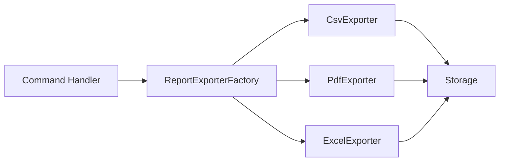
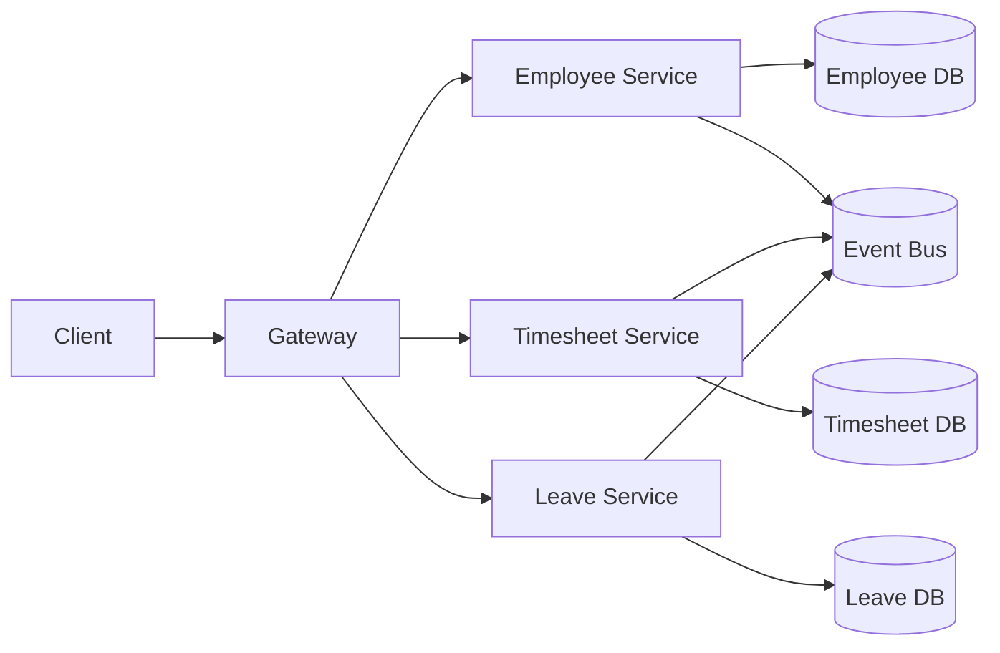
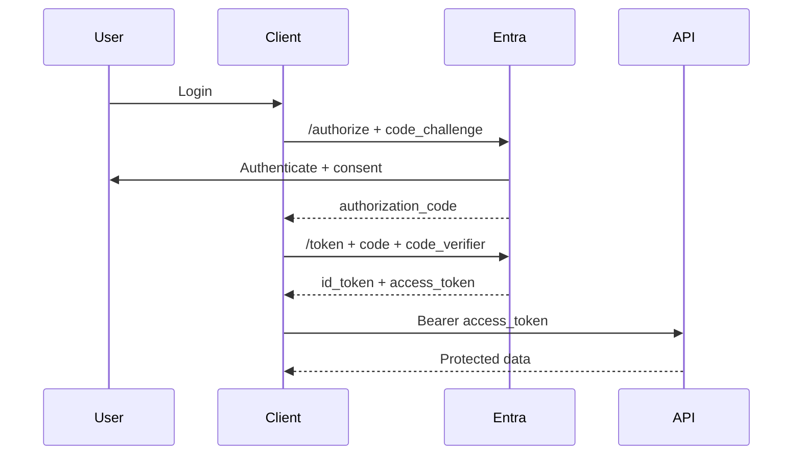
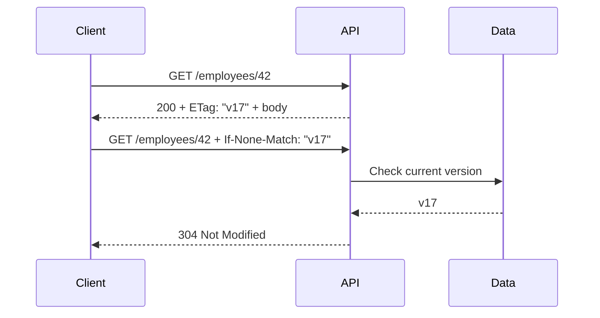
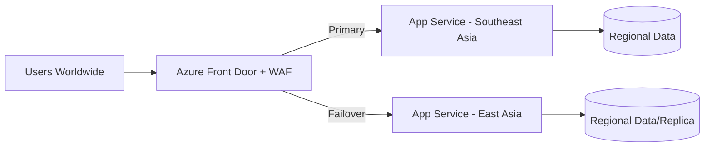
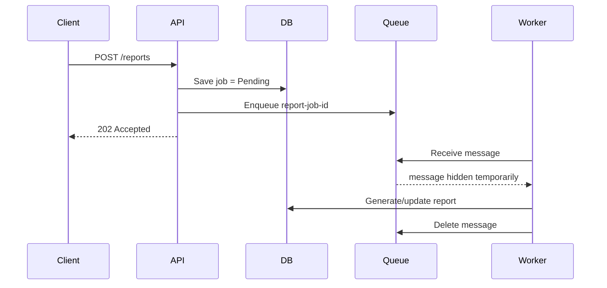
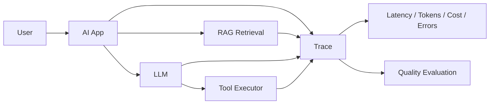
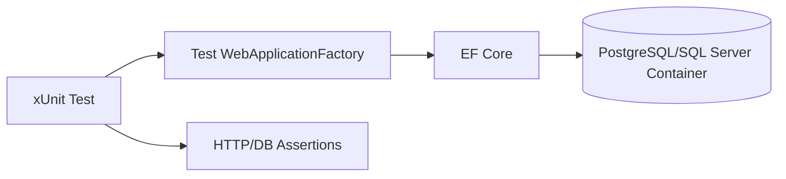

# Daily Knowledge Sharing — 17/08/2026

## Today’s Topics

1. Factory Pattern — tạo object theo capability thay vì rải `new` và `switch` khắp codebase
2. Microservices — service boundary, database ownership và tránh distributed monolith
3. OpenID Connect Authorization Code + PKCE — đăng nhập người dùng an toàn cho web/mobile
4. EF Core Split Query — kiểm soát Cartesian explosion khi load nhiều collection
5. HTTP Caching với ETag — giảm bandwidth và database load bằng conditional requests
6. Azure Front Door — global entry point, WAF, failover và bảo vệ origin
7. Azure Storage Queue — background workload đơn giản với at-least-once delivery
8. Health Checks — readiness, liveness và dependency health trong production
9. AI Observability & Evaluation — đo chất lượng, latency, token cost và failure của LLM workflow
10. Integration Testing với Testcontainers — kiểm thử thật với SQL/PostgreSQL/Redis thay vì mock quá mức

---

# 1. Factory Pattern — tạo object theo capability thay vì rải `new` và `switch` khắp codebase

### 1. What is it?

Factory Pattern là cách gom logic **khởi tạo hoặc lựa chọn implementation** vào một điểm có trách nhiệm rõ ràng.

Junior có thể hiểu đơn giản: thay vì mọi nơi tự quyết định `new ForwardHandler()`, `new DelegateHandler()` hay `new DeleteHandler()`, application hỏi một factory: “với loại hành động này, tôi cần implementation nào?”.

Ở mức sâu hơn, factory giúp tách **decision về construction** khỏi business flow. Điều này đặc biệt hữu ích khi object cần dependency, configuration hoặc lựa chọn implementation theo runtime context.

### 2. Why does it exist?

Codebase thường bắt đầu như sau:

```csharp
if (type == "Sql")
    service = new SqlReportService(...);
else if (type == "Csv")
    service = new CsvReportService(...);
else if (type == "Pdf")
    service = new PdfReportService(...);
```

Vấn đề xuất hiện khi logic này được copy sang nhiều controller, background job và command handler. Khi thêm loại mới, phải sửa nhiều nơi.

Naive solution là thêm `switch` ở mỗi caller. Factory tồn tại để biến quyết định “tạo cái gì” thành một responsibility riêng.

### 3. How does it work?



Caller biết abstraction `IReportExporter`; factory biết mapping giữa `ExportFormat` và concrete implementation.

### 4. Practical example

```csharp
public enum ExportFormat
{
    Csv,
    Pdf,
    Excel
}

public interface IReportExporter
{
    ExportFormat Format { get; }
    Task<byte[]> ExportAsync(ReportModel model, CancellationToken ct);
}

public sealed class ReportExporterFactory
{
    private readonly IReadOnlyDictionary<ExportFormat, IReportExporter> _exporters;

    public ReportExporterFactory(IEnumerable<IReportExporter> exporters)
    {
        _exporters = exporters.ToDictionary(x => x.Format);
    }

    public IReportExporter Create(ExportFormat format)
        => _exporters.TryGetValue(format, out var exporter)
            ? exporter
            : throw new NotSupportedException($"Unsupported format: {format}");
}
```

ASP.NET Core DI vẫn chịu trách nhiệm construction thật; factory chịu trách nhiệm **selection**.

### 5. Real production scenario

Một hệ thống timesheet cho phép xuất báo cáo CSV, Excel và PDF. Mỗi exporter có library, memory behavior và validation riêng.

Nếu controller tự `switch` format, cùng logic sẽ lặp lại ở API export, scheduled report và email attachment job. Factory giúp tất cả caller dùng cùng một mapping và cùng behavior.

### 6. Common mistakes

- Tạo factory cho object rất đơn giản không có variation.
- Factory chứa cả business logic, database query và mapping, biến thành god service.
- Dùng service locator như `IServiceProvider.GetService()` ở khắp nơi rồi gọi đó là factory.
- Mapping bằng magic string dễ typo.
- Factory trả `object` thay vì abstraction mạnh kiểu.
- Mỗi concrete class tự quyết định transaction/lifetime không nhất quán.

### 7. Trade-offs

**Advantages**

- Centralize construction/selection logic.
- Dễ thêm implementation mới.
- Caller phụ thuộc abstraction, giảm coupling.
- Dễ test mapping.

**Costs / Risks**

- Thêm một lớp abstraction và class.
- Có thể overengineering với code nhỏ.
- Factory quá thông minh có thể che giấu dependency graph khó hiểu.

### 8. Junior → Middle → Senior understanding

**Junior**

Hiểu factory giải quyết việc “chọn/tạo implementation nào”.

**Middle**

Biết kết hợp factory với DI, enum/typed key và unit test mapping.

**Senior / Technical Lead**

Biết phân biệt Factory, Strategy và DI container; quyết định khi abstraction đáng giá và tránh service locator anti-pattern.

### 9. Key takeaway

- Factory nên quản lý construction/selection, không gánh business logic.
- Ưu tiên strongly typed key thay magic string.
- Chỉ dùng khi creation/selection có variation thực sự.

---

# 2. Microservices — service boundary, database ownership và tránh distributed monolith

### 1. What is it?

Microservices là kiến trúc chia hệ thống thành các service có **business capability, deployment lifecycle và data ownership** tương đối độc lập.

Điểm quan trọng không phải “nhiều API project”. Một hệ thống có 20 API nhưng tất cả cùng dùng một database và gọi synchronous lẫn nhau cho mọi request thường là một distributed monolith.

### 2. Why does it exist?

Monolith lớn có thể gặp các vấn đề như:

- Deployment một module buộc deploy toàn hệ thống.
- Team ownership chồng chéo.
- Một workload cần scale kéo cả app cùng scale.
- Fault isolation kém.

Microservices giải quyết bằng cách tạo boundary độc lập. Nhưng nếu boundary sai, ta đổi coupling trong process thành coupling qua network — đắt hơn và khó debug hơn.

### 3. How does it work?



Nguyên tắc quan trọng: service A không đọc trực tiếp table của service B. Nếu cần data, dùng API hoặc event/materialized view tùy consistency requirement.

### 4. Practical example

Thay vì Timesheet Service query trực tiếp `Employee` table:

```csharp
// Không nên trong microservice boundary
var employee = await employeeDb.Employees
    .SingleAsync(x => x.Id == employeeId, ct);
```

Timesheet có thể giữ snapshot cần thiết từ event:

```csharp
public sealed record EmployeeProfileUpdated(
    Guid EmployeeId,
    string DisplayName,
    string OfficeCode);

public async Task HandleAsync(EmployeeProfileUpdated message, CancellationToken ct)
{
    var snapshot = await _db.EmployeeSnapshots
        .SingleOrDefaultAsync(x => x.EmployeeId == message.EmployeeId, ct);

    if (snapshot is null)
        _db.EmployeeSnapshots.Add(new EmployeeSnapshot(message.EmployeeId));

    snapshot!.DisplayName = message.DisplayName;
    snapshot.OfficeCode = message.OfficeCode;

    await _db.SaveChangesAsync(ct);
}
```

### 5. Real production scenario

Employee Management và Timesheet có lifecycle khác nhau. Timesheet cần employee name và office để hiển thị, nhưng không cần toàn bộ employee profile.

Nếu Timesheet gọi Employee API cho từng row trong report 10.000 entries, latency và availability bị coupling. Một local read model cập nhật qua event có thể phù hợp hơn.

### 6. Common mistakes

- Chia service theo table thay vì business capability.
- Shared database và cross-service join.
- Mọi request cần gọi 5–10 service synchronous.
- Shared domain library khiến service deploy độc lập nhưng code vẫn coupling chặt.
- Không có tracing/correlation ID.
- Không thiết kế eventual consistency và duplicate message.
- Chọn microservices trước khi có organizational/scale need.

### 7. Trade-offs

**Advantages**

- Independent deployment và scaling.
- Fault isolation tốt hơn nếu boundary đúng.
- Team ownership rõ.
- Cho phép technology choice khác nhau khi cần.

**Costs / Risks**

- Network failure, retries, latency và distributed tracing.
- Eventual consistency.
- Operational overhead lớn.
- Debug và local development khó hơn.

### 8. Junior → Middle → Senior understanding

**Junior**

Hiểu microservice không đơn giản là tách controller thành nhiều project.

**Middle**

Biết API integration, message processing, idempotency và service-owned database.

**Senior / Technical Lead**

Phải xác định boundary theo domain, đánh giá team topology, consistency, operational maturity và quyết định liệu Modular Monolith có tốt hơn hay không.

### 9. Key takeaway

- Data ownership là dấu hiệu quan trọng của service boundary.
- Shared database thường phá independence.
- Microservices chỉ đáng giá khi lợi ích vượt distributed-system cost.

---

# 3. OpenID Connect Authorization Code + PKCE — đăng nhập người dùng an toàn cho web/mobile

### 1. What is it?

OAuth 2.0 chủ yếu nói về **delegated authorization**. OpenID Connect (OIDC) bổ sung identity layer để application biết user là ai thông qua `id_token`.

Authorization Code + PKCE là flow phổ biến cho browser/mobile application: client không nhận token trực tiếp từ authorization endpoint mà nhận một authorization code ngắn hạn, sau đó đổi code lấy token bằng `code_verifier`.

### 2. Why does it exist?

Implicit flow từng trả token trực tiếp qua browser URL, làm tăng rủi ro token exposure.

PKCE tồn tại để giảm nguy cơ kẻ khác đánh cắp authorization code và đổi code lấy token. Chỉ client giữ `code_verifier` mới hoàn thành exchange.

### 3. How does it work?



`id_token` dành cho client hiểu identity; `access_token` dành cho resource server/API.

### 4. Practical example

ASP.NET Core web app có thể dùng OIDC middleware:

```csharp
builder.Services
    .AddAuthentication(options =>
    {
        options.DefaultScheme = "Cookies";
        options.DefaultChallengeScheme = "oidc";
    })
    .AddCookie("Cookies")
    .AddOpenIdConnect("oidc", options =>
    {
        options.Authority = builder.Configuration["Auth:Authority"];
        options.ClientId = builder.Configuration["Auth:ClientId"];
        options.ClientSecret = builder.Configuration["Auth:ClientSecret"];
        options.ResponseType = "code";
        options.UsePkce = true;
        options.SaveTokens = false;
    });
```

Secret chỉ phù hợp confidential client; SPA/mobile không thể giữ secret an toàn.

### 5. Real production scenario

Một employee portal login qua Microsoft Entra ID. User authenticate ở Entra, portal nhận identity và dùng access token để gọi backend API.

Backend phải validate issuer, audience, signature và expiry. Backend không nên coi `id_token` như access token cho API.

### 6. Common mistakes

- Dùng `id_token` để authorize API.
- Không validate audience/issuer.
- Store access token trong `localStorage` mà không đánh giá XSS risk.
- Hard-code client secret trong frontend.
- Request scope quá rộng.
- Không hiểu refresh token lifecycle.
- Dùng role/claim cũ quá lâu mà không có revocation/freshness strategy.

### 7. Trade-offs

**Advantages**

- Standardized login flow.
- Tách identity provider khỏi application.
- PKCE giảm code interception risk.

**Costs / Risks**

- Token/session lifecycle phức tạp.
- Redirect URI và consent configuration dễ sai.
- Authorization vẫn phải thiết kế riêng ở backend.

### 8. Junior → Middle → Senior understanding

**Junior**

Hiểu authentication khác authorization, access token khác ID token.

**Middle**

Biết cấu hình OIDC, PKCE, scopes, token validation và 401/403.

**Senior / Technical Lead**

Thiết kế trust boundary, token lifetime, refresh strategy, tenant policy, session revocation và least privilege.

### 9. Key takeaway

- OIDC trả lời “user là ai”; OAuth access token cho phép gọi resource.
- Authorization Code + PKCE là lựa chọn an toàn cho interactive login hiện đại.
- API phải validate token độc lập với frontend.

---

# 4. EF Core Split Query — kiểm soát Cartesian explosion khi load nhiều collection

### 1. What is it?

Khi EF Core load nhiều collection bằng `Include`, một single SQL query có thể tạo Cartesian explosion: mỗi combination của child rows làm parent data bị lặp lại nhiều lần.

`AsSplitQuery()` yêu cầu EF Core tách việc load graph thành nhiều SQL query thay vì một query join khổng lồ.

### 2. Why does it exist?

Ví dụ một Project có 100 Employees và 50 Tags. Join hai collection có thể tạo 5.000 rows cho một project dù thực tế chỉ có 151 entity rows liên quan.

Network payload, materialization CPU và memory tăng mạnh.

### 3. How does it work?

Single query:

```text
Project
  JOIN Employees
  JOIN Tags
      ↓
100 × 50 = 5,000 rows
```

Split query:

```text
SELECT Project
SELECT Employees WHERE ProjectId IN (...)
SELECT Tags      WHERE ProjectId IN (...)
```

EF Core ghép kết quả trong memory dựa trên key.

### 4. Practical example

```csharp
var projects = await _db.Projects
    .AsNoTracking()
    .Include(x => x.Employees)
    .Include(x => x.Tags)
    .AsSplitQuery()
    .Where(x => x.IsActive)
    .ToListAsync(ct);
```

Tuy nhiên, nếu chỉ cần projection thì thường tốt hơn cả `Include`:

```csharp
var projects = await _db.Projects
    .AsNoTracking()
    .Where(x => x.IsActive)
    .Select(x => new ProjectSummary
    {
        Id = x.Id,
        Name = x.Name,
        EmployeeCount = x.Employees.Count,
        TagNames = x.Tags.Select(t => t.Name).ToList()
    })
    .ToListAsync(ct);
```

### 5. Real production scenario

Một admin page load project + members + permissions + tags. Single join trả hàng chục nghìn rows và API p95 tăng từ 300 ms lên vài giây.

Sau khi đo SQL execution và payload, team chuyển sang projection hoặc split query, giảm lượng duplicated data đáng kể.

### 6. Common mistakes

- Thấy query chậm là bật `AsSplitQuery()` mọi nơi.
- Load toàn entity graph khi response chỉ cần 5 field.
- Không dùng `AsNoTracking()` cho read-only query.
- Không đo số SQL round trips.
- Pagination trên graph phức tạp mà không kiểm tra ordering semantics.
- Dùng split query nhưng database latency cao, khiến nhiều round trips tệ hơn.

### 7. Trade-offs

**Advantages**

- Giảm duplicated rows và memory pressure.
- Tránh Cartesian explosion.
- Query SQL nhỏ, dễ đọc hơn.

**Costs / Risks**

- Nhiều round trips DB hơn.
- Data có thể thay đổi giữa các query nếu isolation không bảo đảm snapshot phù hợp.
- Projection thường vẫn hiệu quả hơn nếu chỉ cần DTO.

### 8. Junior → Middle → Senior understanding

**Junior**

Hiểu `Include` không miễn phí; SQL thực tế mới quyết định chi phí.

**Middle**

Biết xem generated SQL, dùng projection, `AsNoTracking`, split query và benchmark.

**Senior / Technical Lead**

Quyết định read model, query shape, isolation requirement và trade-off network round trips vs payload duplication.

### 9. Key takeaway

- `Include` nhiều collection có thể nhân số row rất lớn.
- Projection là lựa chọn đầu tiên cho API read model.
- Split query là công cụ, không phải default optimization.

---

# 5. HTTP Caching với ETag — giảm bandwidth và database load bằng conditional requests

### 1. What is it?

ETag là một validator đại diện cho version của representation HTTP. Client có thể gửi `If-None-Match`; nếu resource chưa đổi, server trả `304 Not Modified` mà không cần gửi lại body.

### 2. Why does it exist?

Nhiều API GET trả payload giống hệt nhau hàng nghìn lần. Nếu mỗi request luôn serialize JSON lớn và truyền qua network, ta lãng phí CPU, bandwidth và client parsing.

TTL cache thuần túy có thể trả stale data. Conditional request cho client xác nhận với server rằng cached representation vẫn hợp lệ.

### 3. How does it work?



ETag có thể derive từ rowversion, update timestamp hoặc content hash, miễn là semantics ổn định.

### 4. Practical example

```csharp
[HttpGet("employees/{id:guid}")]
public async Task<IActionResult> Get(Guid id, CancellationToken ct)
{
    var employee = await _db.Employees
        .AsNoTracking()
        .Where(x => x.Id == id)
        .Select(x => new
        {
            x.Id,
            x.DisplayName,
            x.Email,
            x.RowVersion
        })
        .SingleOrDefaultAsync(ct);

    if (employee is null)
        return NotFound();

    var etag = $"\"{Convert.ToBase64String(employee.RowVersion)}\"";

    if (Request.Headers.IfNoneMatch == etag)
        return StatusCode(StatusCodes.Status304NotModified);

    Response.Headers.ETag = etag;
    return Ok(employee);
}
```

### 5. Real production scenario

Mobile app load employee profile mỗi lần mở màn hình. Profile thay đổi vài lần mỗi tháng nhưng user mở hàng chục lần/ngày.

ETag giúp phần lớn request trả 304 rất nhỏ thay vì body JSON đầy đủ. Nếu đặt CDN/reverse proxy đúng cách, lợi ích còn lớn hơn.

### 6. Common mistakes

- ETag thay đổi mỗi request vì dựa trên giá trị nondeterministic.
- Hash toàn body rất lớn dù chi phí hash gần bằng serialize.
- Dùng ETag nhưng vẫn execute query cực đắt để tính version.
- Không phân biệt private data và shared/public cache.
- Cache response chứa dữ liệu user A cho user B.
- Không thiết kế invalidation/version semantics.

### 7. Trade-offs

**Advantages**

- Giảm response body và bandwidth.
- Giữ freshness tốt hơn fixed TTL.
- Hỗ trợ optimistic concurrency nếu dùng `If-Match` phù hợp.

**Costs / Risks**

- Server vẫn có thể phải kiểm tra version.
- Cache semantics phức tạp khi data personalized.
- Proxy/CDN behavior cần cấu hình đúng.

### 8. Junior → Middle → Senior understanding

**Junior**

Hiểu 304 không phải lỗi; nó có nghĩa client cache vẫn dùng được.

**Middle**

Biết generate stable ETag, xử lý `If-None-Match`, `Cache-Control` và security boundary.

**Senior / Technical Lead**

Thiết kế cache policy theo resource, CDN/proxy, data sensitivity, consistency và invalidation cost.

### 9. Key takeaway

- ETag cho phép revalidate cache thay vì luôn download lại body.
- Validator phải ổn định và rẻ.
- Personalized data cần cache policy rất cẩn thận.

---

# 6. Azure Front Door — global entry point, WAF, failover và bảo vệ origin

### 1. What is it?

Azure Front Door là global Layer-7 entry point cho HTTP/HTTPS traffic. Nó có thể route theo hostname/path, terminate TLS, áp WAF, health probe backend và chuyển traffic giữa nhiều origin/region.

### 2. Why does it exist?

Nếu client truy cập trực tiếp App Service ở một region, user ở xa có latency cao và khi region lỗi cần DNS/failover handling riêng.

Front Door cung cấp một global endpoint và routing layer phía trước origin.

### 3. How does it work?



Health probe quyết định origin nào healthy. WAF chặn pattern độc hại trước khi request tới application.

### 4. Practical example

Một setup có thể định tuyến:

```text
api.example.com/*    -> API origin group
static.example.com/* -> Storage/CDN origin group
```

Application nên chỉ tin forwarded headers từ trusted proxy chain:

```csharp
builder.Services.Configure<ForwardedHeadersOptions>(options =>
{
    options.ForwardedHeaders =
        ForwardedHeaders.XForwardedFor |
        ForwardedHeaders.XForwardedProto;
});
```

Ngoài ra nên hạn chế direct origin access bằng private networking hoặc origin access controls phù hợp kiến trúc.

### 5. Real production scenario

SaaS có khách ở châu Á và châu Âu. Front Door route người dùng tới origin phù hợp, cache static content và failover khi một origin unhealthy.

Nhưng nếu database chỉ có một region, failover web tier chưa đủ. Kiến trúc DR phải bao gồm data tier.

### 6. Common mistakes

- Nghĩ Front Door tự động làm database multi-region.
- Origin vẫn mở public và bypass được WAF.
- Health probe chỉ check `/` trả 200 dù database/service critical đã chết.
- Cache API personalized sai cách.
- Không preserve client IP/protocol đúng cách.
- WAF rule quá chặt gây false positive hoặc quá lỏng không có giá trị.

### 7. Trade-offs

**Advantages**

- Global routing và failover.
- WAF ở edge.
- TLS/caching/routing tập trung.
- Cải thiện latency cho global users.

**Costs / Risks**

- Thêm network hop và chi phí.
- Configuration phức tạp hơn.
- Sai cache/routing rule có blast radius lớn.

### 8. Junior → Middle → Senior understanding

**Junior**

Hiểu Front Door nằm trước application, không thay thế App Service hay database.

**Middle**

Biết origin group, health probe, WAF, routing và forwarded headers.

**Senior / Technical Lead**

Thiết kế multi-region failover, origin protection, data DR, RTO/RPO và cost model.

### 9. Key takeaway

- Front Door giải quyết global HTTP entry/routing, không tự giải quyết data resilience.
- WAF chỉ có giá trị nếu origin không dễ bị bypass.
- Health probe phải phản ánh khả năng phục vụ traffic thực.

---

# 7. Azure Storage Queue — background workload đơn giản với at-least-once delivery

### 1. What is it?

Azure Storage Queue là message queue đơn giản trong Azure Storage, phù hợp với asynchronous background workload không cần nhiều broker feature phức tạp.

Message consumer nhận message, xử lý rồi delete. Nếu không delete trước visibility timeout, message có thể xuất hiện lại.

### 2. Why does it exist?

Nếu API xử lý file, gửi email hoặc generate report ngay trong HTTP request, latency cao và client phụ thuộc trực tiếp vào downstream workload.

Queue tách request acceptance khỏi background processing.

### 3. How does it work?



Nếu worker crash trước delete, visibility timeout hết và message được delivery lại — vì vậy handler phải idempotent.

### 4. Practical example

```csharp
public async Task EnqueueReportAsync(Guid reportJobId, CancellationToken ct)
{
    var payload = JsonSerializer.Serialize(new
    {
        ReportJobId = reportJobId
    });

    await _queueClient.SendMessageAsync(
        BinaryData.FromString(payload),
        cancellationToken: ct);
}
```

Consumer:

```csharp
if (await _db.ReportJobs.AnyAsync(
        x => x.Id == jobId && x.Status == ReportStatus.Completed, ct))
{
    return; // idempotent short-circuit
}
```

### 5. Real production scenario

User upload file import 100.000 employee records. API lưu metadata và enqueue job, trả `202 Accepted`. Worker xử lý file độc lập, cập nhật progress.

Nếu worker restart, message được nhận lại và tiếp tục/khôi phục dựa trên persisted job state.

### 6. Common mistakes

- Giả định message chỉ delivery đúng một lần.
- Không thiết kế poison message handling.
- Payload quá lớn thay vì lưu file/data ở Blob và queue chỉ chứa reference.
- Không monitor queue depth và oldest-message age.
- Visibility timeout ngắn hơn processing time nhưng không renew.
- Dùng Storage Queue khi cần ordering/session/transaction semantics mạnh của Service Bus.

### 7. Trade-offs

**Advantages**

- Đơn giản, chi phí thấp.
- Tích hợp tốt với Azure Functions/Workers.
- Phù hợp workload background cơ bản.

**Costs / Risks**

- Feature set ít hơn Service Bus.
- At-least-once yêu cầu idempotency.
- Complex routing/workflow không phải thế mạnh.

### 8. Junior → Middle → Senior understanding

**Junior**

Hiểu queue giúp tách HTTP request khỏi background work.

**Middle**

Biết visibility timeout, retry, poison message và idempotent handler.

**Senior / Technical Lead**

Quyết định Storage Queue vs Service Bus, throughput, failure recovery, monitoring và operational semantics.

### 9. Key takeaway

- Queue consumer phải chịu được duplicate delivery.
- Message nên nhỏ; dữ liệu lớn lưu ở Blob/DB.
- Chọn Service Bus khi cần richer messaging guarantees/features.

---

# 8. Health Checks — readiness, liveness và dependency health trong production

### 1. What is it?

Health check là endpoint hoặc probe cho biết application có đang sống và có sẵn sàng phục vụ traffic hay không.

Hai khái niệm quan trọng:

- **Liveness**: process có sống không?
- **Readiness**: process có thể phục vụ request hợp lệ không?

### 2. Why does it exist?

Nếu load balancer chỉ nhìn process còn chạy, nó có thể gửi traffic vào instance đang mất database connection, chưa warm-up hoặc dependency critical chưa sẵn sàng.

Ngược lại, nếu liveness phụ thuộc database, một DB outage có thể khiến orchestration restart toàn bộ app liên tục và làm incident nặng hơn.

### 3. How does it work?

```mermaid
flowchart LR
    LB[Load Balancer] --> READY[/health/ready]
    ORCH[Orchestrator] --> LIVE[/health/live]
    READY --> DB[(Database)]
    READY --> CACHE[(Critical Cache?)]
    LIVE --> APP[Process/Event Loop]
```

Readiness có thể check critical dependencies; liveness nên rất nhẹ.

### 4. Practical example

```csharp
builder.Services.AddHealthChecks()
    .AddSqlServer(
        builder.Configuration.GetConnectionString("Sql")!,
        name: "sql",
        tags: new[] { "ready" })
    .AddCheck("self", () => HealthCheckResult.Healthy(),
        tags: new[] { "live" });

app.MapHealthChecks("/health/live", new HealthCheckOptions
{
    Predicate = r => r.Tags.Contains("live")
});

app.MapHealthChecks("/health/ready", new HealthCheckOptions
{
    Predicate = r => r.Tags.Contains("ready")
});
```

### 5. Real production scenario

Một App Service instance deploy version mới. Process đã start nhưng EF migration/warm-up chưa xong. Nếu traffic đến ngay, request fail.

Readiness giữ instance ngoài rotation cho tới khi nó sẵn sàng.

### 6. Common mistakes

- Liveness gọi database/external API.
- Health check thực hiện query nặng.
- Check mọi dependency kể cả optional service, khiến app bị đánh unhealthy vô ích.
- Expose health endpoint public kèm secret/internal detail.
- Không set timeout cho dependency check.
- Health endpoint luôn trả 200 dù dependency critical fail.

### 7. Trade-offs

**Advantages**

- Load balancer/orchestrator có tín hiệu tốt hơn.
- Hỗ trợ zero-downtime deployment.
- Phát hiện dependency failure sớm.

**Costs / Risks**

- Health check kém thiết kế gây traffic flapping/restart loop.
- Dependency check tạo thêm load.
- “Healthy” không đồng nghĩa toàn bộ business flow đúng.

### 8. Junior → Middle → Senior understanding

**Junior**

Hiểu liveness và readiness khác nhau.

**Middle**

Biết cấu hình ASP.NET Core Health Checks, timeout và dependency classification.

**Senior / Technical Lead**

Thiết kế probe semantics phù hợp load balancer/orchestrator, tránh restart storm và liên kết với SLO/alerting.

### 9. Key takeaway

- Liveness hỏi “process còn sống?”, readiness hỏi “có nhận traffic được không?”.
- Không để liveness phụ thuộc external systems.
- Health check phải nhẹ, có timeout và phản ánh dependency critical thực sự.

---

# 9. AI Observability & Evaluation — đo chất lượng, latency, token cost và failure của LLM workflow

### 1. What is it?

AI observability là khả năng theo dõi một LLM workflow bằng telemetry: request latency, model, token input/output, tool calls, retrieval results, retries, errors và cost.

Evaluation bổ sung lớp đo **chất lượng output**: correctness, groundedness, relevance, format adherence, tool-selection accuracy hoặc task success.

### 2. Why does it exist?

Một API thông thường trả 200 thường có nghĩa execution thành công. Với LLM, HTTP 200 vẫn có thể chứa câu trả lời sai, hallucination hoặc tool call không phù hợp.

Do đó production AI cần quan sát cả technical health lẫn semantic quality.

### 3. How does it work?



Mỗi run nên có correlation/trace ID để reconstruct toàn workflow.

### 4. Practical example

```csharp
using var activity = AiActivitySource.StartActivity("GenerateSupportAnswer");

activity?.SetTag("ai.model", model);
activity?.SetTag("ai.workflow", "support-rag-v2");
activity?.SetTag("ai.retrieved_documents", documents.Count);

var started = Stopwatch.GetTimestamp();
var response = await _llm.GenerateAsync(request, ct);
var elapsed = Stopwatch.GetElapsedTime(started);

activity?.SetTag("ai.latency_ms", elapsed.TotalMilliseconds);
activity?.SetTag("ai.input_tokens", response.Usage.InputTokens);
activity?.SetTag("ai.output_tokens", response.Usage.OutputTokens);
```

Không nên log nguyên prompt chứa PII/secret một cách mặc định.

### 5. Real production scenario

Một internal assistant trả lời chính xác 95% ở test set nhưng sau khi thay chunking strategy, retrieval quality giảm. HTTP error rate vẫn 0%, nhưng user satisfaction giảm mạnh.

Offline evaluation và production sampling cho thấy groundedness tụt từ 0.91 xuống 0.73. Team rollback pipeline dù infrastructure hoàn toàn healthy.

### 6. Common mistakes

- Chỉ monitor 5xx và latency.
- Log toàn prompt/tool payload chứa dữ liệu nhạy cảm.
- Không version prompt, model, retrieval config.
- Không có golden dataset/regression eval.
- Dùng LLM tự chấm mọi output mà không có deterministic/human sample validation.
- Không đo token/cost theo feature/tenant.
- Không trace retries và tool failures.

### 7. Trade-offs

**Advantages**

- Phát hiện semantic regression.
- Theo dõi cost và latency.
- Debug agent/tool workflow tốt hơn.
- Hỗ trợ model/prompt comparison.

**Costs / Risks**

- Telemetry có privacy/storage cost.
- Evaluation metric có thể không phản ánh đúng business value.
- LLM-as-judge thêm cost và bias.

### 8. Junior → Middle → Senior understanding

**Junior**

Hiểu AI “không lỗi HTTP” vẫn có thể trả kết quả sai.

**Middle**

Biết trace model call, token usage, tool call, retrieval và structured evaluation.

**Senior / Technical Lead**

Thiết kế eval framework, privacy boundary, cost budget, release gate và human-review sampling cho high-risk workflows.

### 9. Key takeaway

- AI production cần đo cả reliability kỹ thuật và quality ngữ nghĩa.
- Version prompt/model/retrieval config để debug regression.
- Không log dữ liệu nhạy cảm chỉ để có observability.

---

# 10. Integration Testing với Testcontainers — kiểm thử thật với SQL/PostgreSQL/Redis thay vì mock quá mức

### 1. What is it?

Integration test kiểm tra nhiều component làm việc cùng nhau: API + EF Core + database, repository + transaction, worker + queue abstraction, v.v.

Testcontainers cho phép test khởi động dependency thật trong container, ví dụ PostgreSQL, SQL Server, Redis hoặc RabbitMQ, rồi chạy test với environment gần production hơn mock.

### 2. Why does it exist?

Mock repository có thể khiến test pass trong khi SQL thật lỗi vì:

- Case sensitivity/collation.
- Transaction behavior.
- Unique constraint.
- Index/locking semantics.
- EF translation khác LINQ-to-Objects.

Integration test tồn tại để bắt lỗi ở boundary mà unit test không nhìn thấy.

### 3. How does it work?



Test suite start container, apply migration, chạy test và dispose container.

### 4. Practical example

```csharp
public sealed class PostgreSqlFixture : IAsyncLifetime
{
    private readonly PostgreSqlContainer _container =
        new PostgreSqlBuilder()
            .WithDatabase("app_tests")
            .WithUsername("postgres")
            .WithPassword("postgres")
            .Build();

    public string ConnectionString => _container.GetConnectionString();

    public Task InitializeAsync() => _container.StartAsync();

    public Task DisposeAsync() => _container.DisposeAsync().AsTask();
}
```

Test API behavior thay vì implementation detail:

```csharp
[Fact]
public async Task CreateEmployee_WithDuplicateEmail_ReturnsConflict()
{
    await _client.PostAsJsonAsync("/employees", employee);

    var response = await _client.PostAsJsonAsync("/employees", employee);

    response.StatusCode.Should().Be(HttpStatusCode.Conflict);
}
```

### 5. Real production scenario

Team đổi từ SQL Server sang PostgreSQL cho một service. Unit tests vẫn xanh vì mock repository, nhưng production query dùng method không translate được.

Integration tests chạy PostgreSQL container phát hiện lỗi ngay trong CI trước deployment.

### 6. Common mistakes

- Biến mọi test thành integration test, CI rất chậm.
- Reuse database state giữa test khiến flaky.
- Không reset data deterministic.
- Test chỉ status code mà không verify side effect quan trọng.
- Dùng SQLite in-memory để giả lập SQL Server/PostgreSQL rồi tin rằng behavior giống nhau.
- Container startup cho từng test case thay vì fixture hợp lý.
- Không test migration/schema compatibility.

### 7. Trade-offs

**Advantages**

- Fidelity cao với dependency thật.
- Bắt query/constraint/transaction bug.
- Tăng confidence cho refactor và migration.

**Costs / Risks**

- Chậm hơn unit test.
- CI cần Docker/container runtime.
- Test data/reset strategy phức tạp hơn.

### 8. Junior → Middle → Senior understanding

**Junior**

Hiểu unit test và integration test bắt loại lỗi khác nhau.

**Middle**

Biết dùng WebApplicationFactory/Testcontainers, seed/reset data và assert behavior.

**Senior / Technical Lead**

Thiết kế test pyramid, CI parallelism, fixture isolation, migration checks và chọn boundary có risk cao để integration test.

### 9. Key takeaway

- Mock không mô phỏng đầy đủ database behavior.
- Integration test nên tập trung boundary quan trọng, không thay thế mọi unit test.
- Testcontainers tăng fidelity mà vẫn tự động hóa được trong CI.