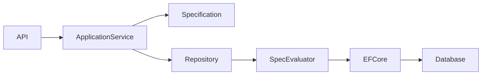
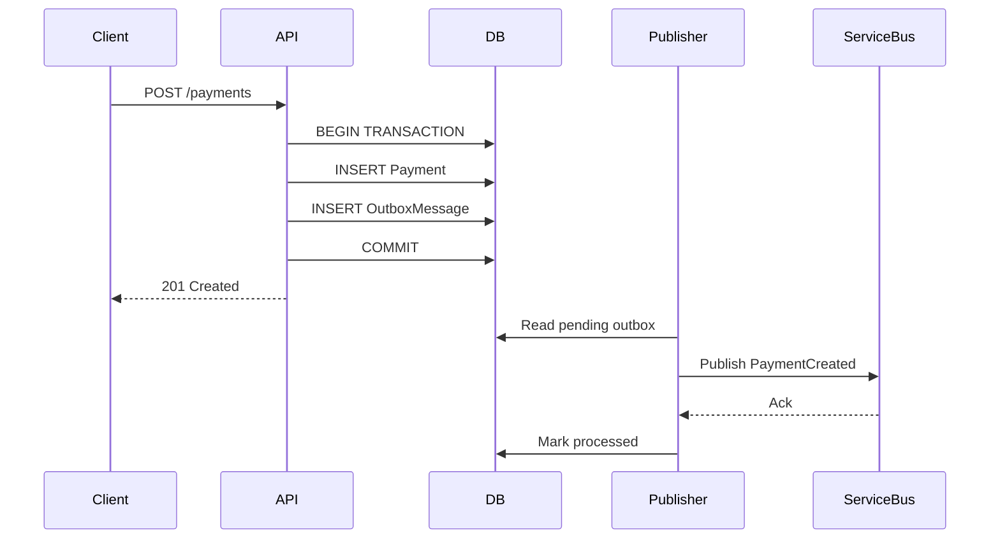
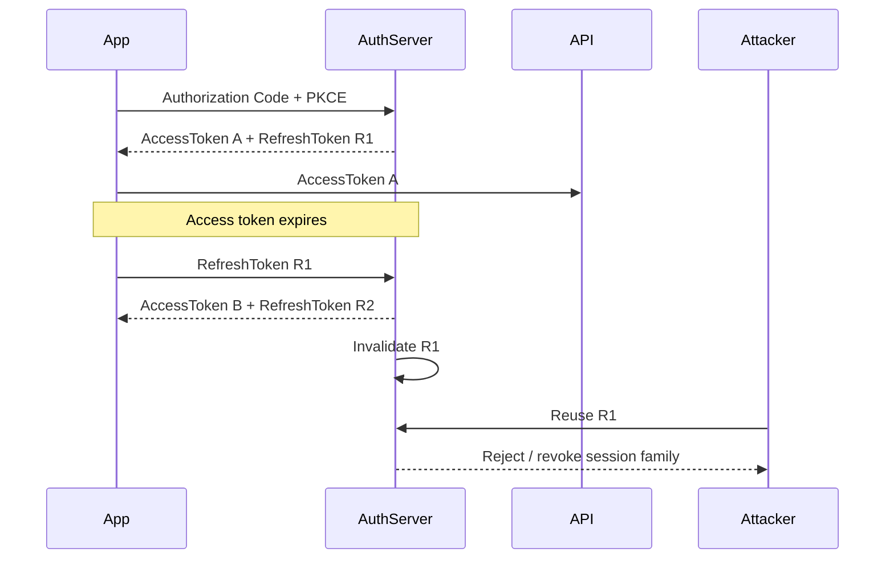
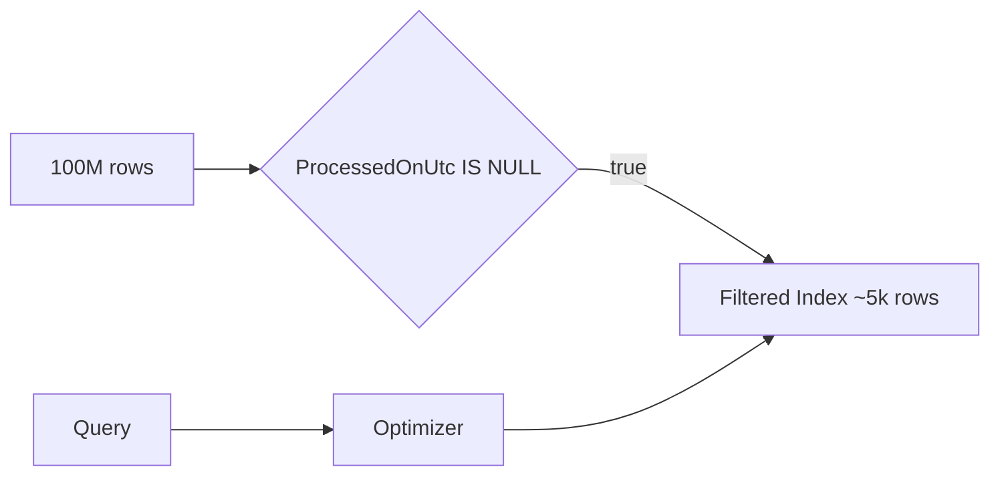
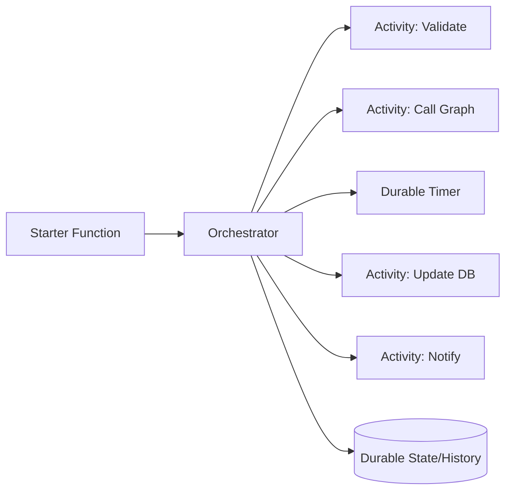
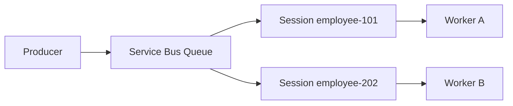
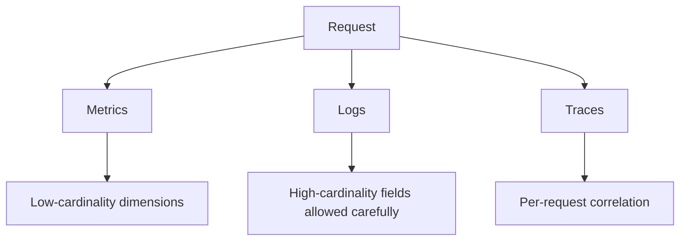
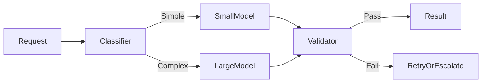
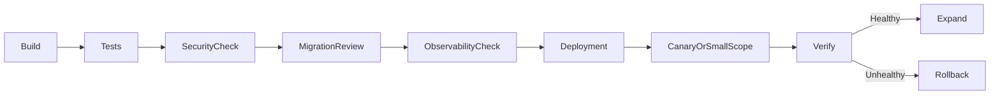

# Daily Knowledge Sharing — 17/08/2026

## Today’s Topics

1. Specification Pattern — đóng gói business query mà không biến Repository thành “God interface”
2. Transactional Outbox — phát event đáng tin cậy mà không cần distributed transaction
3. OAuth 2.0 Refresh Token Rotation — session dài hạn nhưng giảm rủi ro token theft
4. EF Core Compiled Query — giảm overhead query translation cho hot path
5. SQL Server Filtered Index — index nhỏ hơn, chọn lọc hơn cho dữ liệu có điều kiện
6. Azure Durable Functions — orchestration dài hạn, retry và stateful workflow trên serverless
7. Azure Service Bus Sessions — giữ thứ tự xử lý theo business key trong hệ thống phân tán
8. Observability Cardinality — khi labels/tags làm metrics và logs trở nên cực đắt
9. AI Cost Optimization — model routing, token budget và deterministic guardrails
10. Production Release Readiness — release gate, rollback criteria và kiểm soát blast radius

---

# 1. Specification Pattern — đóng gói business query mà không biến Repository thành “God interface”

### 1. What is it?

Specification Pattern là cách đóng gói một điều kiện truy vấn hoặc rule chọn dữ liệu thành một object có tên và có thể tái sử dụng.

Thay vì để repository có hàng chục method như:

```csharp
GetActiveEmployeesByDepartmentAsync(...)
GetActiveEmployeesByDepartmentAndRoleAsync(...)
GetEmployeesWithExpiredContractAsync(...)
```

Ta có thể mô hình hóa ý định business thành các specification nhỏ như:

```csharp
public sealed class ActiveEmployeesByDepartmentSpec
{
    public int DepartmentId { get; }

    public ActiveEmployeesByDepartmentSpec(int departmentId)
        => DepartmentId = departmentId;
}
```

Một implementation thực tế hơn thường mang theo predicate, include, ordering, paging hoặc projection.

Điểm quan trọng: Specification không phải để “bọc LINQ cho đẹp”, mà để đặt **ý nghĩa business** lên query và tránh để query logic bị phân tán khắp service/controller.

### 2. Why does it exist?

Khi hệ thống lớn dần, query thường bị lặp lại ở nhiều nơi. Ví dụ điều kiện “nhân viên active, chưa nghỉ việc, thuộc phòng ban X” có thể xuất hiện ở API, background job, report và validation.

Nếu mỗi nơi tự viết LINQ:

```csharp
.Where(x => x.IsActive && x.EndDate == null && x.DepartmentId == id)
```

thì sau vài tháng business rule đổi, một số nơi được sửa, một số nơi bị bỏ sót.

Naive solution khác là nhét mọi biến thể vào repository. Kết quả là repository có 40–60 methods, rất khó maintain và vẫn không thể bao phủ mọi tổ hợp query.

Specification ra đời để cân bằng giữa:

- Query intent rõ ràng.
- Reuse logic.
- Không làm repository phình quá mức.
- Vẫn giữ được khả năng tối ưu SQL tại tầng data access.

### 3. How does it work?

Một flow phổ biến:



Application layer chọn specification theo use case. Repository nhận specification và apply vào `IQueryable`.

Ví dụ đơn giản:

```csharp
public interface ISpecification<T>
{
    Expression<Func<T, bool>> Criteria { get; }
}

public sealed class ActiveEmployeeSpec : ISpecification<Employee>
{
    public Expression<Func<Employee, bool>> Criteria =>
        e => e.IsActive && e.EndDate == null;
}
```

Repository:

```csharp
public async Task<List<T>> ListAsync<T>(
    ISpecification<T> spec,
    CancellationToken cancellationToken)
    where T : class
{
    return await _dbContext.Set<T>()
        .Where(spec.Criteria)
        .ToListAsync(cancellationToken);
}
```

Ở hệ thống thực tế, evaluator có thể apply thêm:

- `Include`
- `OrderBy`
- `Skip/Take`
- projection
- `AsNoTracking`

### 4. Practical example

Timesheet API cần lấy các nhân viên hợp lệ để duyệt timesheet:

```csharp
public sealed class EmployeesEligibleForTimesheetSpec
    : ISpecification<Employee>
{
    private readonly DateOnly _date;

    public EmployeesEligibleForTimesheetSpec(DateOnly date)
        => _date = date;

    public Expression<Func<Employee, bool>> Criteria => e =>
        e.IsActive &&
        e.StartDate <= _date &&
        (e.EndDate == null || e.EndDate >= _date);
}
```

Application service chỉ nói:

```csharp
var employees = await employeeRepository.ListAsync(
    new EmployeesEligibleForTimesheetSpec(workDate),
    cancellationToken);
```

Use case trở nên dễ đọc hơn nhiều so với việc nhúng business filtering vào service.

### 5. Real production scenario

Trong hệ thống employee management, cùng một khái niệm “employee eligible” có thể được dùng bởi:

- API timesheet.
- background job đồng bộ Microsoft 365.
- report payroll.
- job gửi reminder.

Khi business thay đổi, ví dụ employee đang trong trạng thái `Suspended` không được tính eligible, ta cập nhật specification thay vì sửa bốn nơi khác nhau.

Production concern quan trọng là kiểm tra SQL mà EF Core sinh ra. Specification tốt về mặt design vẫn có thể gây query chậm nếu include quá nhiều hoặc predicate không dùng được index.

### 6. Common mistakes

- Biến specification thành một DSL quá phức tạp khó debug.
- Nhét business side effect vào specification. Specification nên mô tả query, không nên gửi email hay update DB.
- Composite specification quá sâu tạo expression tree khó đọc.
- Dùng specification để che giấu mọi LINQ kể cả query cực đơn giản.
- Không kiểm tra generated SQL và execution plan.

### 7. Trade-offs

**Advantages**

- Query intent rõ và có tên.
- Business filtering dễ tái sử dụng.
- Repository nhỏ gọn hơn.
- Dễ test query rule độc lập.

**Costs / Risks**

- Thêm abstraction và code ceremony.
- Có thể tạo lớp abstraction quá “generic”.
- Debug query phức tạp hơn nếu evaluator quá magic.
- Không tự động giải quyết vấn đề performance.

### 8. Junior → Middle → Senior understanding

**Junior**

Hiểu rằng specification là object đại diện cho điều kiện chọn dữ liệu có ý nghĩa business.

**Middle**

Biết implement evaluator, include, paging, projection và kiểm tra generated SQL.

**Senior / Technical Lead**

Biết khi nào specification giúp giảm duplication và khi nào chỉ tạo abstraction noise. Quan trọng hơn là giữ query ownership rõ ràng và tránh biến domain layer thành ORM-aware.

### 9. Key takeaway

- Specification nên biểu diễn query intent, không phải mọi dòng LINQ.
- Đừng dùng nó để che giấu SQL/performance problem.
- Tên specification phải phản ánh ngôn ngữ business.

---

# 2. Transactional Outbox — phát event đáng tin cậy mà không cần distributed transaction

### 1. What is it?

Transactional Outbox là pattern đảm bảo thay đổi database và việc “ghi nhận cần phát event” xảy ra trong cùng một local transaction.

Thay vì:

```text
Update DB
→ Publish message
```

và hy vọng cả hai cùng thành công, ta làm:

```text
Update DB + Insert Outbox row
→ COMMIT
→ Background publisher đọc Outbox
→ Publish message
→ Mark Outbox as processed
```

### 2. Why does it exist?

Giả sử API tạo payment:

1. Database commit thành công.
2. Service crash trước khi publish `PaymentCreated`.

Payment tồn tại trong DB nhưng downstream service không biết.

Trường hợp ngược lại:

1. Publish thành công.
2. Database commit thất bại.

Downstream tưởng payment tồn tại nhưng thực tế DB rollback.

Naive retry không giải quyết được khoảng trống atomicity giữa database và message broker.

Distributed transaction/2PC có thể giải quyết một số trường hợp nhưng thường tăng coupling, latency và không được hỗ trợ tốt bởi cloud broker hiện đại.

Outbox dùng local ACID transaction để đảm bảo **business state và event intent luôn cùng tồn tại**.

### 3. How does it work?



Schema đơn giản:

```sql
CREATE TABLE OutboxMessages
(
    Id uniqueidentifier NOT NULL PRIMARY KEY,
    Type nvarchar(200) NOT NULL,
    Payload nvarchar(max) NOT NULL,
    OccurredOnUtc datetime2 NOT NULL,
    ProcessedOnUtc datetime2 NULL,
    RetryCount int NOT NULL DEFAULT 0
);
```

### 4. Practical example

EF Core interceptor hoặc application service có thể gom domain event và ghi outbox trước `SaveChanges`.

```csharp
await using var transaction =
    await db.Database.BeginTransactionAsync(cancellationToken);

order.MarkPaid();

var message = new OutboxMessage
{
    Id = Guid.NewGuid(),
    Type = nameof(OrderPaid),
    Payload = JsonSerializer.Serialize(new OrderPaid(order.Id)),
    OccurredOnUtc = DateTime.UtcNow
};

db.OutboxMessages.Add(message);
await db.SaveChangesAsync(cancellationToken);
await transaction.CommitAsync(cancellationToken);
```

Background worker:

```csharp
var batch = await db.OutboxMessages
    .Where(x => x.ProcessedOnUtc == null)
    .OrderBy(x => x.OccurredOnUtc)
    .Take(100)
    .ToListAsync(cancellationToken);
```

Sau khi publish thành công mới mark processed.

### 5. Real production scenario

Employee offboarding flow:

- DB cập nhật employee từ Active → Inactive.
- Hệ thống cần phát event để worker xử lý Exchange Online, revoke access, gửi notification.

Nếu DB update xong nhưng event mất, mailbox không được xử lý.

Outbox đảm bảo khi trạng thái employee đã thay đổi, record để publish event cũng chắc chắn tồn tại.

Downstream consumer vẫn phải idempotent vì publisher có thể publish duplicate nếu crash sau khi broker nhận message nhưng trước khi DB mark processed.

### 6. Common mistakes

- Nghĩ rằng Outbox tạo exactly-once delivery. Thực tế thường vẫn là at-least-once.
- Không có cleanup strategy, khiến bảng Outbox tăng vô hạn.
- Serialize object framework-specific gây khó backward compatibility.
- Không có retry/backoff/dead-letter strategy.
- Không index `ProcessedOnUtc` hoặc query pending không tối ưu.
- Publish toàn bộ backlog một lần gây overload broker.

### 7. Trade-offs

**Advantages**

- Không cần distributed transaction.
- Business state và event intent atomic.
- Recover tốt sau crash.
- Phù hợp với Azure Service Bus, Kafka, RabbitMQ.

**Costs / Risks**

- Thêm bảng, publisher, cleanup job.
- Có độ trễ giữa commit và publish.
- Duplicate message vẫn có thể xảy ra.
- Cần observability tốt cho backlog.

### 8. Junior → Middle → Senior understanding

**Junior**

Hiểu failure window giữa DB và broker.

**Middle**

Biết implement outbox table, worker, retry và idempotent consumer.

**Senior / Technical Lead**

Phải quyết định delivery semantics, retention, ordering, partitioning, backpressure và monitoring backlog. Senior cũng cần xác định event contract ownership và versioning.

### 9. Key takeaway

- Outbox giải quyết atomicity giữa DB state và publish intent.
- Không có exactly-once miễn phí; consumer vẫn phải idempotent.
- Outbox backlog là production signal cần monitor.

---

# 3. OAuth 2.0 Refresh Token Rotation — session dài hạn nhưng giảm rủi ro token theft

### 1. What is it?

Refresh token cho phép client lấy access token mới mà không bắt người dùng đăng nhập lại.

Refresh Token Rotation nghĩa là mỗi lần refresh thành công, authorization server cấp một refresh token mới và vô hiệu token cũ.

Tư duy đơn giản:

```text
Access token: sống ngắn
Refresh token: sống dài hơn
Rotation: refresh token cũ không nên dùng lại
```

### 2. Why does it exist?

Access token nên có lifetime ngắn để giảm thiệt hại nếu bị lộ. Nhưng nếu access token chỉ sống 5–15 phút và người dùng phải login lại liên tục thì UX rất tệ.

Refresh token giải quyết UX, nhưng chính nó lại trở thành secret có giá trị cao.

Nếu refresh token bị đánh cắp và tồn tại vài tuần, attacker có thể lấy access token mới liên tục.

Rotation giúp phát hiện hoặc giảm reuse của token bị đánh cắp.

### 3. How does it work?



Một số identity providers quản lý “token family” để nếu refresh token cũ bị reuse, toàn bộ chuỗi có thể bị revoke.

### 4. Practical example

Trong ASP.NET Core, backend API thường **không tự rotate refresh token nếu dùng Microsoft Entra ID**; responsibility nằm ở identity provider và client authentication library.

Nếu tự xây identity service, storage cần giữ hash thay vì raw token:

```csharp
public sealed class RefreshTokenRecord
{
    public Guid Id { get; init; }
    public Guid UserId { get; init; }
    public string TokenHash { get; init; } = default!;
    public DateTime ExpiresAtUtc { get; init; }
    public DateTime? RevokedAtUtc { get; set; }
    public Guid? ReplacedByTokenId { get; set; }
}
```

Flow refresh phải transaction-safe để hai concurrent refresh không cùng hợp lệ.

### 5. Real production scenario

Mobile app của SaaS employee platform cho phép user login một lần và dùng trong nhiều ngày.

- Access token sống 15 phút.
- Refresh token dài hơn.
- Khi app foreground sau vài giờ, nó refresh access token.
- Nếu refresh token cũ bị replay, session có thể bị revoke và user phải login lại.

Production cần quan tâm device compromise, secure storage, logout-all-devices, password reset, account disable và revoke strategy.

### 6. Common mistakes

- Lưu refresh token raw trong database.
- Lưu token insecure trong browser local storage khi architecture không phù hợp.
- Không rotate hoặc không detect reuse.
- Không revoke khi user đổi password hoặc bị disable.
- Dùng refresh token cho service-to-service flow; client credentials không cần refresh token theo cách này.
- Đồng nhất “JWT” với “secure”; JWT bị lộ vẫn là credential.

### 7. Trade-offs

**Advantages**

- UX tốt hơn với access token lifetime ngắn.
- Giảm rủi ro token sống quá lâu.
- Có thể phát hiện token reuse.

**Costs / Risks**

- State management phức tạp hơn.
- Multi-device logout/revoke logic khó hơn.
- Concurrent refresh có thể gây race condition.
- Token theft vẫn là vấn đề nếu client storage bị compromise.

### 8. Junior → Middle → Senior understanding

**Junior**

Phân biệt access token và refresh token.

**Middle**

Hiểu rotation, secure storage, expiration, revoke và race conditions.

**Senior / Technical Lead**

Quyết định token lifetime dựa trên risk, UX, device type và identity provider capabilities; hiểu federation, BFF pattern, session revocation và incident response khi token leak.

### 9. Key takeaway

- Access token nên ngắn hạn; refresh token phải được bảo vệ mạnh hơn.
- Rotation giảm rủi ro reuse nhưng không thay thế secure storage.
- Với Entra ID, ưu tiên dùng library/provider flow thay vì tự invent token protocol.

---

# 4. EF Core Compiled Query — giảm overhead query translation cho hot path

### 1. What is it?

EF Core phải parse LINQ expression, build query model và tạo SQL trước khi query được thực thi. EF có cache nội bộ, nhưng trong một số hot path cực kỳ thường xuyên, compiled query có thể giảm thêm overhead này.

Compiled query precompile phần expression:

```csharp
private static readonly Func<AppDbContext, Guid, Employee?>
    GetEmployeeById = EF.CompileQuery(
        (AppDbContext db, Guid id) =>
            db.Employees.AsNoTracking().FirstOrDefault(x => x.Id == id));
```

### 2. Why does it exist?

Trong phần lớn API, bottleneck nằm ở database/network chứ không phải LINQ translation.

Nhưng ở service có:

- Query cực nhanh.
- QPS rất cao.
- Query shape cố định.
- Database latency thấp.

thì overhead phía ORM bắt đầu đáng kể.

Compiled query tồn tại để tối ưu phần CPU/query pipeline trong các hot path đã được đo rõ ràng.

### 3. How does it work?

Normal path:

```text
LINQ Expression
→ Query compilation/cache lookup
→ SQL generation
→ Execute
→ Materialize
```

Compiled query:

```text
Precompiled delegate
→ bind parameters
→ Execute
→ Materialize
```

Quan trọng: compiled query **không làm SQL tự nhiên nhanh hơn**. Nếu SQL scan 5 triệu rows, compiled query không cứu được.

### 4. Practical example

```csharp
private static readonly Func<AppDbContext, string, Task<Employee?>>
    FindByEmail = EF.CompileAsyncQuery(
        (AppDbContext db, string email) =>
            db.Employees
                .AsNoTracking()
                .Where(x => x.Email == email)
                .Select(x => new Employee
                {
                    Id = x.Id,
                    Email = x.Email,
                    DisplayName = x.DisplayName
                })
                .FirstOrDefault());
```

Tuy nhiên trước khi làm vậy, phải đo:

1. generated SQL.
2. index trên `Email`.
3. DB latency.
4. allocation và CPU profile.

Nếu query thiếu index, compiled query là optimization sai chỗ.

### 5. Real production scenario

Authentication-adjacent API lookup user profile theo `ExternalObjectId` hàng nghìn lần mỗi phút.

Sau profiling thấy SQL chỉ 1–2 ms nhưng application CPU query pipeline chiếm tỷ lệ đáng kể. Khi đó compiled query có thể hợp lý.

Ngược lại, report query mất 800 ms vì join và scan lớn thì ưu tiên execution plan/index/projection trước.

### 6. Common mistakes

- Dùng compiled query cho mọi query.
- Không benchmark trước và sau.
- Nhầm compiled query với database prepared statement.
- Dùng entity materialization nặng khi chỉ cần DTO vài field.
- Tối ưu ORM overhead trước khi sửa index/query shape.

### 7. Trade-offs

**Advantages**

- Giảm CPU overhead trên hot path.
- Query shape cố định, predictable.

**Costs / Risks**

- Code kém linh hoạt hơn.
- Khó compose dynamic query.
- Lợi ích thường nhỏ nếu DB latency cao.
- Có thể làm code khó đọc chỉ để đổi lấy micro-optimization.

### 8. Junior → Middle → Senior understanding

**Junior**

Hiểu compiled query chỉ tối ưu phần EF query pipeline.

**Middle**

Biết benchmark và xác định hot path.

**Senior / Technical Lead**

Biết đánh giá tổng latency budget và tránh local optimization không ảnh hưởng SLO. Senior cần nhìn CPU saturation, DB latency, throughput và cost tổng thể.

### 9. Key takeaway

- Index/query shape trước, compiled query sau.
- Chỉ dùng cho hot path đã được đo.
- Performance optimization phải dựa trên profile, không dựa trên cảm giác.

---

# 5. SQL Server Filtered Index — index nhỏ hơn, chọn lọc hơn cho dữ liệu có điều kiện

### 1. What is it?

Filtered Index là index chỉ chứa một phần rows thỏa điều kiện `WHERE`.

Ví dụ bảng Outbox 100 triệu rows nhưng chỉ vài nghìn row chưa xử lý:

```sql
CREATE INDEX IX_Outbox_Pending
ON dbo.OutboxMessages (OccurredOnUtc)
INCLUDE (Id, Type)
WHERE ProcessedOnUtc IS NULL;
```

### 2. Why does it exist?

Nếu tạo full index trên cột có hàng trăm triệu rows, index sẽ:

- chiếm nhiều storage.
- tăng write overhead.
- tốn memory/cache.
- maintenance nặng.

Trong nhiều workload, query chỉ quan tâm subset rất nhỏ như:

- active records.
- unprocessed messages.
- non-deleted rows.
- failed jobs.

Filtered index giúp index đúng phần dữ liệu cần truy cập thường xuyên.

### 3. How does it work?



Query phải có predicate tương thích để optimizer có thể sử dụng index.

```sql
SELECT TOP (100) Id, Type, Payload
FROM dbo.OutboxMessages
WHERE ProcessedOnUtc IS NULL
ORDER BY OccurredOnUtc;
```

### 4. Practical example

Bảng employee có soft delete:

```sql
CREATE INDEX IX_Employees_Active_Email
ON dbo.Employees (Email)
WHERE IsDeleted = 0;
```

Query:

```sql
SELECT Id, DisplayName
FROM dbo.Employees
WHERE IsDeleted = 0
  AND Email = @email;
```

Nếu phần lớn rows đã archived/deleted, filtered index nhỏ hơn nhiều so với full index.

### 5. Real production scenario

Background worker poll pending outbox mỗi vài giây. 99.99% rows đã processed.

Không có filtered index, SQL có thể scan/index seek trên structure lớn hơn cần thiết. Khi backlog/history tăng theo năm, latency tăng dần dù số pending message vẫn thấp.

Filtered index giữ access path nhỏ và ổn định hơn.

### 6. Common mistakes

- Tạo filtered index nhưng query predicate không tương thích.
- Dùng parameterization khiến optimizer không luôn suy ra filter phù hợp.
- Tạo quá nhiều filtered indexes cho mọi status.
- Không include columns cần thiết dẫn tới key lookup nhiều.
- Không theo dõi write overhead và fragmentation.

### 7. Trade-offs

**Advantages**

- Index nhỏ hơn.
- Ít storage và memory hơn.
- Write overhead thấp hơn full index trong nhiều trường hợp.
- Rất phù hợp cho sparse subset.

**Costs / Risks**

- Chỉ hữu ích cho query phù hợp predicate.
- Tăng complexity cho schema/index strategy.
- Query plan có thể không dùng như kỳ vọng.

### 8. Junior → Middle → Senior understanding

**Junior**

Hiểu index có thể chỉ chứa một subset rows.

**Middle**

Biết đọc execution plan, seek/scan, include columns và kiểm tra query predicate.

**Senior / Technical Lead**

Biết đánh đổi read vs write, storage, statistics, parameterization và workload evolution. Index strategy phải dựa trên query pattern thật.

### 9. Key takeaway

- Filtered index rất mạnh khi query liên tục vào một subset nhỏ.
- Luôn xác nhận bằng actual execution plan.
- Index là thiết kế theo workload, không phải checklist.

---

# 6. Azure Durable Functions — orchestration dài hạn, retry và stateful workflow trên serverless

### 1. What is it?

Azure Durable Functions mở rộng Azure Functions để xây workflow có state, checkpoint và orchestration mà developer không phải tự lưu toàn bộ state machine.

Nó phù hợp với workflow như:

```text
Receive request
→ validate
→ call Graph
→ wait / retry
→ update DB
→ send notification
```

có thể kéo dài từ vài giây đến nhiều giờ/ngày.

### 2. Why does it exist?

Azure Function thông thường phù hợp cho xử lý ngắn và stateless.

Nếu tự viết workflow dài bằng function rời rạc, ta phải tự giải quyết:

- lưu state.
- retry.
- resume sau crash.
- timer/wait.
- fan-out/fan-in.
- correlation giữa các bước.

Durable Functions cung cấp runtime orchestration với durable state.

### 3. How does it work?



Orchestrator function được replay để reconstruct state, vì vậy code orchestrator phải deterministic.

### 4. Practical example

```csharp
[Function(nameof(OffboardingOrchestrator))]
public static async Task Run(
    [OrchestrationTrigger] TaskOrchestrationContext context)
{
    var request = context.GetInput<OffboardingRequest>()!;

    await context.CallActivityAsync(nameof(ValidateEmployee), request);

    var options = TaskOptions.FromRetryPolicy(
        new RetryPolicy(
            maxNumberOfAttempts: 5,
            firstRetryInterval: TimeSpan.FromSeconds(10)));

    await context.CallActivityAsync(
        nameof(UpdateMailbox),
        request,
        options);

    await context.CreateTimer(
        context.CurrentUtcDateTime.AddMinutes(5),
        CancellationToken.None);

    await context.CallActivityAsync(nameof(SendNotification), request);
}
```

Không nên gọi random/time/external I/O trực tiếp trong orchestrator; activity function mới là nơi làm I/O.

### 5. Real production scenario

Employee offboarding:

- Convert mailbox sang shared.
- Set forwarding.
- Wait một khoảng để hệ thống downstream sync.
- Revoke license.
- Send completion notification.

Workflow có thể fail ở bước Graph/Exchange vì throttling. Durable orchestration có thể retry và resume thay vì restart toàn bộ.

### 6. Common mistakes

- Viết non-deterministic code trong orchestrator.
- Nhét logic I/O nặng vào orchestrator thay vì activity.
- Không design idempotency cho activity retry.
- Dùng Durable Functions cho workflow rất đơn giản một bước.
- Không monitor orchestration stuck/failed instances.

### 7. Trade-offs

**Advantages**

- Stateful orchestration trên serverless.
- Built-in retry/timer/checkpoint.
- Fan-out/fan-in tốt.
- Recover sau restart.

**Costs / Risks**

- Replay model khó hiểu hơn function thường.
- Debug production workflow phức tạp.
- Storage/history overhead.
- Vendor/runtime-specific hơn background worker thuần.

### 8. Junior → Middle → Senior understanding

**Junior**

Hiểu khác biệt stateless Function và durable orchestration.

**Middle**

Biết implement activity, retry, timer và idempotency.

**Senior / Technical Lead**

Quyết định khi nào chọn Durable Functions vs Service Bus + Worker vs Logic Apps vs Container Apps. Cần đánh giá long-running state, throughput, cost, replay semantics và operational support.

### 9. Key takeaway

- Durable Functions phù hợp workflow dài, stateful và cần resume.
- Activity phải idempotent vì retry là bình thường.
- Orchestrator phải deterministic.

---

# 7. Azure Service Bus Sessions — giữ thứ tự xử lý theo business key trong hệ thống phân tán

### 1. What is it?

Service Bus Sessions cho phép group message theo `SessionId` và đảm bảo một receiver sở hữu session tại một thời điểm.

Nếu cần xử lý event theo thứ tự cho cùng một business entity, ví dụ cùng `EmployeeId` hoặc `OrderId`, session là một cơ chế hữu ích.

### 2. Why does it exist?

Queue thông thường có thể có nhiều consumer chạy song song. Điều này tốt cho throughput nhưng tạo race:

```text
EmployeeCreated
EmployeeDeactivated
EmployeeReactivated
```

Nếu xử lý out of order, state downstream có thể sai.

Global ordering cho toàn queue sẽ làm throughput giảm mạnh. Sessions cho phép **ordering theo key**, vẫn giữ parallelism giữa các key khác nhau.

### 3. How does it work?



Messages cùng session được xử lý tuần tự bởi receiver đang lock session.

Ví dụ:

```csharp
var message = new ServiceBusMessage(payload)
{
    SessionId = employeeId.ToString()
};
```

### 4. Practical example

Employee lifecycle events:

```csharp
await sender.SendMessageAsync(new ServiceBusMessage(json)
{
    MessageId = eventId.ToString(),
    SessionId = employeeId.ToString(),
    Subject = "EmployeeStatusChanged"
});
```

Consumer dùng session-enabled processor.

Business state của Employee A xử lý tuần tự, trong khi Employee B, C, D có thể chạy parallel.

### 5. Real production scenario

Microsoft 365 integration nhận các command:

1. Create account.
2. Assign license.
3. Disable account.

Nếu `Disable` chạy trước `Create` do concurrent delivery, worker gặp lỗi hoặc tạo trạng thái sai.

Session theo employee/user key giúp giữ ordering cục bộ.

Nhưng vẫn cần idempotency vì duplicate delivery có thể xảy ra.

### 6. Common mistakes

- Dùng một `SessionId` cho toàn hệ thống → vô tình serialize toàn bộ queue.
- Cho session key có skew lớn, một key chứa 80% traffic gây hotspot.
- Nhầm ordering với exactly-once.
- Activity xử lý lâu làm session lock kéo dài.
- Không có dead-letter strategy cho poison message chặn cả session.

### 7. Trade-offs

**Advantages**

- Ordering theo business key.
- Parallelism giữa các session.
- Phù hợp state machine theo entity.

**Costs / Risks**

- Session hot key làm throughput giảm.
- Poison message có thể block progress.
- Operational complexity cao hơn queue thường.

### 8. Junior → Middle → Senior understanding

**Junior**

Hiểu session giúp nhóm và serialize message cùng key.

**Middle**

Biết chọn `SessionId`, lock handling, retry, DLQ.

**Senior / Technical Lead**

Phải thiết kế partition key tránh skew, xác định ordering scope thực sự cần và đánh giá trade-off giữa consistency và throughput.

### 9. Key takeaway

- Ordering nên theo business key, không nên global nếu không cần.
- Sessions không loại bỏ duplicate.
- Chọn SessionId sai có thể trở thành bottleneck kiến trúc.

---

# 8. Observability Cardinality — khi labels/tags làm metrics và logs trở nên cực đắt

### 1. What is it?

Cardinality là số lượng giá trị duy nhất của một dimension/tag/label.

Ví dụ metric:

```text
http_requests_total{method="GET", status="200"}
```

có cardinality thấp.

Nhưng nếu thêm:

```text
user_id="a8d..."
request_id="..."
```

mỗi request tạo series mới, cardinality bùng nổ.

### 2. Why does it exist?

Metrics system hoạt động tốt với số lượng time series có giới hạn. Developer thường nghĩ “thêm tag thì điều tra càng dễ”, nhưng high-cardinality dimension có thể:

- tăng memory.
- tăng ingestion cost.
- làm query chậm.
- tăng telemetry bill.
- gây throttling/drop.

Observability cần phân biệt dữ liệu nào phù hợp metrics, logs và traces.

### 3. How does it work?



Rule thực tế:

- Metrics: dimensions bounded như endpoint, status class, region.
- Logs: IDs có thể được log nhưng cần volume control.
- Traces: request-specific context và dependency chain.

### 4. Practical example

Không nên:

```csharp
meter.CreateCounter<long>("api_requests")
    .Add(1,
        new("user.id", userId),
        new("request.id", requestId));
```

Nên:

```csharp
requestCounter.Add(1,
    new("http.method", method),
    new("http.route", route),
    new("http.status_class", statusCode / 100));
```

User/request ID để trong trace/log correlation thay vì metric label.

### 5. Real production scenario

Một API SaaS thêm `tenantId` và `userId` vào mọi metric. Sau vài tuần số time series tăng hàng triệu, query dashboard chậm và Azure Monitor/Application Insights cost tăng mạnh.

Incident khó chịu nhất là observability system trở thành nguồn chi phí lớn hơn application workload.

### 6. Common mistakes

- Gắn request ID vào metrics.
- Dùng raw URL thay vì route template (`/users/123` thay vì `/users/{id}`).
- Không giới hạn custom dimensions.
- Log full payload cho mọi request.
- Không sampling traces hoặc logs noisy.

### 7. Trade-offs

**Advantages của nhiều dimensions**

- Debug và slicing linh hoạt hơn.

**Costs / Risks**

- Ingestion/storage/query cost tăng mạnh.
- Dashboard chậm.
- Alert signal bị phân mảnh.

### 8. Junior → Middle → Senior understanding

**Junior**

Hiểu metric tag không nên chứa ID unique.

**Middle**

Biết chọn fields cho logs, metrics, traces và implement correlation.

**Senior / Technical Lead**

Thiết kế telemetry budget, sampling policy, retention và SLO monitoring mà không tạo cost explosion. Observability cũng là một distributed system cần capacity planning.

### 9. Key takeaway

- Metrics cần dimension có bounded cardinality.
- IDs riêng từng request/user phù hợp trace/log hơn metric.
- Telemetry cost là production design concern.

---

# 9. AI Cost Optimization — model routing, token budget và deterministic guardrails

### 1. What is it?

AI Cost Optimization là việc kiểm soát chi phí LLM dựa trên workload thực tế thay vì chỉ “dùng model rẻ hơn”.

Chi phí thường đến từ:

- input tokens.
- output tokens.
- số lần gọi model.
- retry.
- embedding/vector retrieval.
- tool calls downstream.
- latency và infrastructure phụ trợ.

### 2. Why does it exist?

AI workload có cost profile rất khác API CRUD truyền thống.

Một prompt dài 50k tokens chạy 100k lần/tháng có thể tốn hơn hẳn compute backend.

Naive optimization là đổi toàn bộ sang model rẻ nhất. Nhưng điều đó có thể giảm quality và tạo nhiều retry/human correction hơn, cuối cùng tổng cost lại tăng.

Cần tối ưu theo **cost per successful task**, không chỉ cost per request.

### 3. How does it work?



Một architecture tốt thường có:

1. Request classification deterministic hoặc lightweight.
2. Token budget.
3. Context trimming/retrieval.
4. Model routing.
5. Structured output validation.
6. Retry có giới hạn.
7. Cache nếu response có thể reuse an toàn.
8. Cost telemetry theo use case.

### 4. Practical example

C# pseudo-realistic decision layer:

```csharp
var profile = request.Complexity switch
{
    TaskComplexity.Low => ModelProfile.Fast,
    TaskComplexity.Medium => ModelProfile.Balanced,
    _ => ModelProfile.Reasoning
};

if (context.EstimatedTokens > policy.MaxInputTokens)
{
    context = await contextReducer.ReduceAsync(context, cancellationToken);
}

var result = await aiClient.ExecuteAsync(
    profile,
    context,
    cancellationToken);

schemaValidator.Validate(result);
```

Deterministic controls như permission check, allowed tools, max spend và schema validation không nên giao cho model tự quyết.

### 5. Real production scenario

AI assistant nội bộ đọc tài liệu và tạo technical summary.

Ban đầu app luôn gửi toàn bộ 30 file vào model lớn. Cost tăng nhanh.

Sau redesign:

- embeddings chọn top chunks.
- summary cache theo document version.
- simple query dùng model nhỏ.
- complex architecture analysis mới escalate model mạnh.
- output giới hạn token.

Cost/task giảm đáng kể mà quality giữ ổn định hơn.

### 6. Common mistakes

- Gửi toàn bộ context “cho chắc”.
- Retry vô hạn khi output invalid.
- Không giới hạn max output tokens.
- Dùng model mạnh nhất cho tất cả tasks.
- Không đo cost theo feature/tenant.
- Cache response có dữ liệu sensitive mà không scope đúng user/tenant.
- Để model tự quyết tool permissions hoặc spending.

### 7. Trade-offs

**Advantages**

- Giảm cost và latency.
- Scale số lượng request tốt hơn.
- Có budget control rõ ràng.

**Costs / Risks**

- Routing logic tăng complexity.
- Context trimming có thể làm mất thông tin.
- Model nhỏ có thể giảm quality.
- Cache invalidation và data isolation phức tạp.

### 8. Junior → Middle → Senior understanding

**Junior**

Hiểu tokens và số call quyết định phần lớn cost.

**Middle**

Biết implement token budget, structured output, retry limit và telemetry.

**Senior / Technical Lead**

Tối ưu cost per successful business outcome; thiết kế model portfolio, routing, eval, fallback, tenant budget và security boundary.

### 9. Key takeaway

- Tối ưu cost/task thành công, không chỉ cost/request.
- Context ít nhưng đúng thường tốt hơn context khổng lồ.
- Permission, spend limit và validation phải deterministic.

---

# 10. Production Release Readiness — release gate, rollback criteria và kiểm soát blast radius

### 1. What is it?

Production Release Readiness là tập hợp các điều kiện kỹ thuật và vận hành phải đạt trước khi deploy thay đổi vào production.

Nó không phải checklist hình thức. Mục tiêu là trả lời:

```text
Nếu release này hỏng,
chúng ta phát hiện bằng gì,
ảnh hưởng ai,
rollback thế nào,
và mất bao lâu để phục hồi?
```

### 2. Why does it exist?

Một feature có thể pass unit test nhưng vẫn fail production vì:

- migration lock table.
- config sai.
- permission thiếu.
- secret chưa deploy.
- downstream throttling.
- telemetry không đủ.
- rollback không tương thích database.

Release readiness tồn tại để chuyển từ “code chạy trên máy dev” sang “change có thể vận hành an toàn”.

### 3. How does it work?



Release gate nên bao phủ:

- code + automated tests.
- DB migration safety.
- config/secrets.
- dependency readiness.
- metrics/logs/traces.
- rollback plan.
- owner/on-call.
- blast radius control.

### 4. Practical example

Release API thay đổi schema từ nullable sang non-null:

Bad rollout:

```text
Deploy migration NOT NULL
→ old app still writes NULL
→ production errors
```

Safer expand-contract:

```text
1. Add new nullable column
2. Deploy app writing both old/new
3. Backfill
4. Verify no missing values
5. Enforce NOT NULL
6. Remove old field later
```

Rollback cũng phải xem DB compatibility, không chỉ rollback application binary.

### 5. Real production scenario

SaaS release chức năng offboarding mới gọi Microsoft Graph.

Trước deploy cần xác nhận:

- Entra permissions đã consent.
- Key Vault/config đúng environment.
- Graph throttling/retry policy có.
- App Insights dashboard theo dõi 429/5xx.
- feature flag có thể disable flow mới.
- old flow vẫn hoạt động nếu rollback.

Nếu không chuẩn bị, một permission thiếu có thể biến thành incident sau deploy dù code hoàn toàn “đúng”.

### 6. Common mistakes

- Chỉ dựa vào “tests xanh”.
- Migration destructive cùng lúc với app release.
- Không định nghĩa rollback trigger.
- Rollback app nhưng DB schema đã incompatible.
- Không có dashboard/alert cho feature mới.
- Rollout 100% ngay lập tức dù feature có blast radius lớn.
- Không xác định người chịu trách nhiệm verify sau release.

### 7. Trade-offs

**Advantages**

- Giảm incident và MTTR.
- Release predictable hơn.
- Tăng confidence khi thay đổi lớn.

**Costs / Risks**

- Tăng thời gian chuẩn bị release.
- Checklist quá cứng có thể làm chậm delivery.
- Nếu gate không dựa trên risk, process trở thành bureaucracy.

### 8. Junior → Middle → Senior understanding

**Junior**

Hiểu deploy thành công không đồng nghĩa release thành công.

**Middle**

Biết chuẩn bị migration, config, rollback, dashboard và verify production.

**Senior / Technical Lead**

Thiết kế release strategy theo risk: canary, blue-green, feature flag, expand-contract migration, rollback criteria, ownership và incident response.

### 9. Key takeaway

- Release là production change, không chỉ là CI/CD step.
- Rollback phải bao gồm database và external dependency compatibility.
- Mọi release quan trọng cần signal để biết “healthy hay không” trong vài phút đầu.