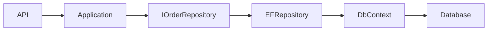
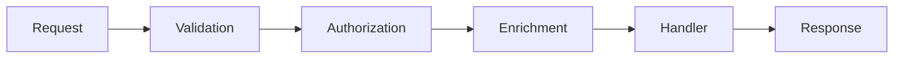
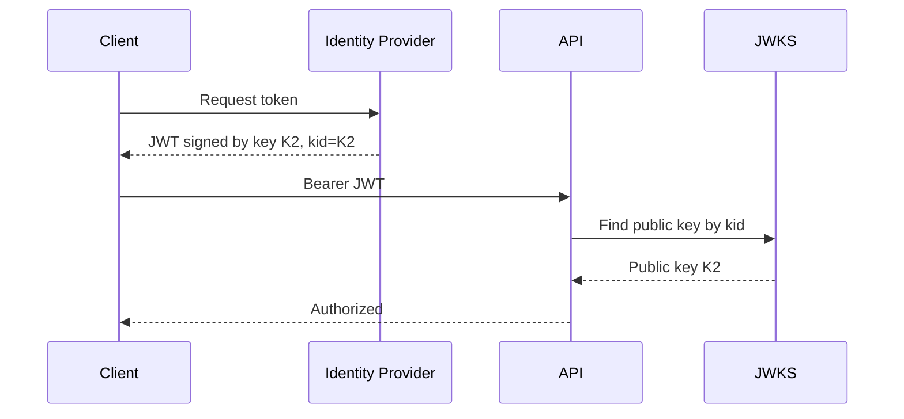
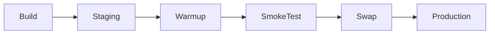
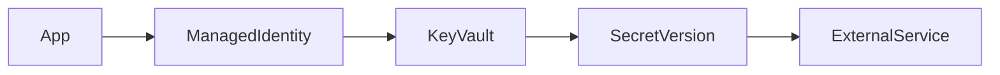
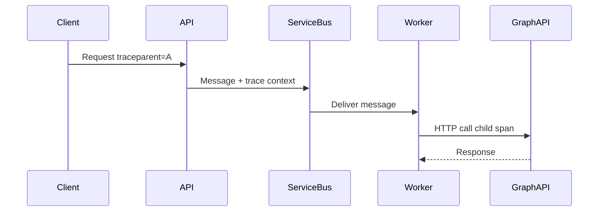
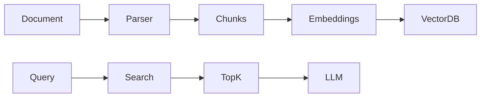

# Daily Knowledge Sharing — 17/08/2026

## Today’s Topics

1. Repository Pattern vs EF Core DbContext — khi abstraction giúp ích và khi chỉ tạo ceremony
2. Design Pattern: Chain of Responsibility — pipeline xử lý validation, authorization và enrichment
3. JWT Key Rotation — bảo vệ token signing trong production mà không làm gián đoạn hệ thống
4. PostgreSQL Connection Pooling — vì sao connection là tài nguyên hữu hạn và cách tránh pool exhaustion
5. CPU Optimization trong .NET — từ profiling đến loại bỏ hot path thay vì tối ưu theo cảm giác
6. Azure App Service Deployment Slots — triển khai an toàn với warm-up, swap và rollback
7. Azure Key Vault Secret Rotation — quản lý vòng đời secret mà không hard-code credential
8. Distributed Tracing Context Propagation — giữ trace xuyên API, queue và background worker
9. RAG Chunking Strategy — chia tài liệu để retrieval chính xác hơn, rẻ hơn và dễ đánh giá
10. Unit Testing — kiểm thử behavior, boundary và failure mode thay vì test implementation detail

---

# 1. Repository Pattern vs EF Core DbContext — khi abstraction giúp ích và khi chỉ tạo ceremony

### 1. What is it?

Repository Pattern tạo một abstraction đại diện cho việc truy cập và lưu aggregate hoặc dữ liệu domain. Với EF Core, `DbContext` vốn đã cung cấp nhiều đặc tính của Repository + Unit of Work: tracking entity, query qua `DbSet<T>`, và commit bằng `SaveChangesAsync()`.

Vấn đề thực tế không phải là “có dùng Repository hay không”, mà là **abstraction nào đang bảo vệ business code khỏi chi tiết persistence một cách có giá trị**.

### 2. Why does it exist?

Nếu application code phụ thuộc trực tiếp vào query phức tạp, schema, SQL hoặc nhiều storage API khác nhau, boundary persistence có thể rò vào business logic. Repository giúp gom các persistence capability có ý nghĩa business.

Nhưng nếu chỉ viết wrapper kiểu `GetAll()`, `FindById()`, `Add()` quanh `DbSet<T>`, ta thường chỉ thêm một lớp chuyển tiếp không tạo thêm giá trị.

### 3. How does it work?



Repository tốt nên mô tả capability như `GetOpenOrderForUpdateAsync()` thay vì expose toàn bộ persistence surface.

### 4. Practical example

```csharp
public interface IOrderRepository
{
    Task<Order?> GetByIdAsync(Guid id, CancellationToken ct);
    Task AddAsync(Order order, CancellationToken ct);
}

public sealed class OrderRepository(AppDbContext db) : IOrderRepository
{
    public Task<Order?> GetByIdAsync(Guid id, CancellationToken ct) =>
        db.Orders.SingleOrDefaultAsync(x => x.Id == id, ct);

    public Task AddAsync(Order order, CancellationToken ct)
    {
        db.Orders.Add(order);
        return Task.CompletedTask;
    }
}
```

Nếu use case chủ yếu là CRUD/reporting, inject trực tiếp `AppDbContext` vào application service đôi khi đơn giản hơn và vẫn hợp lý.

### 5. Real production scenario

Trong hệ thống timesheet, write-side có aggregate phức tạp với invariants và transaction boundary rõ ràng; Repository giúp giữ domain/application sạch. Trong khi đó màn hình admin reporting cần projection linh hoạt; dùng trực tiếp EF Core query hoặc dedicated query service thường hợp lý hơn.

### 6. Common mistakes

- Tạo generic repository rồi che mất các feature quan trọng của EF Core.
- Expose `IQueryable<T>` qua mọi layer và gọi đó là abstraction sạch.
- Repository có hàng chục method ad-hoc, trở thành “God interface”.
- Mock repository quá nhiều khiến test không phản ánh query thật.

### 7. Trade-offs

**Advantages**

- Boundary persistence rõ hơn.
- Dễ diễn đạt capability theo domain.
- Có thể cô lập implementation phức tạp.

**Costs / Risks**

- Thêm ceremony và mapping.
- Có thể che mất sức mạnh EF Core.
- Generic repository dễ tạo abstraction yếu.

### 8. Junior → Middle → Senior understanding

**Junior:** Hiểu Repository không đồng nghĩa với “mỗi entity có một CRUD wrapper”.

**Middle:** Biết khi nào dùng Repository, direct `DbContext`, projection/query service và cách tránh N+1/query leak.

**Senior / Technical Lead:** Quyết định boundary theo domain complexity, testing strategy, team scale và chi phí abstraction; không áp pattern máy móc.

### 9. Key takeaway

- EF Core đã cung cấp nhiều behavior kiểu Repository/UoW.
- Chỉ thêm abstraction khi nó bảo vệ boundary hoặc diễn đạt business capability.
- Đừng biến pattern thành ceremony.

---

# 2. Design Pattern: Chain of Responsibility — pipeline xử lý validation, authorization và enrichment

### 1. What is it?

Chain of Responsibility cho phép một request đi qua chuỗi handler/middleware; mỗi bước có thể xử lý, bổ sung dữ liệu, từ chối hoặc chuyển tiếp sang bước tiếp theo.

### 2. Why does it exist?

Nếu controller/service tự làm validation, auth, logging, enrichment, retry và business logic, code nhanh chóng trở thành một method dài, khó test và khó tái sử dụng.

### 3. How does it work?



Mỗi step chỉ biết nhiệm vụ của mình và contract để gọi step tiếp theo.

### 4. Practical example

ASP.NET Core middleware là ví dụ điển hình:

```csharp
app.UseAuthentication();
app.UseAuthorization();
app.UseMiddleware<CorrelationIdMiddleware>();
app.MapControllers();
```

MediatR pipeline behavior cũng áp dụng cùng ý tưởng cho command/query.

### 5. Real production scenario

Một API tạo payment có pipeline: validate request → check tenant → authorize policy → attach correlation ID → execute idempotency guard → chạy business handler.

### 6. Common mistakes

- Nhét business logic chính vào middleware/pipeline behavior.
- Thứ tự pipeline sai, ví dụ authorization trước authentication.
- Handler phụ thuộc ngầm vào side effect của step trước mà không có contract rõ.
- Quá nhiều layer khiến debug khó.

### 7. Trade-offs

**Advantages:** separation of concerns, reuse, test từng step độc lập.

**Costs / Risks:** flow khó nhìn hơn, order-sensitive, có thể tăng latency và complexity.

### 8. Junior → Middle → Senior understanding

**Junior:** Hiểu request đi qua nhiều step trước business handler.

**Middle:** Biết viết middleware/behavior đúng lifetime, async flow và exception handling.

**Senior / Technical Lead:** Thiết kế thứ tự pipeline, xác định concern nào nên global, endpoint-specific hay business-specific.

### 9. Key takeaway

- Pipeline tốt làm cross-cutting concern rõ ràng hơn.
- Order là một phần của correctness.
- Không dùng pipeline để giấu business logic.

---

# 3. JWT Key Rotation — bảo vệ token signing trong production mà không làm gián đoạn hệ thống

### 1. What is it?

JWT key rotation là việc thay đổi định kỳ signing key dùng để ký token, trong khi hệ thống vẫn chấp nhận token được ký bằng key cũ trong thời gian chuyển tiếp.

### 2. Why does it exist?

Một signing key sống quá lâu làm tăng blast radius nếu bị lộ. Nhưng đổi key đột ngột sẽ khiến toàn bộ token hiện tại invalid ngay lập tức.

### 3. How does it work?

JWT header thường chứa `kid`.



Trong giai đoạn rotation, JWKS có thể publish cả K1 và K2. Token mới dùng K2; token cũ dùng K1 vẫn verify được tới khi hết hạn.

### 4. Practical example

ASP.NET Core khi dùng Entra ID/OpenID Connect thường tự lấy signing keys từ metadata/JWKS endpoint. Điều quan trọng là không pin một certificate/key cố định trong code.

### 5. Real production scenario

Một SaaS dùng Entra ID cho hàng nghìn user. Identity provider rotate signing certificate. Nếu API tự hard-code public key, request bắt đầu trả 401 hàng loạt; nếu dùng metadata discovery đúng cách, rotation diễn ra gần như transparent.

### 6. Common mistakes

- Hard-code signing key/public key.
- Cache JWKS vô thời hạn.
- Không xử lý `kid` mới xuất hiện.
- Tự ký JWT bằng secret dùng chung quá lâu.
- Đặt token lifetime quá dài.

### 7. Trade-offs

**Advantages:** giảm rủi ro khi key bị compromise, phù hợp security hygiene.

**Costs / Risks:** cần metadata/JWKS refresh, clock synchronization, và operational process tốt.

### 8. Junior → Middle → Senior understanding

**Junior:** Phân biệt signing và encryption; hiểu API verify signature chứ không “tin” payload JWT.

**Middle:** Biết validate issuer, audience, expiry, signature và xử lý metadata refresh.

**Senior / Technical Lead:** Thiết kế rotation policy, token lifetime, emergency revoke và blast-radius strategy.

### 9. Key takeaway

- Signing key không nên sống vĩnh viễn.
- `kid` + JWKS giúp rotation không gây downtime.
- Validation phải gồm signature, issuer, audience và expiry.

---

# 4. PostgreSQL Connection Pooling — vì sao connection là tài nguyên hữu hạn và cách tránh pool exhaustion

### 1. What is it?

Connection pooling tái sử dụng các database connection đã mở thay vì mở TCP/database session mới cho mỗi request.

### 2. Why does it exist?

Mở connection có chi phí. Quan trọng hơn, PostgreSQL có giới hạn số connection và mỗi backend connection tiêu tốn memory/process resources. Nếu API scale ngang mạnh mà mỗi instance giữ pool quá lớn, database có thể chết trước application.

### 3. How does it work?

```text
API Request
   ↓
Npgsql Pool
   ├─ connection #1 → PostgreSQL
   ├─ connection #2 → PostgreSQL
   └─ connection #3 → PostgreSQL
```

`OpenAsync()` thường lấy connection từ pool; `DisposeAsync()` trả connection lại pool chứ không nhất thiết đóng socket thật.

### 4. Practical example

```csharp
await using var connection = new NpgsqlConnection(connectionString);
await connection.OpenAsync(ct);

await using var cmd = new NpgsqlCommand("select now()", connection);
var value = await cmd.ExecuteScalarAsync(ct);
```

Không giữ connection mở xuyên suốt business workflow dài.

### 5. Real production scenario

20 App Service instances × pool 100 connection = tiềm năng 2.000 connections, trong khi PostgreSQL chỉ chịu được vài trăm. Traffic tăng có thể dẫn tới timeout hàng loạt dù CPU DB chưa max.

### 6. Common mistakes

- Pool size quá lớn theo từng instance.
- Không dispose connection/DbContext.
- Transaction mở quá lâu.
- Query chậm giữ connection lâu, làm pool starvation.
- Chỉ tăng pool size thay vì xử lý bottleneck.

### 7. Trade-offs

**Advantages:** latency thấp hơn, giảm handshake, throughput tốt hơn.

**Costs / Risks:** pool exhaustion, connection storm, cần capacity planning theo tổng số instance.

### 8. Junior → Middle → Senior understanding

**Junior:** `Dispose` connection là bắt buộc dù có pooling.

**Middle:** Biết đọc timeout, pool settings, slow query và transaction duration.

**Senior / Technical Lead:** Capacity-plan tổng connection toàn cluster, cân nhắc PgBouncer, autoscaling và database limits.

### 9. Key takeaway

- Connection là tài nguyên hữu hạn.
- Pool size phải tính theo toàn hệ thống, không theo một instance.
- Query/transaction chậm thường gây pool starvation trước khi DB CPU max.

---

# 5. CPU Optimization trong .NET — từ profiling đến loại bỏ hot path thay vì tối ưu theo cảm giác

### 1. What is it?

CPU optimization là quá trình giảm lượng CPU cần cho một workload bằng cách đo hot path, tìm nguyên nhân và tối ưu đoạn code thực sự tiêu tốn thời gian xử lý.

### 2. Why does it exist?

Tối ưu theo cảm giác dễ làm code phức tạp nhưng không cải thiện production. Một service chậm có thể do DB, network, lock contention hoặc allocation chứ không phải CPU.

### 3. How does it work?

```text
Symptom → profile → identify hot method → hypothesize → benchmark → optimize → measure again
```

CPU profiler cho biết function nào chiếm nhiều samples/time nhất.

### 4. Practical example

Đoạn code parse JSON nhiều lần trong loop:

```csharp
foreach (var item in items)
{
    using var doc = JsonDocument.Parse(item.Payload);
    Process(doc.RootElement);
}
```

Có thể tối ưu bằng deserialize một lần ở boundary, cache parsed model trong scope phù hợp, hoặc dùng source-generated serialization nếu hot path thực sự nằm ở serialization.

### 5. Real production scenario

Một background worker xử lý 50.000 message/phút. CPU 95%, database ổn. Profiling cho thấy 40% CPU nằm ở regex và JSON transformation. Tối ưu đúng hai hot path giảm CPU đáng kể và tránh phải scale thêm instance.

### 6. Common mistakes

- Tối ưu LINQ nhỏ trong khi bottleneck là database.
- Benchmark trong Debug mode.
- Không warm-up JIT.
- Tăng parallelism khi CPU đã saturated.
- Đánh đổi readability quá sớm.

### 7. Trade-offs

**Advantages:** giảm infra cost, tăng throughput, giảm latency.

**Costs / Risks:** code có thể khó đọc hơn, optimization phụ thuộc workload, dễ premature optimization.

### 8. Junior → Middle → Senior understanding

**Junior:** Đo trước khi tối ưu.

**Middle:** Biết dùng profiler/BenchmarkDotNet và phân biệt CPU vs I/O bottleneck.

**Senior / Technical Lead:** Quyết định khi nào tối ưu code, scale out, cache, batch hoặc đổi kiến trúc; cân bằng maintainability và cost.

### 9. Key takeaway

- Không tối ưu bằng trực giác.
- Profiling xác định hot path thực sự.
- Đo lại sau mỗi thay đổi.

---

# 6. Azure App Service Deployment Slots — triển khai an toàn với warm-up, swap và rollback

### 1. What is it?

Deployment Slot là một môi trường chạy riêng trong cùng App Service, ví dụ `staging` và `production`, cho phép deploy phiên bản mới vào slot phụ rồi swap traffic/config sang production.

### 2. Why does it exist?

Deploy trực tiếp lên production có thể gây cold start, config lỗi hoặc startup failure ngay trên live traffic.

### 3. How does it work?



Một số setting được đánh dấu “slot setting” để không swap theo application.

### 4. Practical example

CI/CD deploy artifact vào `staging`, chạy health check `/health/ready`, sau đó swap nếu pass. Nếu lỗi sau swap, có thể swap lại để rollback nhanh.

### 5. Real production scenario

ASP.NET Core app có startup load configuration, connect Redis và hydrate caches. Deploy trực tiếp tạo vài chục giây 503. Deployment slot cho phép warm-up instance trước khi nhận traffic thật.

### 6. Common mistakes

- Không phân biệt slot setting với setting được swap.
- Migration database breaking-change trước khi code mới sẵn sàng.
- Không smoke-test staging.
- Cho rằng swap luôn là zero-risk.

### 7. Trade-offs

**Advantages:** giảm downtime, rollback nhanh, validation trước production.

**Costs / Risks:** thêm resource/cost, config complexity, database vẫn là shared dependency.

### 8. Junior → Middle → Senior understanding

**Junior:** Hiểu staging slot là app instance riêng, không phải chỉ folder deploy.

**Middle:** Biết configure slot settings, warm-up, health check và swap.

**Senior / Technical Lead:** Thiết kế deployment + DB migration backward-compatible, rollback criteria và blast-radius control.

### 9. Key takeaway

- Slot giúp tách deploy khỏi go-live.
- Warm-up + smoke test quan trọng hơn bản thân nút “swap”.
- Database migration phải tương thích với cả old/new version.

---

# 7. Azure Key Vault Secret Rotation — quản lý vòng đời secret mà không hard-code credential

### 1. What is it?

Secret rotation là việc thay thế password, API key hoặc certificate định kỳ và cập nhật consumer một cách có kiểm soát.

### 2. Why does it exist?

Credential sống lâu làm tăng thiệt hại nếu bị lộ. Hard-code secret trong config/repo khiến rotation khó và dễ gây downtime.

### 3. How does it work?



App authenticate với Key Vault bằng Managed Identity; secret có version mới; app lấy version mới theo cache/refresh policy.

### 4. Practical example

```csharp
var credential = new DefaultAzureCredential();
var client = new SecretClient(new Uri(vaultUrl), credential);
var secret = await client.GetSecretAsync("GraphWebhookSecret", cancellationToken: ct);
```

Không lưu credential của Key Vault trong app; dùng Managed Identity.

### 5. Real production scenario

Một integration dùng API key của third party. Rotation strategy tạo key mới, deploy/refresh consumer để hỗ trợ key mới, xác nhận traffic ổn rồi revoke key cũ.

### 6. Common mistakes

- Secret rotation nhưng application cache vô hạn.
- Revoke old secret trước khi consumer đã nhận secret mới.
- Dùng one-secret-at-a-time khiến không có overlap window.
- Log secret value khi debug.

### 7. Trade-offs

**Advantages:** giảm blast radius, central secret management, audit tốt hơn.

**Costs / Risks:** refresh/caching complexity, dependency vào Key Vault, cần runbook khi rotation lỗi.

### 8. Junior → Middle → Senior understanding

**Junior:** Không hard-code secret; hiểu Key Vault là storage bảo mật chứ không tự giải quyết mọi vấn đề.

**Middle:** Dùng Managed Identity, RBAC, caching hợp lý và xử lý transient failures.

**Senior / Technical Lead:** Thiết kế overlap rotation, revoke policy, emergency rotation và dependency resilience.

### 9. Key takeaway

- Secret phải có vòng đời, không phải cấu hình “set once forever”.
- Managed Identity loại bỏ secret để truy cập Key Vault.
- Rotation tốt cần overlap và rollback plan.

---

# 8. Distributed Tracing Context Propagation — giữ trace xuyên API, queue và background worker

### 1. What is it?

Context propagation truyền trace identifiers và metadata cần thiết giữa các service để các span riêng lẻ có thể ghép thành một end-to-end trace.

### 2. Why does it exist?

Trong distributed system, một request có thể đi qua API → Service Bus → worker → Graph API. Nếu correlation bị mất ở queue boundary, incident investigation chỉ thấy các log rời rạc.

### 3. How does it work?



OpenTelemetry thường dùng W3C Trace Context (`traceparent`, `tracestate`).

### 4. Practical example

Khi publish message, đảm bảo instrumentation hoặc code inject trace context vào message properties. Worker extract context rồi start consumer span làm child của producer span.

### 5. Real production scenario

Notification workflow mất 12 giây. Trace cho thấy API mất 20 ms, queue delay 8 giây, worker 500 ms và Graph API 3 giây. Không có tracing, team dễ đổ lỗi nhầm cho API.

### 6. Common mistakes

- Tạo trace mới sau mỗi queue hop.
- Dùng custom correlation ID nhưng không map vào trace model.
- Propagate dữ liệu nhạy cảm trong baggage.
- Sampling strategy làm mất đúng trace lỗi cần điều tra.

### 7. Trade-offs

**Advantages:** root-cause nhanh, nhìn rõ dependency latency, dễ phân tích distributed failures.

**Costs / Risks:** telemetry volume/cost, context propagation complexity, privacy considerations.

### 8. Junior → Middle → Senior understanding

**Junior:** Trace gồm nhiều span của cùng một request/workflow.

**Middle:** Biết propagate context qua HTTP và messaging; hiểu producer/consumer spans.

**Senior / Technical Lead:** Thiết kế sampling, baggage policy, retention và observability cost.

### 9. Key takeaway

- Trace chỉ hữu ích nếu context không bị đứt.
- Queue/background boundary cần propagation rõ ràng.
- Không nhét PII vào baggage/tags tùy tiện.

---

# 9. RAG Chunking Strategy — chia tài liệu để retrieval chính xác hơn, rẻ hơn và dễ đánh giá

### 1. What is it?

Chunking là cách chia tài liệu thành các đoạn nhỏ trước khi tạo embeddings/index để retrieval. Chunk size và overlap ảnh hưởng trực tiếp tới recall, precision, token cost và chất lượng answer.

### 2. Why does it exist?

Embedding nguyên tài liệu dài làm vector quá “trung bình”, khó tìm đoạn cụ thể. Chunk quá nhỏ lại mất ngữ cảnh và sinh nhiều vector, tăng cost.

### 3. How does it work?



Chunking nên tôn trọng semantic boundary như heading, paragraph, section thay vì chỉ cắt mỗi N ký tự.

### 4. Practical example

Một tài liệu kỹ thuật có heading `Authentication`, `Rate Limiting`, `Error Handling`. Ta chunk theo section 500–1.000 tokens, overlap nhỏ nếu cần continuity, và lưu metadata `documentId`, `section`, `version`.

### 5. Real production scenario

AI assistant trả lời policy nội bộ. Chunk 2.000 tokens khiến kết quả retrieval chứa nhiều thông tin không liên quan; giảm xuống ~600–800 tokens theo heading tăng precision và giảm context tokens gửi model.

### 6. Common mistakes

- Dùng chunk size cố định cho mọi loại document.
- Overlap quá lớn tạo duplicate evidence.
- Không lưu metadata/version.
- Đánh giá answer mà không đánh giá retrieval riêng.
- Top-K quá cao làm context nhiễu.

### 7. Trade-offs

**Advantages:** retrieval chính xác hơn, giảm token, dễ cite nguồn.

**Costs / Risks:** nhiều vector hơn, tuning phức tạp, preprocessing tốn công.

### 8. Junior → Middle → Senior understanding

**Junior:** Hiểu RAG không chỉ là “embed rồi search”.

**Middle:** Biết tune chunk size, overlap, top-K và metadata filters bằng eval set.

**Senior / Technical Lead:** Thiết kế retrieval eval, versioning, re-index strategy, cost và failure fallback.

### 9. Key takeaway

- Chunking là quyết định retrieval quan trọng, không phải preprocessing phụ.
- Semantic boundary thường tốt hơn cắt ký tự cố định.
- Đánh giá retrieval riêng trước khi blame model.

---

# 10. Unit Testing — kiểm thử behavior, boundary và failure mode thay vì test implementation detail

### 1. What is it?

Unit test kiểm tra một đơn vị behavior nhỏ với feedback nhanh và isolation vừa đủ. Mục tiêu là bảo vệ contract/business rule, không phải chứng minh từng private method được gọi đúng số lần.

### 2. Why does it exist?

Code thay đổi liên tục. Nếu test bám implementation detail, refactor nội bộ làm hàng loạt test fail dù behavior không đổi. Test tốt phải giúp thay đổi an toàn hơn, không cản refactoring.

### 3. How does it work?

Tư duy test:

```text
Given state/input
→ When behavior executes
→ Then observable result / state / contract is correct
```

### 4. Practical example

```csharp
[Fact]
public void Approve_WhenAlreadyApproved_Throws()
{
    var timesheet = Timesheet.Approved();

    var act = () => timesheet.Approve();

    act.Should().Throw<DomainException>();
}
```

Test này bảo vệ business invariant, không quan tâm private fields được set theo thứ tự nào.

### 5. Real production scenario

Một payroll rule thay đổi. Unit tests cover boundary cases: overtime threshold, zero hours, invalid status transition, rounding. Integration tests riêng kiểm DB mapping và API contract.

### 6. Common mistakes

- Mock mọi thứ kể cả value object thuần.
- Assert số lần gọi internal helper không liên quan tới contract.
- Unit test query EF Core bằng fake provider rồi tưởng đã test SQL thật.
- Bỏ qua failure path và boundary values.

### 7. Trade-offs

**Advantages:** feedback nhanh, bảo vệ business rules, refactor an toàn hơn.

**Costs / Risks:** test suite dễ brittle nếu test sai abstraction; unit test không thay thế integration/E2E.

### 8. Junior → Middle → Senior understanding

**Junior:** Viết Given/When/Then và test cả happy path lẫn invalid input.

**Middle:** Chọn đúng test double, tránh over-mocking, phân biệt unit vs integration test.

**Senior / Technical Lead:** Thiết kế testing pyramid/portfolio theo risk, xác định contract nào cần unit, integration hay E2E.

### 9. Key takeaway

- Test behavior, không test cách code bên trong được viết.
- Failure mode và boundary case thường có giá trị hơn happy path đơn giản.
- Unit test không thay thế integration test.