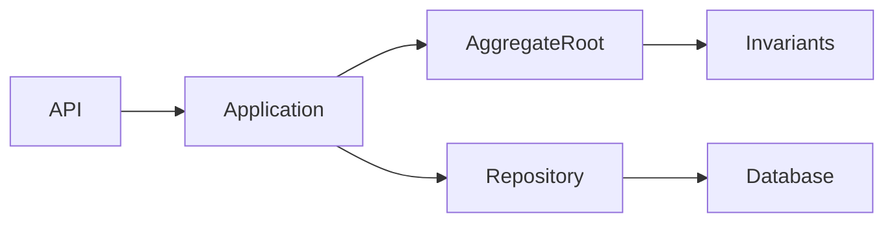
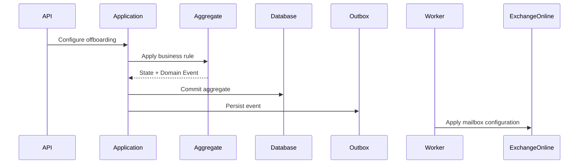
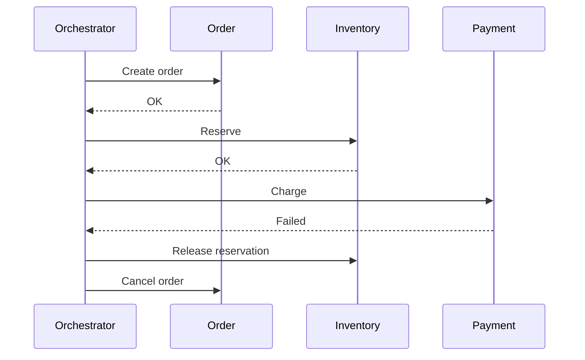
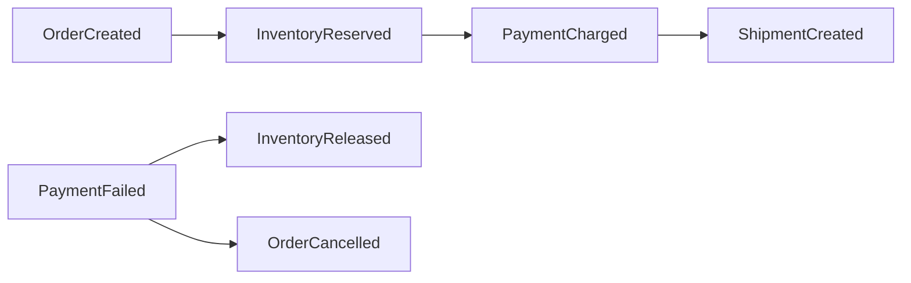
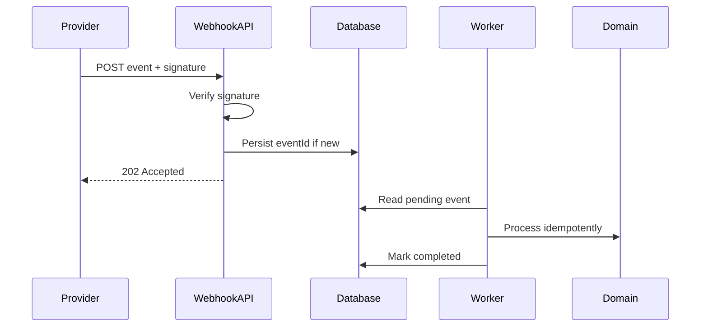
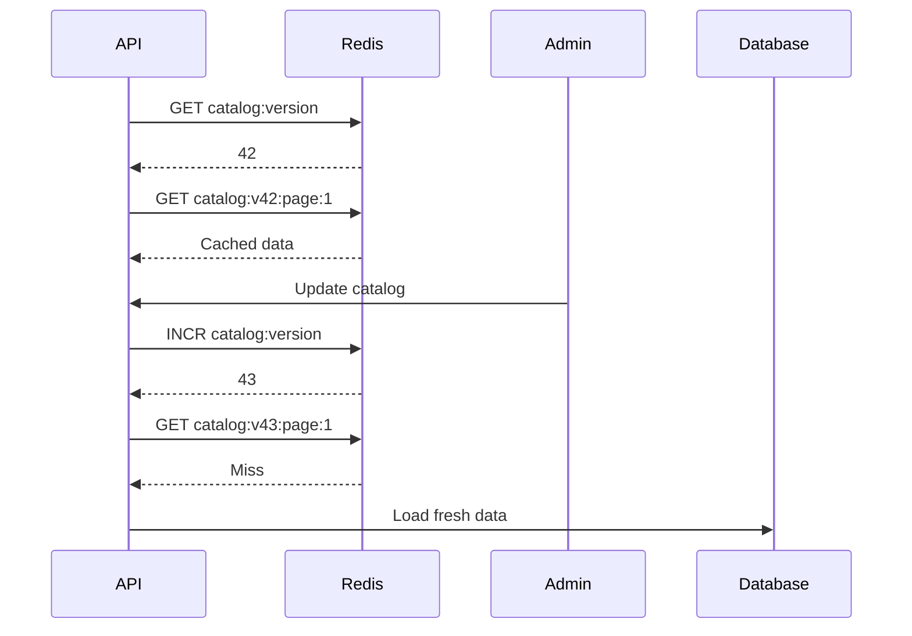
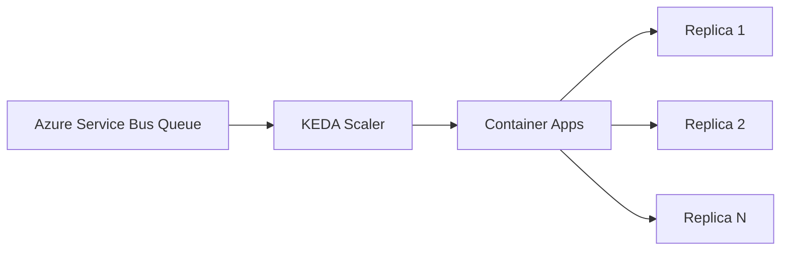
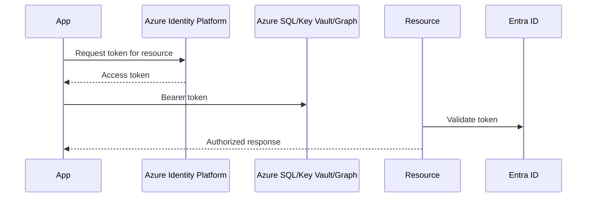
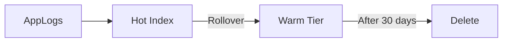
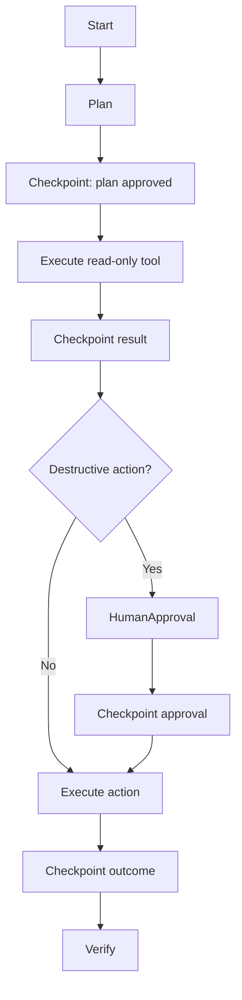

# Daily Knowledge Sharing — 17/08/2026

## Today’s Topics

1. DDD Aggregate Boundary — transaction consistency bên trong, eventual consistency bên ngoài
2. Saga Pattern — orchestration vs choreography cho business workflow nhiều service
3. Webhook Integration — signature verification, idempotency và retry-safe processing
4. SQL Server Transaction Log — long transaction, log growth và hidden production bottleneck
5. Cache Invalidation bằng Versioned Key — tránh stale cache mà không phải xóa hàng loạt key
6. Azure Container Apps Autoscaling — scale theo HTTP, queue và KEDA nhưng vẫn kiểm soát cost
7. Microsoft Entra Workload Identity — service-to-service authentication không dùng client secret dài hạn
8. Elasticsearch Index Lifecycle — retention, rollover và chi phí observability trong production
9. AI Agent Checkpointing — state, approval boundary và failure recovery cho workflow dài hạn
10. Risk-Based Code Review — review theo blast radius thay vì chỉ nhìn coding style

---

# 1. DDD Aggregate Boundary — transaction consistency bên trong, eventual consistency bên ngoài

### 1. What is it?

Trong Domain-Driven Design, **Aggregate** là một nhóm entity/value object được xem như một đơn vị nhất quán về business. Aggregate có một **Aggregate Root** làm cổng truy cập chính.

Ví dụ một hệ thống timesheet có thể có aggregate `Timesheet` chứa nhiều `TimesheetEntry`. Business rule như “timesheet đã Approved thì không được sửa entry” nên được enforce qua `Timesheet`, thay vì cho code bên ngoài sửa trực tiếp `TimesheetEntry`.

Điểm quan trọng: aggregate không phải “gom tất cả object liên quan vào một object lớn”. Boundary của aggregate chủ yếu là **boundary của invariants và transaction consistency**.

### 2. Why does it exist?

Nếu mọi entity trong domain đều được sửa tự do, business rule dễ bị phá theo nhiều đường khác nhau. Ví dụ:

- API A sửa `Timesheet.Status`.
- Background job sửa `TimesheetEntry.Hours`.
- Import job cập nhật trực tiếp bảng entry.

Nếu ba luồng này không cùng hiểu business invariant, dữ liệu có thể trở nên hợp lệ ở database nhưng sai về nghiệp vụ.

Naive solution thường là mở transaction thật lớn bao quanh nhiều bảng hoặc nhiều service. Điều đó làm lock dài hơn, coupling cao hơn và rất khó mở rộng sang distributed systems.

Aggregate giúp trả lời câu hỏi: **những dữ liệu nào thật sự cần consistent ngay trong cùng một transaction?**

### 3. How does it work?

Một command chỉ nên load aggregate root cần thiết, gọi behavior trên aggregate, sau đó commit transaction.



Ví dụ:

1. `ApproveTimesheetCommand` load `Timesheet`.
2. `Timesheet.Approve()` kiểm tra đủ điều kiện.
3. Aggregate cập nhật state nội bộ.
4. `SaveChangesAsync()` commit một transaction.
5. Nếu cần cập nhật payroll ở module khác, phát domain/integration event thay vì mở rộng transaction sang payroll.

Rule quan trọng:

```text
Inside aggregate boundary  -> strong consistency
Across aggregate boundary  -> preferably eventual consistency
```

### 4. Practical example

```csharp
public sealed class Timesheet
{
    private readonly List<TimesheetEntry> _entries = new();

    public Guid Id { get; private set; }
    public TimesheetStatus Status { get; private set; }
    public IReadOnlyCollection<TimesheetEntry> Entries => _entries;

    public void AddEntry(DateOnly date, decimal hours)
    {
        if (Status != TimesheetStatus.Draft)
            throw new DomainException("Only draft timesheets can be changed.");

        if (hours <= 0 || hours > 24)
            throw new DomainException("Invalid working hours.");

        _entries.Add(new TimesheetEntry(date, hours));
    }

    public void Approve()
    {
        if (Status != TimesheetStatus.Submitted)
            throw new DomainException("Timesheet must be submitted first.");

        if (_entries.Count == 0)
            throw new DomainException("Cannot approve an empty timesheet.");

        Status = TimesheetStatus.Approved;
    }
}
```

Application service không nên làm kiểu:

```csharp
entry.Hours = 12;
timesheet.Status = TimesheetStatus.Approved;
```

mà nên yêu cầu aggregate thực hiện behavior.

### 5. Real production scenario

Trong employee management:

- `EmployeeOffboarding` có rule về end date, forwarding mode, auto-reply và trạng thái mailbox.
- Cấu hình này có thể thuộc một aggregate để bảo đảm không tồn tại trạng thái nghiệp vụ mâu thuẫn.
- Việc cập nhật Exchange Online lại là side effect bên ngoài aggregate.

Flow hợp lý:



Database state được commit trước; hệ thống ngoài được cập nhật sau qua reliable messaging.

### 6. Common mistakes

- Aggregate quá lớn vì “mọi thứ có relation đều cho vào cùng aggregate”.
- Cho repository trả trực tiếp child entity rồi sửa bypass aggregate root.
- Dùng aggregate chỉ như data container, không có behavior.
- Cố đảm bảo strong consistency giữa nhiều aggregate bằng một transaction khổng lồ.
- Trộn integration SDK hoặc HTTP call vào aggregate.
- Không xác định rõ invariant nào cần bảo vệ.

### 7. Trade-offs

**Advantages**

- Business invariant nằm đúng chỗ.
- Transaction boundary rõ.
- Giảm accidental coupling.
- Dễ chuyển sang event-driven khi hệ thống lớn dần.

**Costs / Risks**

- Boundary sai sẽ gây aggregate quá lớn hoặc quá nhỏ.
- Eventual consistency tạo thêm complexity.
- Có thể cần nhiều command/query model hơn.
- Đòi hỏi team hiểu domain thay vì chỉ map bảng database.

### 8. Junior → Middle → Senior understanding

**Junior**

Hiểu aggregate root là cổng chính để thay đổi một nhóm dữ liệu có business rule liên quan.

**Middle**

Biết implement behavior trong aggregate, repository theo aggregate root và giữ transaction scope nhỏ.

**Senior / Technical Lead**

Phải quyết định boundary dựa trên invariants, contention, throughput và consistency requirement; đồng thời biết khi nào tách aggregate và chấp nhận eventual consistency.

### 9. Key takeaway

- Aggregate boundary trước hết là consistency boundary.
- Strong consistency nên được giữ nhỏ nhất có thể.
- Cross-aggregate workflow thường phù hợp hơn với events/Saga thay vì transaction lớn.

---

# 2. Saga Pattern — orchestration vs choreography cho business workflow nhiều service

### 1. What is it?

Saga Pattern là cách quản lý một business transaction kéo dài qua nhiều service mà không cần distributed transaction kiểu two-phase commit.

Một Saga gồm nhiều local transaction. Mỗi bước commit riêng. Nếu bước sau thất bại, hệ thống chạy **compensating action** để đảo hoặc giảm tác động của bước trước.

Có hai cách phổ biến:

- **Choreography**: service phát event và service khác tự phản ứng.
- **Orchestration**: có một orchestrator điều khiển toàn bộ workflow.

### 2. Why does it exist?

Trong microservices, mỗi service thường sở hữu database riêng. Một workflow như checkout có thể cần:

- tạo order,
- giữ inventory,
- charge payment,
- tạo shipment.

Không thể an toàn giả định tất cả cùng commit trong một transaction ACID duy nhất.

Naive solution là gọi tuần tự:

```text
Order -> Inventory -> Payment -> Shipping
```

Nhưng nếu Payment thành công còn Shipping thất bại, request đã rơi vào partial failure. Saga tồn tại để biến partial failure thành một workflow có state và recovery rõ ràng.

### 3. How does it work?

Ví dụ orchestration:



Orchestrator phải persist state của Saga để có thể resume sau restart.

Choreography thì giống:



### 4. Practical example

Một state model đơn giản:

```csharp
public enum OffboardingSagaState
{
    Pending,
    MailboxConverted,
    ForwardingConfigured,
    AutoReplyConfigured,
    Completed,
    CompensationRequired,
    Failed
}

public sealed class OffboardingSaga
{
    public Guid Id { get; init; }
    public OffboardingSagaState State { get; private set; }
    public int RetryCount { get; private set; }

    public void MarkMailboxConverted() =>
        State = OffboardingSagaState.MailboxConverted;

    public void MarkCompensationRequired() =>
        State = OffboardingSagaState.CompensationRequired;
}
```

Trong production, orchestrator nên persist state trước khi gửi bước tiếp theo để tránh mất progress.

### 5. Real production scenario

Microsoft 365 offboarding là ví dụ rất phù hợp:

1. Disable employee trong ứng dụng.
2. Convert mailbox thành shared mailbox.
3. Configure forwarding.
4. Configure auto-reply.
5. Remove delegation.

Nếu bước 4 fail vì Exchange Online transient error, không nên rollback database thành Active chỉ vì side effect ngoài chưa xong. Hệ thống nên biết workflow đang ở step nào, retry step nào và trường hợp nào cần manual intervention.

### 6. Common mistakes

- Dùng Saga nhưng không persist workflow state.
- Xem compensation như rollback hoàn hảo; thực tế nhiều side effect không thể undo hoàn toàn.
- Retry vô hạn.
- Không idempotent từng step.
- Choreography quá nhiều event khiến flow khó hiểu.
- Orchestrator trở thành “God service” chứa business logic của tất cả service.
- Không có trạng thái manual review.

### 7. Trade-offs

**Advantages**

- Phù hợp distributed transaction.
- Resilient với partial failure.
- Dễ scale từng service độc lập.
- Có thể hỗ trợ long-running workflow.

**Costs / Risks**

- Eventual consistency.
- State machine phức tạp.
- Debug khó hơn local transaction.
- Compensation có thể không hoàn hảo.
- Choreography dễ tạo hidden coupling.

### 8. Junior → Middle → Senior understanding

**Junior**

Hiểu Saga là chuỗi local transaction có recovery/compensation, không phải một database transaction kéo dài.

**Middle**

Biết implement idempotent step, retry, state persistence và compensation.

**Senior / Technical Lead**

Phải chọn choreography/orchestration, định nghĩa failure state, stop condition, operational visibility và manual recovery path.

### 9. Key takeaway

- Saga quản lý business consistency, không biến distributed system thành ACID transaction.
- Mỗi step phải idempotent và observable.
- Compensation là business action, không phải kỹ thuật `ROLLBACK` đơn giản.

---

# 3. Webhook Integration — signature verification, idempotency và retry-safe processing

### 1. What is it?

Webhook là cơ chế hệ thống bên ngoài chủ động gửi HTTP request tới hệ thống của bạn khi một event xảy ra.

Ví dụ payment provider gửi `payment.succeeded`, GitHub gửi `push`, hoặc SaaS provider gửi `subscription.updated`.

Webhook nghe đơn giản nhưng production-grade webhook receiver cần xử lý ba vấn đề lớn:

- xác thực nguồn gửi,
- duplicate delivery,
- retry/out-of-order delivery.

### 2. Why does it exist?

Polling kiểu “mỗi 30 giây gọi provider xem có thay đổi không” tốn request, tăng latency và làm hệ thống khó scale.

Webhook giúp chuyển sang push model. Tuy nhiên HTTP delivery không đảm bảo exactly-once. Provider có thể retry nếu nhận timeout/5xx, nên cùng một event có thể tới nhiều lần.

Nếu endpoint xử lý payment hoặc tạo order trực tiếp mà không idempotent, duplicate webhook có thể tạo duplicate side effect.

### 3. How does it work?

Recommended flow:



Không nên giữ provider chờ trong khi chạy business workflow dài.

### 4. Practical example

```csharp
app.MapPost("/webhooks/payment", async (
    HttpRequest request,
    IWebhookSignatureVerifier verifier,
    AppDbContext db,
    CancellationToken ct) =>
{
    using var reader = new StreamReader(request.Body);
    var payload = await reader.ReadToEndAsync(ct);

    var signature = request.Headers["X-Signature"].ToString();
    if (!verifier.IsValid(payload, signature))
        return Results.Unauthorized();

    var evt = JsonSerializer.Deserialize<PaymentWebhook>(payload)!;

    var exists = await db.WebhookEvents
        .AnyAsync(x => x.ExternalEventId == evt.Id, ct);

    if (exists)
        return Results.Ok();

    db.WebhookEvents.Add(new WebhookEvent
    {
        ExternalEventId = evt.Id,
        Payload = payload,
        Status = "Pending"
    });

    await db.SaveChangesAsync(ct);
    return Results.Accepted();
});
```

Database nên có unique constraint trên `ExternalEventId`, vì check-then-insert riêng lẻ vẫn có race condition.

```sql
CREATE UNIQUE INDEX UX_WebhookEvents_ExternalEventId
ON WebhookEvents(ExternalEventId);
```

### 5. Real production scenario

Một SaaS billing system nhận `invoice.paid`:

- webhook đến hai lần do lần đầu provider timeout khi nhận response,
- endpoint verify signature,
- event ID lần hai bị unique constraint chặn,
- worker xử lý event lần đầu và gia hạn subscription đúng một lần.

Nếu provider gửi `invoice.paid` trước `subscription.updated`, handler không nên phụ thuộc tuyệt đối vào thứ tự arrival. Có thể cần query trạng thái mới nhất từ provider khi xử lý event quan trọng.

### 6. Common mistakes

- Tin payload chỉ vì endpoint URL khó đoán.
- Không verify HMAC/signature.
- Parse rồi reserialize payload trước khi verify signature, làm bytes thay đổi.
- Không có unique event ID.
- Xử lý business logic dài ngay trong HTTP webhook request.
- Trả 500 cho lỗi business không recoverable khiến provider retry mãi.
- Giả định event luôn đến đúng thứ tự.

### 7. Trade-offs

**Advantages**

- Near-real-time.
- Giảm polling.
- Tách hệ thống tương đối tốt.

**Costs / Risks**

- At-least-once delivery.
- Security surface mới.
- Out-of-order event.
- Need replay/debug tooling.

### 8. Junior → Middle → Senior understanding

**Junior**

Biết webhook là callback HTTP và duplicate delivery là bình thường.

**Middle**

Biết signature verification, unique event ID, queue/background processing và retry policy.

**Senior / Technical Lead**

Phải thiết kế replay strategy, event retention, poisoning handling, observability, security rotation và recovery khi provider outage.

### 9. Key takeaway

- Webhook phải được thiết kế theo at-least-once, không phải exactly-once.
- Verify signature trước khi tin payload.
- Persist nhanh, xử lý async và idempotent.

---

# 4. SQL Server Transaction Log — long transaction, log growth và hidden production bottleneck

### 1. What is it?

SQL Server Transaction Log ghi lại các thay đổi cần thiết để database có thể rollback transaction, recover sau crash và hỗ trợ backup/replication tùy cấu hình.

Nhiều developer chỉ nhìn data file và index, nhưng transaction log có thể trở thành bottleneck hoặc làm disk đầy nếu transaction kéo dài hoặc backup log không đúng.

### 2. Why does it exist?

Database cần bảo đảm durability và atomicity. Khi một transaction thay đổi hàng triệu row, SQL Server không thể chỉ “ghi thẳng rồi quên”. Nó phải có đủ thông tin để recover hoặc rollback.

Một long-running transaction giữ phần log liên quan chưa thể truncate. Nếu job chạy 2 giờ và update quá nhiều row, log file có thể tăng liên tục.

### 3. How does it work?

Simplified:

```text
BEGIN TRANSACTION
   ↓
Changes generate log records
   ↓
Log records flushed
   ↓
COMMIT
   ↓
Log region may later become reusable
```

Nhưng reusable còn phụ thuộc recovery model, log backup, replication, active transaction và các yếu tố khác.

Một transaction update 10 triệu rows có thể giữ log rất lâu.

### 4. Practical example

Problematic:

```sql
BEGIN TRAN;

UPDATE AuditEvents
SET IsArchived = 1
WHERE CreatedAt < DATEADD(month, -12, SYSUTCDATETIME());

COMMIT;
```

Nếu bảng có hàng chục triệu records, nên cân nhắc batch:

```sql
WHILE 1 = 1
BEGIN
    UPDATE TOP (5000) AuditEvents
    SET IsArchived = 1
    WHERE IsArchived = 0
      AND CreatedAt < DATEADD(month, -12, SYSUTCDATETIME());

    IF @@ROWCOUNT = 0 BREAK;
END
```

Batch giảm transaction duration, lock footprint và log retention pressure.

### 5. Real production scenario

Một nightly cleanup job chạy lúc 01:00:

- update 30 triệu rows trong một transaction,
- log tăng từ 20 GB lên 200 GB,
- disk gần đầy,
- transaction khác chậm do IO pressure,
- backup/log shipping cũng bị ảnh hưởng.

Symptom ở application có thể chỉ là timeout; root cause lại nằm ở transaction log và storage IO.

### 6. Common mistakes

- Xóa/update khối lượng lớn trong một transaction duy nhất.
- Shrink log file thường xuyên như một “optimization”.
- Không theo dõi log usage.
- Không hiểu recovery model.
- Nghĩ rollback transaction lớn là tức thời.
- Bắt đầu transaction rồi gọi external HTTP API trước khi commit.

### 7. Trade-offs

**Advantages của transaction lớn**

- Atomicity đơn giản.
- Dễ reasoning về consistency.

**Costs / Risks**

- Log growth.
- Lock lâu.
- Rollback lâu.
- IO pressure.
- Blast radius lớn khi fail.

Batching giảm pressure nhưng đổi lại có intermediate states và cần idempotency.

### 8. Junior → Middle → Senior understanding

**Junior**

Hiểu mọi write đều tạo transaction log và transaction càng dài càng giữ resource lâu.

**Middle**

Biết batch update/delete, theo dõi lock, log usage và tránh external call trong transaction.

**Senior / Technical Lead**

Phải thiết kế retention job, migration strategy, storage headroom, recovery objective và deployment plan để tránh log growth gây incident.

### 9. Key takeaway

- Transaction duration quan trọng không kém số lượng row.
- Long transaction có thể gây log growth và lock contention.
- Batch processing thường là lựa chọn production-safe hơn cho maintenance workload lớn.

---

# 5. Cache Invalidation bằng Versioned Key — tránh stale cache mà không phải xóa hàng loạt key

### 1. What is it?

Versioned cache key là kỹ thuật thêm version vào key để “invalidate” một nhóm cache bằng cách đổi version, thay vì scan và delete toàn bộ key.

Ví dụ:

```text
products:v42:page:1
products:v42:page:2
products:v42:category:books
```

Khi catalog thay đổi lớn, tăng version thành `v43`. Cache cũ tự trở thành unreachable và hết hạn dần theo TTL.

### 2. Why does it exist?

Cache invalidation khó nhất khi một thay đổi ảnh hưởng nhiều key.

Ví dụ update product có thể làm stale:

- `product:123`,
- `products:page:1`,
- `products:category:phone`,
- `search:iphone`.

Naive solution là tìm tất cả key rồi `DEL`, nhưng Redis key scan/delete trên namespace lớn có thể đắt và dễ sót.

Versioned key cho phép invalidation O(1) ở logical level.

### 3. How does it work?



Version key trở thành một nhỏ nhưng quan trọng dependency.

### 4. Practical example

```csharp
public async Task<string> GetCatalogKeyAsync(int page, CancellationToken ct)
{
    var version = await _redis.StringGetAsync("catalog:version");
    if (version.IsNull)
    {
        version = "1";
        await _redis.StringSetAsync("catalog:version", version);
    }

    return $"catalog:v{version}:page:{page}";
}

public Task BumpCatalogVersionAsync() =>
    _redis.StringIncrementAsync("catalog:version");
```

Cache entries vẫn nên có TTL để key cũ cuối cùng được garbage-collected.

### 5. Real production scenario

Một pricing API cache hàng nghìn combination theo customer segment, region và product group.

Khi price list mới được publish, thay vì xóa hàng nghìn key, hệ thống bump `pricing:version`. Request mới dùng namespace mới, request cũ không còn nhìn thấy cached price cũ.

### 6. Common mistakes

- Không TTL key cũ khiến memory tăng mãi.
- Version toàn bộ hệ thống quá rộng, một thay đổi nhỏ làm cache miss storm toàn bộ.
- Bump version trước khi database transaction commit.
- Không có fallback nếu Redis unavailable.
- Dùng versioning cho data cần strong consistency tuyệt đối mà không hiểu consistency window.

### 7. Trade-offs

**Advantages**

- Invalidate nhóm key cực nhanh.
- Không cần scan Redis.
- Ít coupling giữa writer và mọi cache key cụ thể.

**Costs / Risks**

- Cache miss spike sau version bump.
- Old keys tồn tại đến TTL.
- Version granularity cần thiết kế cẩn thận.
- Redis failure vẫn cần strategy.

### 8. Junior → Middle → Senior understanding

**Junior**

Hiểu version là một phần của cache key để logical invalidate.

**Middle**

Biết kết hợp TTL, fallback, version scope và cache warm-up.

**Senior / Technical Lead**

Phải chọn invalidation granularity, tránh thundering herd sau bump và quyết định data nào không nên cache theo mô hình này.

### 9. Key takeaway

- Versioned key rất hữu ích cho invalidation theo nhóm.
- TTL vẫn cần thiết để cleanup key cũ.
- Đừng bump một global version nếu blast radius quá lớn.

---

# 6. Azure Container Apps Autoscaling — scale theo HTTP, queue và KEDA nhưng vẫn kiểm soát cost

### 1. What is it?

Azure Container Apps là managed container platform phù hợp cho API, background worker và event-driven workload mà không cần tự quản Kubernetes cluster.

Một điểm mạnh là autoscaling dựa trên HTTP concurrency hoặc event source thông qua KEDA-style scalers, ví dụ queue length.

### 2. Why does it exist?

Scale chỉ theo CPU không phải lúc nào cũng phản ánh workload thật.

Ví dụ queue có 200.000 messages nhưng worker đang chờ network nên CPU chỉ 20%. Nếu scale theo CPU, hệ thống có thể xử lý backlog quá chậm.

Event-based scaling cho phép scale theo business pressure signal gần hơn với workload.

### 3. How does it work?



Flow:

1. Queue depth tăng.
2. Scaler tính số replica cần thiết.
3. Container Apps tạo thêm replicas.
4. Workers consume message.
5. Khi backlog giảm, replicas giảm theo rule.

### 4. Practical example

Conceptual Bicep/YAML rule:

```yaml
scale:
  minReplicas: 1
  maxReplicas: 20
  rules:
    - name: servicebus-backlog
      custom:
        type: azure-servicebus
        metadata:
          queueName: email-jobs
          messageCount: "100"
```

Trong worker .NET, phải xử lý message idempotently vì scale-out đồng nghĩa nhiều replica chạy song song.

### 5. Real production scenario

Một file-processing system:

- giờ bình thường nhận 100 file/phút,
- 09:00 nhận batch 50.000 file,
- queue depth tăng mạnh,
- Container Apps scale worker từ 2 lên 20 replicas,
- sau khi backlog xử lý xong giảm về 2.

Nếu downstream API chỉ chịu được 100 requests/s, scale worker quá cao lại có thể gây overload dependency. Autoscaling phải đi cùng rate limit/bulkhead.

### 6. Common mistakes

- `maxReplicas` quá cao mà không xét capacity downstream.
- Scale-to-zero với workload cần latency thấp nhưng không chấp nhận cold start.
- Không giới hạn concurrency per worker.
- Message handler không idempotent.
- Không có DLQ/dead-letter handling.
- Chỉ nhìn CPU mà bỏ qua queue backlog hoặc latency.

### 7. Trade-offs

**Advantages**

- Managed platform.
- Event-driven scaling.
- Tốt cho burst workload.
- Ít operational overhead hơn AKS.

**Costs / Risks**

- Scale-out có thể làm downstream quá tải.
- Cold start tùy workload.
- Need tuning scaler threshold.
- Cost có thể tăng nhanh nếu max replica quá rộng.

### 8. Junior → Middle → Senior understanding

**Junior**

Hiểu replica tăng giảm theo workload signal.

**Middle**

Biết cấu hình min/max replica, queue scaler, concurrency và retry.

**Senior / Technical Lead**

Phải capacity-plan toàn chuỗi dependency, đặt safe upper bound và cân bằng throughput, latency, reliability, cost.

### 9. Key takeaway

- Autoscaling nên dựa trên signal phản ánh workload thật.
- Scale nhanh hơn không đồng nghĩa hệ thống khỏe hơn nếu downstream có giới hạn.
- `maxReplicas` là một reliability control, không chỉ là cost setting.

---

# 7. Microsoft Entra Workload Identity — service-to-service authentication không dùng client secret dài hạn

### 1. What is it?

Workload identity là identity dành cho application/service thay vì human user.

Trong Microsoft Entra ID, service-to-service authentication tốt nhất nên ưu tiên identity federation, Managed Identity hoặc certificate thay vì client secret dài hạn khi có thể.

Mục tiêu là giảm static credential được lưu trong config, secret store hoặc CI/CD variable.

### 2. Why does it exist?

Client secret có các vấn đề:

- phải lưu ở đâu đó,
- có lifetime,
- có thể bị leak qua logs/config,
- cần rotation,
- dễ bị copy sang môi trường khác.

Một workload identity tốt cho phép hệ thống chứng minh danh tính dựa trên runtime environment hoặc federated trust, thay vì gửi password-like secret.

### 3. How does it work?

Ví dụ Managed Identity trên Azure:



Ứng dụng không cần giữ `client_secret` trong `appsettings.json`.

### 4. Practical example

Trong .NET:

```csharp
var credential = new DefaultAzureCredential();

var secretClient = new SecretClient(
    new Uri("https://my-vault.vault.azure.net/"),
    credential);

var secret = await secretClient.GetSecretAsync(
    "ExternalApiKey",
    cancellationToken: cancellationToken);
```

`DefaultAzureCredential` cho phép local dev dùng developer identity, production dùng Managed Identity nếu environment hỗ trợ.

### 5. Real production scenario

Một App Service cần:

- đọc secret từ Key Vault,
- ghi Azure Storage,
- kết nối Azure SQL.

Thay vì ba bộ credentials, App Service có một Managed Identity. Mỗi resource cấp RBAC tối thiểu cần thiết cho identity đó.

Nếu App Service bị redeploy, không có secret nào phải inject lại.

### 6. Common mistakes

- Cấp role quá rộng như Owner/Contributor.
- Dùng một identity chung cho quá nhiều app.
- Local development và production dùng credential flow khác nhưng không test đầy đủ.
- Cho rằng Managed Identity tự động cấp permission; thực tế vẫn phải cấu hình RBAC/access policy.
- Fallback sang environment secret ngoài ý muốn trong production.

### 7. Trade-offs

**Advantages**

- Giảm secret management.
- Rotation do platform quản lý.
- Audit identity rõ hơn.
- Phù hợp Zero Trust và least privilege.

**Costs / Risks**

- Phụ thuộc identity platform.
- Cần RBAC design tốt.
- Local dev experience cần cấu hình.
- Cross-cloud/on-prem có thể cần federation phức tạp hơn.

### 8. Junior → Middle → Senior understanding

**Junior**

Hiểu application cũng có identity riêng, không chỉ user.

**Middle**

Biết dùng `DefaultAzureCredential`, Managed Identity và RBAC phù hợp.

**Senior / Technical Lead**

Phải thiết kế identity per workload, least privilege, environment separation, federation và auditability.

### 9. Key takeaway

- Client secret là fallback, không nên là lựa chọn mặc định khi platform identity khả dụng.
- Identity và authorization là hai việc khác nhau.
- Một workload nên có identity riêng với quyền tối thiểu.

---

# 8. Elasticsearch Index Lifecycle — retention, rollover và chi phí observability trong production

### 1. What is it?

Index Lifecycle Management là cách tự động quản lý vòng đời index theo tuổi, kích thước hoặc trạng thái sử dụng.

Logs không nên nằm mãi trong cùng một index. Production system thường cần:

- rollover index mới,
- giữ recent logs trên storage nhanh,
- giảm replica hoặc chuyển storage tier khi dữ liệu cũ,
- xóa sau retention period.

### 2. Why does it exist?

Nếu chỉ ghi toàn bộ logs vào một index khổng lồ:

- shard quá lớn,
- query chậm,
- recovery lâu,
- disk đầy,
- cluster heap pressure tăng.

Nếu tạo index mỗi ngày nhưng không xóa, chi phí storage tăng vô hạn.

Lifecycle policy giúp biến retention thành automation có kiểm soát.

### 3. How does it work?

Conceptually:



Rollover có thể dựa trên:

- age,
- size,
- document count.

### 4. Practical example

Một policy concept:

```json
{
  "policy": {
    "phases": {
      "hot": {
        "actions": {
          "rollover": {
            "max_age": "1d",
            "max_primary_shard_size": "40gb"
          }
        }
      },
      "delete": {
        "min_age": "30d",
        "actions": {
          "delete": {}
        }
      }
    }
  }
}
```

Application side nên log structured fields ổn định như `traceId`, `service`, `environment`, `level`, `eventName` thay vì tạo field tùy ý vô hạn.

### 5. Real production scenario

Một SaaS có 500 GB logs/tháng.

Không có lifecycle:

- 12 tháng = 6 TB,
- backup/recovery chậm,
- disk watermark liên tục trigger,
- incident xảy ra chỉ vì observability system hết storage.

Với policy 30 ngày cho debug/info, 180 ngày cho audit subset, chi phí có thể giảm rất nhiều mà vẫn giữ dữ liệu phù hợp nhu cầu.

### 6. Common mistakes

- Retention giống nhau cho mọi loại log.
- Log PII mà không có retention/security policy phù hợp.
- Shard quá nhiều và quá nhỏ.
- High-cardinality dynamic fields làm mapping explosion.
- Không monitor disk watermark/indexing latency.
- Xóa log quá sớm khiến mất dữ liệu cần cho incident hoặc compliance.

### 7. Trade-offs

**Advantages**

- Chi phí predictable hơn.
- Cluster ổn định hơn.
- Query trên recent logs nhanh hơn.

**Costs / Risks**

- Dữ liệu cũ bị xóa hoặc chậm truy cập.
- Policy sai có thể xóa dữ liệu quan trọng.
- Tiering và retention cần hiểu business/compliance requirement.

### 8. Junior → Middle → Senior understanding

**Junior**

Hiểu logs cũng là dữ liệu cần lifecycle, không giữ vô hạn.

**Middle**

Biết rollover, retention, shard sizing và mapping hygiene.

**Senior / Technical Lead**

Phải cân bằng incident needs, compliance, storage cost, query pattern và cluster recovery characteristics.

### 9. Key takeaway

- Observability data cần lifecycle rõ như business data.
- Rollover và retention giúp tránh cluster “chết vì logs”.
- Không phải mọi log đều cần cùng retention period.

---

# 9. AI Agent Checkpointing — state, approval boundary và failure recovery cho workflow dài hạn

### 1. What is it?

AI Agent Checkpointing là việc lưu lại state có cấu trúc của một agent workflow tại các điểm quan trọng để có thể resume, audit hoặc recover sau failure.

Một agent dài hạn không nên chỉ dựa vào conversation context trong memory. Nó cần persistent state như:

- task goal,
- completed steps,
- pending actions,
- tool outputs quan trọng,
- approvals,
- retry count,
- current checkpoint.

### 2. Why does it exist?

LLM call có thể fail vì timeout, rate limit, malformed output hoặc process restart. Tool call có thể thành công nhưng response về agent bị mất.

Nếu không checkpoint, hệ thống có thể:

- chạy lại một action có side effect,
- quên step đã hoàn thành,
- double-send email,
- duplicate payment,
- mất human approval state.

Naive approach “just retry whole prompt” là rất nguy hiểm với agent có quyền hành động.

### 3. How does it work?

Một workflow an toàn:



Checkpoint nên chứa deterministic identifiers để tool action có thể idempotent.

### 4. Practical example

```csharp
public sealed record AgentCheckpoint(
    Guid RunId,
    string Step,
    string Status,
    string? ToolCallId,
    string? ApprovalId,
    JsonDocument State,
    DateTimeOffset UpdatedAt);
```

Trước một action gửi email:

```csharp
if (await checkpointStore.IsCompletedAsync(runId, "send-email", ct))
    return;

var idempotencyKey = $"agent:{runId}:send-email";
await emailService.SendAsync(message, idempotencyKey, ct);

await checkpointStore.MarkCompletedAsync(runId, "send-email", ct);
```

Nếu process restart sau khi send nhưng trước checkpoint, idempotency key phía email service vẫn cần chặn duplicate nếu có thể.

### 5. Real production scenario

Một AI agent hỗ trợ incident response:

1. Thu thập logs.
2. Query metrics.
3. Tóm tắt suspected root cause.
4. Đề xuất scale-out App Service.
5. Chờ human approval.
6. Thực thi scale action.
7. Verify metrics sau thay đổi.

Nếu restart ở bước 5, agent phải biết approval chưa có, không được tự suy diễn rằng action đã được chấp thuận.

### 6. Common mistakes

- Lưu state chỉ trong prompt.
- Retry toàn workflow sau lỗi.
- Không phân biệt read-only tool và destructive tool.
- Checkpoint sau side effect nhưng không có idempotency.
- Cho LLM tự quyết định rằng human approval “có vẻ đã có”.
- Không giới hạn retry/stop condition.
- Tool output lưu quá nhiều raw data gây cost/storage bloat.

### 7. Trade-offs

**Advantages**

- Recoverable workflow.
- Audit tốt hơn.
- Human approval rõ ràng.
- Giảm duplicate side effect.

**Costs / Risks**

- Workflow engine phức tạp hơn.
- Phải thiết kế state schema/versioning.
- Cần cleanup checkpoints.
- Idempotency vẫn cần ở tool boundary.

### 8. Junior → Middle → Senior understanding

**Junior**

Hiểu agent workflow dài cần lưu progress ngoài prompt.

**Middle**

Biết model checkpoint, status transition, retry và idempotent tool call.

**Senior / Technical Lead**

Phải thiết kế permission boundary, approval semantics, replay policy, state versioning, observability và failure recovery khi tool outcome không chắc chắn.

### 9. Key takeaway

- Agent state phải persistent nếu workflow có side effect hoặc chạy dài.
- Checkpoint không thay thế idempotency; hai thứ bổ trợ nhau.
- Human approval là deterministic control, không nên để LLM tự suy đoán.

---

# 10. Risk-Based Code Review — review theo blast radius thay vì chỉ nhìn coding style

### 1. What is it?

Risk-Based Code Review là cách ưu tiên review dựa trên mức độ rủi ro của thay đổi thay vì dành cùng mức chú ý cho mọi dòng code.

Một typo UI và một thay đổi transaction boundary trong payment service không nên nhận cùng review depth.

Reviewer cần hỏi:

- thay đổi này có thể phá gì?
- blast radius là bao nhiêu?
- rollback dễ không?
- failure có silent không?
- có security/data-loss risk không?

### 2. Why does it exist?

Code review time là hữu hạn. Nếu reviewer tập trung quá nhiều vào naming/formatting mà bỏ qua concurrency, auth, migration hoặc retry behavior, review vẫn “kỹ” nhưng không giảm rủi ro thật.

Automated formatter, analyzer và lint nên xử lý phần mechanical. Human review nên tập trung reasoning và production impact.

### 3. How does it work?

Một mental model:

```text
Change
  ↓
Data-loss risk?
Security boundary?
Concurrency?
Backward compatibility?
Deployment/rollback?
External dependency?
Observability?
  ↓
Review depth + testing depth
```

Có thể phân loại:

- **Low risk**: refactor local, no behavior change.
- **Medium risk**: business logic/API behavior.
- **High risk**: schema migration, auth, payment, distributed workflow, infra.

### 4. Practical example

PR thay đổi EF Core migration:

```csharp
migrationBuilder.DropColumn(
    name: "LegacyCode",
    table: "Employees");
```

Reviewer không nên chỉ hỏi “naming có đúng không”. Cần hỏi:

- production app version cũ còn đọc column này không?
- deployment có rolling instance không?
- có cần expand-contract migration không?
- rollback migration có mất dữ liệu không?
- backup/restore strategy là gì?

Một safer sequence có thể là:

1. deploy code ngừng dùng column,
2. quan sát một release,
3. sau đó mới drop column.

### 5. Real production scenario

Một PR thêm retry quanh Microsoft Graph call.

Nhìn qua có vẻ reliability tốt hơn. Nhưng reviewer cần hỏi:

- request có idempotent không?
- 429 có honor `Retry-After` không?
- retry có giữ database transaction mở không?
- max retry có làm request kéo dài quá timeout không?
- có metrics cho retry count không?

Đó mới là code review có giá trị production.

### 6. Common mistakes

- Dành nhiều comment cho style hơn behavior.
- Review từng file nhưng không hiểu end-to-end flow.
- Không đọc migration/config/infra change.
- Không kiểm tra backward compatibility.
- Không xem failure path.
- Reviewer tự test bằng mắt nhưng không yêu cầu automated tests ở critical boundary.
- Không cân nhắc rollback.

### 7. Trade-offs

**Advantages**

- Dùng reviewer attention đúng chỗ.
- Giảm production risk tốt hơn.
- Tập trung architecture và failure mode.

**Costs / Risks**

- Cần reviewer có system context.
- Risk classification có tính judgment.
- High-risk PR review lâu hơn.
- Có thể bỏ sót low-level bug nếu quá tập trung architecture.

### 8. Junior → Middle → Senior understanding

**Junior**

Hiểu review không chỉ là tìm syntax error hoặc style issue.

**Middle**

Biết đánh giá validation, exception handling, tests, transaction và API contract.

**Senior / Technical Lead**

Phải nhận diện blast radius, deployment coupling, data migration, security boundary, distributed failure và rollback strategy.

### 9. Key takeaway

- Review depth nên tỷ lệ với production risk.
- Human review nên tập trung reasoning mà automation khó làm tốt.
- Luôn review failure path và rollback path, không chỉ happy path.
