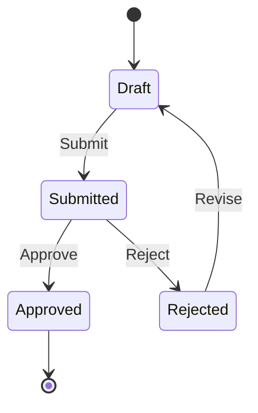
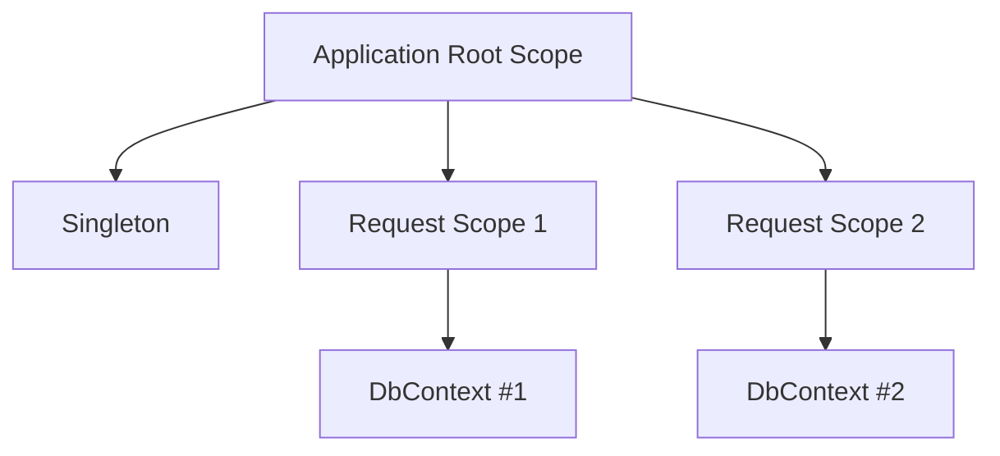
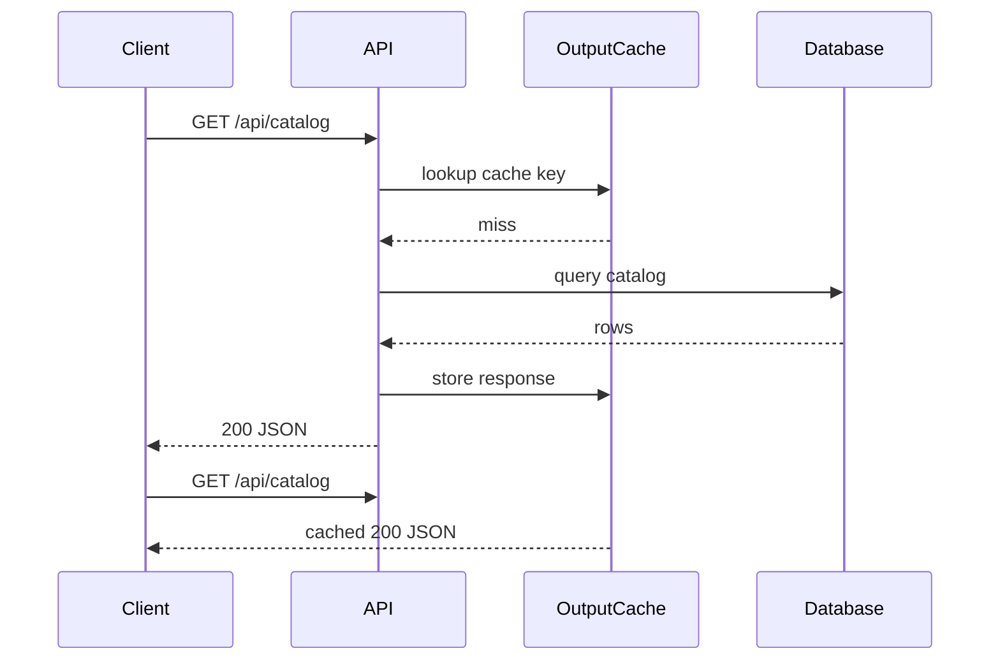
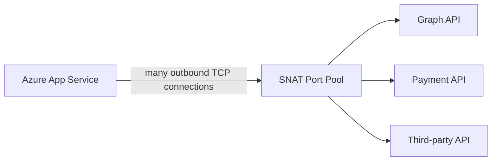
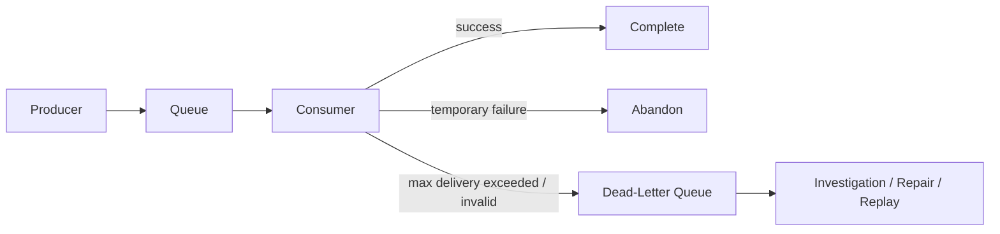
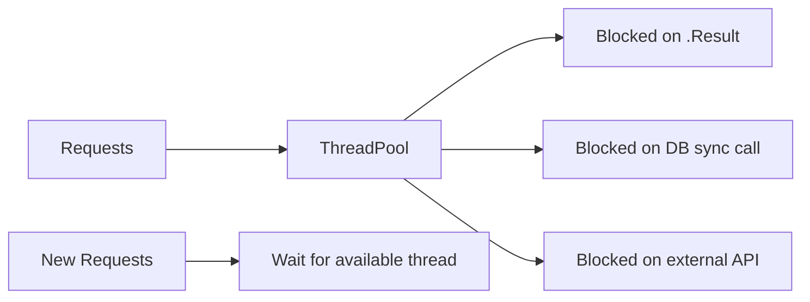
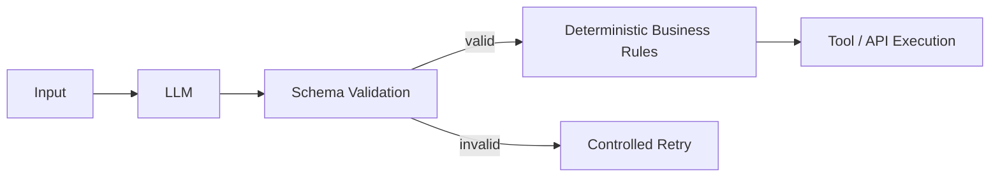
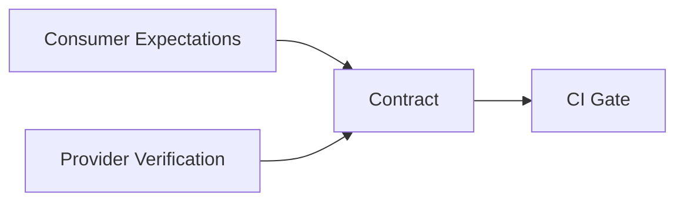

# Daily Knowledge Sharing — 17/08/2026

## Today’s Topics

1. State Pattern — mô hình hóa workflow có trạng thái thay vì rải `if/else` khắp codebase
2. Dependency Injection Lifetimes — tránh captive dependency và scope leak trong ASP.NET Core
3. ASP.NET Core Output Caching — giảm tải API nhưng vẫn kiểm soát freshness và authorization
4. EF Core Execution Strategy — retry transient database failure mà không phá transaction boundary
5. Azure Networking — SNAT Port Exhaustion và vì sao outbound connection có thể làm App Service chậm bất thường
6. Azure Service Bus Dead-Letter Queue — xử lý poison message mà không làm queue chính bị kẹt
7. .NET Memory Optimization — LOH, allocation pressure và GC pause trong production
8. Production Troubleshooting — ThreadPool Starvation và async-over-sync trong ASP.NET Core
9. Structured Output cho LLM — schema validation, retry và deterministic boundary trong AI integration
10. Integration Testing với Contract Testing — phát hiện breaking change giữa API consumer và provider trước production

---

# 1. State Pattern — mô hình hóa workflow có trạng thái thay vì rải `if/else` khắp codebase

### 1. What is it?

State Pattern là một Design Pattern dùng khi hành vi của một object thay đổi dựa trên trạng thái hiện tại của nó.

Một cách đơn giản, thay vì viết hàng chục điều kiện kiểu:

```csharp
if (order.Status == OrderStatus.Pending) { ... }
else if (order.Status == OrderStatus.Paid) { ... }
else if (order.Status == OrderStatus.Cancelled) { ... }
```

ở nhiều nơi, ta gom logic của từng trạng thái và các transition hợp lệ vào một boundary rõ ràng.

Điểm quan trọng là **State Pattern không chỉ là đổi enum thành class**. Mục tiêu thực sự là đảm bảo business workflow có transition hợp lệ, dễ mở rộng và khó bị sửa sai.

### 2. Why does it exist?

Workflow thực tế thường có nhiều trạng thái và rule chuyển trạng thái:

- Draft → Submitted
- Submitted → Approved
- Submitted → Rejected
- Approved không được sửa
- Cancelled không được quay về Draft

Nếu chỉ dùng `enum` và kiểm tra trạng thái rải rác, hệ thống dễ gặp:

- rule bị duplicate;
- endpoint A cho phép transition nhưng endpoint B lại quên check;
- thêm trạng thái mới phải sửa nhiều `switch`;
- test khó bao phủ hết transition.

### 3. How does it work?



Business command không tự ý đổi `Status`. Aggregate hoặc state object quyết định transition có hợp lệ hay không.

### 4. Practical example

```csharp
public sealed class Timesheet
{
    public TimesheetStatus Status { get; private set; } = TimesheetStatus.Draft;

    public void Submit()
    {
        if (Status != TimesheetStatus.Draft)
            throw new InvalidOperationException("Only draft timesheet can be submitted.");

        Status = TimesheetStatus.Submitted;
    }

    public void Approve()
    {
        if (Status != TimesheetStatus.Submitted)
            throw new InvalidOperationException("Only submitted timesheet can be approved.");

        Status = TimesheetStatus.Approved;
    }
}
```

Khi workflow lớn hơn, mỗi state có thể thành object riêng để tránh aggregate chứa một `switch` khổng lồ.

### 5. Real production scenario

Trong hệ thống employee offboarding:

Employee Active → Pending Offboarding → Mailbox Converted → Access Revoked → Completed.

Nếu một background job retry ở giữa workflow, State Pattern giúp nó kiểm tra hiện tại đang ở bước nào thay vì chạy lại toàn bộ pipeline và gây side effect trùng lặp.

### 6. Common mistakes

- Chỉ bọc enum vào class nhưng vẫn để controller đổi state trực tiếp.
- Cho phép transition từ mọi nơi trong hệ thống.
- Không lưu audit trail khi state thay đổi.
- Gắn side effect như gửi email trực tiếp vào state transition mà không cân nhắc retry/idempotency.
- Dùng State Pattern cho workflow quá đơn giản chỉ có 2 trạng thái.

### 7. Trade-offs

**Advantages**

- Business transition rõ ràng.
- Giảm `if/else` phân tán.
- Dễ test transition hợp lệ và không hợp lệ.
- Mở rộng workflow an toàn hơn.

**Costs / Risks**

- Tăng số class nếu workflow nhỏ.
- Có thể overengineer nếu chỉ có vài trạng thái.
- Side effect cần thiết kế riêng để tránh state object trở thành nơi chứa mọi thứ.

### 8. Junior → Middle → Senior understanding

**Junior**

Hiểu rằng state không chỉ là một giá trị enum; mỗi transition phải có business rule.

**Middle**

Biết đóng gói transition, viết unit test và tránh để controller sửa `Status` trực tiếp.

**Senior / Technical Lead**

Biết quyết định khi nào enum đủ, khi nào cần State Pattern, cách kết hợp audit log, event, retry và long-running workflow.

### 9. Key takeaway

- State transition là business rule, không phải thao tác gán enum.
- Centralize transition để tránh rule phân tán.
- Side effect cần tách khỏi state mutation khi có retry hoặc distributed workflow.

---

# 2. Dependency Injection Lifetimes — tránh captive dependency và scope leak trong ASP.NET Core

### 1. What is it?

Trong ASP.NET Core DI container, service thường có ba lifetime chính:

- `Transient`: tạo instance mới mỗi lần resolve.
- `Scoped`: một instance cho mỗi request/scope.
- `Singleton`: một instance cho toàn application lifetime.

Lifetime quyết định **service sống bao lâu và có thể phụ thuộc vào service nào**.

### 2. Why does it exist?

Không phải object nào cũng nên sống cùng thời gian.

`DbContext` cần scoped vì nó đại diện cho một unit of work. Một stateless formatter có thể transient. Một cache configuration có thể singleton.

Nếu lifetime sai, lỗi có thể rất khó thấy:

- singleton giữ `DbContext` scoped;
- background service dùng scoped service mà không tạo scope;
- state request A bị giữ sang request B;
- memory leak do singleton giữ object graph lớn.

### 3. How does it work?



Một singleton sống ở root scope. Nếu nó capture một scoped dependency, scoped object có thể bị kéo dài lifetime sai thiết kế — gọi là **captive dependency**.

### 4. Practical example

Sai:

```csharp
public sealed class ReportCache
{
    private readonly AppDbContext _db;
    public ReportCache(AppDbContext db) => _db = db;
}

services.AddSingleton<ReportCache>();
services.AddDbContext<AppDbContext>();
```

Đúng hơn với background singleton:

```csharp
public sealed class ReportWorker(IServiceScopeFactory scopeFactory)
{
    public async Task RunAsync(CancellationToken ct)
    {
        await using var scope = scopeFactory.CreateAsyncScope();
        var db = scope.ServiceProvider.GetRequiredService<AppDbContext>();
        // use db inside this scope only
    }
}
```

### 5. Real production scenario

Một `BackgroundService` chạy mỗi 5 phút để đồng bộ Microsoft Graph. Nếu inject trực tiếp `DbContext`, application có thể dùng cùng context quá lâu, tracking hàng nghìn entity và cuối cùng tăng memory, stale state hoặc lỗi concurrency.

### 6. Common mistakes

- Singleton phụ thuộc scoped service.
- Tạo service scope nhưng giữ service đã resolve ra ngoài scope.
- Dùng transient cho HTTP client handler không kiểm soát connection pooling.
- Đăng ký singleton cho object có mutable state không thread-safe.
- Cho mọi service thành scoped vì “ASP.NET Core thường dùng scoped”.

### 7. Trade-offs

**Advantages**

Lifetime đúng giúp resource ownership rõ ràng và giảm bug concurrency.

**Costs / Risks**

Thiết kế lifetime phức tạp hơn khi có background worker, queue consumer hoặc parallel workload.

### 8. Junior → Middle → Senior understanding

**Junior**

Phân biệt transient/scoped/singleton.

**Middle**

Biết debug captive dependency, tạo scope trong worker và hiểu `DbContext` lifetime.

**Senior / Technical Lead**

Thiết kế ownership, thread safety và disposal boundary cho service graph lớn.

### 9. Key takeaway

- Lifetime là resource ownership, không chỉ là cấu hình DI.
- Singleton không nên capture scoped dependency.
- Background processing thường phải tự tạo scope.

---

# 3. ASP.NET Core Output Caching — giảm tải API nhưng vẫn kiểm soát freshness và authorization

### 1. What is it?

Output Caching lưu **HTTP response hoàn chỉnh** của endpoint để request tương tự có thể trả lại response đã cache mà không chạy lại toàn bộ controller, business logic và database query.

Khác với data cache, output cache nằm gần HTTP boundary.

### 2. Why does it exist?

Một endpoint đọc dữ liệu công khai có thể được gọi hàng nghìn lần nhưng nội dung chỉ thay đổi vài phút một lần.

Không có output cache:

Client → API → Service → EF Core → Database mỗi request.

Có output cache:

Client → Output Cache → Response.

### 3. How does it work?



Cache key có thể vary theo route, query string, header hoặc custom policy.

### 4. Practical example

```csharp
builder.Services.AddOutputCache();

app.UseOutputCache();

app.MapGet("/api/catalog", async (AppDbContext db) =>
    await db.Products
        .AsNoTracking()
        .Select(x => new { x.Id, x.Name, x.Price })
        .ToListAsync())
    .CacheOutput(p => p.Expire(TimeSpan.FromSeconds(30)));
```

### 5. Real production scenario

Một SaaS có endpoint `/api/configuration/countries` được mobile app gọi thường xuyên. Dữ liệu gần như không đổi. Output cache 5 phút có thể giảm đáng kể CPU, JSON serialization và database load.

### 6. Common mistakes

- Cache response phụ thuộc user nhưng không vary theo user/claim.
- Cache dữ liệu nhạy cảm.
- TTL quá dài nhưng không có invalidation strategy.
- Dùng output cache cho endpoint có side effect.
- Không đo hit ratio và memory usage.

### 7. Trade-offs

**Advantages**

- Giảm DB, CPU và serialization.
- Cải thiện latency.
- Đơn giản cho read-heavy endpoint.

**Costs / Risks**

- Stale data.
- Cache key explosion.
- Security risk nếu response user-specific bị chia sẻ sai.

### 8. Junior → Middle → Senior understanding

**Junior**

Hiểu cache response khác cache object trong service.

**Middle**

Biết cấu hình vary-by, TTL và invalidation.

**Senior / Technical Lead**

Đánh giá consistency, memory footprint, multi-instance behavior và security boundary.

### 9. Key takeaway

- Output cache phù hợp read-heavy endpoint có response ổn định.
- Không cache user-specific response nếu key không tách đúng.
- Đo hit ratio trước khi kết luận cache hiệu quả.

---

# 4. EF Core Execution Strategy — retry transient database failure mà không phá transaction boundary

### 1. What is it?

Execution Strategy trong EF Core là cơ chế retry các lỗi database tạm thời như network interruption, throttling hoặc failover ngắn.

Nó không phải “retry mọi exception”. Nó chỉ nên retry lỗi được xem là transient.

### 2. Why does it exist?

Trong cloud, database connection đôi khi fail tạm thời dù hệ thống không có lỗi logic.

Một request có thể gặp:

- TCP reset;
- Azure SQL failover;
- transient timeout;
- throttling ngắn.

Nếu fail ngay, user thấy lỗi dù request retry sau vài trăm ms có thể thành công.

### 3. How does it work?

```text
Operation
  ↓
Attempt 1 → transient failure
  ↓
Backoff
  ↓
Attempt 2 → success
```

Nhưng khi có transaction thủ công, toàn transaction phải nằm trong execution strategy để được replay an toàn.

### 4. Practical example

```csharp
var strategy = db.Database.CreateExecutionStrategy();

await strategy.ExecuteAsync(async () =>
{
    await using var tx = await db.Database.BeginTransactionAsync(ct);

    db.Orders.Add(order);
    await db.SaveChangesAsync(ct);

    db.OutboxMessages.Add(outbox);
    await db.SaveChangesAsync(ct);

    await tx.CommitAsync(ct);
});
```

### 5. Real production scenario

Payment API lưu payment record và outbox event trong cùng transaction. Nếu Azure SQL failover giữa transaction, retry phải replay cả transaction boundary, không được chỉ retry `SaveChangesAsync` cuối cùng.

### 6. Common mistakes

- Retry mọi `DbUpdateException`.
- Lồng retry Polly bên ngoài EF retry mà không kiểm soát, tạo retry storm.
- Transaction thủ công nằm ngoài execution strategy.
- Operation không idempotent nhưng bị replay.
- Timeout quá dài khiến request treo rất lâu.

### 7. Trade-offs

**Advantages**

- Tăng resilience với lỗi tạm thời.
- Giảm lỗi ngẫu nhiên trong cloud.

**Costs / Risks**

- Tăng latency khi dependency thực sự đang down.
- Retry không đúng có thể duplicate side effect.
- Có thể khuếch đại tải lên database đang quá tải.

### 8. Junior → Middle → Senior understanding

**Junior**

Hiểu transient failure khác business error.

**Middle**

Biết dùng execution strategy với transaction.

**Senior / Technical Lead**

Thiết kế retry budget, idempotency và tránh retry amplification xuyên nhiều layer.

### 9. Key takeaway

- Retry transient error, không retry lỗi logic.
- Transaction replay phải được thiết kế như một unit.
- Retry luôn cần timeout và giới hạn rõ ràng.

---

# 5. Azure Networking — SNAT Port Exhaustion và vì sao outbound connection có thể làm App Service chậm bất thường

### 1. What is it?

SNAT Port Exhaustion xảy ra khi một Azure workload tạo quá nhiều outbound TCP connection tới external endpoint và cạn temporary source ports dùng cho NAT.

Triệu chứng thường giống “API bên ngoài chậm”, nhưng nguyên nhân thật lại nằm ở connection management phía application.

### 2. Why does it exist?

Mỗi outbound TCP connection cần một source port. Nếu code tạo connection mới liên tục, port cũ có thể còn nằm trong `TIME_WAIT` và chưa được tái sử dụng.

Naive pattern:

```csharp
using var client = new HttpClient();
await client.GetAsync(url);
```

trong mọi request có thể tạo connection churn nghiêm trọng.

### 3. How does it work?



Khi port pool cạn, connection mới phải chờ hoặc fail.

### 4. Practical example

Dùng `IHttpClientFactory`:

```csharp
builder.Services.AddHttpClient<GraphGateway>(client =>
{
    client.Timeout = TimeSpan.FromSeconds(10);
});
```

Không tự `new HttpClient()` cho từng request.

### 5. Real production scenario

Employee sync service gọi Microsoft Graph cho hàng nghìn user. Sau khi tăng concurrency từ 20 lên 300, latency tăng đột biến và timeout rải rác. CPU vẫn thấp, DB bình thường. Root cause là outbound connection pressure và SNAT exhaustion.

### 6. Common mistakes

- Tạo `HttpClient` mới mỗi request.
- Tăng parallelism vô hạn.
- Không reuse connection.
- Chỉ nhìn CPU/memory mà bỏ qua network metrics.
- Retry nhanh khi connection fail, làm tình hình tệ hơn.

### 7. Trade-offs

**Advantages của connection reuse**

- Giảm handshake.
- Giảm SNAT pressure.
- Latency ổn định hơn.

**Costs / Risks**

- Cần quản lý DNS refresh và handler lifetime đúng.
- Concurrency vẫn phải có giới hạn.

### 8. Junior → Middle → Senior understanding

**Junior**

Biết `HttpClient` nên được reuse.

**Middle**

Biết dùng `IHttpClientFactory`, timeout và concurrency limit.

**Senior / Technical Lead**

Biết đọc symptom network, thiết kế outbound architecture, NAT Gateway khi cần và đánh giá connection budget.

### 9. Key takeaway

- Network bottleneck có thể xảy ra dù CPU và DB đều khỏe.
- Connection reuse là yêu cầu production, không chỉ coding style.
- Retry + high concurrency có thể làm SNAT exhaustion nặng hơn.

---

# 6. Azure Service Bus Dead-Letter Queue — xử lý poison message mà không làm queue chính bị kẹt

### 1. What is it?

Dead-Letter Queue (DLQ) là nơi Service Bus chuyển những message không thể xử lý thành công sau các điều kiện nhất định.

DLQ cho phép queue chính tiếp tục flow thay vì retry vô hạn một message lỗi.

### 2. Why does it exist?

Một message có thể luôn fail vì:

- schema invalid;
- entity không tồn tại;
- business rule không còn hợp lệ;
- downstream data corrupt;
- bug code.

Retry mãi không biến lỗi permanent thành success.

### 3. How does it work?



### 4. Practical example

```csharp
processor.ProcessMessageAsync += async args =>
{
    try
    {
        await handler.HandleAsync(args.Message, args.CancellationToken);
        await args.CompleteMessageAsync(args.Message);
    }
    catch (InvalidBusinessMessageException ex)
    {
        await args.DeadLetterMessageAsync(
            args.Message,
            "InvalidBusinessMessage",
            ex.Message);
    }
};
```

### 5. Real production scenario

Notification service nhận event `EmployeeOffboarded`. Một message chứa employee ID đã bị xóa khỏi source system. Retry 10 lần vẫn fail. Đẩy DLQ giúp các message khác tiếp tục xử lý và ops có thể kiểm tra riêng message lỗi.

### 6. Common mistakes

- Có DLQ nhưng không monitor.
- Auto-replay toàn bộ DLQ sau deploy mà không phân loại nguyên nhân.
- Lưu exception text chứa dữ liệu nhạy cảm.
- Dùng DLQ như storage lâu dài.
- Không gắn correlation ID hoặc business key.

### 7. Trade-offs

**Advantages**

- Queue chính không bị poison message chặn.
- Có nơi điều tra và replay có kiểm soát.

**Costs / Risks**

- Cần operational process.
- Có thể tích tụ DLQ âm thầm.
- Replay sai có thể tạo duplicate side effect.

### 8. Junior → Middle → Senior understanding

**Junior**

Hiểu retry có giới hạn và message có thể vào DLQ.

**Middle**

Biết classify lỗi transient/permanent và dead-letter đúng lúc.

**Senior / Technical Lead**

Thiết kế DLQ observability, repair workflow, replay tooling và retention policy.

### 9. Key takeaway

- DLQ là operational safety net, không phải nơi “ném lỗi rồi quên”.
- Phân biệt transient với permanent failure.
- Replay phải idempotent và có kiểm soát.

---

# 7. .NET Memory Optimization — LOH, allocation pressure và GC pause trong production

### 1. What is it?

.NET Garbage Collector tự quản lý memory, nhưng application vẫn có thể tạo áp lực allocation quá lớn.

Một vùng quan trọng là Large Object Heap (LOH), nơi các object lớn thường được cấp phát. Allocation lớn và thường xuyên có thể tăng GC cost và memory fragmentation.

### 2. Why does it exist?

Developer đôi khi chỉ nhìn memory leak. Nhưng production issue thường là **allocation pressure**, không phải leak thực sự.

Ví dụ:

- deserialize JSON rất lớn;
- tạo nhiều `byte[]` để xử lý file;
- copy string nhiều lần;
- load toàn bộ file vào RAM thay vì stream.

### 3. How does it work?

```text
Request burst
  ↓
Large allocations
  ↓
GC pressure
  ↓
More frequent / longer GC
  ↓
Latency spikes
```

### 4. Practical example

Không tốt:

```csharp
var bytes = await File.ReadAllBytesAsync(path, ct);
await blobClient.UploadAsync(new BinaryData(bytes), ct);
```

Tốt hơn với file lớn:

```csharp
await using var stream = File.OpenRead(path);
await blobClient.UploadAsync(stream, overwrite: true, cancellationToken: ct);
```

### 5. Real production scenario

API import Excel 100 MB chạy song song cho 20 user. CPU không quá cao nhưng memory tăng mạnh, GC pause kéo dài và toàn API latency tăng. Root cause là mỗi job load file, unzip và materialize toàn workbook cùng lúc.

### 6. Common mistakes

- Gọi `GC.Collect()` để “fix memory”.
- Cache object lớn không giới hạn.
- Load file toàn bộ vào RAM khi có thể stream.
- Dùng `ToList()` quá sớm trên tập dữ liệu lớn.
- Chỉ nhìn total memory mà không đo allocation rate và GC pause.

### 7. Trade-offs

**Advantages của giảm allocation**

- Latency ổn định hơn.
- Giảm memory footprint.
- Tăng throughput.

**Costs / Risks**

- Pooling và buffer reuse tăng complexity.
- Optimization quá sớm làm code khó đọc.

### 8. Junior → Middle → Senior understanding

**Junior**

Hiểu object managed vẫn tiêu memory và GC không miễn phí.

**Middle**

Biết stream, tránh allocation lớn và dùng profiler.

**Senior / Technical Lead**

Biết phân biệt leak, high allocation, fragmentation và GC pause; tối ưu dựa trên evidence.

### 9. Key takeaway

- Memory issue không chỉ là leak.
- Stream dữ liệu lớn thay vì materialize toàn bộ.
- Đo allocation và GC trước khi tối ưu.

---

# 8. Production Troubleshooting — ThreadPool Starvation và async-over-sync trong ASP.NET Core

### 1. What is it?

ThreadPool Starvation xảy ra khi các worker thread bị block quá nhiều, khiến request mới phải chờ thread available dù CPU có thể chưa đạt 100%.

Một nguyên nhân phổ biến trong .NET backend là **async-over-sync** hoặc **sync-over-async**.

### 2. Why does it exist?

ASP.NET Core dựa mạnh vào async I/O để phục vụ nhiều request với số thread hữu hạn.

Nếu code làm:

```csharp
var result = httpClient.GetAsync(url).Result;
```

thread bị block trong lúc chờ network I/O thay vì được trả về pool.

### 3. How does it work?



### 4. Practical example

Sai:

```csharp
public IActionResult Get()
{
    var data = service.LoadAsync().Result;
    return Ok(data);
}
```

Đúng:

```csharp
public async Task<IActionResult> Get(CancellationToken ct)
{
    var data = await service.LoadAsync(ct);
    return Ok(data);
}
```

### 5. Real production scenario

Sau một release, p95 latency tăng từ 300 ms lên 8 giây. CPU chỉ 45%. Database bình thường. Trace cho thấy hàng loạt request chờ external API bằng `.Result`. ThreadPool queue length tăng mạnh.

### 6. Common mistakes

- Dùng `.Result`, `.Wait()` trong request path.
- Bọc synchronous I/O bằng `Task.Run()` rồi nghĩ đã thành async.
- Không propagate `CancellationToken`.
- Tăng minimum threads để che root cause.
- Chỉ scale out thay vì sửa blocking code.

### 7. Trade-offs

**Advantages của async end-to-end**

- Tăng throughput cho I/O-bound workload.
- Giảm số thread bị block.

**Costs / Risks**

- Async code cần propagate toàn call chain.
- CPU-bound work không tự nhanh hơn chỉ vì dùng `async`.

### 8. Junior → Middle → Senior understanding

**Junior**

Biết dùng `await` thay vì `.Result`.

**Middle**

Biết phân biệt I/O-bound và CPU-bound, đọc thread pool metrics.

**Senior / Technical Lead**

Nhìn latency pattern, queue length, traces để phân biệt DB bottleneck, CPU saturation và thread starvation.

### 9. Key takeaway

- CPU thấp không có nghĩa application không bị nghẽn.
- Async phải end-to-end mới hiệu quả.
- Đừng “fix” starvation chỉ bằng tăng thread count.

---

# 9. Structured Output cho LLM — schema validation, retry và deterministic boundary trong AI integration

### 1. What is it?

Structured Output là cách yêu cầu LLM trả dữ liệu theo schema xác định, ví dụ JSON có các field và kiểu dữ liệu cụ thể.

Mục tiêu là biến output AI từ text khó parse thành dữ liệu có thể đưa vào workflow backend một cách kiểm soát.

### 2. Why does it exist?

Nếu chỉ prompt:

> “Return JSON”

model vẫn có thể:

- thêm markdown fence;
- thiếu field;
- sai enum;
- trả text xen JSON;
- tạo dữ liệu hợp cú pháp nhưng sai business rule.

Production workflow cần boundary rõ hơn.

### 3. How does it work?



LLM đề xuất dữ liệu. Deterministic code vẫn quyết định dữ liệu đó có được phép tạo side effect hay không.

### 4. Practical example

```csharp
public sealed record TicketClassification(
    string Category,
    int Priority,
    string Summary);

var result = JsonSerializer.Deserialize<TicketClassification>(json)
    ?? throw new InvalidOperationException("Invalid model output");

if (result.Priority is < 1 or > 5)
    throw new ValidationException("Priority out of range");
```

Schema validation chỉ là bước đầu; business validation vẫn bắt buộc.

### 5. Real production scenario

AI agent đọc support ticket rồi đề xuất:

```json
{
  "category": "billing",
  "priority": 5,
  "summary": "Duplicate payment suspected"
}
```

Backend validate schema, kiểm tra enum, policy và chỉ sau đó mới tạo task escalation. LLM không được tự gọi payment refund trực tiếp.

### 6. Common mistakes

- Tin rằng JSON hợp lệ đồng nghĩa dữ liệu đúng.
- Cho model quyết định permission.
- Retry vô hạn khi schema invalid.
- Không log schema validation failure.
- Schema quá lớn và biến đổi liên tục làm integration brittle.

### 7. Trade-offs

**Advantages**

- Parse ổn định hơn.
- Giảm code xử lý text tự do.
- Dễ test và observe.

**Costs / Risks**

- Schema evolution cần versioning.
- Model vẫn có thể trả nội dung semantically sai.
- Retry làm tăng latency và token cost.

### 8. Junior → Middle → Senior understanding

**Junior**

Hiểu output AI cần validate như input từ external API.

**Middle**

Biết schema validation, retry giới hạn và error handling.

**Senior / Technical Lead**

Thiết kế deterministic control boundary, auditability, cost budget và failure strategy.

### 9. Key takeaway

- LLM output là untrusted input.
- Structured output giảm parsing risk nhưng không thay business validation.
- Permission và side effect phải do deterministic code kiểm soát.

---

# 10. Integration Testing với Contract Testing — phát hiện breaking change giữa API consumer và provider trước production

### 1. What is it?

Contract Testing kiểm tra rằng một service provider và consumer vẫn đồng ý với nhau về API contract.

Nó nằm giữa unit test và end-to-end test:

- unit test kiểm tra logic cục bộ;
- contract test kiểm tra boundary giữa service;
- E2E test kiểm tra toàn flow.

### 2. Why does it exist?

Một backend có thể pass toàn bộ unit test nhưng vẫn phá mobile app nếu đổi:

```json
{ "employeeId": 123 }
```

thành:

```json
{ "id": 123 }
```

Hoặc đổi HTTP status `404` thành `200 null`.

### 3. How does it work?



Consumer định nghĩa expectation quan trọng. Provider build mới phải verify contract trước khi release.

### 4. Practical example

Một test ASP.NET Core có thể xác nhận response shape:

```csharp
var response = await client.GetAsync("/api/employees/42");
response.StatusCode.Should().Be(HttpStatusCode.OK);

var json = await response.Content.ReadFromJsonAsync<JsonElement>();
json.TryGetProperty("employeeId", out _).Should().BeTrue();
json.TryGetProperty("displayName", out _).Should().BeTrue();
```

Ở hệ thống lớn có thể dùng consumer-driven contract tooling, nhưng nguyên tắc vẫn là kiểm thử boundary.

### 5. Real production scenario

Backend team đổi Microsoft 365 integration endpoint. Mobile app và portal release theo cadence khác nhau. Contract test giúp backend biết thay đổi nào phá client cũ trước khi deploy.

### 6. Common mistakes

- Test mọi field nhỏ, khiến contract quá brittle.
- Chỉ test happy path.
- Không version contract.
- Dùng contract test thay hoàn toàn E2E test.
- Mock provider quá mức nên không verify implementation thật.

### 7. Trade-offs

**Advantages**

- Phát hiện breaking change sớm.
- Giảm phụ thuộc vào môi trường E2E lớn.
- Hỗ trợ team deploy độc lập.

**Costs / Risks**

- Cần ownership và versioning contract.
- Test quá chi tiết làm giảm tốc độ thay đổi.

### 8. Junior → Middle → Senior understanding

**Junior**

Hiểu API contract không chỉ là URL mà còn status, schema và behavior.

**Middle**

Biết viết integration test cho success/error contract và backward compatibility.

**Senior / Technical Lead**

Thiết kế compatibility policy, deprecation strategy và CI gate giữa nhiều consumer/provider.

### 9. Key takeaway

- Unit test pass không đảm bảo integration không bị phá.
- Contract test tập trung vào boundary mà consumer thật sự phụ thuộc.
- Đừng biến contract thành snapshot của mọi chi tiết implementation.