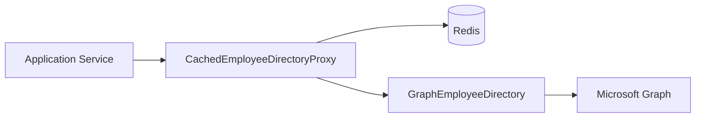
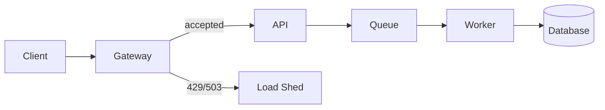
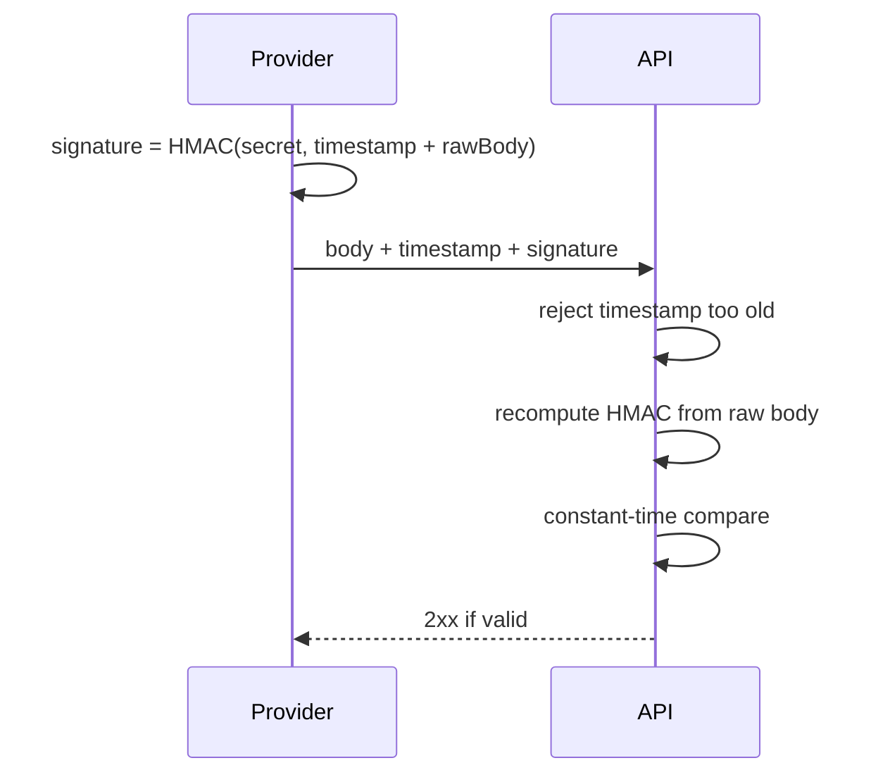
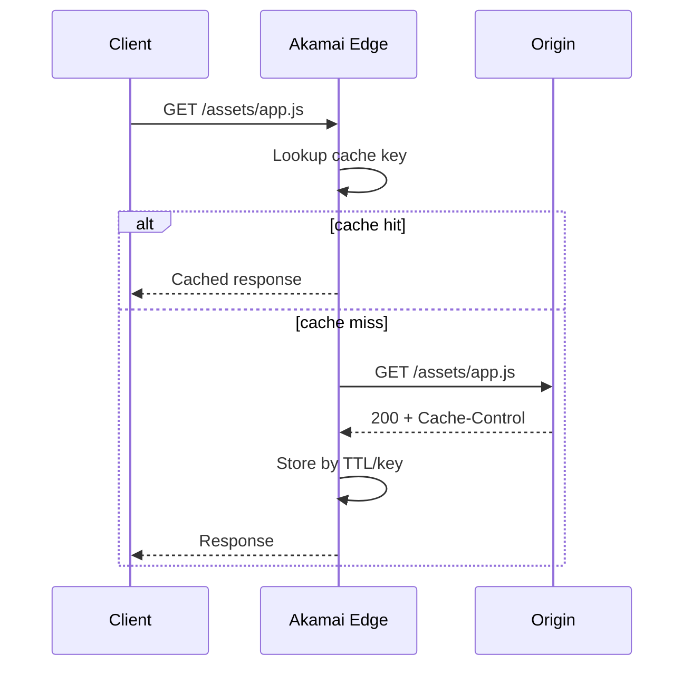
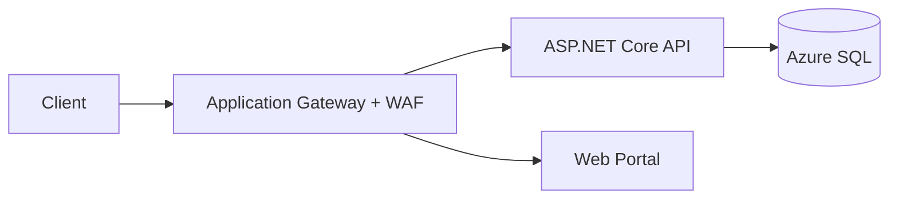
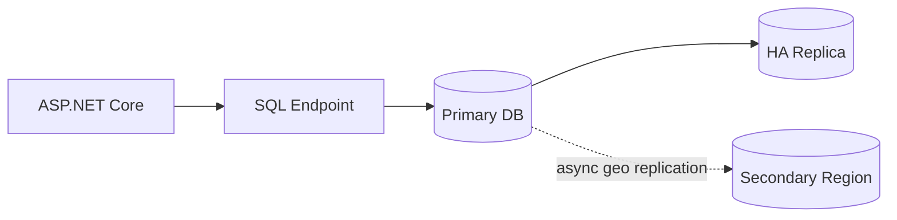
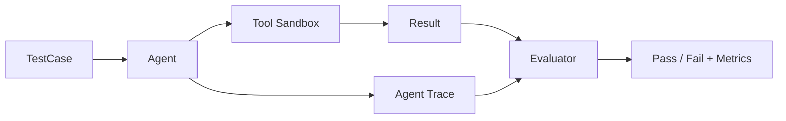
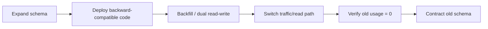

# Daily Knowledge Sharing — 17/08/2026

## Today’s Topics

1. Proxy Pattern — kiểm soát remote call, cache và access boundary mà không làm business code phụ thuộc hạ tầng
2. Distributed Systems Backpressure & Load Shedding — bảo vệ hệ thống khi traffic vượt quá capacity
3. API Security — HMAC Request Signing cho webhook và service integration
4. PostgreSQL MVCC, VACUUM & Table Bloat — vì sao database chậm dần dù query không đổi
5. Akamai CDN — cache key, purge và origin protection trong production
6. Azure Application Gateway — WAF, end-to-end TLS và routing cho ASP.NET Core workload
7. Azure SQL High Availability — zone redundancy, failover và read-scale architecture
8. SLO Burn-Rate Alerting — alert theo tốc độ tiêu thụ error budget thay vì threshold tĩnh
9. AI Agent Evaluation — kiểm thử tool-use, safety boundary và failure recovery trước production
10. Expand-Contract Deployment — thay đổi API/database không downtime trong CI/CD

---

# 1. Proxy Pattern — kiểm soát remote call, cache và access boundary mà không làm business code phụ thuộc hạ tầng

### 1. What is it?

Proxy Pattern là một object đứng giữa caller và dependency thật, giữ cùng một capability nhưng bổ sung hành vi trước hoặc sau khi forward call. Proxy có thể dùng để cache, lazy-load, kiểm soát quyền, đo telemetry, giới hạn concurrency hoặc gọi remote service.

Trong backend .NET, proxy hữu ích khi application chỉ nên biết một capability như `IEmployeeDirectory`, còn chi tiết gọi Microsoft Graph, retry, cache token hay rate limit nằm ngoài business logic.

Điểm khác với Adapter: Adapter đổi interface của dependency thành interface phù hợp với hệ thống; Proxy thường giữ nguyên capability và **kiểm soát cách truy cập implementation thật**.

### 2. Why does it exist?

Nếu business code gọi thẳng SDK hoặc HTTP client, các concern hạ tầng thường bị trộn vào use case:

- gọi API,
- xử lý retry,
- cache,
- logging,
- permission,
- rate limit,
- fallback.

Kết quả là use case khó test, khó thay provider và dễ tạo logic khác nhau ở nhiều nơi.

Proxy tồn tại để đặt một boundary có thể kiểm soát giữa code nghiệp vụ và resource thật.

### 3. How does it work?



Flow đọc employee:

1. Application gọi `GetEmployeeAsync`.
2. Proxy kiểm tra Redis.
3. Cache hit → trả ngay.
4. Cache miss → gọi implementation thật.
5. Proxy lưu kết quả với TTL phù hợp.
6. Application không biết dữ liệu đến từ cache hay Microsoft Graph.

### 4. Practical example

```csharp
public interface IEmployeeDirectory
{
    Task<EmployeeProfile?> GetAsync(string employeeId, CancellationToken ct);
}

public sealed class CachedEmployeeDirectoryProxy(
    IEmployeeDirectory inner,
    IDistributedCache cache) : IEmployeeDirectory
{
    public async Task<EmployeeProfile?> GetAsync(string employeeId, CancellationToken ct)
    {
        var key = $"employee:{employeeId}";
        var cached = await cache.GetStringAsync(key, ct);

        if (cached is not null)
            return JsonSerializer.Deserialize<EmployeeProfile>(cached);

        var employee = await inner.GetAsync(employeeId, ct);
        if (employee is null) return null;

        await cache.SetStringAsync(
            key,
            JsonSerializer.Serialize(employee),
            new DistributedCacheEntryOptions
            {
                AbsoluteExpirationRelativeToNow = TimeSpan.FromMinutes(5)
            },
            ct);

        return employee;
    }
}
```

Application layer chỉ phụ thuộc `IEmployeeDirectory`.

### 5. Real production scenario

Một employee-management system gọi Microsoft Graph để lấy manager, department và profile. Nếu mỗi request gọi Graph trực tiếp, latency tăng và nhanh chạm throttling.

Đặt một proxy caching ở infrastructure boundary giúp:

- giảm Graph calls,
- giảm latency,
- giữ business code đơn giản,
- centralize telemetry và throttling handling.

Nếu Graph tạm thời lỗi, proxy có thể áp dụng stale-if-error cho dữ liệu không quá nhạy về freshness.

### 6. Common mistakes

- Biến proxy thành nơi chứa business rule.
- Cache dữ liệu có yêu cầu consistency cao mà không có invalidation strategy.
- Proxy nuốt exception khiến caller tưởng request thành công.
- Đặt retry ở cả proxy và HTTP handler, tạo retry multiplication.
- Tạo quá nhiều wrapper chỉ để “đúng pattern”.

### 7. Trade-offs

**Advantages**

- Tách cross-cutting concern khỏi business logic.
- Dễ thay provider hoặc thêm cache/telemetry.
- Giảm coupling với SDK bên ngoài.

**Costs / Risks**

- Tăng abstraction và call depth.
- Dễ che khuất latency/failure thật nếu proxy xử lý quá nhiều.
- Cache proxy có thể gây stale data.

### 8. Junior → Middle → Senior understanding

**Junior**

Hiểu proxy là object đứng trước dependency thật và có thể bổ sung hành vi trước khi forward call.

**Middle**

Biết triển khai proxy với DI, cache, telemetry và cancellation; phân biệt Proxy với Adapter/Decorator.

**Senior / Technical Lead**

Quyết định concern nào nên nằm ở proxy, concern nào nên nằm ở HTTP pipeline, resilience policy hoặc application layer; thiết kế freshness, fallback và observability rõ ràng.

### 9. Key takeaway

- Proxy là access boundary, không phải nơi nhét business logic.
- Dùng proxy khi muốn kiểm soát cách truy cập dependency thật.
- Luôn làm rõ cache consistency, failure semantics và retry ownership.

---

# 2. Distributed Systems Backpressure & Load Shedding — bảo vệ hệ thống khi traffic vượt quá capacity

### 1. What is it?

**Backpressure** là cơ chế khiến upstream chậm lại khi downstream không xử lý kịp. **Load shedding** là chủ động từ chối bớt workload khi hệ thống đã gần hoặc vượt capacity.

Hai khái niệm này không nhằm làm hệ thống “nhanh hơn”; chúng nhằm giữ hệ thống **sống và phục hồi được** thay vì nhận vô hạn request rồi sập toàn bộ.

### 2. Why does it exist?

Một service có capacity hữu hạn: thread, connection, CPU, memory, database connections, downstream quota.

Nếu incoming rate > processing rate:

```text
queue length ↑
latency ↑
timeout ↑
retry ↑
load ↑
```

Retry làm tình hình xấu hơn, cuối cùng tạo retry storm và cascading failure.

Naive solution “cứ nhận request rồi xử lý sau” chỉ chuyển overload thành queue backlog và memory pressure.

### 3. How does it work?



Có thể áp dụng nhiều tầng:

1. Gateway rate limit request dư thừa.
2. API dùng bounded channel/queue.
3. Khi queue đầy, trả `429 Too Many Requests` hoặc `503 Service Unavailable`.
4. Worker chỉ chạy concurrency phù hợp với DB/downstream capacity.
5. Client retry bằng exponential backoff + jitter.

### 4. Practical example

```csharp
var channel = Channel.CreateBounded<Job>(new BoundedChannelOptions(500)
{
    FullMode = BoundedChannelFullMode.DropWrite,
    SingleReader = false,
    SingleWriter = false
});

app.MapPost("/jobs", async (Job job) =>
{
    if (!channel.Writer.TryWrite(job))
    {
        return Results.StatusCode(StatusCodes.Status503ServiceUnavailable);
    }

    return Results.Accepted();
});
```

Trong production, response nên kèm `Retry-After` khi phù hợp.

### 5. Real production scenario

Một notification system có thể gửi tối đa 100 email/giây vì provider giới hạn quota. Sau một campaign lớn, API nhận 2.000 request/giây.

Nếu worker scale vô hạn:

- provider trả 429,
- retry tăng,
- connection tăng,
- queue backlog lớn,
- latency khó dự đoán.

Thiết kế tốt giới hạn queue, giới hạn worker concurrency và reject sớm khi hệ thống quá tải.

### 6. Common mistakes

- Dùng unbounded queue.
- Scale worker dựa trên queue length nhưng bỏ qua DB/downstream capacity.
- Retry ngay lập tức khi nhận 429/503.
- Load shed request quan trọng và request không quan trọng như nhau.
- Không có priority hoặc admission control.

### 7. Trade-offs

**Advantages**

- Ngăn cascading failure.
- Latency ổn định hơn trong overload.
- Recovery nhanh hơn sau traffic spike.

**Costs / Risks**

- Một phần request bị reject.
- Cần capacity model và observability tốt.
- Priority handling làm hệ thống phức tạp hơn.

### 8. Junior → Middle → Senior understanding

**Junior**

Hiểu hệ thống không thể xử lý vô hạn request và queue không phải vô hạn.

**Middle**

Biết dùng bounded queue, concurrency limit, `429/503`, retry backoff và metrics queue depth.

**Senior / Technical Lead**

Thiết kế admission control theo business priority, xác định saturation signal, capacity boundary và cách degradation khi dependency downstream quá tải.

### 9. Key takeaway

- Overload phải được kiểm soát, không được “hy vọng hệ thống tự chịu được”.
- Bounded concurrency và bounded queue là safety mechanism.
- Reject có kiểm soát tốt hơn timeout hàng loạt.

---

# 3. API Security — HMAC Request Signing cho webhook và service integration

### 1. What is it?

HMAC request signing là cách dùng một shared secret để tạo chữ ký từ nội dung request. Receiver tính lại chữ ký và so sánh để xác minh request không bị sửa và đến từ bên sở hữu secret.

Nó thường xuất hiện trong webhook integration như payment provider, shipping provider hoặc internal service integration.

### 2. Why does it exist?

HTTPS bảo vệ dữ liệu **trên đường truyền**, nhưng không tự chứng minh request thật sự do provider mong đợi gửi tới endpoint webhook của bạn.

Nếu endpoint webhook public và chỉ kiểm tra JSON payload, attacker có thể tự gửi:

```http
POST /webhooks/payment
{"orderId":"123","status":"Paid"}
```

Nếu API tin payload này, attacker có thể giả mạo business event.

### 3. How does it work?



Các thành phần quan trọng:

- raw request body,
- timestamp,
- signature header,
- replay window,
- constant-time comparison.

### 4. Practical example

```csharp
static bool VerifySignature(
    string rawBody,
    string timestamp,
    string suppliedSignature,
    string secret)
{
    var payload = $"{timestamp}.{rawBody}";
    using var hmac = new HMACSHA256(Encoding.UTF8.GetBytes(secret));
    var expected = hmac.ComputeHash(Encoding.UTF8.GetBytes(payload));

    var supplied = Convert.FromHexString(suppliedSignature);
    return supplied.Length == expected.Length &&
           CryptographicOperations.FixedTimeEquals(supplied, expected);
}
```

Sau khi verify signature, vẫn cần idempotency theo `eventId`.

### 5. Real production scenario

Payment provider gửi `payment.succeeded`. API:

1. Verify timestamp và HMAC.
2. Check `eventId` đã xử lý chưa.
3. Lưu event vào inbox table.
4. Update payment state trong transaction phù hợp.
5. Trả 2xx nhanh.
6. Business side effect chạy async.

### 6. Common mistakes

- Parse JSON rồi serialize lại trước khi verify; raw body đã thay đổi format.
- Không kiểm tra timestamp → replay attack.
- Dùng `==` để compare signature thay vì constant-time compare.
- Hard-code webhook secret.
- Xem HMAC là thay thế cho idempotency.
- Log raw payload chứa dữ liệu nhạy cảm.

### 7. Trade-offs

**Advantages**

- Đơn giản và hiệu quả cho webhook.
- Không cần full OAuth flow.
- Xác minh integrity và possession of secret.

**Costs / Risks**

- Shared secret phải được rotate và bảo vệ tốt.
- Không phù hợp cho multi-tenant authorization phức tạp.
- Cần canonicalization rõ ràng nếu ký nhiều thành phần request.

### 8. Junior → Middle → Senior understanding

**Junior**

Hiểu signature xác minh request chứ không chỉ mã hóa traffic.

**Middle**

Biết verify raw body, timestamp, constant-time compare, secret từ Key Vault và idempotency.

**Senior / Technical Lead**

Thiết kế replay protection, secret rotation, multi-secret overlap trong thời gian rotate, incident response khi secret compromise.

### 9. Key takeaway

- HTTPS và request authentication giải quyết hai vấn đề khác nhau.
- HMAC webhook phải có timestamp + replay protection.
- Signature verification và idempotency đều cần thiết.

---

# 4. PostgreSQL MVCC, VACUUM & Table Bloat — vì sao database chậm dần dù query không đổi

### 1. What is it?

PostgreSQL dùng **MVCC — Multi-Version Concurrency Control** để nhiều transaction đọc/ghi đồng thời mà không khóa đọc theo cách đơn giản.

Khi `UPDATE` hoặc `DELETE`, PostgreSQL thường không sửa/xóa tuple tại chỗ. Nó tạo version mới và để version cũ thành dead tuple. `VACUUM` dọn các tuple không còn cần thiết.

**Table bloat** xảy ra khi dead tuples và page không được reclaim hiệu quả, khiến table/index lớn hơn mức cần thiết.

### 2. Why does it exist?

MVCC cho phép reader không bị writer block trong nhiều trường hợp. Nhưng cái giá là version cũ phải tồn tại đủ lâu để transaction đang chạy có snapshot nhất quán.

Nếu vacuum không theo kịp write workload hoặc có transaction sống quá lâu:

- dead tuples tăng,
- index/table phình,
- I/O tăng,
- cache hit ratio giảm,
- query cùng SQL nhưng chậm dần.

### 3. How does it work?

```text
UPDATE row
   ↓
old tuple → dead nhưng chưa xóa ngay
new tuple → visible theo MVCC rules
   ↓
VACUUM xác định tuple không transaction nào cần nữa
   ↓
space có thể tái sử dụng
```

`VACUUM` thường không shrink file về OS; `VACUUM FULL` có thể compact mạnh hơn nhưng cần lock lớn và rewrite table.

### 4. Practical example

Kiểm tra dead tuples:

```sql
SELECT
    relname,
    n_live_tup,
    n_dead_tup,
    last_autovacuum
FROM pg_stat_user_tables
ORDER BY n_dead_tup DESC;
```

Tìm transaction chạy lâu:

```sql
SELECT pid, usename, state, xact_start, query
FROM pg_stat_activity
WHERE xact_start IS NOT NULL
ORDER BY xact_start;
```

Với workload update-heavy, có thể tune autovacuum theo table thay vì chỉ dùng global default.

### 5. Real production scenario

Một SaaS có bảng `JobStatus` được update liên tục hàng triệu lần/ngày. Ban đầu table 10 GB, vài tháng sau 60 GB dù số row gần như không tăng.

Latency tăng vì:

- heap lớn,
- index bloat,
- nhiều page phải đọc,
- autovacuum không theo kịp.

Điều tra phải nhìn MVCC, dead tuples và long-running transactions, không chỉ query text.

### 6. Common mistakes

- Tắt autovacuum vì nghĩ nó “tốn CPU”.
- Dùng transaction kéo dài hàng giờ.
- Chỉ nhìn `EXPLAIN` mà bỏ qua table/index size growth.
- Chạy `VACUUM FULL` tùy tiện trong giờ cao điểm.
- Không theo dõi autovacuum lag.

### 7. Trade-offs

**Advantages của MVCC**

- Read concurrency tốt.
- Ít reader/writer blocking.
- Snapshot semantics mạnh.

**Costs / Risks**

- Cần vacuum.
- Write amplification và storage overhead.
- Long transaction có thể giữ dead tuple lâu.

### 8. Junior → Middle → Senior understanding

**Junior**

Hiểu update/delete không nhất thiết xóa dữ liệu vật lý ngay.

**Middle**

Biết đọc `pg_stat_user_tables`, kiểm tra long transaction và autovacuum behavior.

**Senior / Technical Lead**

Thiết kế write-heavy schema, tune autovacuum theo table, tránh transaction sống lâu và lập capacity/storage plan dựa trên churn chứ không chỉ row count.

### 9. Key takeaway

- PostgreSQL performance phụ thuộc cả query lẫn data churn.
- MVCC cần VACUUM để giữ hệ thống khỏe.
- Long-running transaction là hidden enemy của vacuum.

---

# 5. Akamai CDN — cache key, purge và origin protection trong production

### 1. What is it?

Akamai CDN đặt edge servers gần người dùng để serve static hoặc cacheable HTTP responses mà không cần request nào cũng về origin.

Trong production, phần quan trọng không phải chỉ “bật CDN”, mà là thiết kế:

- cache key,
- TTL,
- cacheability,
- purge/invalidation,
- origin shielding/protection,
- header/query normalization.

### 2. Why does it exist?

Nếu client toàn cầu luôn gọi trực tiếp origin:

- latency tăng theo khoảng cách,
- origin chịu toàn bộ traffic,
- traffic spike có thể overload backend,
- bandwidth origin cao.

CDN phân phối load và đưa cache gần user.

### 3. How does it work?



Cache key có thể gồm path, query parameter chọn lọc, host, header cụ thể.

### 4. Practical example

Origin response:

```http
Cache-Control: public, max-age=300, s-maxage=3600
ETag: "catalog-v42"
```

Không nên để toàn bộ query string mặc định vào cache key nếu nhiều parameter tracking như `utm_source`, vì sẽ làm cache fragmentation.

Ví dụ normalize:

```text
/products?id=123&utm_source=facebook
/products?id=123&utm_source=email
```

Có thể nên dùng cùng cache key nếu `utm_source` không ảnh hưởng response.

### 5. Real production scenario

E-commerce có product catalog chủ yếu đọc. Sau chiến dịch marketing, traffic tăng 10x.

Nếu CDN cache product images và catalog response phù hợp:

- origin request giảm mạnh,
- latency giảm,
- database ít bị burst load.

Khi giá sản phẩm đổi, hệ thống cần purge chính xác hoặc version key để tránh stale price.

### 6. Common mistakes

- Cache response có `Authorization` mà không thiết kế private/public semantics đúng.
- Cache key chứa quá nhiều query/header → hit ratio thấp.
- TTL rất dài nhưng không có purge strategy.
- Purge toàn bộ property thường xuyên → origin stampede.
- Không bảo vệ origin khỏi direct access.

### 7. Trade-offs

**Advantages**

- Latency thấp hơn.
- Giảm origin load và bandwidth.
- Hấp thụ traffic spike tốt.

**Costs / Risks**

- Stale content.
- Cache configuration phức tạp.
- Purge sai có thể tạo burst về origin.

### 8. Junior → Middle → Senior understanding

**Junior**

Hiểu CDN cache nội dung ở edge gần user.

**Middle**

Biết đọc `Cache-Control`, thiết kế TTL, cache key và purge.

**Senior / Technical Lead**

Thiết kế origin protection, cache segmentation, invalidation strategy, hit-ratio SLO và failure mode khi purge/global config thay đổi.

### 9. Key takeaway

- CDN hiệu quả phụ thuộc cache key đúng hơn là TTL dài.
- Invalidation là phần khó nhất của caching ở edge.
- Cache miss burst phải được xem như failure scenario.

---

# 6. Azure Application Gateway — WAF, end-to-end TLS và routing cho ASP.NET Core workload

### 1. What is it?

Azure Application Gateway là Layer-7 load balancer/reverse proxy cho HTTP(S). Nó hỗ trợ URL/path routing, TLS termination, Web Application Firewall (WAF), health probes và routing đến backend pools.

Nó phù hợp khi cần kiểm soát HTTP routing và WAF ở regional entry point.

### 2. Why does it exist?

Một ASP.NET Core workload production thường cần nhiều hơn việc expose App Service/VM trực tiếp:

- HTTPS termination,
- WAF,
- routing `/api/*` và `/portal/*`,
- health-aware routing,
- private backend,
- centralized ingress policy.

### 3. How does it work?



Với end-to-end TLS:

1. Client TLS tới Application Gateway.
2. Gateway decrypt/inspect request cho WAF.
3. Gateway tạo TLS connection mới tới backend HTTPS.
4. Health probe loại backend unhealthy khỏi routing.

### 4. Practical example

Routing design:

```text
/api/*    → api-backend-pool
/admin/*  → admin-backend-pool
/*        → portal-backend-pool
```

ASP.NET Core nên cấu hình forwarded headers đúng nếu cần scheme/client IP:

```csharp
app.UseForwardedHeaders(new ForwardedHeadersOptions
{
    ForwardedHeaders = ForwardedHeaders.XForwardedFor |
                       ForwardedHeaders.XForwardedProto
});
```

### 5. Real production scenario

Một employee SaaS chạy API và portal ở private network. Chỉ Application Gateway có public frontend.

WAF block common exploit patterns; backend nhận traffic từ gateway; Key Vault quản lý certificate; Azure Monitor thu metrics như failed requests, unhealthy hosts và WAF detections.

### 6. Common mistakes

- Chỉ terminate TLS ở gateway rồi dùng HTTP plaintext đến backend trong network có security requirement cao.
- Health probe gọi endpoint phụ thuộc mọi downstream service → backend bị loại chỉ vì dependency phụ lỗi.
- Không tune WAF false positive trước khi bật prevention mode.
- Không cấu hình forwarded headers đúng.
- Dùng Application Gateway cho bài toán global load balancing vốn phù hợp Front Door hơn.

### 7. Trade-offs

**Advantages**

- Layer-7 routing mạnh.
- WAF tích hợp.
- Hỗ trợ private backend.

**Costs / Risks**

- Tăng cost và operational complexity.
- WAF policy cần tuning.
- Regional scope, không thay thế global edge routing.

### 8. Junior → Middle → Senior understanding

**Junior**

Hiểu Application Gateway đứng trước application và route HTTP traffic.

**Middle**

Biết path routing, health probe, TLS, WAF và forwarded headers.

**Senior / Technical Lead**

Quyết định Application Gateway vs Front Door vs Load Balancer; thiết kế private ingress, certificate rotation, WAF rollout và failure isolation.

### 9. Key takeaway

- Application Gateway là Layer-7 regional ingress, không chỉ là load balancer đơn giản.
- Health probe và WAF policy phải phản ánh failure semantics thật.
- End-to-end TLS là một quyết định security architecture.

---

# 7. Azure SQL High Availability — zone redundancy, failover và read-scale architecture

### 1. What is it?

High Availability cho Azure SQL là tập hợp cơ chế giúp database tiếp tục phục vụ hoặc phục hồi nhanh khi compute, storage, availability zone hoặc region gặp sự cố.

Các khái niệm quan trọng gồm:

- built-in HA,
- zone redundancy,
- failover group / geo-replication,
- read replica/read scale,
- connection retry.

### 2. Why does it exist?

Database thường là dependency quan trọng nhất của backend. Nếu database unavailable, scale API lên 20 instance cũng không giúp.

Naive design chỉ có một database endpoint và không chuẩn bị failover sẽ gặp:

- connection reset,
- transient errors,
- application retry storm,
- region outage không có recovery path.

### 3. How does it work?



Application thường không nên tự “chọn node” cho HA nội vùng; platform endpoint thực hiện failover. Với geo failover group, listener có thể chuyển sang secondary region.

### 4. Practical example

EF Core connection resiliency:

```csharp
services.AddDbContext<AppDbContext>(options =>
    options.UseSqlServer(connectionString, sql =>
        sql.EnableRetryOnFailure(
            maxRetryCount: 5,
            maxRetryDelay: TimeSpan.FromSeconds(10),
            errorNumbersToAdd: null)));
```

Retry chỉ xử lý transient connection failure; không thay thế transaction/idempotency design.

### 5. Real production scenario

Timesheet SaaS cần RTO thấp. API chạy multi-zone, Azure SQL bật zone redundancy. Với disaster recovery, secondary database ở region khác.

Khi primary failover:

- một số connection đang mở lỗi,
- pool reconnect,
- transient retry xử lý request an toàn,
- monitoring xác nhận failover duration.

Nếu region fail hoàn toàn, runbook kích hoạt geo failover và kiểm tra dependent services.

### 6. Common mistakes

- Nghĩ bật geo-replication nghĩa là zero data loss; asynchronous replication vẫn có RPO.
- Retry transaction không idempotent mà không hiểu commit outcome.
- Không test failover định kỳ.
- Read-scale replica dùng cho query cần read-after-write consistency tuyệt đối.
- Chỉ thiết kế database failover nhưng Key Vault, storage, identity, DNS không có DR plan.

### 7. Trade-offs

**Advantages**

- Tăng availability và resilience.
- Có lựa chọn regional DR.
- Read replica có thể offload workload đọc.

**Costs / Risks**

- Tăng cost.
- Geo replication có consistency lag.
- DR architecture phức tạp hơn nhiều so với chỉ database.

### 8. Junior → Middle → Senior understanding

**Junior**

Hiểu HA giúp database tiếp tục phục vụ khi node hỏng.

**Middle**

Biết transient retry, connection pooling, read replica và failover behavior.

**Senior / Technical Lead**

Định nghĩa RPO/RTO, chọn zone vs region redundancy, kiểm tra commit ambiguity, DR dependencies và runbook failover/failback.

### 9. Key takeaway

- HA không đồng nghĩa DR, DR không đồng nghĩa zero data loss.
- Application vẫn phải chịu được transient disconnect khi failover.
- RPO/RTO phải được xác định trước khi chọn architecture.

---

# 8. SLO Burn-Rate Alerting — alert theo tốc độ tiêu thụ error budget thay vì threshold tĩnh

### 1. What is it?

Burn rate đo tốc độ hệ thống đang tiêu thụ **error budget** so với tốc độ cho phép bởi SLO.

Ví dụ SLO availability 99.9% trong 30 ngày cho phép khoảng 0.1% request lỗi. Nếu hiện tại error rate cao gấp 20 lần mức cho phép, burn rate = 20.

### 2. Why does it exist?

Threshold alert kiểu:

```text
CPU > 80%
Error count > 100
Latency > 2s
```

không phản ánh trực tiếp ảnh hưởng tới reliability objective.

100 errors có thể nghiêm trọng nếu traffic 1.000 request, nhưng không đáng kể nếu traffic 100 triệu request.

Burn-rate alert liên kết alert với SLO và business impact.

### 3. How does it work?

Giả sử SLO success = 99.9%.

Allowed error rate:

```text
1 - 0.999 = 0.001 = 0.1%
```

Nếu current error rate = 2%:

```text
burn rate = 2% / 0.1% = 20x
```

Multi-window alert thường kết hợp cửa sổ ngắn và dài để tránh noise:

```text
Fast burn: 1h + 5m
Slow burn: 6h + 30m
```

### 4. Practical example

Pseudo-PromQL concept:

```text
error_rate_5m / allowed_error_rate > 14
AND
error_rate_1h / allowed_error_rate > 14
```

Trong Azure Monitor/Application Insights có thể tạo metric từ success/failure request và alert dựa trên window tương ứng.

### 5. Real production scenario

Payment API có SLO 99.95%. Một dependency bắt đầu lỗi 3% request.

CPU vẫn 40%, memory bình thường, nhưng user đang thất bại thanh toán. Burn-rate alert phát hiện nhanh vì error budget bị đốt cực nhanh, trong khi infrastructure threshold có thể không báo gì.

### 6. Common mistakes

- Định nghĩa SLO quá rộng, trộn nhiều endpoint có criticality khác nhau.
- Alert mọi SLI fluctuation nhỏ.
- Không loại expected errors như validation 4xx khỏi availability SLI.
- Chỉ dùng cửa sổ 5 phút → noise.
- SLO có nhưng không liên kết incident policy.

### 7. Trade-offs

**Advantages**

- Alert gắn với user impact.
- Giảm alert fatigue.
- Giúp ưu tiên incident theo reliability budget.

**Costs / Risks**

- Cần SLI/SLO đúng trước.
- Query và monitoring model phức tạp hơn threshold đơn giản.
- SLO sai dẫn đến alert sai ưu tiên.

### 8. Junior → Middle → Senior understanding

**Junior**

Hiểu SLO là reliability target và error budget là phần failure được phép.

**Middle**

Biết tính error rate/burn rate và xây multi-window alert.

**Senior / Technical Lead**

Định nghĩa SLI theo user journey, tách critical flows, đặt paging threshold và dùng error budget trong release/risk decision.

### 9. Key takeaway

- Alert nên đo user impact, không chỉ tài nguyên.
- Burn rate trả lời “chúng ta đang tiêu error budget nhanh đến mức nào?”.
- SLO tốt biến observability thành decision framework.

---

# 9. AI Agent Evaluation — kiểm thử tool-use, safety boundary và failure recovery trước production

### 1. What is it?

AI Agent Evaluation là quá trình đánh giá agent không chỉ theo “câu trả lời hay hay dở” mà theo toàn bộ workflow:

- chọn đúng tool,
- truyền đúng argument,
- tuân thủ permission boundary,
- không thực hiện hành động nguy hiểm,
- xử lý tool failure,
- biết dừng,
- biết yêu cầu human approval khi cần.

### 2. Why does it exist?

Một agent có thể trả lời văn bản hợp lý nhưng vẫn thất bại operationally:

- gọi sai API,
- gửi email nhầm người,
- retry vô hạn,
- đọc dữ liệu ngoài scope,
- bỏ qua approval step,
- hallucinate rằng tool đã thành công.

Do đó eval production phải kiểm tra **trajectory và side effects**, không chỉ final answer.

### 3. How does it work?



Một test case nên mô tả:

- initial context,
- allowed tools,
- forbidden action,
- mocked tool responses,
- expected final state,
- stop condition.

### 4. Practical example

Một agent xử lý offboarding employee:

```json
{
  "case": "manager approval missing",
  "allowed": ["read_employee", "read_request"],
  "forbidden": ["disable_account", "delete_mailbox"],
  "expected": "request_human_approval"
}
```

Evaluator deterministic có thể fail test nếu trace chứa call đến `disable_account`.

Pseudo C# assertion:

```csharp
Assert.DoesNotContain(trace.ToolCalls,
    x => x.Name == "disable_account");
Assert.Contains(trace.Events,
    x => x.Type == "approval_required");
```

### 5. Real production scenario

AI support agent có tool:

- query customer account,
- refund order,
- create ticket.

Eval suite phải cover:

- normal refund,
- duplicate refund request,
- refund vượt limit,
- tool timeout,
- malicious prompt injection trong ticket content,
- permission mismatch,
- incomplete context.

### 6. Common mistakes

- Chỉ dùng LLM-as-judge cho mọi thứ.
- Không assert deterministic safety rule.
- Eval final text nhưng không lưu tool trace.
- Không test timeout/retry/tool malformed response.
- Test dataset quá sạch, không có adversarial cases.
- Không version prompt/model/tool schema cùng eval results.

### 7. Trade-offs

**Advantages**

- Bắt regression trước production.
- Đo safety và reliability cụ thể.
- Cho phép thay model/prompt có bằng chứng.

**Costs / Risks**

- Tốn token/cost và thời gian chạy.
- Một phần chất lượng cần judgment thống kê.
- Tool sandbox/test fixtures phải được duy trì.

### 8. Junior → Middle → Senior understanding

**Junior**

Hiểu agent cần test như software workflow, không chỉ đọc output.

**Middle**

Biết tạo test cases, mocked tools, trajectory assertions và failure injection.

**Senior / Technical Lead**

Thiết kế eval taxonomy, safety invariants, release gates, canary metrics và quyết định phần nào dùng deterministic evaluator vs model-based evaluator.

### 9. Key takeaway

- Agent eval phải kiểm tra action và state, không chỉ final text.
- Safety invariant nên deterministic khi có thể.
- Tool failure và prompt injection phải nằm trong test suite tiêu chuẩn.

---

# 10. Expand-Contract Deployment — thay đổi API/database không downtime trong CI/CD

### 1. What is it?

Expand-Contract là deployment strategy cho thay đổi breaking schema/API qua nhiều bước tương thích ngược.

Thay vì đổi schema cũ → schema mới trong một deployment, ta:

1. **Expand**: thêm capability mới mà vẫn giữ compatibility cũ.
2. Migrate traffic/data.
3. **Contract**: xóa phần cũ sau khi không còn consumer nào dùng.

### 2. Why does it exist?

Trong production có nhiều instance/version chạy đồng thời khi rolling deployment. Nếu migration breaking chạy trước code mới, code cũ có thể crash. Nếu code mới deploy trước migration, code mới có thể không tìm thấy column/table.

Một deployment “all-at-once” hiếm khi thực sự atomic trên distributed system.

### 3. How does it work?



### 4. Practical example

Giả sử đổi `FullName` thành `FirstName` + `LastName`.

**Step 1 — Expand**

```sql
ALTER TABLE Employees ADD FirstName nvarchar(100) NULL;
ALTER TABLE Employees ADD LastName nvarchar(100) NULL;
```

**Step 2 — compatible code**

Code mới ghi cả `FullName` lẫn field mới trong thời gian chuyển tiếp.

**Step 3 — backfill**

Background migration điền dữ liệu cũ.

**Step 4 — switch read path**

Code chỉ đọc `FirstName`/`LastName` nhưng vẫn chưa drop `FullName`.

**Step 5 — Contract**

Sau khi telemetry xác nhận version cũ không còn:

```sql
ALTER TABLE Employees DROP COLUMN FullName;
```

### 5. Real production scenario

Một API được mobile app, portal và background job sử dụng. Mobile app không upgrade ngay lập tức.

Nếu xóa response field cũ trong một release, client cũ có thể hỏng. Expand-contract cho phép:

- thêm field mới,
- giữ field cũ deprecated,
- migrate consumers,
- đo usage,
- xóa sau một window đủ dài.

### 6. Common mistakes

- Drop column trong cùng release thêm code mới.
- Rename column trực tiếp vì nghĩ ORM migration sẽ xử lý an toàn.
- Backfill hàng triệu row trong một transaction.
- Dual-write nhưng không monitor divergence.
- Contract dựa trên “chắc client không dùng nữa” thay vì telemetry.
- Không có rollback plan sau migration irreversible.

### 7. Trade-offs

**Advantages**

- Giảm downtime và deployment coupling.
- Hỗ trợ rolling/canary deployment.
- Cho phép rollback code an toàn hơn.

**Costs / Risks**

- Cần nhiều release hơn.
- Tạm thời tồn tại duplicate schema/logic.
- Backfill và dual-write cần observability.

### 8. Junior → Middle → Senior understanding

**Junior**

Hiểu database/API thay đổi breaking không nên deploy một bước trong production.

**Middle**

Biết triển khai additive migration, backfill, dual-write/read và rollout theo phase.

**Senior / Technical Lead**

Thiết kế compatibility window, migration ownership, deployment gates, telemetry xác minh consumer cũ và rollback semantics.

### 9. Key takeaway

- Production deployment hiếm khi atomic; compatibility phải được thiết kế.
- Expand trước, migrate sau, contract cuối.
- Chỉ xóa contract cũ khi có bằng chứng không còn consumer phụ thuộc.
