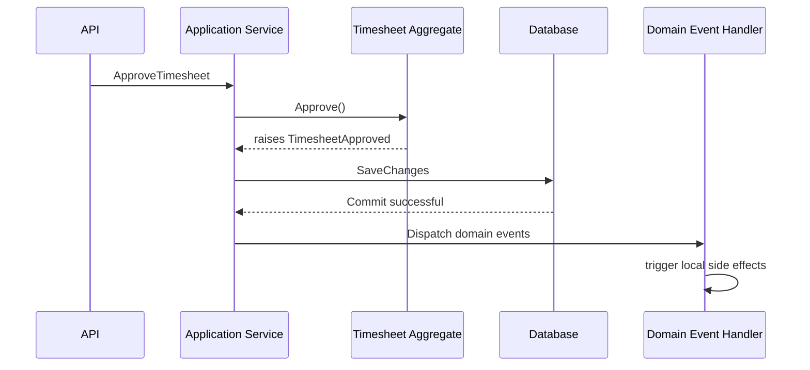
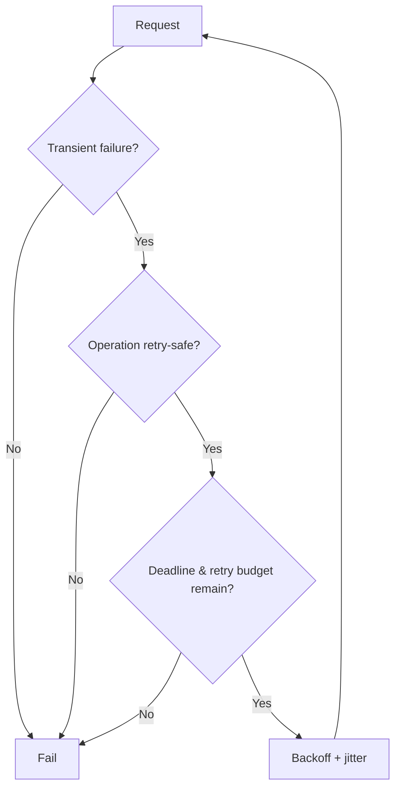
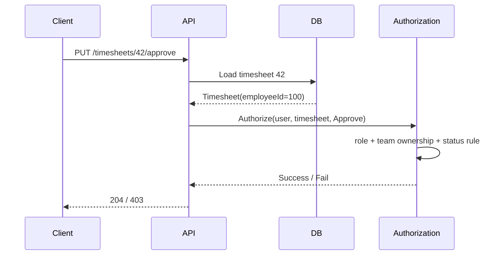
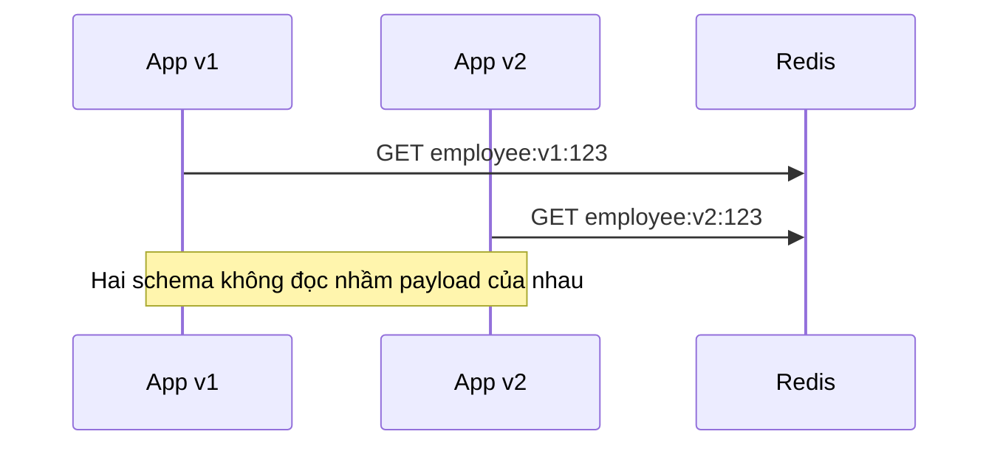
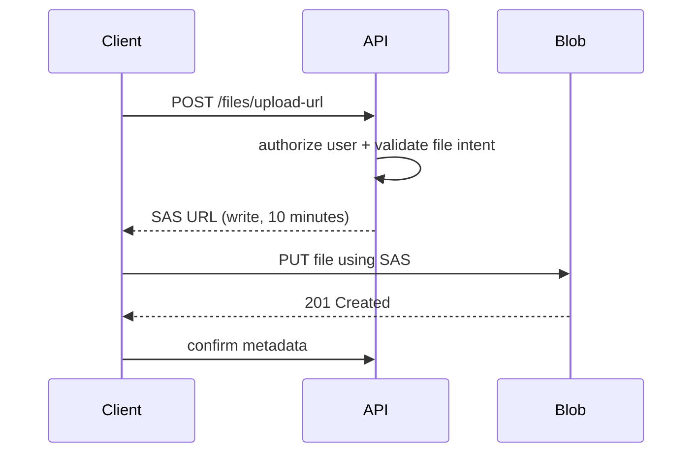
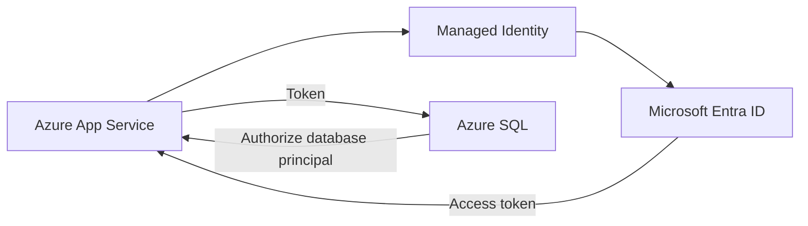
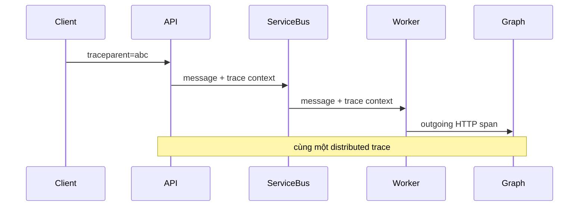
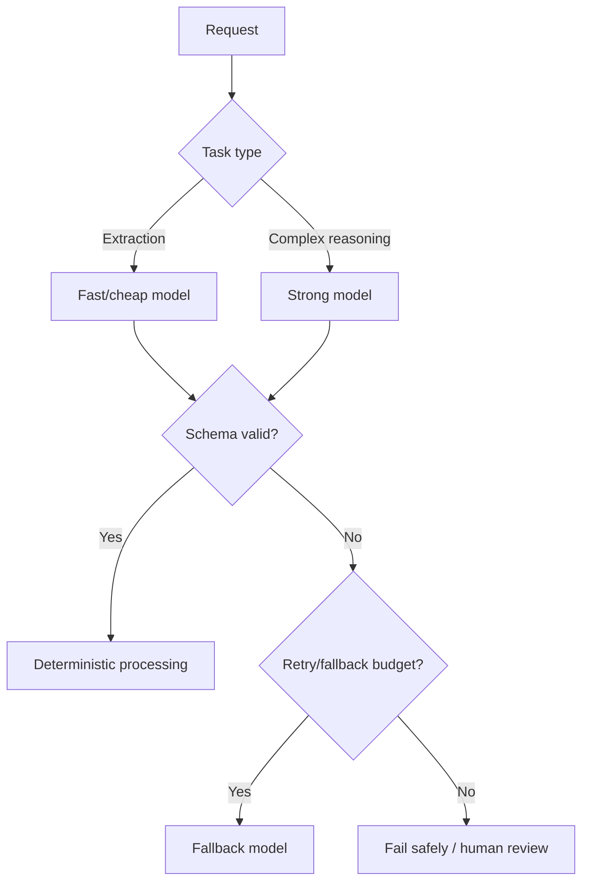

# Daily Knowledge Sharing — 17/08/2026

## Today’s Topics

1. DDD Domain Events — tách side effect khỏi aggregate mà không làm mất transaction semantics
2. Resilience — Retry Budget, timeout budget và khi nào không được retry
3. Resource-Based Authorization trong ASP.NET Core — quyền dựa trên chính resource đang truy cập
4. SQL Server Query Store — phát hiện plan regression và khôi phục performance có kiểm soát
5. Distributed Cache Serialization — versioning cache payload để tránh lỗi khi deploy nhiều phiên bản
6. Azure Storage SAS — cấp quyền tạm thời cho file mà không lộ storage account key
7. Managed Identity với Azure SQL — loại bỏ credential tĩnh khỏi application runtime
8. OpenTelemetry Context Propagation — trace context, baggage và correlation qua HTTP + queue
9. LLM Model Routing & Fallback — cân bằng chất lượng, latency, cost và failure trong AI workflow
10. Architecture Decision Records (ADR) — lưu lại lý do kiến trúc thay vì chỉ lưu kết quả cuối cùng

---

# 1. DDD Domain Events — tách side effect khỏi aggregate mà không làm mất transaction semantics

### 1. What is it?

**Domain Event** là một sự kiện mô tả điều có ý nghĩa trong business vừa xảy ra bên trong domain, ví dụ `TimesheetApproved`, `EmployeeOffboarded`, `OrderPaid`.

Khác với integration event dùng để giao tiếp giữa service, domain event trước hết là một phần của domain model. Nó giúp aggregate nói rằng: “business state đã thay đổi theo một cách có ý nghĩa”, còn việc hệ thống phản ứng thế nào có thể được xử lý ở nơi khác.

Một aggregate không nên trực tiếp gửi email, gọi Microsoft Graph, publish Service Bus hoặc invalidate cache. Aggregate chỉ nên enforce invariant và ghi nhận event.

### 2. Why does it exist?

Nếu mọi side effect được viết trực tiếp trong application service:

```text
Approve timesheet
→ Save DB
→ Send email
→ Update dashboard
→ Notify payroll
→ Write audit
```

method sẽ nhanh chóng trở thành orchestration khổng lồ. Business rule, persistence và integration bị trộn vào nhau.

Ngược lại, nếu publish event trước khi transaction commit, có nguy cơ consumer thấy một sự kiện cho dữ liệu chưa thật sự được lưu.

Domain event tồn tại để tách **business decision** khỏi **reaction**, nhưng vẫn giữ transaction boundary rõ ràng.

### 3. How does it work?

Một flow điển hình:



Có hai chiến lược thường gặp:

- **Before commit**: handler có thể tham gia cùng transaction, phù hợp cho update nội bộ cần atomic.
- **After commit**: side effect chạy sau khi DB commit, an toàn hơn cho I/O ngoài hệ thống.

Nếu side effect phải bền vững xuyên process/service, domain event thường được chuyển thành **integration event** và lưu qua Transactional Outbox.

### 4. Practical example

Aggregate:

```csharp
public sealed class Timesheet
{
    private readonly List<IDomainEvent> _domainEvents = [];

    public IReadOnlyCollection<IDomainEvent> DomainEvents => _domainEvents;

    public TimesheetStatus Status { get; private set; }

    public void Approve(Guid approverId)
    {
        if (Status != TimesheetStatus.Submitted)
            throw new DomainException("Only submitted timesheets can be approved.");

        Status = TimesheetStatus.Approved;
        _domainEvents.Add(new TimesheetApproved(Id, approverId, DateTimeOffset.UtcNow));
    }
}
```

Handler:

```csharp
public sealed class TimesheetApprovedHandler
    : INotificationHandler<TimesheetApproved>
{
    private readonly IAuditLogWriter _audit;

    public TimesheetApprovedHandler(IAuditLogWriter audit)
        => _audit = audit;

    public Task Handle(TimesheetApproved evt, CancellationToken ct)
        => _audit.WriteAsync(
            "TimesheetApproved",
            evt.TimesheetId,
            evt.ApproverId,
            ct);
}
```

### 5. Real production scenario

Trong hệ thống employee offboarding:

```text
Admin confirms offboarding
→ Employee aggregate changes status
→ EmployeeOffboarded raised
→ DB commit
→ handler writes audit
→ outbox creates mailbox workflow event
→ worker performs Exchange Online / Graph operations
```

Business state được commit trước; integration side effect có thể retry độc lập.

### 6. Common mistakes

- Dùng domain event cho mọi thay đổi CRUD nhỏ, làm hệ thống quá phức tạp.
- Handler gọi external API trước khi DB transaction commit.
- Event chứa EF entity thay vì immutable payload cần thiết.
- Một handler thay đổi quá nhiều aggregate khác, tạo transaction boundary mơ hồ.
- Nhầm domain event với integration event.
- Không có idempotency khi event được chuyển sang queue.

### 7. Trade-offs

**Advantages**

- Giảm coupling giữa aggregate và side effect.
- Business intent rõ ràng hơn.
- Dễ mở rộng reaction mà không sửa aggregate.
- Phù hợp để nối sang Outbox/Event-Driven Architecture.

**Costs / Risks**

- Flow khó đọc hơn so với gọi method trực tiếp.
- Debug cần trace event dispatch.
- Event ordering và transaction timing phải được thiết kế rõ.
- Có thể bị lạm dụng thành “event soup”.

### 8. Junior → Middle → Senior understanding

**Junior**

Hiểu domain event mô tả một business fact đã xảy ra, không phải message queue mặc định.

**Middle**

Biết dispatch event ở đúng thời điểm, phân biệt before/after commit và tránh external I/O trong transaction.

**Senior / Technical Lead**

Quyết định khi nào event ở scope local, khi nào cần Outbox + integration event; đánh giá ordering, idempotency, consistency và observability.

### 9. Key takeaway

- Aggregate quyết định business state; handler xử lý reaction.
- Domain event không đồng nghĩa với message broker.
- Side effect bên ngoài transaction nên được thiết kế cho retry và idempotency.

---

# 2. Resilience — Retry Budget, timeout budget và khi nào không được retry

### 1. What is it?

Retry là kỹ thuật thử lại một operation sau transient failure. Nhưng production-grade resilience không phải “thất bại thì retry 3 lần”.

Một thiết kế tốt cần hai khái niệm:

- **Timeout budget**: toàn bộ request còn bao nhiêu thời gian.
- **Retry budget**: được phép tốn thêm bao nhiêu request/traffic cho retry.

Retry chỉ hợp lý khi operation có khả năng thành công ở lần tiếp theo và việc lặp lại là an toàn.

### 2. Why does it exist?

Retry vô hạn hoặc retry đồng loạt có thể biến lỗi nhỏ thành outage lớn.

Ví dụ dependency có capacity 1.000 req/s nhưng đang chậm. 1.000 request ban đầu cùng retry hai lần tạo ra 3.000 request, khiến dependency càng quá tải.

Naive approach:

```text
Exception → retry
```

Production approach:

```text
Classify failure
→ check idempotency
→ check remaining deadline
→ check retry budget
→ wait with backoff + jitter
→ retry or fail fast
```

### 3. How does it work?



Ví dụ request timeout tổng là 2 giây. Nếu lần đầu đã tốn 1,7 giây thì retry với timeout 2 giây mới là sai; phải giới hạn theo thời gian còn lại.

### 4. Practical example

Với .NET resilience pipeline:

```csharp
services.AddHttpClient("Graph")
    .AddStandardResilienceHandler(options =>
    {
        options.TotalRequestTimeout.Timeout = TimeSpan.FromSeconds(5);
        options.AttemptTimeout.Timeout = TimeSpan.FromSeconds(2);
        options.Retry.MaxRetryAttempts = 2;
        options.Retry.BackoffType = DelayBackoffType.Exponential;
        options.Retry.UseJitter = true;
    });
```

Không retry mọi status code. Ví dụ validation `400`, auth `401/403`, business conflict `409` thường không tự động retry.

### 5. Real production scenario

Một background job gọi Microsoft Graph để cập nhật calendar event.

- `429 Too Many Requests`: có thể retry theo `Retry-After`.
- `503`: transient, retry có backoff.
- `401`: token/configuration issue, retry request giống hệt thường vô ích.
- `400`: payload sai, phải sửa dữ liệu chứ không retry.

Nếu hàng nghìn job cùng retry, cần queue concurrency limit và jitter để tránh retry storm.

### 6. Common mistakes

- Retry mọi exception.
- Retry POST không idempotent và tạo duplicate payment/order.
- Mỗi layer đều retry: SDK 3 lần × service 3 lần × job 3 lần = 27 attempts.
- Không honor `Retry-After`.
- Timeout mỗi attempt dài hơn SLA của request cha.
- Không đo retry rate.

### 7. Trade-offs

**Advantages**

- Che transient failure ngắn hạn.
- Tăng success rate cho dependency không ổn định.

**Costs / Risks**

- Tăng latency.
- Tăng load khi dependency đang yếu.
- Có thể gây duplicate side effect.
- Làm root cause khó nhìn nếu retry che lỗi quá lâu.

### 8. Junior → Middle → Senior understanding

**Junior**

Hiểu retry chỉ dành cho lỗi tạm thời.

**Middle**

Biết chọn status/error retryable, dùng exponential backoff, jitter, cancellation và idempotency.

**Senior / Technical Lead**

Thiết kế retry budget end-to-end, tránh multiplicative retries, kết hợp circuit breaker/load shedding và đánh giá tác động đến SLO.

### 9. Key takeaway

- Retry là tài nguyên có giới hạn, không phải default behavior.
- Mỗi retry phải nằm trong deadline và retry budget.
- Không retry operation không idempotent nếu chưa có cơ chế chống duplicate.

---

# 3. Resource-Based Authorization trong ASP.NET Core — quyền dựa trên chính resource đang truy cập

### 1. What is it?

Authentication trả lời **“Bạn là ai?”**. Authorization trả lời **“Bạn được phép làm gì?”**.

Role-based authorization như `[Authorize(Roles = "Admin")]` chỉ đủ cho rule đơn giản. Nhưng nhiều business rule phụ thuộc vào resource cụ thể.

Ví dụ:

- Manager chỉ được approve timesheet của employee thuộc team mình.
- User chỉ được sửa document mình sở hữu.
- HR có thể xem employee profile trong region được phân quyền.

Đó là **resource-based authorization**.

### 2. Why does it exist?

Nếu controller chỉ check role:

```csharp
if (User.IsInRole("Manager"))
    return Approve(timesheet);
```

mọi Manager có thể approve mọi timesheet nếu không có thêm boundary.

Authorization phải kiểm tra cả identity và resource context.

### 3. How does it work?



Quan trọng: `401` nghĩa là chưa authenticated; `403` nghĩa là authenticated nhưng không đủ quyền.

### 4. Practical example

Requirement:

```csharp
public sealed class CanApproveTimesheetRequirement
    : IAuthorizationRequirement;
```

Handler:

```csharp
public sealed class CanApproveTimesheetHandler
    : AuthorizationHandler<CanApproveTimesheetRequirement, Timesheet>
{
    protected override Task HandleRequirementAsync(
        AuthorizationHandlerContext context,
        CanApproveTimesheetRequirement requirement,
        Timesheet resource)
    {
        var employeeId = context.User.FindFirst("employee_id")?.Value;
        var isManager = context.User.IsInRole("Manager");

        if (isManager && resource.ManagerEmployeeId.ToString() == employeeId)
            context.Succeed(requirement);

        return Task.CompletedTask;
    }
}
```

Controller:

```csharp
var timesheet = await db.Timesheets.FindAsync([id], ct);
if (timesheet is null) return NotFound();

var result = await authorization.AuthorizeAsync(
    User,
    timesheet,
    new CanApproveTimesheetRequirement());

if (!result.Succeeded) return Forbid();
```

### 5. Real production scenario

Trong employee management SaaS multi-tenant:

```text
JWT identifies user + tenant
→ API loads employee
→ policy verifies same tenant
→ policy checks role / manager relationship
→ domain checks state transition
```

Authorization không thay thế domain invariant. “Manager có quyền approve” và “timesheet phải ở Submitted state” là hai loại rule khác nhau.

### 6. Common mistakes

- Tin `tenantId` gửi từ client thay vì lấy từ authenticated identity.
- Dùng role như toàn bộ authorization model.
- Chỉ hide UI button mà backend không enforce.
- Đưa business state rule hết vào authorization handler.
- Trả `404/403` không nhất quán, vô tình leak resource existence.
- Không test cross-tenant access.

### 7. Trade-offs

**Advantages**

- Quyền chính xác theo resource.
- Giảm security hole do role quá rộng.
- Rule có thể test độc lập.

**Costs / Risks**

- Có thể cần load resource trước khi authorize.
- Policy phức tạp nếu authorization model không được thiết kế tốt.
- Phải phân biệt access rule và domain rule.

### 8. Junior → Middle → Senior understanding

**Junior**

Phân biệt authentication và authorization; hiểu 401 vs 403.

**Middle**

Biết viết policy/handler, claims và resource-based check.

**Senior / Technical Lead**

Thiết kế multi-tenant boundary, least privilege, defense-in-depth và test matrix cho horizontal privilege escalation.

### 9. Key takeaway

- Role thường chưa đủ cho authorization thực tế.
- Quyền phải được kiểm tra tại backend theo resource thật.
- Authorization boundary và domain invariant không nên bị trộn lẫn.

---

# 4. SQL Server Query Store — phát hiện plan regression và khôi phục performance có kiểm soát

### 1. What is it?

SQL Server Query Store lưu lịch sử query, execution statistics và execution plan theo thời gian.

Nó giúp trả lời một câu hỏi production rất quan trọng:

> “Tại sao query này hôm qua chạy 50 ms nhưng hôm nay thành 4 giây dù code không đổi?”

### 2. Why does it exist?

SQL optimizer có thể chọn execution plan khác do statistics, parameter distribution, index change, database compatibility level hoặc recompilation.

Nếu chỉ nhìn plan hiện tại, ta mất bằng chứng plan cũ từng tốt hơn.

Query Store giữ lịch sử để so sánh và phát hiện **plan regression**.

### 3. How does it work?

```text
Application Query
      ↓
SQL Optimizer
      ↓
Execution Plan
      ↓
Runtime Stats
      ↓
Query Store History
```

Ta có thể xem:

- Average duration theo thời gian.
- CPU / logical reads.
- Các plan từng được dùng.
- Query nào regress mạnh.

Trong trường hợp khẩn cấp, có thể **force một known-good plan**, nhưng đây thường là mitigation trước khi sửa root cause.

### 4. Practical example

Tìm query runtime stats đơn giản:

```sql
SELECT
    qt.query_sql_text,
    rs.avg_duration,
    rs.avg_cpu_time,
    p.plan_id
FROM sys.query_store_query_text qt
JOIN sys.query_store_query q
    ON qt.query_text_id = q.query_text_id
JOIN sys.query_store_plan p
    ON q.query_id = p.query_id
JOIN sys.query_store_runtime_stats rs
    ON p.plan_id = rs.plan_id
ORDER BY rs.avg_duration DESC;
```

Force plan:

```sql
EXEC sys.sp_query_store_force_plan
    @query_id = 42,
    @plan_id = 17;
```

Không nên force plan mà không hiểu vì sao plan mới xuất hiện.

### 5. Real production scenario

Một API search employee đột nhiên P95 từ 200 ms lên 6 giây sau deployment database.

Investigation:

```text
App Insights shows DB span slow
→ Query Store shows new plan
→ logical reads tăng 50x
→ old plan dùng index seek
→ new plan dùng scan
→ force old plan để giảm incident
→ sau đó sửa stats/index/query
```

### 6. Common mistakes

- Force plan và coi đó là fix vĩnh viễn.
- Không theo dõi Query Store storage/retention.
- Chỉ nhìn duration, bỏ qua CPU/reads/waits.
- Tối ưu query mà không kiểm tra plan variation.
- Xóa history quá sớm khi đang điều tra incident.

### 7. Trade-offs

**Advantages**

- Có lịch sử performance theo thời gian.
- Phát hiện regression nhanh.
- Có mitigation bằng plan forcing.

**Costs / Risks**

- Tốn storage và overhead nhất định.
- Force plan có thể không còn tốt khi dữ liệu thay đổi.
- Cần hiểu optimizer thay vì chỉ “pin plan”.

### 8. Junior → Middle → Senior understanding

**Junior**

Hiểu cùng SQL có thể có execution plan khác nhau.

**Middle**

Biết đọc Query Store, compare plan và liên hệ logical reads/CPU/duration.

**Senior / Technical Lead**

Thiết kế runbook cho plan regression, quyết định khi nào force plan, khi nào sửa index/statistics/query và đánh giá risk theo workload.

### 9. Key takeaway

- Query performance là lịch sử, không chỉ snapshot hiện tại.
- Query Store rất hữu ích khi code không đổi nhưng latency đổi.
- Force plan là mitigation; root cause vẫn cần được xử lý.

---

# 5. Distributed Cache Serialization — versioning cache payload để tránh lỗi khi deploy nhiều phiên bản

### 1. What is it?

Distributed cache như Redis thường lưu serialized object dưới dạng JSON, MessagePack hoặc binary payload.

Một rủi ro dễ bị bỏ quên là **cache schema cũng là một contract**.

Khi deploy phiên bản mới, node mới có thể đọc cache được ghi bởi node cũ và ngược lại.

### 2. Why does it exist?

Giả sử version 1 lưu:

```json
{"id":1,"name":"Ha"}
```

Version 2 đổi thành:

```json
{"id":1,"fullName":"Ha","status":"Active"}
```

Trong rolling deployment, hai phiên bản cùng chạy. Nếu serializer strict hoặc semantics thay đổi, lỗi có thể xảy ra dù database hoàn toàn bình thường.

### 3. How does it work?

Một cách đơn giản là version cache key:

```text
employee:v1:123
employee:v2:123
```



Version key đặc biệt hữu ích khi breaking change ở serialized shape.

### 4. Practical example

```csharp
private const string CacheVersion = "v2";

static string EmployeeKey(Guid id)
    => $"employee:{CacheVersion}:{id}";

public async Task<EmployeeCacheModel?> GetAsync(Guid id, CancellationToken ct)
{
    var json = await cache.GetStringAsync(EmployeeKey(id), ct);
    return json is null
        ? null
        : JsonSerializer.Deserialize<EmployeeCacheModel>(json);
}
```

Khi deploy v3, key namespace mới khiến cache cũ tự hết hạn thay vì phải purge toàn bộ.

### 5. Real production scenario

Một SaaS chạy 10 App Service instances, rolling deployment mất 15 phút.

Nếu cache schema thay đổi nhưng key không version:

```text
v1 writes old payload
→ v2 reads it
→ deserialize fail
→ fallback DB
→ request writes new payload
→ v1 reads new payload
→ fail again
```

Có thể tạo error spike hoặc cache thrashing.

### 6. Common mistakes

- Cache entity EF Core trực tiếp.
- Không version key khi breaking schema change.
- Không đặt TTL cho key version cũ.
- Payload quá lớn, gây network/serialization cost.
- Assume cache luôn deserialize thành công.
- Dùng cache làm source of truth.

### 7. Trade-offs

**Advantages**

- Rolling deployment an toàn hơn.
- Breaking cache change dễ quản lý.
- Không cần mass delete cache.

**Costs / Risks**

- Tạm thời tăng memory khi nhiều version cùng tồn tại.
- Cache miss tăng sau deploy.
- Cần quản lý key convention và TTL.

### 8. Junior → Middle → Senior understanding

**Junior**

Hiểu cache lưu serialized data chứ không phải “object sống”.

**Middle**

Biết version key, TTL, xử lý deserialize failure và cache miss fallback.

**Senior / Technical Lead**

Thiết kế cache compatibility cho rolling deployment, schema evolution, memory budget và degradation khi Redis lỗi.

### 9. Key takeaway

- Cache payload là một contract cần versioning.
- Breaking schema change nên đi cùng cache key version.
- Cache luôn phải có fallback path và TTL hợp lý.

---

# 6. Azure Storage SAS — cấp quyền tạm thời cho file mà không lộ storage account key

### 1. What is it?

**Shared Access Signature (SAS)** là token cho phép client truy cập Azure Storage với quyền, resource và thời hạn giới hạn.

Thay vì backend tải file rồi stream qua API, backend có thể cấp một URL SAS để client upload/download trực tiếp Blob Storage.

### 2. Why does it exist?

Naive approach:

```text
Browser → API → Blob Storage
```

Với file 2 GB, API phải nhận và forward toàn bộ dữ liệu, tăng bandwidth, memory pressure và timeout risk.

SAS cho phép:

```text
Browser → API: xin quyền upload
API → Browser: short-lived SAS
Browser → Blob Storage: upload trực tiếp
```

### 3. How does it work?



SAS nên giới hạn:

- Resource cụ thể.
- Permission cần thiết (`r`, `w`, ...).
- Expiry ngắn.
- HTTPS.

Khi có thể, backend nên dùng **User Delegation SAS** dựa trên Microsoft Entra credential thay vì account key.

### 4. Practical example

Pseudo-C# sát thực tế:

```csharp
var startsOn = DateTimeOffset.UtcNow.AddMinutes(-1);
var expiresOn = DateTimeOffset.UtcNow.AddMinutes(10);

var delegationKey = await blobServiceClient
    .GetUserDelegationKeyAsync(startsOn, expiresOn, ct);

var builder = new BlobSasBuilder
{
    BlobContainerName = containerName,
    BlobName = blobName,
    Resource = "b",
    StartsOn = startsOn,
    ExpiresOn = expiresOn
};

builder.SetPermissions(BlobSasPermissions.Write | BlobSasPermissions.Create);
```

### 5. Real production scenario

Portal upload hồ sơ nhân viên:

```text
User authenticated
→ API verifies tenant + permission
→ API generates write-only SAS cho đúng blob path
→ browser upload thẳng Blob Storage
→ Blob-created event starts malware scan/processing
```

API không phải giữ file lớn trong memory.

### 6. Common mistakes

- SAS expiry quá dài.
- Cấp `Read + Write + Delete + List` dù client chỉ cần upload.
- Log toàn bộ SAS URL vào telemetry.
- Dùng account key hard-code để generate SAS.
- Không randomize/validate blob path và để path traversal logic ở application.
- Không kiểm soát content type/size sau upload.

### 7. Trade-offs

**Advantages**

- Giảm tải API.
- Tăng throughput upload/download.
- Quyền có thể giới hạn theo thời gian và resource.

**Costs / Risks**

- SAS là bearer token: ai có URL có thể dùng trong thời hạn.
- Revocation khó hơn access token thông thường.
- Client nói chuyện trực tiếp với Storage nên flow phức tạp hơn.

### 8. Junior → Middle → Senior understanding

**Junior**

Hiểu SAS là quyền tạm thời, không phải public URL.

**Middle**

Biết generate SAS ít quyền, expiry ngắn và dùng direct upload.

**Senior / Technical Lead**

Thiết kế threat model, user delegation SAS, lifecycle, malware scanning, network boundary và auditability.

### 9. Key takeaway

- SAS tốt cho direct file transfer nhưng phải coi như credential nhạy cảm.
- Cấp quyền tối thiểu và thời hạn ngắn.
- Prefer Entra/User Delegation SAS thay vì account key khi phù hợp.

---

# 7. Managed Identity với Azure SQL — loại bỏ credential tĩnh khỏi application runtime

### 1. What is it?

Managed Identity cho phép Azure workload nhận identity từ Microsoft Entra ID mà không cần lưu username/password/client secret trong configuration.

Với Azure SQL, App Service/Function/Container App có thể authenticate bằng access token được Azure cấp tự động.

### 2. Why does it exist?

Connection string kiểu:

```text
Server=...;User ID=appuser;Password=SuperSecret123;
```

tạo hàng loạt rủi ro:

- Secret bị lộ qua config/log.
- Rotation khó.
- Dev copy credential production.
- Secret hết hạn gây outage.

Managed Identity chuyển trust từ secret sang platform identity.

### 3. How does it work?



Authentication nói “workload này là ai”; authorization trong Azure SQL vẫn cần user/role/database permission tương ứng.

### 4. Practical example

Connection string:

```text
Server=tcp:myserver.database.windows.net,1433;
Database=EmployeeDb;
Authentication=Active Directory Managed Identity;
Encrypt=True;
```

Trong database cần tạo principal và cấp quyền phù hợp, ví dụ theo mô hình least privilege thay vì `db_owner`.

### 5. Real production scenario

Một background service xử lý payroll:

```text
Container App starts
→ platform exposes Managed Identity
→ SQL client gets Entra token
→ Azure SQL validates identity
→ workload gets only read/write permissions needed
```

Không có secret cần rotate trong GitHub Actions hay App Settings.

### 6. Common mistakes

- Cho Managed Identity `db_owner` vì tiện.
- Nhầm authentication thành authorization.
- Không chuẩn bị local development flow riêng.
- Dùng system-assigned identity cho workload cần identity ổn định xuyên resource recreation mà không đánh giá impact.
- Không bật Private Endpoint/network control dù đã dùng identity tốt.

### 7. Trade-offs

**Advantages**

- Loại bỏ credential tĩnh.
- Platform quản lý token lifecycle.
- Audit identity rõ ràng.

**Costs / Risks**

- Setup Entra + database principal phức tạp hơn username/password ban đầu.
- Local development khác production.
- Identity design cần cân nhắc system-assigned vs user-assigned.

### 8. Junior → Middle → Senior understanding

**Junior**

Hiểu ứng dụng vẫn cần identity dù không còn password.

**Middle**

Biết cấu hình Managed Identity, connection string và permission DB.

**Senior / Technical Lead**

Thiết kế least privilege, identity lifecycle, network isolation, break-glass access và deployment automation.

### 9. Key takeaway

- Managed Identity loại bỏ secret, không loại bỏ permission design.
- Identity phải được cấp đúng quyền tối thiểu trong Azure SQL.
- Kết hợp identity với network controls để tạo defense-in-depth.

---

# 8. OpenTelemetry Context Propagation — trace context, baggage và correlation qua HTTP + queue

### 1. What is it?

Distributed tracing chỉ hữu ích khi cùng một request giữ được **trace context** khi đi qua API, HTTP dependency, queue và background worker.

Context propagation là quá trình truyền `trace-id`, `span-id` và metadata liên quan qua boundary.

### 2. Why does it exist?

Nếu API tạo trace A nhưng message queue consumer tạo trace B hoàn toàn độc lập, incident investigation sẽ bị đứt đoạn:

```text
HTTP request slow
???
background job failed
```

Thay vì:

```text
Trace 123
├── API
├── DB
├── Service Bus send
└── Worker consume
    └── Graph API
```

### 3. How does it work?

W3C Trace Context thường truyền `traceparent` qua HTTP headers. Với messaging, trace context được inject vào message properties và extract khi consumer nhận message.



**Baggage** là metadata có thể propagate cùng context, nhưng phải dùng rất hạn chế vì nó tăng payload và có thể leak dữ liệu.

### 4. Practical example

Activity source:

```csharp
private static readonly ActivitySource ActivitySource =
    new("Employee.Offboarding");

using var activity = ActivitySource.StartActivity("ProcessMailboxReset");
activity?.SetTag("employee.id", employeeId);
activity?.SetTag("operation", "mailbox-reset");
```

Với OpenTelemetry instrumentation cho ASP.NET Core, HttpClient và Azure SDK, nhiều span được tạo tự động. Custom span chỉ nên thêm ở business boundary quan trọng.

### 5. Real production scenario

Một request admin trigger offboarding:

```text
Portal
→ ASP.NET Core API
→ SQL save
→ Service Bus
→ Worker
→ Microsoft Graph
→ Exchange operation
```

Khi Graph trả `429`, trace cho thấy toàn bộ critical path và latency từng span, thay vì chỉ có log rời rạc.

### 6. Common mistakes

- Tạo trace mới ở consumer thay vì continue parent context.
- Nhét PII vào baggage.
- Add span cho từng method nhỏ gây telemetry noise.
- Không propagate context qua custom queue/message wrapper.
- Chỉ có trace mà không có logs correlated theo trace-id.

### 7. Trade-offs

**Advantages**

- Root-cause nhanh hơn trong distributed workflow.
- Liên kết HTTP, DB, queue và background worker.
- Hỗ trợ latency breakdown.

**Costs / Risks**

- Telemetry volume/cost tăng.
- Sampling cần thiết ở hệ thống lớn.
- Metadata propagation có privacy/security risk.

### 8. Junior → Middle → Senior understanding

**Junior**

Hiểu trace gồm nhiều span thuộc cùng request/workflow.

**Middle**

Biết instrument HttpClient, ASP.NET Core, messaging và custom Activity.

**Senior / Technical Lead**

Thiết kế propagation contract, sampling, baggage policy, PII boundary và correlation strategy xuyên nhiều service.

### 9. Key takeaway

- Distributed trace chỉ có giá trị nếu context không bị đứt.
- Queue/message boundary cần propagate context giống HTTP boundary.
- Baggage phải cực kỳ hạn chế và không chứa dữ liệu nhạy cảm.

---

# 9. LLM Model Routing & Fallback — cân bằng chất lượng, latency, cost và failure trong AI workflow

### 1. What is it?

Model routing là logic chọn model phù hợp cho từng loại tác vụ thay vì gửi mọi request vào model mạnh nhất.

Fallback là chiến lược chuyển sang model hoặc path khác khi primary model lỗi, timeout, rate-limit hoặc không đạt validation.

### 2. Why does it exist?

AI workload có trade-off rõ:

```text
quality ↔ latency ↔ token cost ↔ availability
```

Một tác vụ classify ticket đơn giản không nhất thiết cần model đắt nhất. Nhưng một architecture review dài có thể cần reasoning/model mạnh hơn.

Naive approach “dùng một model cho mọi thứ” vừa tốn chi phí vừa tạo single dependency failure mode.

### 3. How does it work?



Routing nên dựa vào deterministic metadata khi có thể, ví dụ endpoint, task type, document size, risk level. Không nhất thiết dùng LLM để quyết định model nào sẽ gọi.

### 4. Practical example

```csharp
public ModelProfile Select(AiTask task) => task switch
{
    AiTask.Classification => ModelProfile.Fast,
    AiTask.StructuredExtraction => ModelProfile.Balanced,
    AiTask.ArchitectureReview => ModelProfile.Strong,
    _ => ModelProfile.Balanced
};
```

Fallback:

```csharp
try
{
    return await primary.GenerateAsync(request, ct);
}
catch (AiRateLimitException) when (fallbackBudget.CanUseFallback)
{
    return await secondary.GenerateAsync(request, ct);
}
```

Output vẫn phải qua schema validation và business guardrails.

### 5. Real production scenario

AI assistant cho support platform:

```text
Ticket arrives
→ cheap model classifies category
→ deterministic router decides workflow
→ complex ticket uses stronger model
→ tool action requires policy check
→ timeout/rate-limit may use fallback
→ high-risk action requires human approval
```

Fallback không được phép làm mất security boundary. Nếu model B không hỗ trợ structured/tool behavior tương đương, không thể chỉ “switch model” mù quáng.

### 6. Common mistakes

- Fallback model có capability khác nhưng code assume giống nhau.
- Retry model nhiều lần làm cost bùng nổ.
- Không giới hạn token budget.
- Dùng model output trực tiếp để quyết định thao tác nhạy cảm.
- Không log model/version/latency/token usage cho evaluation.
- Fallback trên validation failure vô hạn.

### 7. Trade-offs

**Advantages**

- Giảm cost.
- Cải thiện availability.
- Tối ưu latency theo task.

**Costs / Risks**

- Routing logic phức tạp.
- Output consistency giữa model khác nhau khó kiểm soát.
- Evaluation matrix lớn hơn.
- Fallback có thể che lỗi prompt/model regression.

### 8. Junior → Middle → Senior understanding

**Junior**

Hiểu model mạnh nhất không luôn là lựa chọn tốt nhất.

**Middle**

Biết implement routing, timeout, fallback và schema validation.

**Senior / Technical Lead**

Thiết kế capability matrix, cost budget, SLO, eval gates, safety boundary và human approval cho high-risk tool calls.

### 9. Key takeaway

- Routing là bài toán engineering, không chỉ AI prompting.
- Fallback phải giữ nguyên security và correctness contract.
- Luôn đo quality + latency + tokens + cost theo từng route.

---

# 10. Architecture Decision Records (ADR) — lưu lại lý do kiến trúc thay vì chỉ lưu kết quả cuối cùng

### 1. What is it?

ADR là tài liệu ngắn ghi lại một quyết định kiến trúc quan trọng, gồm context, options, quyết định, lý do và consequences.

Ví dụ:

```text
ADR-012: Use Azure Service Bus for reliable integration events
Status: Accepted
Context: Need durable async delivery with retry and DLQ
Decision: Azure Service Bus Queue
Alternatives: Storage Queue, RabbitMQ
Consequences: Higher cost, better broker features
```

### 2. Why does it exist?

Sau 6 tháng, code chỉ cho biết **đang dùng gì**, nhưng không cho biết **vì sao đã chọn nó**.

Không có context, team dễ lặp lại tranh luận cũ hoặc “refactor” bỏ một quyết định vốn được tạo ra để xử lý production constraint cụ thể.

### 3. How does it work?

Một ADR hiệu quả thường có lifecycle:

```text
Problem / Context
→ Alternatives
→ Decision criteria
→ Decision
→ Consequences
→ Review later if assumptions change
```

ADR không phải specification 40 trang. Nó nên đủ ngắn để được viết và đọc thường xuyên.

### 4. Practical example

```markdown
# ADR-021: Use Transactional Outbox for employee offboarding events

## Context
DB update and Service Bus publish cannot share one local transaction.
Duplicate/lost messages are unacceptable.

## Decision
Persist OutboxMessage in the same SQL transaction as Employee status.
A worker publishes pending messages to Service Bus.

## Consequences
+ No lost event after DB commit
+ Supports retry
- Requires cleanup and idempotent consumers
- Adds operational component
```

### 5. Real production scenario

Một năm sau, developer hỏi: “Sao không publish Service Bus trực tiếp sau `SaveChangesAsync()` cho đơn giản?”

ADR cho thấy team từng gặp failure window:

```text
DB commit succeeds
→ process crashes
→ Service Bus publish never happens
```

Decision không còn là preference cá nhân mà gắn với failure mode đã được phân tích.

### 6. Common mistakes

- Viết ADR sau khi quyết định xong nhưng bỏ mất alternatives.
- Biến ADR thành tài liệu dài không ai đọc.
- Không ghi assumptions/constraints.
- Xóa ADR cũ khi superseded, làm mất lịch sử.
- Ghi quyết định trivial cho mọi code change.
- Không link ADR tới PR/diagram/runbook liên quan.

### 7. Trade-offs

**Advantages**

- Giữ institutional knowledge.
- Onboarding và architecture review nhanh hơn.
- Làm trade-off minh bạch.
- Giảm quyết định dựa trên ký ức cá nhân.

**Costs / Risks**

- Có maintenance overhead.
- ADR stale nếu team không cập nhật status.
- Quá nhiều ADR nhỏ làm noise.

### 8. Junior → Middle → Senior understanding

**Junior**

Hiểu architecture decision luôn có context và trade-off.

**Middle**

Biết viết ADR rõ ràng cho thay đổi có ảnh hưởng nhiều module/service.

**Senior / Technical Lead**

Xác định decision criteria, assumptions, operational consequences, review horizon và khi nào một ADR cần supersede.

### 9. Key takeaway

- Code cho biết “what”; ADR lưu “why”.
- Ghi alternatives và consequences quan trọng hơn mô tả công nghệ.
- ADR tốt giúp team thay đổi quyết định khi assumptions thay đổi mà không mất lịch sử.