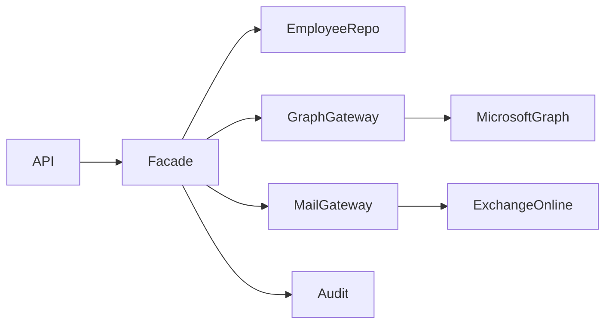
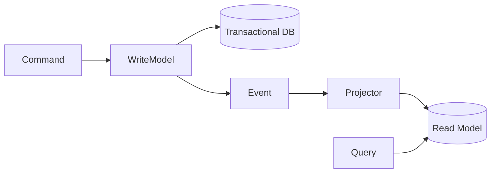
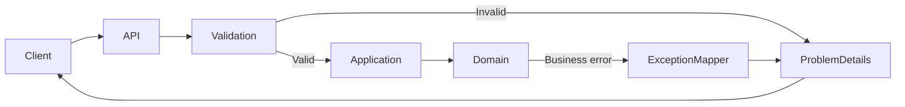
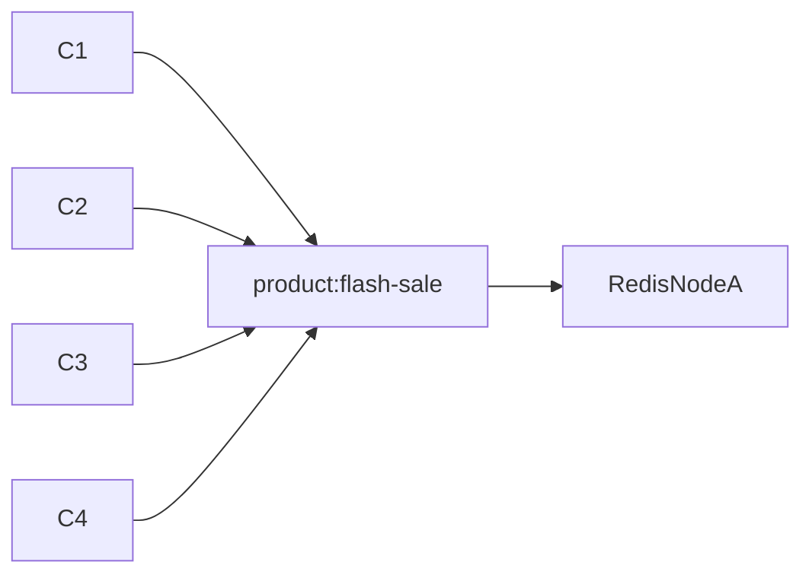
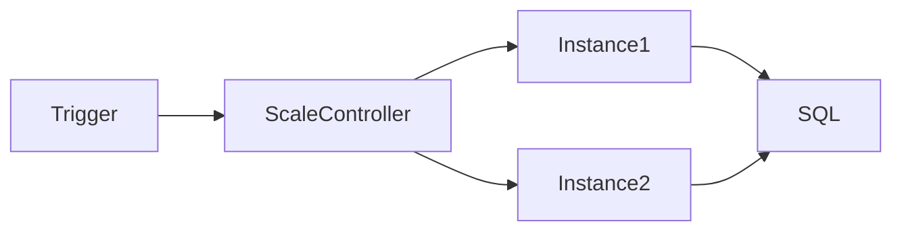
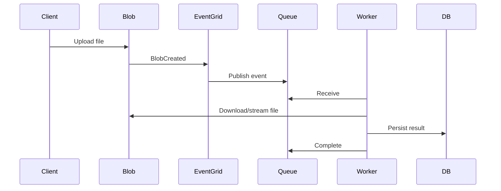
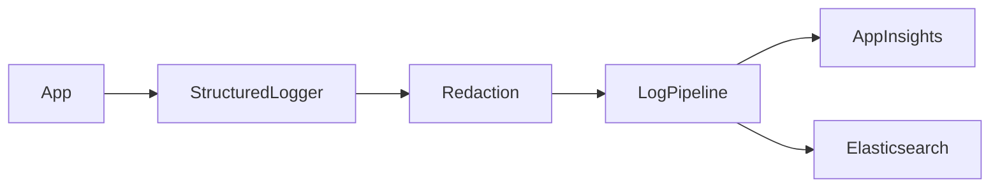
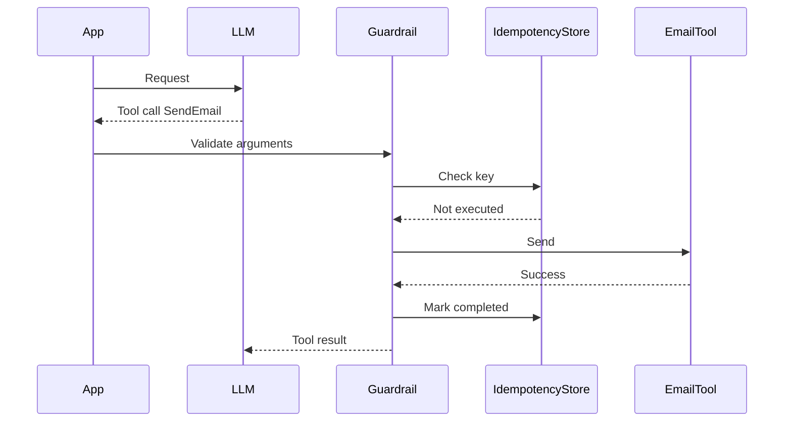
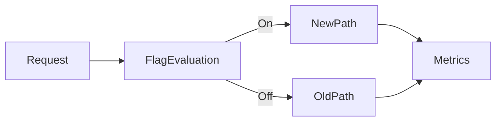

# Daily Knowledge Sharing — 17/08/2026

## Today’s Topics

1. Facade Pattern — tạo boundary ổn định trước subsystem phức tạp
2. CQRS Read Model Projection — tối ưu query bằng model đọc riêng
3. ASP.NET Core ProblemDetails & Validation Boundary — error contract nhất quán cho API
4. SQL Server Covering Index với INCLUDE — giảm key lookup mà không làm index phình vô tội vạ
5. Redis Hot Key — phát hiện và xử lý điểm nghẽn do một key bị truy cập quá mức
6. Azure Functions Cold Start & Concurrency — tối ưu serverless cho workload production
7. Azure Event-Driven File Processing — Blob Storage, Event Grid và worker pipeline
8. Structured Logging & PII Redaction — log đủ để điều tra nhưng không làm rò dữ liệu nhạy cảm
9. LLM Retry, Timeout & Idempotent Tool Execution — resilience đúng cách cho AI workflow
10. Feature Flag Lifecycle — rollout an toàn nhưng không biến codebase thành nghĩa địa cờ

---

# 1. Facade Pattern — tạo boundary ổn định trước subsystem phức tạp

### 1. What is it?

Facade Pattern tạo một interface đơn giản đứng trước một subsystem có nhiều thành phần, nhiều SDK hoặc nhiều bước xử lý. Caller chỉ biết một capability ở mức business, thay vì biết toàn bộ chi tiết bên dưới.

Ví dụ, thay vì controller phải gọi trực tiếp Microsoft Graph, Exchange Online adapter, database và audit logger, ta có thể tạo một `IEmployeeOffboardingFacade` để cung cấp một operation rõ nghĩa như `OffboardAsync()`.

Facade không nhằm “che giấu mọi thứ”. Nó nhằm **giảm coupling giữa caller và orchestration chi tiết của subsystem**.

### 2. Why does it exist?

Một implementation ngây thơ thường bắt đầu như sau:

- Controller gọi 4–5 service.
- Service A lại biết chi tiết SDK B.
- Thứ tự gọi nằm rải rác.
- Error mapping nằm ở nhiều nơi.
- Khi đổi provider, hàng loạt caller phải sửa.

Khi subsystem ngày càng phức tạp, caller bị buộc phải hiểu quá nhiều thứ không thuộc trách nhiệm của nó.

Facade giải quyết bằng cách đưa orchestration về một boundary có ý nghĩa business.

### 3. How does it work?



Flow:

1. API nhận request offboarding.
2. Facade validate business precondition ở mức orchestration.
3. Facade gọi repository để lấy employee.
4. Facade gọi Graph gateway để xử lý calendar/license.
5. Facade gọi mail gateway để forward/auto-reply.
6. Facade ghi audit/result.
7. API chỉ nhận một kết quả thống nhất.

Điểm quan trọng: Facade không nên tự chứa mọi business rule. Domain rule vẫn cần ở domain/application layer phù hợp.

### 4. Practical example

```csharp
public interface IEmployeeOffboardingFacade
{
    Task<OffboardingResult> OffboardAsync(
        Guid employeeId,
        CancellationToken cancellationToken);
}

public sealed class EmployeeOffboardingFacade(
    IEmployeeRepository employees,
    IGraphGateway graph,
    IMailGateway mail,
    IAuditWriter audit) : IEmployeeOffboardingFacade
{
    public async Task<OffboardingResult> OffboardAsync(
        Guid employeeId,
        CancellationToken cancellationToken)
    {
        var employee = await employees.GetAsync(employeeId, cancellationToken)
            ?? throw new InvalidOperationException("Employee not found");

        await graph.DisableUserAccessAsync(employee.ExternalId, cancellationToken);
        await mail.ApplyOffboardingPolicyAsync(employee.Email, cancellationToken);
        await audit.WriteAsync("EmployeeOffboarded", employeeId, cancellationToken);

        return OffboardingResult.Success(employeeId);
    }
}
```

Facade giúp controller không phải biết thứ tự gọi hoặc chi tiết provider.

### 5. Real production scenario

Trong hệ thống HR tích hợp Microsoft 365, quy trình offboarding có thể gồm:

Employee API
→ database
→ Microsoft Graph
→ Exchange Online
→ background job
→ audit store

Nếu mỗi endpoint hoặc job tự gọi trực tiếp tất cả dependency, logic sẽ nhanh chóng diverge. Facade giúp gom orchestration về một nơi, đồng thời vẫn để gateway xử lý chi tiết từng provider.

### 6. Common mistakes

- Biến Facade thành “God service” chứa cả domain rule, mapping, persistence và SDK logic.
- Tạo facade chỉ để wrap một method duy nhất, không giảm coupling thực sự.
- Expose raw SDK type từ facade, làm boundary mất tác dụng.
- Swallow exception và trả `false` khiến production khó debug.
- Không xác định transaction/compensation khi orchestration có nhiều side effect.

### 7. Trade-offs

**Advantages**

- Giảm coupling cho caller.
- Dễ thay subsystem/provider.
- Tập trung orchestration và error mapping.
- Test caller dễ hơn.

**Costs / Risks**

- Có thể tạo thêm abstraction không cần thiết.
- Facade quá lớn sẽ thành điểm nghẽn thiết kế.
- Nếu che giấu failure quá mức, operational debugging khó hơn.

### 8. Junior → Middle → Senior understanding

**Junior**

Hiểu facade là cổng vào đơn giản cho subsystem phức tạp.

**Middle**

Biết tách facade khỏi gateway/repository/domain rule và viết integration test cho orchestration.

**Senior / Technical Lead**

Biết đánh giá boundary nào thật sự cần facade, failure semantics, compensation, idempotency và tránh facade trở thành monolith logic mới.

### 9. Key takeaway

- Facade giảm coupling ở boundary, không thay thế domain design.
- Không expose chi tiết SDK qua facade.
- Orchestration đa hệ thống cần nghĩ đến failure và compensation.

---

# 2. CQRS Read Model Projection — tối ưu query bằng model đọc riêng

### 1. What is it?

Trong CQRS, write model và read model có thể khác nhau. Write side tập trung bảo vệ invariant và transaction; read side tập trung trả dữ liệu nhanh, đúng shape mà client cần.

Read Model Projection là quá trình biến event hoặc thay đổi từ write side thành một model đọc đã được denormalize.

Ví dụ, thay vì mỗi lần mở dashboard phải join 8 bảng, hệ thống có thể duy trì bảng `EmployeeDashboardView` đã chứa sẵn thông tin tổng hợp.

### 2. Why does it exist?

Database model tối ưu cho ghi thường không tối ưu cho đọc phức tạp.

Nếu mọi dashboard query đều dùng aggregate model trực tiếp, ta dễ gặp:

- JOIN nhiều bảng.
- N+1 query.
- Mapping nặng.
- Lock/contention không cần thiết.
- API response phụ thuộc chặt vào schema transactional.

Projection cho phép tạo model đọc theo đúng nhu cầu query.

### 3. How does it work?



Một flow phổ biến:

1. Command cập nhật write model.
2. Transaction commit.
3. Domain/integration event được publish.
4. Projector nhận event.
5. Projector update read model.
6. Query API đọc trực tiếp read model.

Nếu dùng async projection, read model có thể bị trễ một khoảng ngắn — đó là eventual consistency.

### 4. Practical example

```csharp
public sealed record TimesheetApproved(
    Guid TimesheetId,
    Guid EmployeeId,
    DateOnly Week,
    decimal TotalHours);

public sealed class TimesheetProjection(AppDbContext db)
{
    public async Task HandleAsync(
        TimesheetApproved message,
        CancellationToken cancellationToken)
    {
        var row = await db.TimesheetSummaries
            .SingleOrDefaultAsync(
                x => x.TimesheetId == message.TimesheetId,
                cancellationToken);

        if (row is null)
        {
            db.TimesheetSummaries.Add(new TimesheetSummary
            {
                TimesheetId = message.TimesheetId,
                EmployeeId = message.EmployeeId,
                Week = message.Week,
                TotalHours = message.TotalHours,
                Status = "Approved"
            });
        }
        else
        {
            row.TotalHours = message.TotalHours;
            row.Status = "Approved";
        }

        await db.SaveChangesAsync(cancellationToken);
    }
}
```

Projection handler cần idempotent vì message có thể được deliver nhiều lần.

### 5. Real production scenario

Một SaaS timesheet có transactional model gồm employee, project, assignment, timesheet, entry, approval history.

Dashboard manager cần:

- tên employee,
- tổng giờ tuần,
- project,
- trạng thái approval,
- overdue flag.

Thay vì join liên tục, read model có thể giữ đúng shape dashboard và được update khi timesheet thay đổi.

### 6. Common mistakes

- Dùng CQRS chỉ để tách folder `Commands` và `Queries`, nhưng cùng model và cùng behavior.
- Projection không idempotent.
- Không có cơ chế rebuild read model.
- Không monitor projection lag.
- Client giả định read-after-write luôn tức thời dù projection async.
- Dùng distributed transaction để ép write DB và read DB cùng commit, làm mất lợi ích CQRS.

### 7. Trade-offs

**Advantages**

- Query nhanh, response shape tối ưu.
- Giảm coupling với transactional schema.
- Scale read và write độc lập.

**Costs / Risks**

- Eventual consistency.
- Tăng storage và operational complexity.
- Cần rebuild/replay strategy.
- Debug dữ liệu lệch khó hơn monolith CRUD đơn giản.

### 8. Junior → Middle → Senior understanding

**Junior**

Hiểu write model và read model có thể khác nhau.

**Middle**

Biết xây projector idempotent, query read model và debug projection lag.

**Senior / Technical Lead**

Biết quyết định khi nào CQRS đáng giá, consistency expectation, replay strategy, ownership của event schema và khả năng vận hành khi read model bị corrupt.

### 9. Key takeaway

- CQRS không chỉ là naming `Command`/`Query`.
- Read model nên tối ưu cho use case đọc cụ thể.
- Async projection luôn cần nghĩ đến eventual consistency và rebuild.

---

# 3. ASP.NET Core ProblemDetails & Validation Boundary — error contract nhất quán cho API

### 1. What is it?

`ProblemDetails` là format chuẩn hóa để API trả lỗi có cấu trúc thay vì trả string tùy hứng.

Validation Boundary là nơi ta kiểm tra input trước khi business logic chạy, ví dụ:

- field bắt buộc,
- format,
- range,
- syntactic rule,
- request contract.

Business rule sâu hơn như “timesheet đã approved thì không được sửa” vẫn thuộc domain/application logic.

### 2. Why does it exist?

Nếu mỗi endpoint trả lỗi khác nhau:

- Endpoint A trả `{ message: "bad request" }`.
- Endpoint B trả plain text.
- Endpoint C trả stack trace.
- Endpoint D trả status 200 kèm `success=false`.

Frontend, mobile và integration client sẽ rất khó xử lý nhất quán.

ProblemDetails tạo một error contract chung.

### 3. How does it work?



Nên tách:

- **Input validation** → 400.
- **Authentication** → 401.
- **Authorization** → 403.
- **Not found** → 404.
- **Conflict/business concurrency** → 409 hoặc 422 tùy contract.
- **Unexpected failure** → 500, không expose nội bộ.

### 4. Practical example

```csharp
builder.Services.AddProblemDetails();

var app = builder.Build();
app.UseExceptionHandler();

app.MapPost("/employees", async (
    CreateEmployeeRequest request,
    IEmployeeService service,
    CancellationToken ct) =>
{
    if (string.IsNullOrWhiteSpace(request.Email))
    {
        return Results.ValidationProblem(new Dictionary<string, string[]>
        {
            ["email"] = ["Email is required."]
        });
    }

    var id = await service.CreateAsync(request, ct);
    return Results.Created($"/employees/{id}", new { id });
});
```

Một exception handler trung tâm có thể map domain exception thành `ProblemDetails` ổn định.

### 5. Real production scenario

Mobile app gọi API tạo leave request. Nếu leave period invalid, client cần biết rõ field nào sai. Nếu employee không tồn tại, phải là 404. Nếu leave overlap với request đã approved, có thể trả 409 với error code máy đọc được.

Một contract ổn định giúp mobile/frontend không phải parse message tiếng Anh.

### 6. Common mistakes

- Trả stack trace cho client.
- Dùng HTTP 200 cho mọi lỗi business.
- Validation cả business invariant trong controller.
- Error message là contract duy nhất, không có machine-readable code.
- Dùng exception cho mọi validation đơn giản.
- Không log correlation ID cho lỗi 500.

### 7. Trade-offs

**Advantages**

- Client xử lý lỗi nhất quán.
- Debug dễ hơn.
- Giảm duplicated error mapping.

**Costs / Risks**

- Cần governance cho error code.
- Mapping sai status code có thể gây retry sai ở client.
- Nếu abstraction quá cứng, domain error phong phú bị ép vào format nghèo nàn.

### 8. Junior → Middle → Senior understanding

**Junior**

Biết phân biệt 400, 401, 403, 404, 409, 500.

**Middle**

Biết xây validation pipeline và centralized exception mapping.

**Senior / Technical Lead**

Thiết kế error taxonomy, backward compatibility, observability, retry semantics và security boundary cho error response.

### 9. Key takeaway

- Error response cũng là API contract.
- Input validation khác business invariant.
- Không expose chi tiết nội bộ trong lỗi 500.

---

# 4. SQL Server Covering Index với INCLUDE — giảm key lookup mà không làm index phình vô tội vạ

### 1. What is it?

Covering index là index chứa đủ các cột cần cho query, để SQL Server không phải quay lại clustered index/heap lấy thêm dữ liệu.

`INCLUDE` cho phép đưa các cột không dùng để seek/sort vào leaf level của nonclustered index.

### 2. Why does it exist?

Giả sử query:

```sql
SELECT Id, EmployeeId, Status, SubmittedAt, TotalHours
FROM Timesheets
WHERE EmployeeId = @EmployeeId
  AND Status = 'Pending'
ORDER BY SubmittedAt DESC;
```

Index chỉ có `(EmployeeId, Status)` có thể tìm row nhanh, nhưng nếu query cần thêm `SubmittedAt`, `TotalHours`, SQL Server có thể phải thực hiện nhiều Key Lookup.

Khi trả hàng nghìn row, lookup trở thành chi phí lớn.

### 3. How does it work?

Index hợp lý hơn có thể là:

```sql
CREATE INDEX IX_Timesheets_Employee_Status_SubmittedAt
ON Timesheets(EmployeeId, Status, SubmittedAt DESC)
INCLUDE (TotalHours);
```

Cách suy nghĩ:

- Key columns: dùng cho filter/join/order.
- Include columns: chỉ cần để trả về, không cần là key.

Flow:

```text
Predicate
  ↓
Index Seek
  ↓
Leaf đã có đủ dữ liệu
  ↓
Return rows
```

Thay vì:

```text
Index Seek
  ↓
Key Lookup x N rows
  ↓
Return rows
```

### 4. Practical example

Trước khi thêm index, dùng Actual Execution Plan và `SET STATISTICS IO, TIME ON`.

```sql
SET STATISTICS IO ON;
SET STATISTICS TIME ON;

SELECT Id, EmployeeId, Status, SubmittedAt, TotalHours
FROM Timesheets
WHERE EmployeeId = 1001
  AND Status = 'Pending'
ORDER BY SubmittedAt DESC;
```

Sau đó đo lại sau khi tạo index. Không quyết định chỉ dựa trên cảm giác.

### 5. Real production scenario

Manager dashboard liên tục lấy pending timesheet theo employee/team. Query chạy nhanh ở dev vì dữ liệu ít, nhưng production có hàng triệu row và Key Lookup chiếm phần lớn I/O.

Covering index có thể giảm logical reads đáng kể.

### 6. Common mistakes

- `INCLUDE` quá nhiều cột, biến index thành bản sao gần đầy đủ của table.
- Tạo index cho từng query mà không xem write cost.
- Đặt cột low-selectivity đầu tiên không hợp lý.
- Không xem index usage và duplicate index.
- Chỉ nhìn estimated plan, không đo logical read và runtime thực tế.

### 7. Trade-offs

**Advantages**

- Giảm Key Lookup.
- Giảm I/O cho hot query.
- Có thể tăng throughput đáng kể.

**Costs / Risks**

- Tăng storage.
- Insert/update/delete chậm hơn.
- Tăng maintenance/rebuild cost.

### 8. Junior → Middle → Senior understanding

**Junior**

Hiểu index không chỉ là “tạo index cho cột WHERE”.

**Middle**

Biết đọc execution plan, nhận diện Key Lookup và dùng INCLUDE đúng chỗ.

**Senior / Technical Lead**

Biết cân bằng read/write workload, index budget, maintenance, selectivity và production evidence.

### 9. Key takeaway

- Cover query bằng index khi Key Lookup thật sự là bottleneck.
- Key và INCLUDE có vai trò khác nhau.
- Luôn đo trước và sau tối ưu.

---

# 5. Redis Hot Key — phát hiện và xử lý điểm nghẽn do một key bị truy cập quá mức

### 1. What is it?

Hot Key là một Redis key nhận lưu lượng lớn bất thường so với các key khác.

Ví dụ `config:global` hoặc `product:flash-sale` có thể bị đọc hàng chục nghìn lần mỗi giây.

Redis rất nhanh, nhưng một key quá nóng vẫn có thể gây:

- network bottleneck,
- CPU hotspot,
- uneven shard load,
- latency tăng,
- failover impact lớn.

### 2. Why does it exist?

Caching thường được nghĩ đơn giản là “đưa dữ liệu vào Redis”. Nhưng nếu mọi request đều truy cập đúng một key, cache lại trở thành bottleneck tập trung.

Trong Redis Cluster, hash slot của key quyết định node xử lý. Một hot key sẽ dồn tải vào một shard thay vì phân bố đều.

### 3. How does it work?



Một số chiến lược:

1. Local memory cache tầng trước.
2. Request coalescing/single-flight.
3. Replicate read-only value theo nhiều key/shard nếu phù hợp.
4. Randomized sub-key và aggregate ở client cho workload đặc thù.
5. Giảm polling hoặc dùng push/event.

### 4. Practical example

```csharp
public sealed class ProductConfigService(
    IMemoryCache memory,
    IDistributedCache redis)
{
    public async Task<string?> GetAsync(CancellationToken ct)
    {
        if (memory.TryGetValue("global-config", out string? cached))
            return cached;

        var value = await redis.GetStringAsync("config:global", ct);

        if (value is not null)
            memory.Set("global-config", value, TimeSpan.FromSeconds(10));

        return value;
    }
}
```

L1 memory cache giảm lượng call vào Redis cho key đọc rất nhiều nhưng ít thay đổi.

### 5. Real production scenario

Một e-commerce flash sale có endpoint product detail cực nóng. Tất cả instance API đều đọc cùng `product:12345` trong Redis. CPU của một Redis shard tăng 95%, trong khi shard khác gần như rảnh.

Giải pháp không nhất thiết là “scale Redis lớn hơn”; có thể cần L1 cache, request coalescing và thiết kế key lại.

### 6. Common mistakes

- Chỉ nhìn tổng Redis CPU, không nhìn per-node/shard.
- Dùng TTL cực ngắn khiến key liên tục rebuild.
- Để hàng trăm API instance cùng cache miss cùng lúc.
- Không monitor command latency, network và top keys.
- Dùng distributed lock nặng cho mọi cache miss.

### 7. Trade-offs

**Advantages của mitigation**

- Giảm Redis load.
- Giảm tail latency.
- Scale tốt hơn.

**Costs / Risks**

- L1 cache tăng stale-data window.
- Replicated key tăng memory.
- Phân tán key làm invalidation phức tạp hơn.

### 8. Junior → Middle → Senior understanding

**Junior**

Hiểu cache cũng có bottleneck và không phải vô hạn.

**Middle**

Biết điều tra hot key, thêm L1 cache và single-flight.

**Senior / Technical Lead**

Biết xem shard distribution, cache topology, consistency requirement, failover behavior và cost.

### 9. Key takeaway

- Redis nhanh không có nghĩa một key có thể chịu vô hạn traffic.
- Hot key là vấn đề phân phối tải.
- Đo per-shard và tail latency, không chỉ nhìn cache hit rate.

---

# 6. Azure Functions Cold Start & Concurrency — tối ưu serverless cho workload production

### 1. What is it?

Cold Start là độ trễ xảy ra khi Azure Functions cần khởi tạo worker/runtime trước khi xử lý request/event.

Concurrency là số lượng invocation mà một instance function có thể xử lý đồng thời.

Hai yếu tố này ảnh hưởng trực tiếp đến latency, throughput và downstream load.

### 2. Why does it exist?

Serverless tiết kiệm tài nguyên bằng cách scale theo demand. Nhưng nếu instance chưa chạy, platform phải:

- cấp compute,
- khởi động runtime,
- load assembly,
- initialize dependency,
- tạo connection.

Nếu function đồng thời xử lý quá nhiều message, nó có thể overload SQL, Graph API hoặc third-party service.

### 3. How does it work?



Các quyết định quan trọng:

- Hosting plan.
- Startup dependency.
- Function trigger type.
- Max concurrency.
- Downstream capacity.

Scale-out không phải luôn tốt nếu database chỉ chịu được 100 concurrent connection.

### 4. Practical example

Một Service Bus triggered Function có thể giới hạn concurrency trong configuration phù hợp thay vì để tăng vô hạn.

Trong code, tái sử dụng `HttpClient` qua DI thay vì tạo mới mỗi invocation:

```csharp
builder.Services.AddHttpClient<GraphGateway>(client =>
{
    client.Timeout = TimeSpan.FromSeconds(20);
});
```

Với dependency expensive, tránh initialization đồng bộ nặng trong startup path.

### 5. Real production scenario

Một pipeline xử lý 50.000 file metadata từ queue. Azure Functions scale-out nhanh từ 2 lên 50 instance. Mỗi instance mở nhiều SQL connection và gọi Graph API.

Kết quả:

- SQL pool exhausted.
- Graph trả 429.
- Retry làm queue backlog tệ hơn.

Vấn đề không nằm ở khả năng scale của Functions mà ở **capacity coordination với downstream**.

### 6. Common mistakes

- Nghĩ scale-out càng nhiều càng tốt.
- Tạo `HttpClient` mới trong mỗi invocation.
- Startup load secret/config từ nhiều nguồn đồng bộ.
- Retry ngay lập tức khi downstream 429.
- Không đo cold-start latency riêng.
- Không có poison-message/DLQ strategy.

### 7. Trade-offs

**Advantages**

- Scale theo workload.
- Không cần quản lý server trực tiếp.
- Tốt cho event-driven processing.

**Costs / Risks**

- Cold start.
- Dynamic concurrency khó dự đoán.
- Downstream có thể bị overload.
- Cost tăng nếu workload giữ instance active dài.

### 8. Junior → Middle → Senior understanding

**Junior**

Hiểu Functions là event-driven compute và có startup cost.

**Middle**

Biết kiểm soát dependency, concurrency, retry và connection reuse.

**Senior / Technical Lead**

Thiết kế end-to-end capacity, lựa chọn hosting plan, scale limit, backpressure, observability và cost model.

### 9. Key takeaway

- Serverless scale phải đi cùng downstream capacity.
- Cold start là latency source cần đo.
- Concurrency tuning quan trọng không kém code optimization.

---

# 7. Azure Event-Driven File Processing — Blob Storage, Event Grid và worker pipeline

### 1. What is it?

Event-driven file processing là kiến trúc trong đó việc upload file tạo event, rồi downstream worker xử lý bất đồng bộ thay vì giữ request HTTP mở trong suốt quá trình.

Một kiến trúc Azure phổ biến:

Blob Storage
→ Event Grid
→ Queue/Service Bus
→ Function/Worker
→ Database

### 2. Why does it exist?

Naive approach:

Client upload file
→ API nhận toàn bộ file
→ API parse
→ API ghi DB
→ API gọi downstream
→ client chờ 2 phút

Cách này dễ timeout, chiếm memory, khó retry và khó scale.

Tách upload khỏi processing giúp API phản hồi nhanh và worker xử lý độc lập.

### 3. How does it work?



Nên nghĩ đến:

- duplicate event,
- ordering,
- poison file,
- large file streaming,
- checksum,
- retry,
- dead-letter,
- status tracking.

### 4. Practical example

Worker có thể idempotent dựa trên blob URI + ETag/version:

```csharp
public async Task ProcessAsync(FileCreated message, CancellationToken ct)
{
    if (await db.ProcessedFiles.AnyAsync(
        x => x.BlobUrl == message.BlobUrl && x.ETag == message.ETag, ct))
    {
        return;
    }

    await processor.ProcessAsync(message.BlobUrl, ct);

    db.ProcessedFiles.Add(new ProcessedFile
    {
        BlobUrl = message.BlobUrl,
        ETag = message.ETag,
        ProcessedAtUtc = DateTime.UtcNow
    });

    await db.SaveChangesAsync(ct);
}
```

### 5. Real production scenario

Một HR system cho admin upload Excel 100.000 employee.

Thay vì API parse toàn bộ:

1. Client upload lên Blob bằng SAS.
2. Blob phát event.
3. Worker nhận event.
4. Worker stream file.
5. Validate theo batch.
6. Ghi result/status.
7. User xem progress qua API.

### 6. Common mistakes

- Tin rằng Event Grid chỉ deliver đúng một lần.
- Không lưu processing status.
- Download file lớn toàn bộ vào RAM.
- Không kiểm tra file type/content length/security scan.
- Retry vô hạn file corrupt.
- Không có correlation giữa upload request và processing result.

### 7. Trade-offs

**Advantages**

- API nhanh và ổn định hơn.
- Worker scale độc lập.
- Retry tốt hơn.

**Costs / Risks**

- Eventual processing.
- Nhiều component hơn.
- Duplicate handling và observability phức tạp hơn.

### 8. Junior → Middle → Senior understanding

**Junior**

Hiểu upload và processing không nhất thiết chạy cùng request.

**Middle**

Biết xử lý event idempotent, stream file và quản lý retry/DLQ.

**Senior / Technical Lead**

Biết thiết kế state machine, throughput, cost, security boundary, storage lifecycle và failure recovery.

### 9. Key takeaway

- File lớn nên tách upload khỏi processing.
- Event-driven pipeline phải idempotent.
- Theo dõi status và failure là phần bắt buộc của production design.

---

# 8. Structured Logging & PII Redaction — log đủ để điều tra nhưng không làm rò dữ liệu nhạy cảm

### 1. What is it?

Structured Logging lưu log dưới dạng field có cấu trúc thay vì ghép string.

Ví dụ tốt:

```text
EmployeeId=1234 Operation=Offboarding DurationMs=240 Result=Failed
```

PII Redaction là quá trình loại bỏ hoặc mask dữ liệu nhạy cảm như:

- email,
- phone,
- token,
- access key,
- refresh token,
- personal identifier.

### 2. Why does it exist?

Production troubleshooting cần context. Nhưng log quá nhiều raw payload có thể gây data leak.

Một lỗi phổ biến:

```csharp
_logger.LogInformation("Request: {Request}", JsonSerializer.Serialize(request));
```

Nếu request chứa password, token hoặc dữ liệu cá nhân, log store trở thành nguồn rủi ro bảo mật.

### 3. How does it work?



Logging policy nên phân loại:

- safe identifiers,
- business metadata,
- secrets tuyệt đối không log,
- PII cần mask/hash,
- payload chỉ log ở controlled diagnostic mode nếu cần.

### 4. Practical example

```csharp
_logger.LogInformation(
    "Offboarding failed for EmployeeId {EmployeeId}. Provider {Provider}. StatusCode {StatusCode}",
    employee.Id,
    "MicrosoftGraph",
    response.StatusCode);
```

Thay vì:

```csharp
_logger.LogInformation(
    "Graph request failed: {Body} Token: {Token}",
    responseBody,
    accessToken);
```

Nếu cần correlation với email, có thể log internal employee ID thay vì email.

### 5. Real production scenario

Trong incident Microsoft Graph 403, team cần biết:

- operation nào fail,
- tenant nào,
- correlation ID,
- status code,
- retry count,
- latency.

Không cần log access token hoặc toàn bộ employee profile.

### 6. Common mistakes

- Log token, secret, connection string.
- Log toàn bộ request/response body mặc định.
- Dùng message string không có structured field.
- Không có correlation ID.
- High-cardinality field không kiểm soát.
- Redaction chỉ áp dụng HTTP log nhưng quên background job log.

### 7. Trade-offs

**Advantages**

- Query log dễ hơn.
- Incident investigation hiệu quả.
- Giảm rủi ro data exposure.

**Costs / Risks**

- Redaction quá mạnh có thể làm thiếu context.
- Structured logging tăng storage nếu field quá nhiều.
- Cần governance rõ ràng.

### 8. Junior → Middle → Senior understanding

**Junior**

Biết không bao giờ log secret/token.

**Middle**

Biết structured logging, correlation và chọn field hữu ích.

**Senior / Technical Lead**

Thiết kế logging policy, retention, PII classification, sampling, security access và cost.

### 9. Key takeaway

- Log phải hữu ích cho điều tra, không phải dump toàn bộ dữ liệu.
- Secret tuyệt đối không được log.
- Structured field + correlation ID có giá trị hơn message dài.

---

# 9. LLM Retry, Timeout & Idempotent Tool Execution — resilience đúng cách cho AI workflow

### 1. What is it?

LLM integration cũng là distributed system integration. Nó có thể gặp:

- timeout,
- rate limit,
- transient network error,
- malformed output,
- tool call failure,
- partial execution.

Resilience cho AI workflow cần kết hợp timeout, retry có kiểm soát và idempotent tool execution.

### 2. Why does it exist?

Retry ngây thơ rất nguy hiểm với AI agent.

Ví dụ model gọi tool `SendEmail`. Request timeout sau khi server đã gửi email nhưng client chưa nhận response. Nếu retry toàn bộ workflow, email có thể bị gửi hai lần.

Do đó retry inference và retry side effect phải được xử lý khác nhau.

### 3. How does it work?



Nguyên tắc:

- Inference retry: có thể retry transient error.
- Tool side effect: phải có idempotency key hoặc deterministic deduplication.
- Timeout phải áp dụng theo step và toàn workflow.
- Không retry lỗi validation hoặc policy violation.

### 4. Practical example

```csharp
public async Task<ToolResult> ExecuteSendEmailAsync(
    SendEmailArgs args,
    string idempotencyKey,
    CancellationToken ct)
{
    var existing = await store.GetAsync(idempotencyKey, ct);
    if (existing is not null)
        return existing;

    ValidateRecipient(args.To);

    var result = await emailSender.SendAsync(args, ct);
    await store.SaveAsync(idempotencyKey, result, ct);

    return result;
}
```

Model có thể đề xuất hành động, nhưng deterministic code vẫn phải validate recipient, permission, idempotency và policy.

### 5. Real production scenario

AI assistant hỗ trợ HR:

User: “Gửi email thông báo offboarding cho nhân viên này.”

LLM quyết định dùng tool gửi mail. Nhưng code phải kiểm tra:

- user có quyền không,
- employee ID hợp lệ không,
- recipient đúng không,
- email đã gửi chưa,
- retry có gây duplicate không.

### 6. Common mistakes

- Retry toàn bộ agent loop không giới hạn.
- Cho model tự quyết định retry side effect.
- Không có idempotency key cho payment/email/ticket creation.
- Timeout quá dài khiến worker bị giữ tài nguyên.
- Retry lỗi 400/validation.
- Không lưu checkpoint tool execution.

### 7. Trade-offs

**Advantages**

- Tăng reliability.
- Giảm duplicate side effect.
- Dễ recovery workflow dài.

**Costs / Risks**

- Cần state store.
- Workflow logic phức tạp hơn.
- Idempotency key design không tốt có thể chặn operation hợp lệ.

### 8. Junior → Middle → Senior understanding

**Junior**

Hiểu AI API cũng có timeout/rate limit như API khác.

**Middle**

Biết retry transient failure, validate tool argument và implement idempotency.

**Senior / Technical Lead**

Thiết kế step-level timeout, checkpoint, approval boundary, exactly-once illusion, replay và audit trail.

### 9. Key takeaway

- Retry inference khác retry side effect.
- Tool execution phải deterministic và idempotent khi có side effect.
- LLM không được tự bypass permission, validation hoặc policy.

---

# 10. Feature Flag Lifecycle — rollout an toàn nhưng không biến codebase thành nghĩa địa cờ

### 1. What is it?

Feature Flag cho phép bật/tắt behavior runtime mà không cần deploy lại code.

Flag hữu ích cho:

- progressive rollout,
- canary user,
- kill switch,
- experiment,
- temporary migration.

Nhưng feature flag phải có lifecycle. Một flag tồn tại mãi sẽ trở thành technical debt.

### 2. Why does it exist?

Deployment và release không nhất thiết phải là cùng một thời điểm.

Ta có thể deploy code hôm nay nhưng chỉ bật feature cho 5% user sau khi kiểm tra production telemetry.

Flag giúp giảm blast radius và rollback logic nhanh hơn redeploy.

### 3. How does it work?



Một lifecycle tốt:

1. Create flag với owner.
2. Default off.
3. Rollout internal users.
4. Rollout 5% → 25% → 100%.
5. Monitor error/latency/business KPI.
6. Remove old path.
7. Delete flag/config.

### 4. Practical example

```csharp
app.MapGet("/timesheets/{id:guid}", async (
    Guid id,
    IFeatureManager features,
    ITimesheetService service,
    CancellationToken ct) =>
{
    if (await features.IsEnabledAsync("NewTimesheetReadModel"))
    {
        return Results.Ok(await service.GetFromReadModelAsync(id, ct));
    }

    return Results.Ok(await service.GetLegacyAsync(id, ct));
});
```

Sau khi rollout 100% ổn định, nên xóa branch legacy và flag.

### 5. Real production scenario

Team chuyển dashboard từ query transactional DB sang CQRS read model.

Rollout:

- 1% internal user.
- 10% production.
- So sánh latency/error/result mismatch.
- 100% khi ổn định.
- Xóa legacy query sau một thời gian an toàn.

### 6. Common mistakes

- Không có owner/expiry date.
- Nested flags tạo số lượng execution path bùng nổ.
- Dùng flag để giữ code cũ vĩnh viễn.
- Không test cả on/off path.
- Flag evaluation phụ thuộc remote service không có cache/fallback.
- Kill switch nhưng không ai biết cách dùng trong incident.

### 7. Trade-offs

**Advantages**

- Giảm deployment risk.
- Rollback behavior nhanh.
- Progressive rollout dễ.

**Costs / Risks**

- Tăng số execution path.
- Tăng test complexity.
- Flag cũ tạo technical debt.

### 8. Junior → Middle → Senior understanding

**Junior**

Hiểu feature flag tách release khỏi deployment.

**Middle**

Biết test cả hai path, thêm telemetry và rollout theo nhóm user.

**Senior / Technical Lead**

Thiết kế flag governance, owner, expiry, blast radius, rollback criteria, data migration compatibility và cleanup policy.

### 9. Key takeaway

- Feature flag phải có ngày hết hạn và owner.
- Rollout luôn phải gắn với telemetry.
- Khi feature ổn định, xóa flag và path cũ.
