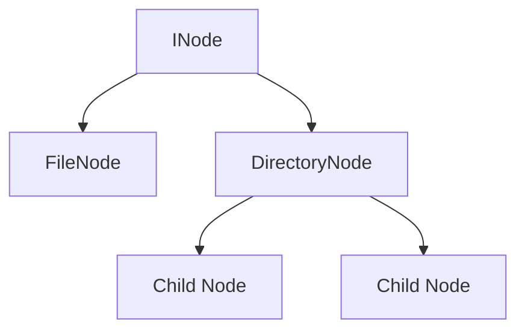
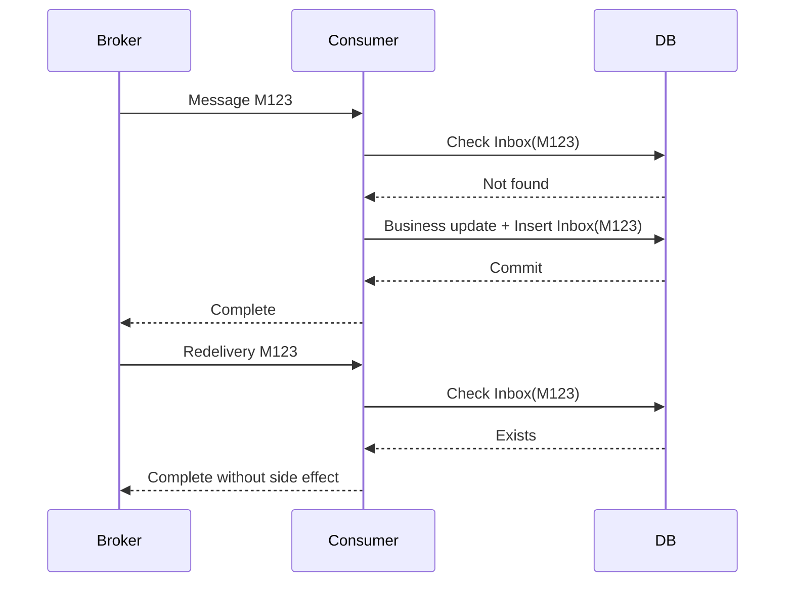
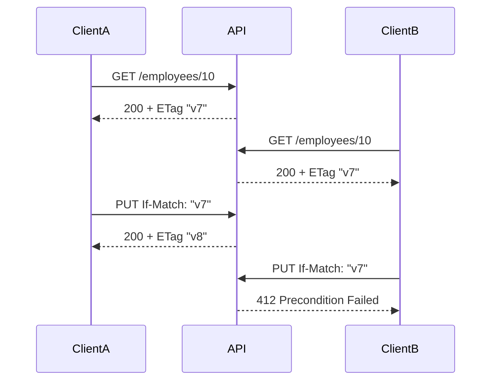
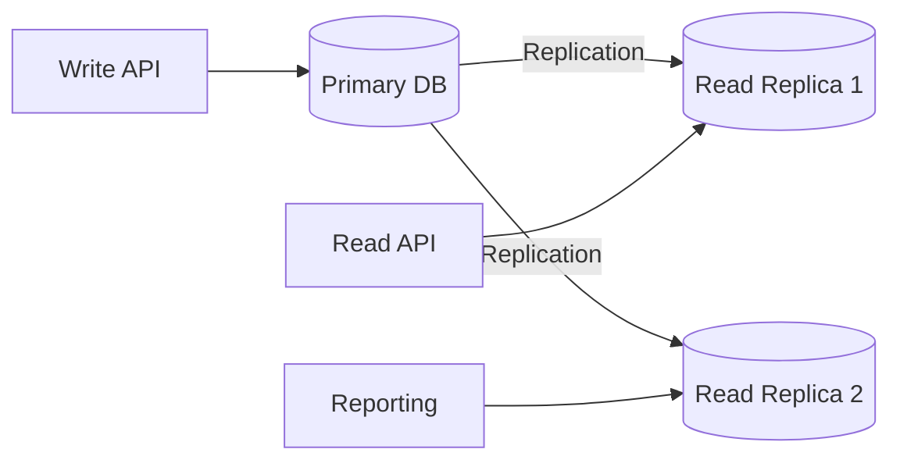
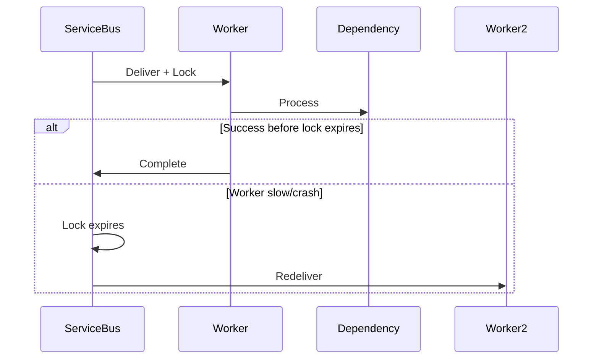
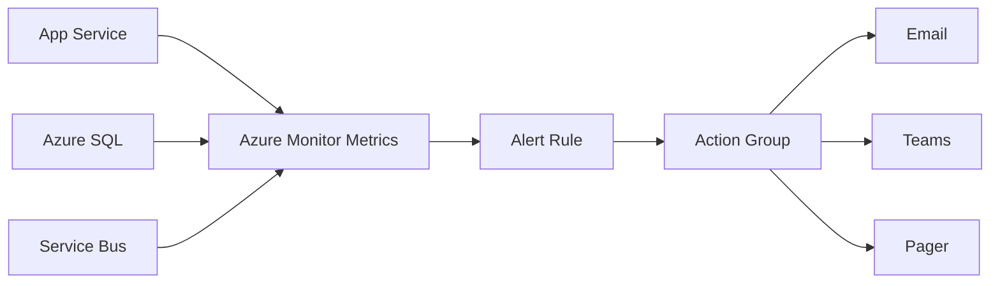
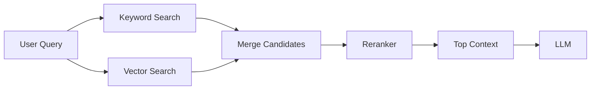

# Daily Knowledge Sharing — 17/08/2026

## Today’s Topics

1. Composite Pattern — mô hình hóa cây nghiệp vụ mà không tạo `if/else` theo từng loại node
2. Event-Driven Architecture — Consumer Inbox Pattern để chống xử lý trùng message
3. HTTP Conditional Update với ETag / If-Match — optimistic concurrency ngay ở API boundary
4. Database Read Replica — scale read nhưng phải chấp nhận replication lag
5. Tail Latency p95/p99 — vì sao average latency che giấu trải nghiệm tệ nhất
6. Azure Service Bus Message Lock — lock renewal, prefetch và xử lý message dài hạn an toàn
7. Azure Monitor Metrics & Alert Rules — từ tín hiệu hệ thống đến alert có thể hành động
8. RED Method — Rate, Errors, Duration cho production observability
9. RAG Hybrid Search & Reranking — kết hợp keyword + vector để tăng retrieval quality
10. Incident Postmortem — học từ sự cố mà không biến review thành cuộc truy lỗi cá nhân

---

# 1. Composite Pattern — mô hình hóa cây nghiệp vụ mà không tạo `if/else` theo từng loại node

### 1. What is it?

Composite Pattern cho phép xử lý một object đơn lẻ và một nhóm object theo cùng một interface. Nó phù hợp khi domain có cấu trúc dạng cây: folder/file, menu/submenu, organization hierarchy, permission tree, rule tree, pricing bundle.

Điểm quan trọng là caller không cần biết đang làm việc với leaf hay composite node.

### 2. Why does it exist?

Nếu mỗi loại node phải xử lý khác nhau bằng `switch`, code rất nhanh phình ra:

```csharp
if (node.Type == "Folder") { ... }
else if (node.Type == "File") { ... }
else if (node.Type == "Group") { ... }
```

Khi thêm loại node mới, nhiều nơi phải sửa đồng thời.

### 3. How does it work?



Leaf thực hiện operation trực tiếp. Composite giữ danh sách child và delegate operation xuống cây.

### 4. Practical example

```csharp
public interface IPermissionNode
{
    bool IsGranted(HashSet<string> userClaims);
}

public sealed class ClaimNode(string claim) : IPermissionNode
{
    public bool IsGranted(HashSet<string> claims) => claims.Contains(claim);
}

public sealed class AnyOfNode(IEnumerable<IPermissionNode> children) : IPermissionNode
{
    public bool IsGranted(HashSet<string> claims)
        => children.Any(x => x.IsGranted(claims));
}
```

Có thể dựng permission tree mà không cần controller hiểu cấu trúc bên trong.

### 5. Real production scenario

Một SaaS có permission dạng nhóm: `Admin` gồm nhiều quyền con, mỗi quyền lại có thể là nhóm hoặc claim đơn. Composite cho phép evaluate toàn bộ cây bằng cùng một contract.

### 6. Common mistakes

- Dùng Composite cho cấu trúc không thực sự có tính cây.
- Cho composite chứa quá nhiều orchestration không liên quan.
- Không bảo vệ cycle khi graph thực tế không phải tree.
- Serialize cây lớn mà không có giới hạn depth.

### 7. Trade-offs

**Advantages**

- Giảm `switch` theo loại node.
- Thêm node mới ít ảnh hưởng code hiện hữu.
- Phù hợp domain hierarchy.

**Costs / Risks**

- Debug traversal khó hơn code phẳng.
- Cây sâu có thể gây recursion/stack issue.
- Không phù hợp khi leaf và group có semantics quá khác nhau.

### 8. Junior → Middle → Senior understanding

**Junior:** hiểu leaf và composite dùng chung interface.

**Middle:** biết implement traversal, validation, cycle protection và test từng node.

**Senior / Technical Lead:** quyết định khi nào tree abstraction phản ánh domain thật và khi nào chỉ làm code phức tạp hơn.

### 9. Key takeaway

- Composite phù hợp khi domain thật sự có cấu trúc phân cấp.
- Mục tiêu là thống nhất cách xử lý leaf và group.
- Đừng dùng pattern chỉ vì cấu trúc dữ liệu “trông giống cây”.

---

# 2. Event-Driven Architecture — Consumer Inbox Pattern để chống xử lý trùng message

### 1. What is it?

Trong messaging thực tế, delivery thường là **at-least-once**, nghĩa là consumer có thể nhận cùng một message nhiều lần. Inbox Pattern lưu `MessageId` đã xử lý để biến consumer thành idempotent.

### 2. Why does it exist?

Nếu consumer thực hiện:

1. update database;
2. message broker chưa nhận được ACK;
3. broker redeliver;
4. consumer chạy lần hai;

thì side effect có thể bị lặp: gửi email hai lần, trừ tiền hai lần, tạo record trùng.

### 3. How does it work?



Inbox record và business change nên nằm trong cùng transaction khi có thể.

### 4. Practical example

```csharp
await using var tx = await db.Database.BeginTransactionAsync(ct);

if (await db.InboxMessages.AnyAsync(x => x.MessageId == message.Id, ct))
{
    await tx.CommitAsync(ct);
    return;
}

order.MarkPaid(message.PaymentId);
db.InboxMessages.Add(new InboxMessage(message.Id, DateTime.UtcNow));
await db.SaveChangesAsync(ct);
await tx.CommitAsync(ct);
```

`MessageId` cần unique index để tránh race condition giữa hai consumer instance.

### 5. Real production scenario

Payment service phát `PaymentSucceeded`. Order service cập nhật order và gửi workflow tiếp theo. Nếu message bị redeliver, Inbox ngăn việc đánh dấu/gửi side effect lần hai.

### 6. Common mistakes

- Chỉ check trong memory.
- Không có unique constraint trên `MessageId`.
- Ghi Inbox ngoài transaction business update.
- Không có retention/cleanup cho bảng Inbox.
- Nghĩ rằng broker “exactly once” sẽ giải quyết toàn bộ side effect ngoài broker.

### 7. Trade-offs

**Advantages**

- Consumer an toàn trước duplicate delivery.
- Dễ reason hơn so với cố ép exactly-once xuyên nhiều hệ thống.

**Costs / Risks**

- Thêm DB write cho mỗi message.
- Cần cleanup dữ liệu Inbox.
- Không tự giải quyết idempotency của external API bên ngoài transaction.

### 8. Junior → Middle → Senior understanding

**Junior:** hiểu message có thể đến nhiều lần.

**Middle:** biết dùng `MessageId`, unique index và transaction boundary.

**Senior / Technical Lead:** phân biệt broker delivery semantics với business exactly-once semantics, và thiết kế idempotency xuyên các side effect.

### 9. Key takeaway

- Duplicate message là chuyện bình thường, không phải edge case hiếm.
- Idempotency phải được thiết kế ở consumer.
- Inbox + unique constraint + transaction là bộ ba quan trọng.

---

# 3. HTTP Conditional Update với ETag / If-Match — optimistic concurrency ngay ở API boundary

### 1. What is it?

ETag đại diện cho version của một resource. Client đọc resource, giữ ETag, rồi gửi `If-Match` khi update. Server chỉ chấp nhận nếu version hiện tại vẫn khớp.

### 2. Why does it exist?

Hai user cùng mở employee profile:

- A sửa phone.
- B sửa address từ dữ liệu cũ.
- B save sau A.

Nếu API không kiểm soát concurrency, B có thể overwrite thay đổi của A.

### 3. How does it work?



### 4. Practical example

```csharp
[HttpPut("{id:int}")]
public async Task<IActionResult> Update(int id, UpdateEmployeeRequest request,
    [FromHeader(Name = "If-Match")] string? etag)
{
    var employee = await db.Employees.FindAsync(id);
    if (employee is null) return NotFound();

    var current = $"\"{employee.RowVersionHex}\"";
    if (etag != current)
        return StatusCode(StatusCodes.Status412PreconditionFailed);

    employee.Update(request.Name);
    await db.SaveChangesAsync();
    return NoContent();
}
```

Trong EF Core, có thể dùng `rowversion`/concurrency token làm nguồn ETag.

### 5. Real production scenario

Employee management portal, ticketing, document editor, configuration screen đều dễ gặp lost update khi nhiều người chỉnh cùng resource.

### 6. Common mistakes

- Chỉ dùng timestamp từ client.
- Không quote/normalize ETag đúng HTTP semantics.
- Trả `409` cho mọi trường hợp mà không phân biệt precondition failure.
- Bỏ concurrency check ở batch/background update.

### 7. Trade-offs

**Advantages**

- Phát hiện lost update sớm ở HTTP boundary.
- Stateless và phù hợp REST.

**Costs / Risks**

- Client phải xử lý conflict UX.
- Resource composite có thể khó định nghĩa version.
- ETag không tự merge thay đổi.

### 8. Junior → Middle → Senior understanding

**Junior:** hiểu ETag như version của resource.

**Middle:** biết map ETag với `rowversion`, xử lý `412` và retry/refresh UX.

**Senior / Technical Lead:** quyết định granularity versioning, conflict strategy và cách áp dụng cho resource tổng hợp nhiều nguồn dữ liệu.

### 9. Key takeaway

- ETag giúp chống lost update mà không cần pessimistic lock dài hạn.
- `If-Match` là contract concurrency giữa client và server.
- Conflict cần business/UI strategy, không chỉ status code.

---

# 4. Database Read Replica — scale read nhưng phải chấp nhận replication lag

### 1. What is it?

Read replica là bản sao database dùng chủ yếu cho truy vấn đọc. Primary chịu write; replica nhận thay đổi qua replication.

### 2. Why does it exist?

Khi 90% workload là đọc, tăng cấu hình primary mãi vừa đắt vừa khó scale. Read replica tách read load khỏi write path.

Nhưng replication thường asynchronous, nên dữ liệu trên replica có thể chậm vài ms đến vài giây.

### 3. How does it work?



### 4. Practical example

Một query handler có thể dùng connection string riêng cho read-only workload:

```csharp
await using var db = readDbFactory.CreateDbContext();
var items = await db.Orders
    .AsNoTracking()
    .Where(x => x.CustomerId == customerId)
    .ToListAsync(ct);
```

Nhưng flow “create order rồi đọc ngay order vừa tạo” nên đọc primary nếu cần read-your-writes consistency.

### 5. Real production scenario

E-commerce dùng primary cho checkout, replica cho product search/reporting/order history. Dashboard có thể chịu lag vài giây; payment confirmation thì không.

### 6. Common mistakes

- Route mọi GET vào replica mà không xét consistency requirement.
- Không monitor replication lag.
- Dùng replica cho transaction cần dữ liệu vừa write.
- Nghĩ replica là backup.

### 7. Trade-offs

**Advantages**

- Scale read traffic.
- Giảm contention trên primary.
- Tách reporting workload.

**Costs / Risks**

- Eventual consistency.
- Routing phức tạp hơn.
- Tăng cost và operational surface.

### 8. Junior → Middle → Senior understanding

**Junior:** primary ghi, replica đọc.

**Middle:** biết chọn query nào chịu được lag và monitor connection/read path.

**Senior / Technical Lead:** phân loại consistency requirement theo use case và thiết kế read-after-write strategy.

### 9. Key takeaway

- Replica là công cụ scale read, không phải consistency miễn phí.
- Mọi query cần biết mình có chịu được stale data hay không.
- Monitor replication lag như một production signal.

---

# 5. Tail Latency p95/p99 — vì sao average latency che giấu trải nghiệm tệ nhất

### 1. What is it?

Percentile latency cho biết phần trăm request hoàn thành dưới một ngưỡng. `p95 = 800ms` nghĩa là 95% request ≤ 800ms, còn 5% chậm hơn.

### 2. Why does it exist?

Average có thể đẹp dù user vẫn gặp request rất chậm.

Ví dụ 99 request = 100ms, 1 request = 10s. Average khoảng 199ms, nghe có vẻ ổn, nhưng 1% user trải nghiệm 10 giây.

### 3. How does it work?

Quy trình performance đúng:

```text
Symptom
→ đo p50/p95/p99
→ tách endpoint/dependency
→ tìm tail bottleneck
→ đưa ra hypothesis
→ test
→ tối ưu
→ đo lại
```

### 4. Practical example

ASP.NET Core metrics nên track histogram theo route hợp lý thay vì log từng duration rồi tính thủ công.

Ví dụ alert khi `p95 > 1s` trong 10 phút và request rate đủ lớn, thay vì chỉ alert average.

### 5. Real production scenario

API gọi SQL + Redis + Graph API. Average mỗi dependency thấp nhưng một dependency có p99 cao do connection pool exhaustion. User chỉ thỉnh thoảng thấy request treo 4–5s.

### 6. Common mistakes

- Chỉ nhìn average.
- Tạo label theo `userId` làm metric cardinality nổ.
- Tối ưu p99 khi sample quá ít.
- Không tách cold start, background traffic và real user traffic.

### 7. Trade-offs

**Advantages**

- Phản ánh trải nghiệm tail user tốt hơn.
- Giúp phát hiện contention và intermittent dependency issue.

**Costs / Risks**

- Percentile cần histogram/aggregation đúng.
- p99 dễ nhiễu khi traffic thấp.

### 8. Junior → Middle → Senior understanding

**Junior:** average không kể toàn bộ câu chuyện.

**Middle:** biết đọc p50/p95/p99 và correlate với dependency metrics.

**Senior / Technical Lead:** chọn SLO percentile hợp lý theo business và traffic distribution.

### 9. Key takeaway

- Production latency phải nhìn distribution, không chỉ average.
- p95/p99 thường chỉ ra contention mà average che giấu.
- Percentile chỉ có ý nghĩa khi sample và grouping đúng.

---

# 6. Azure Service Bus Message Lock — lock renewal, prefetch và xử lý message dài hạn an toàn

### 1. What is it?

Ở Peek-Lock mode, consumer nhận message nhưng broker chưa xóa nó. Message bị lock tạm thời. Consumer xử lý xong thì `Complete`; thất bại thì abandon hoặc lock hết hạn và message được giao lại.

### 2. Why does it exist?

Nếu broker xóa message ngay khi giao, worker crash giữa chừng sẽ làm mất dữ liệu. Lock giữ khả năng redelivery.

### 3. How does it work?



Long-running handler cần auto lock renewal hoặc chia workload thành bước nhỏ.

### 4. Practical example

```csharp
services.AddAzureClients(builder =>
{
    builder.AddServiceBusClient(connectionString);
});

var options = new ServiceBusProcessorOptions
{
    MaxConcurrentCalls = 8,
    PrefetchCount = 32,
    MaxAutoLockRenewalDuration = TimeSpan.FromMinutes(10)
};
```

`PrefetchCount` quá cao có thể khiến message nằm local lâu đến mức lock gần hết trước khi xử lý.

### 5. Real production scenario

File processing worker nhận message chứa Blob URI. Một file mất 7 phút xử lý. Nếu lock chỉ 1 phút và không renew, cùng file có thể bị hai worker xử lý song song.

### 6. Common mistakes

- Prefetch quá lớn.
- Handler chạy lâu nhưng không renew lock.
- Không idempotent khi redelivery.
- `MaxConcurrentCalls` cao hơn capacity của DB/API downstream.

### 7. Trade-offs

**Advantages**

- Không mất message khi worker crash.
- Hỗ trợ reliable redelivery.

**Costs / Risks**

- Lock tuning phức tạp với task dài.
- Concurrency + prefetch sai có thể tăng duplicate và overload dependency.

### 8. Junior → Middle → Senior understanding

**Junior:** Complete nghĩa là xử lý xong; lock expiry có thể redeliver.

**Middle:** biết tune lock renewal, prefetch, concurrency và idempotency.

**Senior / Technical Lead:** thiết kế worker throughput dựa trên downstream capacity, message duration distribution và failure mode.

### 9. Key takeaway

- Message lock không thay thế idempotency.
- Prefetch và concurrency phải gắn với processing time và dependency capacity.
- Long-running work cần lock renewal hoặc chia nhỏ workflow.

---

# 7. Azure Monitor Metrics & Alert Rules — từ tín hiệu hệ thống đến alert có thể hành động

### 1. What is it?

Azure Monitor thu thập metrics từ App Service, SQL, Service Bus, Functions, VM và nhiều resource khác. Alert rule đánh giá metrics/logs theo điều kiện để kích hoạt notification/action group.

### 2. Why does it exist?

Dashboard chỉ hữu ích khi có người nhìn. Production cần hệ thống chủ động báo khi SLO hoặc capacity có vấn đề.

### 3. How does it work?



Alert tốt nên gắn với symptom hoặc risk rõ ràng, không phải mọi metric bất thường đều page on-call.

### 4. Practical example

Một rule có thể cảnh báo khi:

- Service Bus Active Messages tăng liên tục 15 phút;
- Dead-letter count > 0;
- App Service HTTP 5xx vượt 2%;
- Azure SQL CPU > 90% kèm query latency tăng.

### 5. Real production scenario

Notification worker chết nhưng API vẫn 200. Queue depth tăng dần. Alert dựa trên queue backlog phát hiện sự cố trước khi user complain.

### 6. Common mistakes

- Alert CPU > 80% mọi lúc.
- Không có suppression/deduplication.
- Alert không có runbook hoặc owner.
- Threshold tĩnh không xét traffic baseline.

### 7. Trade-offs

**Advantages**

- Phát hiện sự cố chủ động.
- Tích hợp tốt với Azure resources.

**Costs / Risks**

- Alert noise gây fatigue.
- Log-based alert có thể tốn chi phí.
- Cần tuning theo workload thật.

### 8. Junior → Middle → Senior understanding

**Junior:** hiểu metrics đo hệ thống, alert kích hoạt khi điều kiện xảy ra.

**Middle:** biết tạo rule, action group và runbook.

**Senior / Technical Lead:** phân biệt page-worthy symptom với diagnostic signal và quản lý alert budget/noise.

### 9. Key takeaway

- Alert phải dẫn đến hành động cụ thể.
- Ưu tiên symptom/user impact hơn infrastructure noise.
- Queue backlog, error rate, latency thường giá trị hơn một threshold CPU đơn lẻ.

---

# 8. RED Method — Rate, Errors, Duration cho production observability

### 1. What is it?

RED là cách quan sát request-driven service qua ba nhóm signal:

- **Rate:** số request/message mỗi đơn vị thời gian.
- **Errors:** tỷ lệ hoặc số lỗi.
- **Duration:** latency distribution.

### 2. Why does it exist?

Khi incident xảy ra, mở hàng chục dashboard CPU/RAM trước thường mất thời gian. RED bắt đầu từ trải nghiệm service: có traffic không, lỗi tăng không, chậm không.

### 3. How does it work?

```text
Rate tăng? → capacity issue?
Errors tăng? → dependency/code/config?
Duration tăng? → DB/network/thread pool/downstream?
```

Sau RED mới drill down sang resource metrics, logs và traces.

### 4. Practical example

Một ASP.NET Core API nên có ít nhất:

- request count theo route/status class;
- error ratio;
- p50/p95/p99 duration;
- trace cho slow/error request.

### 5. Real production scenario

Sau deployment, CPU không đổi nhưng error rate từ 0.2% lên 8% ở một endpoint. RED phát hiện impact ngay, trong khi dashboard infrastructure nhìn vẫn “xanh”.

### 6. Common mistakes

- Label metric theo raw URL chứa ID.
- Chỉ đo average duration.
- Trộn business rejection `4xx` với server failure mà không phân loại.
- Không correlate metric spike với traces/logs.

### 7. Trade-offs

**Advantages**

- Đơn giản, tập trung service health.
- Hữu ích khi incident triage.

**Costs / Risks**

- Không đủ để chẩn đoán root cause một mình.
- Với batch/worker cần điều chỉnh khái niệm “Rate” và “Duration”.

### 8. Junior → Middle → Senior understanding

**Junior:** biết ba signal cơ bản.

**Middle:** biết instrument metrics và drill down bằng trace/log.

**Senior / Technical Lead:** thiết kế dashboard/SLO theo service behavior, tránh metric cardinality và alert noise.

### 9. Key takeaway

- Bắt đầu incident triage từ service symptom.
- RED là entry point, không phải toàn bộ observability.
- Metrics phải liên kết được với logs và traces.

---

# 9. RAG Hybrid Search & Reranking — kết hợp keyword + vector để tăng retrieval quality

### 1. What is it?

Hybrid Search kết hợp lexical search như BM25 với vector similarity. Reranking là bước sắp xếp lại candidate bằng model hoặc scoring sâu hơn trước khi đưa context cho LLM.

### 2. Why does it exist?

Vector search mạnh với nghĩa tương đồng nhưng có thể bỏ sót exact identifiers, mã sản phẩm, error code, tên API. Keyword search tìm exact term tốt nhưng yếu ở semantic similarity.

### 3. How does it work?



Reranker thường chỉ chạy trên top-N candidate để giữ cost/latency hợp lý.

### 4. Practical example

Query: `Graph ErrorInvalidRequest calendar update`

- Keyword search bắt chính xác `ErrorInvalidRequest`.
- Vector search tìm tài liệu về calendar update failure dù wording khác.
- Reranker ưu tiên đoạn thật sự giải thích lỗi.

Application sau đó chỉ đưa top 5 chunks vào model thay vì toàn bộ top 30.

### 5. Real production scenario

Internal engineering assistant tìm trong runbook, ADR, incident log và API docs. Hybrid retrieval thường ổn hơn vector-only vì tài liệu kỹ thuật chứa nhiều exact token.

### 6. Common mistakes

- Dùng vector-only cho tài liệu nhiều ID/code.
- Merge score trực tiếp dù hai hệ scoring khác scale.
- Rerank quá nhiều candidate làm latency/cost tăng.
- Không có evaluation dataset để chứng minh retrieval tốt hơn.

### 7. Trade-offs

**Advantages**

- Recall tốt hơn trên cả semantic và exact-match query.
- Reranking cải thiện precision trước LLM.

**Costs / Risks**

- Pipeline phức tạp hơn.
- Tăng latency và compute cost.
- Cần tuning fusion/rerank threshold.

### 8. Junior → Middle → Senior understanding

**Junior:** keyword và vector giải quyết hai kiểu tìm kiếm khác nhau.

**Middle:** biết merge candidate, rerank và đo Recall@K/precision.

**Senior / Technical Lead:** quyết định pipeline theo query distribution, latency budget, token budget và evaluation quality.

### 9. Key takeaway

- Vector search không phải luôn đủ cho tài liệu kỹ thuật.
- Hybrid search tăng recall; reranking tăng precision.
- Mọi cải tiến retrieval cần được đo bằng evaluation dataset.

---

# 10. Incident Postmortem — học từ sự cố mà không biến review thành cuộc truy lỗi cá nhân

### 1. What is it?

Postmortem là tài liệu và buổi review sau incident nhằm trả lời: chuyện gì xảy ra, impact gì, vì sao xảy ra, detection/response ra sao, và hệ thống/process cần thay đổi gì.

### 2. Why does it exist?

Nếu chỉ “fix bug rồi đóng ticket”, cùng failure mode sẽ lặp lại. Incident thường không do một lỗi cá nhân đơn lẻ mà là chuỗi điều kiện: code, test gap, alert gap, deployment, runbook, permission, architecture.

### 3. How does it work?

Một postmortem tốt thường có:

```text
Timeline
→ Customer impact
→ Detection
→ Technical causes
→ Contributing factors
→ Mitigation
→ Recovery
→ Action items + owner + due date
```

### 4. Practical example

Sự cố: background job gửi email offboarding trùng.

Không dừng ở “developer quên check duplicate”. Review nên hỏi:

- broker có redelivery không?
- consumer có idempotency không?
- có metric duplicate không?
- test có mô phỏng retry không?
- alert có phát hiện spike không?

### 5. Real production scenario

Một release làm API timeout do connection pool exhaustion. Root cause không chỉ là một query chậm; còn có retry storm, thiếu timeout budget, alert chỉ nhìn CPU, load test không đủ concurrency.

### 6. Common mistakes

- Viết postmortem như báo cáo quy trách nhiệm.
- Chỉ ghi “human error”.
- Action item kiểu “cẩn thận hơn”.
- Có action nhưng không owner/due date.
- Không phân biệt root cause và contributing factor.

### 7. Trade-offs

**Advantages**

- Biến incident thành cải tiến hệ thống.
- Tăng chất lượng vận hành và kiến thức chung.

**Costs / Risks**

- Tốn thời gian nếu áp dụng cho sự cố quá nhỏ.
- Nếu văn hóa blame, người tham gia sẽ giấu thông tin.

### 8. Junior → Middle → Senior understanding

**Junior:** biết cung cấp timeline và facts rõ ràng.

**Middle:** biết phân tích failure path, logs/traces và đề xuất fix cụ thể.

**Senior / Technical Lead:** nhìn incident như system failure, ưu tiên action theo blast radius, recurrence probability và cost.

### 9. Key takeaway

- Mục tiêu của postmortem là giảm xác suất và impact của lần sau.
- “Human error” không phải điểm kết thúc của phân tích.
- Action item phải cụ thể, có owner và kiểm chứng được.