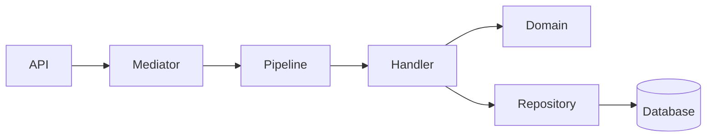
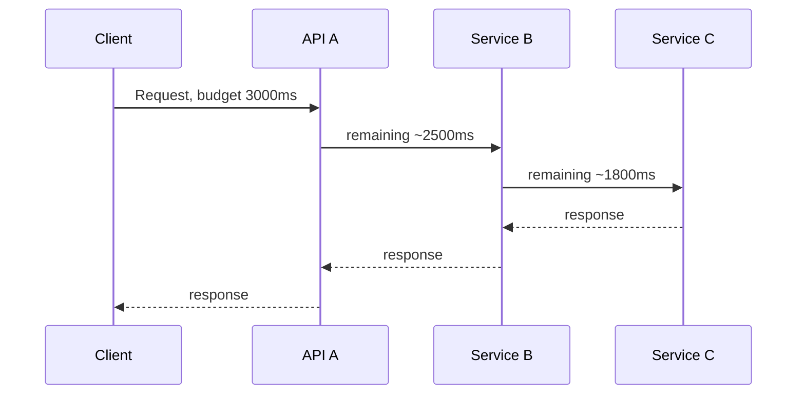
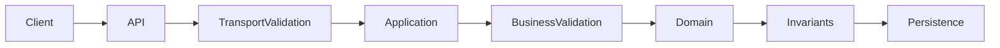
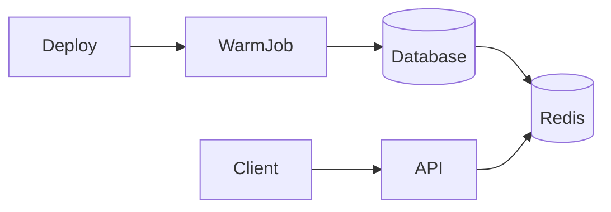
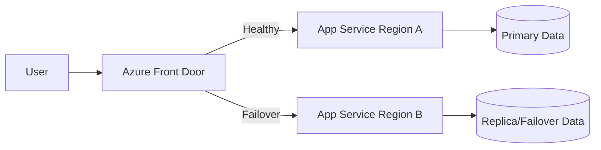
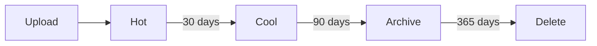
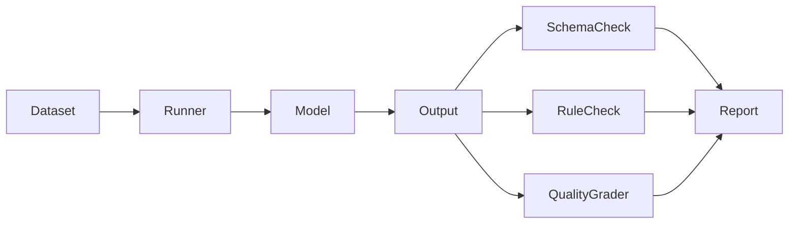
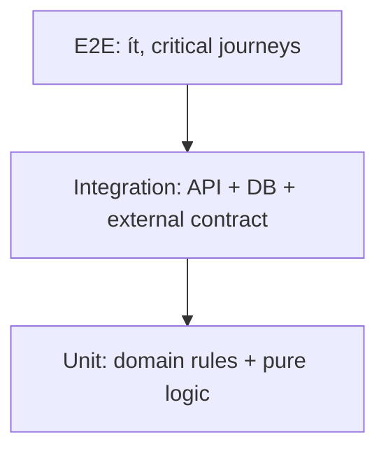

# Daily Knowledge Sharing — 17/08/2026

## Today’s Topics

1. Mediator Pattern & MediatR — giảm coupling giữa request handler nhưng tránh biến application thành “message soup”
2. Distributed Systems — Timeout Budget Propagation qua nhiều downstream service
3. API Validation Boundary — tách transport validation, business rule và domain invariant
4. PostgreSQL Partial Index — index đúng tập dữ liệu cần truy cập thay vì index toàn bảng
5. Cache Warming — khi nào chủ động nạp cache, khi nào chỉ làm tăng load lúc deploy
6. Azure Front Door Origin Health & Failover — thiết kế global routing không phụ thuộc một region
7. Azure Blob Storage Lifecycle & Access Tier — tối ưu retention và cost cho file lớn
8. Alert Fatigue — thiết kế alert theo symptom, impact và actionability
9. AI Evaluation Harness — golden dataset, regression test và deterministic checks cho LLM workflow
10. Testing Strategy — Test Pyramid, Test Trophy và cách chọn boundary kiểm thử thực tế

---

# 1. Mediator Pattern & MediatR — giảm coupling giữa request handler nhưng tránh biến application thành “message soup”

### 1. What is it?

Mediator Pattern đặt một trung gian giữa caller và handler để các thành phần không gọi trực tiếp lẫn nhau. Trong .NET, MediatR thường được dùng để gửi `Command`, `Query`, `Notification` tới handler tương ứng.

Ví dụ thay vì controller phụ thuộc trực tiếp vào `EmployeeService`, `AuditService`, `EmailService`, nó gửi một `DeactivateEmployeeCommand` và application layer quyết định handler nào xử lý.

Điểm quan trọng: Mediator là **cơ chế điều phối dependency**, không phải architecture tự thân. Nếu business logic bị chia thành hàng chục command nhỏ không rõ ownership, hệ thống vẫn có coupling nhưng coupling trở nên khó nhìn thấy hơn.

### 2. Why does it exist?

Trong hệ thống lớn, controller hoặc service rất dễ trở thành nơi orchestration quá nhiều dependency:

```text
Controller
 ├─ EmployeeService
 ├─ PermissionService
 ├─ AuditService
 ├─ NotificationService
 └─ GraphService
```

Khi mỗi endpoint gọi trực tiếp nhiều service:

- unit test khó setup,
- coupling tăng,
- cross-cutting concern như validation/logging/transaction bị lặp,
- application flow khó chuẩn hóa.

Mediator tạo một entry point thống nhất cho request xử lý.

### 3. How does it work?



Luồng điển hình:

1. Controller tạo command/query.
2. `IMediator.Send()` tìm handler.
3. Pipeline behavior chạy validation, logging, metrics, authorization nếu cần.
4. Handler thực hiện use case.
5. Handler gọi domain/repository/gateway.
6. Kết quả quay lại caller.

Boundary nên rõ:

- Controller: HTTP concerns.
- Command/Query: input cho use case.
- Handler: orchestration use case.
- Domain: business rule cốt lõi.
- Infrastructure: DB, HTTP SDK, queue.

### 4. Practical example

```csharp
public sealed record ApproveTimesheetCommand(Guid TimesheetId, Guid ApproverId)
    : IRequest;

public sealed class ApproveTimesheetHandler(
    AppDbContext db,
    IClock clock) : IRequestHandler<ApproveTimesheetCommand>
{
    public async Task Handle(
        ApproveTimesheetCommand request,
        CancellationToken cancellationToken)
    {
        var timesheet = await db.Timesheets
            .SingleAsync(x => x.Id == request.TimesheetId, cancellationToken);

        timesheet.Approve(request.ApproverId, clock.UtcNow);

        await db.SaveChangesAsync(cancellationToken);
    }
}
```

Validation có thể đặt trong pipeline:

```csharp
public sealed class ValidationBehavior<TRequest, TResponse>(
    IEnumerable<IValidator<TRequest>> validators)
    : IPipelineBehavior<TRequest, TResponse>
{
    public async Task<TResponse> Handle(
        TRequest request,
        RequestHandlerDelegate<TResponse> next,
        CancellationToken cancellationToken)
    {
        var failures = validators
            .Select(v => v.Validate(request))
            .SelectMany(r => r.Errors)
            .Where(e => e is not null)
            .ToArray();

        if (failures.Length > 0)
            throw new ValidationException(failures);

        return await next();
    }
}
```

### 5. Real production scenario

Một hệ thống employee offboarding cần:

1. cập nhật trạng thái employee,
2. lưu cấu hình mailbox,
3. audit,
4. enqueue background job,
5. trả response.

Một `OffboardEmployeeCommand` cho phép đóng gói orchestration vào một use-case handler. Nhưng việc convert mailbox, forwarding hay delegation vẫn nên nằm trong adapter/gateway chuyên trách, không nhét toàn bộ vào handler.

### 6. Common mistakes

- Tạo command/query cho mọi method nhỏ dù không phải use case.
- Handler gọi handler khác tạo call graph khó theo dõi.
- Nhét toàn bộ business logic vào handler thay vì domain.
- Dùng notification như event bus đáng tin cậy dù chạy cùng process.
- Pipeline behavior mở transaction cho cả read query không cần thiết.
- Lạm dụng MediatR chỉ để né constructor dependency.

### 7. Trade-offs

**Advantages**

- Giảm direct coupling giữa entry point và handler.
- Chuẩn hóa cross-cutting concerns.
- Use case có tên rõ ràng.
- Dễ mở rộng command/query pipeline.

**Costs / Risks**

- Tăng indirection.
- Debug call flow khó hơn với người mới.
- Nhiều file/boilerplate.
- Có thể che giấu dependency graph thật.

### 8. Junior → Middle → Senior understanding

**Junior**

Hiểu `Send()` chỉ dispatch request tới handler, không phải magic business layer.

**Middle**

Biết thiết kế command/query hợp lý, sử dụng pipeline behavior và giữ handler nhỏ, dễ test.

**Senior / Technical Lead**

Phải quyết định khi nào mediator giảm coupling thật sự, khi nào chỉ tăng ceremony; kiểm soát transaction boundary, domain ownership và observability của request flow.

### 9. Key takeaway

- MediatR nên tổ chức use case, không thay thế domain model.
- Pipeline phù hợp cho cross-cutting concerns, không phải business logic.
- Handler-to-handler chaining thường là dấu hiệu boundary chưa rõ.

---

# 2. Distributed Systems — Timeout Budget Propagation qua nhiều downstream service

### 1. What is it?

Timeout budget là tổng thời gian tối đa một request được phép tiêu tốn. Khi request đi qua nhiều service, mỗi downstream call phải nhận **phần ngân sách còn lại**, thay vì mỗi service tự đặt timeout độc lập.

Ví dụ client cho API A tối đa 3 giây. API A gọi B, B gọi C. Nếu A, B, C đều đặt timeout 3 giây thì toàn request có thể kéo dài hơn nhiều so với SLA ban đầu.

### 2. Why does it exist?

Naive setup:

```text
Client timeout = 3s
API A -> B timeout = 3s
B -> C timeout = 3s
```

Nếu C chậm, A có thể giữ thread/socket/resource lâu hơn thời gian client còn chờ. Request đã vô nghĩa nhưng downstream vẫn tiếp tục chạy.

Điều này gây:

- resource leak theo thời gian,
- queue buildup,
- thread/socket exhaustion,
- retry storm,
- tail latency tăng mạnh.

### 3. How does it work?



Nguyên tắc:

1. Request nhận deadline tổng.
2. Mỗi hop tính remaining time.
3. Mọi I/O dùng `CancellationToken` hoặc deadline tương ứng.
4. Nếu budget còn quá ít, fail fast thay vì gọi tiếp.

### 4. Practical example

```csharp
public async Task<HttpResponseMessage> GetEmployeeAsync(
    Guid id,
    TimeSpan remainingBudget,
    CancellationToken requestAborted)
{
    var localTimeout = TimeSpan.FromMilliseconds(
        Math.Min(remainingBudget.TotalMilliseconds, 1500));

    using var timeoutCts = new CancellationTokenSource(localTimeout);
    using var linkedCts = CancellationTokenSource.CreateLinkedTokenSource(
        requestAborted,
        timeoutCts.Token);

    return await httpClient.GetAsync(
        $"/employees/{id}",
        linkedCts.Token);
}
```

Nếu có absolute deadline:

```csharp
var remaining = deadlineUtc - DateTimeOffset.UtcNow;
if (remaining <= TimeSpan.Zero)
    throw new TimeoutException("Request deadline exceeded.");
```

### 5. Real production scenario

Một API timesheet gọi:

- identity service,
- project service,
- billing service.

SLA endpoint là p95 dưới 2 giây. Nếu project service đã mất 1.4 giây, billing service không nên được gọi với timeout 2 giây mới. Nó chỉ còn khoảng 600ms trừ overhead.

Nếu data billing không critical, hệ thống thậm chí có thể degrade gracefully và trả phần timesheet chính.

### 6. Common mistakes

- Mỗi service đặt timeout cố định độc lập.
- Retry nhưng không giảm remaining budget.
- Bắt `TaskCanceledException` rồi retry vô hạn.
- Không propagate `CancellationToken` đến EF Core/HTTP client.
- Client disconnect nhưng backend tiếp tục xử lý nặng.
- Dùng timeout quá dài để “giảm lỗi”.

### 7. Trade-offs

**Advantages**

- Giữ latency trong SLA.
- Giảm wasted work.
- Hạn chế cascading failure.
- Dễ kiểm soát retry.

**Costs / Risks**

- Cần propagate deadline/cancellation xuyên layer.
- Timeout quá aggressive tạo false failure.
- Cần hiểu service criticality để phân budget hợp lý.

### 8. Junior → Middle → Senior understanding

**Junior**

Hiểu timeout không chỉ là “bao lâu thì throw exception”.

**Middle**

Biết propagate cancellation và thiết lập per-call timeout hợp lý.

**Senior / Technical Lead**

Phải thiết kế end-to-end latency budget, retry budget, degradation strategy và quan sát p95/p99 theo từng hop.

### 9. Key takeaway

- Timeout phải được nhìn theo end-to-end request, không theo từng service riêng lẻ.
- Retry luôn phải tiêu tốn từ cùng một budget.
- Cancellation propagation là một phần của reliability, không chỉ coding style.

---

# 3. API Validation Boundary — tách transport validation, business rule và domain invariant

### 1. What is it?

Validation trong API không phải một loại duy nhất. Có ít nhất ba lớp:

1. **Transport validation** — payload có đúng format không?
2. **Application/business validation** — request có hợp lệ trong use case hiện tại không?
3. **Domain invariant** — trạng thái domain có bao giờ được phép vi phạm rule này không?

Nếu trộn cả ba vào controller hoặc FluentValidation, domain model dễ trở thành object “anemic” không tự bảo vệ trạng thái.

### 2. Why does it exist?

Ví dụ endpoint approve timesheet:

```json
{
  "timesheetId": "...",
  "approverId": "..."
}
```

Các validation khác nhau:

- `timesheetId` phải là GUID hợp lệ → transport.
- approver phải có quyền approve employee này → application authorization/business rule.
- timesheet đã Approved thì không thể Approved lần nữa → domain invariant.

Nếu tất cả nằm trong controller, rule dễ bị bỏ qua khi cùng logic được gọi từ background job hoặc message consumer.

### 3. How does it work?



Mỗi boundary trả lỗi khác nhau:

- malformed payload → `400 Bad Request`.
- rule/use-case không cho phép → `409`, `422` hoặc domain-specific problem.
- authentication/authorization → `401`/`403`.
- invariant violation → domain exception được map ra contract ổn định.

### 4. Practical example

Request validator:

```csharp
public sealed class CreateLeaveRequestValidator
    : AbstractValidator<CreateLeaveRequest>
{
    public CreateLeaveRequestValidator()
    {
        RuleFor(x => x.StartDate)
            .LessThanOrEqualTo(x => x.EndDate);

        RuleFor(x => x.Reason)
            .MaximumLength(500);
    }
}
```

Domain invariant:

```csharp
public void Approve(Guid approverId)
{
    if (Status != TimesheetStatus.Submitted)
        throw new DomainException(
            "Only submitted timesheets can be approved.");

    Status = TimesheetStatus.Approved;
    ApprovedBy = approverId;
}
```

### 5. Real production scenario

Employee offboarding có rule:

- `Forward` hoặc `Delegate` cần `TargetEmail` và `EndTime`.
- `Delete` không cần các field đó.
- Employee đã inactive có thể không cho offboard lại.

Request-shape validation nên kiểm tra required fields theo action. Nhưng rule state transition thuộc domain/application, không nên phụ thuộc controller.

### 6. Common mistakes

- Nhét tất cả rule vào FluentValidation.
- Domain object cho phép trạng thái invalid rồi “hy vọng” service validate trước.
- Trả `400` cho mọi loại lỗi.
- Query database từ validator không cache/không cân nhắc performance.
- Validation bị duplicate giữa API và background consumer.
- Dùng exception message làm public API contract.

### 7. Trade-offs

**Advantages**

- Rule rõ ownership.
- Domain luôn tự bảo vệ invariant.
- API contract nhất quán.
- Tái sử dụng logic tốt hơn ngoài HTTP flow.

**Costs / Risks**

- Có nhiều lớp validation hơn.
- Cần map lỗi rõ ràng.
- Có thể overengineer với CRUD rất đơn giản.

### 8. Junior → Middle → Senior understanding

**Junior**

Phân biệt validation format và business rule.

**Middle**

Biết đặt validation đúng layer và map lỗi HTTP phù hợp.

**Senior / Technical Lead**

Thiết kế error contract, domain invariant, authorization boundary và tránh duplicate rule giữa nhiều entry point.

### 9. Key takeaway

- Không phải mọi validation đều thuộc controller hay FluentValidation.
- Domain invariant phải được enforce ở domain boundary.
- Error status code nên phản ánh đúng loại failure.

---

# 4. PostgreSQL Partial Index — index đúng tập dữ liệu cần truy cập thay vì index toàn bảng

### 1. What is it?

Partial Index là index chỉ chứa những row thỏa điều kiện `WHERE` nhất định.

Ví dụ bảng có hàng chục triệu record nhưng query production chủ yếu lấy `IsDeleted = false`. Thay vì index toàn bộ table, PostgreSQL có thể index riêng tập active rows.

### 2. Why does it exist?

Index toàn bảng có chi phí:

- disk lớn,
- write chậm hơn,
- vacuum/index maintenance nặng hơn,
- cache hit ratio kém hơn.

Nếu phần lớn row không bao giờ tham gia hot query, index chúng là lãng phí.

### 3. How does it work?

Ví dụ:

```sql
CREATE INDEX idx_orders_pending_created_at
ON orders (created_at)
WHERE status = 'Pending';
```

Query này có thể dùng index:

```sql
SELECT id, customer_id, created_at
FROM orders
WHERE status = 'Pending'
ORDER BY created_at
LIMIT 100;
```

Planner chỉ dùng partial index nếu predicate query tương thích với predicate index.

### 4. Practical example

Bad approach:

```sql
CREATE INDEX idx_employee_email
ON employee(email);
```

Nếu hệ thống gần như luôn query employee active:

```sql
SELECT id, email, display_name
FROM employee
WHERE is_deleted = false
  AND email = 'user@example.com';
```

Có thể dùng:

```sql
CREATE UNIQUE INDEX ux_employee_active_email
ON employee(email)
WHERE is_deleted = false;
```

Điều này còn cho phép reuse email sau soft-delete nếu business cho phép.

### 5. Real production scenario

Một SaaS có 50 triệu notification, nhưng chỉ vài trăm nghìn row còn `Processed = false`.

Worker thường chạy:

```sql
SELECT *
FROM notifications
WHERE processed = false
ORDER BY created_at
LIMIT 100;
```

Partial index trên `processed = false` nhỏ hơn rất nhiều so với index toàn bảng và phù hợp đúng hot path.

### 6. Common mistakes

- Predicate query khác predicate index nên planner không dùng.
- Tạo quá nhiều partial index theo từng status.
- Không theo dõi data distribution thay đổi theo thời gian.
- Dùng partial index nhưng query ORM sinh điều kiện khác kiểu.
- Quên uniqueness semantics chỉ áp dụng trong tập index.

### 7. Trade-offs

**Advantages**

- Index nhỏ hơn.
- Write overhead thấp hơn so với full index.
- Tăng cache efficiency.
- Tối ưu rất tốt cho skewed data.

**Costs / Risks**

- Chỉ hữu ích cho subset query rõ ràng.
- Dễ bị miss do query predicate không khớp.
- Tăng complexity khi schema/index strategy nhiều điều kiện.

### 8. Junior → Middle → Senior understanding

**Junior**

Hiểu index không nhất thiết phải chứa toàn bộ row.

**Middle**

Biết dùng `EXPLAIN ANALYZE`, kiểm tra query predicate và data distribution.

**Senior / Technical Lead**

Phải cân nhắc workload read/write, selectivity, retention model và maintenance cost trước khi tạo partial index.

### 9. Key takeaway

- Partial index mạnh khi hot data chỉ là một phần nhỏ của table.
- Predicate query phải phù hợp với predicate index.
- Tối ưu index nên dựa trên workload thật, không dựa trên cảm giác.

---

# 5. Cache Warming — khi nào chủ động nạp cache, khi nào chỉ làm tăng load lúc deploy

### 1. What is it?

Cache warming là chủ động nạp dữ liệu vào cache trước khi traffic thực sự yêu cầu, thay vì chờ cache miss đầu tiên.

Mục tiêu thường là tránh cold-start latency và cache stampede sau deploy/restart.

### 2. Why does it exist?

Sau deploy, toàn bộ in-memory cache trống. Với distributed cache, một batch key có thể hết hạn cùng lúc.

Nếu 1.000 request đầu tiên cùng miss:

```text
1000 requests
      ↓
   Cache miss
      ↓
   Database
```

Database đột ngột chịu tải cao nhất đúng thời điểm hệ thống vừa restart.

### 3. How does it work?

Có vài chiến lược:

- pre-load top-N hot keys,
- lazy warm từng key với single-flight,
- staggered warm theo batch,
- background refresh trước expiry,
- warm theo traffic historical pattern.



Điểm quan trọng: warming phải có rate limit, nếu không nó chính là một load test lên DB.

### 4. Practical example

```csharp
public sealed class ProductCacheWarmer(
    AppDbContext db,
    IDistributedCache cache)
{
    public async Task WarmAsync(CancellationToken cancellationToken)
    {
        var products = await db.Products
            .AsNoTracking()
            .Where(x => x.IsFeatured)
            .Take(100)
            .ToListAsync(cancellationToken);

        foreach (var product in products)
        {
            var key = $"product:{product.Id}:v1";
            await cache.SetStringAsync(
                key,
                JsonSerializer.Serialize(product),
                new DistributedCacheEntryOptions
                {
                    AbsoluteExpirationRelativeToNow = TimeSpan.FromMinutes(10)
                },
                cancellationToken);
        }
    }
}
```

### 5. Real production scenario

Một pricing API có 200 key sản phẩm chiếm 80% traffic. Sau deploy, nếu để lazy-load toàn bộ, p95 tăng mạnh vài phút đầu.

Warming 200 key hot này hợp lý. Warming 10 triệu sản phẩm là sai vì cost nạp dữ liệu lớn hơn lợi ích.

### 6. Common mistakes

- Warm toàn bộ dataset.
- Warm cùng lúc trên mọi instance khi scale-out.
- Không rate-limit warm job.
- TTL các key giống hệt nhau gây expire đồng loạt.
- Warm dữ liệu hiếm khi được dùng.
- Không kiểm tra cache availability trước deploy.

### 7. Trade-offs

**Advantages**

- Giảm cold-start latency.
- Bảo vệ DB sau deploy.
- Tăng predictability cho hot path.

**Costs / Risks**

- Tăng deploy/startup time.
- Có thể gây load spike.
- Dữ liệu warm có thể không được sử dụng.
- Phức tạp hơn lazy caching.

### 8. Junior → Middle → Senior understanding

**Junior**

Hiểu warming là pre-populate cache, không phải cache strategy mặc định cho mọi key.

**Middle**

Biết chọn hot keys, batch, jitter TTL và single-flight.

**Senior / Technical Lead**

Đánh giá traffic distribution, deploy pattern, Redis capacity và DB headroom trước khi quyết định warming.

### 9. Key takeaway

- Chỉ warm dữ liệu thực sự hot.
- Warming cũng là traffic và phải được rate-limit.
- Đừng giải cache stampede bằng cách tạo một stampede khác lúc startup.

---

# 6. Azure Front Door Origin Health & Failover — thiết kế global routing không phụ thuộc một region

### 1. What is it?

Azure Front Door có thể làm global entry point trước nhiều origin ở nhiều region. Nó kiểm tra health của origin và route request tới origin còn khỏe theo rule cấu hình.

Khác với một load balancer nội bộ đơn region, Front Door hoạt động ở global HTTP layer.

### 2. Why does it exist?

Nếu toàn bộ traffic đi vào một App Service region:

```text
Users -> Region A
```

thì outage region A làm toàn hệ thống mất khả dụng dù region B vẫn tồn tại.

Front Door giải quyết:

- global routing,
- health probes,
- failover,
- WAF,
- TLS termination,
- origin protection.

### 3. How does it work?



Front Door gửi health probes tới origin. Khi origin bị đánh dấu unhealthy, traffic được chuyển tới origin khác theo priority/weight.

Nhưng application failover chỉ thực sự hoạt động nếu **data layer và dependency layer cũng failover được**.

### 4. Practical example

Thiết kế:

```text
Front Door
 ├─ Origin group A: app-east
 └─ Origin group B: app-west
```

Health endpoint nên kiểm tra readiness ở mức đủ để quyết định route, nhưng không nên chạy query cực nặng mỗi probe.

ASP.NET Core:

```csharp
builder.Services.AddHealthChecks()
    .AddSqlServer(connectionString, name: "sql");

app.MapHealthChecks("/health/ready");
```

### 5. Real production scenario

Một SaaS phục vụ user châu Âu và châu Á chạy App Service ở West Europe và Southeast Asia. Khi West Europe gặp sự cố, Front Door có thể route user sang Southeast Asia.

Nhưng nếu cả hai region cùng phụ thuộc một Azure SQL primary duy nhất ở West Europe, failover chỉ giải được compute, không giải data dependency.

### 6. Common mistakes

- Nghĩ Front Door tự làm application multi-region.
- Health probe chỉ trả `200` dù DB/downstream chết.
- Health probe quá sâu làm chính probe gây tải.
- Origin vẫn public, bypass được WAF.
- Không test failover thực tế.
- Session state/local cache làm failover mất dữ liệu.

### 7. Trade-offs

**Advantages**

- Global routing.
- Regional failover.
- WAF và edge protection.
- Có thể giảm latency cho user toàn cầu.

**Costs / Risks**

- Tăng hạ tầng/cost.
- Multi-region data consistency khó hơn.
- Health logic cần thiết kế cẩn thận.
- Failover chưa chắc nghĩa là business vẫn hoạt động đầy đủ.

### 8. Junior → Middle → Senior understanding

**Junior**

Hiểu Front Door đứng trước origin và route HTTP traffic.

**Middle**

Biết cấu hình origin groups, probes, WAF và private origin access khi phù hợp.

**Senior / Technical Lead**

Phải thiết kế end-to-end regional failure model gồm app, DB, cache, queue, secrets, DNS và operational runbook.

### 9. Key takeaway

- Front Door chỉ là một phần của multi-region architecture.
- Health check phải phản ánh khả năng phục vụ request thật.
- Failover phải được kiểm thử, không chỉ cấu hình.

---

# 7. Azure Blob Storage Lifecycle & Access Tier — tối ưu retention và cost cho file lớn

### 1. What is it?

Azure Blob Storage có nhiều access tier như Hot, Cool, Cold/Archive tùy loại account và region. Lifecycle Management cho phép tự động chuyển blob giữa tier hoặc xóa blob theo tuổi, prefix hoặc tag.

Mục tiêu là giảm storage cost cho dữ liệu ít truy cập mà không cần viết cron job thủ công.

### 2. Why does it exist?

Nhiều hệ thống giữ:

- export file,
- backup,
- audit archive,
- video/log artifact,
- report cũ.

Nếu mọi file đều nằm Hot tier mãi mãi, cost tăng theo thời gian dù file gần như không còn được đọc.

### 3. How does it work?



Lifecycle rule chạy theo policy storage account. Khi file vào Archive, việc đọc lại cần rehydrate và có latency/cost riêng.

### 4. Practical example

Một policy conceptual:

```json
{
  "rules": [
    {
      "name": "archive-old-reports",
      "type": "Lifecycle",
      "definition": {
        "filters": {
          "blobTypes": ["blockBlob"],
          "prefixMatch": ["reports/"]
        },
        "actions": {
          "baseBlob": {
            "tierToCool": { "daysAfterModificationGreaterThan": 30 },
            "tierToArchive": { "daysAfterModificationGreaterThan": 180 },
            "delete": { "daysAfterModificationGreaterThan": 730 }
          }
        }
      }
    }
  ]
}
```

Application không cần biết chi tiết lifecycle nếu business không yêu cầu retrieval tức thời.

### 5. Real production scenario

Một hệ thống timesheet export hàng chục nghìn Excel/PDF mỗi tháng.

- 0–30 ngày: user tải lại thường xuyên → Hot.
- 30–180 ngày: thỉnh thoảng audit → Cool.
- Sau 180 ngày: gần như chỉ giữ compliance → Archive.

Nếu compliance yêu cầu giữ 7 năm, policy delete phải phản ánh đúng retention rule.

### 6. Common mistakes

- Chuyển Archive quá sớm rồi cần tải tức thời.
- Chỉ nhìn storage price mà bỏ qua retrieval cost.
- Không tính minimum retention charge của tier.
- Lifecycle rule match sai prefix/tag.
- Không có legal/compliance review trước khi auto-delete.
- Dùng account key thay vì Managed Identity/SAS.

### 7. Trade-offs

**Advantages**

- Tự động giảm cost.
- Không cần cron cleanup thủ công.
- Phù hợp data retention dài hạn.

**Costs / Risks**

- Retrieval latency tăng ở cold tier.
- Có phí chuyển/rehydrate.
- Policy sai có thể xóa dữ liệu cần giữ.

### 8. Junior → Middle → Senior understanding

**Junior**

Hiểu tier là trade-off giữa access speed và cost.

**Middle**

Biết cấu hình lifecycle theo prefix/tag và hiểu retrieval behavior.

**Senior / Technical Lead**

Phải cân bằng access pattern, compliance, legal retention, DR, encryption và total cost thay vì chỉ storage GB/month.

### 9. Key takeaway

- Storage tier nên phản ánh access pattern thật.
- Archive rẻ để lưu nhưng đắt/chậm khi đọc lại.
- Lifecycle policy là automation mạnh, vì vậy phải đi cùng retention governance.

---

# 8. Alert Fatigue — thiết kế alert theo symptom, impact và actionability

### 1. What is it?

Alert fatigue xảy ra khi hệ thống phát quá nhiều cảnh báo không hữu ích, khiến engineer dần bỏ qua hoặc mute alert, kể cả alert quan trọng.

Một alert tốt không chỉ nói “metric vượt threshold”; nó phải biểu thị vấn đề có impact và cần hành động.

### 2. Why does it exist?

Ví dụ:

- CPU > 70% trong 1 phút,
- memory > 75%,
- 1 request 500,
- queue length > 10.

Nếu mỗi tín hiệu đều alert ngay, team sẽ nhận hàng trăm thông báo nhưng phần lớn tự phục hồi.

Hậu quả: khi production thật sự lỗi, cảnh báo quan trọng bị chìm trong noise.

### 3. How does it work?

Thiết kế alert theo hierarchy:

```text
Telemetry
   ↓
Symptom
   ↓
User Impact
   ↓
Actionable Condition
   ↓
Alert
```

Ví dụ thay vì alert CPU > 70%, dùng:

- error rate > 5%,
- p95 latency vượt SLO,
- burn rate tiêu thụ error budget quá nhanh,
- queue age vượt business threshold.

### 4. Practical example

Kém:

```text
ALERT: CPU > 70% for 1 minute
```

Tốt hơn:

```text
ALERT: API checkout p95 > 2s for 10m
AND request rate > 100 rpm
AND error rate > 2%
```

Trong Application Insights/Azure Monitor, có thể kết hợp metric alert với dimension theo endpoint/region.

### 5. Real production scenario

Một background worker xử lý 10.000 message/giờ. Queue length 5.000 không nhất thiết là incident nếu throughput vẫn đủ và oldest message age chỉ 2 phút.

Metric quan trọng hơn có thể là:

```text
oldest_message_age > 15 minutes
```

vì nó phản ánh business delay thực tế.

### 6. Common mistakes

- Alert mọi metric.
- Threshold quá nhạy.
- Không có sustained duration.
- Không phân severity.
- Alert không có runbook hoặc owner.
- Alert theo infrastructure symptom nhưng không theo user impact.
- Duplicate alert từ nhiều tool cho cùng incident.

### 7. Trade-offs

**Advantages của alert chặt chẽ**

- Tín hiệu đáng tin cậy hơn.
- On-call phản ứng nhanh hơn.
- Giảm noise.

**Costs / Risks**

- Threshold quá rộng có thể bỏ lỡ early warning.
- Cần tuning theo baseline workload.
- Phải duy trì runbook và ownership.

### 8. Junior → Middle → Senior understanding

**Junior**

Hiểu metric không đồng nghĩa với alert.

**Middle**

Biết thiết kế threshold, duration, dimensions và correlate logs/traces.

**Senior / Technical Lead**

Phải xây alerting philosophy dựa trên SLO, business impact, severity, escalation và operational ownership.

### 9. Key takeaway

- Alert phải actionable.
- Ưu tiên symptom có impact hơn raw infrastructure metric.
- Một alert không có owner/runbook thường chưa phải alert tốt.

---

# 9. AI Evaluation Harness — golden dataset, regression test và deterministic checks cho LLM workflow

### 1. What is it?

AI Evaluation Harness là bộ framework/test pipeline dùng để đo chất lượng LLM workflow một cách lặp lại.

Nó có thể chứa:

- golden dataset,
- expected structured fields,
- deterministic validators,
- model-based graders,
- latency/cost metrics,
- safety checks,
- regression comparison giữa prompt/model/version.

### 2. Why does it exist?

LLM output có tính xác suất. Một prompt “trông có vẻ tốt” trong 10 lần test thủ công không đảm bảo ổn định trên hàng nghìn input.

Nếu đổi model hoặc system prompt mà không có evaluation, team rất dễ cải thiện use case A nhưng làm hỏng B.

### 3. How does it work?



Nên tách:

- deterministic checks: parse JSON, enum hợp lệ, không tool-call ngoài allowlist.
- probabilistic quality: relevance, completeness, tone.

### 4. Practical example

Golden case:

```json
{
  "input": "User wants to reset expired mailbox forwarding",
  "expected": {
    "intent": "reset_mail_forwarding",
    "requiresApproval": true
  }
}
```

C# deterministic validator:

```csharp
public static EvalResult Validate(AiDecision result)
{
    if (!Enum.IsDefined(result.Intent))
        return EvalResult.Fail("Invalid intent");

    if (result.RequiresApproval == false && result.IsDestructive)
        return EvalResult.Fail("Destructive action requires approval");

    return EvalResult.Pass();
}
```

### 5. Real production scenario

Một AI agent hỗ trợ QA có thể:

1. đọc test case,
2. chọn action,
3. gọi browser tool,
4. ghi result.

Evaluation cần kiểm tra không chỉ câu trả lời cuối mà cả hành vi:

- có gọi tool đúng không,
- có retry vô hạn không,
- có dừng khi gặp permission boundary không,
- có tạo artifact đúng schema không.

### 6. Common mistakes

- Chỉ dùng vài prompt “happy path”.
- Dùng LLM judge cho thứ deterministic có thể code-check.
- Golden dataset không version control.
- Không track model/prompt version.
- Chỉ đo quality mà không đo latency/cost.
- Không có adversarial/security cases.

### 7. Trade-offs

**Advantages**

- Phát hiện regression.
- So sánh model/prompt có dữ liệu.
- Tăng confidence khi release.
- Tách quality perception khỏi cảm tính.

**Costs / Risks**

- Dataset cần bảo trì.
- LLM judge cũng có bias/variance.
- Eval cost tăng theo số case.
- Golden answer có thể lỗi thời.

### 8. Junior → Middle → Senior understanding

**Junior**

Hiểu AI feature cũng cần test, không chỉ demo thủ công.

**Middle**

Biết xây dataset, schema check, regression report và failure taxonomy.

**Senior / Technical Lead**

Phải thiết kế evaluation theo business KPI, safety boundary, cost envelope và release gate; xác định rõ phần nào deterministic, phần nào probabilistic.

### 9. Key takeaway

- Không release AI workflow dựa trên cảm giác.
- Deterministic rule phải kiểm tra bằng code khi có thể.
- Eval dataset là production asset và phải được versioning.

---

# 10. Testing Strategy — Test Pyramid, Test Trophy và cách chọn boundary kiểm thử thực tế

### 1. What is it?

Testing Strategy là cách phân bổ các loại test để có confidence cao với feedback time và maintenance cost hợp lý.

Hai mô hình hay nhắc tới:

- **Test Pyramid**: nhiều unit test, ít integration, rất ít E2E.
- **Test Trophy**: nhấn mạnh integration test nhiều hơn vì chúng kiểm tra interaction thực tế giữa components.

Điểm quan trọng không phải “theo hình nào”, mà là **test đúng risk boundary của hệ thống**.

### 2. Why does it exist?

Nếu chỉ có unit test:

- mapping DB có thể sai,
- serialization có thể sai,
- auth middleware có thể sai,
- migration có thể fail,
- query provider khác mock.

Nếu chỉ có E2E:

- chạy chậm,
- flaky,
- debug khó,
- setup đắt.

Cần portfolio test cân bằng.

### 3. How does it work?



Một strategy thực tế cho backend .NET:

- Unit: domain invariants, calculation, parser.
- Integration: EF Core query, transaction, API endpoint, Redis, queue adapter.
- Contract: third-party/API compatibility.
- E2E: login → core business flow → persistence.

### 4. Practical example

Unit test:

```csharp
[Fact]
public void Approved_timesheet_cannot_be_modified()
{
    var timesheet = Timesheet.Approved();

    Assert.Throws<DomainException>(() =>
        timesheet.AddEntry(DateOnly.FromDateTime(DateTime.Today), 8));
}
```

Integration test với real PostgreSQL/Testcontainers phù hợp hơn cho query:

```csharp
var result = await db.Timesheets
    .Where(x => x.EmployeeId == employeeId)
    .OrderByDescending(x => x.WeekStart)
    .FirstAsync();
```

Mock `DbSet` ở đây không chứng minh query thật chạy đúng.

### 5. Real production scenario

Một API offboarding có risk lớn ở integration:

- DB transaction,
- Microsoft Graph call,
- Exchange automation,
- background job,
- retry.

Unit test chỉ domain rule là chưa đủ. Nhưng full E2E với tenant thật cho mọi case cũng quá đắt.

Strategy hợp lý:

- unit: rule/action mapping,
- integration: DB + HTTP adapter mock server,
- contract: Graph request/response shape,
- vài E2E critical flow trên QA tenant.

### 6. Common mistakes

- Đếm số lượng test thay vì coverage theo risk.
- Mock EF Core quá nhiều.
- E2E test mọi validation nhỏ.
- Test implementation detail.
- Không test failure path.
- Không có deterministic test data.
- Flaky test nhưng team quen với việc rerun.

### 7. Trade-offs

**Unit tests**

Ưu: nhanh, rẻ, dễ debug.  
Rủi ro: không bắt integration mismatch.

**Integration tests**

Ưu: confidence cao ở boundary thật.  
Rủi ro: setup/chạy chậm hơn.

**E2E tests**

Ưu: kiểm tra user journey đầy đủ.  
Rủi ro: đắt, flaky, khó isolate failure.

### 8. Junior → Middle → Senior understanding

**Junior**

Hiểu mỗi loại test trả lời một câu hỏi khác nhau.

**Middle**

Biết chọn unit vs integration, dùng Testcontainers và tránh mock không cần thiết.

**Senior / Technical Lead**

Phải thiết kế test portfolio theo blast radius, business criticality, CI time, flakiness budget và release confidence.

### 9. Key takeaway

- Testing strategy không phải tối đa số test.
- Hãy test ở boundary có risk cao nhất.
- Unit test nhanh, integration test thực tế, E2E chỉ nên bảo vệ critical journeys.
